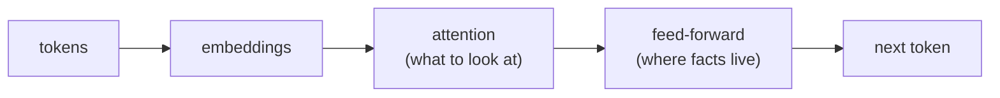

# Lesson Prep

A method for writing study lessons that make a learner sound genuinely knowledgeable in a real conversation — not like someone who did a crash course. Optimized for interview and exam prep, but works for any subject.

## Operating principles

**Depth = discourse, not definitions.** Write like an expert giving a considered explanation. Teach the underlying problem, why the concept exists, the tradeoffs, and the takeaway the learner can actually deploy in conversation. A lesson that only defines the term has failed. The test: after reading, could the learner hold their own if an interviewer probed *why* and *what breaks*?

**Assume zero background.** Do not assume the learner knows prerequisite jargon. Expand every acronym to its full form on first use. When an unfamiliar prerequisite concept first appears, give a short plain-English rundown so the learner can keep their head around the main thread — usually as a sentence or two of ordinary prose, and only as an alert box when it genuinely deserves a "stop and orient" callout (see below).

**Show relationships as diagrams.** Wherever two or more entities relate — a pipeline, a hierarchy, a flow, a before/after — draw a small Mermaid diagram (see the Diagrams section). A diagram that shows how the pieces connect is worth more than a paragraph describing the connection. Don't force one where there's no real structure to show.

**Scope discipline.** A concept that owns its own lesson elsewhere in the syllabus is *referenced and linked*, never taught inline. If tokens, embeddings, or RAG have their own lessons, mention and link them — don't start explaining them. Before serving any lesson, re-read it and strip anything that has leaked in from another lesson's territory. Leaked scope is the most common defect.

**Never state a hypothesis as fact.** Everything must be accurate. If something is genuinely contested or uncertain, say so plainly; don't invent tidy certainty.

**No fluff.** No preamble, no "in this lesson we will", no closing pep talk. Get into the substance.

## Required structure of every lesson

Follow the template in `references/lesson-template.md`. Every lesson file contains, in order:

1. A short framing of **the problem the concept solves** (open with the pain, not the term).
2. **The analogy, shown** — a single everyday scene, *demonstrated on a concrete instance* (not a mapping list), under a heading titled for the idea. See below.
3. The **explanation as discourse** — the why, the mechanism at a conceptual level, the tradeoffs. Give prerequisites a short primer inline; add a Mermaid diagram wherever entities relate.
4. **Summary / Points to Remember** — the handful of things worth memorizing, phrased as sayable talking points.
5. **Interview Questions That Stump People** — non-obvious only, written as full conversation transcripts. See `references/interview-questions.md`.

## The analogy (one picture, shown)

Each lesson carries exactly **one** memorable analogy — the picture the learner actually carries out of the room and uses to explain the concept to a friend, a stakeholder, or an interviewer. It sits right after the problem framing so it anchors everything that follows. What makes it stick:

- **One, and it must reach the mechanism.** A single canonical analogy that the *deep sections build on*. The test: if a later section has to introduce a second metaphor to explain the core mechanism (e.g. a "baked loaf" for why a model can't count letters, or "it's a search" for query/key/value), the chosen analogy is **wrong** — it doesn't reach the mechanism. The fix is to replace it with the one that does, never to add the second metaphor. Small throwaway illustrations in prose are fine; two pictures competing to *be the concept* is the failure.
- **Everyday and concrete.** A scene from ordinary life — reading, a map, a search box — not another technical metaphor.
- **Shown, not tabulated — this is the load-bearing rule.** Demonstrate the analogy by *running it on the same concrete example the lesson uses*, so the correspondence happens in front of the reader. A bulleted `thing = part-of-concept` mapping list is **banned**: it asserts the correspondence instead of teaching it, and it's the single biggest reason an analogy fails to land. Walk one real instance through the scene and let the mapping reveal itself.
- **A one-liner they can say** to a non-technical person who'll instantly get it — woven into the prose, not labeled.
- **Honest about the seams.** If the analogy breaks somewhere important, note it in one line — memorable-but-misleading is worse than none.

Write it as **flowing prose under a descriptive section heading** — no labeled sub-parts. Do **not** use `**The picture:** / **The mapping:** / **Why it holds:** / **Say it like this:** / *Where it breaks:*` headers; that fill-in-the-blank scaffold reads as a worksheet and is what made earlier lessons feel mechanical. The section still does all those jobs — paint the scene, show it on a worked instance, land the sayable line, flag the seam — but as teaching prose a person would actually speak. Title the section for the idea (e.g. "The model reads the way you do", "Meaning becomes a place on a map", "Every word runs a search"), not "The one analogy to remember".

## Alert boxes: use sparingly

Alert boxes are a spotlight, not a container. If everything is in a box, nothing stands out and the lesson reads like a stack of flashcards. Default to ordinary prose. Reserve GitHub-style admonitions for two jobs only:

- `> [!NOTE]` — a genuine "stop and orient" primer for a prerequisite the reader must grasp to follow the thread, and only when a plain inline sentence wouldn't do. A short, well-known term gets a clause in the prose, not its own box.
- `> [!TIP]` — the rationale box that accompanies a clarify-back interview question (why you clarify there and what it signals).

```
> [!NOTE]
> **RNN (Recurrent Neural Network)** — plain-English rundown of what it is,
> why it mattered, and its flaw, in 2–4 lines. Just enough to follow the thread.
```

Rule of thumb: no more than a few `[!NOTE]` boxes per lesson. A glossary or vocabulary page uses none — it is a categorized list, not a wall of boxes.

## Diagrams (Mermaid)

When entities relate — a pipeline, an architecture, a hierarchy, a flow with a branch, a before/after — draw a **Mermaid** diagram in a ` ```mermaid ` fenced block, placed right where the relationship is introduced. Mermaid renders as a real diagram in GitHub, VS Code, Obsidian, and most Markdown viewers, so use it instead of ASCII art. Keep diagrams small and legible, label the edges, and keep the style consistent across the book. Only add one where there is real structure to show — don't force it.

Use `flowchart LR` (left-to-right) for pipelines and architecture, `flowchart TD` (top-down) for hierarchies. Use `<br/>` for line breaks inside a node label. Example:



## Interview questions: transcript format

The interview section contains **stumpers only** — never the obvious "what is X?". Each question is written as a real back-and-forth conversation, because that is how they actually land. **Every question ends with a `> [!TIP]` rationale** explaining *why the answer is the strong move* — the trap it avoids, what it signals to the interviewer, the reasoning that makes the learner confident responding that way. The rationale is the point: it turns a memorized answer into an understood one. Some questions are also best answered by first asking a clarifying question (signals seniority); for those, put the interviewer's line, your clarify-back, their response, and your final answer each on its **own labeled line**, and the rationale covers why clarifying was right too. Full format and worked examples are in `references/interview-questions.md`.

## Deliverables and bookkeeping

A lesson set is a small "book". Maintain two **separate** files:

- **Table of Contents** (e.g. `README.md`) — the linked index the learner reads the book from. Links to every lesson.
- **Tracker** (e.g. `TRACKER.md`) — a change registry: what is done, what is left, and what changed when. This is for *managing the work*, distinct from the ToC which is for *reading*.

File and folder rules:
- Markdown only. No HTML unless the user explicitly asks.
- **Never use a `00` prefix.** Category folders and lesson files are numbered starting at `01`. A primer/glossary folder, if any, is named plainly (e.g. `primers/`), not numbered.
- One lesson per turn by default. After writing a lesson, run lesson-eval, apply fixes, then tick its box in the Tracker and ToC and update the progress count.

## Workflow

1. Agree the syllabus and structure with the user **before** creating files. Propose; wait for the go-ahead.
2. Write one lesson to the standard above.
3. **Gate it: run the `lesson-eval` skill. The lesson must PASS before you show it to the user.** Fix and re-check if it fails.
4. Update Tracker + ToC. Move to the next lesson.
