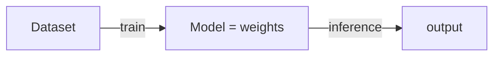

# Lesson Template

Use this shape for every lesson. Headings are fixed; prose is yours. Keep it discourse-depth — teach, don't define.

```markdown
# <Concept name>

## The problem it solves
Open with the pain or the question nobody could answer before this concept
existed. Make the reader feel why it was needed. No "in this lesson".

## The one analogy to remember
One memorable everyday scene the learner can reuse to explain the concept to
anyone. Plain prose with bold labels (not an alert box):

**The picture:** <everyday scene, named and vivid>.
**The mapping:** <thing> = <part of concept>; <thing> = <part>; …
**Why it holds:** <one sentence tying the scene to the real mechanism / design reason — why it's faithful, not decorative>.
**Say it like this:** "<one sentence a layperson instantly gets>"
*Where it breaks:* <one line, only if there's a genuinely misleading seam>.

## <Discourse body — one or more substantive sections>
Explain the concept as an expert would in conversation: the core insight, the
mechanism at a conceptual level, and — critically — the tradeoffs and the "so
what". Give prerequisite terms a short inline primer as they appear; reserve a
`> [!NOTE]` box for the rare term that genuinely needs a stop-and-orient callout
(see the alert-box restraint rule in SKILL.md).

Wherever entities relate — a pipeline, hierarchy, flow, or before/after — draw a
small **Mermaid** diagram (` ```mermaid ` block) right where you introduce the
relationship; it renders as a real diagram in most Markdown viewers. For example:



Surface the takeaway the reader can actually say out loud in an interview
("the sharp framing is …"). Reference — do not re-teach — concepts that have
their own lesson; link them.

## Summary / Points to Remember
- 4–7 bullets, each a sayable talking point, not a dictionary definition.
- Include the one causal chain or framing that separates a knowledgeable answer
  from a memorized one.

## Interview Questions That Stump People
See references/interview-questions.md for the transcript format and the
clarify-back convention. Stumpers only — no "what is X".
```

## Checklist before you consider a lesson done
- Would the reader survive a "why?" and a "what breaks?" follow-up? If not, go deeper.
- Exactly one memorable everyday analogy, with an explicit mapping and a sayable one-liner.
- Every acronym expanded on first use; prerequisites primed inline, with a `[!NOTE]` box only where one truly earns it (few per lesson).
- A Mermaid diagram appears wherever entities genuinely relate.
- Nothing taught that belongs to another lesson (linked instead).
- Summary bullets are talking points, not definitions.
- Interview questions are non-obvious, in transcript form, and each ends with a rationale.
- No hypothesis dressed up as fact.
