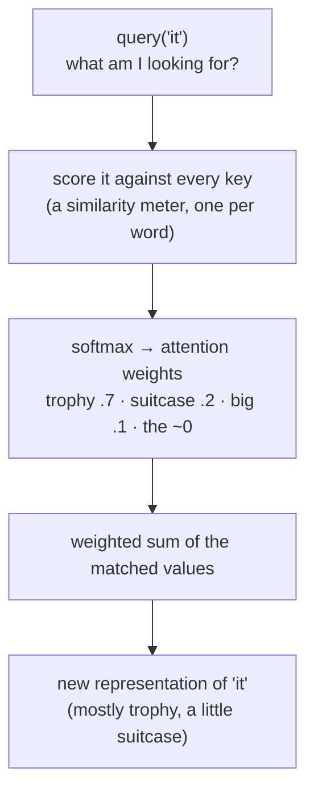
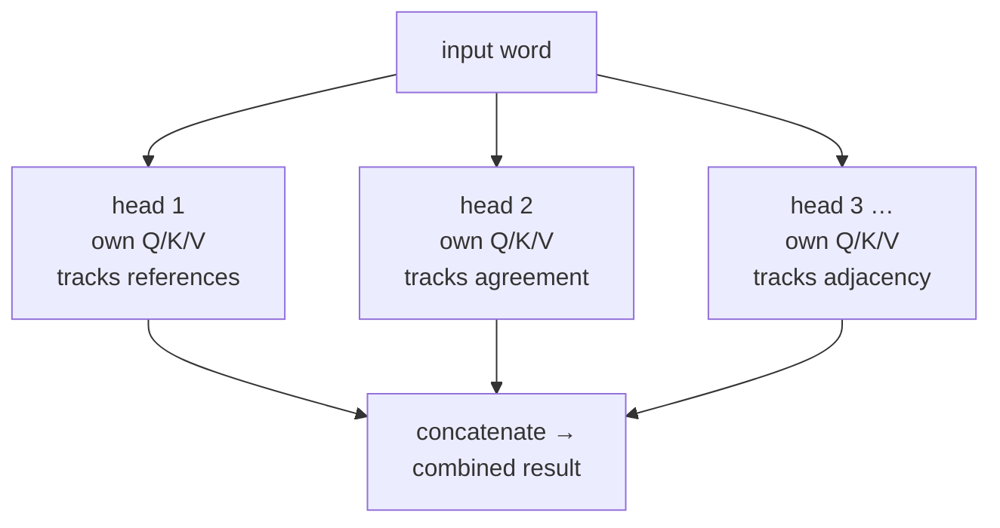

# Attention

## The problem it solves

[Transformers](04-transformers.md) gave us the promise — let every word look at every other word at once — but "looking at" is doing a lot of work in that sentence. What does it actually mean for one word to *look at* another and pull meaning from it? A word can't just grab every other word wholesale; that would be noise. It needs to decide, for its own purposes, *which* other words matter and *how much*.

Go back to the sentence from the transformers lesson: "The trophy wouldn't fit in the suitcase because **it** was too big." The word *it* needs context to resolve — but not from every word equally. It needs a lot from *trophy* and *suitcase*, some from *big*, and essentially nothing from *the* or *because*. The hard part isn't connecting words; it's connecting them **selectively and by degree**. Attention is the mechanism that does exactly this: for every word, it computes a weighted blend of the other words, where the weights are figured out on the fly from the content itself.

That word — *selectively* — is the whole game. Attention is not "each word sees all the others." It's "each word decides how much of each other word to let in."

## Every word runs a search

Take the sentence the last section left hanging: "The trophy wouldn't fit in the suitcase because **it** was too big." The word *it* has a problem — which noun does it stand for? — so it runs a search.

*It* types a query: roughly, "I'm a pronoun; which concrete noun here could I be pointing at?" Every other word has posted a listing whose title says what it can offer — *trophy* and *suitcase* both advertise "I'm a concrete noun a pronoun could refer to," while *the* and *because* advertise nothing that matches. The search ranks the hits — *trophy* .7, *suitcase* .2, *big* a little, *the* and *because* ≈ 0 — and *it* pulls in the *contents* of the top hits, blended by their rank. Its new, in-context meaning becomes mostly "trophy," with a trace of "suitcase."

The catch that makes it attention and not just a search box: every word runs this same search at the same time, and each word is simultaneously *typing a query* and *posting its own listing* for everyone else's searches. Three things do all the work, and they run through the rest of this lesson: the **query** (what a word is looking for), the **key** (the listing it advertises), and the **value** (the contents that flow in when it's picked).

One line to carry out of here: **attention is every word running a search — matching what it's looking for against what every other word advertises, then pulling in the contents of the best matches, blended by how well they matched.** Where the picture leaks: in a real search the searcher and the documents are separate things, but here every word is both at once — searcher and document — and it's searching only the handful of words in front of it, not a standing library.

## Query, key, value — the sharpest intuition

The mechanism is usually explained with three roles, and they map cleanly onto something human. Every word (technically every token — see [Tokenization](01-tokenization.md)) produces three things:

- **Query** — *what am I looking for?* The word *it* emits a query that essentially asks, "I'm a pronoun; which noun do I refer to?"
- **Key** — *what do I offer?* Every word advertises a key — a label saying what kind of information it can provide. *Trophy* and *suitcase* offer keys that say "I'm a concrete noun that a pronoun could point to."
- **Value** — *what do I actually carry?* If a word gets picked, this is the content that flows into the asking word.

This is the search from the analogy, now named: the query is what a word types in, the key is the listing every word advertises, the value is the contents that flow in when a listing matches. Attention matches each word's query against every word's key to decide relevance, then pulls in the values of whatever matched, weighted by how well it matched.

> [!NOTE]
> **Vector** — query, key, and value are each a *vector* (an ordered list of numbers; see the [ML vocabulary primer](../primers/ml-vocabulary.md)). Here, just hold that each word becomes a handful of numbers, and closeness between two of them means "related in meaning." Where those numbers come from is its own topic — see [Embeddings](02-embeddings.md).

The subtle point people miss: query, key, and value are **not three different inputs**. They're three different *views of the same word*, each produced by running the word's vector through a small learned transformation. The model learns, during [training](../primers/ml-vocabulary.md), how to turn a word into a good "what I'm looking for," a good "what I offer," and a good "what I carry." So the same word plays all three roles at once — asker, advertiser, and content-provider — depending on whose turn it is to look.

## Attention weights — where the "how much" lives

Once every word has a query and every word has a key, the model compares each query against each key to get a **similarity score**. High score means "this key is a good answer to my query." The specific comparison it uses is the **dot product** — you multiply the two number-lists position by position and add it all up, giving a large result when they point the same way and a small one when they don't. You don't need the arithmetic; just hold that it's a cheap similarity meter, and attention runs it between every query and every key.

Those raw scores are then squashed into **attention weights** — a set of fractions that add up to 1 for each word. This is what turns "raw relevance" into "how I'll split my attention." If *it* gives 0.7 to *trophy*, 0.2 to *suitcase*, and scatters the last 0.1 across everything else, those are its attention weights, and its new representation becomes mostly the *value* of *trophy* with a dash of *suitcase*.

> [!NOTE]
> **Softmax** — the step that converts a row of raw similarity scores into weights that are all positive and sum to 1. It exaggerates: the biggest score gets a disproportionately large share, small ones get squeezed toward zero. That "sum to 1" property is a budget — and it matters later, because a fixed budget spread over more words means less for each.

The takeaway to say out loud: **attention weights are a soft, learned, content-based lookup.** Not a hard "pick one," but a blend; not hardcoded, but computed fresh from what the words actually are; and it happens for every word simultaneously.

## Why this captures long-range dependencies directly

This is the property that made attention win, and it's worth being precise about *why*. In the old [RNN (Recurrent Neural Network)](../primers/ml-vocabulary.md) approach, for word 100 to be influenced by word 1, the signal had to survive being passed hand-to-hand through 99 intermediate steps — and it decayed along the way, like a rumor down a long line of people.

Attention has no line. Word 100's query compares against word 1's key **directly**, in a single step. The "distance" between any two words is always one hop, whether they're adjacent or a thousand words apart. That's the real meaning of "captures long-range dependencies": not that attention has better memory, but that it **abolishes distance entirely** — every pair of positions is equally reachable.

The sharp framing: **RNNs made distant words hard to connect because information had to travel; attention makes distance irrelevant because every word talks to every other word in one shot.** That directness is the feature. It is also — as we'll see — the source of the cost.

## Multi-head attention — and why one big attention isn't enough

If you run the query/key/value process once, you get **one** set of attention weights per word — one opinion about what's relevant. The problem: a single opinion has to average together every *kind* of relationship at once. But words relate along many axes simultaneously. In "the trophy wouldn't fit because it was too big," one relationship is grammatical (which noun does the pronoun bind to?), another is about size and physical fit, another is plain word adjacency. Forcing one attention pattern to serve all of these means it does each one blurrily.

**Multi-head attention** runs the whole mechanism several times in parallel — each run is a "head" — with each head using its *own* learned query/key/value transformations. A **head** is just one independent copy of the attention mechanism running alongside the others; models don't run one giant attention, they split it into many smaller heads (a large model might have dozens per layer). Because they're independent, the heads specialize: one head can learn to track pronoun references, another to track subject-verb agreement, another to look at the immediately preceding word. Their results are then combined.

It's the difference between reading a contract with one highlighter and reading it with a team where one person watches definitions, one watches dates, and one watches obligations — same text, several passes, each tuned to a different pattern. Because each head works in a lower-dimensional slice, several heads together cost about the same as one big one — you get diversity of attention roughly for free, which is why it's standard rather than a luxury.

Why not just make a single attention head bigger instead? Because size gives one head more capacity, but it's still **one** weighting — one probability distribution summing to 1 over the other words. It can emphasize more, but it can't simultaneously commit fully to "the pronoun's antecedent" *and* "the adjacent word" *and* "the matching verb," because those want different words to win. Multiplicity, not size, is what buys parallel relationships. That's the point that separates a real answer from a memorized one.

## The failure modes you own in an interview

### 1. Attention cost is quadratic — and here's the mechanism-level why

This is the single most important cost fact about the architecture, and you should be able to derive it, not just recite it.

Every word emits a query. That query must be compared against the key of **every** word in the input, because attention refuses to assume anything is irrelevant in advance — deciding relevance *is* its job. So if there are N words, each of the N queries does N comparisons. N queries times N keys = **N × N = N² comparisons**. That's the whole derivation.

The consequence is the shape of the curve: 10 words is 100 comparisons; 100 words is 10,000; 1,000 words is 1,000,000. **Double the input and the attention work roughly quadruples** — it grows with the *square* of the length, not in proportion to it. This isn't an implementation wart you can optimize away with better code; it's baked into "compare everything to everything." Approaches that beat it (sparse or approximate attention) do so by *giving up* some of the every-word-to-every-word completeness — they trade the guarantee for the speed.

The sayable version: **attention is quadratic because relevance is computed, not assumed — every word has to check every other word to find out what matters, and "every-to-every" over N things is N².** The limits this imposes on how much you can feed a model, and what to do about it, belong to [Context windows](05-context-windows.md); the reason the *cost per new token* stays manageable during generation despite all this is [KV (key/value) caching](../05-prompting/30-kv-caching.md) — it reuses the keys and values above rather than recomputing them. Your job is the mechanism: why the curve bends the way it does.

### 2. Attention gets diluted over long inputs — the "lost in the middle" tendency

Recall the softmax budget: each word's attention weights sum to 1. That's a *fixed* budget being divided among all the other words. When the input is short, a handful of words split the budget and each relevant one gets a healthy share. When the input is enormous — tens of thousands of words — that same budget of 1 is spread thin, and a genuinely relevant word can end up with only a sliver of weight, drowned out by the sheer number of competitors soaking up small amounts each. The signal is still connected directly; it's just faint.

On top of the arithmetic, models have shown an empirical tendency to use information at the **beginning and end** of a long input more reliably than information buried in the **middle** — the pattern often called "lost in the middle."

A caution on certainty here: the dilution-from-a-fixed-budget effect is a direct property of the softmax mechanism. The specific "middle gets neglected" pattern, though, is an *observed behavioral tendency* reported across several models, not a guaranteed law — its strength varies by model and setup, and it's an active area of study. Say it as a tendency to watch for, not a constant.

The mechanism is yours to explain; the *product* consequences — why you can't just keep enlarging the prompt, and what to do instead — are [Context windows](05-context-windows.md) territory. The one-liner that ties it together: **a bigger context window is not the same as bigger attention to any one thing in it; the attention budget is fixed, so more content means a thinner slice each.**

## Summary / Points to Remember

- Attention isn't "every word sees every word." It's **every word decides how much of each other word to let in** — selective, by degree, computed from content.
- **Query / Key / Value = what I'm looking for / what I offer / what I carry.** Crucially, they're three learned *views of the same word*, not three separate inputs. The mental model is a search: query matches keys, matched values flow in.
- **Attention weights are a soft, content-based lookup** that sums to 1 — a blend, not a pick, computed fresh for every word at once.
- Attention captures long-range dependencies because it **abolishes distance**: any two words connect in one hop, versus an RNN where signal decays across many steps. Directness is the feature.
- **Multi-head** wins through *multiplicity, not size*: one head is one weighting that must average all relationship types; many heads each specialize (references, agreement, adjacency) in parallel.
- **Quadratic cost, derived:** N queries each compare against N keys → N² comparisons. It's quadratic because relevance is *computed, not assumed* — every word must check every other word. Double the input, quadruple the work.
- **Dilution / "lost in the middle":** the softmax attention budget sums to 1, so more words means a thinner slice each; models also empirically lean on the start and end of long inputs over the middle — state it as a tendency, not a law. Product implications live in [Context windows](05-context-windows.md).

## Interview Questions That Stump People

**Q: "Attention lets any word reach any other word directly. So why do models still lose track of things in a long document?"**

**Interviewer:** You just told me attention connects every word to every other word in one step. If that's true, why does quality fall off when we stuff a huge document into the prompt?

**You:** Because "connected" and "attended to" aren't the same thing. Every word is still directly reachable — the wiring is there — but each word's attention weights are forced to sum to 1, so it's a fixed budget being divided among all the other words. In a short input, a relevant word gets a big share. In a 50,000-word input, that same budget is spread across tens of thousands of competitors, and a genuinely relevant word can end up with a sliver — the signal is faint, not absent. On top of that, models empirically tend to rely on the beginning and end of long inputs more than the middle, the "lost in the middle" tendency. So the failure isn't broken connectivity; it's diluted attention over a fixed budget. That's exactly why you don't just keep growing the prompt — but the product fix is a context-window question.

> [!TIP]
> **Why this answer works:** The question is a trap built from your own earlier claim — "any word reaches any other directly" — daring you to either contradict yourself or hand-wave. The strong move is to split *connectivity* from *allocation*: the wiring is intact, but the softmax budget of 1 is finite, so more competitors means a thinner slice each. That distinction shows you understand attention as a mechanism with a resource constraint, not a slogan. Naming "lost in the middle" as an *empirical tendency* (not a law) adds honesty, and deferring the fix to context windows signals you know where this topic's boundary sits instead of over-claiming.

---

**Q (clarify-back): "Our RAG (Retrieval-Augmented Generation) feature gets *worse* as we add more retrieved documents to the prompt. Is that a retrieval problem or a model problem?"**

**Interviewer:** We built retrieval-augmented answers. Counterintuitively, when we retrieve more passages and put them all in the prompt, answer quality drops. Retrieval bug, or model limitation?

**You (clarify back):** Before I call it — when the answer is wrong, is the correct passage actually *in* the prompt but ignored, or is it missing from what got retrieved? And roughly where in the prompt does the right passage tend to sit?

**Interviewer:** The right passage is almost always in there — often somewhere in the middle of the pile — the model just doesn't seem to use it.

**You:** Then it's not primarily a retrieval problem — retrieval is finding the passage. It's the attention-dilution failure mode. You're spreading a fixed attention budget across many passages, so each relevant sentence gets a thinner slice, and the "lost in the middle" tendency means a passage buried in the pile is exactly where the model attends least. Adding *more* documents makes both effects worse, which is why quality drops as you add context. The fix isn't more retrieval — it's *better* retrieval: fewer, higher-precision passages, and ordering them so the most relevant ones aren't stranded in the middle. If the right passage had been *missing*, I'd have said the opposite — that's a retrieval-quality problem and no amount of attention tuning saves you.

> [!TIP]
> **Why clarify here:** "Retrieval problem or model problem?" has opposite answers depending on one fact — is the needed information present-but-ignored, or absent? Present-but-ignored points at attention dilution; absent points at retrieval. Asking pins that down and shows you know these are two distinct failure modes that happen to produce the same symptom, instead of guessing.

---

**Q: "Why bother with multiple attention heads? Why not one big, more powerful attention?"**

**Interviewer:** Heads add complexity. Why not just make a single attention mechanism bigger and stronger?

**You:** Because the constraint isn't capacity, it's that one head produces exactly one weighting — one distribution that sums to 1 over the other words. Words relate along several axes at once: a pronoun binds to its antecedent, a verb agrees with its subject, a word leans on its neighbor. A single weighting has to average all of those into one blurry emphasis, and making it bigger just gives it a more detailed *single* opinion. Multiple heads each get their own query/key/value transformations, so one head can commit fully to tracking references while another commits to adjacency — genuinely parallel relationships, not one averaged one. It's multiplicity that buys that, not size. And because each head works in a smaller slice, several heads cost about the same as one big one, so there's little reason not to.

> [!TIP]
> **Why this answer works:** The naive answer treats "more heads" as just "more power" and stalls on why you wouldn't get the same from one larger head. The strong move reframes the constraint from *capacity* to *shape*: one head is one probability distribution summing to 1, so it can only pick one emphasis, and a bigger head just sharpens that single opinion. Saying "multiplicity, not size" and grounding it in concrete relationship types (references, agreement, adjacency) proves you understand *what* the extra heads buy. Closing with the cost point — smaller slices, so many heads ≈ one big one — shows you know it's a near-free structural win, not a tradeoff.

---

**Q: "Walk me through why doubling the input more than doubles the attention cost."**

**Interviewer:** People say attention is "quadratic." Derive it for me — why does doubling the input roughly quadruple the work rather than double it?

**You:** Every word emits a query, and attention won't assume anything is irrelevant in advance — figuring out relevance is the whole point — so each query has to be compared against the key of every word in the input. With N words, that's N queries times N keys, so N² comparisons. Now double the input to 2N: you get 2N queries each checking 2N keys, which is 4N² — four times the work, not two. The square is baked into "compare everything to everything." That's also why the workarounds — sparse or approximate attention — have to *drop* some of the every-to-every comparisons: the only way to beat N² is to stop checking everything against everything, which trades away some of attention's completeness for speed.

> [!TIP]
> **Why this lands:** naming it "quadratic" is memorization; deriving it from "N queries each check N keys, and relevance is computed not assumed" is understanding. The follow-up interviewers love is "so how would you make it cheaper?" — and the honest answer names the tradeoff (you give up completeness), which shows you know there's no free lunch.

---

**Q: "Query, key, and value — those are three different things we feed the model, right?"**

**Interviewer:** So to do attention, we give it a query, a set of keys, and a set of values as three inputs?

**You:** That's the common misread. They're not three inputs — they're three *views of the same words*. Each word's vector gets run through three small learned transformations to produce its query, its key, and its value. So the same word is simultaneously an asker ("what am I looking for"), an advertiser ("what do I offer"), and a content-provider ("what I carry"). The model *learns* how to make each view good during training. Thinking of them as separate inputs is what leads people to picture attention as a database you hand three things to, when really it's the words interrogating each other, each playing all three roles at once.

> [!TIP]
> **Why this answer works:** The question is phrased as a friendly confirmation — "right?" — which tempts you to agree and reveal the exact misconception the interviewer is fishing for. The strong move is to correct the premise cleanly: three learned *views of the same word*, produced by three transformations, not three separate inputs. That the model *learns* those projections during training is the detail that proves you understand where Q/K/V come from rather than treating them as given. Ending by naming the wrong mental model it produces — "attention as a database you hand three things to" — shows you know why the misread matters, not just that it's wrong.
