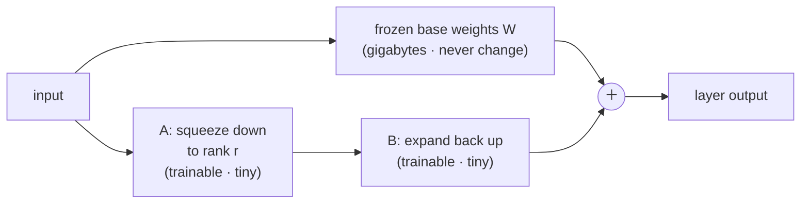
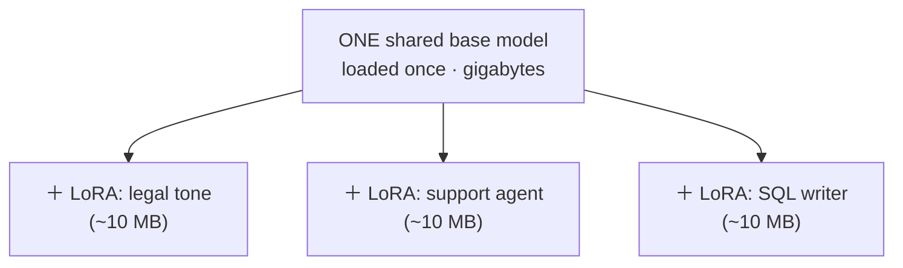

# LoRA (Low-Rank Adaptation)

## The problem it solves

You've met the family this belongs to: [PEFT](08-peft.md) — parameter-efficient fine-tuning — is the idea of freezing the giant pretrained model and training only a tiny sliver of new parameters instead of the whole thing. That reframes the question but doesn't answer it. *Which* tiny sliver? Where do you put the trainable parameters, and how few can you get away with before quality falls apart?

Here's the concrete pain. A modern model's knowledge lives in enormous grids of numbers called weight matrices (see the [ML vocabulary primer](../primers/ml-vocabulary.md) for weights/parameters). [Full fine-tuning](07-fine-tuning.md) nudges *every number* in those grids, which means the thing you produce is the same size as the model you started with — tens of gigabytes — plus you need enough expensive GPU memory to hold a full second copy of everything while you train. Do that for ten customers and you're storing and serving ten separate multi-gigabyte models. That doesn't scale, and it's mostly wasted: the adjustment you actually wanted — "sound like our support team," "always answer in this fixed output format" — is a *small* change, yet you paid for a full model's worth of storage and compute to capture it.

**LoRA** is the method that made PEFT actually win in practice. Its bet is that the change you need is not just small in *effort* but simple in *structure* — simple enough that you can capture it with a trainable add-on thousands of times smaller than the model, and get quality that's often indistinguishable from full fine-tuning for the kinds of adaptation people actually do.

## The one analogy to remember

**The picture:** A master blueprint kept under glass in the vault, and a sheet of tracing paper laid over it. The master is expensive, authoritative, and never marked up. To adapt the design for one client, an engineer lays a thin sheet of tracing paper on top and sketches only the changes; the builder reads the master *and* the tracing together as one drawing.

**The mapping:** the locked master blueprint = the frozen pretrained model's weights; the thin tracing sheet = the small trainable LoRA adapter; reading master-plus-tracing as one drawing = adding the adapter's effect on top of the frozen weights at run time; a different tracing sheet for a different client = a swappable LoRA; the sheet being thin and cheap = the adapter being megabytes, not gigabytes.

**Why it holds:** the tracing sheet stays thin *because the adaptation you need is a handful of changes, not a whole new blueprint* — and that is precisely LoRA's technical bet, that the weight update has a simple, "low-rank" structure carrying far less information than a full-size edit of the master. Thin-because-the-change-is-simple is the mechanism, not a decoration.

**Say it like this:** "LoRA never edits the trained model. It leaves it frozen and lays a tiny, cheap overlay on top that carries only the change you want — so the overlay is megabytes, and you can swap overlays for different jobs on the same base."

*Where it breaks:* a tracing sheet literally sits on top and you see both layers; LoRA's overlay is added *into* the same math, not stacked visually — and the "handful of changes" assumption fails if the change you need is actually large (see the failure mode below).

## Freeze the model, train a thin overlay

The mechanism, conceptually. Take one of those big weight matrices in the model — call it **W**. Full fine-tuning would learn a full-size update to it: a second grid the same shape as W, every cell adjusted. LoRA refuses to do that. It **freezes W entirely** (it never changes) and instead learns the update as *two much skinnier matrices multiplied together*, usually written **A** and **B**. At run time the layer computes its original result from the frozen W, then *adds* the result of the small A-times-B path. Only A and B are trainable; W just sits there.

The whole payoff hinges on one word in that diagram: **rank**.

> [!NOTE]
> **Rank (of a matrix)** — a measure of how much genuinely independent structure a grid of numbers contains: how few underlying patterns you'd need to rebuild it. A grid where every column is a slight variation on a couple of base patterns is *low-rank* — it looks big but carries little real information. A grid where every cell is independent is *full-rank* and can't be compressed. "Low-rank adaptation" means: assume the update the model needs is one of the compressible ones, and store only its few underlying patterns.

That's the trick that makes the overlay thin. Suppose W is a 4,096 × 4,096 grid — about 16 million numbers. A full-size update has 16 million numbers too. But if you force the update to be **A** (4,096 × r) times **B** (r × 4,096) with the rank *r* set to something small like 8, you're now storing only 4,096 × 8 twice — about 65 thousand numbers, well under 1% of the full update. Set *r* and you set exactly how much capacity — and how many megabytes — the overlay gets. That arithmetic, repeated across the model's layers, is the whole reason a LoRA adapter is a few megabytes when the model is tens of gigabytes.

## Why so few knobs is enough

The natural objection: how can under 1% of the parameters possibly capture what a full fine-tune captures? Doesn't fewer knobs mean worse?

The answer is the conceptual heart of LoRA. Pretraining already taught the model almost everything it will ever know — grammar, world facts, reasoning, code. When you fine-tune for a task, you are not re-educating it; you're applying a **focused steer**: adopt a tone, follow a format, prefer one style of answer. A steer like that is *simple* — it plausibly moves the model along a few consistent directions rather than rewiring millions of independent connections. LoRA's founding observation (Hu et al., 2021) was that the weight update needed for such adaptation has a **low intrinsic rank** — it lives in a small number of directions — so a small *r* is enough to hold it, and in their experiments LoRA matched full fine-tuning on the tasks tested. That result has held up well across the industry since, which is why LoRA became the default.

The sharp framing: **capability doesn't come from the *number* of trainable parameters; it comes from whether those parameters can express the change you actually need.** If the change is a simple steer, a low-rank overlay expresses it fully, and the other 99% of parameters would have been wasted motion. This is why "LoRA trains fewer parameters, so it must be worse" is the wrong mental model — it confuses the size of the tool with the size of the job.

Hold this as an empirically strong bet, not a theorem. LoRA works *because adaptation tends to be low-rank in practice* — it is not a mathematical guarantee that every change you might want is compressible. When it isn't, LoRA underfits; that's the failure mode below, and it's worth knowing rather than glossing.

## The payoffs a PM actually cares about

Three consequences fall straight out of "frozen base + thin trainable overlay," and they're the reasons LoRA shows up in product decisions:

- **Tiny artifacts.** A LoRA adapter is megabytes, not the gigabytes of a full model. You can store hundreds of them, version them like code, ship one over the wire in seconds, and email one to a colleague. A full fine-tune produces a fresh multi-gigabyte model each time.
- **Cheap to train.** You're optimizing under 1% of the parameters and you don't need GPU memory for a full second copy of the model's update machinery, so a fine-tune that once demanded a cluster can run on far less hardware, faster and cheaper.
- **Many adapters, one shared base — the big one.** Because the base is frozen and identical for every adapter, you load **one** copy of the model into GPU memory and keep a library of small adapters beside it, applying the right one per request. That's how a vendor can serve hundreds of "custom fine-tuned models" on a handful of GPUs: it's one base plus hundreds of megabyte-scale overlays, not hundreds of models.

One serving nuance worth carrying: an adapter can also be **merged** permanently into the frozen weights, producing a standalone model with zero extra inference cost — you trade back the swappability for raw speed. So LoRA gives you a choice at deploy time: keep adapters separate and swappable, or bake one in for a single-purpose model.

## QLoRA: shrink the frozen base too

Notice that the base model sits in memory *frozen* the entire time — LoRA never updates it, only reads it. That's an opening. **QLoRA (Quantized LoRA)** loads that frozen base in a compressed, lower-precision form to slash its memory footprint, then trains the LoRA adapter on top in normal precision. Because the base is never being learned, storing it more coarsely costs very little quality, and the memory saved is dramatic — it's what lets people fine-tune a very large model on a single consumer GPU. The compression technique itself is its own topic: see [Quantization](14-quantization.md). Here, just hold the combination: **LoRA already froze the base; QLoRA additionally compresses that frozen base to fit the training onto smaller hardware.**

## Tradeoffs, and the failure mode to name

Versus [full fine-tuning](07-fine-tuning.md):

- **LoRA wins** on storage, training cost, swappability, and safety of the original — since the base is frozen, you can't degrade its general abilities the way a full fine-tune sometimes does, and you can always throw the adapter away and you're back to the untouched model.
- **Full fine-tuning has a higher ceiling** when the change you need is genuinely large — a deep new capability or a substantial shift in behavior across the whole model — because it can move every parameter, not just a few directions.

The failure mode to know: **if the adaptation you need is *not* low-rank, a small *r* underfits and LoRA quietly plateaus below what you wanted.** The fix ladder is: raise the rank (bigger overlay, more capacity, still far cheaper than full fine-tuning), and if it still won't close the gap, the change may be too big for an overlay and full fine-tuning is warranted. And a common misdiagnosis: reaching for LoRA (or any fine-tuning) to *inject a body of new facts*. Fine-tuning teaches behavior far more reliably than it stores knowledge — knowledge that must be current or precise usually belongs in [retrieval](../04-retrieval-knowledge/21-rag.md), not baked into weights. Turning up the LoRA rank won't rescue a task that was never a fine-tuning problem to begin with.

## Summary / Points to Remember

- **LoRA freezes the whole pretrained model and trains a small add-on** — two skinny matrices whose product is added on top of the frozen weights. Only the add-on learns; the base never changes.
- **The bet is that adaptation is *low-rank*** — a focused steer (tone, format, style) lives in a few directions, so a tiny overlay captures it. Say it as: *capability comes from whether the parameters can express the change, not from how many there are.*
- **The rank *r* is the dial:** small *r* → tiny adapter and less capacity; larger *r* → bigger adapter and more capacity. That dial is why adapters are megabytes while models are gigabytes.
- **The payoffs:** megabyte-scale artifacts, cheap fast training, and — the headline — **one shared frozen base serving many swappable adapters**, which is how hundreds of "custom models" run on a few GPUs.
- **QLoRA = LoRA on a *compressed* frozen base.** Since the base is frozen anyway, quantizing it costs little and fits large-model fine-tuning onto small hardware.
- **Failure mode:** if the needed change isn't low-rank, a low *r* underfits — raise the rank, then consider full fine-tuning. And don't use LoRA to cram in new knowledge; that's a retrieval job.

## Interview Questions That Stump People

**Q (clarify-back): "We want to fine-tune a model for our product. LoRA or full fine-tuning?"**

**Interviewer:** We've decided to fine-tune. Should we do LoRA or a full fine-tune?

**You (clarify back):** Two things decide it — first, is the goal to *steer behavior* like tone and format, or to teach a genuinely new capability the base can't do? And second, will we serve one model or lots of customer-specific variants?

**Interviewer:** It's mostly getting the voice and output format right for our brand, and eventually we'd want a slightly different flavor per enterprise customer.

**You:** Then LoRA, clearly. A voice-and-format steer is exactly the kind of small, low-rank change LoRA captures at near full-fine-tuning quality, and "a different flavor per customer" is the case LoRA is built for — one frozen base in memory with a swappable megabyte-scale adapter per customer, instead of storing and serving a separate multi-gigabyte model for each. Full fine-tuning would only earn its cost if we were chasing a deep new capability across the whole model, which a brand-voice task isn't.

> [!TIP]
> **Why this works:** "LoRA or full fine-tune" has no context-free answer — it turns on the *nature* of the change and the *serving pattern*, and answering instantly would hide that you know what actually drives the choice. The two clarifying questions pin down both variables at once, and they signal you've reasoned about serving economics, not just training. Once "brand voice" and "per-customer variants" are on the table, LoRA follows directly — and naming the one condition that would flip it (a deep new capability) shows you're not just reciting "LoRA is cheaper."

---

**Q: "If LoRA only trains under 1% of the parameters, how can it possibly match full fine-tuning? Fewer knobs should mean worse results."**

**Interviewer:** It just seems like you're strictly handicapping yourself. How is training 1% of the parameters not obviously worse?

**You:** Because capability doesn't come from the *count* of trainable parameters — it comes from whether the parameters you're training can express the change you actually need. Pretraining already taught the model almost everything; a fine-tune for tone or format is a focused steer, and a steer like that tends to be *low-rank* — it moves the model along a few consistent directions rather than rewiring millions of independent connections. So a small overlay expresses it fully, and the other 99% of parameters would have been wasted motion. LoRA matched full fine-tuning in the original experiments precisely because the change was simple enough to be low-rank. The catch is honesty about the assumption: if the change *isn't* low-rank, a small rank underfits — and then you raise the rank or fall back to full fine-tuning.

> [!TIP]
> **Why this answer works:** The question smuggles in "more knobs = better," and the weak candidate either defends LoRA vaguely as "good enough" or concedes it's a compromise. The strong move rejects the premise: separate the *size of the tool* from the *size of the job*, and name the mechanism (low intrinsic rank of the update). Volunteering the failure case — when the change isn't low-rank — shows you hold it as an empirical bet, not a slogan, which is exactly what survives a "what breaks?" follow-up.

---

**Q: "We tried LoRA on our task and the quality plateaued below the full fine-tune. What's the first thing you'd check?"**

**Interviewer:** Same data, same base — LoRA just tops out lower than a full fine-tune did. Where do you look first?

**You:** First suspect is that the rank is too low for the change this task needs — the overlay doesn't have enough capacity, so it underfits. That's cheap to test: turn the rank up and see if the gap closes, since a bigger adapter is still far cheaper than full fine-tuning. If raising the rank keeps helping, the change was bigger than a minimal overlay could hold. But if it *doesn't* close the gap at all, I'd step back and ask whether this is even a fine-tuning problem — if the task actually needs the model to know new facts, neither LoRA nor a full fine-tune stores knowledge reliably, and I'd move that into retrieval instead of blaming the rank.

> [!TIP]
> **Why this answer works:** A plateau invites flailing — more data, more steps, a different base. Naming *rank* first shows you know LoRA's one real capacity dial and that underfitting is its characteristic failure. The move that separates a strong answer is refusing to assume the problem is even solvable by fine-tuning: distinguishing a low-rank shortfall (raise rank) from a knowledge task (use retrieval) proves you diagnose at the level of *what kind of change is needed*, not just "tune harder."

---

**Q: "A vendor claims they serve 500 customer-specific fine-tuned models on just a few GPUs. Plausible, or marketing?"**

**Interviewer:** Five hundred custom models, a handful of GPUs. Real, or are they hand-waving?

**You:** Entirely plausible, and it's almost certainly LoRA. They're not running 500 models — they're running *one* frozen base model loaded into GPU memory, with 500 small adapters, each a few megabytes, applied per request. The base is the expensive part and it's shared; the per-customer part is just the overlay. That's the whole reason LoRA matters for serving economics. What I'd verify is latency under adapter-switching and whether they can batch requests across different adapters efficiently — that's the real engineering constraint, not the storage.

> [!TIP]
> **Why this answer works:** The trap is treating "500 fine-tuned models" as 500 model-sized artifacts, which sounds absurd and tempts a "marketing" answer. Recognizing it as one shared base plus swappable adapters shows you understand LoRA's defining serving payoff, not just its training story. Pivoting to the actual hard part — batching and switching latency — signals you've thought past the brochure to how it's operated, which is what a PM evaluating a vendor is really being asked.

---

**Q: "Our fine-tune won't fit on the GPU we have. Before we rent bigger hardware, what would you try?"**

**Interviewer:** We're out of GPU memory mid-fine-tune. Renting a bigger box is the obvious move — anything to try first?

**You:** QLoRA, before spending on hardware. The base model sits in memory frozen the entire time we train a LoRA — we never update it — so we can load it in a compressed, lower-precision form to shrink its memory footprint dramatically, and train the adapter on top in normal precision. Because the base is never being learned, compressing it costs very little quality, and the memory saved is often enough to fit the whole job onto the hardware we already have. Renting a bigger GPU is the fallback if even that doesn't fit.

> [!TIP]
> **Why this answer works:** The reflex is to solve a memory problem by buying more memory. The insight the question is fishing for is *why* compressing the base is nearly free — and the reason is specific: the base is frozen, so its precision barely affects the result. Naming QLoRA and giving that "frozen, so quantizing is cheap" justification shows you understand the interaction between LoRA and quantization, not just two buzzwords side by side — and leading with the cheaper fix before the spend is the instinct a PM is expected to show.
