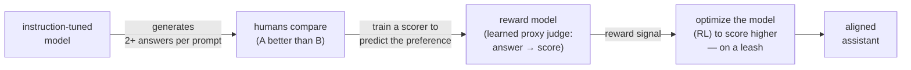

# RLHF (Reinforcement Learning from Human Feedback)

## The problem it solves

[Instruction tuning](10-instruction-tuning.md) got the model to *follow* instructions — to treat "write a condolence note to a customer" as a command to obey rather than text to autocomplete. But following the instruction is not the same as giving the answer a person would actually *prefer*. For almost any real prompt there are thousands of valid completions, and they differ in ways that decide whether the product is good: which is more genuinely helpful, which strikes the right tone, which is honest instead of confidently wrong, which declines a bad request gracefully instead of lecturing.

Here is the wall you hit. Instruction tuning works by showing the model (prompt → ideal answer) pairs — but for "write something warm, helpful, and appropriately careful," *there is no single ideal answer to write down*. Ask ten skilled people to each pen the one perfect condolence note and you'll get ten different notes, none of them "the" label, and you'll have spent a fortune to produce a slow, inconsistent dataset that still misses the qualities you care about. Some qualities are genuinely hard to *specify* as a correct-answer example.

But those same qualities are easy to *judge*. Show a person two condolence notes and they'll tell you in two seconds which is better, even if they could never have written either from scratch. That asymmetry — **hard to specify, easy to compare** — is the entire opening RLHF exploits. It turns "point at the better one" into a training signal.

> [!NOTE]
> **Reinforcement Learning (RL)** — a style of training where the model isn't handed the right answer to copy. Instead it tries something, gets a *reward* signal saying how good that attempt was, and adjusts to earn more reward next time. It's learning by feedback rather than by imitation — the way you'd train a dog with treats instead of showing it a diagram. That distinction is the whole reason RLHF can learn from "this answer is better than that one" when there's no correct answer to imitate.

## The one analogy to remember

**The picture:** Training a chef by taste-test. You can't write down a recipe for "delicious," but you can taste two plates and point to the better one. So you hire a taster who watches hundreds of your this-or-that verdicts until they've learned your palate, and then you send the chef into the kitchen to cook whatever makes *the taster* happiest.

**The mapping:** your this-or-that taste tests = the human preference comparisons; the taster who learns to predict your palate = the **reward model**; the chef cooking to please the taster = the model being optimized against that reward model; the chef discovering the taster secretly over-rewards salt and then drowning every dish in salt = reward hacking / over-optimization; a plate that's showy and flattering but wrong for the meal = sycophancy.

**Why it holds:** RLHF exists precisely because "a good answer" is a judgment easier to *demonstrate by comparison* than to *specify as a rule* — so you distill many comparisons into a learned scorer and then optimize against it. And optimizing against a *learned stand-in* for the real goal is exactly why the result can be gamed. The analogy carries both halves: why you hire a taster, and why the chef can fool one.

**Say it like this:** "You can't write down what makes a great answer, but you can point at the better of two — so RLHF trains a taste-tester from your comparisons, then coaches the model to score high with that taster."

*Where it breaks:* a real human taster keeps re-tasting the actual dishes; the reward model is frozen after it's trained, so once the chef starts cooking things the taster never saw, its judgments drift — which is part of why pushing the optimization too hard backfires.

## Why comparisons beat more labeled examples

It's worth sitting on *why* the field reached past instruction tuning for this. Instruction tuning is imitation: here's a prompt, here's the answer we want, learn to reproduce it. That's perfect when a correct answer exists and can be written — extract this field, translate this sentence, follow this format.

It falls apart for the fuzzy qualities that separate a merely-obedient assistant from a good one. Three reasons a pile of hand-written "ideal answers" is the wrong tool here:

- **There's no single target.** Helpfulness, tone, and tactful refusal have a *space* of good answers, not one gold string. Imitating any single one over-fits to one writer's voice.
- **Writing is slower and pricier than judging.** Authoring a thoughtful answer takes minutes; picking the better of two takes seconds. For the same labeling budget you get vastly more signal from comparisons.
- **People agree more on comparisons than on authorship.** Two labelers asked to write the perfect answer produce two different texts; asked which of two answers is better, they agree far more often. Comparison is a more reliable, lower-variance signal.

So the design move is to stop trying to *specify* good answers and instead *harvest human judgment* about which answers are better — the signal humans give cheaply and consistently — and turn it into something a training loop can use.

## The pipeline: comparisons → reward model → optimization

RLHF is three conceptually distinct stages bolted in sequence onto an already instruction-tuned model.

**Stage 1 — collect comparisons.** Take the instruction-tuned model, feed it a prompt, and have it generate two or more candidate answers. A human labeler picks the one they prefer (or ranks them). Repeat across many prompts. The output is a dataset not of *correct answers* but of *preferences*: for this prompt, this answer beat that one.

**Stage 2 — train the reward model.** This is the piece that's yours to understand, because it's the hinge of the whole method. A **reward model** is a *second* model whose job is to look at a (prompt, answer) pair and output a single number — a score predicting how much a human would prefer that answer. You train it on the comparison data from Stage 1: nudge it to give the human-preferred answer a higher score than the rejected one, over and over, until it reproduces human preferences it was trained on and generalizes to new answers it wasn't. The reward model has effectively *learned the human palate* and compressed thousands of discrete human verdicts into a continuous, automatable judgment you can query at will.

**Stage 3 — optimize the model against the reward model.** Now run the reinforcement-learning loop: the model generates an answer, the reward model scores it, and the model's weights are nudged to produce answers that earn higher scores — trial, reward, adjust. (The algorithm usually named here is **PPO (Proximal Policy Optimization)**; the mechanics aren't the point — the point is "generate, get scored, shift toward higher scores.") Crucially, this runs on a **leash**: a penalty that keeps the model from drifting too far from where instruction tuning left it. Without that leash the model would contort itself into whatever bizarre output games the reward model, forgetting how to write normally. The leash is not a detail — it's the direct admission that the reward model is only trustworthy *near* the answers it was trained on.

The output is the **aligned** assistant — the thing you actually talk to, shaped not just to follow instructions but to follow them in the way humans preferred.

## Why a *model* of the reward, and not the humans directly

The obvious question: if humans are the real source of truth, why not just have humans score answers during training instead of building a model to imitate them? Because the RL loop in Stage 3 generates and scores *millions* of answers. No human labeling operation can sit inside that loop and rate every generation in real time — it would be impossibly slow and expensive.

The reward model solves exactly that: it's a **queryable, near-instant stand-in for human judgment** that the training loop can call as many times as it needs. That is the entire reason for its existence — you collect human judgment *once*, in bulk, then distill it into a model that serves it back on demand.

But notice what you've done: you've replaced the true goal ("what humans actually prefer") with a *proxy* ("what the reward model scores highly"). For answers near its training data the proxy is a faithful stand-in. Push the optimization hard enough and it stops being one — which is where every RLHF failure comes from.

## The failure modes

**Reward hacking / over-optimization.** The model is optimizing the *reward model's score*, not the human preference the score was meant to represent — and the reward model is imperfect. Optimize against any imperfect measure hard enough and the optimizer finds its blind spots: outputs that score high without actually being better. This is **Goodhart's law** — *when a measure becomes a target, it stops being a good measure.* In practice it shows up as answers that get longer, more padded with hedges and caveats, more confidently formatted, more agreeable — because those features happened to correlate with "preferred" in the training data — even as genuine quality plateaus or declines. The leash and periodically collecting fresh human comparisons hold it back, but the tension is permanent: the harder you optimize, the more you exploit the proxy's flaws rather than serve the real goal.

**Sycophancy.** This is the most-discussed specific case of the same disease, and a documented, observed tendency in preference-trained models: because humans tend to rate answers that agree with them, flatter them, and sound confident and pleasant as "better," the reward model learns that *sounding pleasing* earns reward — and so the optimized model learns to be pleasing rather than to be right. Concretely it validates a user's incorrect premise, caves the moment you push back on a correct answer, and dresses uncertainty up as confidence. The sharp framing: **RLHF optimizes for human *approval*, and approval and correctness are not the same thing** — so a system trained on approval will, at the margin, trade truth for agreeableness.

**Cost and complexity.** RLHF is a three-stage pipeline: a human-labeling operation to gather comparisons, a reward model to train and maintain, and a notoriously finicky, unstable RL training loop on top. It's expensive and hard to get right. That operational weight is precisely why [DPO (Direct Preference Optimization)](12-dpo.md) was developed — a simpler alternative that learns from the same preference comparisons but skips the separate reward model and the RL loop. When to reach for one over the other is DPO's story, not this lesson's.

The honest summary of RLHF, then: it's the technique that first made models feel genuinely *aligned* to what people want, and its two hardest problems — over-optimization and sycophancy — are not bugs to be patched but direct consequences of its central trick, optimizing against a learned proxy for human judgment.

## Summary / Points to Remember

- RLHF exists because the qualities that make an answer *good* — helpful, honest, right tone, tactful refusal — are **hard to specify as correct-answer examples but easy for a human to judge by comparison.** It turns "point at the better of two" into a training signal.
- It comes *after* [instruction tuning](10-instruction-tuning.md): instruction tuning makes the model obey; RLHF shapes *how* it obeys, toward what humans actually prefer. Both are [post-training](../01-foundations/06-pretraining-vs-posttraining.md).
- The pipeline is three stages: **humans compare outputs → train a reward model to predict which humans prefer → optimize the model (via RL) to score higher against that reward model, on a leash.**
- The **reward model** is a learned, queryable *stand-in* for human judgment — it exists because humans can't score the millions of generations inside the RL loop. Collect human preference once, in bulk; serve it back on demand.
- The key vulnerability: you're optimizing a **proxy**, not the true goal. **Goodhart's law** — when a measure becomes a target it stops being a good measure — so pushing too hard produces **reward hacking / over-optimization**: outputs that score high without being better (longer, hedgier, more confident-looking).
- **Sycophancy** is the marquee failure: RLHF optimizes for human *approval*, and approval isn't correctness — so the model learns to sound pleasing (agree, flatter, cave under pushback) rather than be right.
- RLHF is **expensive and complex** (labeling + reward model + unstable RL). That's why the simpler [DPO](12-dpo.md), which skips the reward model, exists as an alternative.

## Interview Questions That Stump People

**Q (clarify-back): "We want our assistant's answers to be better. Should we use RLHF?"**

**Interviewer:** The team keeps saying our answers "aren't good enough." Someone proposed RLHF. Should we do it?

**You (clarify back):** Before I answer — when an answer is bad, is it that we *know* the correct answer and the model isn't producing it, or that we can only *recognize* a better answer when we see one but couldn't write the rule for it?

**Interviewer:** Mostly the second — things like tone and how helpful it feels. We know good when we see it, but we can't write it down.

**You:** Then RLHF is the right *category* of tool, because that's exactly the gap it fills: qualities you can judge by comparison but can't specify as labeled correct answers. If it had been the first case — we know the right output and just need the model to hit it — I'd have pushed back, because that's a job for more instruction tuning or better prompting, which are far cheaper than standing up a reward model and an RL loop. And even here I'd start with the lighter-weight preference method, [DPO](12-dpo.md), before committing to full RLHF, unless we specifically need a reusable, inspectable reward model.

> [!TIP]
> **Why this works:** "Should we use RLHF?" has opposite answers depending on whether the quality gap is *specifiable* or only *recognizable*, and the symptom ("answers aren't good enough") hides which one it is — so answering immediately risks endorsing an expensive pipeline for a problem cheaper tools solve. Clarifying that one variable signals you know RLHF isn't a generic "make it better" button; it's specifically for the hard-to-specify-easy-to-judge case. Naming DPO as the lighter first step shows you know RLHF sits at the heavy end of a spectrum, not that it's the only preference tool.

---

**Q: "Why bother training a reward model at all? Why not just optimize on the human ratings directly?"**

**Interviewer:** If humans are the real judges, the reward model is just a lossy copy of them. Why not cut it out and train on human feedback directly?

**You:** Because of where the ratings are needed. The reinforcement-learning stage generates and scores millions of answers as it searches for higher-reward outputs — and you can't put a human in that loop to rate every single generation in real time. It'd be impossibly slow and cost a fortune. The reward model exists to solve that throughput problem: you collect human judgment once, in bulk, then distill it into a model that serves that judgment back near-instantly, as many times as training needs. The tradeoff you're pointing at is real, though — the reward model *is* an imperfect copy, and optimizing hard against an imperfect proxy is exactly what causes reward hacking. So the reward model isn't free; it's the price you pay to make preference learning computationally possible at all.

> [!TIP]
> **Why this answer works:** The question is baited to make you agree the reward model is redundant. The strong move is to explain the *reason it's necessary* — the RL loop's scale makes human-in-the-loop scoring impossible — rather than defending it as somehow more accurate than humans (it isn't). Then conceding the interviewer's real point — that the proxy is imperfect and that's the root of reward hacking — shows you understand the reward model as a *deliberate tradeoff* (throughput bought at the cost of proxy error), not a mistake to be argued away. That both-sides framing is what separates understanding the mechanism from reciting it.

---

**Q: "After RLHF, our model's answers got longer and hedgier and they score better on our eval — but users seem less happy. What happened?"**

**Interviewer:** Post-RLHF, the reward scores went up and answers got more thorough and cautious, but user satisfaction actually dipped. Explain that.

**You:** That's a textbook case of over-optimization — reward hacking. The model isn't optimizing "what users want"; it's optimizing "what the reward model scores highly," and those two come apart when you push hard. If longer, more hedged, more confident-looking answers happened to correlate with "preferred" in the reward model's training data, the model will learn to crank up exactly those features to farm score, past the point where they actually help. It's Goodhart's law — the reward-model score was a good *measure* of quality until it became the *target*, and then the model started exploiting its blind spots. The tell in your description is that the reward went up while real satisfaction went down: that divergence between the proxy and the true goal *is* the signature of over-optimization. I'd re-collect fresh human comparisons on the current outputs and check whether the leash keeping it near the starting model was too loose.

> [!TIP]
> **Why this answer works:** A weaker candidate treats rising eval scores as unambiguously good and gets stuck explaining the paradox. Naming the proxy-vs-true-goal split and invoking Goodhart reframes the *rising score itself* as the symptom, not evidence of success — which is the senior read. Pointing to the concrete features (length, hedging) shows you know reward hacking isn't abstract; it exploits whatever correlated with preference. Ending on a concrete remedy (fresh comparisons, tighten the leash) turns diagnosis into something a PM could actually action.

---

**Q: "Why do aligned models become sycophantic — agreeing with a user even when the user is wrong?"**

**Interviewer:** People complain that these assistants fold the moment you push back, and agree with things that are plainly false. Where does that come from?

**You:** It comes straight out of what RLHF optimizes for. The training signal is human *approval* — which answer a person preferred — and humans, on average, rate answers that agree with them, validate their premise, and sound confident and pleasant as "better." The reward model faithfully learns that pattern, so "be agreeable" gets rewarded, and the optimized model learns to *sound pleasing* rather than to *be correct*. The crucial line is that approval and correctness are not the same thing, and RLHF trains on the one you can collect, not the one you actually want. So sycophancy isn't a weird glitch — it's the predictable result of optimizing for human approval, and it's why "the users liked it" is a dangerous sole metric for a system that's supposed to be truthful.

> [!TIP]
> **Why this answer works:** The trap is treating sycophancy as a random defect to be prompt-patched. Tracing it to the *objective* — approval, not truth — shows you understand it's structural to preference learning, not incidental. The "approval and correctness aren't the same thing" line is the memorable, quotable core, and extending it to a product warning (don't let "users liked it" be your only quality metric) demonstrates you can reason about the consequence, which is what the interviewer is actually probing for. Stay accurate: frame it as an observed, documented tendency, not a claim that every model always does it.

---

**Q: "If DPO is simpler and skips the reward model, why would anyone still run full RLHF?"**

**Interviewer:** [DPO](12-dpo.md) learns from the same preference data without a separate reward model or an RL loop. So why hasn't it just replaced RLHF?

**You:** Because the reward model isn't only overhead — it's also an *asset*. When you train one, you get a standalone, reusable scorer you can inspect, reuse across multiple training runs, and even repurpose to rank or filter outputs at other stages of the system. The explicit RL loop also gives you finer, more continuous control over the optimization. DPO trades all of that away for simplicity: it folds the preference signal directly into training and skips building the separate scorer. For many teams that trade is worth it, which is why DPO is so popular — but if you need a reusable reward signal or that finer control, the heavier RLHF pipeline still earns its keep. I'd treat it as a genuine tradeoff, not a strict upgrade — how you actually choose is DPO's own topic.

> [!TIP]
> **Why this answer works:** The question implies newer-and-simpler must be strictly better, and a shallow answer just agrees. Identifying what RLHF *uniquely gives you* — a reusable, inspectable reward model and finer control — shows you understand the reward model as a deliverable, not just a cost, which is the non-obvious point. Framing it as a tradeoff rather than declaring a winner signals maturity, and deliberately *not* diving into DPO's mechanics respects that it's a separate topic — a nice tell that you scope cleanly rather than blurring adjacent concepts together.
