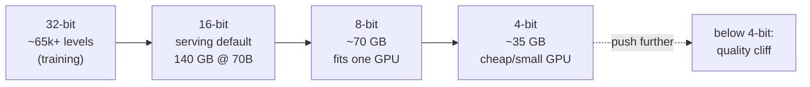
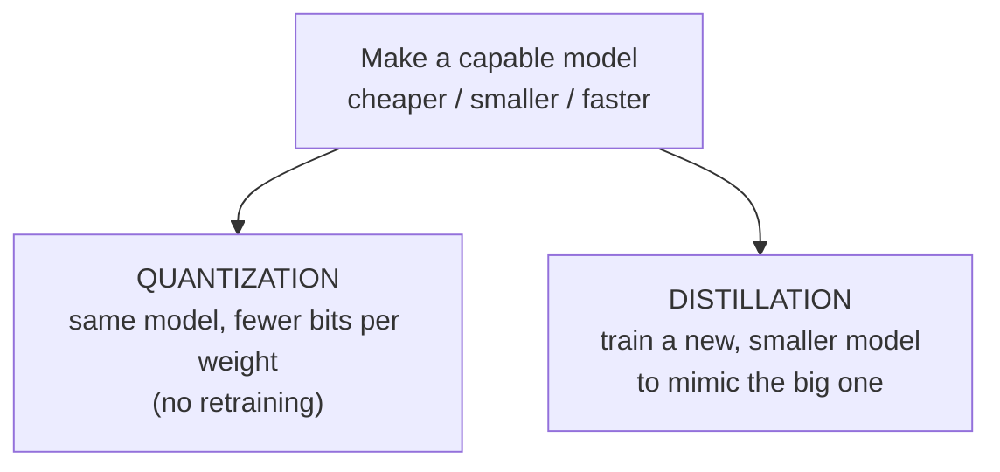

# Quantization

## The problem it solves

A capable open model might have 70 billion parameters — 70 billion numbers that have to be loaded into a chip's memory before it can answer a single request. Stored the normal way, at 16 bits per number, that's about 140 gigabytes of weights. The best data-center GPU (Graphics Processing Unit — the chip models run on; see the [ML vocabulary primer](../primers/ml-vocabulary.md)) holds around 80 gigabytes. So the model doesn't even *fit* on one GPU: you rent two or more, wire them together, and pay for all of it on every request. And because serving speed is largely set by how much weight data must be hauled out of memory for each token, a fatter model is also a slower one.

You could reach for a smaller model, but then you've given up the capability you wanted. You could retrain something leaner, but that's a multi-week, expensive project. **Quantization** is the lever that sidesteps both: take the *same* trained model and store each of its numbers using fewer bits of precision. The weights get coarser, the file gets dramatically smaller, it fits on cheaper or fewer chips and runs faster — and, surprisingly, the quality barely moves until you push the compression too far. It is the single most common way a big model is made to fit on hardware you can actually afford, with no retraining at all.

## The one analogy to remember

**The picture:** A giant price list where every item is written to the exact cent — $4.99, $12.34, $0.87 — thousands of rows of it. Round every price to the nearest dollar and the list takes far less room to write, and any total you add up still comes out almost right. Round to the nearest *hundred* dollars, though, and a $4 coffee and a $40 book both collapse to "$0" — now the arithmetic is garbage.

**The mapping:** each precise price = one of the model's weights stored at high precision; rounding to fewer digits = quantizing to fewer bits; the shorter list = the shrunken memory footprint; totals still coming out almost right = the model's answers barely changing; rounding to the nearest hundred = pushing precision so low that quality falls off a cliff.

**Why it holds:** a model's output is a giant sum over millions of weights, exactly like a total over a long price list — and when you round every entry a little, the individual errors are tiny and tend to cancel out, so the total barely shifts. That averaging-out is the real reason coarser storage costs so little quality. The cliff is real too: once the rounding step is large enough to swamp the actual values, the sum stops meaning anything.

**Say it like this:** "Quantization stores each of the model's numbers with fewer digits — like rounding every price in a huge list to the nearest dollar. It takes far less space and the totals barely change, until you round so hard the numbers turn to mush."

*Where it breaks:* a price list is one column you add up once; a model multiplies its weights through many stacked layers, so errors can compound in ways a single sum doesn't capture — and a few "outlier" weights matter far more than the rest, which is why naive rounding of *those* hurts more than the analogy suggests.

## Precision: how finely each number is stored

Everything here rests on one idea, so it's worth stating plainly for a non-technical reader: **precision is how many bits are used to store each individual number, and more bits means the number can be recorded more finely.**

A weight is just a number like `0.0731`. A computer stores it in a fixed budget of bits, and that budget decides how many distinct values are even *available* to snap each weight to. The common rungs:

- **32-bit** ("full precision", FP32) — the most exact, and how models are often trained.
- **16-bit** (FP16 or BF16, "half precision") — the usual default for *serving* a model. Half the memory of 32-bit, with quality essentially unchanged. This is the baseline the compression is measured against.
- **8-bit** (INT8) — half again.
- **4-bit** (INT4, or formats like NF4) — half again. Increasingly common for fitting large models onto modest hardware.

The intuition to carry: with 4 bits, each weight must round to one of only **16** possible values; with 16 bits, it can land on one of roughly **65,000**. Quantization is the act of taking weights recorded on a fine grid and re-expressing them on a coarse one — rounding each to the nearest allowed rung. Fewer bits, coarser grid, smaller file, faster to move.

## Why fewer bits buys memory and speed

The memory saving is arithmetic: **memory used ≈ number of parameters × bytes per parameter.** A 70-billion-parameter model at 16 bits (2 bytes each) is ~140 GB; at 8 bits (~70 GB) it now fits on a single 80 GB GPU; at 4 bits (~35 GB) it fits with room to spare, or drops onto a much cheaper card. Every halving of precision roughly halves the footprint. That's the whole reason a model that demanded a multi-GPU box can suddenly run on one, or a laptop-class model can run on a phone.

Speed comes along for the ride, and the reason is worth knowing because it's counterintuitive: generating a token is largely **memory-bandwidth bound** — the slow part is hauling the weights out of memory, not the multiplications themselves. Halve the bytes per weight and you halve the data that must be moved per token, so it runs faster. Some hardware also does low-precision arithmetic faster on top of that. The full picture of what makes serving fast is its own topic — see [Inference optimization](../10-production-ops/49-inference-optimization.md); here, just hold that quantization moves *both* the memory and the latency needles because they share the same bottleneck.

## The tradeoff curve — and the cliff

The seductive-but-wrong mental model is that quality degrades smoothly and proportionally: half the bits, half as good. It doesn't work like that. In practice the curve is nearly flat for a long stretch and then falls off a cliff:

- **16-bit → 8-bit** is typically almost free — quality differences are usually too small to notice on most tasks.
- **8-bit → 4-bit** costs a little, and with good quantization methods it's often an easy trade for the memory saved.
- **Below 4-bit**, quality tends to degrade *sharply* — this is the knee in the curve, where the rounding step gets large enough to start swamping the actual weight values.

So the reason quantization is such a popular lever is that you get most of the memory and speed win *before* you reach the part of the curve that hurts. The judgment call for a PM is picking the precision that sits just before the cliff for *your* task.

> [!NOTE]
> **Why "it depends on the method."** Two models quantized to the same 4 bits can differ in quality because the *technique* matters — good methods spend care on the rare high-magnitude "outlier" weights that carry disproportionate influence, keeping those more precise while squeezing the rest. That's why "we went to 4-bit" isn't a complete spec; *how* you got there changes the result.

One honest caveat, not a settled fact: research into very low precision — 2-bit, and even ~1-bit "ternary" designs — is active and improving, so the practical floor keeps being pushed. Treat "below 4-bit gets sharply worse" as the current general finding, not a permanent law.

## It's a post-hoc step, not a retrain

The key operational point: the most common form, **post-training quantization**, happens *after* the model is fully trained. You take the finished weights and compress them — no training data, no GPU cluster, no weeks of work. That's what makes it such a cheap lever compared to the alternatives. (There's a costlier, higher-quality variant, *quantization-aware training*, where the model is trained with the eventual rounding in mind so it learns to tolerate it — worth knowing exists, but the post-hoc kind is what you'll reach for first.)

## QLoRA: fine-tuning on top of a quantized base

Quantization also unlocks cheaper *fine-tuning*. **QLoRA (Quantized LoRA)** loads the big base model in a compressed 4-bit form to slash its memory footprint, then trains a small [LoRA](09-lora.md) adapter on top of it in normal precision. The move works because during LoRA fine-tuning the base model is **frozen** — never updated, only read — so storing it coarsely costs very little, while the small adapter that *is* learning stays precise enough to do its job. The payoff (from Dettmers et al., 2023) is that fine-tuning a very large model, which used to demand a cluster, can fit onto a single consumer GPU. LoRA and adapters are that lesson's territory — here just hold the combination: **quantize the frozen base to make the fine-tune fit; train the adapter in full precision so quality holds.**

## The two families of model compression

Quantization is one of two main ways to make a model cheaper to run, and naming both — and their difference — is a strong signal you understand the space:

- **Quantization** compresses the *same* model — same architecture, same number of weights, each stored more coarsely. Nothing is retrained.
- **[Distillation](13-distillation.md)** produces a *different, smaller* model — a compact "student" trained to imitate the big "teacher." That's a training project, and it's the other lesson's subject; the contrast is the point here.

The sharp framing: **quantization shrinks the numbers; distillation shrinks the network.** They're not rivals — they compose. A common production recipe is to distill a big model down to a smaller student *and then* quantize that student, stacking both compressions.

## Summary / Points to Remember

- **Quantization stores each weight with fewer bits of precision** — 16-bit → 8-bit → 4-bit — so the *same* trained model gets far smaller in memory and faster to run, with no retraining.
- **Precision = bits per number = how finely each weight is stored.** Fewer bits, fewer distinct values to round to (4 bits = only 16 rungs), coarser weights.
- **Memory ≈ params × bytes per param**, so every halving of precision roughly halves the footprint — that's how a 140 GB model fits on one GPU at 8-bit, or a small GPU at 4-bit. Speed follows because token generation is memory-bandwidth bound: fewer bytes to move per token.
- **The quality curve isn't linear — it's flat then a cliff.** 16→8 is nearly free, 8→4 is a small cost, and below ~4-bit quality tends to degrade sharply. Pick the precision just before the cliff for your task.
- **How you quantize matters** — good methods protect the rare high-influence "outlier" weights — so "4-bit" alone doesn't fully specify the result.
- **QLoRA = fine-tune a 4-bit frozen base with a full-precision LoRA adapter** — cheap because the frozen base tolerates coarse storage.
- **Two compression families: quantization shrinks the numbers, [distillation](13-distillation.md) shrinks the network.** They stack.

## Interview Questions That Stump People

**Q (clarify-back): "We want to cut our inference bill. Should we just quantize our model?"**

**Interviewer:** Serving costs are too high. Can't we just quantize the model and be done?

**You (clarify back):** Possibly — but two things decide it: what precision are we serving at *today*, and how close is our current quality to the edge of what the product can tolerate?

**Interviewer:** We're running the full 16-bit model, and honestly our quality has comfortable headroom — users would never notice a small dip.

**You:** Then quantization is a strong, cheap first move. Going 16-bit to 8-bit is almost always essentially free in quality and roughly halves the memory, which likely lets us serve on fewer or smaller GPUs immediately — no retraining, just a post-training compression step. I'd try 8-bit first, measure quality on our *own* task rather than trusting generic benchmarks, and only push to 4-bit if we need more and the numbers hold. If we'd *already* been at 4-bit with quality near the edge, my answer would flip — I'd say we're near the cliff and should look at a smaller distilled model or better retrieval instead.

> [!TIP]
> **Why this works:** "Should we quantize?" has no context-free answer — it hinges on where you already are on the precision ladder and how much quality slack you have. Answering "yes, quantize" instantly hides that you know the tradeoff has a cliff. The two clarifying questions pin down both variables that decide it, and naming the condition that would *flip* the recommendation (already at 4-bit, near the edge) shows you're reasoning about the curve, not reciting "quantization saves money."

---

**Q: "Quantization is lossy — you're literally throwing away precision. Why doesn't that make the model noticeably dumber?"**

**Interviewer:** You're rounding off every weight in the model. How is that not obviously destructive?

**You:** Because a model's output is a giant sum over millions of weights, and rounding each one a little produces tiny errors that largely cancel out across the sum — so the result barely moves. It's the price-list intuition: round every price to the nearest dollar and any total still comes out almost right. That's why 16-bit to 8-bit is essentially free and 4-bit is usually a small, worthwhile cost. The catch is that it's not linear — there's a cliff. Push below about 4 bits and the rounding step gets large enough to swamp the actual weight values, and quality falls off sharply. So the honest framing is "nearly free for a long stretch, then suddenly not," not "gradually worse."

> [!TIP]
> **Why this answer works:** The question assumes degradation is proportional to precision lost, and a weak candidate either agrees ("yes, it's a compromise") or over-claims ("it's totally lossless"). The strong move gives the *mechanism* — errors averaging out over a huge sum — which explains why the flat stretch exists, and then volunteers the cliff, which shows you hold it as an empirical curve with a failure region, not a slogan. Naming *where* it breaks is exactly what survives a "what breaks?" follow-up.

---

**Q: "We quantized to 4-bit. Standard benchmarks looked fine, but one customer's use case fell apart. What happened?"**

**Interviewer:** Same 4-bit model. Benchmarks barely dropped, but this one workflow got noticeably worse. Where do you look?

**You:** My first suspicion is that we're sitting near the 4-bit cliff and this particular task is more sensitive to the rounding than the benchmark average is. Benchmarks report a mean across many tasks, so a broad "barely dropped" can easily hide a specific capability — often something precision-hungry like exact arithmetic, long structured output, or a niche domain — that took a real hit. Two things I'd check: whether the quantization method protected the high-magnitude outlier weights (a cheap, naive method that rounds those flat can quietly wreck specific behaviors), and whether backing off to 8-bit for this deployment restores the customer's task. The lesson is to evaluate quantization on the actual use cases that matter, not on an averaged leaderboard.

> [!TIP]
> **Why this answer works:** The trap is trusting the benchmark's average and concluding "quantization is fine." The strong answer separates *aggregate* quality from *per-task* quality and names the real culprits — proximity to the 4-bit cliff, task sensitivity, and outlier-weight handling by the method. That reframes "the model got dumber" into "we measured the wrong thing and pushed one task past its precision budget," which is a diagnosis at the level of the mechanism, and the fix (measure on real tasks, consider 8-bit for this one) follows directly.

---

**Q: "Quantization or distillation — how do you choose which to reach for?"**

**Interviewer:** Both are ways to make a model cheaper. When do you pick one over the other?

**You:** They do different things, so I'd frame the choice by cost and by how far I need to shrink. Quantization keeps the *same* model and just stores its weights more coarsely — it's a post-training step, no retraining, so it's the cheap first move and where I'd always start. Distillation trains a *new, smaller* model to mimic the big one — a real training project, more expensive and slower, but it can reach sizes and speeds quantization alone can't. So: quantize first because it's nearly free; distill when you need a genuinely smaller network and have the resources to train one. And they're not either/or — a common recipe is to distill down to a compact student and *then* quantize that student, stacking both. The one-liner I'd leave them with: quantization shrinks the numbers, distillation shrinks the network.

> [!TIP]
> **Why this answer works:** The question invites a false rivalry. The strong response defines each precisely (same model vs. new model; no retraining vs. a training project), orders them by cost, and — the part that signals real fluency — points out they *compose* rather than compete. The crisp "shrinks the numbers vs. shrinks the network" contrast proves you understand the two compression families as a system, not as two buzzwords you can list.

---

**Q: "In QLoRA the base is quantized to 4-bit. Doesn't that permanently cripple the fine-tuned model?"**

**Interviewer:** If you're fine-tuning on a 4-bit base, aren't you building on a degraded foundation — so the result is degraded too?

**You:** It's less of a problem than it sounds, and the reason is specific: during LoRA fine-tuning the base is **frozen** — we never update it, only read from it — and the small adapter that *is* learning is trained in normal, full precision. So the trainable part isn't degraded, and it can actually *adapt around* whatever the 4-bit base slightly gets wrong, because it learns on top of that exact quantized foundation. That's why QLoRA can match full-precision fine-tuning closely despite the compressed base. The thing I'd still watch is inference: if we later serve the merged result at very low precision too, we're stacking compression and should measure quality, not assume it carries over.

> [!TIP]
> **Why this answer works:** The question assumes "quantized base in → quantized quality out," a plausible but wrong intuition. The strong answer names the two facts that break it — the base is frozen (so its coarseness is a fixed backdrop, not compounding error) and the adapter trains in full precision (so it can compensate). Showing *why* compressing a frozen thing is nearly free — the same logic that makes quantization work at all — proves you understand the interaction of the two techniques rather than treating "QLoRA" as one opaque word.
