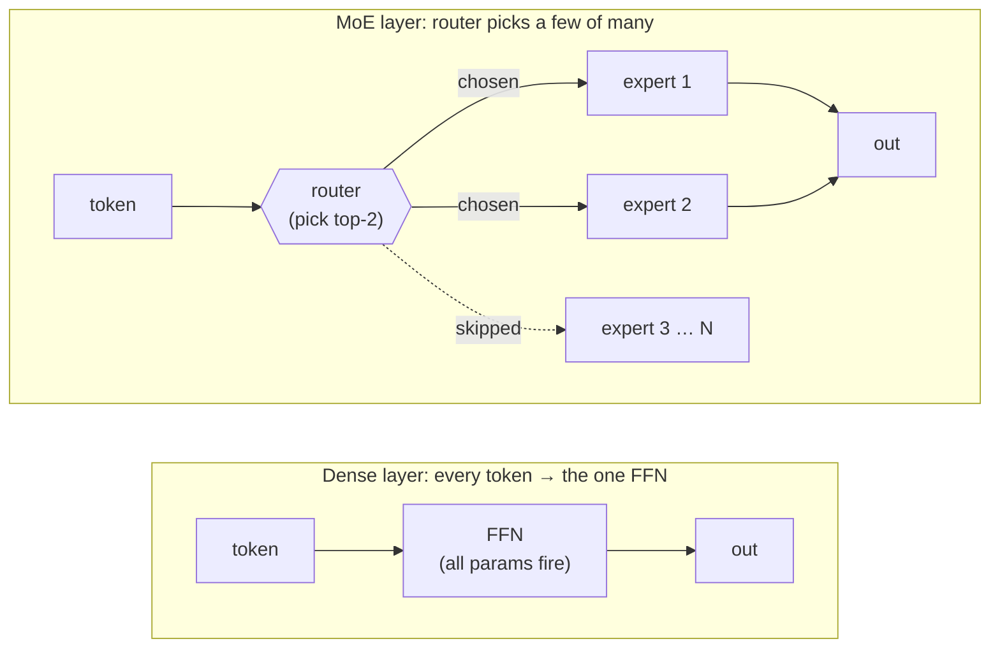
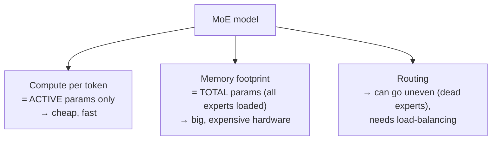

# Mixture of Experts (MoE)

## The problem it solves

There is one iron law in a standard ("dense") model that quietly sets the price of everything: **every parameter runs for every token.** When the model processes a word, the signal passes through all of its weights — no exceptions. That has a brutal consequence. The way you make a model *know more* is to give it more parameters, but because all of them fire on every token, more knowledge means proportionally more compute on every single word it ever reads or writes. Capacity and cost-per-token are welded together. Want a model twice as knowledgeable? Fine — but now every request is roughly twice as expensive and twice as slow, forever.

That weld is the thing standing between the industry and the obvious dream: a model with an enormous store of knowledge that is still cheap to run. **Mixture of Experts (MoE)** is the architecture that cuts the weld. Its whole reason to exist is to break the link between *how much a model knows* and *how much it costs to process one token* — to let a model carry a huge pile of parameters while only waking up a small slice of them for any given word.

## The one analogy to remember

**The picture:** A large teaching hospital with a hundred specialist doctors on staff, and a triage nurse at the front desk. You walk in; the nurse glances at your problem and sends you to just one or two of the right specialists — not all hundred.

**The mapping:** the full roster of specialists = all the experts (the model's *total* parameters); the triage nurse = the router; the one or two specialists you actually see = the *active* experts for your token; your single visit = one token being processed; every doctor still drawing a salary and occupying an office = all experts sitting loaded in memory even when idle.

**Why it holds:** this is the exact design reason MoE exists, not a decoration. The hospital's total knowledge (every specialty on staff) is decoupled from the cost of any one visit (the couple of doctors you see), *because a router picks a small relevant subset*. That decoupling — huge collective capacity, small per-visit cost — is precisely the trade MoE is built to win.

**Say it like this:** "Instead of one giant generalist who handles every case, it's a hospital full of specialists with a triage nurse who sends each patient to just the right one or two — so the place knows a huge amount, but any single visit is cheap."

*Where it breaks:* a real triage nurse understands your symptoms; the router is a tiny, fast statistical guess that can misroute a token or overload a favored specialist — and every doctor still has to be in the building drawing pay even if nobody visits them today, which is the memory cost the analogy makes easy to forget.

## Where MoE actually lives: the feed-forward layer

To see the mechanism you need to remember the shape of a [transformer](../01-foundations/04-transformers.md) layer. Each layer does two jobs: **attention** (mixing information between tokens — deciding what to look at) and then a **feed-forward network (FFN)** applied to each token on its own (the step where the bulk of the model's parameters sit and where learned facts live). We are not re-teaching that here — assume it. The one fact to carry over: **the FFN is where most of the weight, and most of the compute, is.**

MoE changes exactly one thing: it **replaces that single FFN with many parallel FFNs — the "experts" — plus a small "router."** Attention is untouched. So an MoE model is an ordinary transformer where, at each layer, instead of one feed-forward block that every token must pass through, there are (say) 8, 64, or 128 feed-forward blocks, and a lightweight selector decides which few each token visits.

Two terms, both mine to define here:

- An **expert** is just one of those FFN sub-networks. Nothing exotic — it is a normal feed-forward block, the same kind the dense model had one of. "Expert" oversells it: they don't cleanly specialize into "the grammar expert" and "the Python expert." They're better thought of as interchangeable capacity that the router learns to divide work across.
- The **router** (or "gating network") is a tiny learned function that looks at each token and outputs a score for every expert, then sends the token to the top-scoring few — commonly the **top-k**, meaning the *k* highest-scoring experts, with *k* usually 1 or 2. If there are 128 experts and k=2, each token touches 2 of them and ignores the other 126.

## Active vs. total parameters — the whole point, and the thing people get wrong

This is the crux of the lesson, and the single distinction an interviewer is probing for. An MoE model has two parameter counts, and confusing them is the classic mistake.

- **Total parameters** = every weight in the model, all experts added up. This is the model's *capacity* — how much it can know. An MoE model has a giant total count precisely because it has so many experts.
- **Active parameters** = the weights that actually run for a single token: attention, the router, and only the *k* experts that got picked. This is what governs *compute cost and speed* per token.

In a dense model these two numbers are the same — everything is always active. **MoE is the architecture that pulls them apart.** A model might have, say, hundreds of billions of parameters in total but activate only a few tens of billions per token.

Here is the sentence to be able to say cold: **an MoE model is fast and cheap like a small model, but knows like a big one.** Its per-token cost tracks the *active* count (small), while its knowledge tracks the *total* count (large). The publicly documented Mixtral 8x7B is a clean example: 8 experts per layer, router picks 2, so its total parameter count is far larger than the number that fires on any token — it runs roughly like the smaller active model but carries the capacity of the bigger total.

The confusion to avoid: someone sees "300 billion parameters" on an MoE model and assumes it's as slow and expensive to run as a 300B *dense* model. On **compute**, it isn't — it only ever runs its active slice. Which brings us to the catch, because "compute" was doing careful work in that sentence.

## The catches: memory, imbalance, and harder training

MoE is not a free lunch. Three tradeoffs matter, and naming them is what separates real understanding from a headline.

**1. It saves compute, not memory.** This is the big one. The router picks a few experts *per token*, but across a whole batch of tokens, and across the whole conversation, *any* expert might be needed. So all of them have to be sitting loaded in GPU memory ([GPU](../primers/ml-vocabulary.md) — the chip models run on), ready to fire. You pay for the **full total parameter count in memory** while only paying for the **small active count in compute**. So an MoE model is cheap to *run* per token but still needs the big, expensive hardware footprint of its total size. The sharp framing: **MoE trades memory for compute** — it buys cheap tokens by spending on VRAM (video RAM, the GPU's onboard memory). A team that hears "cheap to run" and forgets the memory bill will size their hardware wrong.

**2. Routing can go uneven or unstable.** Nothing forces the router to spread work evenly. Left alone, it tends to fall in love with a handful of experts and send them most of the traffic, while others sit starved and half-trained — sometimes called **dead experts**. That wastes the capacity you paid for (idle experts are pure memory cost with no benefit) and can hurt quality. Training an MoE therefore adds a **load-balancing** pressure — an extra objective nudging the router to distribute tokens more evenly across experts. It helps, but balancing is an ongoing tension, not a solved problem.

**3. Training is trickier.** The routing decision is a *pick-the-top-few* choice, which is harder to train smoothly than a dense network where everything just flows through. Add the load-balancing objective on top, plus the engineering of shuffling tokens to whichever experts they were routed to, and MoE is meaningfully more finicky to train stably than a plain dense model of the same quality. The payoff is worth it at scale, but it is real work.

## How MoE differs from the other efficiency levers

MoE sits alongside two sibling techniques in this category, and interviewers like to see that you don't confuse them. In one line each: [distillation](13-distillation.md) makes a *smaller* model by training it to mimic a big one (fewer total parameters); [quantization](14-quantization.md) shrinks the *bits per weight* so the same model takes less memory and runs faster (same parameters, cheaper storage); **MoE keeps all the weights but only activates a slice of them per token** (many total parameters, few active). Distillation and quantization make the model *smaller*; MoE makes a *big* model *behave cheaply* on compute. They're complementary, not competing — you can quantize an MoE model.

## Summary / Points to Remember

- In a dense model, **every parameter runs for every token**, so knowing more costs more per token — capacity and cost are welded together. **MoE exists to cut that weld.**
- MoE replaces each layer's **feed-forward network with many "experts" plus a "router"** that sends each token to only the top few (often 1–2). Attention is unchanged; this is a swap in the FFN.
- The crux distinction: **total parameters = capacity (what it knows); active parameters = compute per token (speed and cost).** MoE pulls these two apart, where a dense model welds them together.
- Say it as: **"fast and cheap like a small model, but knows like a big one"** — per-token cost tracks the small active count, knowledge tracks the large total count.
- The failure mode people forget: **MoE saves compute, not memory.** All experts must be loaded in GPU memory, so you pay the full total size in hardware even though only a slice computes. It **trades memory for compute.**
- Routing can go **uneven** (a few favored experts, others "dead"), so training needs a **load-balancing** objective, and MoE is **trickier to train** than a dense model overall.
- Different lever from its siblings: **distillation** shrinks the model, **quantization** shrinks each weight, **MoE** activates only a slice of a big model.

## Interview Questions That Stump People

**Q (clarify-back): "We want a noticeably smarter model, but leadership says our per-request cost can't go up. Is that even possible?"**

**Interviewer:** Product wants more capability, finance won't accept a higher cost per request. Square that circle.

**You (clarify back):** When they say "cost," do they mean the compute and latency per token, or the total hardware and memory budget we have to provision? Because those pull in different directions here.

**Interviewer:** They mean the per-token compute and the latency users feel. The hardware budget has some room.

**You:** Then yes, this is exactly what a Mixture of Experts architecture buys you. It lets total parameters — the model's knowledge — grow large while the *active* parameters that fire on each token stay small, so per-token compute and latency stay close to a small model's even as capability climbs. The catch I'd flag upfront is memory: all those experts have to be loaded in GPU memory whether or not a given token uses them, so we'd need more or bigger GPUs. Since you told me the hardware budget has room but the per-token cost doesn't, MoE lands on exactly the right side of that tradeoff. If the constraint had been memory instead, I'd have steered us elsewhere — distillation or quantization.

> [!TIP]
> **Why this works:** "Smarter but not costlier" sounds impossible because in a dense model capability and cost are the same dial. The trap is answering "no, you can't" (missing MoE) or "sure, MoE!" without checking *which* cost is fixed — and MoE only helps if the binding constraint is compute/latency, not memory. Clarifying that pins down the one variable that decides the answer, and it signals you know MoE's defining feature is that it trades memory for compute, not that it's free.

---

**Q: "A vendor pitches us a 300-billion-parameter MoE model. Is serving that as expensive as serving a 300B dense model?"**

**Interviewer:** Same headline parameter count — 300B MoE versus 300B dense. Same serving cost?

**You:** No, and the reason is that "300B" means two different things depending on which cost you're asking about. On **compute** — the raw arithmetic and the latency per token — the MoE is far cheaper, because it only ever activates a small fraction of those 300B parameters for any given token; it computes like whatever its *active* count is, maybe a few tens of billions. But on **memory**, they're comparable: all 300B parameters have to sit loaded in GPU memory, because any expert might be needed across a batch. So the MoE gives you dense-300B knowledge at small-model compute cost, but you still provision hardware for the full 300B. Cheaper to run per token, similar footprint to host.

> [!TIP]
> **Why this answer works:** The question invites a single yes/no, and both are wrong because serving cost isn't one number. Splitting it into compute (tracks *active* params, much cheaper) versus memory (tracks *total* params, comparable) shows you understand the active-vs-total distinction that is the whole point of MoE — and it's the exact split a naive reading of "300B" collapses. It also protects the business from the real mistake: under-provisioning memory because someone heard "MoE is cheap."

---

**Q: "If routing each token to just a couple of experts is the trick, why not route every token to all the experts and get even better answers?"**

**Interviewer:** More experts weighing in should mean a better answer, right? Why not just use all of them every time?

**You:** Because the moment every token uses every expert, you've rebuilt a dense model and thrown away the entire point. The savings come *only* from sparsity — activating a small slice per token is what keeps compute low while total capacity stays high. Route to all experts and your active parameter count equals your total count again; you'd be paying full dense compute on a model with a huge parameter pile, which is the worst of both worlds. The selectivity isn't a compromise on quality you'd remove if you could afford it — it *is* the mechanism. The design bet is that a well-routed few experts are good enough, and that the money saved is better spent on having many more experts than on consulting all of them.

> [!TIP]
> **Why this answer works:** The question frames sparsity as a cost-cutting concession — as if "use all experts" were the ideal and top-k a budget version. The strong move is to reject that: sparsity is the load-bearing mechanism, not a discount. Naming that using all experts collapses active back to total (a dense model) shows you understand *why* MoE saves anything at all, rather than treating "pick a few" as an arbitrary knob.

---

**Q: "You've deployed an MoE model. What's the failure mode you'd watch for that you wouldn't have with a dense model?"**

**Interviewer:** What breaks in an MoE that simply can't break in a dense model?

**You:** Routing imbalance. In a dense model there's no router, so there's nothing to skew — every token uses everything. In an MoE, the router can learn to favor a handful of experts and starve the rest, leaving you with "dead experts" that are trained poorly and rarely used. That's doubly bad: you're paying full memory to keep those experts loaded, but getting little capability from them, and the overloaded few can become a quality bottleneck. It's why MoE training includes a load-balancing objective to push the router toward spreading tokens evenly. So in production I'd want visibility into how token traffic is distributed across experts, not just aggregate quality — imbalance is invisible in a single accuracy number but shows up as wasted capacity.

> [!TIP]
> **Why this answer works:** Generic answers ("it might be slow," "hallucinations") don't distinguish MoE from any model. Naming *routing imbalance / dead experts* — a failure that literally cannot exist without a router — proves you understand what MoE added to the architecture and therefore what new thing can go wrong. Tying it back to the memory cost (idle experts are pure overhead) shows you connect the failure to the economics, which is the PM-relevant part.

---

**Q: "Where in the model does MoE actually change things — is it a whole new architecture?"**

**Interviewer:** People talk about MoE like it's a different kind of model. Is it?

**You:** Not really — it's a targeted swap inside an otherwise normal transformer. Each layer still has attention doing the same job it always did; MoE only touches the feed-forward part of the layer, replacing the single feed-forward network with many expert feed-forward networks plus a router. So it's not a new paradigm, it's "the transformer, but the FFN is now a pool of experts you route among." That matters because it means everything you know about transformers still applies — attention, context windows, the layer stack — and MoE is a capacity-and-cost modification bolted onto the one part of the layer that held most of the parameters anyway.

> [!TIP]
> **Why this answer works:** Calling MoE a "new architecture" is a common overstatement that reveals someone hasn't placed it in the transformer. Locating the change precisely — the FFN, not attention — signals you know both where the parameters and compute concentrate in a transformer *and* that MoE is a surgical edit there, not a ground-up redesign. Precision about *where* a technique intervenes is a reliable seniority tell.
