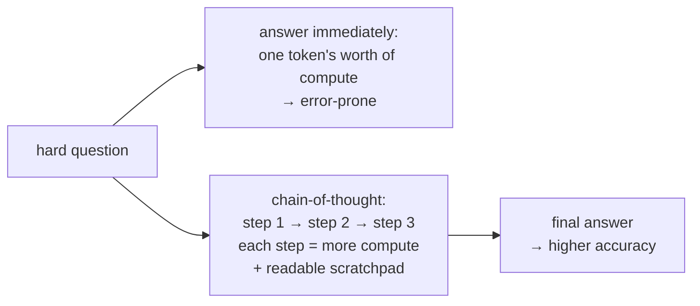
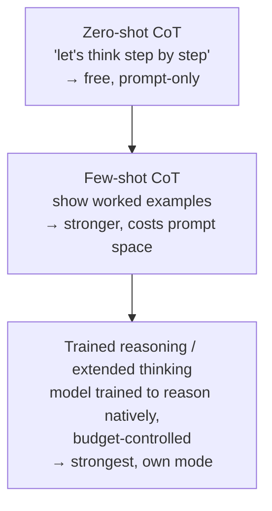

# Chain-of-Thought and Extended Thinking

## The problem it solves

Ask a model a hard multi-step question — a word problem, a logic puzzle, a "which of these plans is cheaper and why" — and demand the answer immediately, and it often gets it wrong. Not because it *couldn't* have reasoned to the right answer, but because you gave it no room to. Remember how generation actually works: the model produces the answer one [token](../01-foundations/01-tokenization.md) at a time, and it does a **fixed, bounded amount of computation per token** before committing to it. Force the final answer to be the *very next token* after a hard question, and you're asking the model to compress an entire multi-step derivation into a single forward pass. There's nowhere for the intermediate work to happen.

**Chain-of-thought (CoT)** is the deceptively simple fix: instead of jumping to the answer, the model is prompted (or trained) to first generate the **intermediate reasoning steps** — the "let me work through this" scratch work — and only then state the final answer. That's the whole idea. And it works remarkably well on tasks that need reasoning, arithmetic, or multi-step logic. The lift is often dramatic, not marginal.

The deep reason it works is the part people miss, and it's the thing to understand cold: **generating reasoning tokens gives the model more computation to spend on the problem.** Each token the model writes is another forward pass, another chunk of compute, and — crucially — each reasoning token becomes part of the input for the next one. So the model isn't just "showing its work" for your benefit; it's *building itself a scratchpad it can then read from.* The intermediate steps are both extra thinking time and extra working memory. That reframing — CoT as **buying the model more compute and a place to store partial results**, not as politely asking it to explain — is what separates someone who understands CoT from someone who's just heard "tell it to think step by step."

**Extended thinking** (also called reasoning mode, or "thinking") is the productized, industrial-strength version of this: a mode where the model is allowed — and trained — to generate a long private chain of reasoning before its visible answer, often with a *budget* you can dial up or down. Same underlying principle, turned into a feature.

## The one analogy to remember

**The picture:** A student sits a hard math test. One rule forbids all scratch work — they must write only the final answer, straight down, no margins, no working. Another version of the test hands them a scratchpad and says "show your working." The same student, same brain, scores far higher with the scratchpad — not because they suddenly know more, but because they now have somewhere to hold the half-finished steps instead of juggling the entire calculation in their head at once.

**The mapping:** the student = the model; "final answer only, no working" = forcing the answer as the immediate next token; the scratchpad = the chain-of-thought tokens; writing each step and then reading it back to do the next = each reasoning token becoming input for the following ones; "show your working" = a CoT prompt or extended-thinking mode; the extra time the scratchpad version takes = the added latency and token cost.

**Why it holds:** it captures the true mechanism, not just the vibe. The scratchpad doesn't add knowledge to the student — it adds *working memory and steps*, exactly what CoT adds to the model. A person forced to answer a multi-step problem in one breath makes avoidable errors; given room to lay out the steps, they don't. That's precisely why generating intermediate tokens raises accuracy: it converts one impossible all-at-once computation into a sequence of small, checkable ones.

**Say it like this:** "It's the difference between forcing someone to blurt the answer to a hard math problem versus letting them use scratch paper. Same person — but the scratch paper gives them room to work the steps, so they get it right more often."

*Where it breaks:* a human's scratch work is a faithful record of how they actually reasoned; a model's stated chain is *not guaranteed* to be the real cause of its answer — it can write a tidy, plausible-looking derivation and still have arrived at the answer by other means, or reach the right steps and then state a wrong answer anyway. The scratchpad is real extra computation, but it isn't a lie detector for the model's true process.

## Why intermediate tokens actually help: three mechanisms

It's worth being precise, because interviewers push on *why*. Three things are happening at once.

1. **More compute per problem.** A model spends a fixed amount of computation producing each token. Answering immediately caps the total compute at one token's worth of "thinking." Every reasoning token added is another forward pass spent on the problem — CoT literally increases the compute budget applied before the answer. This is the bridge to [test-time compute](18-reasoning-models.md), the broader principle that spending more computation at inference time buys more capability, covered in the next lesson.
2. **Serialized decomposition.** Hard problems are sequences of dependent sub-steps: step 2 needs the result of step 1. A single forward pass can't easily do "compute A, then use A to compute B, then use B to decide C." Writing A down, then B, then C turns one entangled computation into a chain of simple ones, each conditioned on the last.
3. **Externalized working memory.** Because generation is [autoregressive](16-sampling-decoding.md) — each token feeds back in as input — the reasoning the model has already written becomes context it can attend to. The chain is a scratchpad the model reads from, so it doesn't have to hold every partial result "in its head" simultaneously.

## Getting CoT to happen: from a magic phrase to a trained behavior

There's a spectrum of how CoT gets triggered, and it's evolved fast.

**Zero-shot CoT** is the famous one: just append an instruction like *"Let's think step by step"* to the prompt, and the model spontaneously produces reasoning before answering. That a single phrase measurably raises accuracy on reasoning tasks is genuinely surprising, and it's a favorite interview fact. It works because the model saw plenty of step-by-step worked solutions during [pretraining](../01-foundations/06-pretraining-vs-posttraining.md) and that instruction cues it to imitate them.

**Few-shot CoT** goes further: you include a couple of *worked examples* in the prompt — questions with their full reasoning shown — so the model copies the pattern of reasoning, not just the answer format. This overlaps with [few-shot prompting](../05-prompting/29-few-shot-icl.md) as a general technique, which owns that topic; here the point is only that showing reasoning exemplars elicits stronger CoT than a bare instruction.

**Trained-in reasoning (extended thinking)** is where the frontier moved. Rather than depending on the user to ask nicely, newer models are *trained* — often with reinforcement learning — to produce long, high-quality reasoning chains natively, and exposed as an "extended thinking" or "reasoning" mode. The model thinks at length in a (usually hidden) chain before answering, and you can often set a **thinking budget** — more budget for harder problems, less to save time and money. The models built primarily around this are [reasoning models](18-reasoning-models.md), the subject of the next lesson; the boundary is that *this* lesson is about the chain-of-thought behavior and the thinking feature, while lesson 18 is about the class of models and the test-time-compute principle that make it a paradigm.

## Self-consistency: sample many chains, take the majority

One powerful upgrade lives squarely in this lesson. Because [sampling](16-sampling-decoding.md) makes generation non-deterministic, you can run the *same* CoT prompt several times, get several *different* reasoning chains, and then **take the majority answer** across them. This is **self-consistency**, and it reliably beats taking a single chain. The intuition: there are many valid reasoning paths to a correct answer but many *different* wrong paths to wrong answers, so correct answers tend to *agree* across independent chains while errors scatter. It's a vote, and the truth wins the vote more often than any single lie does.

The catch is cost: sampling five or ten chains means five or ten times the tokens and latency for one answer. It's a direct **accuracy-for-money trade**, useful when correctness matters more than cost (high-stakes reasoning) and wasteful when it doesn't.

## The tradeoffs a PM must hold

CoT and extended thinking are not free, and "just turn on reasoning" is the wrong reflex.

- **Latency and cost.** Reasoning tokens are generated tokens — you pay for every one, and the user waits for them. A model that emits 800 thinking tokens before a 50-token answer costs and stalls like an ~850-token response. For a snappy autocomplete or a simple classification, that's a terrible trade; for a hard analytical task, it's worth it. **Match the thinking budget to the difficulty of the task**, which is exactly why budgets are a knob.
- **Not universally better.** On easy or purely factual tasks, CoT adds cost and latency for no accuracy gain, and can occasionally *hurt* by giving the model room to talk itself out of a correct first instinct. CoT is for problems with genuine multi-step structure.
- **The reasoning shown may not be the real reason (faithfulness).** This is the subtle, high-signal point. The visible chain is *not guaranteed* to be a faithful account of how the model actually reached its answer — it can produce plausible-sounding steps that rationalize an answer arrived at otherwise. So a chain-of-thought is a reasoning aid and a debugging *hint*, **not** a trustworthy audit trail or explanation you can put in front of a regulator as "here's why the model decided this." Treating the chain as a guaranteed explanation is a real mistake.
- **Exposure and safety of the chain.** Thinking often contains messy, exploratory, sometimes wrong intermediate content. Products usually **hide the raw chain** and show only the final answer (or a cleaned summary), both for UX and because the raw reasoning can leak, confuse, or be gamed. Whether and how to surface reasoning is a product decision, not a default.

## Summary / Points to Remember

- **Chain-of-thought (CoT)** = have the model generate **intermediate reasoning steps before the final answer**. It sharply raises accuracy on multi-step / reasoning / arithmetic tasks.
- The real reason it works isn't "showing its work" — it's that **each reasoning token is more compute spent on the problem** *and* a **scratchpad the model reads back** (working memory), turning one impossible all-at-once computation into a chain of small ones.
- Triggering spectrum: **zero-shot CoT** ("let's think step by step," free, prompt-only) → **few-shot CoT** (show worked examples) → **trained reasoning / extended thinking** (model trained to reason natively, with a **budget** knob).
- **Self-consistency**: sample several chains and take the **majority answer** — beats a single chain because correct paths agree while wrong paths scatter; costs N× the tokens.
- Tradeoffs: reasoning tokens **cost money and add latency**; CoT is **not always better** (skip it on easy/factual tasks); and the visible chain is **not a guaranteed faithful explanation** of the model's actual process — a hint, not an audit trail.
- Product instinct: **match the thinking budget to task difficulty**, and treat surfacing the raw chain as a deliberate choice (usually hidden).

## Interview Questions That Stump People

**Q: "Everyone says 'tell the model to think step by step' improves answers. Mechanically, why would writing more words before the answer make it more correct?"**

**Interviewer:** It's the same model with the same knowledge. How does adding words in front change whether the answer is right?

**You:** Because the words aren't decoration — they're computation and memory. A model spends a fixed amount of compute producing each token, so if you force the final answer to be the immediate next token after a hard question, you've capped the model at one token's worth of thinking for the whole problem. Chain-of-thought lets it spend many tokens first, and two things happen: each reasoning token is another forward pass of compute applied to the problem, and — because generation is autoregressive — each step it writes becomes input it can read back, so the chain acts as a scratchpad. Multi-step problems are sequences of dependent sub-steps; writing them out turns one entangled all-at-once computation into a chain of simple, checkable ones. So it's not that the model knows more — it's that it now has the compute and the working memory to actually use what it knows.

> [!TIP]
> **Why this works:** The weak answer is "it makes the model explain itself." The strong answer names the two real mechanisms — more compute per token and an autoregressive scratchpad — which shows you understand generation as a fixed-compute-per-token process, not magic. That framing also sets up test-time compute cleanly and signals you can reason about *why* a technique works, which is exactly what a "mechanically, why" question is testing.

---

**Q (clarify-back): "Our support-bot answers feel low quality. Should we just turn on the model's extended thinking mode across the board?"**

**Interviewer:** Reasoning mode exists and it's better. Flip it on for everything?

**You (clarify back):** Before I answer — what does the bulk of our traffic actually look like? Is it mostly straightforward FAQ-style lookups and short replies, or genuinely multi-step problems like troubleshooting flows and policy reasoning?

**Interviewer:** Honestly, most of it is simple FAQ lookups; a minority are real troubleshooting.

**You:** Then blanket-enabling extended thinking would be the wrong call — it'd add latency and token cost to the majority of requests that don't need reasoning at all, and on simple factual queries CoT can even slightly hurt by giving the model room to overthink a straightforward answer. The better design is to route by difficulty: keep the fast, no-thinking path as the default for FAQ-style queries, and switch on extended thinking (with a bounded budget) only for the troubleshooting and policy cases that actually have multi-step structure. That way we pay for reasoning exactly where it earns its cost. I'd also check whether the quality problem is even a reasoning problem — if answers are wrong because the bot lacks the right documents, that's a retrieval issue, not a thinking one.

> [!TIP]
> **Why this works:** "Turn it on everywhere" is the trap, because reasoning is a cost/latency tax that only pays off on hard tasks. Clarifying the traffic mix first is what makes the difficulty-routing answer land — you can't recommend routing without knowing the split. Naming that the root cause might be retrieval, not reasoning, shows you diagnose before prescribing. It signals you treat the thinking budget as something to match to task difficulty, not a global "make it smarter" switch.

---

**Q: "A regulator asks us to prove why the model denied a claim. Can we just hand them the model's chain-of-thought as the explanation?"**

**Interviewer:** The model wrote out its reasoning. Isn't that exactly the audit trail we need?

**You:** I'd be very careful there, because a chain-of-thought is not guaranteed to be a *faithful* account of how the model actually reached its decision. The model can generate a plausible, well-structured line of reasoning that rationalizes an answer it effectively arrived at by other means — the stated steps aren't provably the true cause. So the chain is a useful hint for debugging and for spotting where reasoning went wrong, but presenting it to a regulator as "this is definitively why the decision was made" would be overclaiming, and it could backfire if the chain and the real behavior ever diverge. For something like claim denial I'd want a defensible decision process built around the model — explicit rules, retrieved evidence with citations, human review of the actual determining factors — rather than treating the model's narrated thoughts as ground truth.

> [!TIP]
> **Why this answer works:** The faithfulness gap is one of the highest-signal points about CoT, and most people assume the chain *is* the explanation. Refusing to equate "the model wrote reasoning" with "this is why it decided" shows genuine understanding of what CoT is and isn't. Redirecting to a defensible, auditable process (rules + citations + human review) is the mature PM move — it protects the company from an overclaim that regulators or courts could later puncture.

---

**Q: "Someone on the team wants to boost accuracy on a hard reasoning task by running the same prompt ten times and taking the most common answer. Is that legit, and what does it cost?"**

**Interviewer:** Run it ten times, majority vote. Real technique or hack?

**You:** It's a real, well-established technique — it's called self-consistency. Because sampling makes each run produce a different reasoning chain, you get ten independent attempts, and taking the majority answer beats any single run. The reason it works is that there are many valid paths to the *correct* answer but lots of *different* wrong paths to wrong answers, so correct answers tend to agree across chains while errors scatter — the right answer wins the vote. The cost is exactly what it sounds like: ten times the tokens and ten times the latency for one answer, so it's a straight accuracy-for-money trade. I'd reserve it for genuinely high-stakes reasoning where correctness dominates cost, and definitely not use it on high-volume, latency-sensitive, or easy queries where the extra spend buys nothing.

> [!TIP]
> **Why this answer works:** Naming the technique (self-consistency) and its mechanism (correct paths agree, wrong paths scatter) shows it's knowledge, not a lucky guess. The interviewer is really probing whether you understand the *cost* dimension — quoting the 10× tokens/latency trade and scoping *when* it's worth it demonstrates you weigh accuracy against unit economics, which is the PM-relevant judgment rather than just reciting the method.
