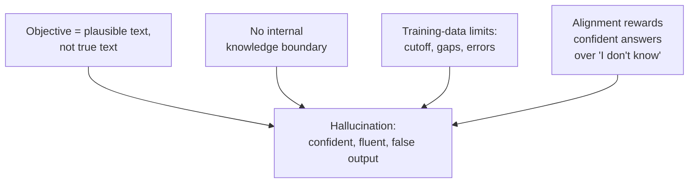
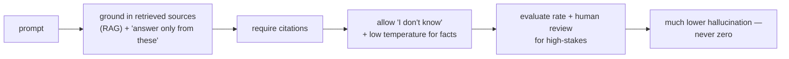

# Hallucination

## The problem it solves — or rather, the problem it *is*

Every other lesson in this category is about making the model *do* something. This one is about the thing it does that you wish it wouldn't: **produce confident, fluent, plausible-sounding output that is simply false.** A model invents a court case that never happened, cites a paper that doesn't exist, states a wrong revenue figure with total assurance, or attributes a quote to the wrong person — and it does all of this in exactly the same authoritative voice it uses for correct answers. That failure is called **hallucination**, and understanding it is non-negotiable for anyone shipping an AI product, because it's the single failure mode most likely to embarrass you in front of a customer or a regulator.

The crucial reframing, and the thing that separates a real understanding from a shallow one: **hallucination is not a bug that a patch will fix.** It is a direct, predictable consequence of *how* these models work. A language model is a next-[token](../01-foundations/01-tokenization.md) predictor — at every step it emits the most plausible continuation given everything so far. Its training objective was to produce *plausible* text, never *true* text. Nothing in that machinery contains a fact-checker, a database of verified truth, or a built-in sense of "do I actually know this?" So when the model hits a region where its training data was thin, absent, or contradictory, it doesn't stop and flag the gap — it does the only thing it knows how to do: it generates the most plausible-looking continuation. Sometimes that plausible continuation is true. Sometimes it's a confident fabrication. **From the inside, the model can't tell the difference — and neither can the output.** That's the whole problem in one sentence.

So this lesson isn't "here's a checklist to eliminate hallucination." It's "here's why it's intrinsic, and therefore why the job is *managing* it, not *curing* it."

## The one analogy to remember

**The picture:** A friend who is fantastic at bar trivia but constitutionally incapable of saying "I don't know." Ask them anything — the capital of a country, who directed a film, what year a battle happened — and they answer instantly, fluently, confidently. Most of the time they're right. But when they don't actually know, they don't pause or hedge; they produce a smooth, plausible-sounding answer delivered in the *exact same confident tone* as the ones they're sure of. You cannot tell, from how they say it, which answers are knowledge and which are bluff.

**The mapping:** the friend = the model; "can never say 'I don't know'" = the model's default drive to always emit a plausible next-token continuation; the identical confident tone whether they know or are guessing = the uniform fluency the model applies to facts and fabrications alike; your inability to tell bluff from knowledge by delivery = hallucinations being linguistically indistinguishable from correct answers; the questions they secretly don't know = prompts landing in gaps or thin spots of the training data.

**Why it holds:** it names the true mechanism rather than a vibe. The model optimizes for *plausible*, not *true*, and has no built-in "do I actually know this?" check — so it fills gaps with fluent guesses carrying the same confidence as real facts. "Never says 'I don't know'" is exactly the trained default: fluency was rewarded, calibrated uncertainty was not. And the "you can't tell from the tone" part is precisely why hallucination is dangerous — the error wears the costume of a correct answer.

**Say it like this:** "A model hallucinates because it's built to always produce a plausible answer, not to know when it doesn't know — like a trivia friend who can never say 'I don't know' and bluffs every gap in the same confident voice as the real facts."

*Where it breaks:* a human bluffer *knows* they're bluffing; the model has no internal "I'm making this up" flag — which is why calling it "lying" is wrong, since lying requires knowing the truth and choosing to hide it. And not every hallucination comes from a knowledge gap — some come from [decoding](16-sampling-decoding.md) randomness or from contradictory context. Finally, the friend *can* be coached to say "I'm not sure," just as models can be trained or prompted toward uncertainty — so "never says 'I don't know'" is the default, not an unbreakable law.

## Why it happens: four roots

"It predicts plausible tokens" is the headline cause, but an interviewer will want the specifics. Four distinct roots, and naming them shows depth.

1. **The objective is plausibility, not truth.** [Pretraining](../01-foundations/06-pretraining-vs-posttraining.md) rewards predicting the next token in human text. Fluent, well-formed, likely-sounding text is the target — and false statements can be perfectly fluent and likely-sounding. Truth was never the loss function. This is the root root.
2. **No knowledge boundary.** The model has no reliable internal signal for "this is outside what I actually learned." It can't cleanly separate "I'm confident because I saw this a thousand times" from "I'm generating something plausible in a vacuum." So gaps get filled instead of flagged.
3. **Training data limits.** What the model learned is bounded — a knowledge cutoff date, thin coverage of niche or private topics, and outright errors and contradictions absorbed from the web. Ask about something after the cutoff or about your internal systems, and there's nothing true to retrieve; the model improvises.
4. **Alignment can *reward* confident guessing.** Here's the subtle one. When models are tuned on human preferences via [RLHF](../02-model-behavior-training/11-rlhf.md), raters often prefer a confident, complete-sounding answer over an "I'm not sure." That can nudge the model *toward* assertive answers and *away* from admitting ignorance — a cousin of **sycophancy** (telling people what sounds good). So the very process meant to make models more helpful can make them more willing to bluff.

## The flavors you'll actually see

Hallucination isn't one thing. Distinguishing the types signals you've dealt with it in production, not just read about it.

- **Factual fabrication:** stating false facts — wrong dates, invented statistics, made-up people or events.
- **Fabricated sources:** the classic and most damaging in professional settings — inventing citations, case law, URLs, or paper titles that look real and don't exist. Dangerous precisely because it *looks* verifiable.
- **Faithfulness / grounding failures:** even *with* the right documents in context, the model states something the source doesn't say, or contradicts it. This is the type [RAG](../04-retrieval-knowledge/21-rag.md) and [grounding and citations](../04-retrieval-knowledge/27-grounding-citations.md) target — and the reason "we gave it the documents" is not the same as "it will stick to them."
- **Reasoning that looks right but isn't:** a [chain-of-thought](17-chain-of-thought.md) can be fluent and well-structured and still reach a wrong conclusion — the faithfulness gap from that lesson. Confident reasoning is not correct reasoning.

## Managing it: the toolkit, and why none of it is a cure

You cannot eliminate hallucination, but you can drive it down a lot and contain the damage of what remains. The levers, roughly in order of impact:

- **Ground the model in retrieved facts ([RAG](../04-retrieval-knowledge/21-rag.md)).** Put the actual source material in the prompt and instruct the model to answer *only* from it. This is the biggest lever for knowledge tasks — it replaces "recall from fuzzy memory" with "read from provided text." It reduces but does not remove hallucination, because the model can still misread or over-reach beyond the source (the faithfulness failure above).
- **Demand citations and verify them ([grounding and citations](../04-retrieval-knowledge/27-grounding-citations.md)).** Requiring the model to point to its source both discourages fabrication and gives you (or the user) something to check.
- **Give it permission to say "I don't know."** Because the default drift is toward confident answers, explicitly instructing the model that "not sure" is an acceptable, even preferred, response measurably reduces confident fabrication. You're counteracting root #4.
- **Lower [temperature](16-sampling-decoding.md) for factual tasks.** More randomness in decoding means more draws from the tail, which can surface less-likely (and less-true) tokens. For extraction and factual Q&A, low temperature keeps the model on its highest-confidence path. (This tames one *contributor*, not the root cause.)
- **Constrain the task.** Narrow, well-specified tasks with the needed information provided hallucinate far less than open-ended "tell me about X" prompts that invite the model to range across its fuzzy memory.
- **Verify with [evaluation](../09-evaluation/45-evaluation-methods.md) and human review where stakes are high.** Measure hallucination rates, and keep a human in the loop for high-consequence outputs. This is containment, not prevention.

## The product framing a PM must own

Three things to carry into any product conversation.

**It can't be zeroed, so design for it.** The right posture is not "we'll fix hallucination" — that promise will be broken — but "we've reduced it and we've contained the blast radius." Match the surface to the tolerance: a brainstorming tool can absorb the occasional made-up idea; a medical, legal, or financial answer cannot, and there you need grounding, citations, and human review as hard requirements, not nice-to-haves.

**Confidence is not calibrated.** The model's fluent certainty carries *no* reliable information about whether it's right — a hallucination sounds exactly as sure as a fact. So never surface model confidence as if it were trustworthy, and never let a UI imply the answer is verified when it isn't.

**Grounding changes the failure, it doesn't remove it.** Adding RAG moves you from "invents facts from nothing" to "usually sticks to sources but can still misread them." That's a huge improvement and a different, smaller problem — but telling stakeholders RAG "solves hallucination" is the overclaim that comes back to bite you.

## Summary / Points to Remember

- **Hallucination** = confident, fluent, plausible output that is **false**, delivered in the same voice as correct answers. It is **intrinsic, not a bug**: models predict *plausible* tokens, not *true* ones, and have no built-in fact-checker or "do I know this?" signal.
- Four roots: **objective is plausibility not truth**; **no internal knowledge boundary**; **training-data limits** (cutoff, gaps, errors); and **alignment/RLHF rewarding confident answers** over "I don't know" (a cousin of sycophancy).
- Flavors: **factual fabrication**, **fabricated sources/citations** (most damaging professionally), **faithfulness failures** (wrong even with the right docs present), and **fluent-but-wrong reasoning**.
- Toolkit (reduces, never cures): **[RAG](../04-retrieval-knowledge/21-rag.md) grounding** (biggest lever), **required citations**, **permission to say "I don't know,"** **low [temperature](16-sampling-decoding.md) for facts**, **task constraint**, and **evaluation + human review** for high stakes.
- Product truths: **can't be zeroed — design for it and contain the blast radius**; **model confidence is not calibrated** (a hallucination sounds as sure as a fact); **grounding changes the failure mode, it doesn't remove it.**
- Why it's not "lying": the model has no internal flag that it's fabricating — lying requires knowing the truth and hiding it.

## Interview Questions That Stump People

**Q: "Why do models hallucinate? And be honest — is this something we can just fix?"**

**Interviewer:** Give me the real reason, and tell me whether it's fixable.

**You:** It's not fixable in the "patch and it's gone" sense, and the reason is baked into how the models work. A language model is a next-token predictor trained to produce *plausible* text — its objective was never truth, it was likelihood. There's no fact-checker or verified knowledge base inside it, and crucially no reliable internal signal for "this is outside what I actually learned." So when a prompt lands in a gap — something past its training cutoff, a niche topic, your private data — it doesn't stop and flag the gap; it generates the most plausible-looking continuation, which is sometimes true and sometimes a confident fabrication. From the model's perspective those two feel identical, because both are just "likely text." So hallucination is a direct consequence of the mechanism, not a defect layered on top. What we *can* do is drive the rate way down and contain the damage — grounding it in retrieved sources, requiring citations, giving it permission to say "I don't know," verifying high-stakes outputs. That's management, not a cure, and I'd be wary of anyone who promises otherwise.

> [!TIP]
> **Why this works:** The trap is either a hand-wavy "it makes mistakes" or an overclaim that it's fixable. Grounding the answer in the training objective (plausible, not true) and the absence of a knowledge boundary shows you understand the *mechanism*, which is why you can then credibly say it's intrinsic. Ending on "manage, don't cure" plus concrete levers signals product maturity — you won't sign your company up for a promise engineering can't keep.

---

**Q (clarify-back): "We added RAG so the model has the real documents. That solves hallucination, right?"**

**Interviewer:** We feed it the source docs now. Problem gone?

**You (clarify back):** It's a big step — can I check what we actually need it to guarantee? Are we trying to reduce made-up facts to a low rate, or do we need a hard guarantee that every statement is traceable to a source, for something like compliance?

**Interviewer:** Reduce it a lot — but leadership is starting to say "zero hallucinations" in sales calls.

**You:** Then I'd push back on the "zero" language before it becomes a promise we can't keep. RAG helps enormously — it swaps "recall from fuzzy memory" for "read from provided text," which is the biggest single lever we have. But it changes the failure mode rather than removing it: even with the right documents in context, the model can still misread them, over-reach beyond what they say, or blend them with its own prior beliefs — that's a faithfulness failure, and it's a real, measured phenomenon. So the honest claim is "greatly reduced and now traceable to sources," not "zero." If we genuinely need a compliance-grade guarantee, we'd layer required citations that get checked, constrain answers to only the retrieved text, and add human review on high-stakes outputs — and even then I'd frame it as strong assurance, not a mathematical zero.

> [!TIP]
> **Why this works:** "RAG solves it" is the single most common overstatement in this space. Clarifying the real requirement (reduction vs. hard guarantee) surfaces the actual risk — a "zero" promise leaking into sales. Naming the faithfulness failure (wrong even with the right docs) proves you know RAG's limit, and steering the language from "zero" to "reduced and traceable" protects the company from an unkeepable claim, which is exactly the PM's job.

---

**Q: "The model gave a wrong answer with total confidence. Can't we just have it tell us when it's unsure, and hide the low-confidence ones?"**

**Interviewer:** Just surface a confidence score and filter. Why won't that work cleanly?

**You:** Because the model's confidence isn't calibrated — a hallucination comes out sounding exactly as certain as a correct answer, so its expressed confidence carries little reliable information about whether it's actually right. The whole danger of hallucination is that the error wears the costume of a correct answer; there's no honest "I'm 40% sure" tone underneath that we're just failing to display. Part of why is that the alignment process often rewards confident, complete-sounding answers over hedged ones, which pushes the model *away* from expressing genuine uncertainty. Now — we *can* improve this: explicitly instructing the model that "I don't know" is acceptable does reduce confident fabrication, and there are techniques to elicit better-calibrated uncertainty. But I wouldn't build a UI that filters on a raw self-reported confidence score as if it were trustworthy, because that would give users a false sense that the surviving answers are verified. Better to ground answers in sources and let users check citations than to trust the model's own certainty meter.

> [!TIP]
> **Why this answer works:** The naive fix assumes the model has a reliable internal confidence it just isn't showing. The strong move is to explain that confidence is *uncalibrated* — the error sounds as sure as the truth — and to connect it to the alignment-rewards-confidence root. Acknowledging that "I don't know" prompting genuinely helps, while refusing to build a UI on an untrustworthy confidence score, shows nuance rather than a flat "can't be done."

---

**Q: "Is a hallucination the model lying to us?"**

**Interviewer:** It stated something false as if it were true. Isn't that lying?

**You:** No, and the distinction matters for how we handle it. Lying means knowing the truth and deliberately saying something else to deceive. The model has no internal flag that says "I'm making this up right now" — to it, a fabricated continuation and a true one are both just "the most plausible next tokens." There's no hidden true answer it's concealing; often there's no represented truth at all, just a gap it filled fluently. So "lying" is the wrong mental model, and it's not just pedantry: if you think the model is being deceptive, you look for intent and honesty fixes, which don't apply. If you understand it's an ungrounded plausibility machine with no truth-check, you reach for the right tools — grounding, citations, verification — that actually address the mechanism. The anthropomorphism ("it lied to me") leads people to the wrong solutions.

> [!TIP]
> **Why this answer works:** It resists a tempting anthropomorphism and shows *why* the distinction is practical, not semantic — "lying" implies intent and misdirects you toward the wrong remedies. Explaining that the model has no internal "I'm fabricating" signal reinforces the core mechanism (no knowledge boundary), and tying it back to choosing the right mitigations demonstrates you translate conceptual clarity into product decisions.

---

**Q: "Where would you accept hallucination risk in a product, and where would you refuse to ship without heavy mitigation?"**

**Interviewer:** You can't zero it out. So how do you decide where it's tolerable?

**You:** I match the mitigation to the cost of being wrong. On low-stakes, creative, or clearly-exploratory surfaces — brainstorming, first-draft copy, ideation — an occasional fabrication is cheap and often obvious, so light mitigation and a clear "this is a draft, verify it" framing is enough. The bar rises fast as consequences do. For anything factual that a user will act on — and especially medical, legal, financial, or compliance contexts — I'd treat grounding in verified sources, required and checked citations, and human review as hard launch requirements, not enhancements, because a single confident fabrication there can cause real harm or legal exposure. I'd also weight *how detectable* the error is: fabricated citations are dangerous precisely because they look verifiable, so domains prone to that flavor need citation-checking specifically. The general principle: hallucination is a risk to be budgeted against impact, and the product's job is to put the strongest controls exactly where a wrong answer costs the most.

> [!TIP]
> **Why this answer works:** It accepts the premise (can't be zeroed) and turns it into a risk-tiering framework rather than a blanket rule, which is the mature PM stance. Distinguishing surfaces by cost-of-being-wrong, calling out detectability (fabricated citations look real), and treating mitigations as hard requirements only where stakes demand it shows you allocate effort proportionally instead of over- or under-engineering every surface.
