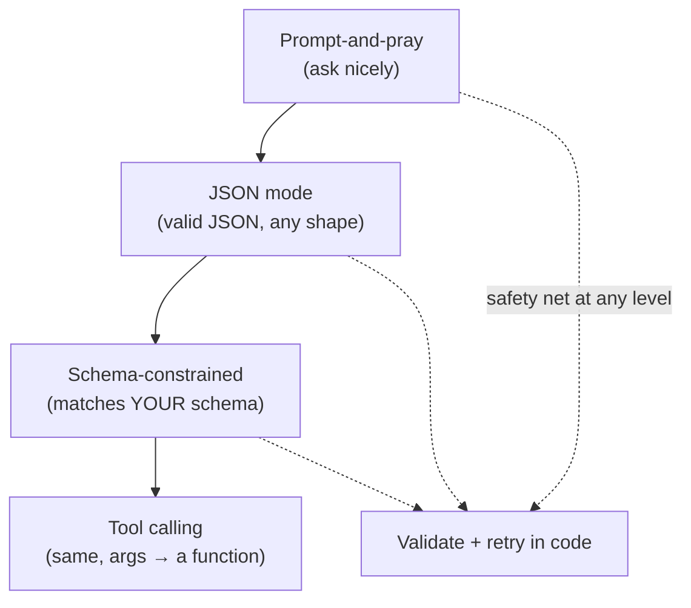
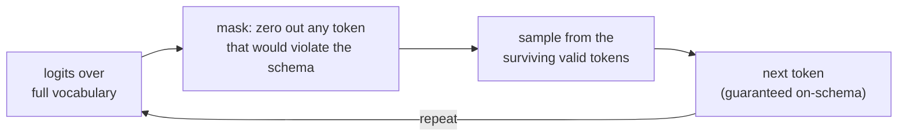

# Structured outputs

## The problem it solves

A language model's native output is a **string of free text** — prose meant for a human to read. But most of the time you're not building a chatbot; you're building software, and software doesn't read prose. It needs data with a shape: fields with names, values with types, something it can index into with `result["price"]` and hand to the next function, write to a database row, or send to an API (Application Programming Interface — the defined way one piece of software calls another). The moment you want the model to be a *component in a pipeline* rather than a conversational partner, you hit the mismatch: the model emits "The invoice total is $1,240, due March 3rd," and your code needs `{"total": 1240.00, "due_date": "2026-03-03"}`.

The naive fix — "just ask it for JSON and parse the result" (JSON, JavaScript Object Notation, is the near-universal text format for structured data — the `{"key": value}` shape above) — breaks in production in a dozen small, maddening ways. The model wraps the JSON in a markdown code fence. It prepends "Sure, here's the JSON you asked for:". It emits a trailing comma, or single quotes, or an unescaped newline inside a string. It renames `due_date` to `dueDate` on one call out of fifty. Every one of those makes `JSON.parse` throw, and now you're writing regex to scrape JSON out of prose and retrying failed calls — brittle glue code around an unreliable core. **Structured outputs** is the set of techniques that make the model's output *conform to a shape you specify* reliably enough to build on — at the strongest end, with a hard guarantee that the bytes coming out will parse and match your schema.

> [!NOTE]
> **JSON Schema** — a small, standard language for describing the shape of a JSON object: which fields exist, each field's type (`string`, `number`, `boolean`, `array`, nested object), which are required, and constraints like "must be one of these enum values." It's the contract you hand the model — "fill *this* in" — and the same contract your code validates against. You don't need to master its syntax for this lesson, just the idea: it's a machine-readable description of the desired output's structure.

## The one analogy to remember

**The picture:** The difference between handing someone a blank sheet of paper and saying "write me the shipping details," versus handing them a **printed form** with labeled boxes — *Name*, *Address*, *Postcode*, *Quantity* — where the postcode box only accepts digits and won't let them scribble a sentence in the margin.

**The mapping:** the blank sheet = free-text generation (you get prose you must then parse and pray over); the printed form = the schema you supply; the labeled boxes = the required fields and their types; the rule that you *physically can't* write letters in the number-only box or spill outside the lines = **constrained decoding**, which restricts what the model is allowed to emit at each step; the neatly filled form = valid JSON your code can read directly.

**Why it holds:** the guarantee in both cases comes from *restricting what can be written*, not from politely asking the writer to behave. A form doesn't reduce mistakes by trusting the person to remember the format — it makes the wrong format physically impossible to enter. Constrained decoding does exactly that at the token level: it masks out any next-token that would break the schema, so invalid output can't be produced in the first place.

**Say it like this:** "Instead of asking the model for a letter and hoping it's formatted right, structured outputs hand it a form it's only allowed to fill inside the boxes — so what comes back always fits."

*Where it breaks:* a form guarantees the boxes are filled in the right *format*, never that the *answers are true* — someone can write a perfectly valid but wrong postcode. Same with structured outputs: they guarantee shape, not correctness. And the metaphor undersells that the model still *generates* the content freely; only its shape is constrained.

## The spectrum of approaches — from "hope" to "guarantee"

The single most useful thing to carry into an interview is that "structured output" isn't one technique — it's a ladder of methods offering progressively stronger guarantees, at progressively higher cost in setup and rigidity. Knowing where each rung sits is what separates someone who's *used* this from someone who's read a docs page.

1. **Prompt-and-pray.** Put "Respond only with JSON matching this shape: …" in the prompt. Zero guarantee. The model *usually* complies, but "usually" is a disaster at scale — the failures are random and you own all the cleanup. Fine for a prototype, never for a pipeline.

2. **JSON mode.** A provider flag that biases (or constrains) decoding so the output is *syntactically valid JSON* — it'll parse. But it guarantees only that it's *some* valid JSON, not that it matches *your* schema. You can still get the wrong field names, missing keys, or an extra nesting level. Solves "does it parse," not "is it the shape I need."

3. **Schema-constrained structured outputs.** You supply a full JSON Schema and the provider guarantees the output validates against *it specifically* — right fields, right types, required keys present. This is the strong rung, and under the hood it's usually **constrained decoding** (below). This is what people mean by "Structured Outputs" as a named feature.

4. **Tool / function calling.** The same schema-constrained machinery, framed differently: when the model calls a tool, the *arguments* it produces are constrained to the tool's parameter schema. Structured outputs and [tool calling](../06-agents/32-tool-calling.md) are the same underlying capability wearing two hats — one returns data to you, the other hands data to a function. (That lesson owns the tool-calling story; here just note they share a mechanism.)

5. **Validate-and-retry.** A complement to any of the above, not a rung of its own: parse the output against your schema in code, and if it fails, send it back with the error and ask again. Essential as a safety net when you *don't* have hard constrained decoding available; redundant (but cheap insurance) when you do.

## The mechanism worth understanding: constrained decoding

This is the concept that, explained well, shows you actually understand *why* the strong guarantee is possible. Recall from [sampling and decoding](16-sampling-decoding.md) that at every step the model produces a **logit** (a raw score) for every token in its vocabulary, and the decoder picks the next token from those scores. **Constrained decoding** (also called grammar-constrained or structured decoding) inserts a filter into that step: given the schema and everything generated so far, it computes which tokens would keep the output *on a valid path*, and **masks out every other token** — sets their probability to zero — before the pick happens.

Concretely: if the schema says the next thing must be the key `"price"` followed by a number, then right after `"price":` the only tokens allowed are digits (and maybe a minus sign or decimal point). The token for the letter `a` isn't "discouraged" — it's *removed from consideration*. It becomes structurally impossible for the model to emit malformed output, because at no step is it ever *offered* a token that would break the structure.

That's the difference between rungs 1–2 and rung 3 in one image: prompting *asks* the model to stay in the lines; constrained decoding *removes the ability* to leave them. The guarantee is mechanical, not behavioral — which is why it's a guarantee at all.

## What it does *not* give you — and the trap nobody warns you about

**Structure is not correctness.** This is the failure mode to internalize. Constrained decoding guarantees the output *parses and fits the schema*; it says nothing about whether the *values are right*. Ask for `{"ceo": string}` about a company the model knows nothing about, and you'll get a perfectly valid JSON object containing a confidently fabricated name. The straitjacket is on the shape, not the substance — so structured outputs don't reduce [hallucination](19-hallucination.md), they just make the hallucination well-formatted. You still validate values and treat content as untrusted.

**The format straitjacket can hurt quality.** The subtle, counter-intuitive one — and a favorite interview probe. Forcing a model to emit rigid structure *while it's still working out the answer* can measurably degrade the answer, because the model is spending its generation budget satisfying the format instead of reasoning, and it can't "think out loud" on the way. The fix is to not make it do both at once: let it reason first, then structure. In practice that means either a two-step call (reason freely, then a second call to format the result) or **a schema that includes the reasoning** — put a `"reasoning"` or `"analysis"` string field *before* the answer fields, so the model does its [chain-of-thought](17-chain-of-thought.md) inside the structure before it has to commit to the final values. Field order matters here: the model generates left to right, so a reasoning field only helps if it comes *first*.

**Over-strict schemas can *induce* fabrication.** If your schema marks a field as required and non-nullable, you've told the model it *must* produce a value — even when the honest answer is "the text didn't say." A required `"discount_percent": number` with no escape hatch forces the model to invent a number rather than leave it blank. The fix is to design the schema to permit ignorance: make fields nullable or optional, or add an explicit `"not_found"` / enum-of-`"unknown"` option, so "I don't know" is a *representable, valid* answer rather than something the schema forbids.

**It isn't free or universal.** Constrained decoding adds some latency, provider support varies, and real JSON Schema is large — most implementations support a practical subset (enums, required, nesting, basic types), not every exotic feature. Deeply nested or enormous schemas can degrade reliability and speed. Keep schemas as flat and small as the task allows.

## The product framing a PM should own

Structured outputs are **what turn a language model from a chat toy into a callable software component.** Without them, the model is a thing you talk to; with them, it's a function that returns typed data you can wire into anything — which is precisely why they're the backbone of [tool calling](../06-agents/32-tool-calling.md) and therefore of [agentic systems](../06-agents/34-agentic-systems.md). "Extract these fields from every incoming contract into our database" is a structured-outputs product; it doesn't exist without a reliable shape guarantee.

The metric that matters is **schema-valid rate** — the fraction of calls that come back parseable and on-schema. With prompt-and-pray it might be 95%, and that 5% is a stream of production incidents; with constrained decoding it's effectively 100%, which is what lets you build on it. But hold the line on what that number means: it's *validity*, not *accuracy*. A 100% schema-valid rate with 80% correct values is a very real and very dangerous place to be, because everything *looks* clean. So the honest posture is: constrained decoding solves the parsing problem completely and the correctness problem not at all — you still need value validation and evals on the *content*.

## Summary / Points to Remember

- **Structured outputs** make a model's output conform to a machine-readable shape (usually JSON matching a **JSON Schema**), so the model becomes a component you can wire into software instead of prose you have to scrape.
- It's a **ladder of guarantees**, not one trick: prompt-and-pray (no guarantee) → JSON mode (valid JSON, any shape) → schema-constrained (matches *your* schema) → tool calling (same machinery, args to a function), with **validate-and-retry** as a safety net at any level.
- The strong guarantee comes from **constrained decoding**: at each step, mask the [logits](16-sampling-decoding.md) so only tokens that keep the output schema-valid can be picked. It *removes the ability* to emit malformed output rather than asking nicely — a mechanical guarantee, not a behavioral one.
- **Validity ≠ correctness.** It guarantees the shape, never the values — you can get flawless JSON full of [hallucinated](19-hallucination.md) content. Structured outputs don't reduce hallucination; they format it.
- **The format straitjacket:** forcing structure while the model is still reasoning can hurt the answer. Let it reason first — a two-step call, or a `"reasoning"` field placed *before* the answer fields (order matters; the model generates left to right).
- **Over-strict schemas induce fabrication:** a required, non-nullable field forces a value even when the honest answer is "unknown." Design in nullable/optional fields or an explicit "not found" so ignorance is representable.
- Product lens: structured outputs are what make LLMs **composable** (the basis of tool calling and agents); track **schema-valid rate**, but never confuse it with accuracy.

## Interview Questions That Stump People

**Q: "We already put 'respond only in JSON' in the prompt and parse the result. Why would we need anything more than that?"**

**Interviewer:** It works in our testing. What's the actual problem with just prompting for JSON?

**You:** It works *until it doesn't*, and the failures are random and unattributable, which is the worst kind at scale. Prompting for JSON is a request, not a guarantee — the model will still occasionally wrap it in a markdown fence, add a "Here's your JSON:" preamble, emit a trailing comma, or quietly rename a field, and each of those makes the parse throw. At 95% compliance that's one failed call in twenty, and you can't predict which. The real fix is to move from *asking* to *constraining*: schema-constrained structured outputs use constrained decoding, which masks out any token that would break the schema at generation time, so malformed output becomes impossible rather than unlikely. The mental shift is from "please format it right" to "it's structurally incapable of formatting it wrong." Prompt-and-pray is fine for a demo; anything a pipeline depends on needs the guarantee.

> [!TIP]
> **Why this answer works:** The trap is treating this as a prompt-wording problem ("we'll just phrase it better"), which never closes the gap because there's no wording that *guarantees* compliance. Naming the distinction between a *request* and a *mechanical constraint* — and citing constrained decoding as *why* the strong version is a guarantee — shows you understand the mechanism, not just the feature name. The "1 in 20 at scale" framing translates it into an operations risk, which is the PM's language.

---

**Q (clarify-back): "Should we just turn on strict structured outputs everywhere by default?"**

**Interviewer:** Structured outputs are more reliable, so why not force every call through a schema?

**You (clarify back):** For most calls, yes — but let me check one thing: are any of these tasks ones where the model has to *reason its way* to the answer, like classifying something ambiguous or doing multi-step extraction, versus just reformatting data it already has?

**Interviewer:** Some are simple field extraction, but a few involve judgment calls the model has to work through.

**You:** Then I'd split them. For the simple reformatting tasks, absolutely — constrain them hard, there's no downside. But for the ones needing judgment, forcing rigid structure *while* the model reasons can actually lower answer quality, because it's spending its generation on satisfying the format instead of thinking, and it can't reason out loud before committing. For those I'd still use structured outputs, but design the schema so it reasons *inside* it — a `"reasoning"` string field placed before the answer fields, since the model generates left to right — or do it in two steps: reason freely, then format. So the rule isn't "constrain everything," it's "constrain everything, but give the thinking tasks room to think first."

> [!TIP]
> **Why this works:** "Turn it on everywhere" sounds safe and is the tempting answer, but it walks into the format-straitjacket trap. Clarifying whether tasks require reasoning is the load-bearing move — it's the exact variable that decides whether naive constraining helps or hurts. The final answer shows the nuance (constrain shape *and* preserve reasoning by ordering a reasoning field first), which signals you've actually debugged a quality regression caused by over-constraining, not just read that structured outputs are good.

---

**Q: "So if the JSON is always schema-valid now, we can trust the output, right?"**

**Interviewer:** With constrained decoding the output always parses and matches the schema. Doesn't that mean it's reliable?

**You:** Reliable in *shape*, not in *substance* — and conflating the two is where teams get burned. Constrained decoding guarantees the bytes parse and the fields and types are correct; it says nothing about whether the *values* are right. You can get a flawless, perfectly-typed JSON object where the `price` is fabricated and the `date` is wrong. It doesn't reduce hallucination at all — it just makes the hallucination well-formatted, which is arguably more dangerous because it *looks* trustworthy and sails straight through your parser into your database. So the schema-valid rate can be 100% while the *accuracy* is 80%, and those are two completely different numbers to track. Structured outputs close the parsing problem entirely and the correctness problem not one bit — you still validate the values and run evals on the content.

> [!TIP]
> **Why this answer works:** The naive read is that a validity guarantee is a quality guarantee. Separating **validity from correctness** — and pointing out that well-formatted wrong data is *more* insidious because it looks clean — is exactly the depth an interviewer is fishing for. Splitting "schema-valid rate" from "accuracy" as two distinct metrics proves you'd instrument this correctly in production rather than declaring victory when the parse errors stop.

---

**Q: "The model keeps inventing a value for a field that isn't in the source document. Why does it do that, and how would you stop it?"**

**Interviewer:** We extract a `discount_percent` field, and when the contract doesn't mention a discount, the model just makes one up. What's going on?

**You:** You've almost certainly told it to. If `discount_percent` is a required, non-nullable number in the schema, constrained decoding *forces* the model to emit a number there — the schema has made "leave it blank" structurally impossible, so the model's only legal move is to produce *some* number, and it fills the gap with a plausible fabrication. It's not defying your instructions; it's obeying the schema you gave it. The fix is at the schema level: make the field nullable or optional, or add an explicit escape hatch — a `"not_specified"` enum value, or a boolean `"discount_present"` gate. Once "the document didn't say" is a *representable, valid* answer, the model can take it instead of inventing one. It's a nice example of the general principle: an over-strict schema doesn't just fail to prevent fabrication, it can actively cause it.

> [!TIP]
> **Why this answer works:** Most people blame the model ("it hallucinates") and reach for a sterner prompt. The strong move is to see that the *schema itself* is the cause — a required field is an instruction to always produce a value — which flips it from a model-behavior problem to a schema-design problem you can actually fix. Ending on the general lesson ("make ignorance representable") shows you can generalize the fix, not just patch one field.

---

**Q: "How is this different from function calling? Aren't they the same thing?"**

**Interviewer:** We use tool calling already. Is structured outputs just a rebrand of that?

**You:** They're the same underlying capability pointed at two different jobs. Both use schema-constrained generation to make the model emit data conforming to a shape you specify. The difference is the *destination*: with structured outputs, the constrained data is the final result returned to you; with [tool calling](../06-agents/32-tool-calling.md), the constrained data is the *arguments* to a function the system then executes, whose result usually goes back into the model. So "extract these fields into JSON for my database" is structured outputs; "call `get_weather(city, date)` with the right arguments" is tool calling — same schema-constraining engine, different plumbing on the output. Historically many providers even built the first via the second. I wouldn't treat them as unrelated features; I'd treat structured outputs as the general capability and tool calling as its application to invoking functions.

> [!TIP]
> **Why this answer works:** Treating them as two separate features you memorized separately is the shallow tell. Recognizing the *shared mechanism* (schema-constrained decoding) and distinguishing them only by *where the data goes* (returned to you vs. fed to a function) shows a unified mental model — which is exactly what lets you reason about new features instead of memorizing each one. It also sets you up to talk about agents, where the same mechanism does all the heavy lifting.
