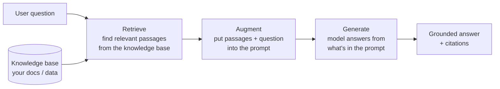
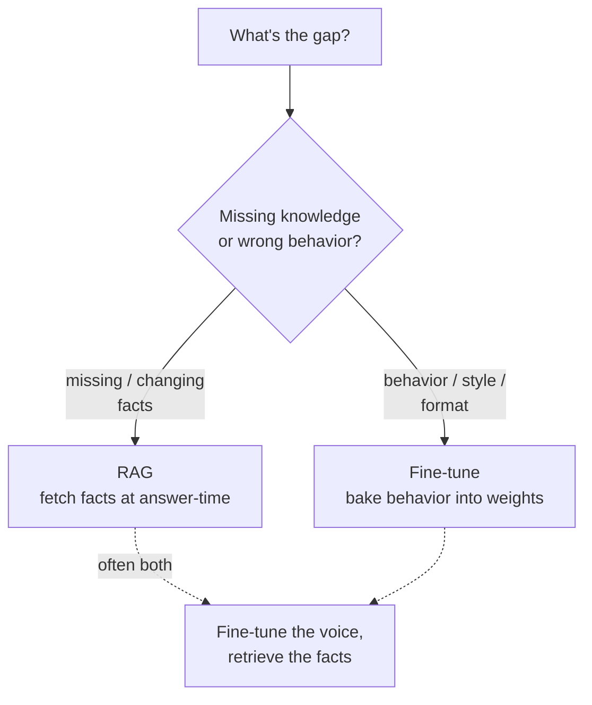

# RAG (Retrieval-Augmented Generation)

## The problem it solves

A language model knows an enormous amount, but everything it knows was frozen the day its [pretraining](../01-foundations/06-pretraining-vs-posttraining.md) data was collected, and none of it is *yours*. Ask it about last week's earnings, your company's refund policy, the customer's current subscription tier, or the contents of a document you uploaded thirty seconds ago, and it has three options — all bad: say "I don't know" (useless), stay silent (also useless), or do the thing it does most naturally and invent a fluent, confident, plausible answer that happens to be wrong. That last failure is [hallucination](../03-reasoning-generation/19-hallucination.md), and it's not a bug you can prompt your way out of, because the model genuinely does not have the fact — it's answering from a closed book.

And you can't fix this by [fine-tuning](../02-model-behavior-training/07-fine-tuning.md) the facts in. That lesson's core lesson was the wall you hit here: **fine-tuning reshapes behavior, it does not reliably install knowledge** — train a model on your docs and it learns to *sound* like them while still making up the specifics. Worse, your facts change: prices update, policies get revised, a ticket's status flips from open to resolved. You are not going to retrain a model every time a database row changes.

**RAG (Retrieval-Augmented Generation) is the answer to that whole class of problem.** Instead of hoping the fact is baked into the weights, you *fetch* the relevant information at the moment of the question — from your documents, your database, a search index, the live web — and paste it into the [context window](../01-foundations/05-context-windows.md) alongside the user's question, so the model answers from an *open book* it's reading right now rather than from frozen memory. The model's job shifts from "recall the fact" to "read these passages and answer using them," which is a task it's dramatically better and safer at. This is the opening lesson of category 04, and every lesson that follows it — chunking, vector databases, retrieval, reranking, hybrid search, grounding — is a component *inside* the RAG pipeline this lesson frames.

> [!NOTE]
> **Context window** is the only prerequisite that carries weight here: it's the fixed-size working space — prompt plus retrieved text plus the model's reply — that the model can "see" at once, measured in [tokens](../01-foundations/01-tokenization.md). RAG works by loading fetched facts *into* that window. If it's fuzzy, the one-line version lives in the [ML vocabulary primer](../primers/ml-vocabulary.md); the full treatment is [Context windows](../01-foundations/05-context-windows.md). Everything else in this lesson is introduced as it appears.

## The one analogy to remember

**The picture:** A brilliant consultant with an encyclopedic memory, but who's been locked in a room since last year and has never seen your company's files. You don't ask them to answer from memory. You ask your question, and *before* they answer, an assistant runs to the filing cabinet, pulls the three most relevant folders, and lays them open on the desk. The consultant reads what's in front of them and answers using it.

**The mapping:** the consultant = the language model (vast general knowledge, but frozen and generic); the locked room since last year = the training-data cutoff; the assistant who fetches folders = the **retrieval** step; the filing cabinet = your knowledge base (documents, database, index); the three folders on the desk = the retrieved passages placed in the context window; the consultant reading and answering = the **generation** step.

**Why it holds:** the consultant's intelligence was never the missing piece — *access to your specific, current information* was. RAG doesn't make the model smarter; it changes what's on the desk when the model answers. And it captures the two failure modes exactly: if the assistant grabs the wrong folders, even a genius gives a wrong answer (bad retrieval caps quality), and if you tell the consultant "only use what's in these folders," they stop making things up (grounding reduces hallucination).

**Say it like this:** "RAG is open-book instead of closed-book — we fetch the right pages and set them on the desk before the model answers, so it reads the facts instead of recalling them."

*Where it breaks:* a human consultant will notice when the fetched folders are irrelevant and say "these aren't what I need"; a model often won't — it'll gamely answer from whatever it was handed, right or wrong. So don't push the analogy toward "the consultant will catch a bad fetch." The system only catches that if you build it to.

## The architecture: retrieve, then generate

The name is the whole design. **Retrieval-Augmented Generation** = a *generation* step (the model writing an answer) that has been *augmented* by a *retrieval* step (fetching relevant text first). Two phases, in order, on every request.

- **Retrieve.** Take the user's question, search your knowledge base for the passages most likely to contain the answer, and pull back the top few. *How* you search — by meaning, by keyword, or both — is the substance of the next several lessons; hold it loosely for now as "find the relevant chunks."
- **Augment.** Assemble a prompt that contains both the retrieved passages *and* the user's question, usually with an instruction like "answer using only the context below." You're loading the open book onto the desk.
- **Generate.** The model reads that assembled prompt and produces an answer grounded in the passages you supplied, ideally citing which one it used.

The pivotal thing to internalize: **the model never touches your knowledge base directly.** It only ever sees text in its context window. Retrieval's entire job is to decide *which* of your possibly-millions of documents' worth of text earns a spot in that limited window for this specific question. That framing — RAG as a *filtering-into-the-context-window* problem — is what makes the downstream lessons make sense.

## Why not just paste everything into the prompt?

The natural objection from someone who's just learned that context windows now hold hundreds of thousands of tokens: if the window is so big, why retrieve at all — why not stuff all the docs in and let the model sort it out? Three reasons, and a PM should be able to give all three.

- **It doesn't fit, and it won't.** Your knowledge base is gigabytes; the window is a few hundred thousand tokens. Corpora are almost always orders of magnitude larger than any window, so *some* selection is mandatory. Retrieval is that selection.
- **It's expensive and slow.** You pay per [token](../01-foundations/01-tokenization.md) on every call, and latency scales with how much the model has to read. Sending 200,000 tokens of context to answer a question that needed 500 is a massive, recurring waste — see [Cost and unit economics](../10-production-ops/51-cost-unit-economics.md). Retrieval sends the model the 500 that matter.
- **More context can make answers *worse*.** This is the counterintuitive one and the strongest argument. Models degrade when the relevant fact is buried in a large amount of irrelevant text — the signal gets diluted, and there's a well-documented tendency to under-weight information stranded in the *middle* of a long context (the "lost in the middle" effect). A tight, relevant prompt often beats a giant kitchen-sink one on accuracy, not just on cost. **Precision in what you retrieve is a quality lever, not only an efficiency one.**

So even in a world of ever-larger windows, RAG doesn't go away — it just gets more forgiving. The job is still to put the *right* information in front of the model, and "right" means relevant and tight, not merely "all of it."

## RAG vs. fine-tuning: the decision you'll be asked to defend

This is the crossover the [fine-tuning lesson](../02-model-behavior-training/07-fine-tuning.md) pointed here to resolve, and it's the single most common RAG interview question, so carry the clean version. They are not competitors; they fix *different gaps*.

- **Knowledge gap → RAG.** The model doesn't know something — because it's private, recent, or changes constantly. Fetch it. RAG's facts are always as fresh as your index, and updating them means updating a document, not retraining a model.
- **Behavior gap → fine-tune.** The model knows enough but responds in the wrong voice, format, or style. Bake that in with fine-tuning.
- **They compose.** The mature answer is often "both": fine-tune the model for your tone and output format, and use RAG to feed it current facts. They're solving orthogonal problems, so using one doesn't preclude the other.

The sentence that lands it: **fine-tuning changes how the model behaves; RAG changes what the model knows at answer-time. If your problem is stale or missing facts, no amount of fine-tuning fixes it — that's a retrieval problem.**

## The iron law of RAG: retrieval quality caps answer quality

Here is the one principle that outranks every other in this category. **A RAG system's answer can only be as good as the passages retrieval put in front of the model.** If the right document never gets fetched, the model cannot answer correctly — it's a genius reading the wrong folder. This has a blunt corollary that reorders where teams spend effort: **most RAG failures are retrieval failures, not generation failures.** The model is usually fine; it was handed the wrong context.

This is why the rest of category 04 exists, and it's worth seeing the whole pipeline as a chain where each link is a lesson devoted to making retrieval better:

- **[Chunking](22-chunking.md)** — how you split documents into retrievable pieces. Chunk badly and the right answer gets sliced in half or buried in noise before retrieval ever runs.
- **[Vector databases](23-vector-databases.md)** — the store that makes "find text by *meaning*" fast at scale, using [embeddings](../01-foundations/02-embeddings.md).
- **[Retrieval](24-retrieval.md)** — the actual search step and how relevance is scored.
- **[Reranking](26-reranking.md)** — a second, sharper pass that reorders the first batch of candidates so the *best* ones land at the top.
- **[Hybrid search](25-hybrid-search.md)** — combining meaning-based (semantic) and keyword search, because each catches what the other misses.
- **[Grounding and citations](27-grounding-citations.md)** — making the model actually *use* the retrieved text and point to its source, so answers are checkable and hallucination drops.

You don't need the internals of each yet. The point of the overview is that **RAG is not a single feature; it's a pipeline, and it's exactly as strong as its weakest link — which is almost always somewhere in retrieval, not in the model.**

## What RAG does and doesn't fix

RAG is powerful and over-sold, so a PM should hold both edges.

**What it genuinely fixes:** stale knowledge (index is always current), private/proprietary knowledge (your data never had to be in the model's training set), and — when paired with grounding and citations — a large share of hallucination, because the model is answering from supplied text you can trace and verify rather than from unverifiable memory.

**What it does *not* fix:**

- **Bad retrieval.** If the fetch is wrong, RAG confidently grounds the answer in the *wrong* passages. It can make a wrong answer look *more* authoritative — now it has citations. Grounding on the wrong source is arguably worse than an honest "I don't know."
- **Reasoning the passages don't support.** RAG supplies facts; it doesn't supply logic. A question that requires chaining facts across many documents, or doing genuine multi-step reasoning, isn't solved just by fetching the documents.
- **Missing information.** If the answer isn't in your knowledge base at all, retrieval has nothing to find. A well-built RAG system should *say so* rather than invent — which, notably, is a behavior you often have to deliberately design and evaluate for, because the model's default is to answer anyway.

The honest framing: **RAG dramatically reduces hallucination when retrieval is good and grounding is enforced; it does not eliminate it, and it introduces a new failure surface — retrieving the wrong thing — that you now have to monitor.** Trading "makes things up from memory" for "confidently grounded in the wrong document" is only a win if you invest in retrieval quality and evaluate it.

## Summary / Points to Remember

- **RAG = fetch relevant information at answer-time and put it in the prompt, so the model answers from an open book instead of frozen memory.** Two phases on every request: **retrieve**, then **generate** (augmented in between).
- **It solves the knowledge gap that fine-tuning can't.** Fine-tuning reshapes *behavior*; RAG changes *what the model knows right now*. Stale, private, or fast-changing facts are a retrieval problem, and RAG's knowledge is as fresh as its index — update a document, not the model.
- **The model never sees your knowledge base — only the text you place in its context window.** Retrieval's job is deciding *which* passages earn a spot in that limited window for this question. RAG is a filtering-into-the-window problem.
- **Bigger context windows don't kill RAG.** Everything doesn't fit, sending it all is slow and expensive, and burying the relevant fact in irrelevant text *lowers* accuracy ("lost in the middle"). Precision is a quality lever, not just a cost one.
- **The iron law: answer quality is capped by retrieval quality, and most RAG failures are retrieval failures, not model failures.** The whole rest of category 04 — [chunking](22-chunking.md), [vector DBs](23-vector-databases.md), [retrieval](24-retrieval.md), [reranking](26-reranking.md), [hybrid search](25-hybrid-search.md), [grounding](27-grounding-citations.md) — is a pipeline for making retrieval good.
- **RAG reduces hallucination but doesn't eliminate it, and adds a new failure mode:** grounding an answer in the *wrong* retrieved passage, which can look *more* authoritative because it now has a citation. It also doesn't supply reasoning the passages lack, or invent facts that aren't in the base.

## Interview Questions That Stump People

**Q (clarify-back): "Our support bot keeps giving outdated answers about our policies. Should we fine-tune it on our latest policy docs?"**

**Interviewer:** Our support assistant keeps citing old policies — refund windows that changed, plans we discontinued. The team wants to fine-tune it on the current policy documents so it learns the new rules. Reasonable?

**You (clarify back):** Before I answer — how often do those policies change, and do you need the bot to be correct the *day* a policy updates, or is a lag of weeks acceptable?

**Interviewer:** They change fairly often, and yes — the day it changes, the bot needs to be right, or we get complaints.

**You:** Then fine-tuning is the wrong tool, and it would fail in a specific way: it doesn't reliably install facts, so you'd spend a training cycle and the bot would still get specifics wrong — it'd just get *fluent* at sounding policy-shaped. And even if it worked, every policy change would mean another retraining cycle, so you'd always be lagging reality. This is a knowledge gap, not a behavior gap, and the right tool is RAG: put your policy documents in a knowledge base, retrieve the relevant passage at answer-time, and have the bot answer from it with a citation. Then "update the policy" means editing one document, and the bot is correct immediately — no retraining. If separately you don't like the bot's *tone*, that part is a fine-tune — but the outdated-facts problem is purely retrieval.

> [!TIP]
> **Why this works:** The question is engineered to bait the fine-tuning reflex ("new info → train it in"). Clarifying the *change frequency and freshness requirement* surfaces the two facts that make retrieval obviously correct — facts change often and must be current *now* — before committing. Naming *why* fine-tuning fails (it doesn't install facts; it lags on every update) and separating the tone question (a real fine-tune) from the facts question (RAG) proves you're using the behavior-vs-knowledge split as a diagnostic, not reciting "RAG good."

---

**Q: "Context windows are huge now. Isn't RAG obsolete — why not just put all our documents in the prompt?"**

**Interviewer:** With million-token context windows, the whole 'retrieve first' dance seems like legacy engineering. Why not load all the docs into context and let the model figure it out?

**You:** Three reasons it doesn't go away. First, scale: a real knowledge base is gigabytes — orders of magnitude past any window — so you *have* to select what goes in; retrieval is that selection, and that's true no matter how big the window gets. Second, cost and latency: you pay per token every call and the model reads everything you send, so paying to stuff 500,000 tokens in to answer a question that needed 500 is a huge recurring waste. But the third is the one people miss — it can make answers *worse*. Models dilute the signal when the relevant fact is buried in a mountain of irrelevant text, and there's a documented tendency to under-use information stranded in the middle of a long context. A tight, relevant prompt often beats the kitchen-sink one on *accuracy*, not just on price. So bigger windows make RAG more forgiving — you can retrieve a bit loosely — but the job is still to put the *right* stuff in front of the model, and "all of it" isn't the right stuff.

> [!TIP]
> **Why this answer works:** The naive take treats RAG as a workaround for small windows that big windows retire. The strong move is to show retrieval is fundamentally *selection*, mandatory at real corpus scale, and then land the counterintuitive point — more context can lower accuracy ("lost in the middle") — which flips the premise: retrieval is a *quality* technique, not just a capacity workaround. That reframing is what separates someone who's read a headline about long context from someone who's shipped a RAG system.

---

**Q: "We added RAG and it's still hallucinating — it gave a confident answer citing a document that doesn't even say that. RAG was supposed to fix this."**

**Interviewer:** We built the whole retrieval pipeline specifically to stop the model making things up. It's better, but it still happens — and now it cites a source, except the source doesn't actually support the claim. Weren't citations supposed to solve this?

**You:** That symptom tells you where to look: it's almost certainly a retrieval failure, not a generation failure. RAG's iron law is that the answer can only be as good as the passages you fetched — if retrieval handed the model a document that's *near* the topic but doesn't contain the answer, the model does what it does: it gamely answers from what's on the desk and attaches the citation you asked for, so now a wrong answer looks *more* authoritative. So I'd instrument retrieval first: for the failing questions, look at what got fetched and check whether the correct passage was even in the top results. Usually it wasn't — which points at chunking, the search method, or missing reranking, not the model. Two things also help directly: enforce grounding harder — instruct and evaluate the model to answer *only* from the passages and to say "not found" when they don't cover it, since its default is to answer anyway — and add a check that the cited passage actually supports the claim. RAG reduces hallucination; it doesn't eliminate it, and it adds this new failure mode — confidently grounding in the wrong source — which is exactly what you're seeing.

> [!TIP]
> **Why this answer works:** The trap is to treat it as a model problem and reach for a bigger model or more prompting. The expert instinct is to *localize the failure to the pipeline stage* — "most RAG failures are retrieval failures" — and to diagnose empirically by inspecting what was retrieved before touching generation. Naming the specific new failure mode RAG introduces (authoritative-looking wrong citations) and the two fixes (harder grounding + a support check) shows you understand RAG as a chain with a weakest link, not a magic anti-hallucination switch.

---

**Q: "Where would you actually spend the team's effort to improve a RAG system that's underperforming?"**

**Interviewer:** Say your RAG feature is live but the answers aren't good enough. You've got limited engineering time. Where do you put it?

**You:** On retrieval, before anything else — because answer quality is capped by what gets fetched, so a better model or fancier prompt can't rescue a system that's handing it the wrong passages. Concretely, I'd first *measure* retrieval in isolation: for a set of real questions with known correct sources, how often is the right passage in the top results? That single number usually tells you the ceiling you're actually operating under. If it's low, the effort goes upstream in the pipeline — is chunking splitting answers apart or making chunks too noisy; is pure semantic search missing exact-keyword matches that hybrid search would catch; would a reranker pull the best candidate to the top. Only once retrieval is reliably surfacing the right passage does effort on the generation side — prompting, grounding instructions, model choice — actually pay off, because now the model has the right material to work with. The mistake I'd avoid is the tempting one: upgrading the model first. That's the most visible lever and usually the wrong one, because the bottleneck is almost never the model's ability to read — it's what it was given to read.

> [!TIP]
> **Why this answer works:** The question probes whether you know where RAG systems actually break. A weak answer reaches for the model (the shiny lever); the strong answer applies the iron law — retrieval caps quality — and turns it into a *method*: measure retrieval in isolation first, fix upstream pipeline stages, and only then tune generation. Naming the common misallocation (upgrade the model first) and why it's wrong signals you've debugged one of these for real, not just drawn the architecture diagram.
