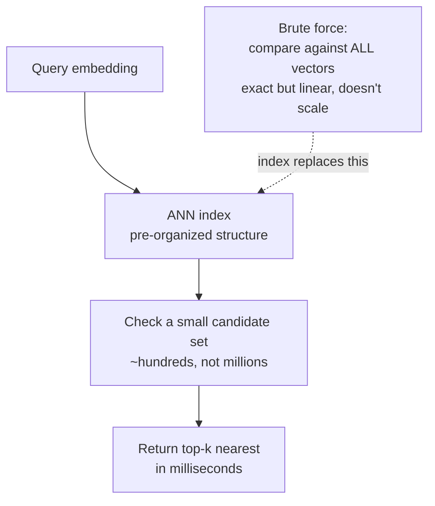

# Vector databases

## The problem it solves

By now the [RAG](21-rag.md) pipeline has a shape: [chunk](22-chunking.md) your documents, turn each chunk into an [embedding](../01-foundations/02-embeddings.md) — a list of numbers that encodes the chunk's *meaning*, so that chunks about similar things sit close together in a high-dimensional space — and then, when a question comes in, find the chunks whose meaning is closest to the question's. That last step is the catch. "Find the closest chunks" sounds trivial, and at small scale it is: compute the distance from the question to every chunk and take the nearest few. But a real knowledge base has millions or tens of millions of chunks, each embedding is hundreds or thousands of numbers long, and you need the answer in tens of milliseconds while thousands of users query at once. Comparing the question against *every* chunk on *every* query — a brute-force scan — collapses under that load. It's linear in the size of your corpus, and your corpus only grows.

There's a second problem an ordinary database can't solve either. A normal (relational) database is built to find *exact* matches and ranges — rows where `status = 'open'` or `price < 50`. It has no notion of "rows whose *meaning* is nearest to this meaning." Searching by semantic closeness over high-dimensional vectors is a fundamentally different operation than the lookups SQL databases were designed for.

**A vector database is the specialized storage-and-search system built for exactly this: store millions of embeddings and, given a query embedding, return the nearest ones in milliseconds.** It's the infrastructure that makes the "find the closest chunks" step of RAG fast enough to be a product rather than a demo. This lesson is about *that store and how it searches* — the retrieval *logic* on top of it (what "closest" means, how many to fetch, how relevance is judged) is its own lesson, [Retrieval](24-retrieval.md).

> [!NOTE]
> **Embedding / vector — the one prerequisite.** An *embedding* (covered in [Embeddings](../01-foundations/02-embeddings.md)) is a fixed-length list of numbers — a *vector* — that a model produces to represent a piece of text's meaning, positioned so that similar meanings land near each other. "High-dimensional" just means the list is long (say 768 or 1,536 numbers), so each chunk is a point in a space with that many axes. This lesson takes embeddings as given and asks: how do you store and search *billions of numbers* fast? If embeddings are fuzzy, read that lesson first; here they're the input.

## The one analogy to remember

**The picture:** You want the nearest coffee shop. The brute-force way is to measure the straight-line distance from where you stand to *every* coffee shop in the country, then sort — correct, and absurd. What a map app actually does is carve the map into a grid and only ever look in your cell and its neighbors, ignoring 99.9% of the country instantly. You give up a sliver of theoretical perfection — once in a blue moon the true nearest shop is just over a grid line you didn't check — in exchange for an answer that returns *now* instead of after scanning a nation.

**The mapping:** every coffee shop = a stored chunk embedding; your location = the query embedding; straight-line distance = the similarity between meanings; measuring distance to every shop = brute-force search (exact but slow); the grid that lets you skip almost everything = the vector database's **index**; the rare miss just over a grid line = the "approximate" in approximate nearest-neighbor search; getting an answer instantly = the millisecond latency RAG needs.

**Why it holds:** the whole reason a map app is usable is that it *refuses* to check everything — it pre-organizes locations so it can leap to the right neighborhood, which is precisely what a vector index does with embeddings, and the tiny accuracy it trades away for that speed is exactly the exact-vs-approximate bargain at the heart of these systems.

**Say it like this:** "A vector database is a map app for meanings — it pre-organizes everything into neighborhoods so it can find the nearest matches without measuring against all of them, trading a hair of accuracy for a thousandfold speedup."

*Where it breaks:* a city map is two-dimensional and human-intuitive; embedding space has hundreds of dimensions where geometric intuition fails and "neighborhoods" are far stranger to carve. The analogy captures the *strategy* (skip almost everything by pre-organizing), not the literal ease — building good high-dimensional indexes is genuinely hard, which is why these are specialized systems.

## The core idea: approximate nearest-neighbor search

The engine inside a vector database is **ANN — Approximate Nearest-Neighbor search.** Unpack the name, because every word is a decision.

- **Nearest-neighbor**: the task is "given this query point, find the closest stored points."
- **Approximate**: it deliberately does *not* guarantee it finds the exact closest points. It finds *almost certainly the closest, almost all the time* — and that word is the entire trick. Exact nearest-neighbor search in high dimensions is not meaningfully faster than brute force (a quirk of high-dimensional geometry). The only way to get the massive speedup is to accept a small, tunable chance of missing a true nearest match.

The quantity that measures how much accuracy you traded away is **recall** — the fraction of the true nearest neighbors the approximate search actually returned. Recall of 0.95 means it found 95% of the genuinely-closest items and missed 5%. And here's the lever a PM should understand: **recall is tunable, and it trades against speed.** Dial the index to check more candidates and recall climbs toward 100% but latency rises; dial it to check fewer and it's faster but misses more. You are not choosing between "fast" and "accurate" once and for all — you're picking a point on that curve for your product's tolerance.

You don't need the internals of the index structures, but knowing the names helps you follow an engineering conversation: **HNSW** (Hierarchical Navigable Small World — a graph you traverse toward the query, the most common default) and **IVF** (Inverted File — cluster the vectors, then only search the nearest clusters). Both are just concrete ways to *pre-organize so you can skip almost everything* — the grid in the analogy. The takeaway is the pattern, not the acronym: **an index buys sublinear search by giving up exactness in a controlled way.**

## Metadata filtering: the part that makes it usable in a real product

Pure "find the nearest meanings" is rarely the whole query. In practice you almost always need "find the nearest meanings *that this user is allowed to see*," or "*from the current version of the policy*," or "*dated this year*." That's **metadata filtering** — the vector database stores structured attributes alongside each vector (the [metadata attached at chunking time](22-chunking.md)) and lets you constrain the search by them.

This matters more than it sounds, for two reasons a PM should hold:

- **It's a correctness and security control, not a nicety.** Filtering by permission *before or during* the search is often how you prevent one user's query from retrieving another user's private documents. "The vector DB does semantic search" and "the vector DB enforces who-can-see-what" are both load-bearing, and the second is easy to forget until it's a breach.
- **Combining filtering with vector search is technically non-trivial**, and how well a given database does it is a real differentiator. Naively filtering after the ANN search can leave you with too few results (you asked for 10 nearest, 8 got filtered out); filtering cleanly *inside* the search is harder to build. This is one of the things you're actually evaluating when you compare vector databases.

## What a PM actually decides

You won't implement an index, but several vector-database choices are product and roadmap decisions, so know the axes:

- **Dedicated vector DB vs. a vector-capable general database.** Purpose-built systems (Pinecone, Weaviate, Qdrant, Milvus, and others) versus adding vector search to a database you already run (e.g. the `pgvector` extension for Postgres, or vector features bolted onto search engines). The trade is roughly *best-in-class scale and features* versus *one fewer system to operate and your vectors sitting next to your other data*. For a modest corpus, reusing your existing database is often the right, boring call; at very large scale or high query volume, a dedicated system earns its keep.
- **Managed (hosted) vs. self-hosted.** Pay a vendor to run it (fast to start, operational simplicity, per-usage cost) versus run it yourself (more control, data stays in your environment — which can matter for [privacy/compliance](../08-safety-trust/43-privacy-pii.md), more ops burden).
- **The cost shape.** Vector databases charge mainly on *how many vectors you store* and *how much you query* — and storing hundreds of millions of high-dimensional vectors in the memory these indexes want is a real, recurring line item. Bigger embeddings (more dimensions) mean more storage and slower search, which is a reason embedding-model choice and vector-DB cost are linked. See [Cost and unit economics](../10-production-ops/51-cost-unit-economics.md).

The framing to walk in with: **the vector database is infrastructure, and the decision is the usual infrastructure decision — build-vs-buy, managed-vs-self-hosted, specialized-vs-reuse — sized to your corpus, query volume, and privacy needs, not a place to reach for the most powerful option by default.**

## Where it fits, and what it is *not*

Keep the boundaries clean, because vector databases get blamed and credited for things that belong to neighbors:

- It is **not** where relevance is decided. The database returns "the nearest vectors by the distance metric." Whether those are *actually relevant*, how many to fetch, and how to combine signals is [Retrieval](24-retrieval.md), and improving result quality often lives in [reranking](26-reranking.md) and [hybrid search](25-hybrid-search.md), which sit on top of the store.
- It does **not** produce embeddings. An embedding *model* does that; the database only stores and searches the vectors it's handed. Change your embedding model and you must **re-embed and re-index everything** — the same re-ingestion cost that [chunking](22-chunking.md) changes trigger.
- It is **not** a general database replacement. It's a specialized index for semantic nearest-neighbor search, usually running *alongside* your regular databases, not instead of them.

The one-line placement: **the vector database is the fast semantic-search *store* underneath RAG — it makes "find the closest chunks" scale, and nothing more; the intelligence about what's relevant lives in the retrieval layers above it.**

## Summary / Points to Remember

- **A vector database stores millions of embeddings and returns the nearest ones to a query embedding in milliseconds** — the infrastructure that makes RAG's "find the closest chunks" step scale. A regular (relational) database can't do semantic-nearest search; brute-forcing it is linear in corpus size and collapses at scale.
- **The engine is ANN — Approximate Nearest-Neighbor search.** It deliberately trades a small, *tunable* chance of missing a true nearest match for a massive speedup, because exact nearest-neighbor in high dimensions isn't meaningfully faster than brute force.
- **Recall (fraction of true nearest neighbors actually found) trades against speed** — check more candidates for higher recall and higher latency, fewer for the reverse. You pick a point on that curve, not "fast vs. accurate" once.
- **Index structures (HNSW, IVF) all do the same thing:** pre-organize the vectors so search can skip almost everything — sublinear speed bought with controlled inexactness. Know the pattern, not the internals.
- **Metadata filtering is load-bearing:** constraining search by permissions/version/date is both a relevance tool and a *security* control (don't retrieve documents a user can't see), and doing it well *inside* the search is a genuine differentiator between databases.
- **The PM decisions are infrastructure decisions:** dedicated vs. reuse-your-Postgres (`pgvector`), managed vs. self-hosted, and a cost shape driven by vectors stored × queries — sized to corpus, query volume, and privacy, not defaulted to the biggest option.
- **It is not where relevance is decided, it doesn't make embeddings, and it doesn't replace your normal database** — it's the semantic-search store beneath the [retrieval](24-retrieval.md) intelligence above it. Changing embedding models forces a full re-embed and re-index.

## Interview Questions That Stump People

**Q: "Why do we need a special 'vector database' at all? We already have Postgres — why not just store the embeddings there and search them?"**

**Interviewer:** We've got a perfectly good relational database. Embeddings are just arrays of numbers. Why can't we store them in a normal table and query them — why is a whole new kind of database in the architecture?

**You (clarify back):** Before I answer flatly — how big is the corpus, and is this Postgres or a database with no vector support at all? Are we talking tens of thousands of chunks or tens of millions?

**Interviewer:** It's Postgres, and realistically tens of millions of chunks eventually, with heavy concurrent query load.

**You:** Then the honest answer is nuanced, not "always use a dedicated vector DB." The hard requirement is a *vector index*: a plain relational query finds exact matches and ranges, but has no native "rows whose meaning-vector is nearest to this vector," so without an index you're scanning every row and computing a distance to each — brute force, linear in the corpus, fine at ten thousand chunks and collapsing at ten million under concurrency. The twist is that Postgres *can* get that index via the `pgvector` extension, which adds vector types and ANN search — so the real choice isn't "Postgres vs. vector DB," it's "add a vector index to the database you already run, or stand up a dedicated one." For a modest corpus, `pgvector` and one fewer system to operate usually wins. But at the tens-of-millions, high-concurrency scale you just described, a purpose-built vector database tends to earn its keep on index performance and features — that's the point on the curve where I'd actually move off Postgres. What doesn't survive contact with real data size, either way, is the original premise: that a *plain* relational scan is fine.

> [!TIP]
> **Why this works:** The question hides a half-truth — you *can* store vectors in Postgres — so answering immediately risks "no you can't" (wrong) or "yes it's fine" (misses why naive scan fails). Clarifying *corpus size and whether it's already Postgres* is what lets you give the right answer instead of a dogma: the two facts flip the recommendation between "add `pgvector`" and "adopt a dedicated system." Separating the hard requirement (a vector index) from the product choice (where that index lives), and pinning the decision to scale, shows you know the mechanism *and* won't over-engineer a small corpus.

---

**Q: "Our retrieval sometimes just misses a chunk that's obviously the right one — it's in the database, it's a clear match, but it doesn't come back. Is the search broken?"**

**Interviewer:** We can point to a chunk that's clearly the best match for a query. It's definitely stored. But every so often the search doesn't return it. That smells like a bug. Is it?

**You:** It might be working exactly as designed — this is the "approximate" in approximate nearest-neighbor showing its face. To search millions of vectors in milliseconds, the index doesn't check every vector; it checks a candidate neighborhood and returns the nearest it finds there. That buys the speed, but it means there's a small, inherent probability it skips a true nearest match that sat just outside the region it explored — measured as recall below 100%. So an occasional miss of an obvious match isn't necessarily a bug; it's the accuracy you traded for speed. The good news is it's *tunable*: you can configure the index to explore more candidates, which raises recall toward 100% at the cost of higher latency. So the real question I'd ask is what our recall actually is and whether this rate of misses is acceptable for the product — if not, we move up the speed-recall curve and pay a bit of latency. I'd also rule out the cheaper explanation first: that the chunk is only "obviously right" to a human and its *embedding* isn't actually that close to the query's — which is a chunking or embedding-model issue, not the index. But the pattern you describe — right answer, stored, occasionally absent — is the classic signature of ANN recall.

> [!TIP]
> **Why this answer works:** Most people assume a search that misses a stored, matching item is broken. Naming *approximate* nearest-neighbor and recall as a deliberate, tunable trade — not a defect — shows you understand the fundamental bargain these systems make. Adding the speed-recall lever turns it into a decision ("what recall do we need?"), and flagging the alternative cause (the embedding isn't as close as it looks) proves you'd diagnose rather than just reassure, which is what separates operating one of these from reading its docs.

---

**Q: "We're building multi-tenant — many customers' documents in one knowledge base. Anything about the vector database I should worry about?"**

**Interviewer:** It's a SaaS product; every customer's documents go into our RAG system. From the vector-database angle, what would keep you up at night?

**You:** The thing I'd treat as a hard requirement, not a feature, is metadata filtering for isolation — because the failure mode here isn't a bad answer, it's customer A's query retrieving customer B's confidential documents, which is a data breach. Semantic search doesn't respect tenant boundaries on its own; "nearest meaning" will happily cross customers unless every query is constrained by a tenant-ID (and permission) filter stored as metadata on each vector. So I'd want that filter enforced on the search itself, and I'd verify *how* the database does it — filtering cleanly inside the ANN search versus naively after it matters, because post-filtering can both leak in edge cases and silently return too few results when most of the nearest vectors get filtered away. I'd also weigh whether tenants should be *physically* separated — separate indexes or namespaces per customer — for stronger isolation and easier deletion when a customer leaves, against the operational cost of that. And I'd tie it to [privacy](../08-safety-trust/43-privacy-pii.md) obligations: managed vs. self-hosted changes where that customer data physically lives. The one-liner: in multi-tenant RAG, the vector database isn't just doing search, it's enforcing who-can-see-what, and that has to be designed, not assumed.

> [!TIP]
> **Why this answer works:** A junior answer talks about scale or latency. The senior instinct is that multi-tenancy makes the vector database a *security boundary*, and semantic search's obliviousness to permissions is a breach waiting to happen — so metadata filtering is reframed from convenience to isolation control. Interrogating *how* filtering combines with ANN (post-filter pitfalls), raising physical separation and deletion, and connecting to privacy shows you see the vector DB as governed infrastructure, which is exactly the maturity the question is fishing for.
