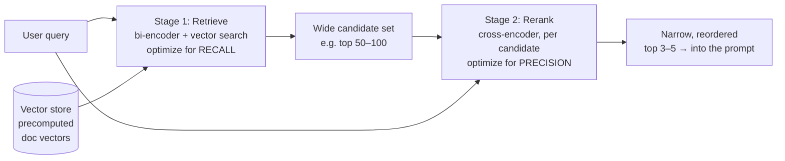
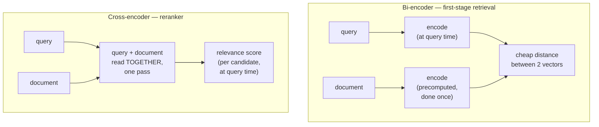

# Reranking

## The problem it solves

The [retrieval](24-retrieval.md) lesson ended on a wound it couldn't dress. Retrieval ranks candidates by *similarity* — geometric closeness in [embedding](../01-foundations/02-embeddings.md) space — and that is only a leaky proxy for *relevance*, for actually answering the question. The most common way the proxy leaks is **similar-but-not-relevant**: a chunk shares the query's topic and vocabulary, so it scores high, yet it doesn't contain the answer. Ask "how do I *cancel* my subscription?" and a passage extolling the *benefits* of the subscription sits right next to the query in embedding space and is useless. Raw semantic search has no structural way to tell "about the same thing" from "answers this," so these near-misses float to the top of the results and crowd out the passage that actually helps.

You could reach for the obvious knobs and they'd all fail. A better embedding model narrows the gap a little but never closes it, because the whole *method* — score each item by its lone distance to the query — is what's too blunt to distinguish topical overlap from answer-bearing. A bigger `k` just drags *more* similar-but-not-relevant chunks into the prompt, diluting the signal further. What you actually need is a **second opinion from a sharper judge** — a model that looks at the query and a candidate *together* and rules on whether this specific passage answers this specific question, then reorders the list so the genuinely-relevant rise above the merely-similar.

**That second pass is reranking.** It is the targeted cure for similar-but-not-relevant, and it's the reason lesson 24 told you to retrieve a *generous* `k` for recall and then "cut it back down" — this lesson is the cutting.

> [!NOTE]
> **What's assumed here.** This lesson stands on [retrieval](24-retrieval.md) (embed the query, score candidates by similarity, keep the top-k) and [embeddings](../01-foundations/02-embeddings.md) (text → a meaning-vector). It also leans on one intuition from [attention](../01-foundations/03-attention.md): a transformer can let every token *attend to* — weigh its relevance against — every other token it's fed at once. That mechanism is the entire difference between the two model types below, so if it's fuzzy, skim that lesson first. Everything else is introduced as it appears.

## The one analogy to remember

**The picture:** A matchmaker runs a city-wide dating service. Every client fills out a profile card *once*, and those cards sit filed in a cabinet. When you sign up, the matchmaker compares your card against all the others and hands you a shortlist of twenty people whose cards line up well with yours. But a shortlist is not a partner — so you go on actual *dates* with the shortlisted few, and only in the room, with two real people reacting to each other, does it become clear who you actually click with. You reorder your ranking based on the dates, not the cards.

**The mapping:** each pre-written profile card = a document embedded once, in advance, into a vector and shelved; comparing your card to everyone's = the cheap similarity search of first-stage [retrieval](24-retrieval.md); the shortlist of twenty = the generous top-k candidate set; "great on paper, no spark in person" = **similar-but-not-relevant**; going on an actual date where both people are in the room together = the reranker reading query and candidate *jointly*; dates being expensive and done one at a time = the reranker's per-candidate query-time cost; reordering by who you clicked with = the rerank.

**Why it holds:** the two stages differ in the exact way that matters — a profile card is written *alone, ahead of time*, so cards can be filed and compared by the thousand for pennies, but they can't capture chemistry; a date puts *both parties in the same room reacting to each other*, which is far more revealing but must happen live, one pairing at a time. That is precisely the split between the model that *retrieves* (reads each side separately, precomputed) and the model that *reranks* (reads both sides together, at query time) — and it's why you screen the whole city cheaply but only *date* the shortlist.

**Say it like this:** "Retrieval is matching dating profiles to get a shortlist; reranking is actually going on the dates — slower and pricier, but it's the only way to tell who looks good on paper from who you actually click with."

*Where it breaks:* a perfect partner the matchmaker never put on your shortlist never gets a date — and no amount of dating can fix that. The dates only reshuffle the people you were already introduced to. Hold that seam; it's the single most important limit of reranking, and the next-to-last section makes it the headline.

## Retrieve wide, rerank narrow: the central pattern

The shape of the whole technique is a division of labor between two stages with opposite goals.

- **Stage one retrieves for recall.** [Retrieval](24-retrieval.md) casts a wide net — a generous `k`, say 50 or 100 candidates — with one job: make sure the answer-bearing chunk is *somewhere* in the set. It doesn't have to be ranked first; it just has to be present. Recall is "did we catch it at all."
- **Stage two reranks for precision.** The reranker takes that wide set and re-scores every candidate against the query for *true relevance*, then reorders so the genuinely-best land on top. You keep only the few highest — the 3 to 5 that actually go into the model's [context window](../01-foundations/05-context-windows.md). Precision is "of what we hand the model, how much actually helps."

The reason this works — and the reason you can't collapse it into one stage — is that recall and precision want opposite things. Recall wants a big net; precision wants a tight one. **Retrieve-wide-then-rerank-narrow lets you have both: the wide first stage guarantees the answer is in the pile, and the sharp second stage extracts it from the pile.** A single stage forces you to choose — a big `k` gives recall but floods the prompt with noise; a small `k` gives precision but risks leaving the answer out. Splitting the job is what dissolves the tradeoff.

## The key mechanism: bi-encoder vs cross-encoder

Here is the part lesson 24 deferred to you, and it's the whole engine of why reranking is both *better* at judging relevance and *too expensive* to run on everything. The two stages use two structurally different kinds of model.

> [!NOTE]
> **Encoder** — a model that reads text and turns it into numbers a computer can compare. The distinction that matters here isn't the network's guts; it's *what gets read together*. A **bi-encoder** ("bi" = two) reads the query and a document through **two separate passes** and emits a vector for each. A **cross-encoder** reads the query and one document **glued into a single input, in one pass**, and emits a single number: how relevant this document is to this query.

**First-stage retrieval uses a bi-encoder.** Because the query and each document are encoded *separately*, every document's vector can be computed *ahead of time* — the moment you ingest the document, long before any query exists — and filed in the [vector database](23-vector-databases.md). At query time you only embed the one query, then find nearest neighbors by a cheap distance calculation. The document side of the work is *precomputed and reused for every query forever*. That's what makes searching millions of chunks fast and affordable. The cost of that speed: because the two sides never meet inside the model, it can only compare two finished, independent summaries — it never gets to see how a specific query word lines up against a specific document phrase. It's comparing two profile cards.

**The reranker uses a cross-encoder.** It feeds the query and a candidate through the model *together*, so [attention](../01-foundations/03-attention.md) can range across both at once — every word of the query can weigh itself directly against every word of the candidate. That joint reading is dramatically more accurate about relevance, because "does this passage answer this question" is exactly a question about how the two texts *interact*, not about two summaries computed in isolation. It's the actual date, not the two cards.

But that accuracy has a price baked into its shape. Because the query is half the input, **nothing can be precomputed** — you can't score a (query, document) pair until the query arrives, and you must run the model *once per candidate*, fresh, at query time. The cost is **O(number of candidates)** — linear in how many you feed it. Run a cross-encoder over a million-chunk corpus per query and you'd wait minutes and pay a fortune; run a bi-encoder over the same corpus and it's a precomputed index lookup.

**That cost profile is the entire architecture of the technique, not a footnote to it.** You can't afford to cross-encode the whole corpus, so you *don't* — you let the cheap bi-encoder cut the corpus down to a shortlist, then spend the expensive cross-encoder only on those few. Retrieve-wide-then-rerank-narrow isn't an arbitrary design; it's the *only* way to get the cross-encoder's judgment at a price you can pay. The bi-encoder makes the shortlist affordable; the cross-encoder makes the shortlist accurate.

## Where rerankers come from

You rarely build one. In practice a reranker is either a **hosted rerank API** (Application Programming Interface — a service you call over the network) — several model providers expose one: you send the query and the candidate list, it returns them scored and reordered — or an **open cross-encoder model** you run yourself (the classic family trained for exactly this sentence-pair relevance scoring). Either way the integration is the same tiny shape: retrieval hands you a candidate list, you pass `(query, candidates)` to the reranker, it hands back the list resorted by relevance, and you truncate to the top few. It slots in as a stage *between* retrieval and the prompt; you don't touch your [vector store](23-vector-databases.md) or your embeddings to add it.

## What it buys, and what it costs

**The win is precision at the top of the list**, and it shows up in exactly the retrieval metrics lesson 24 named — now measured *after* the rerank:

- **Precision@k** (of the k chunks you keep, how many are actually relevant) climbs, because the reranker's whole job is to make the top few genuinely-relevant.
- **MRR (Mean Reciprocal Rank** — how high up the *first* correct chunk lands, on average) climbs, because reranking is designed to lift the best candidate toward rank 1.
- **NDCG (Normalized Discounted Cumulative Gain** — a ranking score that rewards putting the *most* relevant items highest, discounting relevance found further down the list) climbs, for the same reason: it directly rewards good ordering, which is precisely what a reranker produces.

The costs are equally concrete and you must name them:

- **Added latency per query.** You've inserted an extra model call that runs *after* retrieval finishes, and it scales with the candidate count — reranking 100 candidates is more work than reranking 20. For latency-sensitive products this is a real budget line, and the main lever is shrinking the candidate set (see [cost and unit economics](../10-production-ops/51-cost-unit-economics.md)).
- **Added cost per query.** A hosted reranker is billed per call, and a self-hosted one burns compute — either way it's a recurring per-query charge that first-stage retrieval (a cheap index lookup) largely wasn't. You're buying precision, and it isn't free.

The tuning knob that governs both is **how many candidates you rerank**: more candidates means better recall going into the reranker (more chances the answer is in the pile) but more latency and cost. Fewer is cheaper and faster but risks the reranker never seeing the right chunk — which lands us on the hard limit.

## The hard ceiling: a reranker can only reorder what retrieval surfaced

This is the single most important thing to say about reranking, and the seam the analogy flagged. **A reranker reorders the candidate set; it can never add to it.** If first-stage retrieval failed to surface the answer-bearing chunk — because chunking sliced the answer apart, because the query and the document had a vocabulary mismatch a semantic search couldn't bridge, because `k` was too small — then that chunk *is not in the pile the reranker sees*, and no amount of reranking can conjure it back. You cannot date someone the matchmaker never introduced you to.

The practical consequences are sharp:

- **Reranking fixes precision, never recall.** It is the cure for similar-but-not-relevant (the answer is in the pile but ranked below noise). It is *useless* against a recall failure (the answer isn't in the pile at all). Diagnose which one you have before reaching for a reranker.
- **A recall failure is a chunking, retrieval, or [hybrid-search](25-hybrid-search.md) problem — upstream of the reranker.** If the right chunk isn't being retrieved at any `k`, adding a reranker changes nothing; you fix it by fixing what gets *fetched*: better chunking, a bigger candidate `k`, or hybrid search to catch the exact-term matches semantic search blurred.
- **This is why the two lessons pair.** Reranking (precision) and [hybrid search](25-hybrid-search.md) (recall on exact terms) attack the two *different* halves of retrieval's proxy gap; a reranker with a stronger first stage feeding it a better candidate set is worth more than a reranker alone.

The sayable core: **retrieval decides what the model *could* see; reranking decides, from that set, what it *does* see. Reranking can only ever be as good as the candidate set handed to it — it sharpens recall into precision, but it cannot create recall that wasn't there.**

## Summary / Points to Remember

- **Reranking is a second stage that re-scores retrieval's top candidates for true relevance and reorders them** — the targeted fix for [retrieval](24-retrieval.md)'s *similar-but-not-relevant* failure (a chunk that's on-topic and high-similarity but doesn't answer the question).
- **The central pattern is retrieve-wide-then-rerank-narrow:** first-stage retrieval optimizes for *recall* (a generous `k` so the answer is *in* the candidate set); the reranker optimizes for *precision* (cut to the few genuinely-relevant before they hit the model). Splitting the job dissolves the recall-vs-precision tradeoff a single stage would force.
- **The mechanism is bi-encoder vs cross-encoder.** Retrieval's **bi-encoder** encodes query and document *separately*, so document vectors are precomputed and search is a cheap distance lookup. A reranker's **cross-encoder** feeds query and candidate through *together*, so [attention](../01-foundations/03-attention.md) ranges across both — far more accurate about relevance, but it can't precompute and must run once per candidate at query time.
- **That cost is why you only rerank the shortlist.** A cross-encoder is **O(candidates)** at query time — unaffordable over a whole corpus. The cheap bi-encoder makes the shortlist; the expensive cross-encoder makes the shortlist accurate. The two-stage shape is forced by the cost profile, not chosen arbitrarily.
- **It buys precision at the top:** Precision@k, MRR (Mean Reciprocal Rank), and NDCG (Normalized Discounted Cumulative Gain) all rise. It costs **added latency and dollars per query**, and the main knob for both is how many candidates you rerank.
- **The hard ceiling: a reranker can only reorder what retrieval already surfaced — it can never recover a chunk that wasn't retrieved.** So it fixes precision, never recall; a recall/chunking failure is an upstream problem ([chunking](22-chunking.md), a bigger `k`, [hybrid search](25-hybrid-search.md)), and no reranker touches it.
- **Rerankers come as hosted rerank APIs or open cross-encoder models**, and slot in as a stage *between* retrieval and the prompt — no change to your [vector store](23-vector-databases.md) or embeddings.

## Interview Questions That Stump People

**Q: "If a cross-encoder is so much more accurate at judging relevance, why not just use it for the whole search and skip the bi-encoder retrieval stage entirely?"**

**Interviewer:** You've told me the cross-encoder is the sharper model — it reads the query and document together and it's better at relevance. So why bother with the weaker bi-encoder at all? Why not run the good model over everything?

**You:** Because the thing that makes the cross-encoder accurate is the same thing that makes it impossible to run over everything. It scores a *pair* — query glued to document, read in one pass — so it can't precompute anything: until the query arrives there's nothing to score, and then you have to run the model fresh, once per document. That's O(number of documents) per query. Over a million-chunk corpus that's a million model inferences for a single question — minutes of latency and a ruinous bill. The bi-encoder is the opposite: it encodes each document *separately*, so every document vector is computed once at ingest and reused for every query forever, and search is just a cheap distance lookup against a precomputed index. So they're not competing for the same slot — they're playing complementary roles set by their cost profiles. You let the cheap bi-encoder cut a million chunks down to 50 candidates, then spend the expensive cross-encoder only on those 50. You get the cross-encoder's judgment at a price you can actually pay. Running it over the whole corpus isn't a better version of the same idea; it's the version that doesn't ship.

> [!TIP]
> **Why this answer works:** The bait is "better model → use it everywhere." The strong move ties the cross-encoder's *accuracy* and its *cost* to the same root cause — it reads the pair jointly, so nothing precomputes and it's linear per candidate — which shows you understand the mechanism, not just the ranking of the two models. Landing on "complementary roles forced by cost," rather than "one is better," is exactly the systems-level framing the question is probing for.

---

**Q: "We added a reranker and our answers barely improved. We're still missing information that's definitely in our documents. Did we buy the wrong tool?"**

**Interviewer:** We stood up a reranker expecting a quality jump. Precision on the questions it *does* answer looks a bit better, but we're still getting "I couldn't find that" on questions where the answer is sitting right there in the corpus. Was the reranker a waste?

**You:** The reranker probably isn't broken — it's aimed at the wrong failure. A reranker can only reorder the candidates retrieval already handed it; it can never add a chunk that wasn't retrieved. So if the answer-bearing chunk isn't in the candidate set in the first place, reranking does nothing for it — you're describing a *recall* failure, and reranking only fixes *precision*. The tell is in your own words: "missing information that's in the documents" means the right chunk isn't being surfaced, not that it's being surfaced and mis-ranked. So I'd instrument first-stage retrieval before touching the reranker: for the failing questions, is the correct chunk anywhere in the top 50 or 100 candidates? If it's there but buried, the reranker should be pulling it up and we'd tune that. But I'd bet it's *not* there — and then the fix is all upstream: is chunking splitting the answer apart, is `k` too small, or is this a vocabulary or exact-term mismatch that hybrid search would catch? Reranking sharpens recall into precision; it can't create recall that was never there. You bought a precision tool for a recall problem.

> [!TIP]
> **Why this answer works:** The trap is assuming a reranker improves retrieval globally. The expert instinct is to *localize the failure* — precision vs recall — and to use the questioner's own phrasing ("missing info that's in the docs") as the diagnostic that it's recall, which a reranker structurally can't fix. Prescribing "measure whether the chunk is in the candidate set first" before blaming the tool shows you debug by stage instead of guessing, and naming the upstream fixes (chunking, bigger k, hybrid search) proves you know where recall actually lives.

---

**Q (clarify-back): "Reranking added 300 milliseconds to every query and product is complaining about latency. Should we just drop it?"**

**Interviewer:** The reranker is real latency — about 300ms a query — and the product team wants it gone to make responses feel snappy. Do we pull it?

**You (clarify back):** Before I answer — what did the reranker do to our answer quality when we added it, and how many candidates are we currently reranking per query?

**Interviewer:** It noticeably cut the "on-topic but unhelpful" answers, so quality clearly went up. And I think we're reranking the full candidate set — around 100.

**You:** Then I wouldn't drop it — I'd shrink it first, because you're likely paying for latency you don't need. The reranker's cost scales with how many candidates it scores, and 100 is often well past the point of diminishing returns: most of the precision win comes from reranking the top 20 or 30, since the answer-bearing chunk, if retrieval surfaced it at all, is usually near the top of the candidate set already. So cut the rerank set from 100 to, say, 25 and re-measure both latency *and* quality — you'll likely recover most of the 300ms while keeping most of the quality gain. If that's still too slow, the next levers are a smaller or faster reranker model, or a hosted reranker with lower latency, before I'd ever remove the stage that's demonstrably reducing bad answers. Dropping a component that measurably improved quality to save latency you haven't tried to optimize is trading the wrong thing — the point is to find the candidate count where quality and speed both sit in an acceptable band, not to binary-choose between them.

> [!TIP]
> **Why this works:** "Drop it or keep it" is a false binary, and answering immediately would miss the middle. Clarifying *what quality it bought* and *how many candidates you rerank* surfaces the two facts that reframe the problem — the stage is earning its keep, and the latency is tunable via candidate count. Landing on "shrink the rerank set and re-measure" shows you know the reranker's cost is O(candidates), so latency is a dial, not a fixed tax — and that you don't delete a proven quality win without exhausting the cheap optimizations first.

---

**Q: "Our embedding-based retrieval already returns the right document most of the time. Isn't a reranker redundant — just polishing an order that's already basically correct?"**

**Interviewer:** Retrieval usually pulls back the right chunk somewhere in the top results. So a reranker feels like gilding the lily — reordering a list that's already good enough. Where's the actual value?

**You:** The value is precisely in the gap between "somewhere in the top results" and "at the top." What goes into the model's prompt is a *small* slice — three, maybe five chunks — because you can't and shouldn't stuff 50 in: it costs tokens, adds latency, and dilutes the signal. So "the right chunk is at rank 8 of 50" is a *failure* even though retrieval technically found it — it never makes the cut into the prompt, and the model answers without it. The reranker's job is exactly to move that rank-8 chunk to rank 1 so it survives the truncation. And it can do that where the bi-encoder can't, because it reads the query and candidate together and can tell an answer-bearing passage from one that's merely on-topic — which is the distinction that decides ranks 1 through 8 in the first place. So it's not polishing a correct order; it's making the *top few* trustworthy enough that you can safely keep only a few. Without it you'd have to widen the prompt to be safe, which reintroduces the cost and dilution you were trying to avoid. Reranking is what lets you retrieve wide but *send* narrow.

> [!TIP]
> **Why this answer works:** The misconception is that "found it somewhere" equals success. The strong reply reframes success as "found it *in the few chunks that reach the model*," which is where the real constraint lives — the prompt is small on purpose. Connecting that back to the mechanism (the cross-encoder distinguishes relevant from merely-similar, which is what sets the top ranks) shows the reranker isn't cosmetic; it's what makes a tight, cheap prompt safe. That's the operator's view, not the demo-watcher's.
