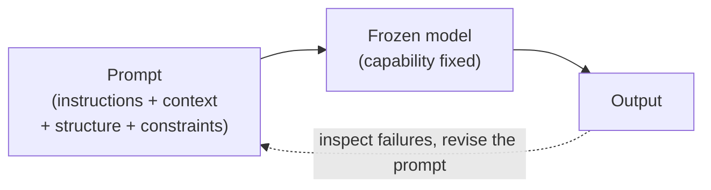
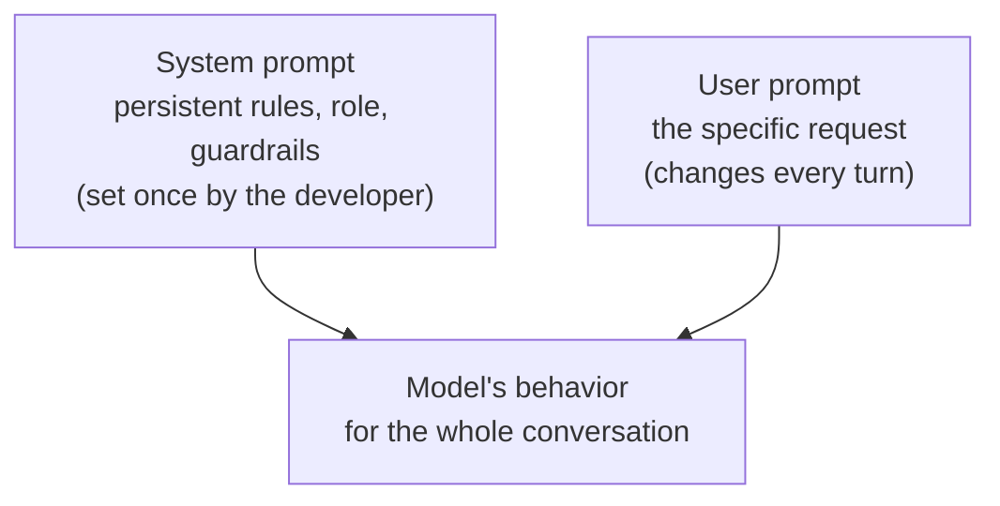

# Prompt Engineering

## The problem it solves

You have a fixed, finished model. Its weights were frozen the day training ended; you can't reach in and adjust them, and for most teams retraining or [fine-tuning](../02-model-behavior-training/07-fine-tuning.md) isn't on the table for every little task. Yet the same model can give you a brilliant answer or useless garbage to the *same underlying request* depending on nothing but how you phrase it. Ask "tell me about our refund policy" and you get a vague essay; ask "in three bullets, summarize the refund window and the two exceptions, using only the policy text below" and you get exactly what you needed. Same model, same knowledge, wildly different output.

That gap is the whole problem. The model is capable but *under-specified by default* — it doesn't know which of a hundred reasonable interpretations you meant, what format you want, how long, in whose voice, or what to do when it isn't sure. The one lever you actually control at run time is the **input**. **Prompt engineering** is the discipline of designing that input — the instructions, context, structure, and constraints you hand the model — to reliably steer a frozen model toward the output you want. It exists because the prompt is the steering wheel, and most people are driving with their eyes closed.

## The one analogy to remember

**The picture:** You've hired a genuinely brilliant freelancer for a one-off job. They're fast and they know an astonishing amount — but it's their first hour, they know nothing about *your* company, they take your brief absolutely literally, and they will never email you back to ask a clarifying question. Whatever you write in the brief is all they get. A vague brief comes back confidently wrong; a precise brief — with the context, the format, an example of "good," and permission to flag anything unclear — comes back excellent.

**The mapping:** the brief you write = the prompt; the freelancer's raw talent and general knowledge = the pretrained model's capability; "knows nothing about your company" = the model doesn't know your specifics unless you put them in the prompt; "takes it literally and never asks" = the model won't clarify — it fills gaps by guessing; the quality of what comes back tracking the quality of the brief = output quality tracks prompt quality.

**Why it holds:** the model's weights are frozen at [inference](../01-foundations/06-pretraining-vs-posttraining.md) time, so the *only* thing you influence is what goes into the [context window](../01-foundations/05-context-windows.md) — the prompt is literally the entire brief, and there is no back-and-forth channel where the model asks you what you meant. That's exactly a one-shot brief to a contractor who won't write back.

**Say it like this:** "Prompt engineering is writing the brief for a brilliant freelancer who's never met your company, takes everything literally, and never asks questions — so if the brief is vague, the work comes back confidently wrong."

*Where it breaks:* a real freelancer accumulates context over days and remembers your last job; the model doesn't — every request is a fresh first hour with no memory of the last one, unless you deliberately build that in (see [agent memory](../06-agents/35-agent-memory.md)).

## Why it works at all: the input is the only lever

It's worth being precise about *why* rewording changes anything, because the naive view ("you're just being polite to the AI") gets the mechanism wrong. A language model generates output by predicting a continuation of the text it's given. Your prompt sets the entire starting condition for that prediction: it activates some regions of the model's learned behavior and not others. A prompt written like a terse Slack message pulls the model toward terse, casual continuations; a prompt written like a formal specification pulls it toward precise, structured ones. You're not teaching the model anything new — nothing about it changes — you're *selecting*, from everything it already knows how to do, the slice you want.

This is the load-bearing distinction for interviews: **prompt engineering steers behavior; it does not add capability or knowledge.** If the model fundamentally can't do something, no phrasing will summon it. If it doesn't know a fact, asking nicely won't conjure it — you have to *supply* the fact in the prompt (which at scale means [retrieval-augmented generation, RAG](../04-retrieval-knowledge/21-rag.md)). Prompting redistributes the model's existing competence; it doesn't manufacture new competence.

Notice the loop at the bottom — that dashed line is the actual job. Prompt engineering isn't writing one perfect prompt from inspiration; it's a tight cycle of draft, test on real inputs, look at where it breaks, and revise. More on that below.

## The techniques, as principles (not a bag of tricks)

There are hundreds of "prompt tricks" floating around, but they collapse into a handful of principles, each solving a specific way the default prompt under-specifies the task. Memorize the principles, not the listicle.

- **Be specific and unambiguous.** The single biggest lever. State the task, the audience, the length, the format, and any constraints explicitly. "Summarize this" invites a coin-flip; "summarize this in two sentences for a non-technical executive, focusing on cost impact" removes the guesswork. Every ambiguity you leave is a decision you've delegated to a model that will decide by probability, not by your intent.

- **Give it structure.** Separate the *instructions* from the *data* they operate on, using clear delimiters (headings, triple quotes, XML-style tags). When you paste a document and then ask a question, the model can otherwise blur "which part is the thing to act on and which part is the command." Structure also makes the prompt robust: a clearly fenced data block is much harder for stray text to hijack (relevant to [prompt injection](../08-safety-trust/42-ai-security.md), later).

- **Assign a role or context.** "You are a senior tax accountant reviewing this return" primes the model toward the vocabulary, care, and conventions of that role. It's not magic — it's another way of selecting the slice of behavior you want — but it's a cheap, effective one. (Where this lives structurally, the *system prompt*, is its own topic below.)

- **Constrain and specify the output.** If you need JSON (JavaScript Object Notation, a structured data format) with particular keys, a table, or a fixed set of labels, say so exactly — and know that for machine-consumable output there's a dedicated, more reliable mechanism than hoping: [structured outputs](../03-reasoning-generation/20-structured-outputs.md). Asking for a format is prompt engineering; *enforcing* it is structured outputs.

- **Give the model an out.** Explicitly permit "if the answer isn't in the provided text, say you don't know." Without that permission the model's default is to produce a plausible-sounding answer anyway — the root of a lot of [hallucination](../03-reasoning-generation/19-hallucination.md). Telling it that "I don't know" is an acceptable answer is one of the highest-leverage single sentences you can add.

- **Show, don't just tell.** For formats and styles that are painful to describe but easy to demonstrate, include worked examples. This is powerful enough to be its own lesson — [few-shot and in-context learning](29-few-shot-icl.md) — so here it's just one technique in the kit; go there for how examples actually work and their pitfalls.

- **Let it think.** For multi-step reasoning, prompting the model to work through intermediate steps before the final answer improves accuracy. That, too, is its own topic — [chain-of-thought and extended thinking](../03-reasoning-generation/17-chain-of-thought.md) — so treat it here as a lever you reach for, not one to explain inline.

- **Decompose.** When a task is complex, splitting it into a sequence of smaller prompts (extract, then classify, then summarize) usually beats one heroic mega-prompt. Each step is easier to specify, test, and debug — and you can inspect the intermediate output.

The through-line: every principle is a *response to a specific under-specification*. Vague task → be specific. Instructions blurring into data → add structure. Wrong voice → assign a role. Confident wrong answers → give it an out. That's the mental model to carry, not a memorized list.

## System vs. user prompts: where the instruction sits matters

Modern chat models don't take one undifferentiated blob of text. The input is split into **message roles** — most importantly the **system prompt** and the **user prompt**.

The **system prompt** sets standing rules and persona for the entire conversation — "You are a support assistant for Acme; never discuss competitors; always answer in the customer's language." It's written by the developer and generally carries more steering weight and persistence than an individual user turn. The **user prompt** is the specific request for this turn. The practical significance for a PM: durable behavior and safety rules belong in the system prompt (so they apply on every turn and aren't at the mercy of what the user types), while the per-request specifics go in the user turn. Putting a critical guardrail only in the user prompt means it vanishes the next turn — a common and expensive mistake.

Placement *within* a prompt matters too, because of how attention distributes over a long input: instructions buried in the middle of a very long context can get less weight than the same instruction at the start or end (the "lost in the middle" effect tied to [context windows](../01-foundations/05-context-windows.md)). A reliable habit is to state the key instruction up front, put the bulk data in the middle, and restate the critical constraint at the end.

## It's an empirical craft, not a set of incantations

The most important thing to internalize — and the thing that separates someone who *does* prompt engineering from someone who's read a list of tips — is that it is **empirical**. You don't reason your way to the perfect prompt; you test your way there. Write a version, run it against a set of representative *and* adversarial inputs, look at exactly how and where it fails, and change one thing. The failures tell you what the model misread, which tells you what to specify. Treat prompts like code: version them, keep the test inputs, and when you change a prompt, re-check it didn't regress on cases it used to pass (this is the seed of [regression testing for prompts](../09-evaluation/47-regression-testing.md)).

Two consequences fall out of the empirical nature:

- **Prompts are model-specific and version-fragile.** A prompt tuned for one model can behave differently on another, and even on a new version of the *same* model, because the underlying behavior shifted. A prompt is not a portable artifact; it's calibrated to a particular model's quirks. This is why "prompt hacks" that go viral often stop working — the model moved.
- **Over-engineering is real.** Piling on ever-more elaborate instructions past the point of clarity adds tokens, latency, and brittleness for no gain, and can even confuse the model with conflicting directives. The goal is the *least* instruction that makes the task reliable, not the most.

## The ceiling: what prompting can't fix

Knowing the boundary is what makes you sound senior. Prompt engineering has a hard ceiling, and reaching for a better prompt when you've hit it is a classic waste of time:

- **It can't add knowledge the model lacks.** Current facts, private data, your product catalog — those must be *supplied*, which means [RAG](../04-retrieval-knowledge/21-rag.md), not a cleverer prompt.
- **It can't cheaply encode stable, high-volume behavior.** If you're prepending the same large instruction block to millions of calls forever, at some point baking it into the weights via [fine-tuning](../02-model-behavior-training/07-fine-tuning.md) is cheaper and more reliable than paying for those tokens on every request. (One thing that softens the token cost of a big stable prompt in the meantime: [prompt caching](31-prompt-caching.md).)
- **It can't exceed the model's underlying capability.** If the base model genuinely can't do the reasoning, no prompt summons the ability.
- **It's an attack surface.** Because the model can't reliably tell trusted instructions from text that merely *looks* like instructions, untrusted input in the prompt can override your intent — [prompt injection](../08-safety-trust/42-ai-security.md). Good prompt structure (fencing untrusted data, keeping rules in the system prompt) mitigates but does not solve it.

## Summary / Points to Remember

- **Prompt engineering is designing the input to steer a frozen model.** The weights don't change; the prompt is the only run-time lever, so output quality tracks prompt quality.
- The load-bearing distinction: **prompting steers existing behavior — it does not add knowledge or capability.** Missing facts → [RAG](../04-retrieval-knowledge/21-rag.md); missing ability → a different/fine-tuned model; no phrasing fixes either.
- The techniques collapse into **principles, each answering a specific under-specification**: be specific, add structure/delimiters, assign a role, constrain the output, give it an "I don't know" out, show examples ([few-shot](29-few-shot-icl.md)), let it think ([CoT](../03-reasoning-generation/17-chain-of-thought.md)), and decompose.
- **System prompt vs. user prompt:** durable rules, role, and guardrails go in the system prompt (persistent, higher weight); per-request specifics in the user turn. A guardrail placed only in a user turn evaporates next turn.
- It's an **empirical, iterative craft** — draft, test on real + adversarial inputs, inspect failures, revise one thing. Prompts are **model-version-fragile** and **over-engineerable**; aim for the least instruction that's reliable.
- Know the **ceiling**: prompting can't add knowledge, can't cheaply encode stable high-volume behavior ([fine-tuning](../02-model-behavior-training/07-fine-tuning.md)), can't exceed capability, and is an attack surface ([prompt injection](../08-safety-trust/42-ai-security.md)).

## Interview Questions That Stump People

**Q: "Isn't prompt engineering just a fad — a bag of tricks that'll disappear as models get smarter?"**

**Interviewer:** Models keep getting better at understanding what we mean. Doesn't that make prompt engineering a temporary skill that'll be obsolete soon?

**You:** The *tricks* are a fad; the *discipline* isn't. Specific magic phrases that squeeze out a bit more performance do decay — they're tuned to a model's quirks and stop working when the model changes. But the core of prompt engineering isn't incantations, it's specifying the task clearly: what output, what format, what to do when unsure, what context to supply. That's just precise communication, and it doesn't go away because the model got smarter — a smarter model still can't read your mind about which six categories you meant or what "your brand voice" is. What *is* changing is that the low-level tricks matter less and the high-level work — giving the model the right context and clear success criteria — matters more. So I'd frame it as: the craft is consolidating, not disappearing.

> [!TIP]
> **Why this answer works:** The naive takes are both traps — "it's permanent and vital" sounds like hype, "it's a dying fad" sounds dismissive. Splitting *tricks* (decaying) from *task specification* (durable) shows you understand what prompt engineering actually is underneath the buzzword. Naming the real trend — low-level hacks fading, context/spec work rising — signals you've watched the field move, not just read one hot take.

---

**Q: "Our support bot keeps making up policy details that don't exist. Can you prompt-engineer that away?"**

**Interviewer:** The bot invents refund rules we don't have. Can better prompting stop it?

**You:** Prompting helps at the margin but it's the wrong primary fix, and I'd be careful not to oversell it. There *is* a real prompt lever here: explicitly give the model an out — "answer only from the policy text provided; if it's not there, say you don't know" — which measurably reduces confident fabrication. But that only works if the actual policy is *in* the prompt for it to draw from. If the bot is answering from its training memory, no phrasing reliably stops it inventing details, because you're asking it to recall facts it may not have. The real fix is to *supply* the current policy via retrieval so the model answers from fetched text, then use the prompt to constrain it to that text and to cite it. So: prompt engineering to constrain and permit "I don't know," but RAG to provide the ground truth. Prompt alone is treating a knowledge problem as a phrasing problem.

> [!TIP]
> **Why this answer works:** It resists the tempting "yes, I'll fix the prompt" while still crediting the genuine prompt lever (the "I don't know" out). Correctly routing a *knowledge/grounding* failure to retrieval, and reserving prompting for constraining behavior, shows you know prompt engineering's ceiling — that it steers, it doesn't supply facts. That "phrasing problem vs. knowledge problem" framing is the tell of someone who's debugged this for real.

---

**Q (clarify-back): "Should we put our tone-and-safety rules in the prompt, or is that not enough — do we need to fine-tune?"**

**Interviewer:** We want a consistent brand tone and some hard safety rules. Prompt it in, or fine-tune?

**You (clarify back):** Two questions decide it: are these rules stable and applied on basically every call, and how strict is "hard" — is a rare violation an annoyance or a compliance failure?

**Interviewer:** They're stable, they apply to every request, and a safety violation is a genuine compliance problem.

**You:** Then I'd split it. Tone I'd start in the system prompt — it's cheap, instant to adjust, and consistent enough for brand voice; if it's stable and extremely high volume I'd consider fine-tuning later purely to stop paying for those instruction tokens on every call. The hard safety rules are different: because a violation is a compliance failure, I wouldn't rely on prompting alone at all. Prompts are probabilistic and can be overridden by clever or adversarial input — prompt injection — so for anything with real consequences I'd put the rule in the system prompt *and* back it with a deterministic guardrail outside the model that checks input and output. Prompting for the behavior we want; a hard control for the behavior we can't afford to get wrong.

> [!TIP]
> **Why this works:** "Prompt or fine-tune" is under-specified — the answer flips on stability, volume, and *how costly a failure is*. Clarifying surfaces the variable most people miss: strictness. The strong move is refusing to treat a compliance rule as a prompt problem at all — recognizing prompts are probabilistic and defeatable — and layering a deterministic guardrail. That shows you know the boundary between "steer with a prompt" and "enforce with a control."

---

**Q: "We tested a prompt, it worked great, we shipped it — and weeks later it started degrading. Nothing in our code changed. What happened?"**

**Interviewer:** Same prompt, same code, but quality dropped over time. How?

**You:** The most likely culprit is that the model underneath changed — a provider updated or rolled the model version, and a prompt is calibrated to a specific model's behavior, so an update can shift how it responds even to identical input. That's the big one people forget: a prompt isn't a stable artifact, it's tuned to a moving target. A couple of other suspects: if the prompt includes retrieved or user-generated context, the *inputs* may have drifted into cases the prompt was never tested on, so the prompt didn't change but the distribution it faces did. And if there's any sampling randomness, "worked great" might have been a lucky sample rather than robust behavior. The fix in all cases is the same discipline: keep a fixed evaluation set of representative and edge inputs, and re-run it — on every model version and periodically in production — so you *catch* the regression instead of hearing about it from users.

> [!TIP]
> **Why this answer works:** The instinct is to look for a code bug; naming *model-version drift* as the prime suspect shows you understand a prompt's fragile coupling to the model. Adding input-distribution drift and sampling variance rounds it out without hand-waving. Landing on "hold a fixed eval set and re-run it" turns the war story into a process answer — exactly the maturity an interviewer is probing for.

---

**Q: "A vendor's demo prompt is a page of elaborate instructions. Is more prompt engineering always better?"**

**Interviewer:** Their prompt is incredibly detailed — pages of rules and caveats. Is that the gold standard we should copy?

**You:** No — length isn't quality, and a page-long prompt is often a smell rather than a badge. Every added instruction costs tokens and latency on every call, and past the point of clarity extra directives give diminishing returns and can actively conflict with each other, so the model has to guess which rule wins. The goal is the *fewest* instructions that make the task reliable, found empirically — not the most. A giant prompt also tends to be brittle: it's usually a pile of patches for specific past failures, and it can break in surprising ways when inputs shift. I'd want to see whether that elaborate prompt actually beats a lean one on a real test set; frequently a short, well-structured prompt with one or two good examples wins. So I'd treat the wall of text as a starting hypothesis to *trim*, not a target to imitate.

> [!TIP]
> **Why this answer works:** It punctures the "more engineering = better" assumption that a flashy demo invites. Explaining the concrete costs — tokens, latency, conflicting directives, brittleness — and reframing the goal as *minimal reliable instruction found by testing* shows you optimize for robustness and cost, not appearances. Offering to A/B the elaborate prompt against a lean one is the empirical instinct that marks a real practitioner.
