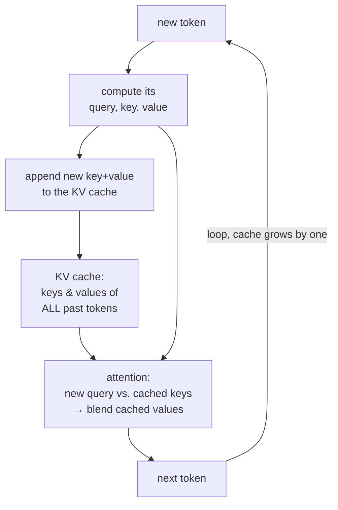
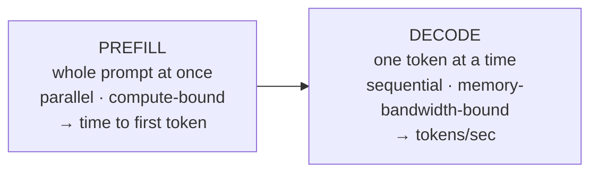
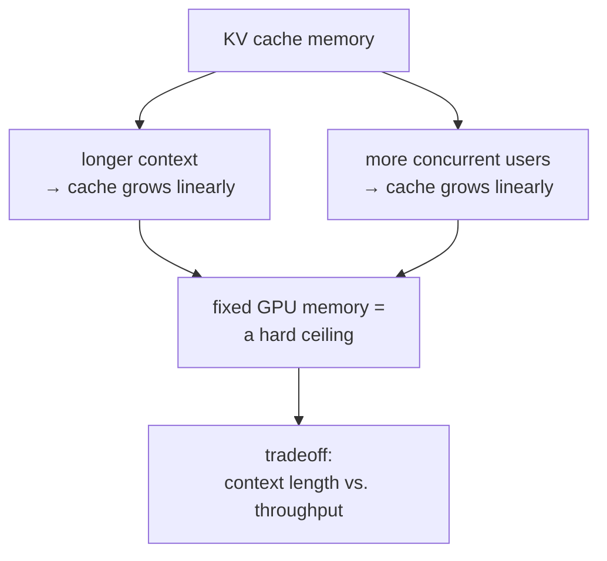

# KV Caching

## The problem it solves

A language model generates text one [token](../01-foundations/01-tokenization.md) at a time, feeding its own output back in to produce the next one — the **autoregressive loop** (taught in [sampling and decoding](../03-reasoning-generation/16-sampling-decoding.md)). Here's the brutal inefficiency hiding in that loop. To produce token number 101, the model runs [attention](../01-foundations/03-attention.md), where the new token has to look back at every token before it. Fine. But to produce token 102, the naive approach runs the whole thing again — re-processing tokens 1 through 101 from scratch — even though nothing about those first 101 tokens has changed. To produce token 103, it re-processes 1 through 102. And so on.

Think about what that costs. Generating an *n*-token response the naive way means processing token 1, then re-processing 2 tokens, then 3, then 4… all the way up. The total work grows with the *square* of the length — the same quadratic blow-up you meet in [attention](../01-foundations/03-attention.md), but now paid *repeatedly*, once per generated token. For a long response this is catastrophic: the model would spend almost all its time recomputing internal representations for tokens it already finished, and generation would be far too slow to be usable.

The waste is glaring because it's redundant: the model's internal representation of token 50 is *identical* whether we're currently generating token 51 or token 500 — earlier tokens can't see later ones, so nothing downstream changes them. **KV caching** is the fix, and it's the reason real-time text generation is feasible at all: compute each token's reusable internal state *once*, store it, and never recompute it. It sounds like an obvious engineering trick, but its consequences — especially the memory it consumes — quietly govern how long a context you can afford, how many users you can serve at once, and what you pay per token.

## The one analogy to remember

**The picture:** A long meeting where, the moment anyone finishes making a point, they write it on an index card and pin it to a corkboard — a headline on top saying what their point is *about*, and the details below. When the next person wants to speak, they don't make everyone re-explain themselves from scratch; they glance over the pinned cards, pick the ones relevant to what they're about to say, and draw on those. Every new speaker adds one card. The only new work each turn is that one speaker figuring out what they're looking for and scanning the board — the existing cards never get rewritten.

**The mapping:** each pinned card = the stored internal state for one past token; the card's headline ("what this is about") = its **key**; the card's details ("what it actually says") = its **value**; a new speaker deciding what they need = the new token's **query**; scanning the board for relevant cards = attention over the cached keys and values; the fact that old cards are never rewritten = a past token's key and value never change; the corkboard slowly filling up = the cache's memory growing with every token.

**Why it holds:** a token's key and value depend only on that token and the ones before it — all already fixed — so once computed they are *frozen* for the rest of the generation. That's precisely why they can be written down once and reused, while the query is the only genuinely new thing each step. The analogy is faithful because it mirrors the real reason caching is *valid*: causal, left-to-right processing means earlier tokens' representations can never be revised by what comes later.

**Say it like this:** "Once a word has been processed, its notes never change — so the model pins them to a board and reuses them, and each new word only has to write its own note and glance at the board, instead of re-reading the whole conversation from the top every single time."

*Where it breaks:* a corkboard's cards are cheap; the model's "cards" are large blocks of GPU (graphics processing unit) memory that pile up every token, and running out of board space is a hard wall — the memory cost is the real story, not a footnote. And cards are discrete text, whereas keys and values are vectors of numbers.

## What is cached, and why only K and V

Recall from [attention](../01-foundations/03-attention.md) that every token produces three learned vectors: a **query** (what am I looking for?), a **key** (what do I offer?), and a **value** (what do I carry?). Generating a new token works by taking *its* query and comparing it against the keys of all previous tokens, then pulling in a weighted blend of their values.

The crucial observation: for every *past* token, its key and its value are already computed and will never change. When we generate the next token, we need those old keys (to compare against) and those old values (to pull from) — but we do **not** need the old tokens' queries ever again, because a token's query was only used at the moment *it* was being generated. So the thing worth storing is exactly the **keys and values** of every token processed so far. Hence the name: the **KV cache** (key–value cache). Each new step computes only the *new* token's query, key, and value; appends the new key and value to the cache; and attends over the whole cache.

This turns the per-token cost from "re-process the entire sequence" into "process just the one new token, then look at the cache." That's the difference between generation that crawls and generation that streams.

## The two phases: prefill and decode

KV caching splits inference into two distinct phases, and they have very different performance characteristics — a distinction interviewers use to separate the fluent from the memorized.

- **Prefill** — the model processes your entire input prompt at once to build up the initial KV cache (one key/value entry per prompt token, at every layer). Because all the prompt tokens are known up front, this happens in **parallel** and is **compute-heavy** — you're doing a lot of matrix math, and the GPU's raw compute is the limit. Prefill is what determines your **time to first token**.
- **Decode** — the model then generates the response one token at a time, each step reading the whole (growing) cache and appending one new entry. This is **sequential** — token 102 genuinely can't start before token 101 exists — and it's **memory-bandwidth-bound**: the bottleneck isn't arithmetic, it's the time spent hauling the ever-larger KV cache in and out of memory for each single token. Decode determines your **tokens-per-second** throughput after the first token.

Why this matters: the two phases are throttled by *different* resources, so the fixes differ. Slow first token is usually a prefill/compute problem (and a place where [prompt caching](31-prompt-caching.md) helps by skipping prefill entirely). Slow streaming is usually a decode/memory-bandwidth problem, which is fundamentally about the size of the KV cache. Confusing the two leads to tuning the wrong thing.

## The catch: the KV cache is a memory hog, and that's the real bottleneck

Storing all those keys and values is not free. The cache holds, for **every layer** of the model and **every attention head**, a key vector and a value vector for **every token** in the sequence — and it grows by one more token's worth on every single decode step. So the memory it consumes scales roughly as:

> layers × attention heads × head size × **sequence length** × batch size × 2 (for K and V) × bytes-per-number.

The parts that change during use are **sequence length** (grows every token) and **batch size** (how many requests you serve at once). Everything else is fixed by the model. The takeaway: **the KV cache grows linearly with how long the context is and how many requests you're serving in parallel** — and for long contexts it can grow to many gigabytes, rivaling or exceeding the memory of the model's own weights.

This is the insight that separates a real understanding from a shallow one: **the practical limit on context length and on serving throughput is usually the KV cache's memory, not the model's compute.** People assume "long context is hard because attention is quadratic" — that's the compute story. But in production, you frequently hit the *memory* wall first: the KV cache for a very long conversation, multiplied across many concurrent users, simply doesn't fit in GPU memory. That forces a direct tradeoff — you can serve more users at once (bigger batch) *or* support longer contexts, but the same memory can't do both without limit.

## How the memory pressure gets managed

Because the KV cache is the bottleneck, much of modern inference engineering is about shrinking or managing it. You don't need the internals — the detailed treatment belongs to [inference optimization](../10-production-ops/49-inference-optimization.md) — but knowing the *shape* of the fixes is valuable:

- **Sharing keys/values across attention heads.** Instead of every attention head keeping its own separate keys and values, heads can *share* them. **Multi-query attention (MQA)** takes this to the extreme (all heads share one set); **grouped-query attention (GQA)** is the popular middle ground (small groups of heads share). This directly shrinks the cache — often by a large factor — for a small quality cost, which is why most modern models use GQA.
- **Smarter memory management.** Techniques like **PagedAttention** (from the vLLM serving engine) manage the cache in small reusable blocks the way an operating system pages memory, so you waste far less to fragmentation and can pack in more concurrent requests.
- **Not attending to everything.** Some models cap how far back each token looks (a sliding window), bounding the cache instead of letting it grow without limit.
- **Compressing the cache.** Storing the keys and values at lower numerical precision ([quantization](../02-model-behavior-training/14-quantization.md)) shrinks the cache at some accuracy cost.

The common thread: all of these attack the *same* pressure point — the size of the KV cache — because that, not raw attention math, is what usually binds in the real world.

## How this relates to prompt caching

KV caching as described here lives *inside a single generation*: the cache is built up for one request and normally discarded when that request finishes. **[Prompt caching](31-prompt-caching.md)** is the productized extension — it *persists* that KV cache across separate requests so a later, independent call that starts with the same prefix can reuse the stored keys and values instead of re-running prefill. Same mechanism, wider scope: KV caching is token-to-token within one response; prompt caching is request-to-request across time. If asked how they relate, that one-line contrast is the whole answer.

One more clarity point worth holding: KV caching is a pure *efficiency* optimization. It computes the exact same keys and values it would have computed anyway — it just avoids redoing them. So it **does not change the model's output** (barring tiny floating-point differences). It's invisible in the result and enormous in the speed.

## Summary / Points to Remember

- Autoregressive generation naively **re-processes the whole sequence for every new token** — quadratic, repeated work. **KV caching** stores each token's reusable internal state once so it's never recomputed; it's the reason real-time generation is feasible.
- What's stored is each past token's **key and value** (the KV cache). The old **queries are never needed again**, because a token's query is used only when *that* token is generated — so only K and V are worth caching.
- Caching is *valid* because a past token's key/value are **frozen** — causal processing means later tokens can't change earlier ones. It's a pure efficiency win and **does not change the output**.
- Inference has two phases with different bottlenecks: **prefill** (whole prompt at once, parallel, **compute-bound**, sets time-to-first-token) and **decode** (one token at a time, sequential, **memory-bandwidth-bound**, sets tokens/sec).
- The real production bottleneck is usually the **KV cache's memory**, not attention compute. It grows **linearly with context length and with batch size**, so you trade off **longer context vs. more concurrent users** against a fixed memory ceiling.
- Modern fixes all attack cache size: **GQA/MQA** (share K/V across heads), **PagedAttention** (OS-style block management), sliding windows, and KV [quantization](../02-model-behavior-training/14-quantization.md). Depth lives in [inference optimization](../10-production-ops/49-inference-optimization.md).
- **[Prompt caching](31-prompt-caching.md)** is this same mechanism **persisted across requests** rather than reused within one generation.

## Interview Questions That Stump People

**Q: "Why do we cache the keys and values but not the queries?"**

**Interviewer:** It's called the KV cache — why not cache the queries too?

**You:** Because a token's query is only ever used at the single moment that token is being generated, whereas its key and value keep getting used forever after. When the model generates a new token, it takes *that* token's query and compares it against the keys of all the previous tokens, then blends their values. The previous tokens' queries play no role in that step — they already did their one job when those tokens were themselves being produced. So the keys and values of past tokens are the things reused on every future step, and they never change, which makes them exactly what's worth storing. Caching queries would store something you'll never read again.

> [!TIP]
> **Why this answer works:** The naive assumption is that you cache "the token's representation" wholesale. Explaining that the query is *consumed once* while keys and values are *read repeatedly* shows you understand the actual data flow of attention, not just the acronym. It also implicitly explains why the cache is valid at all — past keys/values are frozen — which is the deeper point interviewers are fishing for.

---

**Q: "People say long context is expensive because attention is quadratic. Is that the whole story?"**

**Interviewer:** Long context is costly because of the N² attention compute, right?

**You:** That's the compute half, but in production the wall you hit first is usually *memory*, specifically the KV cache. The cache stores keys and values for every token, at every layer and head, and it grows linearly with the sequence length — and then multiplies by how many requests you're serving at once. For a long conversation across many concurrent users, that can reach many gigabytes and simply not fit in GPU memory, which caps your context length or forces you to serve fewer users in parallel. So I'd correct the framing: quadratic attention compute is real, but the *practical* limiter on long context and throughput is typically the linear growth of KV-cache memory. That's also why so much inference optimization — grouped-query attention, PagedAttention — is aimed squarely at shrinking that cache rather than at the attention math.

> [!TIP]
> **Why this answer works:** It resists the memorized "attention is quadratic" line and names the thing that actually binds in the real world — memory, growing *linearly*. Distinguishing the compute story from the memory story, and knowing that the famous optimizations target memory, is exactly the signal that you've thought about serving models, not just read about the architecture.

---

**Q (clarify-back): "Our generation is too slow. What do we do?"**

**Interviewer:** Latency's bad on our text generation. Where do you start?

**You (clarify back):** Is the problem the *wait before the first word appears*, or the *speed once it's streaming*? Those are two different bottlenecks.

**Interviewer:** It's the initial wait — there's a long pause, then it streams fine.

**You:** Then this is a prefill problem, not a decode problem. The pause before the first token is the model processing your whole prompt to build the initial KV cache, and that phase is compute-bound and scales with prompt length. So the levers are: shorten the prompt, or — if a big chunk of it is stable across requests — turn on [prompt caching](31-prompt-caching.md) so that prefix's keys and values are reused instead of recomputed every call, which cuts time-to-first-token directly. If instead they'd said the *streaming* was slow, I'd have gone the other way — that's decode, which is memory-bandwidth-bound on the KV cache, so I'd look at cache-shrinking measures like grouped-query attention or serving-level optimizations rather than the prompt.

> [!TIP]
> **Why this works:** "Generation is slow" is two completely different problems wearing one complaint, and answering before splitting prefill from decode would send you optimizing the wrong resource. Clarifying which latency they mean signals you know inference has two phases with different bottlenecks, and it lets you prescribe the *matching* fix — prompt caching for prefill, cache-size reduction for decode — instead of a generic "make it faster."

---

**Q: "Does KV caching change the model's answers at all — could it make outputs worse?"**

**Interviewer:** If we're reusing cached state instead of recomputing, does the output drift?

**You:** No — KV caching is a pure efficiency optimization. It computes the exact same keys and values the model would have computed without a cache; it just avoids recomputing the ones it already has. The math of the forward pass is unchanged, so the output is the same, aside from negligible floating-point ordering differences. That's different from the *optimizations built on top of it* — grouped-query attention or KV quantization *do* trade a little quality for smaller cache memory, because they change what's stored. But plain KV caching itself is invisible in the result: same answer, dramatically faster. So I'd never expect enabling the cache to change behavior, and if outputs did change, I'd suspect one of those lossy cache-reduction techniques, not the caching itself.

> [!TIP]
> **Why this answer works:** It draws the clean line between a *lossless* optimization (plain KV caching, output-identical) and *lossy* ones layered on it (GQA, KV quantization, which trade quality for memory). Candidates who lump them together sound like they've heard the terms but don't know which ones cost accuracy. Knowing that the base mechanism is exact — and where the real tradeoffs actually enter — is the mark of understanding the stack rather than reciting it.
