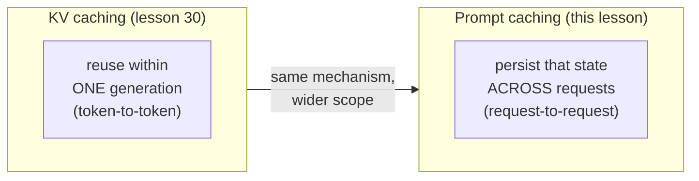
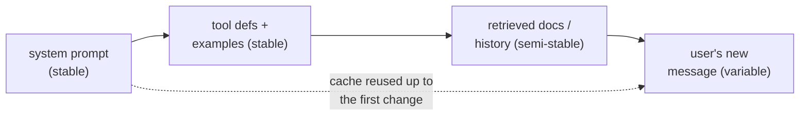

# Prompt Caching

## The problem it solves

Every time you send a prompt to a language model, the model reads it from the very first [token](../01-foundations/01-tokenization.md) to the last before it can produce a single word of output. This read-and-digest phase — turning your input tokens into the internal state the model needs — is called **prefill**, and it is not free: it costs money (you're billed for every input token) and it costs time (the "time to first token" a user waits before anything appears). For a short question that's trivial. But real applications almost never send short prompts.

Consider what a production prompt actually contains. A long **system prompt** laying out the assistant's role, rules, and tone. A block of [few-shot examples](29-few-shot-icl.md) showing the format you want. A set of [tool definitions](../06-agents/32-tool-calling.md) if it's an agent. A pile of retrieved documents if it's retrieval-augmented generation ([RAG](../04-retrieval-knowledge/21-rag.md)). The entire prior **conversation history** if it's a chat. Then, at the very end, the one thing that's actually new: the user's latest message. On the next turn, you send *all of that again* — the same system prompt, the same examples, the same tools, the same history — plus one more line. And the model dutifully re-reads and re-processes every single token from scratch, as if it had never seen them.

That is enormous waste. In a ten-turn conversation with a 5,000-token system prompt, you've paid to prefill those same 5,000 tokens ten times. In an agent that calls tools twenty times in a loop, you've re-processed the tool definitions and instructions on every hop. **Prompt caching** is the fix: it lets the provider remember the work it already did on the unchanging front of your prompt, so the next request can skip straight past it instead of recomputing it. The result is dramatically cheaper input tokens and much faster responses — for the price of putting your prompt together in the right order.

## The one analogy to remember

**The picture:** A prep kitchen makes the same elaborate dish hundreds of times a day, and every order is identical for the first eight steps — the same stock, the same base sauce, the same slow-cooked foundation — differing only in the final garnish the customer picks. A smart kitchen does those eight base steps **once**, holds the result warm on the pass, and for each new order just adds the custom finish. But the steps are sequential: each one transforms the result of the last. If a customer changes something in step *two*, the held base is useless and the cook has to start that order over from step two onward.

**The mapping:** the eight identical base steps = the stable prefix of your prompt (system prompt, tools, examples, documents); "hold the result warm on the pass" = storing the model's computed internal state for that prefix; the custom final garnish = the user's new message at the end; re-doing everything after a changed step = the fact that a change anywhere in the prompt invalidates the cache from that point to the end; the base going cold if no order comes for a while = the cache expiring.

**Why it holds:** the model reads a prompt left-to-right and each token's internal representation depends on *every* token before it (that's how attention works). So you can only reuse pre-computed work up to the first point where the new prompt differs from the cached one — exactly like a sequential recipe where each step builds on the last, so the first altered step spoils everything downstream.

**Say it like this:** "The model reuses the work it already did on the unchanging front of your prompt and only re-does the part that's new — but change one word near the top and it has to redo everything after it."

*Where it breaks:* a cook can improvise around a small change; the cache is unforgiving and exact — a single different token, even a stray space, in the prefix means zero reuse from there on. And unlike a warm base you can smell going off, the cache expires on a fixed timer whether or not you're watching.

## What is actually being cached (and how it differs from KV caching)

The thing stored is not your text and not the model's answer. It's the **KV cache** — the model's internal, pre-computed representation of the prompt's tokens, the intermediate state that prefill produces. That state is what's expensive to compute and what gets reused.

> [!NOTE]
> **KV cache (key–value cache)** — as the model processes a prompt, each token produces internal vectors (called keys and values) that later tokens attend to. Computing them for a long prompt is the expensive prefill work. This mechanism has its own lesson — [KV caching](30-kv-caching.md) — and that's where the details live. For now you only need the one-line version: it's the model's digested internal state for a span of tokens.

The distinction interviewers love: **KV caching and prompt caching are the same underlying mechanism used at two different scopes.**

- **KV caching** ([lesson 30](30-kv-caching.md)) operates *within a single generation*. As the model writes token after token in one response, it caches the state of the tokens it's already processed so it doesn't recompute them for each new token. It's an in-memory, in-flight optimization that lasts as long as that one request.
- **Prompt caching** *persists that state across separate requests*. It takes the KV cache the provider would otherwise throw away when your request finishes, keeps it around keyed by the exact token sequence, and reuses it when a later, independent request arrives with the same prefix.

So prompt caching is best understood as **the productized, persisted version of the KV cache** — the same trick, extended in time so that a system prompt you sent an hour ago (or a second ago) doesn't have to be re-digested now.

## The prefix rule — the single most important thing to understand

Caching works on a **prefix**, and only a prefix. The provider can reuse its stored state for the longest run of tokens at the *start* of your prompt that exactly matches a previous request. The instant the current prompt diverges from the cached one — the first differing token — reuse stops, and everything from that token to the end must be prefilled fresh.

This has one dominating practical consequence: **order your prompt from most stable to most variable.** Put the things that never change (system prompt, tool definitions, few-shot examples, long reference documents) at the very front, and the thing that changes every call (the user's specific question) at the very end.

Get the order wrong and the feature quietly does nothing. If you put a per-request timestamp, a random request ID, or the freshly-retrieved documents *before* your big static system prompt, then the very first tokens differ on every call — so the cache breaks immediately and none of the expensive static content behind it can ever be reused. The classic self-inflicted wound is "the system prompt starts with `Current time: 14:32:07`." That one changing line at the top invalidates the entire cache on every request. The fix is free: move the volatile line to the end.

The exact-match requirement is literal. It's a match on **tokens**, so even a difference in whitespace, punctuation, or capitalization in the prefix counts as a divergence. Templating that produces byte-identical prefixes is what makes caching reliable.

## The economics: why caching isn't automatically a win

Prompt caching changes the *price* of tokens, and there are three prices, not one:

- **Normal input tokens** — the baseline, what you pay when there's no caching.
- **Cache write** — the first time you cache a prefix, you pay a **premium** over the normal input price (the provider is doing the prefill *and* storing the result). On Anthropic's API, for example, a write is roughly 1.25× the base input price for the short-lived cache and about 2× for the long-lived one — numbers that vary by provider and change over time, so treat them as the shape, not gospel.
- **Cache read** — every subsequent request that hits the cache pays a steep **discount** on those cached tokens, on the order of a 90% reduction (Anthropic charges about 0.1× base input for a cache hit).

The takeaway that matters in a meeting: **caching is a bet that pays off only with reuse.** Because the first write costs *more* than a normal request, caching a prefix that gets used only once is a net loss. It wins when the same prefix is reused enough times that the cheap reads more than repay the one expensive write. A rough mental model: if a write is ~1.25× and a read is ~0.1×, you're ahead after just the second or third hit — which is why caching is a no-brainer for a system prompt hit thousands of times, and pointless for a one-off prompt.

The other half of the payoff isn't on the bill at all: **latency.** Skipping the prefill of thousands of cached tokens can cut time-to-first-token substantially, because the model no longer has to digest that content before it starts generating. For long-context applications the latency win is often the *bigger* reason to cache, not the cost — a snappy assistant with a huge system prompt is only possible because the prompt isn't re-read every turn.

## The practical rules: TTL, minimums, and "not guaranteed"

A few operational facts shape how you use it:

- **Caches expire (TTL — time to live).** A cached prefix lives for a limited window — commonly a few minutes — and is usually **refreshed each time it's hit**, so an actively-used prompt stays warm while an idle one goes cold. Some providers offer a longer-lived tier (e.g. an hour) at a higher write premium. A cold cache just means the next request pays full prefill price and re-writes the cache; nothing breaks.
- **There's a minimum cacheable length.** Below some token threshold (on the order of ~1,000 tokens, model-dependent) a prompt is too short to cache — the bookkeeping isn't worth it. Caching is a large-prompt optimization.
- **A cache hit is best-effort, never guaranteed.** A miss is not an error; you simply pay the normal price. So you must never build logic that *depends* on a hit — caching is a cost/latency optimization layered under identical correctness. The model's output is the same whether it hit the cache or not.
- **Explicit vs. automatic.** Providers differ. Some require you to *mark* where the cacheable prefix ends (Anthropic's `cache_control` breakpoints); others apply **automatic prefix caching** with no code change (OpenAI caches long prompts automatically). Either way the prefix rule and the "order stable-to-variable" advice are what you control.

## The product lens

**What to cache.** The high-value targets are exactly the big, stable blocks you'd otherwise resend: long system prompts, [tool definitions](../06-agents/32-tool-calling.md) in agents, [few-shot example](29-few-shot-icl.md) sets, and large reference documents or [retrieved context](../04-retrieval-knowledge/21-rag.md) that's reused across turns. In a chat, the growing conversation history is a natural cache prefix — each turn extends the previous cached prefix rather than re-reading it.

**It reshapes the "big prompt is expensive" tradeoff.** A recurring product decision is how much to stuff into the [context window](../01-foundations/05-context-windows.md) versus retrieving less. Caching tilts that math: if a large block of instructions or documents is *stable and reused*, its per-request cost after the first call collapses by ~90%, so a fat static prompt becomes far more affordable than the sticker price suggests. This is a genuine strategic lever — but only for the stable part; content that changes every call (like freshly-[retrieved](../04-retrieval-knowledge/24-retrieval.md) passages tailored to each query) can't be cached and pays full freight.

**Agents are the killer case.** An [agentic loop](../06-agents/34-agentic-systems.md) calls the model many times in quick succession, and every call resends the same system prompt and tool definitions with only the growing scratchpad changing at the end. That's a stable prefix hit dozens of times within the cache's lifetime — close to the ideal caching workload, and a big part of why long agent runs are economically viable at all.

**Monitor the hit rate.** Because caching is invisible when it silently fails, the metric to watch is the **cache hit rate** (providers report cached vs. uncached input tokens). A hit rate that's mysteriously low almost always means the prefix is being broken — a volatile value crept toward the front, a template started emitting non-identical whitespace, or traffic is too sparse to keep prefixes warm within the TTL. "Our caching stopped working" is nearly always "something made the prefix stop matching."

**Privacy.** Caches are scoped to your organization/account, not shared across customers — your cached prompt can't be read by anyone else. Worth stating plainly because "the provider stores my prompt" understandably raises the question.

## Summary / Points to Remember

- Every request normally re-processes the whole prompt from scratch (**prefill**), paying in both tokens and time-to-first-token. Prompt caching lets the provider **reuse the computed state of an unchanging prefix** so the next request skips that work.
- What's cached is the **KV cache** — the model's digested internal state — not your text or its answer. Prompt caching is the **same mechanism as [KV caching](30-kv-caching.md), persisted across separate requests** rather than reused within one generation.
- **It's a prefix match, and exact:** reuse runs from the start until the first differing token, then stops. So **order your prompt stable-to-variable** — system prompt, tools, examples, and documents first; the user's changing message last. One volatile value near the top (a timestamp, an ID) silently kills the whole cache.
- **Three prices:** a normal input token, a **write** that costs a *premium* (~1.25–2×), and a **read** that's *deeply discounted* (~90% off). Caching is a bet that only pays once a prefix is **reused** enough to repay the pricier write — great for a system prompt hit thousands of times, pointless for a one-off.
- The **latency win** (skipping prefill of cached tokens) is often a bigger deal than the cost win for long prompts.
- Caches **expire on a TTL** (refreshed on use), have a **minimum length**, and a hit is **best-effort — never build logic that depends on one**; output is identical hit or miss.
- **Agents and long chats** are the ideal workload (a big stable prefix reused across many rapid calls); the key metric to watch is the **cache hit rate**, and a drop almost always means the prefix stopped matching.

## Interview Questions That Stump People

**Q: "What's the difference between KV caching and prompt caching? Aren't they the same thing?"**

**Interviewer:** People use those two terms. Are they the same or not?

**You:** They're the same underlying mechanism at two different scopes, and naming that is the whole answer. KV caching is *within a single generation* — as the model writes one response token by token, it caches the state of the tokens it's already seen so it doesn't recompute them for each new token. It lives and dies with that one request. Prompt caching takes that same computed state — the KV cache — and *persists it across separate requests*, keyed to the exact token prefix, so a completely new call that starts with the same system prompt reuses the state instead of re-prefilling it. So I'd say prompt caching is the productized, persisted version of the KV cache: same trick, stretched across requests and across time.

> [!TIP]
> **Why this answer works:** Most people either think they're unrelated or conflate them entirely. Framing it as "one mechanism, two scopes — within-a-generation vs. across-requests" is precise and shows you understand what's physically being stored (the KV cache), not just the marketing name. It also sets up the prefix discussion naturally, because both rely on the same left-to-right dependency.

---

**Q (clarify-back): "We turned on prompt caching and our costs barely moved. What went wrong?"**

**Interviewer:** We enabled it, the docs promised big savings, and the bill looks about the same. Debug it.

**You (clarify back):** Two quick questions: what's at the very start of the prompt — is there anything that changes every request, like a timestamp, a session ID, or the retrieved documents? And how often is the same prefix actually hit within the cache's few-minute lifetime?

**Interviewer:** Now that you mention it, we prepend the current time and the user ID at the top so the model knows the context.

**You:** That's the bug, and it's a common one. Caching only reuses the prefix up to the first token that differs — and you've put two values that change on *every* request right at the top. So the cache breaks on the very first line, and none of the big static system prompt behind it can ever be reused. The fix costs nothing: move the timestamp and user ID to the *end* of the prompt, after all the stable content, so the system prompt, tools, and examples form an identical prefix that gets cached. I'd also confirm we're clearing the minimum length and that traffic is dense enough to keep the prefix warm within the TTL, but I'd bet the reordering alone recovers most of the savings.

> [!TIP]
> **Why this works:** The question sounds like "is the feature broken?" but the real failure is almost always prompt structure, so clarifying what's at the front is the diagnostic that matters. Identifying a leading volatile value as a prefix-killer — and knowing the fix is a free reorder, not a config change or a support ticket — is exactly the "I've shipped this" signal. It also demonstrates the core mental model (prefix match from the first differing token) applied to a real symptom.

---

**Q: "Is prompt caching always worth turning on?"**

**Interviewer:** It's cheaper per token on reads — why wouldn't you just always cache?

**You:** Because the *write* costs more than a normal request, not less. The first time you cache a prefix you pay a premium — roughly 1.25× to 2× the normal input price depending on how long you want it to live — and you only recoup that through cheap reads on later hits. So caching a prefix that gets used once is a straight loss. It's a bet on reuse: it wins big when the same prefix is hit many times — a shared system prompt, an agent loop, a busy chat — and loses when prompts are one-off or the prefix is different every time. There's also a minimum length, so short prompts can't be cached at all. So the honest answer is "cache the stable, high-reuse parts, and don't bother for unique low-volume prompts."

> [!TIP]
> **Why this answer works:** The trap is assuming "cheaper reads" means "always cheaper." Naming the write premium and framing caching as a break-even bet on reuse shows you understand the actual economics, not just that a discount exists. Mentioning the minimum length and giving the concrete "when it wins vs. loses" split proves you'd make the right call per feature rather than flipping it on globally.

---

**Q: "If the same content is cached, does that change the model's answer at all?"**

**Interviewer:** When a request hits the cache instead of processing fresh, is the output different?

**You:** No — and it's important that it isn't. Caching reuses the *computed state* of tokens the model already processed; it's a shortcut to the same intermediate result, not a different computation. The output is identical whether it was a cache hit or a full prefill. That's exactly why a cache miss is never an error — you just quietly pay the normal price and get the same answer. The corollary is a rule I'd enforce: never write application logic that *depends* on a hit, because hits are best-effort and can expire or miss. Caching is a pure cost-and-latency optimization sitting underneath identical correctness.

> [!TIP]
> **Why this answer works:** Some candidates worry caching might "reuse a stale answer" or otherwise alter behavior — a fundamental misunderstanding of what's stored. Stating firmly that output is invariant, and that a miss is a price event not a correctness event, shows you understand caching operates below the semantics of the response. The "never depend on a hit" rule is the mature engineering instinct interviewers listen for.

---

**Q: "Where does prompt caching fit with a big context window — does one make the other pointless?"**

**Interviewer:** If I can just use a huge [context window](../01-foundations/05-context-windows.md), why do I care about caching? And vice versa?

**You:** They solve different problems and actually complement each other. A big context window is about *how much* you can put in front of the model at once; caching is about *not paying to re-read* the stable part of it on every call. The pain point caching addresses only shows up *because* people put large, reusable blocks in the window — long system prompts, documents, history. So the bigger and more static your context, the more caching matters, because you'd otherwise re-prefill all of it every turn. What caching can't help with is the *variable* part — content that's different on every request, like freshly retrieved passages tailored to each query, can't be cached and pays full price. So the framing I'd give is: big context makes caching *more* valuable, not less, but only for the portion that stays the same across calls.

> [!TIP]
> **Why this answer works:** It refuses the false "one replaces the other" premise and separates the two axes cleanly — capacity vs. re-processing cost. The sharp addition is noting that caching only helps the *stable* slice of the context, so variable retrieved content still pays full freight — that nuance shows you understand the prefix constraint interacting with real RAG traffic, not just the happy-path pitch.
