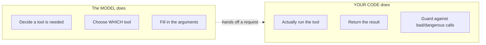

# Tool Calling / Function Calling

## The problem it solves

A large language model (LLM), on its own, is a **closed text predictor**. Everything it can do reduces to one move: read the text so far and generate plausible next text. That single ability is astonishing, but it has three hard walls. It is **frozen in time** — its knowledge stops at the end of [pretraining](../01-foundations/06-pretraining-vs-posttraining.md), so it cannot know today's weather, your current order status, or a price that changed this morning. It is **unreliable at exact operations** — arithmetic, date math, looking up a specific record — because it is *predicting* what the answer looks like, not *computing* it. And it **cannot act** — it can write the words "I've sent the email," but no email leaves the building, because generating text is the only thing it physically does.

**Tool calling** (the same thing is often called **function calling**) is the bridge across all three walls. It lets the model, in the middle of producing an answer, pause and emit a structured request to run an external piece of code — fetch live data, do an exact calculation, query a database, hit an API (application programming interface — a defined way for code to talk to another service), send a message — receive the result, and then continue with that result in hand. It is the mechanism that turns a sealed text generator into something that can reach outside itself for **fresh facts** and **real actions**. Everything later in this category — [agentic systems](34-agentic-systems.md), [MCP](33-mcp.md), [multi-agent architectures](37-multi-agent.md) — is built on this one primitive. If you understand tool calling precisely, agents stop being mysterious.

> [!NOTE]
> **Function calling vs. tool calling — same idea.** "Function calling" was the original name (a function is one kind of tool); "tool calling" is the broader, now-standard term, because a tool can be a function, a web API, a database query, a retrieval step, or a code sandbox. Treat them as synonyms in an interview; use "tool calling" and you're safe.

## The one analogy to remember

**The picture:** A brilliant consultant on a phone-in advice line who is not allowed to touch anything themselves. When they need a fact they don't have, or an action taken in the world, they can't do it — they write a precise little request slip ("Call the warehouse, ask the stock level for SKU 12345" — SKU being *stock-keeping unit*, a product's inventory code) and slide it to an assistant. The assistant makes the actual call, comes back with the answer, and the consultant carries on advising with that answer in hand.

**The mapping:** the consultant = the model; the request slip they write = the **structured tool call** (the tool's name plus its arguments); the assistant who actually dials the phone = your **application code / the runtime**; the answer the assistant brings back = the **tool result fed back into the model's context**; the consultant resuming their advice = the model continuing to generate with the result now available.

**Why it holds:** it captures the single fact everyone gets wrong — **the model never performs the action; it only requests it.** The consultant's job is to *decide a call is needed and specify it exactly*; the assistant's job is to *carry it out*. That separation is the whole architecture. And just as a garbled slip is useless, the model's request has to be well-formed against the tool's expected shape or the assistant can't act on it.

**Say it like this:** "The model doesn't run anything. It writes a structured request — 'call this function with these arguments' — and hands it off. Your code runs the function and passes the result back, and the model continues. Tool calling is the model *asking* for a fact or an action, not performing it."

*Where it breaks:* a real consultant usually knows when they're guessing. The model may confidently write a slip for a tool that doesn't fit the question, invent a plausible-looking argument, or — worst — skip the slip entirely and just make up the answer. And the assistant here has no judgment: your code will execute whatever well-formed slip it's handed, which is exactly where the security problem lives.

## The mechanism: a loop, and who does what

The thing to burn in is that tool calling is a **loop between two parties** — the model and your code — and they have strictly divided jobs. Walk the loop once:

1. **You declare the tools.** Alongside the user's prompt, you send the model a list of available tools. Each is described by a **name**, a **natural-language description** of what it does and when to use it, and a **parameter schema** (the arguments it takes and their types — see [structured outputs](../03-reasoning-generation/20-structured-outputs.md) for how models are made to emit schema-valid data). Nothing is called yet; you're handing the model a menu.
2. **The model decides and requests.** Reading the prompt and the menu, the model either answers directly (no tool needed) or emits a **tool call**: the name of a tool and a set of arguments, as structured data. This is *all* it does — it produces text/JSON that names a function and its arguments. It does not, and cannot, execute anything.
3. **Your code executes.** Your application parses that request, runs the real function — hits the weather API, queries the database, sends the email — and captures the result.
4. **You feed the result back.** The result is appended to the model's context as a new message ("the `get_weather` tool returned `{temp: 14, condition: 'rain'}`").
5. **The model continues.** Now holding the result, the model either produces its final answer or decides another tool call is needed — and the loop repeats.

```mermaid
sequenceDiagram
    participant U as User
    participant M as Model
    participant C as Your code / runtime
    participant T as External tool<br/>(API, DB, function)
    U->>M: prompt + list of available tools
    M-->>C: tool call — name + arguments (JSON)
    Note over M,C: the model REQUESTS; it does not execute
    C->>T: run the actual function
    T-->>C: result
    C-->>M: tool result appended to context
    M->>U: final answer (or another tool call → loop)
```

The division of labor is the load-bearing idea, so make it explicit:



## Where the ability comes from — it's learned, not parsed

A natural assumption is that some clever parser scans the model's output for function-shaped text. It's the reverse. The ability to emit clean tool calls is **trained into the model during [post-training](../01-foundations/06-pretraining-vs-posttraining.md)** — it was shown many examples of "given these tool schemas and this request, produce this structured call," much like [instruction tuning](../02-model-behavior-training/10-instruction-tuning.md) taught it to follow instructions. (The structured request is typically emitted as JSON — *JavaScript Object Notation*, a standard text format of labeled fields your code can parse.) So tool calling is a *learned behavior*, which has a direct consequence for you as a PM (product manager): the model chooses tools **by reading their descriptions**, so a tool's name and description are not documentation — they are **prompt engineering**. A vague description ("handles data") gets the tool picked at the wrong times or ignored; a sharp one ("Look up the *current* shipping status for a given order ID. Use whenever the user asks where their order is.") gets it picked correctly. Weak tool selection is very often a description problem, not a model problem.

## What a PM must know goes wrong

Naming the failure modes is what separates understanding the diagram from understanding the feature.

- **Wrong tool, or wrong arguments.** The model can pick a tool that doesn't fit, or hallucinate an argument (invent an order ID, guess a date format). The call is well-formed, so your code runs it — and returns a confidently wrong result or an error.
- **Not calling when it should.** The subtler failure: instead of calling the lookup tool, the model just *makes up* the answer from its stale training data. This is a [hallucination](../03-reasoning-generation/19-hallucination.md) wearing the costume of a real answer, and it's harder to catch than a visible error.
- **Latency and cost multiply.** Every tool call is a round trip: the model generates, your code runs the tool, the result is appended, and the model generates *again*. A three-step tool sequence means several model calls and a context that grows with every appended result — so tool-heavy flows are slower and more expensive per request than a single completion. (This is why [prompt caching](../05-prompting/31-prompt-caching.md) and keeping tool results lean matter in production.)
- **Security — the model's output is untrusted input.** Your code executes what the model asks. If a tool can do something destructive (delete records, spend money, send external messages), a mistaken or manipulated tool call becomes a real-world action. And because a [prompt injection](../08-safety-trust/42-ai-security.md) buried in retrieved content or user input can steer the model into calling tools maliciously, **never wire the model directly to an irreversible action without a guardrail** — confirmation steps, allow-lists, scoped permissions, human approval for high-stakes calls. This is the single most important production caveat, and it's the seam that [AI security](../08-safety-trust/42-ai-security.md) lives in.

## Summary / Points to Remember

- A bare LLM is **frozen in time, unreliable at exact operations, and unable to act.** Tool calling bridges all three by letting the model request an external function mid-answer, get the result, and continue.
- **The model does not execute anything.** It emits a *structured request* — a tool name plus arguments. **Your code runs the tool** and feeds the result back. This division is the entire mechanism and the thing interviewers probe.
- It's a **loop**: declare tools → model requests a call → your code executes → result appended to context → model continues or calls again.
- **"Function calling" and "tool calling" are the same thing;** tool calling is the broader, current term.
- The ability is **learned in post-training**, so the model picks tools by **reading their descriptions** — tool names and descriptions are *prompt engineering*, not documentation.
- Failure modes: **wrong tool / hallucinated arguments**, **failing to call and making the answer up instead**, **multiplied latency and cost** (every call is a round trip that grows the context), and the big one — **security**: the model's request is untrusted, so never connect it to an irreversible action without a guardrail.
- Tool calling is **the primitive under agents** — [agentic systems](34-agentic-systems.md), [MCP](33-mcp.md), and [multi-agent](37-multi-agent.md) all build on it.

## Interview Questions That Stump People

**Q (clarify-back): "We connected our model to our internal APIs so it can take actions for users. What's the first thing you'd put in place before shipping?"**

**Interviewer:** You've got the model wired to tools that actually *do* things in your systems. What guardrail goes in first?

**You (clarify back):** Can I check what those tools can do — are any of them irreversible or costly, like issuing a refund, deleting a record, or sending an external message? Because the answer changes with the blast radius.

**Interviewer:** Yes — one of them issues refunds, another cancels orders.

**You:** Then the first thing isn't a model improvement, it's an execution guardrail, because of how tool calling actually works: the model only *requests* a call — my code is what executes it — so the control point is my code, not the model's judgment. For the refund and cancel tools I'd require a confirmation or human approval step before execution, and scope the tool's permissions so it can't act outside a safe range (e.g., cap refund amounts). I'd treat every tool call the model emits as untrusted input, because a prompt injection in the user's message or in retrieved content could steer it into calling those tools maliciously. Read-only tools can run freely; irreversible ones get a gate. The mistake I'd avoid is trusting the model to "decide responsibly" — that's not where the safety lives.

> [!TIP]
> **Why this works:** The weak answer tries to make the *model* safer (better prompt, more training). The strong answer locates the control point correctly: because the model only emits a request and your code does the executing, the guardrail belongs in the execution layer. Clarifying the blast radius first shows you scale the guardrail to the risk, and naming prompt injection shows you understand the model's tool call is untrusted output, not a trusted decision.

---

**Q: "The model keeps giving stale answers instead of using the lookup tool we gave it. What's going on?"**

**Interviewer:** We built the tool, we attached it, and the model still answers from memory with out-of-date info. Why?

**You:** The likely culprit is that the model isn't *choosing* to call the tool, and the reason is almost always the tool's description. The model decides which tool to use — and whether to use one at all — by reading the natural-language description you attached, so that description is effectively a prompt. If it's vague, or doesn't clearly say "use this whenever the user asks about current X," the model will judge its own training knowledge good enough and just answer, which comes out as a confident, stale response rather than an error. I'd first rewrite the description to be specific about *when* to call it, and make the tool's purpose unambiguous versus any other tool. If that doesn't fix it, I'd check whether the tool is even being offered in the request and whether the prompt implies the info is static. The trap is assuming it's a model-capability problem when it's usually a tool-description problem.

> [!TIP]
> **Why this answer works:** It targets the right layer. Tool selection is a *learned reading of the description*, so "the model ignores the tool" is usually a description/prompt-engineering issue, not a limitation of the model. Recognizing that a non-call surfaces as a plausible stale answer (a disguised hallucination) rather than a visible failure shows you understand the subtlest tool-calling failure mode.

---

**Q: "Does the model run the function itself?"**

**Interviewer:** When the model calls a tool, is it executing that code?

**You:** No — and this is the core of how it works. The model only produces a structured request: the name of the tool and the arguments to pass, as data. It has no ability to execute anything; generating text is the only thing it does. My application code receives that request, runs the actual function, and then feeds the result back into the model's context so it can continue. So there's a strict split: the model *decides and specifies* the call; the runtime *performs* it. That's not a technicality — it's why the execution layer is where you put permissions, validation, and safety checks, and why the model's request has to be treated as untrusted.

> [!TIP]
> **Why this answer works:** This is the single most common misconception, and getting it exactly right — the model emits a request, your code executes — is a fast credibility signal. Tying the split to *why it matters* (safety and validation live in the execution layer) shows it's understanding, not a memorized line.

---

**Q: "We added six tools and now responses are slower and pricier even for simple questions. Expected?"**

**Interviewer:** More tools, and now everything costs more and takes longer — even easy queries. Is that normal?

**You:** Partly expected, partly fixable. Two things drive it. First, every tool the model actually calls is a round trip: the model generates a call, your code runs it, the result is appended to the context, and the model generates again — so a multi-step tool flow means several model invocations and a context that grows with each appended result, which is both slower and more tokens. That's inherent to tool use. But "even simple questions got slower" suggests a second thing: the tool *definitions themselves* sit in the prompt on every request, and six verbose schemas add input tokens to calls that don't need any tool. I'd trim and tighten the tool descriptions, consider only offering tools relevant to the request, and lean on prompt caching for the stable tool definitions so they're not reprocessed every time. So: multi-step calling is legitimately costlier, but a flat tax on simple queries is a sign the tool definitions are bloated.

> [!TIP]
> **Why this answer works:** It separates two distinct costs — the *per-call round-trip cost* (inherent to tool use) and the *always-on definition cost* (the schemas riding in every prompt). Naming both, and pointing to prompt caching and selective tool exposure as levers, shows you understand where tool calling actually spends latency and tokens, rather than vaguely blaming "more tools."

---

**Q: "How is tool calling different from an agent? Aren't they the same thing?"**

**Interviewer:** People use "tool calling" and "agent" interchangeably. Are they?

**You:** They're related but not the same — tool calling is the *primitive*, an agent is what you build *with* it. Tool calling is a single capability: the model can emit a structured request for one function and get a result back. An [agentic system](34-agentic-systems.md) is a loop wrapped around that capability — the model calls a tool, reads the result, decides the next step, calls another, and keeps going autonomously toward a goal, often across many steps, until it decides it's done. So one tool call is a primitive; an agent is repeated tool calling plus the autonomy to choose and sequence the steps itself. You can have tool calling without an agent — a single lookup in an otherwise scripted flow — but you can't have an agent without tool calling, because acting on the world is the whole point. That's why this lesson comes first in the category.

> [!TIP]
> **Why this answer works:** It resists collapsing two levels of abstraction. Framing tool calling as the primitive and the agent as the autonomous loop built on top — with the clean test that you can have tool calling without an agent but not the reverse — shows you understand the layering, which is exactly what the rest of the agents category depends on.
