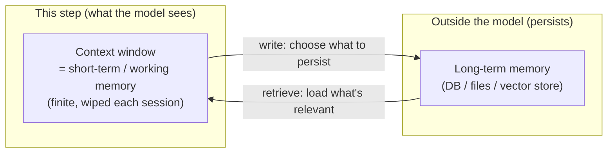
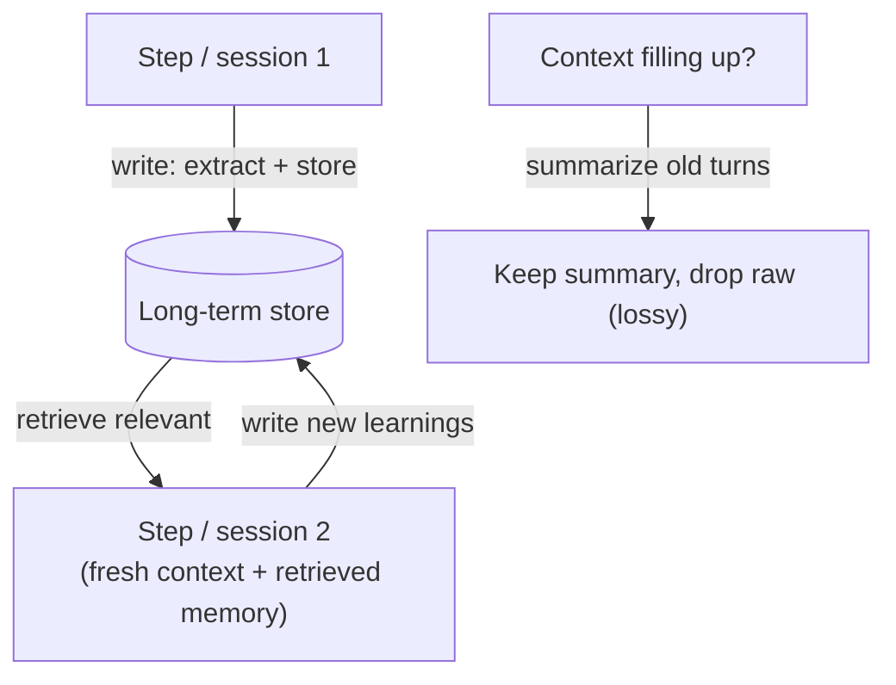

# Agent Memory

## The problem it solves

An [agent](34-agentic-systems.md) runs in a loop, but the large language model (LLM) at its core has a property that quietly breaks long or repeated tasks: **it is stateless.** On every single call, the model knows *only* what is in its [context window](../01-foundations/05-context-windows.md) at that moment. It has no built-in recollection of anything that isn't in the current prompt. Nothing carries over on its own.

That creates two distinct failures. **Within one long task:** the context window is finite, so as an agent racks up steps — tool calls, results, reasoning — the early material gets pushed out or the window overflows, and the agent effectively *forgets what it did thirty steps ago*. **Across sessions:** nothing persists at all. Come back tomorrow and the agent has no idea who you are, what you asked yesterday, or what it learned. The context window is a small, ephemeral **working memory that is wiped between sessions.**

**Agent memory** is the machinery that gives an agent state *beyond* the current context window — so it can carry information across many steps of a single task and across entirely separate sessions. The reframe that makes the whole topic click: **memory is not a feature of the model.** The model stays frozen and amnesiac. Memory is a **system you build around it** — you store information externally and decide what to load back into the context window at each step. The model only ever *sees* the context; memory is how you choose what goes into it.

## The one analogy to remember

**The picture:** a brilliant colleague who — like the character in *Memento* — cannot form new long-term memories. They work at a **small desk** and keep a **filing cabinet**. During a work session they hold what they need on the desk, but the desk is small: it fills, and older papers get shoved off the edge. To remember anything past today, they must *deliberately write a note and file it*. Tomorrow they arrive to an empty desk and, to pick up where they left off, they *look up the relevant notes and lay them back on the desk*. They only ever "know" what is on the desk right now; everything else is retrieval from files they chose to write.

**The mapping:** the small desk = the **context window** (short-term / working memory — finite, wiped each session); papers falling off the full desk = **context overflow / eviction**; the filing cabinet = **external long-term memory**; deliberately writing a note = the **write step** (choosing what to persist); looking up notes and laying them on the desk = the **retrieve step** (loading relevant memory back into context); the amnesia itself = the model being **stateless**.

**Why it holds:** it nails the crux — the memory isn't *in* the person. The model is genuinely amnesiac; all persistence is an *external* system of writing and retrieving notes that the person operates. The small desk also explains why you need memory management even *within* a session (the desk fills), and "what to write down, what to look up" being the person's deliberate choice captures the key truth that **memory is a policy you design, not a capability the model has.**

**Say it like this:** "The model is stateless — it only knows what's in its context window right now, and that's wiped between sessions. Agent memory is a system you build around it: store things externally, and pull the relevant bits back into context when needed. Short-term memory *is* the context window; long-term memory is basically [retrieval](21-rag.md) over the agent's own past."

*Where it breaks:* a real amnesiac still reasons well and can read their own handwriting reliably. An agent can **write a wrong note** (bad extraction), **retrieve the wrong note** (bad retrieval), or **trust a stale note** with no gut sense that a filed fact has expired — failure modes the tidy filing-cabinet image hides.

## Short-term vs. long-term: the distinction to get right

This is the split interviewers probe, and it maps cleanly onto the analogy.

- **Short-term (working) memory** is *what's in the context window right now* — the running conversation and recent steps. It's fast (the model sees it directly), finite, and **ephemeral**: it vanishes when the window overflows or the session ends. Managing it is really [context-window](../01-foundations/05-context-windows.md) management.
- **Long-term memory** is information persisted *outside* the context — in a database, a file, or a vector store — that **survives** beyond the window and across sessions, and is **selectively retrieved back in** when relevant.

The most important consequence: **long-term memory is essentially [RAG](21-rag.md) (Retrieval-Augmented Generation) pointed at the agent's own experience.** You *write* experiences to external storage, then *retrieve* the relevant ones back into the context window when they're needed — often through the same [vector-database](23-vector-databases.md) and [retrieval](21-rag.md) machinery used for documents. So everything you know about retrieval quality applies here too; memory doesn't get a special exemption.

## The write / read cycle — and that both are policies you design

Long-term memory runs on two operations, and each is a design decision that can fail:

- **Write:** decide *what is worth remembering*, extract it, and store it — as a raw log, a running summary, or structured facts ("user prefers metric units").
- **Read / retrieve:** at each step, decide *what stored memory is relevant* and load it into the context window.

For the finite working memory, there are two standard levers when the window fills:

- **Summarization / compaction:** compress old turns into a summary, keep the summary, drop the raw detail. Frees space but is **lossy** — the detail you dropped may be the one you later needed.
- **Retrieval-based memory:** store everything externally and pull back only the relevant slice each step, keeping the live window small.

> [!NOTE]
> **The common taxonomy, lightly.** Long-term memory is often split into **episodic** (records of past events — "last session the user asked X"), **semantic** (accumulated facts — "their fiscal year ends in March"), and **procedural** (learned how-to). Useful vocabulary, but don't over-index on the labels: in practice they're all "write something to external storage and retrieve it later." The taxonomy names *what* you store, not a different mechanism.

## What a PM (product manager) must know about the tradeoffs

- **What to remember is a hard product decision, not a technical default.** Remember too much and you get context bloat, higher cost, noisy retrieval, and a growing pile of stale or sensitive data. Remember too little and you're back to the goldfish agent. Memory is *curation*, and there's no free lunch.
- **Stale or wrong memory poisons the future.** A one-off model mistake is transient; a wrong fact *written to long-term memory* ("user's address is X") gets retrieved and trusted on every future session. Memory errors **persist and compound**, so you need a story for **updating and invalidating** memories, not just writing them.
- **Retrieval quality caps memory quality** — the same iron law as [RAG](21-rag.md). If the retrieval step surfaces the wrong past note, the agent confidently acts on the wrong information.
- **It costs tokens every step.** Loading memory into the context on each step is recurring input cost and latency; this is a big reason [prompt caching](../05-prompting/31-prompt-caching.md) and lean memory matter for agents.
- **Persistence is a privacy decision.** Storing user information across sessions is a data-retention and [PII](../08-safety-trust/43-privacy-pii.md) (personally identifiable information) question with real legal and trust weight — what you remember, for how long, and whether the user can see or delete it.

## Summary / Points to Remember

- The model is **stateless** — it knows only what's in its [context window](../01-foundations/05-context-windows.md) right now, and that's finite within a task and wiped between sessions. That's the problem agent memory exists to solve.
- **Memory is not a model feature; it's a system you build around the model** — external storage plus a *policy* for what to load back into context. The model only ever sees the context.
- **Short-term (working) memory = the context window** (ephemeral). **Long-term memory = information persisted outside it** (DB/files/vector store), retrieved back in when relevant.
- **Long-term memory is basically [RAG](21-rag.md) over the agent's own experience:** *write* what's worth keeping, *retrieve* the relevant slice each step. Both write and read are policies you design and both can fail.
- To manage the finite window: **summarize/compact** old turns (frees space, **lossy**) or use **retrieval** to keep only the relevant slice live.
- PM tradeoffs: **what to remember is curation** (too much = bloat/cost/privacy, too little = goldfish); **stale memory persists and poisons** future behavior (need invalidation); **retrieval quality caps it**; it **costs tokens every step**; and **persistence is a privacy/PII decision**.

## Interview Questions That Stump People

**Q (clarify-back): "We want our assistant to 'have memory' so it remembers users between sessions. How would you build that?"**

**Interviewer:** Users want it to remember them across visits. What's the design?

**You (clarify back):** Two quick things: what specifically should it remember — durable preferences and facts, or the full history of past conversations — and are we comfortable persisting that user data between sessions from a privacy standpoint? Those shape the whole design.

**Interviewer:** Mostly durable preferences and a few key facts about their account. And yes, persistence is allowed if we're careful.

**You:** Then I'd build long-term memory as an external store, not try to make the model itself "remember" — the model is stateless, so all persistence lives in a system around it. On the write side, I'd extract and store just the durable facts and preferences as structured entries rather than dumping whole transcripts — that keeps it small, reviewable, and easy to update. On the read side, at the start of a session I'd retrieve the relevant entries for that user and load them into context. Because it's essentially retrieval over their past, I'd treat retrieval quality as a first-class concern, and I'd build in *invalidation* — a wrong or outdated fact gets retrieved and trusted every session, so memories need to be updatable and expirable. And since we're persisting user data, I'd scope exactly what's stored, for how long, and give the user visibility and deletion, because this is now a PII decision, not just an engineering one. The trap I'd avoid is "remember everything" — that's cost, noise, and privacy risk with little benefit.

> [!TIP]
> **Why this works:** The weak answer treats "memory" as a switch and stores whole conversations. The strong one clarifies *what* to remember and surfaces privacy immediately, then designs write/retrieve as explicit policies, flags that memory is external (model is stateless), and names invalidation and PII — the three things people forget. It shows memory is curation and a data-governance decision, not a feature toggle.

---

**Q: "Our agent works great early in a long task, then starts contradicting its own earlier steps. What's happening?"**

**Interviewer:** Long task, and partway through it forgets or contradicts what it did earlier. Why?

**You:** That's the working-memory limit biting. The model only sees what's in the context window, and in a long task the early steps get pushed out as the window fills — so by step forty it literally can't see what it decided at step five, and it contradicts itself. It's not a reasoning failure; it's that the relevant information is no longer in front of the model. The fixes are memory-management: summarize or compact the earlier steps so a condensed record of key decisions stays in the window, and/or move the history to an external store and retrieve the relevant pieces back when needed. I'd be careful with summarization, though — it's lossy, so I'd make sure the *decisions and constraints* survive the compaction even if the chatter doesn't. If contradictions persist, it usually means the compaction is dropping exactly the state the agent needs to stay consistent.

> [!TIP]
> **Why this answer works:** It correctly diagnoses a *context/working-memory* problem rather than blaming the model's intelligence — the information simply fell out of the window. Naming both levers (summarization and retrieval) and then flagging summarization's lossiness (and that decisions must survive it) shows you understand the mechanism and its failure mode, not just the buzzword "add memory."

---

**Q: "Isn't long-term agent memory just RAG? Why give it a separate name?"**

**Interviewer:** You keep saying memory is retrieval. So is it just RAG rebranded?

**You:** Mechanically, long-term memory *is* largely RAG — you write information to external storage and retrieve the relevant slice back into context. The reason it gets its own name is the *source and lifecycle* of what's stored. Classic RAG retrieves from a relatively static, curated knowledge base — documents you ingested. Memory retrieves from the agent's *own accumulating experience* — things it decided to write about past interactions — which means the agent is both the author and the reader, the store grows and changes over time, and you inherit new problems RAG mostly doesn't face: deciding what's worth writing in the first place, and invalidating facts that go stale. So it's the same retrieval machinery applied to a different, self-generated, mutable corpus. Calling it "memory" flags those extra write-side and staleness concerns; calling it "just RAG" hides them.

> [!TIP]
> **Why this answer works:** It concedes the true part (same retrieval mechanism) instead of manufacturing a false distinction, then locates the *real* difference — self-authored, mutable, lifecycle-managed content versus a static document corpus. Naming the write decision and invalidation as the genuinely new problems shows you understand memory deeply enough to say what RAG intuition *doesn't* cover.

---

**Q: "What's the risk of letting the agent decide what to write to its own long-term memory?"**

**Interviewer:** We let the agent choose what to remember. Any downside?

**You:** The core risk is that a bad write is durable in a way a bad answer isn't. If the agent extracts something wrong — misreads a preference, records an incorrect fact, or stores something a user said in passing as if it were a standing truth — that entry gets retrieved and trusted on every future session, so one mistake quietly poisons behavior indefinitely. There's also a privacy angle: an agent deciding what to persist might store sensitive PII you didn't intend to retain. So I wouldn't treat memory writes as fire-and-forget. I'd want guardrails on the write path — what categories of thing are eligible to be remembered, validation or confirmation for high-stakes facts, and above all an invalidation/update mechanism so memories can be corrected or expired. The mental model is that writing to long-term memory is closer to editing a database of record than to jotting a note — errors have persistence, so the write side deserves as much care as retrieval.

> [!TIP]
> **Why this answer works:** It identifies the asymmetry that makes memory dangerous — *persistence*: a transient error becomes a permanent one once written and retrieved forever. Pairing that with the privacy risk of autonomous PII capture, and prescribing write-path guardrails plus invalidation, shows you treat memory as governed state rather than a convenience, which is exactly the production-grade concern.
