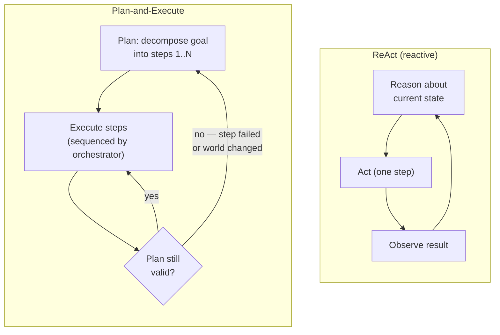
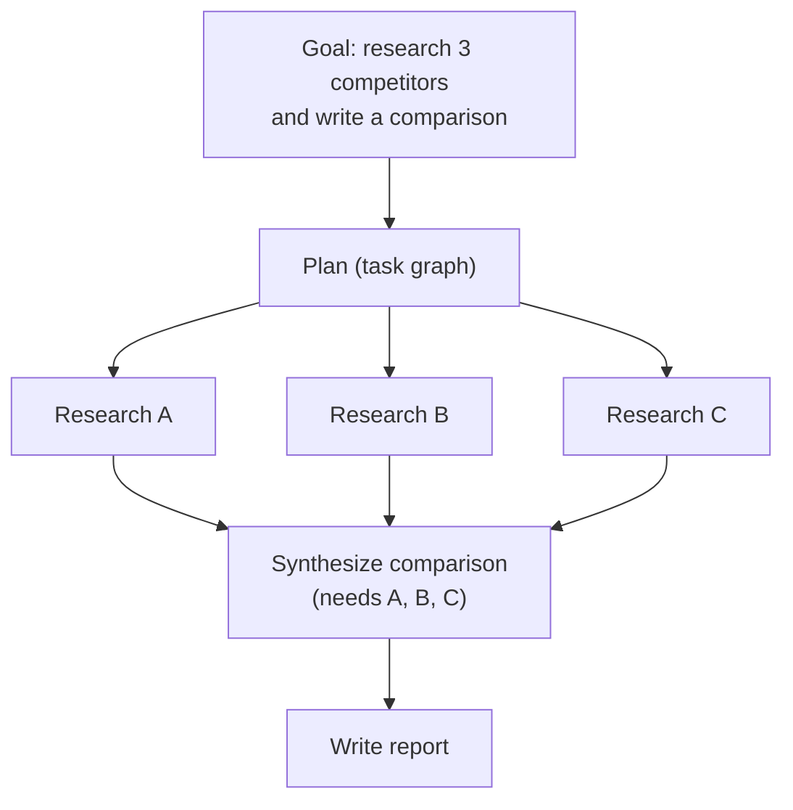

# Planning and orchestration

## The problem it solves

The [bare agent loop](34-agentic-systems.md) is **reactive**: reason → act → observe, choosing exactly one move at a time based on what's in front of it right now. That greedy, one-step-at-a-time style is fine for short tasks. But point it at something long and multi-part — "migrate this codebase to the new API, update the tests, and write the changelog" — and the cracks show. With no view of the whole job, the agent wanders: it dives deep on the first sub-task, loses the thread of the other three, redoes work it already did, and — because [errors compound across steps](34-agentic-systems.md) — a wrong turn early quietly corrupts everything after it. It's like a chef who never plans the meal and just does the next thing that occurs to them: the fish is cold by the time the sauce is ready.

Two ideas fix this. **Planning** is the agent *decomposing the goal into structured sub-steps up front* — producing an actual plan — rather than only reacting to the last observation. **Orchestration** is the *controller layer that runs those steps*: it sequences them, decides what goes in parallel versus in order, passes state (each step's output) to the steps that need it, handles retries and errors, and knows when to stop. Planning is *deciding what the steps are*; orchestration is *making the steps happen in the right order with the right inputs.* This lesson is about both, applied to the steps **within a single agent's plan** — coordinating multiple *agents* is a different problem, covered in [multi-agent systems](37-multi-agent.md).

## The one analogy to remember

**The picture:** taking a five-city European trip two different ways. **Way one:** you show up at the first airport with only "I want to see five cities" and figure out each leg at the gate — where next, how to get there, where to sleep — deciding on the spot every time. **Way two:** you sit down beforehand and write an **itinerary** — the order of cities, which trains are booked, what depends on what (the Tuesday tour must come before the Wednesday train), and which errands can be done in any order — then you execute it, adjusting only when a train gets cancelled.

**The mapping:** figuring out each leg at the gate = the **reactive [ReAct](34-agentic-systems.md) loop** (decide the next move one at a time); the written itinerary = the **explicit plan** (decompose the whole goal up front); the ordering and "this-before-that" dependencies in the itinerary = the **task graph the orchestrator sequences**; things you can do in any order (buy postcards, exchange money) = **parallelizable branches**; a cancelled train forcing you to redo the itinerary = **replanning**; you-the-planner versus a travel agent who books it all for you = the **model-as-orchestrator versus a deterministic controller** deciding the sequence.

**Why it holds:** the load-bearing difference is *when the sequencing decision gets made* — at the gate (runtime, one step at a time) or on paper beforehand (up front, whole-journey view). That is exactly the ReAct-versus-plan-and-execute tradeoff: planning ahead buys structure, a global view, and the ability to hand cheap execution to someone else, at the cost of brittleness when reality diverges from the itinerary. Winging it adapts to every surprise but drifts and repeats itself on a long trip.

**Say it like this:** "A reactive agent decides its next move at every gate; a planning agent writes the itinerary first, then executes it. Planning gives you structure and a map you can inspect; the catch is the world may not match the plan, so you need to be willing to redraw it."

*Where it breaks:* a written itinerary is a static document, but a good agent's plan is meant to be *revised* mid-trip — so don't let the analogy convince you a plan is a fixed contract. It's a hypothesis you update.

## Why plan at all: reactive vs. planning ahead

The reactive loop chooses each action from the local situation — the last observation and whatever's in context. On a short task that's optimal: less overhead, full adaptivity. On a long-horizon task it has three specific weaknesses. It has **no global view** — it can't see the whole shape of the job, so it can't allocate effort or notice that step 8 will need something step 2 should have produced. It **re-derives the plan implicitly on every step** — each iteration the model has to reason "what's the overall goal and what's left?" from scratch, which is expensive and inconsistent run to run. And it **drifts**: with no committed structure to hold it, it follows whatever the last observation suggests, wanders down rabbit holes, and repeats work.

Explicit planning answers all three: decompose the goal once into named sub-steps, and now there *is* a global view, the structure is committed instead of re-derived each step, and the agent has something to hold the thread against.

> [!NOTE]
> **ReAct (Reason + Act)** — the standard name for the bare reactive loop from [lesson 34](34-agentic-systems.md): the model interleaves a reasoning step and an action step, over and over, choosing one action at a time. The plan, if any, is *implicit* — it lives only in the model's per-step reasoning and is never written down as a separate artifact. Contrast this with plan-and-execute below, where the plan is an explicit, inspectable object.

## The central tradeoff: ReAct vs. Plan-and-Execute

This is the tension the whole topic turns on. There are two ways to get a multi-step job done.

**ReAct (reason and act, interleaved):** the plan is emergent — the agent figures out the next step each time it loops, adapting to whatever just came back. **Plan-and-Execute:** the agent first produces an *explicit plan* (a list or graph of sub-steps), then a separate execution phase runs those steps.

Each buys something and pays for something:

- **Plan-and-Execute gives structure and a global view.** The whole job is laid out before execution, so the agent allocates effort sensibly and doesn't lose the thread.
- **It's cheaper to run.** You do the expensive "think hard about the whole problem" reasoning *once*, at plan time, with a strong model. Execution of each concrete step ("call this tool with these args") is simpler and can run on a **cheaper, faster model**. ReAct, by contrast, pays for whole-task reasoning on *every* loop.
- **It's auditable.** The plan is an explicit artifact you can log, inspect, show a user for approval, and debug against — a genuine product advantage discussed below.
- **But it's brittle.** A plan authored up front assumes the world will behave. When a step fails, or an early result reveals the plan was wrong, or reality shifts mid-task, a rigid plan marches on executing steps that no longer make sense. This is plan-and-execute's signature failure.
- **ReAct adapts every step** — it never commits to a stale plan because it re-decides continuously — **but it drifts on long tasks** and re-derives the plan implicitly each iteration (costly, no persisted global view, inconsistent across runs).

The honest framing for an interview: **plan-and-execute trades adaptivity for structure, cost, and auditability; ReAct trades structure for adaptivity.** Neither is "better" — the right choice depends on task length and how stable the environment is. And most production systems are a **hybrid**: plan up front, but execute with the ability to replan when a step's result contradicts the plan.

## Replanning: the plan is a hypothesis, not a contract

The fix for plan-and-execute's brittleness is **replanning** (sometimes called reflection when the trigger is the agent evaluating its own progress): when a step fails or the results diverge from what the plan assumed, the agent revises the plan instead of blindly continuing. This is the loop the hybrid systems run — plan, execute a step, check whether the plan still holds, and if not, go back and re-plan from the current state.

The reframe worth carrying: **a plan is a hypothesis about how to reach the goal, not a contract that must be executed to the letter.** Treating it as a contract gives you the classic failure where the agent completes step 4 of a plan that step 2's result already invalidated. Treating it as a hypothesis means every step is also an opportunity to notice "this isn't working" and redraw. The cost, of course, is that replanning is more model calls and more complexity — replan too eagerly and you've reinvented ReAct's per-step overhead; replan too rarely and you march off the cliff. Where to put that checkpoint is a real design dial.

## The orchestration layer: who owns the sequencing

Once you have a plan, *something* has to run it — sequence the steps, decide order, feed each step the outputs it depends on, retry failures, and stop at the end. That's orchestration, and the key question is **who owns the control flow** — the exact same *autonomy-over-control-flow* spectrum from [lesson 34](34-agentic-systems.md), now applied to executing the plan rather than to the bare loop.

At one end, a **deterministic controller** — *your code* — owns sequencing: you parse the plan into a task graph and your orchestration code dispatches each step, in the order the dependencies dictate, retrying and error-handling with logic you wrote. Predictable, testable, cheap. At the other end, the **model as orchestrator**: the model itself decides at runtime which step to run next, whether to parallelize, and when to stop. More flexible for messy plans, less predictable and harder to test. Most systems land in between — code owns the skeleton, the model fills discretionary decisions.

### The plan as a task graph (DAG)

The natural structure for a plan is a **DAG — a Directed Acyclic Graph**: sub-tasks are nodes, an edge from A to B means "B depends on A's output," and "acyclic" means no step can (transitively) depend on itself, so there's always a valid order to run them. The DAG is what makes orchestration tractable: it encodes exactly which steps must be **sequential** (B needs A's result) and which are independent and can run **in parallel**.

Two things fall out of the graph. **Parallelism:** the three "research" nodes depend on nothing but the goal, so an orchestrator can dispatch them at once instead of one after another — a latency win the reactive loop, which does one thing at a time, structurally can't get. **State passing:** the "synthesize" node needs the outputs of all three research nodes, so the orchestrator must collect and hand those results forward as inputs. Deciding *what* state to pass between steps (and keeping it small — full outputs bloat context and cost) is a core orchestration concern; the persistence side of that state is [agent memory](35-agent-memory.md).

Note also *why re-running a stable plan can be cheap*: if the plan's prefix (the goal, the tool definitions, the earlier steps) is stable across iterations, [prompt caching](../05-prompting/31-prompt-caching.md) means you don't re-pay full price to re-send it — which is part of why plan-and-execute's "plan once, execute cheaply" economics hold up.

## What a PM (product manager) must know about the tradeoffs

- **Planning overhead vs. reliability.** Explicit planning costs an up-front reasoning step (and replanning costs more). You spend that to gain reliability on long, decomposable tasks. On a short, simple task it's pure overhead for no benefit — you've added a planning call and a controller to a job the reactive loop would have nailed in two steps.
- **Plan brittleness is the signature failure.** An up-front plan can be wrong from the start (the agent misjudged the task) or go stale mid-execution (the world changed). Without replanning, the orchestrator faithfully executes a bad plan to completion. The mitigation is treating the plan as a revisable hypothesis, which costs complexity.
- **Observability is a real product advantage.** An explicit plan is *inspectable* — you can show it to a user for approval before execution, log it, and when something breaks you can see *which step* failed and why. A reactive agent's "plan" lives only in scattered per-step reasoning, so debugging it means reconstructing intent from a trace. For anything high-stakes, "here's the plan, approve it before I run it" is often the feature that makes an agent shippable.
- **Cheaper execution.** Plan with a strong model, execute steps with a cheap one — a concrete way explicit planning can *lower* total cost on long tasks even though it adds a planning call. (The unit-economics framing is in [cost/unit economics](../10-production-ops/51-cost-unit-economics.md).)
- **When it helps vs. hurts.** Explicit planning earns its keep on tasks that are **long-horizon, decomposable, and especially parallelizable** (independent branches the orchestrator can fan out). It hurts on **short, simple, or highly-unpredictable** tasks — short ones don't need the structure, and wildly unpredictable ones invalidate any up-front plan so fast you're better off reacting. As always, use the least machinery the task needs.
- **Autonomy over sequencing widens the blast radius.** Letting the model orchestrate (choose order, parallelize, decide to stop) is more autonomy, and more autonomy means more ways to go wrong and more exposure to [prompt injection](../08-safety-trust/42-ai-security.md) steering the sequence — so the same guardrails from the agent loop apply to the orchestrator.

## Summary / Points to Remember

- The [reactive loop](34-agentic-systems.md) picks one move at a time with no global view; on **long, multi-part tasks** it drifts, redoes work, and compounds errors. **Planning** = decompose the goal into structured sub-steps up front; **orchestration** = the controller that sequences, dispatches, passes state, retries, and stops.
- The central tradeoff is **ReAct vs. Plan-and-Execute.** Plan-first gives structure, a global view, cheaper execution (plan once with a strong model, execute steps with a cheap one), and auditability — but is **brittle** when the plan is wrong or the world changes. ReAct adapts every step but **drifts** and re-derives the plan implicitly each iteration.
- **A plan is a hypothesis, not a contract.** The fix for brittleness is **replanning/reflection** — revise the plan when a step fails or reality diverges. Most real systems are the hybrid: plan up front, replan when the results contradict it.
- Orchestration is the **autonomy-over-control-flow spectrum** applied to the plan: a **deterministic controller (your code)** vs. the **model-as-orchestrator**. Represent the plan as a **DAG** so you know what's **sequential** (dependencies) vs. **parallelizable**, and pass each step only the state it needs.
- Explicit planning **helps** when tasks are long-horizon, decomposable, and parallelizable; it **hurts** on short, simple, or highly-unpredictable tasks (overhead for nothing / instantly-stale plans). Use the least machinery the task needs.
- The under-rated PM win is **observability**: an explicit plan is inspectable and approvable before execution, which is often what makes a high-stakes agent shippable. (Orchestrating *multiple agents* is [lesson 37](37-multi-agent.md), a different problem.)

## Interview Questions That Stump People

**Q (clarify-back): "Should we use a plan-and-execute agent or a ReAct agent for this feature?"**

**Interviewer:** We're building an agent feature. Plan-and-execute, or ReAct — which do you go with?

**You (clarify back):** Two things decide it for me: how long and decomposable is a typical task — one or two steps, or a dozen with dependencies — and how stable is the environment it runs against, i.e. does an up-front plan stay valid, or does reality shift mid-task?

**Interviewer:** Tasks are long — think ten-plus steps with clear sub-parts — and the environment is fairly stable; the inputs don't change much once we start.

**You:** Then I'd lean plan-and-execute, but with a replanning checkpoint — a hybrid. Long, decomposable tasks are exactly where an explicit plan pays off: it gives the agent a global view so it doesn't drift or redo work, it lets me run independent sub-parts in parallel, and I can plan once with a strong model and execute the concrete steps with a cheaper one. A stable environment means the plan mostly stays valid, so I get those benefits without paying the brittleness cost constantly. I still wouldn't treat the plan as a contract — I'd check after each step whether it still holds and replan if a result contradicts it — but on this profile I'd expect to replan rarely. If you'd told me tasks were short or the environment shifted every few seconds, I'd have gone the other way: ReAct, because up-front planning would be overhead or would go stale before I could execute it.

> [!TIP]
> **Why this works:** "Plan-and-execute or ReAct" has no context-free answer — it hinges on task length/decomposability and environment stability, so answering immediately would expose you as reciting a rule. Clarifying pins the two variables that actually decide it and signals you've shipped the tradeoff. Once "long, decomposable, stable" is on the table, plan-and-execute-with-replanning follows directly — and naming what would have flipped your answer proves you understand *why*, not just *which*.

---

**Q: "We built a plan-and-execute agent and it's more reliable on long tasks — but sometimes it confidently does the wrong thing. What's going on?"**

**Interviewer:** The planning agent is great most of the time, then occasionally executes a whole sequence that's clearly wrong for the situation. Why?

**You:** That's plan brittleness — the signature failure of plan-and-execute. The agent commits to a plan up front, and then the execution phase faithfully runs it *even when reality has diverged from what the plan assumed.* Either the plan was wrong from the start — the agent misjudged the task at plan time — or a step's result invalidated the rest of the plan and nothing checked. The reason it looks *confident* is precisely that there's no re-evaluation: the orchestrator is doing its job, executing step 4 of a plan that step 2 already made obsolete. The fix isn't a smarter planner, it's structural: treat the plan as a hypothesis, not a contract, and add a replanning checkpoint — after each step (or each risky step), verify the plan still holds given the latest result, and if it doesn't, re-plan from the current state. The tuning question is *how often* to check: replan every step and you've reinvented ReAct's overhead; replan too rarely and you march off the cliff. So I'd put the checkpoint at the steps most likely to invalidate downstream work.

> [!TIP]
> **Why this answer works:** It names the specific mechanism — a static plan executed against a changed world — instead of vaguely blaming the model. Crucially it explains *why the failure looks confident* (faithful execution, no re-evaluation), which is the detail that shows real understanding, and it prescribes a *structural* fix (replanning as hypothesis-testing) with the right nuance about checkpoint frequency, rather than "use a better model."

---

**Q: "If planning adds an extra reasoning step, isn't it always more expensive than just reacting?"**

**Interviewer:** Plan-and-execute does a big planning call before it even starts. Surely that's strictly more cost than ReAct?

**You:** It's the opposite on the tasks planning is for. The intuition misses *where* the cost lives. In ReAct, every single loop iteration re-reasons about the whole task — "what's the goal, what's done, what's next" — on a capable model, and it does that for all ten or twenty steps. Plan-and-execute pays that expensive whole-task reasoning *once*, at plan time, and then execution of each concrete step is a much simpler call — "invoke this tool with these arguments" — which can run on a cheaper, faster model. So on a long task you're trading twenty expensive reasoning calls for one planning call plus twenty cheap execution calls. On top of that, the stable plan prefix is cacheable, so re-sending it across steps isn't full price. Where the intuition *is* right: on a short task, the planning call is overhead you never earn back — there weren't enough steps to amortize it. So planning isn't universally cheaper or costlier; it's cheaper exactly when the task is long enough for the plan-once/execute-cheap structure to pay off.

> [!TIP]
> **Why this answer works:** It refuses the surface arithmetic ("extra step = more cost") and relocates the real cost to *repeated whole-task reasoning* in ReAct. Naming the concrete lever — plan with a strong model, execute with a cheap one — plus caching the stable prefix shows you understand agent economics, not just the mechanism. Conceding the case where the intuition holds (short tasks) makes the answer credible rather than dogmatic.

---

**Q: "Who should own the sequencing of the steps — should we let the model orchestrate, or write a controller?"**

**Interviewer:** Once we have a plan, the model can just run the steps itself, right? Why would we write orchestration code?

**You:** This is the same autonomy-over-control-flow question from the agent loop, now applied to executing the plan — and the answer is "cede the least control that gets the job done." If the plan's structure is knowable — a task graph with clear dependencies and parallelizable branches — I'd have deterministic code own the sequencing: parse the plan into a DAG, dispatch steps in dependency order, run independent branches in parallel, and handle retries with logic I wrote. That's predictable, testable, cheap, and it gives me clean parallelism and observability. I'd hand orchestration to the model only for the discretionary parts — cases where the right next step genuinely depends on runtime judgment I can't encode. The trap is letting the model orchestrate everything by default: it's less predictable, harder to test, and every sequencing decision it makes is another surface for prompt injection to steer the order of operations. So: code owns the skeleton and the dependencies, the model fills the genuinely judgment-dependent gaps.

> [!TIP]
> **Why this answer works:** It connects orchestration back to the control-flow spectrum rather than treating it as a new question, and applies "least autonomy that works" — the same discipline as the agent loop. Preferring a deterministic controller for the knowable structure (with DAG, parallelism, testability as the concrete wins) and reserving model-orchestration for genuine runtime judgment shows you see autonomy as a cost with a security dimension, not a default — the judgment that separates shipping from demoing.
