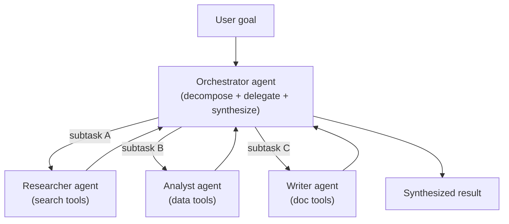
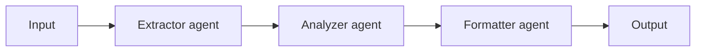
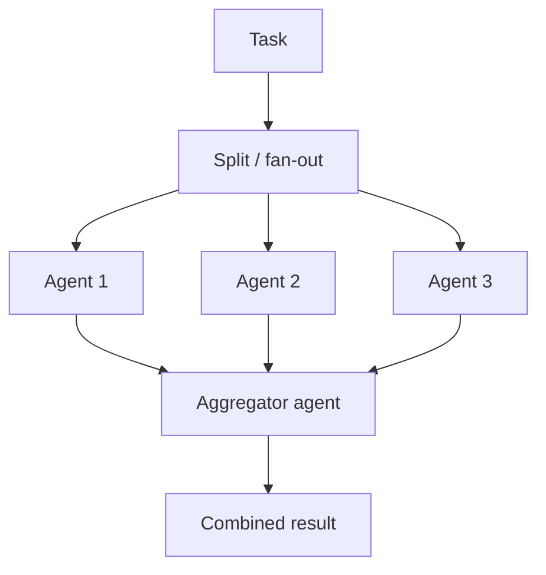
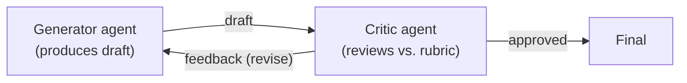
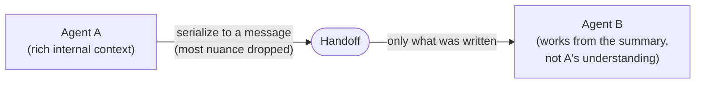

# Multi-agent architectures

## The problem it solves

A single [agent](34-agentic-systems.md) — one context window, one system prompt, one set of tools — is elegant until the job gets genuinely big, and then it hits a wall on several fronts at once. Ask one agent to "research three competitors, analyze our pricing against each, and draft a positioning memo" and you feel every ceiling: its **context window fills** with the raw dump of three research threads until the early findings fall out of view; its **tool list bloats** — search, spreadsheet, file-reader, email, chart-maker — until the model fumbles which tool to reach for; its **system prompt** has to be a jack-of-all-trades ("you are a researcher and an analyst and a writer") that does none of the three sharply; and everything runs **strictly one step at a time**, so three independent research jobs that could have happened at once instead queue up behind each other.

None of these is fixed by a smarter model. They're structural: one agent means one context, one persona, one attention budget, one thread of execution. **Multi-agent architectures** attack the problem by decomposition — split the work across several *specialized* agents, each with a focused prompt and only its relevant tools, and let them collaborate under some coordination. The bet is the same one organizations make when they stop being a one-person shop and hire a team: some jobs are done better by specialists who each own a slice than by one generalist doing everything.

## The one analogy to remember

**The picture:** a **restaurant kitchen during a dinner rush.** There's an **expediter** (often the head chef) at the pass who reads the incoming tickets, calls out what's needed, and routes each part to a station. The **line cooks** each own one station — grill, sauté, garde-manger (the cold/salad station), pastry — each with just the tools and ingredients for that station and deep skill at that one job. Nobody plates a dish alone; the expediter fires the components, the stations work in parallel, and the finished parts come back to the pass to be assembled into one plate.

**The mapping:** the expediter reading tickets and routing = the **orchestrator/supervisor agent**; each line cook at a station = a **specialist worker agent** (focused skill, only its own tools); a station's own knives and pans = that agent's **scoped tool set**; the grill and sauté running at the same time = **parallelism**; components handed back to the pass and assembled = the orchestrator **synthesizing** worker outputs into one result; a garbled or missing ticket = a **botched handoff** where information is lost between agents.

**Why it holds:** the reason a brigade beats one cook doing everything is exactly the reason to reach for multiple agents — **specialization plus separate workspaces plus a coordinator.** Each cook keeps a clean station (a clean context) and mastery of one job (a focused prompt and toolset), while the expediter holds the whole order together. And the analogy carries the cost honestly: a brigade only pays off at volume — for a single omelet, one cook is faster than staffing five stations and coordinating them.

**Say it like this:** "It's a kitchen brigade instead of one cook. A head chef routes each part of the order to a specialist station, they cook in parallel, and the parts come back to be plated together — you split the job across focused experts and one coordinator instead of asking one generalist to do all of it."

*Where it breaks:* real line cooks share a kitchen, glance at each other's stations, and build up shared understanding over a shift — they *learn*. Agents don't: each handoff passes only what's written on the ticket, so context is **lost or degraded at every boundary**, and every "cook" is a full agent that costs a full agent's tokens and time whether or not the order needed a brigade.

## Why more than one agent

Four forces push toward splitting a job across agents. They're worth naming separately because an interviewer will ask *which* one you're buying.

- **Specialization.** A focused agent — "you are a SQL (Structured Query Language) analyst; here are three database tools" — outperforms a generalist on its slice, for the same reason a tight [system prompt](../05-prompting/28-prompt-engineering.md) beats a sprawling one: fewer instructions competing for attention, fewer tools to confuse, a persona that commits. A single agent handed twenty tools starts mis-selecting among them; give five agents four tools each and each chooses cleanly.
- **Separate, clean context windows.** This is the most underrated reason. Each agent works in its *own* [context window](../01-foundations/05-context-windows.md), so a worker doing deep research isn't also carrying the whole task's history, the other workers' output, and the final drafting instructions. It sees only its subtask. The orchestrator gets back a compact *result*, not the worker's entire messy scratchpad — so the coordinator's context stays lean even though the total work was large. Multi-agent is partly a **context-management strategy**: it's how you tackle a job whose full working state would never fit in one window.
- **Parallelism.** Independent subtasks run at the same time instead of single-file. Three competitor research threads that don't depend on each other can fan out concurrently, cutting wall-clock latency roughly to the slowest branch instead of the sum. This is the one benefit a single agent structurally *cannot* offer.
- **Modularity and testability.** A specialist agent is a component with a defined input and output. You can evaluate the "researcher" in isolation, swap its model, or fix its prompt without touching the "writer." A monolithic agent is one tangled unit where every change risks everything.

## The common patterns

Multi-agent systems are combinations of a few basic shapes. Knowing the shapes — and when each fits — is the interview-grade knowledge.

**Orchestrator–worker (supervisor).** A lead agent owns the goal: it decomposes the task, delegates subtasks to specialist workers, and synthesizes their results into the final answer. The workers don't talk to each other; they report up. This is the most common and most general pattern, and it's what the kitchen analogy maps to.

Note that an orchestrator *uses* [planning and orchestration](36-planning-orchestration.md) to decide the subtasks and their order — but that step-sequencing machinery is lesson 36's topic. The multi-agent point here is the *structure*: distinct agents with their own contexts and tools, coordinated by a lead.

**Sequential pipeline.** Agent A's output is Agent B's input, in a fixed line — extract, then analyze, then format. Each stage is a specialist, and the handoff is one-directional. Cheaper and more predictable than an orchestrator (the path is fixed), but no parallelism and no adaptation: it's the assembly-line end of the spectrum.

**Parallel fan-out then aggregate.** Split one job into independent copies or slices, run them at once, then combine. Summarize twelve documents by giving each to its own agent and merging the summaries; or ask several agents the same question and vote/merge for robustness. This is where the latency win is largest, because the branches genuinely don't depend on each other.

**Generator↔critic (debate).** One agent produces, a second critiques against a rubric, the first revises — a loop that separates *doing* from *judging*. Splitting the roles helps because a fresh critic agent, with a clean context and a reviewer's prompt, catches errors the generator is blind to (it isn't invested in its own draft). Related setups run two agents in *debate* to surface a stronger answer. The cost is extra rounds; the risk is a loop that never converges, so you cap the rounds.

## Communication and handoffs — where the risk lives

Agents that can't share work aren't a system, just a pile. How they pass work is a real design axis, and it's also the single biggest source of multi-agent failure.

- **Message passing.** One agent sends another a structured message — a subtask request or a result. This is the delegation edge in orchestrator–worker. The failure: a vague or lossy message ("research the competitors") under-specifies the job and the worker guesses wrong.
- **Shared scratchpad / state.** Agents read and write a common workspace — a document, a [shared store](35-agent-memory.md) — that all can see. Good for keeping several agents aligned on evolving state, but it reintroduces the context-bloat and coordination problems the split was meant to solve if everyone dumps everything into it.
- **Structured handoffs.** The disciplined version of message passing: agents exchange defined, schema-shaped outputs (a filled-in field set, a typed object) rather than free prose, so the receiver knows exactly what it's getting.

The load-bearing truth: **context is lost or degraded at every handoff.** When the researcher hands the writer a three-line summary, everything the researcher *saw and reasoned about* but didn't write down is gone — the writer works from the summary, not the understanding. This is the flip side of the clean-context benefit: separate windows keep each agent lean *precisely because* they don't share the full picture, and the price is that nuance falls through the seams. Whatever isn't explicitly serialized into the handoff doesn't survive it.

## What a PM (product manager) must know about the tradeoffs

This is where interviews live, because multi-agent is the most over-reached-for pattern in the field. Be honest and be blunt.

- **Cost and latency multiply.** Each agent is a *full* agentic loop — its own chain of model calls over its own growing context. A five-agent system isn't 5× one call; it's five agents each doing many calls, plus the orchestrator's calls to delegate and synthesize. Token spend and dollar cost can balloon fast (see [cost/unit economics](../10-production-ops/51-cost-unit-economics.md)). Parallelism can cut *wall-clock* latency, but it never cuts *total tokens* — you're paying for all branches regardless.
- **Coordination overhead.** The orchestrator itself is work: decomposing the task, routing, and synthesizing are model calls that can go wrong, and a bad decomposition dooms everything downstream no matter how good the workers are.
- **Error propagation, now across agents.** [Compounding error](34-agentic-systems.md) — the multiplicative reliability drop across steps — doesn't go away when you add agents; it gets a new axis. A worker's mistake becomes the orchestrator's input, and a lossy handoff *is* an error, so errors now propagate *between* agents as well as within each one. Don't re-derive the 0.95ⁿ arithmetic here; the point is that more agents means more links, and every link can drop or distort.
- **Harder to debug and observe.** A failure can now hide in any agent or in the seams between them. Nondeterministic paths across several agents are far harder to trace than one agent's loop, and reproducing a failure is worse.
- **Wider attack surface.** More agents reading each other's outputs means more places a [prompt injection](../08-safety-trust/42-ai-security.md) can enter and propagate — a compromised worker can feed poisoned content to the orchestrator, which trusts it.

**The blunt truth to say out loud: most tasks do not need multi-agent.** A single well-designed agent with a clean, focused tool set usually wins on cost, latency, and debuggability. Multi-agent earns its keep in three specific situations, and you should be able to name them: when subtasks are **genuinely parallelizable** (independent branches, so the latency win is real), when the work is **cleanly separable into distinct specialties** (so specialization and clean contexts pay off), or when **a single context window simply can't hold the whole job** (so decomposition is the only way to fit it). Absent one of those, adding agents adds cost and failure modes to buy nothing.

## Summary / Points to Remember

- A single agent hits ceilings on big work: **context bloat, tool confusion, a jack-of-all-trades prompt, and no parallelism.** Multi-agent decomposes the job across **specialized agents** — each a focused prompt with only its relevant tools — under some coordination.
- You reach for multiple agents to buy four things: **specialization, separate clean context windows, parallelism, and modularity/testability.** Separate contexts is the underrated one — multi-agent is partly a **context-management strategy** for jobs too big for one window.
- Learn the **shapes**: **orchestrator–worker** (a lead delegates to specialists and synthesizes — the general case), **sequential pipeline** (A→B→C, fixed and predictable), **parallel fan-out then aggregate** (the real latency win), and **generator↔critic/debate** (separate doing from judging).
- Agents collaborate via **message passing, a shared scratchpad, or structured handoffs** — and **context is lost or degraded at every handoff.** Whatever isn't serialized into the message doesn't survive; that's the flip side of clean separate contexts.
- Honest tradeoffs: **cost and total tokens multiply** (each agent is a full loop; parallelism cuts wall-clock, not tokens), **coordination overhead**, **[error propagation across agents](34-agentic-systems.md)**, **harder debugging/observability**, and a **wider [injection surface](../08-safety-trust/42-ai-security.md)**.
- The framing that separates a strong answer from a buzzword answer: **most tasks don't need multi-agent — a single well-designed agent usually wins.** Multi-agent earns its keep only for **genuinely parallelizable** work, **cleanly separable specialties**, or **a job too big for one context window.**

## Interview Questions That Stump People

**Q (clarify-back): "We want to build a multi-agent system for our support workflow. How would you design it?"**

**Interviewer:** Leadership loves the idea of a team of agents for customer support. How would you architect the agents?

**You (clarify back):** Before I design agents — is any part of this workflow actually parallel or cleanly separable into distinct specialties, or is it mostly one linear conversation with a user that sometimes needs a lookup? Because that decides whether multi-agent buys us anything at all.

**Interviewer:** Honestly it's mostly a single conversation — understand the issue, look something up, sometimes escalate.

**You:** Then I'd push back on multi-agent for this. That's a single-thread task with a couple of tool calls — a linear path, not independent branches and not distinct specialties running at once. A single well-designed agent with a focused tool set (knowledge lookup, ticket actions, an escalation tool) would be cheaper, lower-latency, and far easier to debug than a team of agents handing context back and forth — and every handoff between agents loses context and adds a failure point. My rule is that multi-agent earns its keep only in three cases: genuinely parallelizable subtasks, cleanly separable specialties, or a job too big for one context window. Support triage is none of those. Where I *would* consider a second agent is a narrow, separable slice — say a critic agent that reviews a drafted response against policy before it's sent — because that's a distinct job with a clean input. But "a team of agents" as the default architecture would add cost and failure modes to buy nothing here.

> [!TIP]
> **Why this works:** The prompt smuggles in the conclusion ("build multi-agent") and the trap is to start drawing agent boxes. The strong move is to test the task against the three conditions that justify multi-agent *before* designing anything — and to recommend a single agent when none of them hold. Knowing that multi-agent is usually the wrong default, and being able to name the narrow case where you'd still add one agent, is exactly the judgment that separates someone who's shipped these from someone repeating a trend.

---

**Q: "A single agent and a multi-agent system both have the same tools. Why would the multi-agent version ever do better?"**

**Interviewer:** If the tools are identical, what does splitting into multiple agents actually buy you? Isn't it the same capability?

**You:** Same tools, but not the same context or the same attention. Three things change. First, **specialization**: a single agent holding all the tools has to reason about which of many tools to use at every step, and it mis-selects more as the tool count grows; split them so each agent sees only its four relevant tools and each chooses cleanly, with a prompt focused on one job instead of straddling several. Second, **separate context windows**: one agent doing the whole task carries the entire history in one window until it bloats and early details fall out — whereas each specialist works in a clean window on its slice and reports back a compact result, so no single context has to hold everything. That's often the real reason it does better: the job simply didn't fit one window well. Third, **parallelism**: independent subtasks run at once, which a single agent structurally can't do. So it's not more capability per tool — it's better tool selection, cleaner contexts, and concurrency. And I'd add the caveat: if the task is small enough to fit one window and its tools are few, the single agent wins, because none of those three advantages is active and you'd just be paying coordination cost.

> [!TIP]
> **Why this answer works:** It refuses the framing that capability lives only in the tools, and locates the benefit in *context and attention* — tool-selection accuracy, clean per-agent windows, and concurrency — rather than a vague "specialization is good." Naming that the advantages vanish for a small task shows you understand *when* they apply, which is the difference between reciting benefits and reasoning about them.

---

**Q: "Your multi-agent system is somehow less reliable than the single agent it replaced. How is that possible?"**

**Interviewer:** We split a working single agent into an orchestrator and three workers, and end-to-end quality got *worse*. Explain that.

**You:** Two mechanisms, and they're the ones people forget when they add agents expecting an upgrade. First, **handoff loss**: when a worker hands its result up to the orchestrator, only what it serialized into that message survives — all the context it saw and reasoned about but didn't write down is gone. The orchestrator then synthesizes from thin summaries, not from the full picture, so nuance drops at every seam. A single agent never had those seams; it kept everything in one context. Second, **error propagation across more links**: you didn't remove compounding error, you added an axis to it — now a worker's mistake becomes the orchestrator's input, a bad decomposition dooms good workers, and each handoff is itself a place to drop or distort information. More agents means more links, and every link can fail. So splitting doesn't automatically help; it helps only when the task was genuinely parallel or separable enough that clean contexts and specialization outweigh the new coordination and handoff costs. If you split a task that was actually one coherent thread, you pay all the seams and gain none of the benefits — which is exactly how you end up *less* reliable.

> [!TIP]
> **Why this answer works:** It names the two failure modes unique to multi-agent — information loss at handoffs and error propagation across added links — instead of hand-waving "coordination is hard." Connecting it back to *why the split was wrong for this task* (a coherent thread has no parallelism or separability to exploit) shows you understand that multi-agent is a conditional win, not a free upgrade, which is the crux most people miss.

---

**Q (clarify-back): "Should we use one big context window with all the information, or a multi-agent system, for this analysis task?"**

**Interviewer:** We can either stuff everything into one long-context agent or split it across agents. Which way?

**You (clarify back):** What does the task's structure look like — is it a set of independent sub-analyses that could run separately and be combined, or one interdependent line of reasoning where every part needs to see every other part?

**Interviewer:** It's summarizing and comparing about forty separate documents, then writing one overview.

**You:** Then I'd lean multi-agent, specifically fan-out then aggregate. Forty independent documents is the textbook case: give each document (or a batch) to its own agent to summarize in a clean context, run them in parallel, then have an aggregator agent combine the summaries into the overview. Cramming all forty into one context window fights you on two fronts — the model's attention degrades over a very long context so middle documents get short-changed, and it's strictly sequential so you wait for the whole thing. The fan-out keeps each agent's context small and focused and cuts wall-clock latency to roughly the slowest branch. The one thing I'd watch is the aggregation step, because that's the handoff seam where cross-document nuance can get lost — so I'd make each summary carry the comparison-relevant details the final step needs, not just a generic gist.

> [!TIP]
> **Why this works:** "Big context vs. multi-agent" has no universal answer — it hinges on whether the work is independent slices or one interdependent thread, so answering immediately would be guessing. The clarify-back pins that down, and once "forty independent documents" is on the table, fan-out-then-aggregate follows directly. Naming the aggregation handoff as the risk shows you know the pattern's own weak point, not just when to reach for it.
