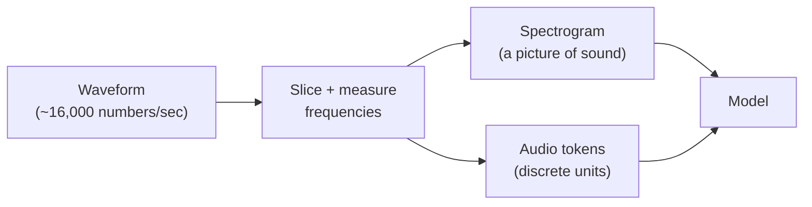
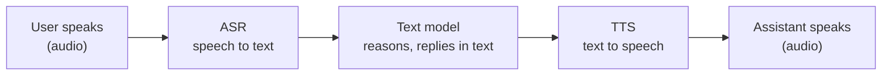
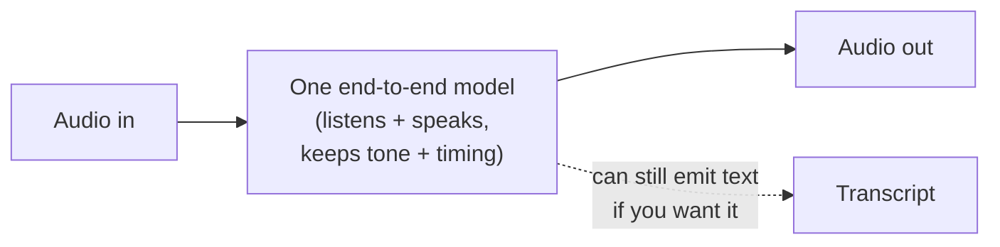

# Audio and Speech

## The problem it solves

A [transformer](../01-foundations/04-transformers.md) eats a sequence of discrete [tokens](../01-foundations/01-tokenization.md) — little integer symbols standing for chunks of text. Speech is nothing like that. It's a **waveform**: a continuous, wiggling curve of air-pressure changes over time, tens of thousands of numbers per second, with no natural boundaries between "words" and no symbols anywhere in sight. A one-second "hello" is ~16,000 raw numbers. You cannot feed that to a language model any more than you can feed it a photograph as-is.

So there's a translation problem in both directions. **Going in:** how do you turn a formless stream of pressure samples into something a model can consume — and do it fast enough that a conversation doesn't feel laggy? **Going out:** how do you turn the model's text back into a voice that sounds like a person rather than a 1990s GPS? And a subtler problem sits underneath both: the *words* are only part of what speech carries. Tone, emphasis, hesitation, sarcasm, urgency, who's-about-to-interrupt-whom — all of that lives in *how* something is said, not in the transcript. Any system that routes voice through text in the middle throws that layer away. This lesson is about how audio enters and leaves a model, and about the newer designs that try to stop throwing the "how" away.

## The one analogy to remember

**The picture:** a live jazz performance and three different musicians dealing with it. One musician sits in the audience and **transcribes it to sheet music** — writes down the notes as fast as she can. Another is a **session player who sight-reads that sheet** in a studio to reproduce the tune. A third **learned the song by ear** and just plays it back, feel and all, having never touched the notation.

**The mapping:** the live performance = the incoming **audio waveform**; transcribing it to sheet music = **ASR (automatic speech recognition)**, turning speech into text; the sheet music = the **text transcript**; the session player sight-reading it back into sound = **TTS (text-to-speech)**, turning text into speech; the *dynamics, swing, and emotion the sheet can't fully capture* = **prosody** (the melody, rhythm, stress, and emotion of speech — the "how it's said"); the by-ear musician who never writes anything down = an **end-to-end speech-to-speech model** that skips the text in the middle.

**Why it holds:** sheet music is a *lossy, discrete* encoding of a *continuous, expressive* performance — exactly what a text transcript is to speech. The notes survive; the feel mostly doesn't. That's the load-bearing insight of the whole lesson: **the moment you pass voice through text, you flatten it to the notes and drop the performance** — which is precisely why the by-ear approach (speech-to-speech) exists and why it preserves tone and enables natural back-and-forth.

**Say it like this:** "Old voice systems are like transcribing a song to sheet music and having someone sight-read it back — you keep the notes but lose the feel. The new ones learned the song by ear, so the emotion survives."

*Where it breaks:* a by-ear musician reliably reproduces what she heard; an end-to-end audio model can still *mishear* and confidently play the wrong tune (hallucinate words that were never spoken). And the analogy's tidy "notes on a page" undersells how audio actually enters a model — which is closer to a *picture* of the sound than a page of notes, as the next section shows.

## How sound gets into a model

You can't hand a model raw pressure samples, so audio gets pre-processed into something structured. There are two common representations, and knowing the difference is enough for a PM.

The classic one is a **spectrogram**: take the waveform in short overlapping slices (say every 10–25 milliseconds) and, for each slice, measure how much energy sits at each pitch/frequency. Stack those slices side by side and you get a 2-D image — time along one axis, frequency up the other, brightness = loudness. That's the crucial move: **a spectrogram turns sound into a picture.** Once audio is a picture, the model can process it with the same kind of machinery used for images — which is exactly why audio and [vision-language models](38-vision-language.md) are cousins rather than strangers.

> [!NOTE]
> **Spectrogram** — a visual map of a sound: horizontal axis is time, vertical axis is frequency (low pitches at the bottom, high at the top), and colour/brightness shows how loud each frequency is at each instant. It's the "visual score" of the audio. A vowel, a hiss, a piano chord each leave a distinct visual fingerprint, which is what makes the sound machine-readable.

The newer approach is **audio tokens**: a separate component learns to chop the audio into a fixed vocabulary of discrete units — a "codebook" of sound-pieces — so that a stretch of speech becomes a short sequence of symbols, just like text tokens. This lets one transformer treat audio and text as the *same kind of thing* (sequences of tokens it can both read and generate), which is what makes a single model able to listen and speak. (How discretization works in detail belongs to [tokenization](../01-foundations/01-tokenization.md); here, just hold the idea that audio *can* be turned into token-like units.)

Both routes exist to solve the same problem — get a continuous waveform into a form a sequence model can handle. Spectrograms dominate traditional ASR; audio tokens are what make unified listen-and-speak models possible. Keep this at overview depth: the interview point is *why* the conversion is necessary (models need structured, discrete-ish sequences, not raw pressure), not the signal-processing math.

## The two classic directions: ASR and TTS

For years, voice products were built as a pipeline of specialised parts.

**ASR (automatic speech recognition) = speech-to-text.** It takes the waveform (usually via a spectrogram), and outputs the words. This is the transcriber in the analogy. It's what powers dictation, call-centre transcripts, captions, and the "understanding" half of a voice assistant.

**TTS (text-to-speech) = text-to-speech.** It takes written text and synthesises an audio waveform of a voice reading it. This is the session player. It's the "speaking" half — screen readers, audiobook narration, the assistant's spoken reply.

Stitch them around a text model and you get the traditional voice assistant, a three-stage relay:

This modular design is easy to reason about and lets you swap parts — but notice the shape: **everything funnels through text in the middle.** By the time the user's audio reaches the model, it's just words; the frustration in their voice, the sarcasm, the trailing-off uncertainty — gone, flattened to the notes on the sheet. And each stage adds delay, because most of them wait for the previous stage to finish before starting.

## Skipping the text bottleneck: end-to-end speech-to-speech

The frontier design — the "realtime voice" models — collapses that relay into **one model that takes audio in and emits audio out**, without a text transcript as the mandatory middle step. This is the by-ear musician. It matters for three concrete reasons a PM should be able to recite.

**Lower latency.** The three-stage relay is largely sequential: transcribe, *then* think, *then* synthesise. A single model can start responding while it's still processing, and skips two hand-offs entirely. That's the difference between a reply that lands in a few hundred milliseconds — the range that feels like conversation — and one with an awkward beat of dead air. (This is a live case of the [iron triangle](../11-product-strategy/55-iron-triangle.md): latency is the constraint you're buying down.)

**It preserves prosody, tone, and emotion.** Because the audio never gets flattened to text, the model can *hear* that you sound anxious and answer gently, and it can *speak* with expression rather than reading flatly. The performance survives the round trip. It can also handle things a transcript can't represent at all — a sigh, a laugh, someone speaking two languages in one sentence.

**It enables natural turn-taking and barge-in.** Real conversation isn't strict ping-pong; people overlap, interrupt, and give little "mm-hm" signals. A streaming end-to-end model can listen *while* speaking and stop when you cut in — **barge-in**, the ability to interrupt the assistant mid-sentence and have it actually yield — which is nearly impossible when a rigid transcribe-then-speak pipeline is mid-utterance.

The tradeoff is honest: the modular pipeline is more *inspectable* (you can read the intermediate transcript, log it, run rules on it, swap a better ASR) and often cheaper per call, while the end-to-end model is more *natural* but more of a black box and harder to control and audit. This is not "new thing strictly better" — it's a genuine design choice, and which one fits belongs to the product lens in [multimodal products](40-multimodal-products.md).

## The tradeoffs a PM must own

**Latency has a budget, and it's tight.** Conversation feels natural only when replies come back fast; a delay that would be invisible in a chat UI is a painful silence in a voice UI. This is the single biggest reason teams move from a stitched pipeline toward streaming or end-to-end designs, and why "just add TTS to our chatbot" often disappoints.

**Streaming vs. batch is a real fork.** *Batch* ASR waits for the whole audio clip, then transcribes — fine for transcribing a recorded meeting, and usually more accurate because it can use the full context. *Streaming* ASR emits words as you speak — mandatory for live captions and voice assistants, but harder and a bit less accurate because it must commit to words before hearing what comes next. Choosing wrong (batching a live assistant, or streaming a bulk transcription job) is a classic design mistake.

**WER is the accuracy metric, and it fails unevenly.** **WER (word error rate)** is the standard ASR score: the percentage of words wrong — inserted, deleted, or substituted — versus a correct reference. A 5% WER means one word in twenty is off. The trap is treating a single headline WER as "the accuracy," because ASR degrades sharply in predictable places:

- **Accents and dialects** underrepresented in training data — a fairness issue, not just a quality one.
- **Background noise**, crosstalk, and poor microphones.
- **Domain jargon** — drug names, legal terms, product SKUs, people's names — words the model rarely saw.
- **Code-switching** — a speaker mixing two languages in one sentence (common globally), which many systems handle badly.

So the PM question is never "what's the WER?" but "what's the WER *for our users, in our conditions, on our vocabulary?*" An impressive benchmark number can hide a system that fails your actual customers.

**TTS naturalness and voice cloning carry a consent problem.** Modern TTS can sound strikingly human, and **voice cloning** — reproducing a specific person's voice from a short sample — is now easy. That's a feature (personalised or branded voices, accessibility) and a serious risk (impersonation, fraud, non-consensual deepfakes of a real person). Using someone's voice is a consent and biometric-data question, not just an engineering one — a voice is [personal, sensitive data](../08-safety-trust/43-privacy-pii.md), and cloning without permission is squarely a [responsible-AI](../08-safety-trust/44-responsible-ai.md) failure. Any product touching voice cloning needs explicit consent, provenance, and misuse safeguards designed in, not bolted on.

**Voice runs hot on cost and infrastructure.** Processing audio is heavier than processing text, and always-listening, low-latency voice at scale is a real [unit-economics](../10-production-ops/51-cost-unit-economics.md) commitment — worth naming before a "let's make it voice" decision sails through.

## Summary / Points to Remember

- Speech is a **continuous waveform**, not [tokens](../01-foundations/01-tokenization.md); the core job is converting it — going in via a **spectrogram** (a *picture* of sound, processed like an image, cousin to [vision-language models](38-vision-language.md)) or **audio tokens** (discrete units so one model can both read and generate audio), and coming out as synthesised voice.
- The two classic directions: **ASR (automatic speech recognition) = speech-to-text**, and **TTS (text-to-speech) = text-to-speech**. Stitched around a text model they make the traditional voice assistant — a **relay that funnels everything through text.**
- **The text bottleneck is the key idea:** routing voice through a transcript keeps the *words* but drops the *how* — tone, emotion, timing (**prosody**). Like transcribing a song to sheet music and sight-reading it back: you keep the notes, lose the feel.
- **End-to-end speech-to-speech** models skip the text middle-step. Why it matters, in three: **lower latency** (fewer sequential hand-offs), **preserved prosody/tone/emotion**, and **natural turn-taking / barge-in** (interrupting mid-sentence). The cost: less inspectable and controllable than a modular pipeline.
- **Latency is the tight budget** that drives voice architecture; **streaming vs. batch** is a real fork (live assistant needs streaming; bulk transcription wants batch and is more accurate).
- **WER (word error rate)** is the ASR metric, and it fails *unevenly* — accents, noise, domain jargon, code-switching. Ask for WER *on your users and vocabulary*, never a single headline number.
- **TTS + voice cloning** is powerful and dangerous: impersonation and deepfake risk make it a **consent, biometric-[privacy](../08-safety-trust/43-privacy-pii.md), and [responsible-AI](../08-safety-trust/44-responsible-ai.md)** issue, not just an engineering one.

## Interview Questions That Stump People

**Q (clarify-back): "We're adding voice to our chatbot. Do we just bolt on speech-to-text and text-to-speech, or use one of the new realtime voice models?"**

**Interviewer:** We already have a solid text chatbot. What's the right way to make it talk?

**You (clarify back):** Before I pick — is this a live, back-and-forth *conversation* where users expect to interrupt and get quick replies, or more of a read-it-aloud / dictation feature where a slight delay is fine? And do we need to log and run rules on a text transcript for compliance?

**Interviewer:** It's a live support assistant — people will interrupt it and expect it to feel like talking to a person. Compliance does want transcripts, though.

**You:** Then it's a genuine tension. The "feel like a person" requirement pushes toward an end-to-end speech-to-speech model: bolting ASR and TTS around the text bot creates a three-stage relay whose latency and rigid turn-taking will feel robotic, and it can't do barge-in — letting the user interrupt mid-sentence — well. But the compliance need for transcripts pulls the other way, toward the modular pipeline where the text is right there to log. My recommendation would be the end-to-end model *if* it can also emit a transcript as a side output — most realtime designs can — so we get natural conversation and an auditable record. If it can't, I'd weigh whether conversational feel or clean transcripts matters more here, rather than pretending we can max both. The thing I'd refuse to do is quietly ship the stitched pipeline and call it "voice" — it'll test fine in a demo and frustrate real users the moment they try to interrupt it.

> [!TIP]
> **Why this works:** The question hides two independent variables — conversational latency needs and transcript/compliance needs — that pull toward *opposite* architectures, so an instant answer would miss the real tradeoff. Clarifying surfaces both. The strong answer names the specific failure of the naive "just bolt on ASR+TTS" move (latency, no barge-in), and resolves the tension with the concrete detail that end-to-end models can usually still emit a transcript — showing you've actually reasoned about the design, not just heard "realtime voice is better."

---

**Q: "Our ASR vendor advertises 4% word error rate, but users keep complaining it mishears them. How is that possible?"**

**Interviewer:** The benchmark says 96% accurate. Users say it's terrible. Explain.

**You:** A single WER number is an *average over some test set*, and it hides exactly the cases that matter. WER fails unevenly: it spikes on accents and dialects that were underrepresented in training, on background noise and bad microphones, on domain-specific jargon the model rarely saw — our product names, technical terms, people's names — and on code-switching, where someone mixes two languages in a sentence. So 4% on a clean, native-accent, general-vocabulary benchmark can easily be 20%+ for our actual users in their actual conditions, and *those* errors cluster on the highest-value words — the proper noun or the product name, not the "the" and "and." The fix isn't to chase a vendor with a shinier headline number; it's to measure WER on *our* audio — our users' accents, our noise profile, our vocabulary — and to consider domain adaptation for the jargon. The mistake baked into the question is treating one benchmark number as "the accuracy" when accuracy is a distribution.

> [!TIP]
> **Why this answer works:** It refuses the framing that WER is a single scalar and names the specific, predictable places ASR degrades — which demonstrates you understand the metric rather than reciting it. The sharp add is noticing that errors *cluster on high-value words*, so a low average can still wreck the user experience. Prescribing "measure on our own data" over "find a better benchmark" is the operator's instinct interviewers are listening for.

---

**Q: "Why not always use the end-to-end speech-to-speech model? If it's lower latency and sounds better, isn't the old ASR-then-TTS pipeline just obsolete?"**

**Interviewer:** The realtime voice models win on latency and naturalness. Why would anyone keep the old pipeline?

**You:** Because "sounds better" isn't the only axis, and the pipeline wins on the ones that don't show up in a demo. The modular design is *inspectable*: there's a real text transcript in the middle you can log, audit, run guardrails and redaction on, and hand to compliance — the end-to-end model's reasoning is more of a black box. It's also *controllable and swappable*: you can replace just the ASR with a better one, or tune the TTS voice, without retraining a monolith. And it's often *cheaper* per call and easier to reason about when something goes wrong. The end-to-end model buys naturalness and latency at the price of transparency and control. So the honest framing is a tradeoff, not an upgrade: use end-to-end where natural, fast conversation is the product — a live voice assistant — and keep the pipeline where you need auditable transcripts, tight control, or lower cost, like bulk transcription or a regulated workflow. Declaring the pipeline obsolete is the giveaway that someone's optimizing for the demo, not the operational reality.

> [!TIP]
> **Why this answer works:** It resists the "newer = strictly better" trap by naming what the older design is actually *good at* — inspectability, control, swappability, cost — none of which surface in a naturalness demo. Framing it as a tradeoff mapped to use cases (conversation vs. auditable/bulk) shows product judgment, and the closing line signals you can tell a genuine advance from hype.

---

**Q: "A big client wants us to clone their CEO's voice for automated announcements. It's their own executive — so it's fine, right?"**

**Interviewer:** It's the client's own CEO, and they're asking for it. Any concern, or do we just build it?

**You:** The consent of *the client* isn't the same as the consent of *the person whose voice it is*, and even with the CEO's own sign-off there's more to it. A voice is biometric, personal data — cloning it is a privacy and consent matter, so first I'd want the CEO's explicit, documented consent, not just the company's. Then the bigger risk is downstream: a convincing clone of a named executive is a fraud and impersonation weapon — think a faked "CEO" voice authorizing a wire transfer or making a market-moving statement. So even for a legitimate use I'd insist on safeguards: strict access controls on who can generate speech with that voice, provenance or watermarking so synthetic audio is identifiable, clear disclosure that announcements are AI-generated, and limits on what the cloned voice can be made to say. This is squarely a responsible-AI and privacy decision, not a pure build request. "It's their own CEO" removes one objection but not the impersonation risk, and I wouldn't ship it without the consent trail and misuse controls in place.

> [!TIP]
> **Why this answer works:** It separates two different consents — the corporate client's and the individual's — which is the distinction the question deliberately blurs. Then it elevates from "is this allowed?" to "how is this misused?", naming the concrete threat (voice-authorized fraud, deepfake impersonation) and prescribing real controls (consent trail, access control, provenance, disclosure). That shows you treat voice as sensitive biometric data and think about blast radius, which is exactly the responsible-AI maturity the question is probing.
