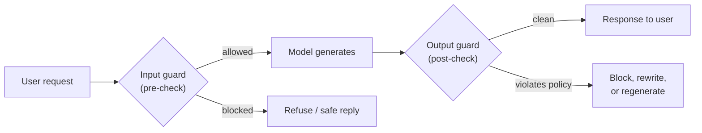
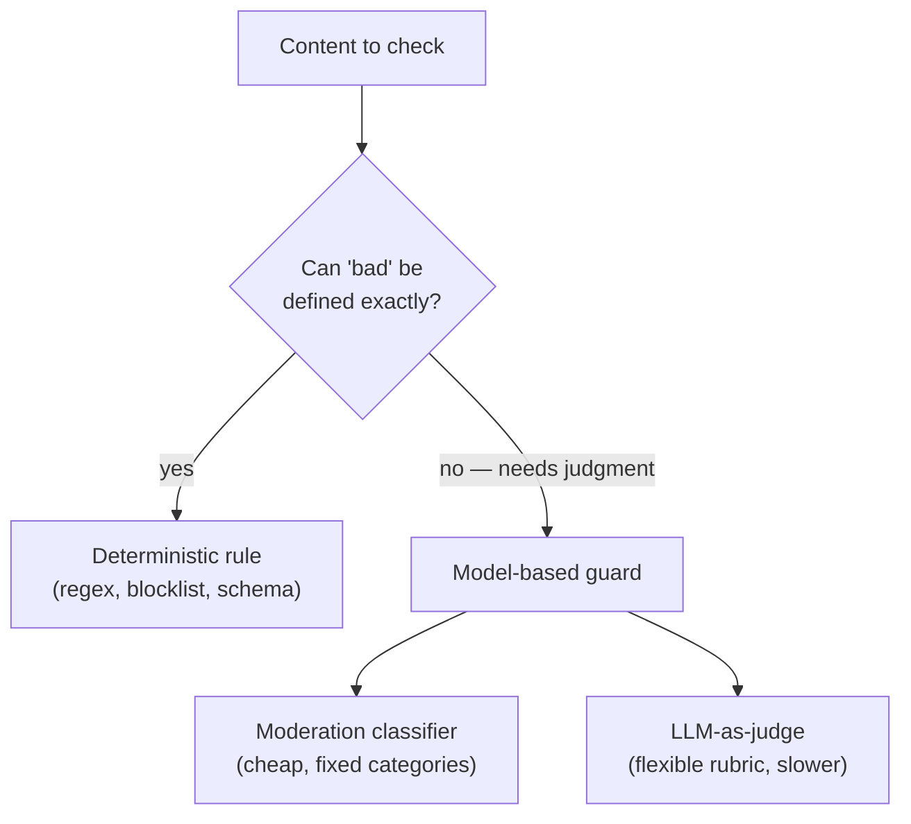
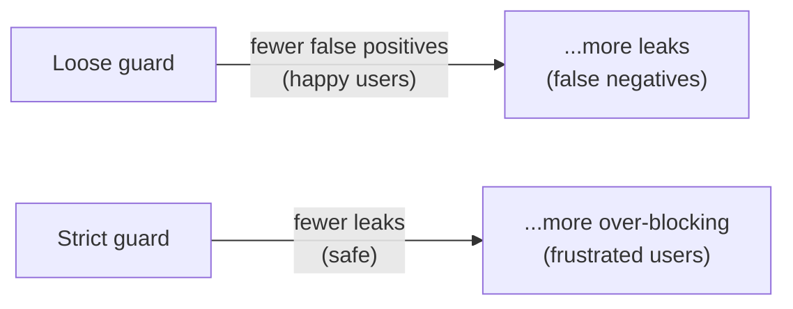

# Guardrails

## The problem it solves

You ship a customer-support assistant built on a large language model (LLM — the neural network that generates text one token at a time). It works beautifully in the demo. Then real users arrive. Someone asks it for medical dosing advice and it obliges. Someone gets it to recommend a competitor. Someone coaxes it into repeating a slur. Someone's question makes it return a paragraph of prose when your UI expected a clean list of order IDs, and the page breaks. None of these are bugs in the usual sense — the model did exactly what a model does: it produced a plausible continuation of the text. The trouble is that "plausible text" and "text my business can safely put in front of a customer" are not the same thing.

Here is the uncomfortable part: **you cannot fully fix this inside the model.** You can align it, you can prompt it carefully, you can fine-tune it — and it will still, some fraction of the time, generate something off-policy, because a probabilistic text generator has no hard "never do this" switch. Its behavior is a tendency, not a guarantee. A business that has to answer to regulators, brand managers, and lawyers cannot run on a tendency.

**Guardrails** are the answer to that gap. A guardrail is a control that sits *outside* the model — in the surrounding software — and inspects what goes in and what comes out at runtime, enforcing rules the model itself can only be nudged toward. It is the operational layer that turns "the model usually behaves" into "the system is not allowed to misbehave in these specific ways." This is the opening lesson of the safety and trust category, and the framing to hold onto is that safety is a *layered system*, not a single feature: guardrails (this lesson), [AI security](42-ai-security.md), [privacy and PII handling](43-privacy-pii.md), and [responsible AI](44-responsible-ai.md) are four different layers that do different jobs. Guardrails are the runtime behavior-control layer.

## The one analogy to remember

**The picture:** a nightclub with a bouncer at the door on the way in and a coat-check clerk who inspects you on the way out. The bouncer decides who gets in; the clerk makes sure nobody leaves carrying something they shouldn't. Neither one is the club — they're staff posted at the thresholds, working from an explicit list of rules, regardless of what happens on the dance floor.

**The mapping:** the door bouncer = the **input guard** (checks the user's request before it reaches the model); the club interior = the **model doing its thing**; the coat-check clerk inspecting you on exit = the **output guard** (checks the model's response before it reaches the user); the printed rules both staff work from = your **policies** (deterministic rules or a moderation classifier); turning someone away or confiscating an item = **blocking or rewriting** the message.

**Why it holds:** the load-bearing point is that the bouncer and clerk are *separate from the club and posted at the thresholds*. That is precisely why guardrails work when in-model alignment isn't enough — they're an independent checkpoint at the boundary, not a hope about how the club behaves inside. You can change the rules on the door without renovating the club, exactly as you can update a guardrail without retraining the model.

**Say it like this:** "Guardrails are the bouncer and the coat-check for your AI — one checks requests on the way in, one checks answers on the way out, both enforcing rules the model itself can't be trusted to always follow."

*Where it breaks:* a bouncer sees the whole person at once; a guardrail sees only text and can be fooled by cleverly disguised content, so it catches the obvious and misses the subtle — real guards have judgment a classifier doesn't.

## Where guardrails sit: the request flow

The core architecture is simple and worth being able to draw. A user's request does not go straight to the model and the model's answer does not go straight to the user. Two checkpoints bracket the model.

The **input guard** (pre-check) runs *before* the model. Its jobs: catch disallowed requests early (self-harm, illegal instructions, requests obviously outside your product's domain), and cheaply reject things you'd rather not spend a model call on. Stopping a bad request here is faster and cheaper than generating a response and then throwing it away.

The **output guard** (post-check) runs *after* the model, on the generated text, before the user sees it. Its jobs: catch policy-violating content the model produced anyway, enforce the *shape* of the output (valid format, no leaked internal data), and either block, rewrite, or send the response back to be regenerated. The output guard matters more than beginners expect, because the model's output is the part you actually can't predict — the input guard can't know what the model will say.

> [!NOTE]
> **Runtime vs. training time.** "Runtime" (also called inference time) means *while the deployed system is handling a live request* — as opposed to training time, when the model's weights are being learned. Guardrails are a runtime control: they act on each request as it happens and change nothing about the model itself. That's the whole point — they work on a model you can't or won't retrain.

## Two ways to build a guard: rules vs. models

A guardrail's decision logic comes in two flavors, and knowing when to reach for each is the practical core of the topic.

**Deterministic rules** are plain code: regular-expression pattern matches, keyword blocklists, allowlists, length limits, schema checks. If the output must be one of five order statuses, a rule that rejects anything else is exact, instant, free, and perfectly predictable. Deterministic rules are the right tool whenever "off-policy" can be defined precisely.

**Model-based guards** use a second model to judge the content — because most of what you want to catch *can't* be pin-pointed by a keyword. "Is this response toxic?", "Is this question off-topic for a banking assistant?", "Does this answer give medical advice?" are judgments, not pattern matches. Two common forms:

- A **moderation classifier** — a smaller, purpose-built model that scores text across categories like hate, violence, or sexual content. Fast and cheap relative to a full generation.
- An **LLM-as-judge guard** — a general LLM given a rubric prompt ("Does the following reply stay within retail-support topics? Answer yes or no and why"). Flexible enough to encode nuanced policy, but it's another full model call, so it adds real latency and cost, and — being an LLM — it is itself fallible.

The design instinct to carry: **use a rule when you can define the rule; use a model-based guard when the judgment is fuzzy.** Reaching for an expensive LLM-judge to enforce something a regex would nail is a common and costly mistake, and stacking a rule in front of a model guard (rule catches the obvious cheaply, model handles the rest) is a standard, sensible pattern.

## What guardrails actually enforce

The same architecture is applied to several distinct jobs. A product manager (PM — the person owning what the product should do) should be able to name these as separate concerns:

- **Content moderation.** Block or refuse toxic, hateful, violent, or sexual content — in the user's input *and* the model's output. This is the archetypal guardrail.
- **Topic / scope restriction.** Keep the assistant on your domain. A bank's assistant should decline to write poetry or opine on elections, not because those are unsafe in the abstract but because they're off-brand and off-mission. This is usually an input guard ("is this question in scope?") backed by an output check.
- **Output validation / format enforcement.** Ensure the response has the shape the downstream system needs — valid against a schema, no forbidden fields, within length. The *mechanism* for producing structured output is its own topic ([structured outputs](../03-reasoning-generation/20-structured-outputs.md)); here the point is narrower — a guard that *rejects or repairs* an output that fails validation, as a safety check.
- **Blocking unsafe actions.** When the model can trigger real-world effects through [tool calling](../06-agents/32-tool-calling.md) or as part of an [agentic system](../06-agents/34-agentic-systems.md), a guardrail can gate the *action* — require confirmation before sending money, refuse a delete outside a safe scope. Constraining what the system can *do* matters even more than constraining what it says.
- **PII redaction (one guard among many).** A guard can strip personally identifiable information (PII — data that identifies a person, like a name, email, or card number) from inputs or outputs. It exists as a guard *type*, but the full privacy lifecycle — consent, retention, compliance — is a separate discipline covered in [privacy and PII](43-privacy-pii.md).

Note what guardrails are *not* here. They constrain behavior; they do not improve the model. A guard that blocks a wrong answer prevents harm but doesn't make the model correct — [hallucination](../03-reasoning-generation/19-hallucination.md) is reduced at the source by [grounding and citations](../04-retrieval-knowledge/27-grounding-citations.md), not by a bouncer. Confusing "we blocked the bad output" with "we fixed the model" is a category error.

## The tradeoffs a PM has to own

Guardrails are not free, and their failure modes are specific.

**Latency and cost.** Every guard is extra work on the request path. A deterministic rule is negligible, but each model-based guard is another inference call — an input classifier plus an output judge can mean three model calls where you thought you had one, adding latency the user feels and cost you pay per request. More safety, slower and pricier product; that's the trade.

**False positives vs. false negatives — the central tension.** A guard tuned strict *over-blocks*: it refuses legitimate requests and frustrates real users (false positives). A guard tuned loose *lets things through*: unsafe content leaks to the user (false negatives). You cannot maximize both at once — tightening one loosens the other. The right setting is a business judgment about which error is more costly in *this* product. A children's education app should over-block; an internal developer tool for adults should lean permissive so it doesn't nag.

**Guardrails can't catch everything.** A classifier trained on known-bad patterns misses novel or cleverly disguised content. This is why the professional stance is **defense in depth** — layered guards plus in-model alignment plus monitoring — on the assumption that any single layer will sometimes fail. No single guardrail is a wall; they're a series of nets.

**They constrain behavior, they don't fix the model.** Worth repeating because it's the most common misconception: a guardrail is a boundary around a model whose underlying tendencies are unchanged. If your model is prone to a bad behavior, a guard reduces how often that behavior reaches users; it does not make the model good.

One more scoping note so the mental map stays clean: making a guardrail *survive an adversary who is actively trying to defeat it* — [prompt injection](42-ai-security.md), jailbreaks — is the domain of AI security, not guardrails-as-a-topic. Guardrails are about *policy enforcement on ordinary traffic*; security is about *withstanding attackers*. Related, layered, but distinct.

## Summary / Points to Remember

- A model is a probabilistic text generator with no hard "never" switch, so its good behavior is a tendency, not a guarantee. **Guardrails are the runtime control layer outside the model that enforces the rules the model can only be nudged toward.**
- The architecture is two checkpoints bracketing the model: an **input guard (pre-check)** before generation and an **output guard (post-check)** after it — the bouncer and the coat-check. The output guard matters most, because the model's output is the unpredictable part.
- Guards come in two flavors: **deterministic rules** (regex, blocklists, schema — exact, instant, free) and **model-based guards** (moderation classifiers, LLM-as-judge — for fuzzy judgments, at real latency and cost). Rule of thumb: **use a rule when you can define the rule; use a model when the judgment is fuzzy.**
- Same architecture, several jobs: content moderation, topic/scope restriction, output validation, blocking unsafe actions, and PII redaction as one guard type.
- The central tradeoff is **false positives (over-blocking, frustrated users) vs. false negatives (leaks, unsafe content)** — you can't minimize both; where you set it is a business call about which error costs more here.
- Guardrails **constrain behavior; they don't fix the model.** No single guard catches everything, so the posture is **defense in depth**. Guarding against active attackers is [security](42-ai-security.md), not guardrails.

## Interview Questions That Stump People

**Q: "If the model is aligned and well-prompted, why bother with a separate guardrail layer at all — isn't that redundant?"**

**Interviewer:** We spent a lot on a well-aligned model with a careful system prompt. Do we really need guardrails on top?

**You:** They're not redundant because they operate on different guarantees. Alignment and prompting shift the model's *tendencies* — they make bad output less likely, but the model is still a probabilistic generator with no hard rule it's incapable of breaking, so "less likely" is the best they can offer. A guardrail is deterministic enforcement *outside* the model: it can flatly refuse to let a defined category of content reach the user, every time, regardless of what the model felt like generating. So the two layers do complementary jobs — alignment lowers the rate of bad output, guardrails put a hard boundary on the bad output that still gets generated. And there's an operational reason too: I can update a guardrail the moment a new policy lands, without a retraining cycle. Betting the whole business on the model behaving is betting on a tendency; the guardrail is the part I can actually promise a regulator.

> [!TIP]
> **Why this answer works:** The trap is treating alignment and guardrails as two attempts at the same goal, so one looks redundant. The strong move is to distinguish *probabilistic tendency* (what alignment gives you) from *deterministic enforcement* (what a guardrail gives you) and note they compose as defense in depth. Mentioning the update-without-retraining point signals you understand guardrails as an operational lever, not just a technical one.

---

**Q (clarify-back): "Would you use a rule-based guard or a model-based one for this?"**

**Interviewer:** We need to stop our assistant from producing off-policy content. Rules or a model-based guard?

**You (clarify back):** Depends on what "off-policy" means precisely here — can you define the bad output as an exact pattern, like a fixed set of allowed values or a forbidden word list, or is it a judgment call like "too aggressive in tone" or "off-topic"?

**Interviewer:** It's the second kind — we want it to stay on retail-support topics and not wander into, say, giving financial advice.

**You:** Then a rule won't carry it — "on-topic" isn't something a keyword list captures, and you'll either over-block or leak. I'd use a model-based guard: either a moderation-style classifier if there's a good off-the-shelf category, or more likely an LLM-as-judge with a short rubric describing what's in scope. I'd accept that it's another model call with latency and cost, and I'd put a cheap deterministic pre-filter in front of it to catch the obvious cases for free so the judge only runs when needed. If the requirement had instead been "output must be one of five statuses," I'd have gone the opposite way — a schema rule, no model call at all.

> [!TIP]
> **Why this works:** "Rules or model?" has no universal answer — it hinges entirely on whether the target can be defined exactly, and answering before establishing that exposes you as reciting a preference. The clarify-back pins down the one variable that decides it. Showing that the answer flips to a rule under the other condition proves you're applying a principle, not defaulting to the fancier option.

---

**Q: "Your guardrail is blocking too many legitimate requests and users are complaining. Do you just loosen it?"**

**Interviewer:** Support is flooded with 'why won't it answer me' tickets. The guard's too aggressive. Loosen it?

**You:** Loosening is one lever, but I wouldn't pull it blind, because false positives and false negatives trade off against each other — every notch I loosen to stop over-blocking also lets more genuinely unsafe content through. So first I'd look at *what* is being wrongly blocked. If it's a specific benign pattern the guard misreads, the fix is precision — a targeted allowlist or a better classifier — not a global loosening, because that improves false positives without paying in false negatives. Only if the guard is just set too conservatively across the board would I move the threshold, and then I'd decide the new setting from which error is more expensive in this product: for a consumer retail tool, over-blocking is a real revenue and trust cost, so I'd lean more permissive; for something regulated or aimed at kids, I'd eat the friction and stay strict. The point is the threshold is a business decision about relative harm, not a knob you turn until the complaints stop.

> [!TIP]
> **Why this answer works:** The naive answer treats over-blocking as a bug to be turned off, ignoring that loosening directly raises the leak rate. The strong answer separates *improving the guard's precision* (a free win) from *moving the threshold* (a genuine tradeoff), and frames the threshold as a harm-cost judgment specific to the product. That's the reasoning that shows you understand the false-positive/false-negative tension rather than just naming it.

---

**Q: "We added output guards and leadership now says the product is 'safe.' Are they right?"**

**Interviewer:** We've got moderation on inputs and outputs. Can I tell the board we've solved safety?

**You:** I'd push back on the word "solved." Guardrails reduce the rate at which specific, known categories of bad output reach users — that's real and worth reporting — but they don't make the system safe in any absolute sense, for two reasons. First, no guard catches everything: a classifier only knows the patterns it was built for, so novel or subtly-phrased content slips past, which is exactly why the discipline is defense in depth rather than one wall. Second, and more fundamental, a guardrail constrains behavior; it doesn't fix the model — the underlying tendencies are unchanged, we've just put a boundary around them. And "safe" is broader than guardrails anyway: it also spans security against active attackers, privacy and data handling, and fairness — separate layers with their own work. So the honest report is "we've meaningfully lowered the risk of these named failure modes and we monitor for the rest," not "we're safe." Claiming safety is solved is how you get blindsided by the failure mode you didn't guard for.

> [!TIP]
> **Why this answer works:** The trap is accepting a binary "safe / not safe" frame and taking the win. The strong move is to reframe safety as ongoing risk reduction across layers, and to name the two hard limits — guards miss the unknown, and they don't change the model — plus the fact that safety spans more than guardrails. It signals maturity: you resist overclaiming to leadership, which is exactly the judgment that prevents a public failure.

---

**Q: "For an agent that can take real actions, where would you focus your guardrails — the inputs, the outputs, or somewhere else?"**

**Interviewer:** It's not just chat — the agent can send emails and issue refunds. Where do the guardrails go?

**You:** With an agent, the center of gravity shifts from *what it says* to *what it does*, so the highest-value guard isn't on the text at all — it's on the actions. I'd gate the tools by blast radius: read-only actions can run freely, but anything irreversible or costly — sending an external message, moving money, deleting data — goes behind a guardrail that requires confirmation or a hard scope limit, so even a model that decides to do the wrong thing can't execute it. I'd still keep input and output content guards, but I'd treat the action layer as primary because that's where real-world harm happens. And the failure surface is wider than plain chat: an agent loops and reads tool results, so a guard that caps steps and one that treats retrieved content as untrusted both matter — though the adversarial side of that is really [security](42-ai-security.md). The mental model is that autonomy amplifies blast radius, so the guardrails belong in the execution layer, not just on the words.

> [!TIP]
> **Why this answer works:** Most people answer "input and output" reflexively, which is the chat-app mental model. The strong move is to recognize that an agent's harm comes from *actions*, so the guardrail focus moves to gating tools by reversibility and cost — the point covered in [agentic systems](../06-agents/34-agentic-systems.md). Scaling the guard to blast radius, rather than trying to guard all actions equally, is the judgment that shows you've thought about agents doing real damage, not just saying bad words.
