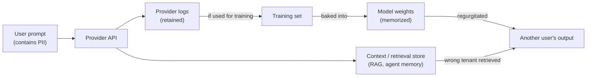
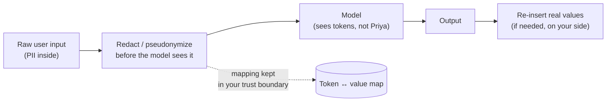

# Privacy and PII

## The problem it solves

A user pastes into your chatbot: "My name is Priya Sharma, my account number is 4471-9920, and I was charged twice." That single message now contains three pieces of **personally identifiable information (PII)** — information that can single out a real person: name, account number, and the fact that Priya is your customer. In a normal database you know exactly where that data lives, who can read it, and how to delete it when Priya asks. With a **large language model (LLM)** — the kind of AI that generates text by predicting the next word — you suddenly *don't*. The message travels to a third-party provider's servers. It may be written to logs. It may be retained for months. It may, depending on your contract, become training data that gets baked into the next model's weights — the billions of numbers that encode what the model "knows." And once it's in the weights, there is no row to delete.

That is the whole problem. LLMs create **new paths for personal data to leak that traditional software doesn't have** — and they collide head-on with laws like the **GDPR (General Data Protection Regulation**, the European Union's data-protection law) that grant people the right to have their data deleted. A PM (product manager) who treats privacy as a compliance checkbox to bolt on at launch discovers, too late, that the personal data is already scattered across logs, retrieval stores, and possibly a frozen model, with no clean way to pull it back. Privacy with LLMs is a *design constraint you decide up front*, because the leak paths are architectural, not cosmetic.

## The one analogy to remember

**The picture:** you whisper a secret to a friend who has a *perfect, permanent memory* and who also happens to gossip. You can't un-tell them. Later, at a party, someone asks them an unrelated question and — without meaning to betray you — they blurt out your secret because it's just *there* in their head, wired into everything else they know.

**The mapping:** the secret you whisper = a user's PII in a prompt; the friend's permanent memory = the model's **weights** once your data is trained into them; the party where it slips out = another user's session where the model **regurgitates memorized data**; "you can't un-tell them" = the near-impossibility of the **right to deletion** once data is in the weights.

**Why it holds:** training doesn't file your data in a labeled drawer it can later open and empty — it dissolves your data into the same tangle of numbers that stores everything else the model knows, which is exactly why you can neither guarantee it won't resurface nor cleanly delete it. The faithfulness is in the *irreversibility*: a whispered secret and a trained weight share the property that the telling can't be undone.

**Say it like this:** "Putting personal data into a model's training is like telling a secret to someone with a perfect memory who gossips — you can't take it back, and it might slip out to the wrong person later."

*Where it breaks:* a human friend can consciously choose to stay quiet; a model has no intent and no discretion — it doesn't "decide" to leak, the leak is a statistical accident, which makes it both less malicious and less controllable than a gossipy friend.

## What actually counts as PII (and why the line moves)

PII is any information that can identify a specific person, either on its own or when combined with other data. The obvious cases — name, email, phone, government ID, credit card, home address — are only half of it. The subtler and more dangerous category is **quasi-identifiers**: individually harmless fields that *together* pinpoint someone. The classic result is that date of birth, gender, and ZIP code together uniquely identify a large share of a country's population — none is "PII" alone, but combined they are. This is why "we stripped the names, so it's anonymous" is usually wrong.

Two more distinctions a PM should carry:

- **Sensitive / special-category data** — health, race, religion, sexual orientation, biometrics, political views. Regulators treat these more strictly; leaking them causes disproportionate harm.
- **Anonymized vs. pseudonymized.** *Anonymized* means the link to the person is irreversibly severed (truly no longer PII). *Pseudonymized* means the identifier is replaced with a token (Priya Sharma → USER_8842) but a mapping still exists somewhere to reverse it — so it is *still* regulated PII, just safer in transit. Confusing the two is a common and costly mistake.

## The leak paths that are unique to LLMs

Ordinary apps leak data through breaches and bad access controls — LLMs have all of that *plus* a set of leak paths that come from how models are built and operated. Here is the lifecycle where personal data can escape:

Walk the four distinct hazards:

1. **Training-data memorization.** Models don't just learn patterns — they can memorize and later reproduce specific strings from their training data verbatim, especially data that appeared often or is unusual (a full name next to a phone number). If your users' data becomes training data, a *different* user can, in principle, prompt the model into surfacing it. This is the leak the analogy is about. (How data becomes weights is [pretraining/post-training](../01-foundations/06-pretraining-vs-posttraining.md) and [fine-tuning](../02-model-behavior-training/07-fine-tuning.md) — don't conflate the leak with the mechanism.)

2. **Prompts and outputs logged — and possibly trained on.** Everything you send to a hosted model can be logged by the provider for abuse-monitoring, debugging, or quality. The critical question is the *contract*: does the provider retain it, for how long, and are they allowed to *train* on it? Consumer chatbot tiers have historically trained on user input by default; enterprise API tiers typically do not — but you must verify, not assume.

3. **Personal data sitting in retrieval stores and context.** With [retrieval-augmented generation (RAG)](../04-retrieval-knowledge/21-rag.md) or [agent memory](../06-agents/35-agent-memory.md), you deliberately store user data (documents, past conversations) to feed back into the model later. That store is now a PII database with all the usual obligations — plus it feeds a model.

4. **Cross-user / cross-tenant leakage.** In a multi-customer product, a bug in the retrieval filter or a shared cache can surface Tenant A's data in Tenant B's session. This is an *accidental* leak from a design flaw — distinct from an attacker deliberately extracting data, which is [AI security](42-ai-security.md)'s territory. Your lane is the accident and the compliance fallout; theirs is the adversary.

> [!NOTE]
> **Multi-tenancy** — one software instance serving many separate customers ("tenants") whose data must stay isolated from each other. In LLM apps the isolation has to hold not just in the database but in what gets retrieved into a prompt and what gets cached — new places for the wall between tenants to crack.

## The mitigations, from cheapest to hardest

The governing principle is **data minimization**: the safest personal data is the data you never collected or sent. Everything else is damage control layered on top.

- **Minimize.** Don't ask for, don't send, don't store personal data the task doesn't need. A support bot rarely needs a full account number to answer "why was I charged twice."
- **Redact / anonymize / pseudonymize before the model.** Detect PII in the input and strip or replace it *before* it reaches the model — Priya Sharma → `USER_8842`. The model reasons over placeholders; you re-insert real values on your side if the answer needs them. Note this is a specific *application* of the guardrail pattern — a PII-redaction filter is one kind of guardrail; building guardrails in general is [its own lesson](41-guardrails.md).
- **Retention limits and zero-data-retention (ZDR).** Contractually and via API flags, cap how long the provider keeps your data — down to "process it and keep nothing." This is the single most important control for the logging leak path.
- **Do-not-train controls.** Enterprise agreements and specific API tiers let you contractually forbid the provider from training on your data. This is what closes the memorization path *at your provider* — it does nothing about what's already in a model you're consuming.
- **Tenant isolation.** Enforce the wall between customers in retrieval filters, caches, and memory — not just the primary database.
- **On-prem / self-host vs. API — the big tradeoff.** Running an open-weights model on your own infrastructure means user data never leaves your boundary, which is often the deciding factor for regulated data (health, finance, government). The cost is real: you give up the strongest frontier models, and you take on the operational burden of serving, scaling, and securing the model yourself. Using a hosted API buys capability and simplicity but requires trusting a third party with your data and its contract. There is no free option — this is a genuine capability-vs-control tradeoff decided by how sensitive the data is.

## The regulatory frame at PM depth

You don't need to be a lawyer, but you must know the shape of the obligations, because they drive architecture.

- **Right to deletion / right to be forgotten.** Under GDPR and similar laws, a person can demand you erase their personal data. Deleting a database row is easy. Deleting data from *model weights* is the hard part: the data isn't stored as a retrievable record, it's diffused across billions of parameters, so there's no "delete this person" operation. The honest state of the art is that you cannot cheaply and verifiably remove one person's contribution from a trained model — retraining without their data is the only clean answer, and it's enormously expensive. This is precisely why *keeping personal data out of training in the first place* matters so much: prevention is the only reliable form of the cure. (Machine "unlearning" techniques exist and are an active research area, but they are not yet a proven, guaranteed erase button — don't claim they are.)
- **Consent and purpose limitation.** You generally need a lawful basis to process personal data, and you can only use it for the purpose the person agreed to. "We collected support chats to help you, then trained our model on them" can violate purpose limitation if that use wasn't disclosed and consented to.
- **Data residency.** Some regulations require data about a country's citizens to physically stay within certain borders. A hosted model whose servers are in another region can breach this — which pushes toward regional endpoints or self-hosting.

Privacy sits alongside fairness, transparency, and accountability as one pillar of the broader [responsible-AI](44-responsible-ai.md) picture; the connective tissue is there, but the deletion-and-leakage mechanics above are what make *privacy* its own problem.

## Summary / Points to Remember

- **PII is anything that identifies a person — including quasi-identifiers** (birth date + gender + ZIP) that are harmless alone but identifying together. "We removed the names" is not the same as anonymized.
- LLMs add leak paths ordinary software lacks: **training-data memorization**, **prompts/outputs logged and possibly trained on**, **PII sitting in retrieval/memory stores**, and **cross-tenant accidental leakage.** Accidental leakage is your lane; deliberate attacker extraction is [AI security](42-ai-security.md).
- The killer framing: **once personal data is baked into model weights, you can't cleanly delete it** — the data is diffused across parameters, not stored as a row — which is why the **right to be forgotten** is genuinely hard and why *keeping data out of training is the real fix.*
- Mitigations run cheapest-to-hardest: **minimize → redact/pseudonymize before the model → retention limits & zero-data-retention → do-not-train contracts → tenant isolation → self-host.** Pseudonymized (reversible token) is still regulated PII; anonymized (irreversible) is not.
- **Self-host vs. hosted API is a capability-vs-control tradeoff**, not a checkbox: your infra keeps data in-boundary but costs you the best models and real ops burden; the API is powerful and simple but you trust a third party and their contract.
- The one-liner that lands: **privacy is a design constraint decided up front, not a feature bolted on at launch** — because the leak paths are architectural and some (weights, scattered logs) can't be undone.

## Interview Questions That Stump People

**Q (clarify-back): "A customer invokes their right to be forgotten. Their data was used to fine-tune our model. What do you do?"**

**Interviewer:** They want every trace of their data gone. It's already in a model we fine-tuned. Walk me through it.

**You (clarify back):** One thing decides the answer — when was that data used relative to our *current* production model: is it in the weights we're serving right now, or only in an earlier training run we've since replaced?

**Interviewer:** It's in the model you're currently serving.

**You:** Then I'm honest about a hard truth: I can delete their data from our databases, logs, and retrieval stores quickly and verifiably — but I *cannot* cheaply and provably remove their contribution from the live model's weights, because the data isn't stored as a record there, it's diffused across billions of parameters. The only clean, guaranteed removal is retraining the model without their data, which is expensive and slow. So my plan is: immediately purge every retrievable copy, stop any further training on their data, document exactly what we did and the limitation on the weights, and schedule their exclusion in the next planned retraining cycle. And the real lesson I'd take upstream: this is why we keep PII out of training data in the first place — prevention is the only reliable version of this cure. I'd resist promising a clean weight-level delete we can't actually deliver.

> [!TIP]
> **Why this works:** The question is a trap because the confident-sounding answer — "sure, we'll delete it" — is a compliance lie once data is in weights. Clarifying *which* model isolates whether you're facing the easy case (old run) or the hard one (live weights). The strong answer names the irreversibility honestly, gives a concrete remediation plan anyway, and pivots to prevention — signaling you understand the mechanism, not just the regulation, and that you won't over-promise to a regulator.

---

**Q: "We anonymized the dataset by removing names and emails before training. Are we in the clear on privacy?"**

**Interviewer:** Names and emails are stripped. That's anonymized, right?

**You:** Probably not, and I'd push on two things. First, removing direct identifiers usually leaves *quasi-identifiers* — birth date, ZIP, gender, a rare job title — that re-identify people when combined; that's the classic result that a handful of "harmless" fields uniquely pinpoint most of a population. So this is likely *de-identified*, not truly *anonymized*. Second, even setting that aside, free-text fields are the real hazard: a support transcript with names stripped from the metadata still says "Hi, this is Priya, my number is…" in the body. Genuine anonymization has to catch PII inside the unstructured text, not just the labeled columns. My recommendation would be to treat this dataset as still containing PII, run proper redaction over the free text, and assess re-identification risk on the quasi-identifiers before we call it anonymous.

> [!TIP]
> **Why this answer works:** "We removed the names" is the single most common false-confidence statement in data privacy. Naming *quasi-identifiers* and *PII buried in free text* shows you understand that identifiability is a property of the whole dataset, not of a few labeled fields — the exact misconception that leads teams to ship data they think is anonymous and isn't.

---

**Q (clarify-back): "Should we use the hosted frontier API or self-host an open model for this product?"**

**Interviewer:** Give me your recommendation — managed API or run our own model?

**You (clarify back):** What's the data sensitivity and the regulatory regime — are we handling health, financial, or government data, and do we have data-residency requirements? That's what tips this, more than raw model quality.

**Interviewer:** It's patient health information, and it must stay in-country.

**You:** Then I'd lean self-host, or at minimum a hosted deployment with a signed data-processing agreement, zero-data-retention, do-not-train guarantees, and an in-region endpoint. With protected health information plus a residency requirement, the ability to keep data inside our trust boundary outweighs the capability gap to the best frontier model. I'd go in eyes-open on the cost: we take on serving, scaling, and securing the model ourselves, and we likely accept a somewhat weaker model. If the data were *non*-sensitive, I'd flip entirely and use the hosted API — the capability and lower operational burden would win. The decision is driven by data sensitivity and residency, not by which model tops the benchmarks.

> [!TIP]
> **Why this works:** There's no universal answer to build-vs-buy for models — it hinges on data sensitivity and residency, so answering immediately would expose someone reciting a preference. Clarifying pins the two variables that actually decide it. The final answer also refuses to pretend self-hosting is free, which signals you've weighed the real operational cost rather than treating "keep it in-house" as a slogan.

---

**Q: "Our provider says they don't train on API data. Does that mean our users' PII is safe with the model?"**

**Interviewer:** Do-not-train is in the contract. Are we covered on the memorization risk?

**You:** It closes one door, not all of them, and I'd be precise about which. Do-not-train means *your* provider won't fold *your* data into *their next* model — so it addresses the forward memorization path at that provider. It does nothing about three other things. One: the provider can still *log and retain* your prompts for abuse-monitoring unless you also have a retention limit or zero-data-retention term, so the data still exists on their servers and in any breach. Two: if you're *consuming* a model that was already trained on scraped web data, any PII already in those weights is already there — your contract can't reach backward. Three: it says nothing about *your own* leaks — the PII you're storing in retrieval stores, or cross-tenant bugs on your side. So "they don't train on our data" is necessary but not sufficient. I'd want do-not-train *and* a retention/ZDR term *and* our own redaction and tenant isolation before I'd tell anyone the PII is safe.

> [!TIP]
> **Why this answer works:** Teams routinely treat a do-not-train clause as a total privacy guarantee. Separating the *training* path from the *retention/logging* path, the *already-trained* weights, and *your own* leak surface shows you can decompose where data actually lives and moves — the difference between reading a contract clause and understanding the system it governs.

---

**Q: "Where's the line between a privacy leak and a security breach here — aren't they the same thing?"**

**Interviewer:** If our model spits out someone's data, is that a privacy problem or a security problem?

**You:** They overlap but the useful distinction is *intent and cause*. A privacy leak in my lane is usually *accidental*: the model regurgitates memorized PII, or a retrieval filter bug surfaces one tenant's data to another, or we logged data we shouldn't have. No attacker required — it's a design or compliance failure, and the response is data-handling and legal. A security breach is *adversarial*: someone deliberately crafts inputs — a prompt injection, an extraction attack — to make the model cough up data or take actions it shouldn't. Same bad outcome, data exposed, but the cause is an attacker exploiting a seam, and the response is threat modeling and hardening. They meet in the middle: an accidental leak path becomes a vulnerability the moment an attacker learns to trigger it on purpose. I keep them separate because the *fixes* differ — I fix accidental leakage with minimization, redaction, and isolation; I fix adversarial extraction with the [security](42-ai-security.md) toolkit. Blurring them means you under-invest in one.

> [!TIP]
> **Why this answer works:** The naive move is to treat "data got out" as one undifferentiated problem. Splitting it by *accidental vs. adversarial* — and noting they converge when an attacker weaponizes an accidental path — shows you can place a problem in the right discipline and apply the right fix. It also demonstrates you know the boundary of your own topic, which reads as maturity rather than trying to own everything.
