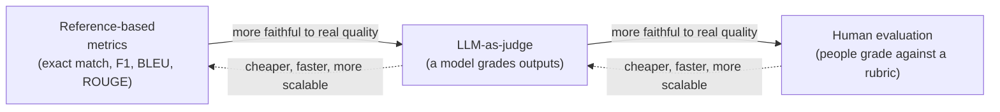
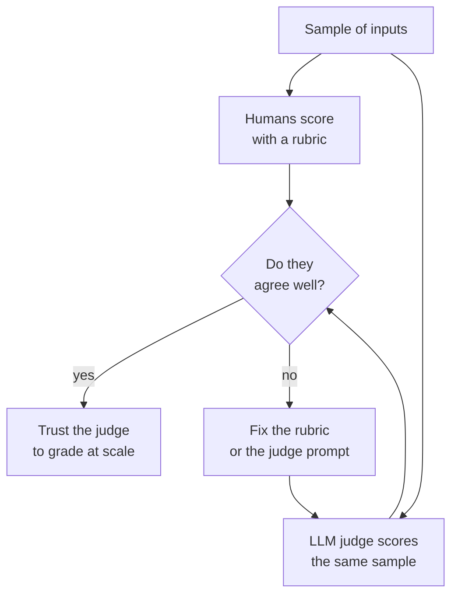
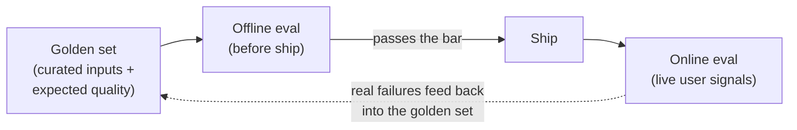

# Evaluation methods

## The problem it solves

You ship a feature that summarizes support tickets. A user pastes a ticket, the model returns a paragraph. Is that paragraph *good*? Now multiply that by ten thousand tickets, and by the six model or prompt changes you'll make next quarter. You cannot read them all, and even if you could, "good" isn't one thing — the summary has to be **correct** (facts match the ticket), **helpful** (captures what the agent actually needs), **safe** (doesn't invent a refund promise), and **well-formed** (fits the length and format the UI expects). A single output can nail three of those and fail the fourth.

This is the hard part of building with large language models (LLMs — the text-generating models these products run on) that surprises people coming from ordinary software. In traditional software, a function returns 4 or it doesn't; you write `assert result == 4` and move on. LLM outputs are **open-ended**: there is no single correct string. "Reset your password from the Settings page" and "Head to Settings and choose Reset password" are both right, and a naive string comparison calls the second one wrong. Outputs are also **non-deterministic** — the same prompt can produce different wording on two runs — so even re-running the same input doesn't give you a stable thing to check against. **Evaluation methods** are the toolkit for answering "is this output good?" at scale, when the answer is a judgment call rather than a lookup. Get this wrong and you're flying blind: you'll ship changes on vibes, and you won't know you regressed until users tell you.

## The one analogy to remember

**The picture:** two ways a teacher grades a stack of exams. A **multiple-choice test** has an answer key — the teacher (or a scanning machine) checks each bubble against the key, fast and objective. An **essay exam** has no answer key — the teacher reads each essay against a rubric ("did it make a clear argument? support it with evidence?"), and to grade thousands fairly the school hires a panel of trained graders and periodically checks that they agree with each other.

**The mapping:** the answer key = **reference-based / automated metrics** (you have the expected answer and compare against it); the essay rubric read by a human = **human evaluation**; the school hiring a panel and spot-checking their agreement = using **LLM-as-judge** at scale while **calibrating it against human graders**; the essay exam itself = the open-ended LLM output that has no single right answer.

**Why it holds:** the reason essays need a rubric-and-panel instead of an answer key is *exactly* the reason LLM evaluation is hard — the output space is open, so "matches the key" stops being a valid test of quality and you're forced into graded judgment against criteria. The analogy is faithful because it reproduces the real cause of the difficulty, not just the feeling of it.

**Say it like this:** "Grading a multiple-choice test is easy — there's a key. Grading essays is hard — you need a rubric and trained graders you trust. LLM outputs are essays, not bubbles, so most of the work is building the rubric and trusting the graders."

*Where it breaks:* a human grader gets tired but isn't *systematically* biased toward, say, longer essays; an LLM judge has consistent, exploitable biases (it favors longer answers, the first option shown, its own style) — so the "panel" needs auditing in ways a human panel doesn't.

## Why "just measure it" is genuinely hard

Before the toolkit, internalize *why* no single method wins, because the whole taxonomy is a response to these four facts:

- **No single correct answer.** Open-ended generation has a vast space of acceptable outputs. Any method that compares against one gold string will punish valid alternatives.
- **Non-determinism.** Sampling means the same input yields different outputs. Your eval has to tolerate variation and often needs to run each case a few times to get a stable read.
- **Quality is multi-dimensional.** Correct, helpful, safe, and correctly formatted are separate axes; one number hides which one broke. Serious evals score dimensions separately.
- **The "good" bar is contextual.** A witty tone is a win for a marketing assistant and a failure for a legal one. There is no context-free quality score, which is why the eval has to encode *your* definition of good.

Everything below is a different trade of **cost, speed, and how well it captures real quality** in the face of those four facts.

## The measurement toolkit

There are three families of methods, and they line up on a single spectrum: cheap-and-shallow to expensive-and-faithful.

### Reference-based / automated metrics — cheap, fast, and often wrong for generation

These compare the model's output to a known correct answer (the **reference**). When the task genuinely has a right answer, they're perfect: for classification or extraction, **exact match** (did the output equal the expected label?) and **F1 score** (the harmonic mean of precision and recall — precision being "of what you returned, how much was right," recall being "of what was right, how much did you return") are cheap, objective, and instant. If your feature outputs a category or pulls a date from a document, use these and don't overthink it.

The trouble starts with **open-ended text**, where the NLP (natural language processing) field's classic overlap metrics get reached for by reflex and quietly mislead:

- **BLEU (Bilingual Evaluation Understudy)** — built for machine translation. It measures how much the output's word-sequences (n-grams) overlap with a reference translation.
- **ROUGE (Recall-Oriented Understudy for Gisting Evaluation)** — built for summarization. It measures how much of the reference summary's wording appears in the output.

Both are, at heart, **word-overlap counters**. And that is precisely why they fail for open-ended generation: they reward using the *same words* as the reference, not saying the *same thing*. "The film was excellent" versus "A superb movie" share almost no words — near-zero overlap score — yet mean the same thing. A perfectly good paraphrase is penalized; a fluent, on-topic lie that happens to reuse reference words can score well. They're blind to meaning, so they measure surface similarity and call it quality. They survive in research as fast, reproducible, comparable-across-papers numbers, but for judging whether a *generated* answer is good, they're a weak proxy — useful as a cheap smoke-alarm, never as the verdict.

> [!NOTE]
> **n-gram** — a run of N consecutive words. "the red car" contains the 2-grams "the red" and "red car." Overlap metrics like BLEU and ROUGE work by counting how many n-grams the output and the reference share; that's the whole mechanism, and also the whole limitation — matching word-runs is not the same as matching meaning.

### Human evaluation — the gold standard you can't afford to run constantly

Put a human in front of the output with a rubric and have them score it. This is the **gold standard** because humans actually understand meaning, catch the subtle failure the metrics miss, and can judge the fuzzy axes (tone, helpfulness) that have no formula. When you need to know the *true* quality of something, this is the ground truth everything else is measured against.

The catch is the whole reason the rest of the toolkit exists: it's **slow, expensive, and doesn't scale.** You cannot have people grade every output on every deploy. It's also **subjective** — two reasonable people disagree on the same output, so a single grader's score is noisy. Serious human eval therefore needs two things: an explicit **rubric** (written criteria so graders judge the same way rather than by gut) and a check on **inter-annotator agreement** (a measure of how often independent graders reach the same verdict). Low agreement means your rubric is ambiguous or the task is genuinely subjective — and it's a warning sign, because if humans can't agree on what "good" means, no automated method can be calibrated to a target that doesn't exist. Human eval is what you reach for to establish the truth on a sample, not to monitor everything.

### LLM-as-judge — a scalable proxy for human judgment

The move that made LLM evaluation practical: use a **strong model to grade the outputs of another model** (or the same one). You give the judge model the input, the output, and a rubric, and ask it to score or compare. It approximates human judgment — it understands meaning, so it doesn't get fooled by paraphrases the way BLEU does — but it runs in seconds and costs cents, so you can grade thousands of outputs on every change. This is the workhorse of modern evaluation, and it's what lets a small team run the kind of quality bar that used to require a grading department.

But a judge is a model, so it inherits model-shaped biases — and knowing them cold is what separates someone who's *run* LLM-as-judge from someone who's read about it:

- **Position bias** — when comparing two answers, the judge tends to favor whichever one is presented *first* (or sometimes second), regardless of quality. Mitigation: run each comparison both ways (A then B, and B then A) and only count it as a win if the same answer wins both orderings.
- **Verbosity bias** — the judge tends to rate longer, more elaborate answers as better even when the extra length adds nothing. This quietly rewards padding, so a model that learns to ramble can game the eval.
- **Self-preference / self-enhancement bias** — a judge tends to rate outputs in its *own* style (or from its own model family) more highly. Using a model to grade its own family's outputs can flatter them.

Because of these, the non-negotiable rule is: **you calibrate the judge against humans.** You have humans score a sample, you have the judge score the same sample, and you check that they agree well enough to trust the judge on the rest. The judge is a *proxy*; a proxy is only worth using once you've measured how closely it tracks the thing it stands in for. An uncalibrated judge is a confident number with unknown correctness — worse than no number, because it feels trustworthy. Public standardized tests that rank models are a *specific* application built on this and on reference metrics, with their own set of gotchas — that's [benchmarks](46-benchmarks.md), a different lesson.

## Pointwise vs. pairwise: two ways to ask the question

Independent of *who* grades (human or model), there are two ways to frame the grading task, and the choice matters more than people expect.

- **Pointwise (absolute) scoring** — grade one output on its own: "rate this answer 1–5 on helpfulness." Gives you an interpretable number you can track over time and set a threshold on. The weakness: absolute scores drift and are hard to make consistent. What's a "4"? Graders — human or model — anchor differently, and the same output can score 3 one day and 4 the next.
- **Pairwise (comparative) scoring** — show two outputs for the same input and ask "which is better, A or B?" People and models are far more reliable at *comparing* than at assigning an absolute score — the relative judgment sidesteps the "what's a 4?" problem. This is the natural fit for "is the new prompt better than the old one?" The weakness: you get a *ranking*, not an absolute level, so pairwise can tell you B beats A while both are quietly terrible.

The practical read: use **pairwise** when you're choosing between two candidates (a new model, a new prompt) and **pointwise** when you need an absolute quality level to monitor or gate on. Position bias bites hardest in the pairwise setting, which is why order-swapping matters there specifically.

## Offline vs. online: two places you evaluate

There's a second axis that's easy to conflate with the methods: *when and where* the evaluation happens.

- **Offline evaluation** happens *before* you ship, against a fixed, curated dataset — your controlled lab. You run every candidate change through the same set of inputs and score the outputs with the methods above. It's repeatable and safe: no user is affected by a bad version, and because the inputs are fixed, two runs are comparable.
- **Online evaluation** happens *in production*, on live traffic, using real user signals — did the user accept the answer, retry, escalate to a human, thumbs-down it. It's the only place you learn how the system does on the messy real distribution of inputs, but you can only measure it *after* exposing users, and the signals are indirect.

You need both: offline to catch regressions before they reach users, online to catch the failures your curated set never anticipated. The depth on production signals lives elsewhere — the plumbing that captures live traces and metrics is [observability](../10-production-ops/50-observability.md), and the business-outcome metrics (engagement, retention, deflection) are [AI product metrics](../11-product-strategy/52-ai-product-metrics.md). Detecting whether a change *broke* something relative to a known-good baseline is its own discipline, [regression testing](47-regression-testing.md). Here, just hold the distinction: offline is the lab, online is the field.

## The golden set: the foundation everything rests on

None of the above works without something to run it on. The **golden set** (also called an eval set or eval dataset) is a curated collection of inputs paired with a notion of the expected quality — the reference answer, or the rubric, or the known-correct label. It is the single most important asset in an LLM product's quality process, and the one teams most often skimp on.

Why it's foundational: an eval is only as good as the inputs you run it against. A golden set that's too small or too easy will pass a broken model. A good one deliberately includes the **hard and important cases** — the edge cases, the adversarial inputs, the categories that matter most to the business — so that passing it actually means something. And it's a living asset: every real production failure you find should be distilled into a new golden-set case, so the same bug can never silently return. That feedback loop — production surprises you, you add the case, the eval now guards it forever — is what turns a one-off quality check into a ratchet that only tightens. The eval methods are the instruments; the golden set is the thing you point them at, and building a representative one is most of the actual work.

## Summary / Points to Remember

- **LLM evaluation is hard because outputs are open-ended (no single right answer), non-deterministic, and multi-dimensional** (correct / helpful / safe / formatted are separate axes). Any method that checks against one gold string breaks on valid paraphrases.
- **Three families on one spectrum, cheap-shallow to expensive-faithful:** reference metrics (exact match, F1 — great for closed tasks) → LLM-as-judge (scalable proxy) → human eval (gold standard, doesn't scale).
- **BLEU and ROUGE are word-overlap counters** built for translation and summarization; they reward reusing the reference's *words*, not saying the same *thing*, so they penalize good paraphrases and fail as a quality verdict for open-ended generation.
- **LLM-as-judge is the workhorse, but it's biased** — position, verbosity, and self-preference — so you always **calibrate it against a human-scored sample** before trusting its numbers. An uncalibrated judge is a confident wrong number.
- **Pairwise ("which is better, A or B?") beats pointwise for choosing between candidates** because relative judgment is more reliable than absolute scoring; pointwise gives you a trackable absolute level. Use each for its job.
- **Offline (curated set, before ship) vs. online (live signals, in production)** — you need both; the lab catches known regressions, the field catches what the lab never imagined.
- **The golden set is the foundation** — a curated set of inputs with expected quality, stocked with the hard and important cases, and grown from every production failure. The methods are instruments; the golden set is what you aim them at.

## Interview Questions That Stump People

**Q: "Your team uses BLEU to track summarization quality and the score went up after a prompt change. Are you happy?"**

**Interviewer:** BLEU climbed after we tweaked the prompt. Good news?

**You:** I'd be cautious, not happy. BLEU — Bilingual Evaluation Understudy — is a word-overlap metric: it rewards the summary for reusing the reference summary's exact wording. A higher BLEU can mean the model got better, but it can just as easily mean the model started parroting the reference's phrasing more closely without being any more *correct or useful* — or that a genuinely better summary that paraphrased well would have *lowered* the score. For open-ended text, overlap and quality aren't the same thing. Before I celebrate, I'd want an LLM-as-judge score or a human spot-check on the same outputs to confirm real quality moved, not just surface word-match. BLEU is a smoke alarm, not a verdict.

> [!TIP]
> **Why this answer works:** The trap is treating any metric going up as unambiguous good news. Naming *why* BLEU can rise without quality rising — it counts shared words, not shared meaning — shows you understand the mechanism, not just the acronym. Pivoting to a meaning-aware check (judge or human) demonstrates you know which instrument to trust for which question.

---

**Q: "We can't afford human eval on every deploy. Can we just replace it with an LLM judge?"**

**Interviewer:** Human grading is too slow and expensive. Can the LLM judge just be our eval?

**You:** As your *scalable* eval, yes — that's exactly what LLM-as-judge is for. But you don't get to *replace* humans; you get to *stop running them on everything.* The judge is a proxy for human judgment, and a proxy is only worth using once you've measured how closely it tracks the real thing. So the pattern is: have humans grade a representative sample, have the judge grade the same sample, and check they agree well enough. Once calibrated, you run the judge at scale and re-check the calibration periodically — especially after you change the judge model or the rubric. Skip the calibration and you've got a fast, cheap number with unknown correctness, which is worse than no number because it *feels* trustworthy. Humans move from grading everything to being the yardstick the judge is measured against.

> [!TIP]
> **Why this answer works:** The naive answer is a flat yes, which reveals you don't know a judge is biased and unvalidated by default. The strong answer reframes "replace" as "calibrate then scale," names the judge as a *proxy* that must be checked against ground truth, and flags that calibration decays when you change things — the exact operational discipline that separates someone who's run this from someone who's read the blog post.

---

**Q (clarify-back): "Should we score our outputs pointwise or pairwise?"**

**Interviewer:** For our eval, do you want absolute 1–5 scores per output, or head-to-head comparisons?

**You (clarify back):** Depends what decision the score feeds — are we choosing between two candidate versions (a new prompt or model vs. the current one), or do we need an absolute quality level to monitor and set a shipping threshold on?

**Interviewer:** We're deciding whether to roll out a new prompt to replace the current one.

**You:** Then pairwise. For an A-vs-B decision, "which is better?" is the question you actually have, and both humans and model judges are far more reliable at *comparing* two outputs than at pinning an absolute score on each — it dodges the "what even is a 4?" drift. I'd show the judge both outputs for each input and ask which wins, and I'd run each pair in both orders to cancel out position bias, counting a win only if it holds both ways. If instead we needed a number to track on a dashboard or gate deploys, I'd switch to pointwise, since pairwise gives a ranking but not an absolute level — it can tell you B beats A while both are bad.

> [!TIP]
> **Why this works:** "Pointwise or pairwise" has no context-free answer — it hinges on whether the output is a comparison decision or an absolute-level decision, so answering instantly would show you're reciting rather than reasoning. Clarifying pins the deciding variable; once it's "we're choosing between two versions," pairwise follows directly, and mentioning order-swapping proves you know pairwise's specific failure mode.

---

**Q: "Our offline evals are all green but users are complaining. How is that possible?"**

**Interviewer:** Every eval passes in our automated test pipeline. Users still say the assistant is bad. Explain.

**You:** That's the classic offline/online gap. Offline eval runs against a fixed, curated golden set — it can only test the inputs you thought to include. Green offline means "we didn't regress on the cases we anticipated," not "the system is good on the real world." Users hit the messy live distribution: phrasings, edge cases, and intents your golden set never covered. Two likely culprits: the golden set is too narrow or too easy so it passes a system with real gaps, or the failures are on input types simply absent from it. The fix is the feedback loop — capture the production failures through online signals, distil the real failing cases into new golden-set entries, and now the offline eval actually guards them going forward. The deeper point: a passing offline eval is only as trustworthy as the set it runs on, and a set that never grows from production goes stale.

> [!TIP]
> **Why this answer works:** The trap is to distrust the eval framework or blame the model. The strong move locates the gap precisely — offline tests a curated distribution, users are the real distribution — and identifies the golden set's coverage as the root cause and the production-to-golden-set feedback loop as the fix. It shows you treat the eval set as a living asset, not a one-time artifact, which is the mark of someone who's operated this in production.

---

**Q: "In an A/B comparison, your LLM judge says version A wins 70% of the time. What's the first thing you check?"**

**Interviewer:** The judge strongly prefers A. Do you ship A?

**You:** Not yet — first I'd check for position bias. LLM judges have a known tendency to favor whichever answer is shown first regardless of content. If A was always presented in the first slot, that 70% could be partly the slot, not the substance. The cheap, decisive test: re-run every comparison with the order flipped and only count A as a real winner where it wins in *both* orderings. If A's win rate collapses toward 50% when I swap positions, the preference was largely an artifact. I'd also glance at whether A's answers are systematically longer, since verbosity bias could be inflating it too. Only after I've controlled for the judge's own biases would I trust the 70% enough to act on it.

> [!TIP]
> **Why this answer works:** A candidate who ships A on the raw 70% doesn't know judges are biased. Naming position bias *first*, giving the exact mitigation (swap order, require a win in both), and adding verbosity as a secondary check shows you understand an LLM judge's numbers are contaminated by predictable artifacts until you actively control for them — the difference between using the tool and being fooled by it.
