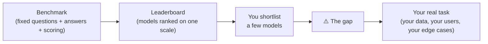

# Benchmarks and their limits

## The problem it solves

A new model drops every few weeks, and each vendor swears theirs is best. As a product manager (PM) choosing which model to build on, you need *some* way to compare them that isn't just marketing. If GPT-something and Claude-something and the open-weight challenger all took different tests, on different questions, scored by different graders, the numbers would be meaningless — you couldn't tell whether one is genuinely stronger or just took an easier exam.

A **benchmark** solves exactly this. It's a *fixed, public, shared* test: the same frozen set of questions, the same right answers, and the same scoring rule, applied to every model. Because the yardstick is identical for everyone, the scores become *comparable* — that's the entire point. Put a bunch of those comparable scores in a sorted table and you have a **leaderboard**: model A gets 88% on this test, model B gets 84%, and now there's a public ranking anyone can cite.

You'll hear a handful of names constantly, so recognize them: **MMLU** (Massive Multitask Language Understanding — thousands of multiple-choice questions across 57 subjects, from law to biology, testing broad knowledge and reasoning), **GSM8K** (Grade School Math 8K — arithmetic word problems that need multi-step reasoning), **HumanEval** (a set of programming problems where the model writes code and the code is *run* against hidden tests to see if it actually works), and **arena-style rankings** (like Chatbot Arena, where real humans are shown two anonymous model answers to the same prompt and vote which is better, and the votes roll up into a ranking). Each targets a different capability — knowledge, math, code, overall human preference.

That's what a benchmark *is* and what it's *for*. The rest of this lesson is about why a benchmark score, taken at face value, will mislead you — and how a sharp PM uses one anyway.

## The one analogy to remember

**The picture:** the SAT (the standardized college-admissions exam in the US). It's one fixed test, the same for every student, so colleges can compare applicants on a single scale. But everyone knows its dirty secret: a school that drills students on past SAT papers and test-taking tricks can push its scores way up without the students actually being better educated.

**The mapping:** the fixed SAT question set = the benchmark's frozen dataset; comparing students on one scale = comparing models on one leaderboard; a school *teaching to the test* = a lab optimizing a model to score well on the benchmark; a student who *saw the exact exam beforehand* = a model whose training data contained the benchmark's questions (contamination); "high SAT score ≠ will thrive in *this specific* job" = "high benchmark score ≠ good at *your specific* production task."

**Why it holds:** the SAT and a benchmark share the same structural weakness — the moment a fixed, public test becomes the *target* you optimize for, high scores start measuring *test-craft* (memorization, drilling, gaming) instead of the underlying ability the test was meant to stand in for. The gap between "scores well on the test" and "is actually capable" is the whole lesson, and it's the same gap in both worlds.

**Say it like this:** "A benchmark is the SAT for AI models — great for ranking them on one shared scale, but a high score can mean the model is genuinely smart *or* that it studied the answer key, so you never hire on the SAT alone."

*Where it breaks:* the SAT is (mostly) kept secret between administrations, whereas the most-cited AI benchmarks are fully public and static — which makes the "studied the answer key" problem *worse* for benchmarks than for a real exam, not better.

## What a benchmark actually measures — and the gap

The trap is treating a leaderboard rank as a direct readout of "how good is this model." It isn't. A benchmark measures *one narrow, frozen slice* of behavior under lab conditions, and there's a real gap between that number and what you care about. Here's the chain from the test to your product, with the leaks along the way.

That box marked "the gap" is where careers are made in an interview. Four forces widen it.

### Contamination (data leakage): the model already saw the answer key

Modern models are trained on enormous scrapes of the public internet — and the popular benchmarks *live* on the public internet, questions and answers together, discussed in blog posts and GitHub repos. So the benchmark's exam questions can end up *inside the model's training data*. When that happens, a high score no longer means the model can *reason* to the answer; it may just be **recalling** an answer it effectively memorized during training.

This is the single most damaging limit, because it's invisible from the outside — the score looks fantastic, and you can't easily tell whether it reflects capability or contamination. It's the exact analogue of a student who got hold of the answer key: the test can no longer distinguish "understands the material" from "saw it before." (How you'd score a *clean* test instead — held-out data, freshly written questions — is the province of [general evaluation methods](45-evaluation-methods.md); the point here is only that a public, static benchmark is structurally exposed to this.)

### Saturation: the test stops being able to tell models apart

A benchmark discriminates only while models are spread across its range. Once the best models are all scoring 88, 89, 90 on the same test, the benchmark is **saturated** — it's near its ceiling and can no longer tell a genuinely better model from a marginally luckier one. The remaining few points are mostly noise, ambiguous questions, or outright *errors in the benchmark's own answer key*. A once-useful test becomes a flat line where everyone looks the same, which is why the field keeps having to invent harder successors (MMLU spawning tougher variants, and so on).

### Construct validity: the benchmark is not your task

"Construct validity" is just the measurement world's term for *does this test actually measure the thing you care about?* A model can top MMLU — broad academic knowledge — and still be mediocre at *your* job of, say, extracting the right five fields from a messy insurance PDF in your company's format. The benchmark measures a general construct; your product needs a specific one. High general-knowledge scores simply don't transfer, guaranteed, to a narrow production task with your data, your edge cases, and your users' weird phrasing. Believing they do is the most common PM error here.

### Goodhart's law: when the target corrupts the measure

There's a principle economists call **Goodhart's law**: *when a measure becomes a target, it ceases to be a good measure.* The instant a leaderboard confers bragging rights and sales, labs are incentivized to optimize *for the benchmark* — tuning on similar data, drilling the format — which raises the score without necessarily raising the underlying capability. This is "teaching to the test" precisely: the number goes up, the real ability doesn't move with it, and the benchmark quietly stops measuring what it claimed to.

Compounding all four: benchmarks are **static**. They're frozen at a moment in time, so they age — the world moves on, the questions get stale, and, being public, they get thoroughly optimized against in ways that don't generalize to fresh, real-world inputs.

## How a PM should actually use benchmarks

The takeaway that separates a knowledgeable answer from a naive one: **a benchmark is a coarse screen for building a shortlist — never a substitute for evaluating on your own task.**

Use them to *narrow the field*. If you need strong code generation, a model that's near the bottom of HumanEval-style rankings probably isn't worth trialing; benchmarks are a cheap, fast first filter that saves you from testing everything. That's a legitimate and valuable use. What benchmarks cannot do is tell you which shortlisted model wins *for you* — that answer only comes from running the candidates against your own data and task, which is what the rest of this category covers: [how you actually evaluate](45-evaluation-methods.md), and [how you keep your app from regressing](47-regression-testing.md) once it's live. (The clean one-line contrast: **benchmarks compare models publicly on a shared test; [regression tests](47-regression-testing.md) protect *your* app privately across your own prompt and model changes** — different jobs, don't conflate them.) Weighing the winner on price and latency, and whether to use a public model at all, are their own decisions — see [cost and unit economics](../10-production-ops/51-cost-unit-economics.md) and [build vs buy](../11-product-strategy/53-build-vs-buy.md).

So the posture is: read leaderboards as *directional signal*, discount them for contamination and saturation, never assume the score transfers to your task, and treat your own evaluation set as the thing that actually decides.

## Summary / Points to Remember

- A benchmark is a **fixed, public, shared test** — same questions, same answers, same scoring — so different models are comparable on one scale; sorted, that's a **leaderboard**. Names to recognize: MMLU (broad knowledge), GSM8K (math), HumanEval (code), arena-style human-preference rankings.
- The whole lesson is the **gap between the score and your task.** A leaderboard rank is directional signal, not a verdict.
- **Contamination is the worst limit:** benchmark questions leak into training data, so a great score may measure *memorization*, not capability — and it's invisible from the outside.
- **Saturation** kills a benchmark's usefulness once everyone clusters near the ceiling; the remaining points are mostly noise and answer-key errors.
- **Construct validity:** a high MMLU score does *not* mean the model is good at *your* narrow production task. General ≠ specific.
- **Goodhart's law** — "when a measure becomes a target, it ceases to be a good measure": once a leaderboard drives sales, labs teach to the test and the number decouples from real ability. Benchmarks are also **static**, so they age.
- PM posture: **benchmarks are a coarse screen for shortlisting; your own [evaluation on your own data](45-evaluation-methods.md) is what decides.** Benchmarks compare models publicly; [regression tests](47-regression-testing.md) protect your app privately.

## Interview Questions That Stump People

**Q: "Model X just took the top spot on MMLU. Should we switch our product to it?"**

**Interviewer:** The new leader beats our current model by four points on MMLU. Do we migrate?

**You:** A four-point MMLU lead tells me almost nothing about our product. MMLU measures broad academic knowledge; it doesn't measure our task, which is [extracting structured data from support tickets]. High general scores don't reliably transfer to a narrow production task — that's a construct-validity gap. On top of that, MMLU is saturated at the top, so a four-point difference is within the range of noise and answer-key errors, and both models were likely optimized *toward* the benchmark. So my answer is: it earns a spot on the shortlist to *trial*, nothing more. The decision comes from running both against our own evaluation set on our real data. The leaderboard picks who we test; our eval picks who we ship.

> [!TIP]
> **Why this answer works:** The trap is treating a leaderboard delta as a product decision. Naming *three* independent reasons it doesn't transfer — construct validity, saturation-as-noise, and optimization-toward-the-test — shows you understand the benchmark's limits structurally, not as a vague "benchmarks aren't perfect." Ending on "leaderboard shortlists, our eval decides" gives the interviewer the exact operating rule they're probing for.

---

**Q: "A model scores 95% on a public math benchmark but flubs simple math in our app. How is that even possible?"**

**Interviewer:** The benchmark says it's near-perfect at math. Our users see it get basic sums wrong. Explain the contradiction.

**You:** The most likely explanation is contamination. That benchmark and its answers are public and all over the internet, which is exactly what these models are trained on — so a 95% can mean the model *memorized* those specific questions during training, not that it can *reason* through arithmetic it hasn't seen. Our app feeds it fresh problems that were never in the training data, so the memorization advantage evaporates and you see the true, lower capability. It's the student who aced the practice exam because they'd seen the answer key, then bombed the real one. The lesson isn't "the model is broken" — it's that a public static benchmark can't distinguish memorization from capability, which is why we test on our own held-out data instead.

> [!TIP]
> **Why this answer works:** It names the specific mechanism — contamination / data leakage — rather than hand-waving about "benchmarks being unreliable." Explaining *why* the gap appears (memorized public questions vs. fresh inputs) and tying it to the fix (evaluate on held-out data you control) demonstrates you understand the failure mode well enough to design around it, which is the whole point.

---

**Q (clarify-back): "Are benchmarks useless for model selection, then?"**

**Interviewer:** Given all these problems — contamination, saturation, gaming — should we just ignore benchmarks when picking a model?

**You (clarify back):** Depends what stage we're at — are we narrowing a field of ten candidates down to a few to trial, or deciding which of two finalists to actually ship?

**Interviewer:** The first — we're staring at a dozen models and don't know where to start.

**You:** Then benchmarks are genuinely useful — for exactly that. As a coarse first screen to build a shortlist, they're cheap and fast: a model near the bottom of the relevant benchmark probably isn't worth a trial, so they save us from evaluating all twelve. What they *can't* do is pick the winner from the shortlist — that's where contamination and construct validity bite, and where our own evaluation on our own data has to take over. So: not useless, but confined to shortlisting. If you'd said we were choosing between two finalists, my answer would flip to "ignore the benchmark, run our own eval," because at that stage the leaderboard's limits dominate its signal.

> [!TIP]
> **Why this works:** "Useless or not" is a false binary, and answering it flatly either way is the trap — benchmarks are useful for one job and misleading for another. Clarifying the *stage* is what resolves it: the honest answer is stage-dependent, and showing both branches (shortlisting vs. final choice) signals you've actually run this process rather than memorized "benchmarks bad." It also demonstrates you know where the signal-to-limit ratio flips.

---

**Q: "Why do the AI labs keep having to build new, harder benchmarks every year?"**

**Interviewer:** MMLU, then harder versions, then something harder still. Why the treadmill?

**You:** Two forces, and they compound. First, saturation: as models improve, they cluster near the top of a given benchmark, and once everyone's at 90%+ the test can't discriminate anymore — the gaps left are mostly noise and errors in the benchmark's own answers. A test that can't tell the leaders apart has stopped doing its job. Second, Goodhart's law: the moment a benchmark becomes the target everyone optimizes for — because leaderboard position drives sales — labs teach to the test, the scores inflate faster than real capability, and the benchmark decouples from what it was supposed to measure. Both mean a benchmark has a *shelf life*. It ages the instant it's public and popular, so the field has to keep minting fresh, harder ones to preserve any discriminating power. That treadmill is a structural feature of public benchmarks, not a sign anyone's doing it wrong.

> [!TIP]
> **Why this answer works:** It combines the two mechanisms — saturation *and* Goodhart — instead of naming just one, which is what a shallower answer does. Framing them as giving every benchmark a "shelf life" shows you see benchmarks as inherently perishable rather than permanent truth, and "structural feature, not a mistake" signals the mature read that the treadmill is expected, not a scandal.

---

**Q: "A vendor's slide shows their model beating ours on six benchmarks. What's your first question?"**

**Interviewer:** Procurement loves the slide — six green checkmarks. How do you respond?

**You:** My first question is: were those benchmarks run on data the model could have seen in training, and do any of them resemble *our* actual task? Six leaderboard wins are directional at best. I'd want to know whether they controlled for contamination — public benchmarks leak into training data, so wins can reflect memorization — and, more importantly, none of those six is our workflow with our data. A general benchmark win doesn't establish they'll beat us where it counts. So the slide gets them a trial slot, and then we settle it the only way that's valid: both models, head to head, on our own evaluation set. I'd be skeptical of any purchase decision made on vendor-selected benchmarks, because the vendor chose the six tests that flatter them — that's selection bias on top of everything else.

> [!TIP]
> **Why this answer works:** It resists being impressed by a count of wins and immediately interrogates *contamination* and *construct validity* — the two limits that decide whether the wins mean anything. Flagging that the *vendor picked the benchmarks* (selection bias) is the extra move that signals real-world skepticism, and routing the decision to a head-to-head on your own data shows you know benchmarks screen but never decide.
