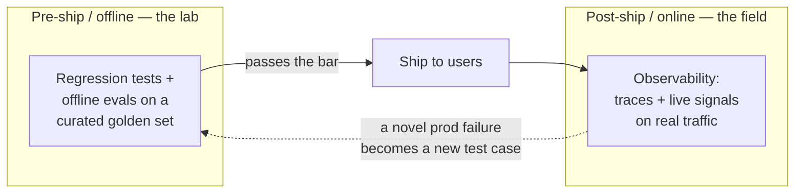
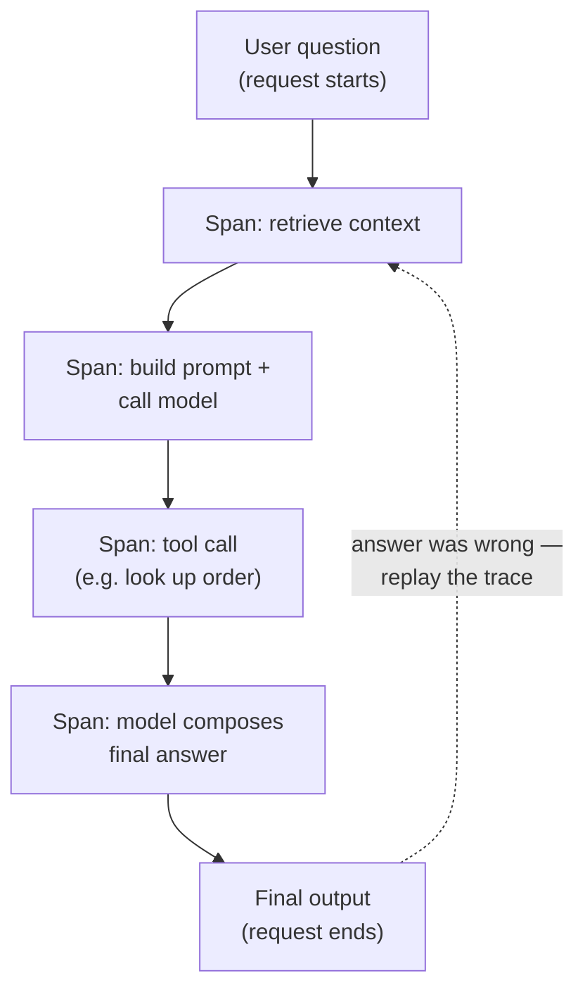
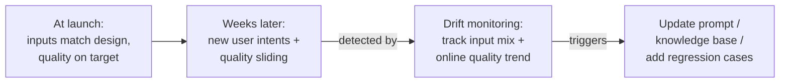
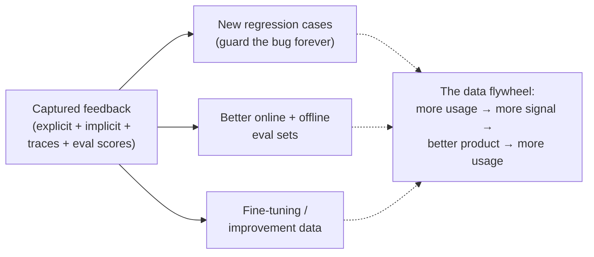

# LLM observability

## The problem it solves

You shipped an AI feature three weeks ago — say, an assistant that answers customer questions from your help center. The launch dashboard was green, offline evals passed, and everyone moved on. Then a support lead mentions, almost in passing, that a few enterprise customers have been getting oddly confident answers about a refund policy that doesn't exist. How long has that been happening? To how many users? On which kinds of questions? You open your logs and find… request counts and HTTP (HyperText Transfer Protocol) 200 success codes. The feature never *crashed*. It just started being quietly, fluently wrong, and nothing in your stack was watching for that.

This is the failure mode that catches product teams off guard. In ordinary software, a broken thing throws an error — a red line in a log, a spiked exception count, a pager going off. A large language model (LLM — the text-generating model your feature runs on) fails differently: it produces a perfectly well-formed, confident, grammatical answer that happens to be wrong. There is no exception. The status code is 200. The output *looks* exactly like a good output. And because the model is **non-deterministic** (the same input can produce different wording on different runs) and faces the messy real distribution of what users actually type, you cannot possibly have anticipated every way it would go wrong before you shipped. **LLM observability** is the discipline of instrumenting your deployed feature so you can *see* what it's actually doing on live traffic — catching the silent, novel failures that only show up once real users are hitting it, instead of finding out from an angry customer three weeks late.

## The one analogy to remember

**The picture:** a modern car has two things working together. A **live dashboard** — speedometer, fuel gauge, engine-temperature light — tells you *right now* whether something is wrong. And a **dashcam plus a black-box recorder** silently captures everything, so when something odd happens on a specific trip, you can replay exactly what the car and driver did second by second.

**The mapping:** the dashboard gauges = your **live metrics/signals** (latency, cost, error rate, thumbs-down rate) that tell you *something* is off across all traffic; the warning light coming on = an **alert** firing on a threshold; the dashcam/black-box recording of one trip = a **trace** of one request, capturing every step (the prompt, the retrieved context, each tool call, the intermediate reasoning, the final answer); replaying the tape to see where the trip went wrong = using that trace to find *which step* produced the bad answer.

**Why it holds:** the reason a car needs *both* a dashboard and a recorder is exactly the reason LLM observability needs both aggregate signals and per-request traces — the gauge tells you a problem *exists* but not *why*, and the recording tells you *why* on a specific case but can't watch everything at once. Metrics detect; traces diagnose. You need the pair.

**Say it like this:** "The dashboard tells me the engine's running hot; the dashcam lets me replay the exact trip where it happened. For an AI feature, metrics tell me quality dropped, and the request trace lets me replay the one answer that went wrong to see which step broke."

*Where it breaks:* a car's black box records physical facts that are what they are; an LLM trace often needs a *judgment* layered on top (was this answer actually good?) — the recording alone doesn't tell you quality, which is why online evaluation, below, exists.

## Why deployment is where the real risk starts

There's an instinct — common in teams coming from traditional software — that quality is something you certify *before* you ship: you run your test suite, it's green, you deploy, you're done. For LLM features that instinct is dangerous, because the pre-ship gate can only test inputs you thought to include, and the whole hazard of a non-deterministic model on open-ended input is that **it will encounter things you never imagined.**

So the mental model to hold is two complementary regimes, and keeping them straight is the single most load-bearing idea in this lesson:

- **Pre-ship / offline** — you run candidate changes against a fixed, curated set of inputs in a controlled lab, checking that you didn't break anything you already know about. This is [regression testing](../09-evaluation/47-regression-testing.md) and the broader [evaluation methods](../09-evaluation/45-evaluation-methods.md) that feed it. It stops **known** failures from recurring.
- **Post-ship / online** — you watch the feature running on real, live traffic, hunting for the **novel** failures that no curated set anticipated. This is observability. It catches what the lab couldn't imagine.

The dotted arrow is the part people miss. These two regimes aren't rivals; they feed each other. Observability *finds* a new failure in the wild; you distil it into a regression case so it can never silently return. The lab keeps you from repeating history; the field tells you what history you're about to make. A team that only does one of these is either blind to new problems (offline only) or doomed to keep re-shipping old ones (online only).

## Logging, tracing, and spans: seeing one request end to end

The atomic unit of observability is the **trace**: the complete recorded story of one request as it moved through your system. Plain **logging** — writing lines like "request received, response sent" — is the floor, and for a single model call it's almost enough. But almost no real AI feature is a single model call. It's a chain: the user's message gets combined with retrieved documents, sent to the model, which decides to call a tool, whose result gets fed back in, and only then does a final answer come out. When that final answer is wrong, "the answer was wrong" is useless. You need to know *which link in the chain* broke.

That's what **tracing** gives you, and its building block is the **span**. A span is a record of one step — its inputs, its outputs, how long it took. A trace is the tree of all the spans for one request. For a multi-step chain or an [agentic run](../06-agents/34-agentic-systems.md), you capture **one span per step**, so you can walk the whole thing after the fact.

> [!NOTE]
> **Span** — a single timed unit of work inside a request, borrowed from general software tracing. In an LLM system a span typically wraps one meaningful step: "retrieve context," "call the weather API (application programming interface — how one piece of software calls another)," "model generates answer." Each span records what went in, what came out, and how long it took; nested spans form the trace tree. The point is granularity — without spans, a trace is one opaque blob; with them, you can see the exact step where things went sideways.

Concretely, a captured trace for a support-assistant answer might hold: the raw user question, the exact prompt sent to the model (system instructions included), the documents [retrieval](../04-retrieval-knowledge/25-hybrid-search.md) pulled in, each [tool call](../06-agents/32-tool-calling.md) and its result, any intermediate reasoning steps, and the final output. With that in hand, debugging becomes replay. The classic example: the answer cited a policy that doesn't exist. Was the model [hallucinating](../03-reasoning-generation/19-hallucination.md), or did retrieval hand it a stale document that genuinely said that? Without the trace you're guessing. With it, you open the retrieval span, see what was fetched, and know in seconds which of the two it was — and therefore whether to fix your prompt or your knowledge base.

The tradeoff to be honest about: capturing full traces means storing prompts and outputs, which often contain user data. Deciding what to log, for how long, and with what redaction is a genuine privacy decision, not an afterthought — see [privacy and PII (personally identifiable information)](../08-safety-trust/43-privacy-pii.md).

## The signals you watch on live traffic

Traces diagnose one request; **signals** (aggregate metrics over all traffic) tell you *when to go look*. They fall into two groups, and conflating them is a common mistake.

**Operational signals** — is the system healthy and affordable?

- **Latency percentiles (p50 / p95 / p99).** Not the average — the average hides the tail. p95 = "95% of requests were at least this fast; the slowest 5% were worse." The tail is what users actually feel and complain about, and for a multi-step agent the tail can be brutal. Averages lie about tails; percentiles don't.
- **Token usage and cost per request.** Because you pay per token, cost is a first-class operational signal that can drift silently — a prompt tweak that adds retrieved context can quietly double your bill. The economics of this get their own treatment in [cost and unit economics](../10-production-ops/51-cost-unit-economics.md); here it's just one of the gauges.
- **Error and timeout rates.** Upstream model errors, rate limits, tool-call failures.

**Quality signals** — is the output any *good*? This is the LLM-specific part, and it's where teams under-invest because it's harder than counting HTTP errors.

- **Refusal rate.** How often the model declines to answer. A sudden spike often means a prompt change made it over-cautious — a silent regression you'd never see in error logs because a refusal is a "successful" response.
- **User feedback — thumbs up/down (explicit).** The most direct quality read you can get, when users bother to give it.
- **Regeneration and abandonment rates (implicit).** Did the user hit "try again," rephrase, or just leave? These are behavioral tells that the answer missed, and they're gold precisely because they cost the user nothing and require no button.

> [!NOTE]
> **Percentile (p95, p99)** — order all your latency measurements from fastest to slowest; the p95 is the value 95% of them come in under. It's the standard way to describe the *worst realistic case* rather than the typical one, because a good average can still hide a slow, painful tail that a fraction of users hit every time.

The framing worth carrying: operational signals tell you the plumbing works; quality signals tell you the product works. A feature can be fast, cheap, error-free — and quietly useless. Only the quality signals catch that.

## Online evaluation: grading a slice of live traffic

User feedback is sparse — most people never click thumbs-down; they just silently give up. So the strongest quality signal is one you generate yourself: **online evaluation**, running automated scorers on a *sample* of real production traffic to track quality over time.

The mechanics reuse the same [evaluation methods](../09-evaluation/45-evaluation-methods.md) as offline testing — often an **LLM-as-judge** (a strong model scoring another model's output against a rubric) — but the setting is fundamentally different, and the difference is the whole point:

| | Offline eval (pre-ship) | Online eval (post-ship) |
|---|---|---|
| **Inputs** | Fixed, curated golden set | Real live traffic (sampled) |
| **When** | Before you deploy | Continuously, in production |
| **Catches** | Known regressions | Novel failures on real inputs |
| **Reference answer?** | Usually yes | Usually no — no ground truth |

That last row is the catch worth internalizing: online, you rarely have a "correct answer" to compare against, because these are questions no one pre-wrote answers for. So online scoring leans on *reference-free* judgments — "is this answer grounded in the retrieved context? is it relevant? does it refuse appropriately?" — rather than "does it match the gold string?" You sample rather than score everything because judging every request (often with another model call) costs real money and time; a representative slice tracks the trend without doubling your bill.

## Drift: the failure that arrives with no deploy

Here's the unsettling part of running an LLM feature: **it can degrade without anyone changing anything.** In traditional software, behavior changes only when code changes. An LLM feature sits between two moving things — the users and (often) a model endpoint you don't control — so quality can slide while your code sits perfectly still. This slow slide is **drift**, and it comes in two flavors worth naming separately.

- **Input drift** — the distribution of what users ask shifts away from what you designed and tested for. You built a returns assistant; a new product launches; suddenly a third of questions are about a feature your prompt and knowledge base never anticipated. Nothing broke — the world moved, and your feature is now being asked questions it was never set up to answer.
- **Output-quality drift** — the quality of answers degrades over time even on similar inputs. Causes range from a stale knowledge base (the world changed, your documents didn't) to the model provider silently updating the endpoint behind your API.

Drift detection is *why* observability has to be continuous rather than a launch-day check. You detect input drift by watching the mix of incoming request types over time; you detect output drift by watching your online quality scores trend downward. Neither shows up as an error — which is exactly why you have to be looking.

## Feedback capture: the exhaust that becomes fuel

The last shift in mindset is to stop treating captured signals as a debugging convenience and start treating them as a **product asset**. Every trace, every thumbs-down, every regeneration, every low online-eval score is raw material — and it feeds three distinct machines:

This is the beginning of the **data flywheel** — the idea that a live product generates the very data that makes the next version better, which draws more usage, which generates more data. Feedback capture is where that flywheel gets its first push, which is why *how* you collect signal (a well-placed thumbs button, a clean trace schema) is a genuine product decision, not just plumbing. Where this ultimately pays off as a competitive advantage is [data moats](../11-product-strategy/54-data-moats.md); how it rolls up into business outcomes is [AI product metrics](../11-product-strategy/52-ai-product-metrics.md). The observability point is narrower and concrete: **if you don't capture it at the moment it happens, it's gone** — you can't retroactively ask a user who left last Tuesday whether the answer was good.

The infrastructure that makes all of this reliable at scale — sampling, storage, dashboards, the serving path itself — is [production architecture](../10-production-ops/48-production-architecture.md). This lesson is about *what* you watch and *why*; that one is about the machinery that lets you watch it.

## Summary / Points to Remember

- **LLM failures are silent, not loud.** They come back as fluent, confident, well-formed *wrong* answers with a 200 status code — not exceptions. Observability exists because your normal crash-and-error monitoring literally cannot see them. *(PM framing: "our error rate is fine" tells you nothing about whether the feature is any good.)*
- **Metrics detect, traces diagnose — you need both.** Aggregate signals tell you *something's* wrong across all traffic; a per-request trace (one span per step) lets you replay the one bad answer and find *which* step broke it. *(PM framing: the dashboard vs. the dashcam.)*
- **Trace the whole chain, one span per step** — prompt, retrieved context, tool calls, intermediate steps, final output — because in a multi-step agent, "the answer was wrong" is useless without knowing which link failed. *(PM framing: you can't fix a chain you can't replay.)*
- **Watch operational *and* quality signals.** Latency percentiles (p95/p99, not averages), cost/tokens, error rates — plus refusal rate, thumbs up/down, and regeneration/abandonment. A fast, cheap, error-free feature can still be quietly useless. *(PM framing: green plumbing metrics are not a quality bar.)*
- **Online eval = scoring a sample of live traffic** (often LLM-as-judge), usually reference-free because there's no gold answer for questions no one pre-wrote. It catches quality slides that user feedback is too sparse to reveal. *(PM framing: don't wait for thumbs-down; generate your own quality signal.)*
- **Drift is degradation with no deploy** — input drift (users ask new things) and output-quality drift (a stale knowledge base or a silently updated model endpoint). It never shows as an error, so only continuous watching catches it. *(PM framing: an LLM feature can rot while the code sits still.)*
- **The load-bearing distinction: observability is post-ship/online catching NOVEL failures on real traffic; regression testing is pre-ship/offline stopping KNOWN failures from recurring.** They complement and feed each other — every novel prod failure becomes a new regression case. *(PM framing: the field finds it, the lab guards it forever.)*

## Interview Questions That Stump People

**Q: "Your AI feature's dashboards are all green — low latency, near-zero error rate, well under budget. Are you confident it's working?"**

**Interviewer:** Every operational metric is healthy. Confident the feature's good?

**You:** No — those are all *operational* signals, and an LLM's characteristic failure is invisible to every one of them. The model can return a fluent, confident, wrong answer in 200 milliseconds, cheaply, with a 200 status code. Nothing there is red because nothing *crashed*; it just gave a bad answer that looks exactly like a good one. To be confident it's *working*, I need quality signals: online eval scores on a sample of live traffic, refusal rate, and behavioral tells like regeneration and abandonment. Green plumbing tells me the system is healthy and affordable — it tells me nothing about whether the output is any good.

> [!TIP]
> **Why this answer works:** The trap is equating "no errors" with "working," which is the exact instinct that lets a silent LLM failure run for weeks. Splitting signals into operational vs. quality, and naming that the failure mode has a *200 status code*, shows you understand why traditional monitoring is blind here — the single most important idea in production LLM ops.

---

**Q: "A user reports the assistant gave a confidently wrong answer citing a policy that doesn't exist. Walk me through how you'd debug it."**

**Interviewer:** Confident answer, cited a policy that isn't real. Where do you start?

**You:** I'd pull the **trace** for that specific request and replay it step by step. The key question is *where* the bad content entered, and there are two very different culprits. I'd open the retrieval span first: did retrieval hand the model a stale or wrong document that actually contained that fake policy? If so, the bug is in my knowledge base, not the model — fix the data. If retrieval returned clean, correct context and the model invented the policy anyway, that's a hallucination, and the fix is on the prompt or grounding side. Same wrong answer, opposite root causes — and I can only tell them apart because the trace captured each step's inputs and outputs separately. Then I'd distil this exact case into a regression test so it can't silently come back.

> [!TIP]
> **Why this answer works:** A weak answer jumps straight to "the model hallucinated." The strong move treats the trace as a replayable recording and uses the *span structure* to localize the fault — retrieval vs. generation — before assigning blame. Naming both branches proves you understand a multi-step system fails at a specific link, and closing with "add a regression case" shows you know observability feeds the offline gate.

---

**Q (clarify-back): "We already have a solid offline eval suite that passes on every deploy. Do we really need observability on top of that?"**

**Interviewer:** Our offline evals are thorough and always green. Isn't observability redundant?

**You (clarify back):** Quick question first — is your feature exposed to open-ended user input in production, and is any part of it (the model endpoint, the knowledge base) something that can change without you deploying?

**Interviewer:** Yes on both — users type free-form questions, and we call a hosted model API.

**You:** Then they're not redundant, they're complementary, and you need both. Offline eval is pre-ship: it runs a fixed, curated set and confirms you didn't break anything you already *know* about — it stops known failures from recurring. But it can only test inputs you thought to include, and your two conditions guarantee surprises: free-form users will ask things your golden set never imagined, and a hosted endpoint can silently change under you with zero deploys on your side. Observability is the post-ship half — it watches real traffic for the *novel* failures and for drift, neither of which offline eval can see because they don't exist yet at ship time. And they feed each other: every novel failure observability catches becomes a new offline regression case. Offline is the lab; observability is the field.

> [!TIP]
> **Why this works:** The question is loaded — "we test thoroughly, so why watch?" — and answering "you always need both" by reflex sounds dogmatic. Clarifying whether inputs are open-ended and whether upstream can change pins the two conditions that actually make observability non-negotiable. Once both are yes, the offline/online (known vs. novel) distinction lands as reasoning, not recitation, and naming the feedback loop shows you see them as one system.

---

**Q: "Your online quality scores have been slowly declining for a month, but you haven't changed a single line of code. How is that even possible?"**

**Interviewer:** Quality's trending down, no deploys on our side. Explain that.

**You:** That's drift, and it's exactly why an LLM feature isn't "done" at launch the way traditional software is. Unlike normal code — which only changes behavior when you change it — an LLM feature sits between two moving things: your users and, usually, a model endpoint you don't control. So quality can slide with your code frozen. Two flavors I'd check. First, **input drift**: are users asking different things than a month ago? A new product launch or a seasonal shift can move the question mix toward things my prompt and knowledge base were never built for. I'd look at how the distribution of request types has changed. Second, **output-quality drift**: even on similar inputs, quality can rot because my knowledge base went stale, or because the provider silently updated the model behind the API. The tell is that *none* of this throws an error — which is the whole reason you monitor continuously instead of just checking on launch day.

> [!TIP]
> **Why this answer works:** Many candidates assume degradation requires a change *they* made and get stuck. Naming drift and, crucially, *why an LLM feature is uniquely exposed to it* — it depends on two things outside your code, users and a hosted endpoint — shows senior-level situational awareness. Separating input drift from output-quality drift and giving the concrete detection method for each turns a vague worry into an operational plan.

---

**Q: "Why bother capturing user feedback and traces if the feature already works? Isn't that just storage cost and privacy risk?"**

**Interviewer:** The thing works. Why pay to store all these traces and thumbs-downs?

**You:** Because captured feedback isn't debugging exhaust — it's the fuel for making the product better, and it's perishable. Every thumbs-down, regeneration, and low online-eval score is raw material for three things: new regression cases that guard a bug forever, better eval sets, and improvement or fine-tuning data. That's the start of a data flywheel — usage generates the signal that improves the product, which drives more usage. The critical property is that it's *perishable*: if I don't capture the signal at the moment it happens, it's gone — I can't go back and ask a user who churned last week whether that answer was good. Now, you're right that it's a real privacy and cost decision — traces contain user data, so what I log, how long I keep it, and how I redact it is a deliberate choice, not a default-on firehose. But the answer to "should we capture feedback" is yes with discipline, not no.

> [!TIP]
> **Why this answer works:** The trap is treating observability as pure cost. Reframing captured feedback as the input to the data flywheel — and stressing that it's *perishable*, so not capturing it is an irreversible loss — shows product thinking beyond debugging. Conceding the privacy/cost tradeoff honestly (log deliberately, not everything) keeps it credible instead of naive, which is what an interviewer is probing for.
