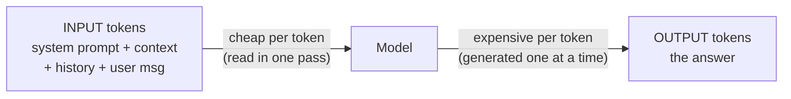
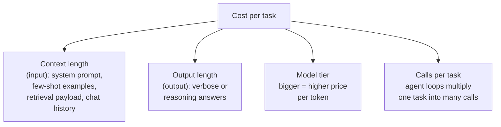
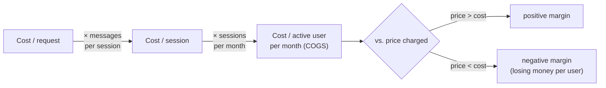
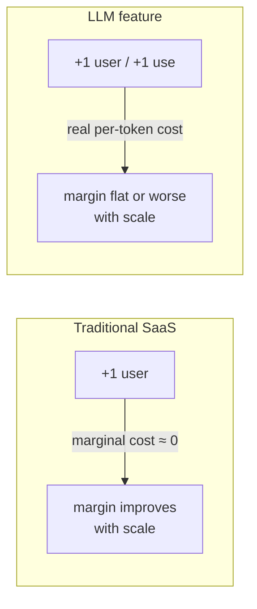
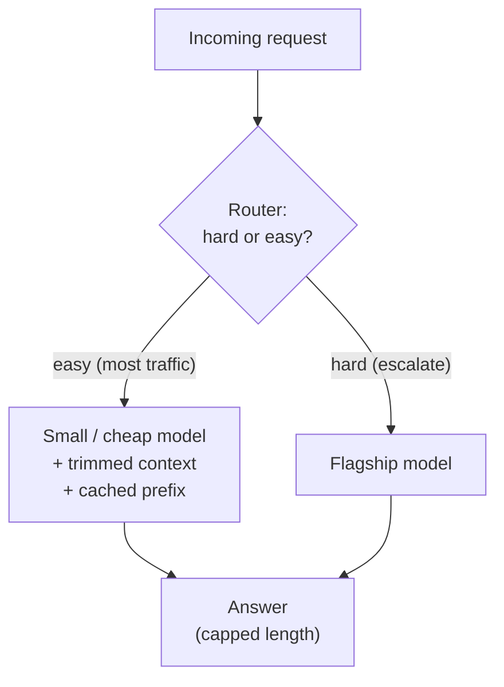

# Cost and unit economics

## The problem it solves

Your team ships an AI feature and it is a hit. Usage climbs, the demo dazzles the board, adoption charts point up and to the right. Then finance pulls you into a room with a different chart: the inference bill, tracking usage just as steeply. You dig in and find the ugly truth — your heaviest, happiest users, the ones the growth team is celebrating, are the ones losing you the most money. Every message they send costs you real cash, and they send a lot of messages, and the flat monthly price they pay stopped covering their usage weeks ago. The feature is *succeeding its way into a bigger loss*.

This is the moment a product manager (PM) discovers that AI features do not obey the economics they learned building normal software. In traditional software, once the thing is built, one more user costs you essentially nothing — a rounding error of servers and bandwidth. With a large language model (LLM) — the AI system that generates text a piece at a time — that assumption is dead. Every single interaction runs a model that charges by the amount of text it reads and writes. Growth does not automatically fatten your margins; left unmanaged, it can eat them.

**Cost and unit economics** is the money model of an LLM feature: what one request costs, how that rolls up to a cost per user per month, whether that number sits below or above the price you charge, and which levers move it. It is the difference between a feature that gets *more* profitable as it scales and one that quietly bleeds faster the more people love it. Getting this wrong is not a technical failure — it is a business one, and increasingly it is the PM who is expected to have seen it coming.

> [!NOTE]
> **Token** — an LLM does not read or write whole words; it breaks text into small chunks called tokens (roughly ¾ of a word each, so ~750 words ≈ 1,000 tokens). Tokens are the fundamental unit of both computation and billing: providers charge per token, in and out. *What* a token is and how text gets split into them is its own topic — see [tokenization](../01-foundations/01-tokenization.md). Here we care only that the token is the unit the meter counts.

## The one analogy to remember

**The picture:** the electricity meter on the side of a house. Every light you switch on, every appliance you run, spins the dial and adds to a bill you pay at the end of the month — per kilowatt-hour, every hour, forever. Now contrast the house next door on an all-you-can-stream flat subscription: they pay one fixed fee and then watch as much as they want at zero extra cost. The meter house pays for *consumption*; the subscription house paid once for *access*.

**The mapping:** the electricity meter = per-token billing; a kilowatt-hour = a token (or a thousand tokens); running more appliances = longer prompts, longer answers, more calls; the monthly electric bill = your inference cost of goods sold (COGS); the flat streaming subscription next door = traditional SaaS (Software as a Service), where usage after sign-up is nearly free.

**Why it holds:** the meter charges for every unit consumed because each unit genuinely costs the utility something to deliver — there is no "free" electricity once the plant is built, unlike a stream that costs the same whether watched or not. That is exactly the structural fact about LLMs: each token is real compute on an expensive chip, a genuine marginal cost incurred *every* time, which is why an LLM feature behaves like a metered utility and not like the flat-fee software PMs are used to.

**Say it like this:** "A normal app is like a flat streaming subscription — build it once, and extra users cost you almost nothing. An AI feature is like a house on an electricity meter — every single interaction spins the dial, so heavy users run up a real bill whether or not they pay you more."

*Where it breaks:* a utility bills you at cost-plus and reliably makes money on every unit; you set your *own* price against the meter, so if you priced flat while your costs meter, you can end up like a landlord who included utilities in a fixed rent and watches a tenant run the air conditioning all summer.

## Tokens are the unit of cost — and input is not priced like output

Everything downstream starts here: providers bill by the token, and they bill **input tokens and output tokens at different rates.** Input tokens are everything you send *in* — the user's message plus the system prompt, instructions, retrieved documents, chat history, examples. Output tokens are what the model *generates* back. And output tokens are typically several times more expensive than input tokens — often in the range of 3× to 5×, though the exact multiple varies by provider and model.

Why the asymmetry? It traces to how the model does the two jobs, a distinction that lives in the [inference-optimization](49-inference-optimization.md) and [KV-caching](../05-prompting/30-kv-caching.md) lessons but matters to the money here. Reading the input (the "prefill" phase) is done in one parallel pass over all the input tokens at once — efficient, cheap per token. Generating the output is sequential: the model produces one token, then feeds it back to produce the next, one expensive step at a time, and it cannot parallelize because token 51 depends on token 50 existing. More work per token, less able to share it — so output costs more.

The PM consequence is sharp and non-obvious: **the two levers you have are not equally priced.** A thousand extra tokens of retrieved context (input) and a thousand extra tokens of chatty answer (output) do not cost the same — the answer costs several times more. So "make the model less verbose" is often a bigger cost win than "trim the prompt," even though both are trimming tokens. Anyone who reasons about cost as one undifferentiated "token count" is missing where the money actually goes.

## The cost drivers: what actually spins the meter

Cost per request is, roughly, `(input tokens × input price) + (output tokens × output price)`. Four things drive those token counts up, and a PM should be able to name all four because each has a different owner and a different fix.

- **Context length (input side).** Everything you stuff into the prompt is paid for on every single call. A long system prompt, a handful of few-shot examples, a big retrieved-document payload, and a growing chat history all pile onto the input count. The quiet killer is chat history: in a long conversation, you typically re-send the *entire* transcript each turn, so a 20-message conversation pays for message 1 nineteen more times. Context is capped by the model's [context window](../01-foundations/05-context-windows.md), but cost bites long before that ceiling.
- **Output length (output side).** Longer answers cost more, at the premium output rate. This is why "reasoning" models — which think in long chains before answering, covered in [reasoning models](../03-reasoning-generation/18-reasoning-models.md) — can be dramatically more expensive per query: all those thinking tokens are billed output tokens. Verbosity is a direct cost line.
- **Model tier / size.** Bigger, more capable models charge more per token — sometimes 10× or more between a provider's small and flagship tiers. Choosing the model is choosing a price point.
- **Calls per task.** One user action does not always equal one model call. An [agentic system](../06-agents/34-agentic-systems.md) that plans, calls tools, observes results, and re-plans might make five, ten, or fifty model calls to complete a single user request — and each call re-sends the accumulated context. Agent loops are a cost *multiplier*, not an addition, which is why an agent feature can cost 20× a simple chat feature for the same user-visible outcome.

The framing to carry: **cost is a product of choices you make**, most of them in the prompt and the orchestration, not a fixed property of "using AI." That is what makes it a PM lever and not just an engineering line item.

## From cost-per-request to unit economics

A single request costing a fraction of a cent sounds like nothing. Unit economics is the discipline of *not* stopping there — of rolling that number up until it collides with the price you charge.

The rollup is a chain: **cost per request → cost per session → cost per active user per month.** A user sends several messages per session, has several sessions per month, and each message may trigger multiple calls with growing context. Multiply it through and a "fraction of a cent" per request can become dollars per user per month. Now put that next to what you charge:

**Gross margin** is the fraction of revenue left after the cost of delivering the service — here, dominated by inference COGS. **COGS (Cost Of Goods Sold)** is the direct cost of producing what you sold; for an LLM feature, the model bill *is* the COGS, which is why finance now treats inference like a raw-material cost rather than a fixed overhead. In classic SaaS, gross margins run 80–90% because delivery is nearly free. An LLM feature can run far lower, and — the part that stuns people — **margin can go negative on your heaviest users.**

Here is why that is structural, not a pricing typo. If you charge a **flat** monthly fee, revenue per user is constant while cost per user scales with how much they use it. There is a break-even usage level; below it a user is profitable, above it they lose you money. In flat-fee SaaS this never mattered because heavy usage was free to serve. With metered inference, your *best-engaged* users — the power users every PM is trained to cultivate — can be exactly the ones underwater. Average cost-per-user hides this completely; the distribution is what bites, because a small tail of extreme users can consume most of the cost.

## The killer structural point: marginal cost is not zero

This is the one idea that reframes everything, and the single most valuable thing to be able to say cleanly in an interview.

**Traditional software has near-zero marginal cost.** Once built, serving one more user — or letting an existing user do one more thing — costs almost nothing. That single fact is why software is such a good business: revenue scales while costs stay flat, so growth mechanically improves margins and scale is pure upside.

**An LLM feature breaks that.** Every interaction is real compute on expensive hardware, so every interaction has a real, non-trivial marginal cost. The bill scales *with usage*, not with headcount. This inverts several instincts a software PM holds as gospel:

- **Growth doesn't automatically improve margins, and can worsen them.** More usage means more cost in lockstep with more revenue at best — and if pricing is flat, more cost *without* more revenue.
- **Engagement is not free.** "Users love it and use it twice as much" is a cost event, not just a delight metric. The thing you optimize for now has a variable price tag.
- **Free tiers are a real, metered liability.** A free user in classic SaaS costs pennies; a free user hammering an LLM feature runs up a genuine bill with no offsetting revenue. Free tiers must be capped in tokens/calls, not just in features.
- **Pricing has to reckon with usage.** Pure flat pricing exposes you to power-user losses; pure usage-based pricing (charge per token/message/credit) aligns cost with revenue but scares users with unpredictable bills. Most real products land on a hybrid — a base fee plus metered overage, or tiered usage caps — precisely to keep the meter from running past the price.

Say it in one line: **"AI features have SaaS revenue but utility-style costs, so scale is not automatically your friend — you have to engineer the margin, it doesn't come free."** That sentence signals you understand the business model, not just the technology. It's also why cost sits as one vertex of the [iron triangle](../11-product-strategy/55-iron-triangle.md) of quality, cost, and latency, and why it heavily drives the [build-vs-buy](../11-product-strategy/53-build-vs-buy.md) decision at scale.

## The levers to cut cost — each a trade, not a free win

When the margin is thin, you reach for cost levers. The mature framing is that every one of these buys cheaper tokens at some cost in **quality, latency, or engineering effort** — there is no free lunch, only trades you choose deliberately. Name them; the mechanisms live in their own lessons.

- **Trim context.** Shorter system prompts, fewer few-shot examples, tighter retrieval payloads, summarizing or truncating old chat history instead of re-sending it all. Directly cuts input tokens on every call. *Trade:* cut too much and you starve the model of the context it needs, hurting quality.
- **Prompt caching.** When a large chunk of the prompt is stable across calls (a big system prompt, a fixed document), the provider can cache that prefix so you don't pay full price to re-process it every time. *Trade:* only helps for repeated stable prefixes, and cache reads/writes have their own pricing. Mechanism in [prompt caching](../05-prompting/31-prompt-caching.md) and [KV caching](../05-prompting/30-kv-caching.md).
- **Model routing / cascades.** Send the request to a cheap small model first; only escalate to the expensive flagship when the cheap one isn't confident or the task is genuinely hard. Most traffic is easy, so most of it gets served cheaply. *Trade:* added complexity, and the risk of routing a hard query to the weak model and getting a worse answer.
- **Smaller / distilled / fine-tuned models.** A small model that has been [fine-tuned](../02-model-behavior-training/07-fine-tuning.md) or [distilled](../02-model-behavior-training/13-distillation.md) for your specific task can often match a big general model on that task — replacing "big model + long instructional prompt" with "small model that already knows the job," which cuts both the tier price and the prompt length. [Quantization](../02-model-behavior-training/14-quantization.md) shrinks the model further. *Trade:* upfront investment and narrower competence.
- **Cap output length.** Set a maximum on tokens generated, and prompt for brevity. Since output is the premium-priced side, this is often the highest-leverage single knob. *Trade:* truncated or terse answers if set too aggressively.
- **Batching.** For non-interactive, offline work (summarize a backlog overnight), group requests to run at higher throughput and lower cost per token. *Trade:* latency — useless for anything a user is waiting on. Mechanism in [inference optimization](49-inference-optimization.md).

The through-line: these are dials, not switches. A PM's job is to know which one to reach for given whether the pressure is on cost, quality, or speed — and to measure the effect live through [observability](50-observability.md), which is how you even *see* cost per request in production.

## Summary / Points to Remember

- **The token is the unit of cost.** Providers bill per token, and **output tokens cost several times more than input tokens** (output is generated one slow step at a time; input is read in one pass). So cutting verbosity often beats trimming the prompt dollar-for-dollar.
- **Four drivers spin the meter:** context length (input), output length (output), model tier, and calls per task. **Agent loops multiply calls** and re-send context each time — the biggest hidden cost multiplier.
- **Unit economics is the rollup:** cost per request → per session → **per active user per month**, set against the price you charge. Average cost hides the danger; the **power-user tail** is where margin goes negative under flat pricing.
- **The structural point:** traditional software has ~zero marginal cost, so growth improves margins; an LLM feature has **real usage-scaling marginal cost**, so growth does *not* automatically help and can hurt. "SaaS revenue, utility costs."
- **COGS now includes inference.** Finance treats the model bill like a raw material, which is why gross margin on AI features can be far below the 80–90% SaaS norm — and why pricing (flat vs. usage-based vs. hybrid) and free-tier caps are cost decisions, not just growth ones.
- **The levers are trades, not free wins:** trim context, prompt caching, model routing/cascades, smaller/distilled/fine-tuned models, capped output, batching — each buys cheaper tokens at some cost in quality, latency, or effort. Pick the dial that matches the pressure.

## Interview Questions That Stump People

**Q: "Your AI feature's usage is growing fast. That's great for the business, right?"**

**Interviewer:** Adoption on our AI feature is climbing every week. That's unambiguously good news, isn't it?

**You:** It's good news for revenue and product-market fit, but I'd want to check it isn't *bad* news for margin before I celebrate — and that's not a reflex a software PM usually has. Unlike normal software, where serving more usage costs basically nothing, every interaction here runs a model that charges per token, so cost scales right along with usage. If we're on flat pricing, growing usage from existing users grows our cost with no extra revenue. So the question I'd ask is: what's the cost per active user per month, how is it distributed, and where does it cross the price we charge? Growth is only unambiguously good once I know we make money — or at least don't lose it — on the marginal heavy user.

> [!TIP]
> **Why this answer works:** The trap is answering with the SaaS instinct that growth always improves margins. Flagging that LLM features have real marginal cost — "SaaS revenue, utility costs" — and immediately asking about the per-user cost distribution shows you understand the business model, not just the excitement. It signals you'd catch a margin problem before finance does, which is exactly the judgment the question is probing.

---

**Q (clarify-back): "We need to cut the cost of our AI feature by 30%. What do you cut?"**

**Interviewer:** The inference bill is too high. Get it down 30%. Where do you start?

**You (clarify back):** Before I pick a lever — do we know where the cost actually is right now? Specifically, is it dominated by input tokens (long prompts, big retrieval, chat history), by output tokens, by the model tier we're on, or by how many model calls each task makes?

**Interviewer:** Most of it is a big retrieved context we send on every call, and we're using the flagship model for everything.

**You:** Then I'd go after those two directly rather than reaching for a generic fix. First, model routing: if we're sending *every* request to the flagship, most requests are probably easy enough for a cheaper model — route those down and only escalate hard ones, which alone can move the number a lot. Second, the retrieval payload: trim how many chunks we send and cache the stable part of the prompt so we're not re-paying to process it every call. I'd sequence it by measuring the split first, because if I'd guessed "make the model less verbose" — cutting output — but the cost is really all in input context, I'd have optimized the wrong side. The reason I clarified is that "cut cost" has a different answer depending on which of the four drivers dominates.

> [!TIP]
> **Why this works:** "Cut cost 30%" has no universal answer — the right lever depends entirely on which driver dominates, and blurting one out would reveal you don't reason from a cost breakdown. Clarifying which of input/output/tier/calls is the bottleneck pins the variable, and then naming the *matching* levers (routing and context trim for a tier-plus-context problem) shows you map fixes to causes. It also signals you'd instrument before you optimize.

---

**Q: "Why would output tokens cost more than input tokens? A token is a token."**

**Interviewer:** Providers charge more for output than input. Isn't that arbitrary pricing?

**You:** It's not arbitrary — it falls out of how the model does the two jobs. Reading the input happens in a single parallel pass over all the input tokens at once, so it's cheap per token. Generating the output is sequential: the model produces one token, feeds it back in, produces the next, and so on — it literally can't make token 51 before token 50 exists. So each output token is a full step through the model that can't be shared or parallelized the way input processing is. More work per token, less amortization, higher price. The practical upshot for a PM is that input and output aren't interchangeable cost-wise — often 3-to-5× apart — so reining in a verbose model can save more than trimming an equally long prompt. Reasoning models make this vivid: all their "thinking" is billed output tokens, which is why they can be so much more expensive per query.

> [!TIP]
> **Why this answer works:** The naive view is that a token is a token and the pricing is a vendor whim. Explaining the parallel-prefill vs. sequential-decode mechanism shows you know *why* the asymmetry exists, and the payoff line — that cutting output beats cutting input dollar-for-dollar — proves you can turn that mechanism into a cost decision. Connecting it to reasoning-model cost is the flourish that shows range.

---

**Q: "We're moving from a chat feature to an agent that does the task end-to-end. How does that change our cost model?"**

**Interviewer:** We're upgrading our simple chat assistant into an agent that plans and uses tools autonomously. What happens to cost?

**You:** It can jump by an order of magnitude, and the reason is that an agent turns one user request into *many* model calls instead of one. A chat feature is roughly one call per user message. An agent plans, calls a tool, reads the result, re-plans, maybe calls another tool — five, ten, fifty calls to finish one task. And it's worse than just "more calls," because each step re-sends the accumulated context — the original request plus everything observed so far — so the input tokens grow with every loop. So the cost isn't additive, it's multiplicative: calls times a growing context. That doesn't mean don't build the agent — it might deliver far more value per task — but I'd size the per-task cost explicitly, put a cap on the number of loop iterations so a runaway agent can't rack up an unbounded bill, and re-check unit economics against price, because the break-even usage per user just moved a lot.

> [!TIP]
> **Why this answer works:** Many candidates think of agent cost as "a few more calls." Naming the *multiplicative* structure — calls × growing context per step — shows you understand where agent bills actually explode, and mentioning an iteration cap shows you know the runaway-loop failure mode that produces surprise five-figure bills. Tying it back to break-even and unit economics keeps it a business answer, not just a technical one.

---

**Q (clarify-back): "Should we price this feature flat or usage-based?"**

**Interviewer:** We're setting pricing for the AI feature. Flat monthly fee, or usage-based?

**You (clarify back):** What does our usage distribution look like — is consumption fairly even across users, or is there a heavy tail of power users who use it far more than the median?

**Interviewer:** There's a real tail — a small group uses it many times more than the typical user.

**You:** Then pure flat pricing is dangerous, because with metered inference cost, that heavy tail is exactly where margin goes negative — you'd be subsidizing your most active users with everyone else's fees, and the more they love it the more you lose. But I'd also hesitate on pure usage-based pricing, because unpredictable per-token bills scare users and dampen the engagement we want. So I'd propose a hybrid: a flat base fee that covers typical usage cleanly, plus metered overage or usage tiers above a generous cap, so the base stays simple for the median user while the tail's cost is recovered instead of eaten. And I'd cap the free tier in tokens or calls, not just features, since a free power user is pure cost. The distribution is what makes flat unsafe here — if usage were even, flat would be fine.

> [!TIP]
> **Why this works:** "Flat or usage-based" has no right answer without knowing the usage distribution — that's the variable that decides whether flat pricing exposes you to power-user losses. Clarifying it first signals you've seen this failure. The hybrid recommendation shows you're balancing the real tension — flat is simple but unsafe on the tail, usage-based is safe but scary — rather than reciting one model, and the free-tier-cap point proves you treat every un-priced interaction as a metered liability.
