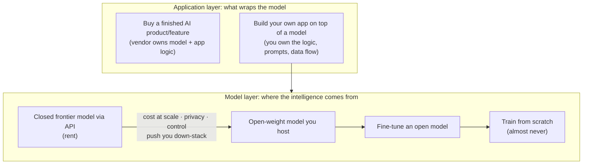
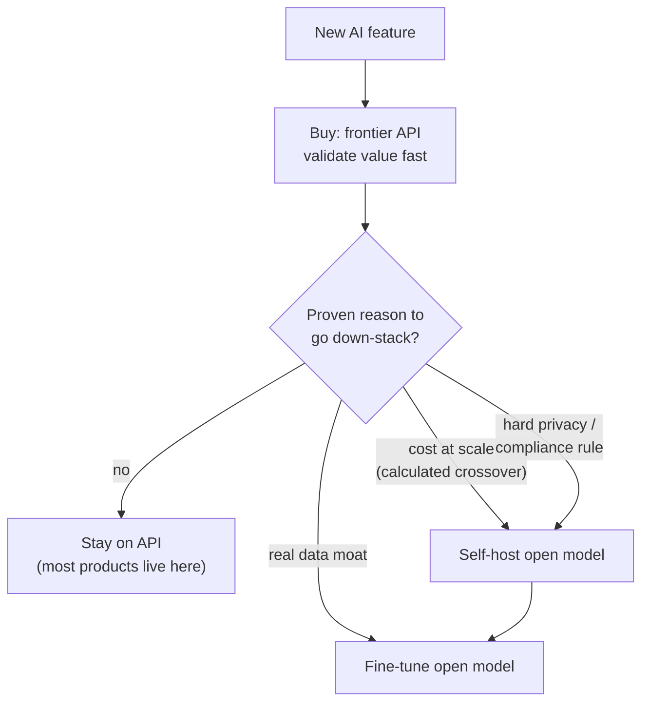

# Build vs. buy

## The problem it solves

You're a product manager (PM) and the mandate lands: "put AI in the product." Almost immediately you're staring at a fork that feels binary and irreversible. On one side, a salesperson says just call a **frontier model** — a top-tier, general-purpose model like the ones from the big labs — over its **API** (Application Programming Interface, the paid endpoint you send text to and get text back from) and ship next week. On the other, an engineer wants to host an open model, and someone senior floats "shouldn't we train our *own* model so we own the intellectual property (IP)?" Each option carries a wildly different cost curve, a different risk profile, and a different answer to the question your CEO will actually ask: *what here is ours, and what are we renting?*

The trap is treating this as one yes/no switch — build or buy — when it's really a **stack of graded choices**, and getting the altitude wrong is expensive in a way that's hard to reverse. Pick "train our own model" when a hosted API would have done, and you've burned a year and your runway differentiating on something customers never cared about. Pick "buy the finished AI feature" when the AI *was* your product, and you've outsourced your only moat to a vendor. Build vs. buy is the discipline of deciding, layer by layer, how far down the stack you go — and stopping the moment further descent stops paying for itself.

## The one analogy to remember

**The picture:** how you get somewhere to live. Most people *rent* — you move in next week, the landlord fixes the boiler, and you can leave when the place stops fitting; the trade is that you pay every month forever and can't knock down a wall. Some eventually *buy* a house — more control, you can renovate it to your needs, and over a long enough horizon owning can beat renting — but now the roof and every repair are yours. Almost nobody *builds a house from scratch on raw land* — the time, capital, and expertise only make sense if construction itself is your business.

**The mapping:** renting = calling a frontier model's API (move in fast, someone else owns the upkeep, you pay every month, limited control); buying a house = self-hosting an open-weight model (more control and privacy, but the upkeep is now yours); renovating the house you bought = fine-tuning that open model to your domain; building from scratch on raw land = training a foundation model from scratch; "is this just where I live, or is real estate my business?" = **is the AI a commodity feature or my core differentiation?**

**Why it holds:** the deciding question in both worlds is identical — *is this capability the thing that makes me special, or is it undifferentiated infrastructure everyone needs?* You take on ownership (build) only where owning the layer is a genuine advantage; everywhere else, ownership is just cost and distraction dressed up as control. Note how the rungs sit naturally: renovating a place you already own (fine-tuning) is a bounded, often-sensible step, whereas erecting a building from bare ground (pretraining) is a different universe of cost you'd shoulder only if construction were the business itself — which for an application company it isn't.

**Say it like this:** "You rent your home unless real estate *is* your business — you move in fast and let the landlord own the upkeep. Same with AI models: rent the frontier model unless the model itself is your edge, which for most products it isn't."

*Where it breaks:* a rented apartment is basically identical to the one next door and doesn't get better while you sleep, whereas rented AI models differ sharply in quality and improve monthly — so *which* model you rent is a live product decision, not a routine lease signing.

## Two decisions, not one

The single most useful reframe: build vs. buy in AI is **two stacked decisions**, and conflating them is where PMs get lost.

1. **The model layer** — where does the intelligence come from? A spectrum from renting the smartest general model to owning one you trained.
2. **The application layer** — do you buy a finished AI product/feature that already wraps a model, or do you build your own application logic on top of a model you chose in decision 1?

You can mix freely: most successful AI products today are **build the application layer, buy the model layer** — your own product wrapped around a rented frontier model. Buying a finished feature makes sense for genuine commodities (a spam filter, a transcription widget); building your own app is right when the *way you apply* the AI is your value even if the underlying model is rented.

## The model-layer spectrum

Within the model layer, the four options are a descent, each rung buying more control at the price of more ownership burden.

- **Closed frontier model via API (buy).** You send requests, the provider runs the model. Highest quality available, zero infrastructure, you ride the provider's improvements for free, fastest to ship. You pay per token as **operating expense (opex)** — a variable cost that scales with usage — and you accept a dependency on a third party for uptime, pricing, and where your data goes.
- **Open-weight model you host.** You take a model whose weights are publicly released and run it on your own (or rented) infrastructure. You gain control and can keep data in-house, but you've signed up to own serving, scaling, uptime, and the [inference-optimization](../10-production-ops/49-inference-optimization.md) work of making it fast and cheap enough — a real, ongoing engineering commitment.
- **Fine-tune an open model.** Host an open model *and* adapt it to your domain or style. This is its own deep topic — see [Fine-tuning](../02-model-behavior-training/07-fine-tuning.md) and the parameter-efficient variants [PEFT](../02-model-behavior-training/08-peft.md) and [LoRA](../02-model-behavior-training/09-lora.md). The build-vs-buy point is only that it sits one rung down: more control and potential differentiation, more data and maintenance burden.
- **Train a foundation model from scratch (almost never).** Build the model itself from raw data. The cost, talent, and time here belong to a handful of labs — see [Pretraining vs. post-training](../01-foundations/06-pretraining-vs-posttraining.md) for why this is a different universe of spend. For essentially every product company, this is off the table; the trap is discussed below.

## The decision axes

You choose your rung by weighing a fixed set of forces. A PM should be able to name these and say which way each one pushes.

- **Differentiation.** *The* axis. Is the AI your core value, or a commodity feature every competitor also has? If the model itself isn't your edge, owning it is pure cost. You build down-stack only where doing so creates advantage customers can feel. This couples tightly to whether you have a real [data moat](54-data-moats.md) — a proprietary data advantage that makes *your* adapted model genuinely better than the rented one.
- **Cost at scale.** Renting is opex that scales linearly with usage; self-hosting trades that for **capital expenditure (capex)** and fixed operational cost. At low volume, API wins easily. At very high, steady volume, self-hosting *can* undercut per-request cost — but only after you clear the ops overhead. The crossover is a real calculation, not a vibe; see [Cost and unit economics](../10-production-ops/51-cost-unit-economics.md).
- **Control, privacy, and compliance.** Some data can't leave your walls — regulatory data residency, contractual no-third-party terms, sensitive [personally identifiable information (PII)](../08-safety-trust/43-privacy-pii.md). If a hard requirement forbids sending data to an external API, that alone can force self-hosting regardless of every other axis.
- **Speed to market.** Buying ships in days; building down-stack adds weeks to months of infrastructure before you learn whether the feature is even wanted. Early, speed usually dominates.
- **Quality ceiling.** Today the frontier closed models generally set the quality bar, so buying often gives you the *best available* quality with no effort, whereas an open model you host may trail — a reason buying wins early even setting cost aside.
- **Switching cost / vendor lock-in.** Building deeply on one provider's API, quirks, and pricing creates lock-in. The mitigation is an abstraction layer so you can swap models — but note the whole market is a fast-moving dependency either way.
- **Maintenance burden.** Buy, and the provider owns the treadmill of keeping the model current. Self-host, and *you* own it — models improve monthly, and a self-hosted model is a snapshot that silently falls behind unless you keep re-investing. This is the cost teams most reliably underestimate.

## The default, and why: start by buying

For most teams the right first move is unambiguous: **start by buying — call a frontier API — to validate that the AI delivers value at all.** The reasoning is a chain worth being able to recite:

Building or self-hosting early rarely differentiates (the model isn't yet your edge), it's slow (infrastructure before validation), and it burns runway on a bet you haven't yet proven customers want. Buying is fast, gives you the highest quality with no ops, and — crucially — the API-vs-self-host decision is **reversible**: you can start on the API and migrate down-stack later once you have real usage data telling you *why* you should. So you buy first, ship, learn, and **move down-stack only where a proven, specific reason justifies it** — a cost-at-scale crossover you've actually calculated, a hard privacy requirement, or a genuine data moat that makes a fine-tuned model measurably better.

The framing that separates a knowledgeable PM: **descend the stack only when a concrete reason forces you, never by default or for the feeling of ownership.**

## The "train your own foundation model" trap

The most expensive mistake in this space is a company whose product is *an application* deciding to train its own foundation model "to own the IP" or "to be independent of vendors." For essentially every non-lab company this is a trap, and a PM should be able to shut it down calmly. Training a competitive foundation model requires enormous compute, a scarce specialized team, a massive curated dataset, and many months — during which the frontier labs, whose entire business is exactly this, will lap whatever you produce. You'd spend your whole runway to build something *worse* than what you could rent, differentiating on a layer your customers never asked you to own.

The legitimate exceptions are narrow: you *are* a model lab, or you have a truly unique large-scale dataset and the capability, and the model itself is the product. For everyone else, "let's train our own model" almost always means someone is optimizing for a feeling of control rather than for the outcome. Note the crucial distinction: *fine-tuning* an existing open model on your data (down-stack, but cheap and bounded) is a completely different, often-reasonable decision — see [Fine-tuning](../02-model-behavior-training/07-fine-tuning.md) — from *pretraining* one from scratch. Conflating "train a model" (scratch, a trap) with "fine-tune a model" (adaptation, sometimes right) is exactly the confusion that makes this conversation go wrong.

## The PM lens

- **Reversible vs. one-way door.** Borrowing the framing: buying first is a *reversible* door — you can migrate off the API later. Committing early to self-hosting or, worse, training from scratch is closer to a *one-way door* — expensive and slow to undo. When a decision is reversible and you're uncertain, take the fast reversible path (buy) and learn; reserve slow, deliberate analysis for the one-way doors.
- **Total cost of ownership (TCO) beyond the sticker price.** The API's per-token price looks like the whole cost of buying; self-hosting's server bill looks like the whole cost of building. Both are wrong. **TCO** means counting everything: for self-hosting, the engineering salaries to build and run serving, the ops and on-call burden, the maintenance treadmill of staying current, and the opportunity cost of that team not building product. A self-hosted model that looks cheaper per request often loses on TCO once you price the humans.
- **How it couples to moats and unit economics.** Going down-stack only pays off where it compounds: a [data moat](54-data-moats.md) makes a fine-tuned model better *and* better over time, and a favorable cost-at-scale crossover improves [unit economics](../10-production-ops/51-cost-unit-economics.md) permanently. Absent one of those, descending the stack is cost without compounding return. This also sits inside the broader product-strategy tensions — see the [iron triangle](55-iron-triangle.md) of quality, cost, and speed. For the surrounding build decisions once you *are* building on a model, see [production architecture](../10-production-ops/48-production-architecture.md).
- **A related but separate decision:** "fine-tune vs. retrieve" (adapting the model vs. fetching facts at query time via **RAG (Retrieval-Augmented Generation)**, covered in [RAG](../04-retrieval-knowledge/21-rag.md)) is often confused with build-vs-buy. It's a different question — *how* to make a model know your stuff — that lives inside the "build on top of a model" branch, not the model-layer descent.

## Summary / Points to Remember

- **It's not binary — it's a stack of graded choices across two layers.** The *model layer* (closed API → self-hosted open → fine-tuned open → trained-from-scratch) and the *application layer* (buy a finished feature vs. build your own on top of a model). Decide each separately.
- **The default is buy: start on a frontier API to validate value fast**, because building rarely differentiates early, is slow, and burns runway — and the buy-first path is *reversible*.
- **Descend the stack only for a proven, specific reason:** a calculated cost-at-scale crossover, a hard privacy/compliance requirement, or a real data moat — never for the feeling of ownership.
- **The deciding axis is differentiation:** own the layer only where owning it is your edge. "You rent your home unless real estate *is* your business."
- **Training your own foundation model from scratch is a trap** for any non-lab company — enormous cost and time to build something worse than you could rent. This is completely distinct from *fine-tuning* an open model, which is cheap, bounded, and sometimes right.
- **Price TCO, not the sticker.** Self-hosting's real cost is the engineers, the ops, and the maintenance treadmill of staying current as models improve monthly — not just the server bill.

## Interview Questions That Stump People

**Q (clarify-back): "We're adding an AI feature. Should we build it or buy it?"**

**Interviewer:** We want AI in the product. Do we build it ourselves or buy something off the shelf?

**You (clarify back):** Two quick questions before I answer, because "build vs. buy" is really two decisions: is this AI capability meant to be our *core differentiation*, or a commodity feature customers expect but won't choose us for — and do we have any hard constraint, like data that legally can't leave our systems?

**Interviewer:** It's a differentiator — the way we apply it is our pitch. No unusual data constraints.

**You:** Then I'd split it by layer. At the application layer, build — if the way we apply the AI is our pitch, buying a finished feature would hand our differentiation to a vendor. At the model layer, buy: start on a frontier API. The application logic, the prompts, the data flow are where our edge lives, and a rented model is the fastest, highest-quality way to power it while we validate. I would *not* self-host or train a model early — that's cost and delay on a layer that isn't our differentiation. If we'd had a hard privacy constraint, my model-layer answer might flip to self-hosting regardless of cost. So: build the app, rent the model, and only go down-stack later if a concrete reason shows up.

> [!TIP]
> **Why this works:** "Build or buy?" sounds binary but has no single answer until you separate the two layers and pin down differentiation and constraints — answering immediately would expose you as treating it as one switch. Clarifying signals you know it's a stack of decisions, not a coin flip. The strong final answer — build the layer that's your edge, buy the layer that isn't — is the exact judgment the question is testing, and naming how a privacy constraint would flip it proves you understand *why*, not just *which*.

---

**Q: "When would you actually self-host an open model or train your own, instead of just using an API?"**

**Interviewer:** You keep saying "buy the API." When is that the *wrong* call — when do you go down-stack?

**You:** Three proven reasons, and I'd insist on one before descending. First, cost at scale: at very high, steady volume, per-token API opex can exceed the fully-loaded cost of self-hosting — but that's a crossover I calculate with real usage numbers and total cost of ownership including the engineers, not a hunch. Second, a hard privacy or compliance requirement: if data legally or contractually can't go to a third party, that forces self-hosting regardless of every other axis. Third, a real data moat: if we have proprietary data that makes a fine-tuned open model measurably better than the frontier model, fine-tuning captures differentiation renting can't. Training a foundation model *from scratch*, though — that I'd reserve for a company that is itself a model lab or sits on a truly unique dataset. For a normal product company it's a trap: you'd spend your runway building something worse than you could rent. Note "self-host," "fine-tune," and "train from scratch" are three different rungs — I'd only go as far down as the specific reason justifies.

> [!TIP]
> **Why this answer works:** The naive answer is a vague "when it's cheaper" or an eager "to own our IP." The strong move is to give the three *specific* triggers — calculated cost crossover, hard privacy rule, real data moat — and to sharply separate self-hosting and fine-tuning (sometimes right) from training-from-scratch (almost never). Insisting on a *proven* reason and pricing TCO signals you treat descending the stack as a cost to be justified, not a prize, which is exactly the seniority the question probes.

---

**Q: "Our board wants us to train our own model so we're not dependent on a vendor and we own the IP. How do you respond?"**

**Interviewer:** Leadership is nervous about depending on an outside model provider. They want us to train our own so we control our destiny. Your take?

**You:** I'd take the concern seriously but separate the fear from the fix. The real worry is dependency and control — legitimate. But training a foundation model from scratch is the wrong remedy for a company whose product is an application: it needs enormous compute, a scarce specialized team, and many months, during which the labs whose entire business is this will out-run whatever we build. We'd spend our runway to ship something worse than we can rent today, and differentiate on a layer our customers never asked us to own. If the goal is reducing lock-in, the right moves are an abstraction layer so we can swap providers, and possibly self-hosting or fine-tuning an *open* model — that gets us control and independence without pretending to be a model lab. And I'd name the distinction explicitly, because it's usually where this conversation confuses itself: fine-tuning an existing open model is cheap and bounded; pretraining one from scratch is a different universe of cost. Owning IP feels like control, but here it mostly means owning a treadmill we can't afford to run.

> [!TIP]
> **Why this answer works:** The trap is either capitulating to a prestige project or dismissing leadership's fear outright. The strong move validates the underlying concern (dependency) while reframing the proposed solution as the wrong tool, and offers the *actual* levers for independence — abstraction layer, self-host/fine-tune an open model. Explicitly separating "fine-tune" from "train from scratch" defuses the most common confusion driving these requests and shows you can manage up without either rolling over or being contrarian.

---

**Q: "Self-hosting is cheaper per request than the API at our volume. Isn't that the whole decision?"**

**Interviewer:** We ran the numbers — our own servers cost less per request than the API at our scale. So we should self-host, right?

**You:** Per-request server cost isn't the whole cost, so I'd slow down before committing. The honest comparison is total cost of ownership: on top of the servers, self-hosting adds the engineers to build and operate serving, the on-call and ops burden, and — the one teams most underestimate — the maintenance treadmill. A self-hosted model is a frozen snapshot, and frontier models improve monthly; staying competitive means continually re-investing, or quietly falling behind while the API users get better for free. Once I price the humans and that treadmill, the per-request win often shrinks or reverses. I'd also weigh that this is a fairly one-way door — building the infra is slow to undo — so I'd want the TCO advantage to be clear and durable, not marginal. If after all that self-hosting still wins decisively at our steady volume, great, it's justified. But "cheaper per request" alone isn't the decision; it's one line in it.

> [!TIP]
> **Why this answer works:** The question baits you into treating a single favorable metric as conclusive. The strong answer widens the frame to TCO — engineers, ops, and especially the maintenance treadmill of a snapshot model falling behind a fast-improving frontier — which is precisely the cost self-host advocates forget. Adding the reversible-vs-one-way-door lens shows you weigh not just the number but the *shape* of the commitment, which is what separates a real cost analysis from a spreadsheet cell.

---

**Q: "Why not just fine-tune a model for everything instead of dealing with prompts and APIs?"**

**Interviewer:** If we're going down-stack anyway, why not fine-tune our own model for every feature and be done with it?

**You:** Because fine-tuning everything solves a problem most features don't have, while taking on costs they can't justify. Fine-tuning earns its place when you have a stable, high-volume behavior *and* proprietary data that makes the adapted model genuinely better — a data moat. Most features have neither early on; for them a rented frontier model behind good prompts is faster, higher-quality, and stays current for free, while a fine-tune is a snapshot you must maintain. There's also a category error hiding in "fine-tune for everything": fine-tuning reshapes *behavior*, it doesn't reliably teach *new facts* — if the gap is knowledge, the tool is retrieval, or RAG, not fine-tuning. So I treat fine-tuning as a targeted move down-stack for the specific features where a data moat and stable behavior justify it, not a blanket strategy. Defaulting to fine-tune everything is descending the stack for its own sake — the exact instinct build-vs-buy discipline is meant to resist.

> [!TIP]
> **Why this answer works:** The question smuggles in "down-stack is better, so do it everywhere." The strong move refuses the premise on two fronts: economically (fine-tuning only pays with stable behavior plus a data moat) and categorically (fine-tuning shapes behavior, not knowledge — knowledge gaps want retrieval). Pointing to the behavior-vs-knowledge split and to RAG as the right tool for facts shows you don't confuse the tools, and reaffirms the core discipline: descend only where a specific reason justifies it, never by default.
