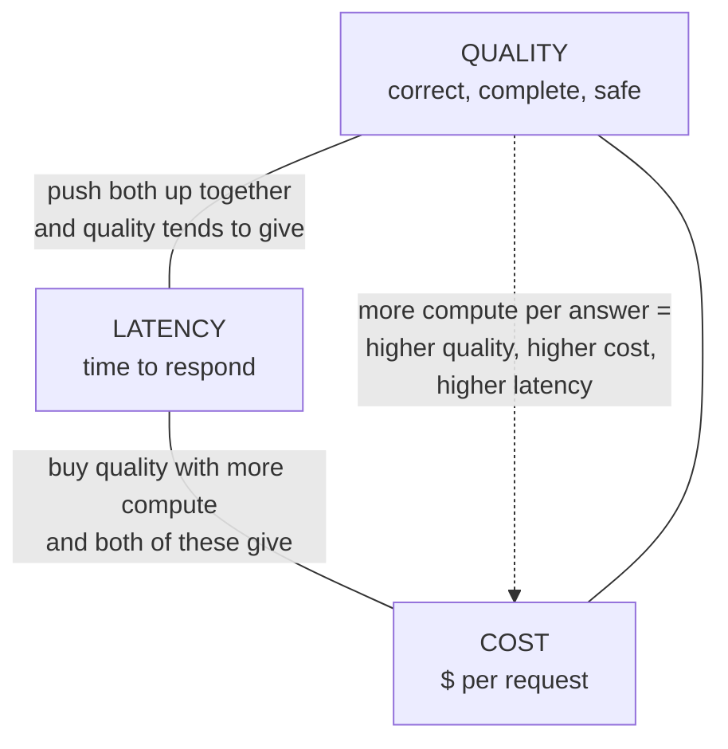
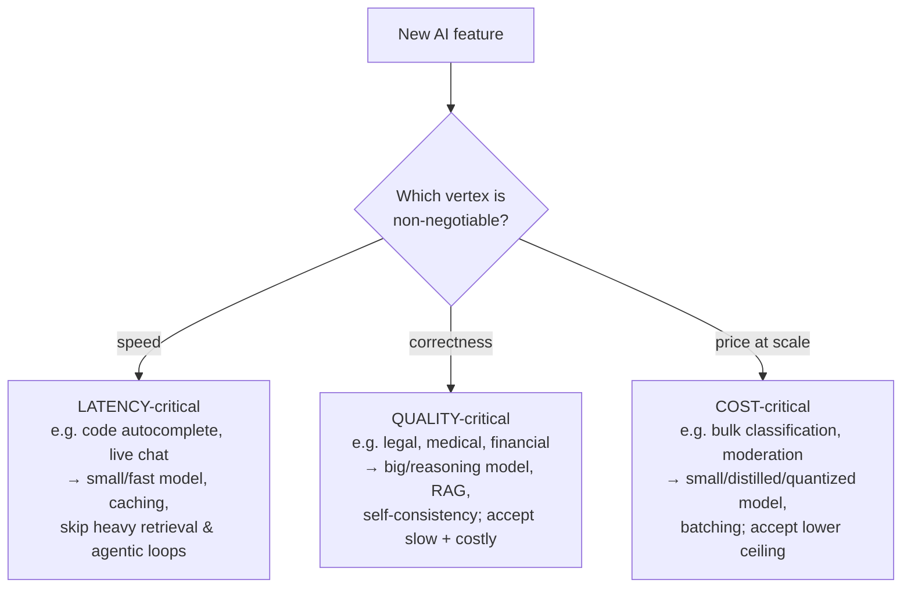

# The iron triangle (cost / latency / quality)

## The problem it solves

Every lesson before this one handed you a lever. A bigger or [reasoning model](../03-reasoning-generation/18-reasoning-models.md) for harder problems. [Quantization](../02-model-behavior-training/14-quantization.md) and [distillation](../02-model-behavior-training/13-distillation.md) to shrink a model down. [Retrieval-Augmented Generation (RAG)](../04-retrieval-knowledge/21-rag.md) to feed in facts. [Agentic loops](../06-agents/34-agentic-systems.md) to tackle open-ended work. [Prompt caching](../05-prompting/31-prompt-caching.md), [batching](../10-production-ops/49-inference-optimization.md), [routing](../10-production-ops/48-production-architecture.md) to run it all cheaper. You now know *what each lever does*. The question this capstone answers is the one an interviewer actually asks a product manager (PM): **given all these levers, how do you decide which to pull for a specific feature?**

The trap is thinking there's a "best" configuration you can find once and reuse — the smartest model, the best prompt, the right architecture, settled. There isn't. Almost every one of those levers improves one thing by spending another. Push for a better answer and you tend to pay more and wait longer. Squeeze the cost down and quality slips. Make it instantaneous and you've either capped the quality or blown the budget. There is no free lift, and there is no globally correct setting — only the setting that's correct **for one use case's priorities.** The iron triangle is the frame that turns a pile of independent levers into a single decision you can defend.

## The one analogy to remember

**The picture:** a sound engineer at a mixing board with three faders — one for **richer sound** (quality), one for **instant response** (speed), one for **cheap to run** (thrift) — and the whole console runs off a single amplifier with a fixed power budget. Slamming all three faders to the top would be paradise, but they share that one amp: push the quality fader up and the amp steals headroom from the other two, so the speed and thrift faders sink. You don't max the board; you *mix* it for the song you're actually playing.

**The mapping:** the *richer-sound* fader = **quality** (how correct, complete, well-formed, and safe the answer is); the *instant* fader = **latency** (how quickly the model responds); the *cheap-to-run* fader = **cost** (the dollars per request — compute, tokens, infrastructure); the shared amplifier's fixed power = the **compute budget** every answer draws on. Mixing for the song = tuning the settings for one use case's priorities.

**Why it holds:** the faders fight each other because they draw on the *same underlying resource — computation.* Quality mostly comes from pouring more compute into each answer (a bigger model, more [reasoning steps](../03-reasoning-generation/18-reasoning-models.md), more retrieved context, more [agentic](../06-agents/34-agentic-systems.md) iterations) — exactly like driving a channel louder pulls more power from the amp. More compute takes more time (latency sinks) and costs more money (thrift sinks). So boosting quality *by spending compute* drags the other two down by construction — it's not a quirk of today's hardware, it's the wiring of the board. That's the whole reason a large language model (LLM) feature can't be maxed on every axis at once.

**Say it like this:** "It's a mixing board with three faders — quality, speed, and cost — all wired to one amplifier. Push quality up and the other two get dragged down, because they're sharing the same power. Your job isn't to slam every fader to the top; it's to mix for the song you're actually playing."

*Where it breaks:* the board makes the power budget look *fixed* — as if the only move is trading headroom between faders. That's the analogy's most dangerous seam, because it isn't strictly true. A genuinely better technique (a smarter small model, [caching](../05-prompting/31-prompt-caching.md), a tighter prompt) is like fitting a bigger amp: it raises the whole board's headroom so two faders climb at once, no trade required. The fixed-budget board is the right *default* mental model; the bigger-amp escape hatch (covered below) is what separates a good answer from a great one.

## The triangle itself

Three vertices. Define each one crisply, because interviews punish fuzziness here:

- **Quality** — is the output correct, complete, well-formatted, and safe enough for this job? What "quality" *means* is itself use-case specific and is a whole discipline on its own ([evaluation methods](../09-evaluation/45-evaluation-methods.md)); the triangle just treats it as the vertex you're often tempted to maximize.
- **Latency** — how long the user waits for the response. For interactive features this is a hard product constraint, not a nicety: an autocomplete that takes two seconds is broken regardless of how good the suggestion is.
- **Cost** — the money each request burns: compute time, tokens in and out, serving infrastructure. At low volume it's noise; at high volume it's the whole business ([cost and unit economics](../10-production-ops/51-cost-unit-economics.md)).

They pull against each other because quality is bought with **more computation per answer**, and computation is exactly what costs money and takes time.

The single sentence to carry: **quality is generally bought with compute, and compute is what cost and latency are made of — so you can push two vertices, and the third gives.**

## Every lever in the book is a move along an edge

This is what makes the triangle the book's capstone rather than a new topic: **almost every technique you've learned is a way of trading one vertex for another.** You don't need to re-learn any of them — you need to see where each one *sits on the triangle.*

| Lever | Which lesson | The move it makes |
|---|---|---|
| Bigger vs. smaller **model choice** | [production architecture](../10-production-ops/48-production-architecture.md) | bigger → higher quality, higher cost + latency; smaller → the reverse |
| **Reasoning vs. non-reasoning** models | [reasoning models](../03-reasoning-generation/18-reasoning-models.md) | "think longer" spends latency + cost (more tokens) to buy quality on hard problems |
| **Quantization** | [quantization](../02-model-behavior-training/14-quantization.md) | shrink the weights → cheaper + faster, at some quality risk |
| **Distillation** | [distillation](../02-model-behavior-training/13-distillation.md) | train a small model to mimic a big one → cheaper + faster, aiming to keep most quality |
| **Mixture-of-Experts (MoE)** | [mixture-of-experts](../02-model-behavior-training/15-mixture-of-experts.md) | activate only part of a large model per token → big-model quality at lower compute cost |
| **Prompt caching / KV (key-value) caching** | [prompt caching](../05-prompting/31-prompt-caching.md), [KV caching](../05-prompting/30-kv-caching.md) | reuse computation on repeated context → cheaper + faster at *no* quality cost |
| **RAG** (retrieval depth) | [RAG](../04-retrieval-knowledge/21-rag.md) | fetching more/better context raises quality but adds tokens (cost) and a retrieval step (latency) |
| **Agentic depth** | [agentic systems](../06-agents/34-agentic-systems.md) | more loop iterations / self-checking → higher quality on open-ended tasks, multiplied cost + latency |
| **Self-consistency** (sample many, vote) | [sampling & decoding](../03-reasoning-generation/16-sampling-decoding.md) | run the prompt several times and take the majority → higher quality, several times the cost + latency |
| **Batching** | [inference optimization](../10-production-ops/49-inference-optimization.md) | group requests to use the hardware efficiently → cheaper, sometimes at the price of per-request latency |
| **Routing** (easy→small, hard→big) | [production architecture](../10-production-ops/48-production-architecture.md) | send each request to the cheapest model that can handle it → protects cost without capping quality |

Read that column top to bottom and the pattern jumps out: **you are always spending one vertex to buy another.** The techniques aren't a grab-bag; they're a set of controls on the same three-way dial.

## There is no best point — only the right corner for the job

Here's the insight that reframes the whole book. Because every setting trades vertices, **asking "what's the best model / prompt / architecture?" is a malformed question.** The right question is: **which vertex can this use case *not* compromise on, and which one can it afford to give?** Different products live in different corners:

- **Latency-critical** (code autocomplete, live voice): the answer must arrive in milliseconds or the feature is useless. You reach for a small fast model and heavy [caching](../05-prompting/31-prompt-caching.md), and you *deliberately skip* the quality levers that add round-trips — deep retrieval, multi-step agentic loops. You accept a lower quality ceiling because a slightly-worse instant answer beats a perfect late one.
- **Quality-critical** (legal review, medical triage, financial analysis): a wrong answer is expensive or dangerous, so correctness dominates. You spend freely on the quality levers — a [reasoning model](../03-reasoning-generation/18-reasoning-models.md), [RAG](../04-retrieval-knowledge/21-rag.md) for grounding, maybe self-consistency — and you *accept* that responses are slower and pricier. Here, cost and latency are the vertices that give.
- **Cost-critical** (classifying millions of tickets, content moderation at scale): unit economics rule because volume is enormous. You reach for the smallest [distilled](../02-model-behavior-training/13-distillation.md)/[quantized](../02-model-behavior-training/14-quantization.md) model that clears your quality bar and [batch](../10-production-ops/49-inference-optimization.md) aggressively, accepting a lower quality ceiling because a fraction-of-a-cent-per-item requirement forbids anything heavier.

**The reusable PM move is a single question: "Which corner does this use case sit in?"** Ask it before you evaluate a single model. It converts a vague "make it good" into an ordered set of priorities that tells you which levers to pull and — just as important — which to leave alone.

## The reframe: it isn't always strictly zero-sum

State the triangle as an iron law and a sharp interviewer will catch you, so hold this honestly. Sliding along the triangle — trading one vertex for another — is the *common* case, but it isn't the only move. A genuinely better technique can push **two vertices at once**, moving the entire frontier outward. Economists call the new frontier a **Pareto improvement** (a change that makes at least one thing better and *nothing* worse):

- [Caching](../05-prompting/31-prompt-caching.md) makes responses both cheaper and faster with **no** quality loss — a pure outward move, not a trade.
- A better *small* model (via [distillation](../02-model-behavior-training/13-distillation.md) or a new architecture) can match last year's big model at a fraction of the cost and latency — the whole triangle relocates.
- A tighter [prompt](../05-prompting/31-prompt-caching.md) or better [retrieval](../04-retrieval-knowledge/21-rag.md) can raise quality *and* cut cost by sending fewer, more relevant tokens.

So the mature framing is two-layered: **first move the frontier outward with better technique wherever you can (that's free money); then, on the frontier that remains, the triangle is real and you must pick a corner.** Treating the triangle as an absolute law makes you miss the Pareto wins; ignoring it makes you promise stakeholders "faster, better, *and* cheaper" as if the trade never bites. The truth is: sometimes free, usually a trade.

## The PM lens — the book's send-off

This is how the whole book cashes out into a repeatable way to reason about *any* new AI feature, before you've picked a model or written a prompt:

1. **Locate the corner.** Which vertex is non-negotiable for this use case, and which can give? (latency-critical / quality-critical / cost-critical.) This is a product decision, not a technical one — it comes from the user and the business.
2. **Look for the free wins first.** Can caching, routing, a better prompt, or a smaller capable model move the frontier outward before you trade anything?
3. **Then trade deliberately toward your corner.** Pull the levers that spend the vertex you can afford to spend, to buy the one you can't compromise. Choose model size, reasoning depth, retrieval and agentic depth accordingly.
4. **Define and measure the vertices.** "Quality" needs an [evaluation](../09-evaluation/45-evaluation-methods.md); "cost" needs [unit economics](../10-production-ops/51-cost-unit-economics.md); latency needs a target. A tradeoff you can't measure is a tradeoff you can't defend.

An interviewer who hears you run a feature through those four steps hears someone who understands that AI product work isn't about knowing the most techniques — it's about knowing **which two vertices to defend and which one to spend, and why.**

## Summary / Points to Remember

- **Cost, latency, quality — push two up and the third gives.** Picture a mixing board with three faders on one amplifier: boost quality and the shared power drags speed and thrift down. You mix the board for the song; you don't slam every fader.
- **They trade because quality is bought with compute, and compute *is* cost and latency.** More model, more reasoning, more retrieval, more agentic steps → better answers, but slower and pricier by construction.
- **Every lever in the book is a move on the triangle:** model size, reasoning vs. not, quantization/distillation/MoE, caching, RAG depth, agentic depth, self-consistency, batching, routing. Learn the *move each one makes*, not the technique in isolation.
- **There is no globally best setting — only the right corner for the use case.** Latency-critical (autocomplete), quality-critical (legal/medical), cost-critical (bulk classification) pull opposite levers. The reusable move: **"Which corner does this use case sit in?"**
- **It isn't strictly zero-sum.** A better technique — caching, a smarter small model, a tighter prompt — can improve two vertices at once (a Pareto improvement), moving the whole frontier outward. Take the free wins first; then the triangle is real and you pick a corner.
- **The PM method:** locate the corner → grab the free frontier moves → trade deliberately toward the non-negotiable vertex → define and measure all three. That, not a bag of techniques, is what an AI-literate PM brings.

## Interview Questions That Stump People

**Q: "Isn't a bigger, smarter model just always the better choice if you can afford it?"**

**Interviewer:** Compute keeps getting cheaper. If budget isn't the blocker, why wouldn't you just always use the biggest, most capable model?

**You:** Because "better" isn't a single axis — a bigger model buys quality by spending latency, and for a lot of features latency is the vertex you can't spend. Put the best reasoning model behind a code autocomplete and you've built something worse, not better: the suggestion arrives two seconds late and the developer has already typed past it. Same for live voice, or any interactive loop where the human is waiting. Even setting latency aside, "if you can afford it" hides the trap — at high volume the cost of the biggest model isn't a rounding error, it's whether the unit economics work at all. So the biggest model is the right call only in the corner where quality is non-negotiable and you can genuinely afford to give up speed and money — legal, medical, high-stakes analysis. Everywhere else, bigger is a regression on the vertex that actually matters for that use case. The question I'd ask back is always "which vertex can this feature not compromise on?" — and it's often not quality.

> [!TIP]
> **Why this answer works:** The question smuggles in the assumption that quality is the only axis and money is the only price. The strong move is to name the *other* price — latency — and show a concrete case where a bigger model makes the product strictly worse. That reframes "better model" as "wrong corner," which is the whole point of the triangle. Naming unit economics as a second hidden cost, and ending on the reusable "which vertex can't compromise?" question, signals you reason from use-case priorities rather than model leaderboards.

---

**Q (clarify-back): "We're choosing between two models for a new feature. How do you pick?"**

**Interviewer:** We've narrowed it to two models for a feature and the team is split. How would you decide between them?

**You (clarify back):** Before I can pick — what's the feature, and which of the three is the hard constraint: does the response have to be near-instant, does it have to be near-perfect, or does it have to be dirt cheap at volume? The right model falls out of which of those we can't compromise.

**Interviewer:** It's a customer-support assistant. Answers need to be *right* — wrong policy info creates real complaints — and volume is moderate, a few thousand a day.

**You:** Then quality is the non-negotiable vertex and cost is only a moderate concern at that volume, so I'd bias toward the more capable model and treat latency and cost as the vertices I can spend — within reason, a support answer can take a couple of seconds. But I wouldn't pick on the model alone: I'd first check for a Pareto win — pairing the smaller, cheaper model with good [retrieval](../04-retrieval-knowledge/21-rag.md) so it answers from the actual policy docs might hit the quality bar without paying for the bigger model at all, since here quality is really *groundedness*, not raw model horsepower. So my process is: pin the corner (quality-critical, cost-tolerant), look for the technique that gets there cheapest, and only then run both models against a real [eval](../09-evaluation/45-evaluation-methods.md) set on the metric that defines quality *for this feature*. Whichever clears the quality bar at acceptable latency and cost wins — and "capability on a benchmark" isn't that metric.

> [!TIP]
> **Why this works:** "Pick between two models" has no answer in the abstract — it depends entirely on which vertex the feature can't give up, so answering immediately would expose you as someone comparing spec sheets. Clarifying pins the corner (quality-critical, cost-tolerant), which is what actually decides it. The senior flourish is refusing to treat it as a pure model choice: spotting that a smaller model *plus retrieval* might be the real answer shows you reach for the frontier-moving option before the brute-force one, and insisting on a use-case-specific eval shows you know "quality" is defined per feature, not by a leaderboard.

---

**Q: "You said cost, latency, and quality always trade off. But we shipped a change that made our feature cheaper AND faster with no quality drop. Doesn't that break your triangle?"**

**Interviewer:** We turned on caching and our costs dropped and responses sped up, and quality was unchanged. So the tradeoff isn't real?

**You:** It's real, but it's not the *only* kind of move, and this is the distinction worth being precise about. Sliding along the triangle — spending one vertex to buy another — is the common case, but a genuinely better technique can push two vertices out at once without hurting the third. That's a Pareto improvement, and caching is the textbook example: you're reusing computation you'd otherwise repeat, so cost and latency both fall and there's nothing for quality to give. What you did wasn't beat the tradeoff — you *moved the whole frontier outward.* The triangle still binds on that new frontier: once you've taken the caching win, the next increment of quality still costs you latency and money. So the right mental model is two layers — first grab every frontier-moving technique you can, because those are free, and *then* accept the triangle on what's left. Teams that treat the triangle as an absolute law leave those free wins on the table; teams that point at one caching win and declare the tradeoff dead go promise stakeholders "faster, better, cheaper" and get burned on the next feature.

> [!TIP]
> **Why this answer works:** The naive positions are both wrong — "the triangle is an iron law" (misses Pareto wins) and "we beat it, so it's fake" (the interviewer's bait). The strong move is to hold both: distinguish *sliding along the frontier* (a real trade) from *moving the frontier outward* (a better technique, genuinely free), and note the triangle re-binds on the new frontier. Naming it a Pareto improvement and giving the two-layer method — free wins first, then trade — shows you can defend the triangle without overclaiming it, which is exactly the nuance a sharp interviewer is fishing for.

---

**Q: "Leadership wants the new feature to be top-quality, instant, and cheap. How do you respond?"**

**Interviewer:** The directive is: best-in-class answers, sub-second responses, and keep the cost down. All three. Go.

**You:** I'd take that as three *wishes* and my job is to turn it into a *priority order*, because you can build for two of those and the third has to give — that's not pessimism, it's how compute works: quality comes from doing more of it, and more compute is exactly what costs money and time. So I'd go back with a question, not a no: for this feature, which one is the real constraint? If it's a high-stakes answer where being wrong is costly, we defend quality and I'll show you the latency and cost that implies. If users abandon it above a second, we defend latency and I'll show you the quality ceiling that forces. If it has to run at massive volume, we defend cost and pick the smallest model that clears the bar. Then — before we accept any of those trades — I'll spend effort on the moves that are actually free: caching, routing cheap requests to a cheaper model, tightening retrieval. Those can get us closer to "all three" than the directive assumes. But the deliverable I need from leadership is the ranking, because "all three, equally" isn't a spec an engineer can build against — it's the thing I'm here to translate.

> [!TIP]
> **Why this works:** The directive is the classic impossible ask, and the weak responses are to nod and overpromise, or to flatly say "can't be done." The strong move is to reframe a wish-list as a *prioritization problem you own as the PM* — force the ranking, tie the refusal to the underlying reason (quality costs compute), and then soften the trade by finding the Pareto wins before conceding anything. That sequence shows you manage the triangle instead of being managed by it, and that you see naming the non-negotiable vertex as the core PM contribution, not a technical footnote.
