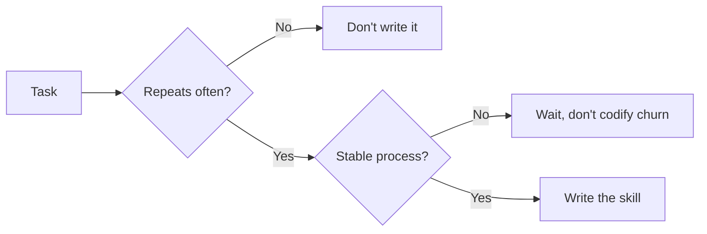
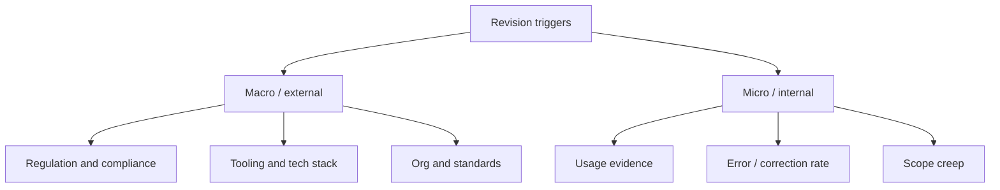
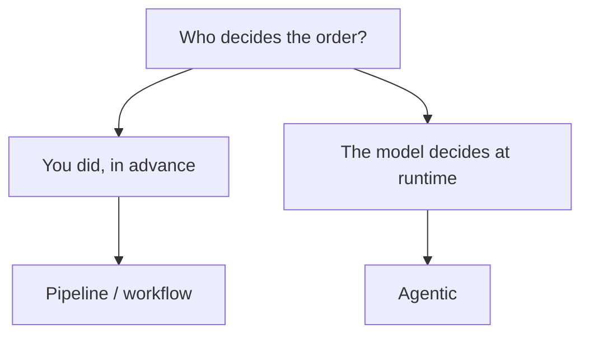
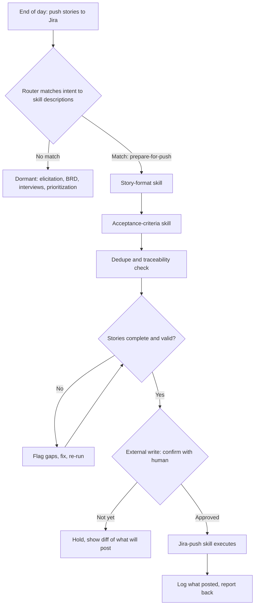
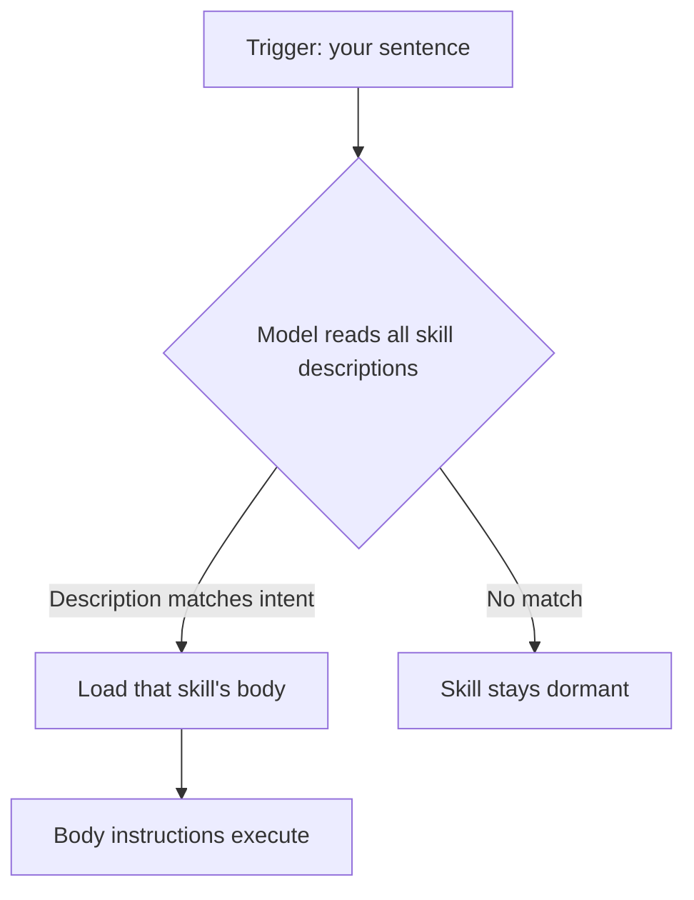
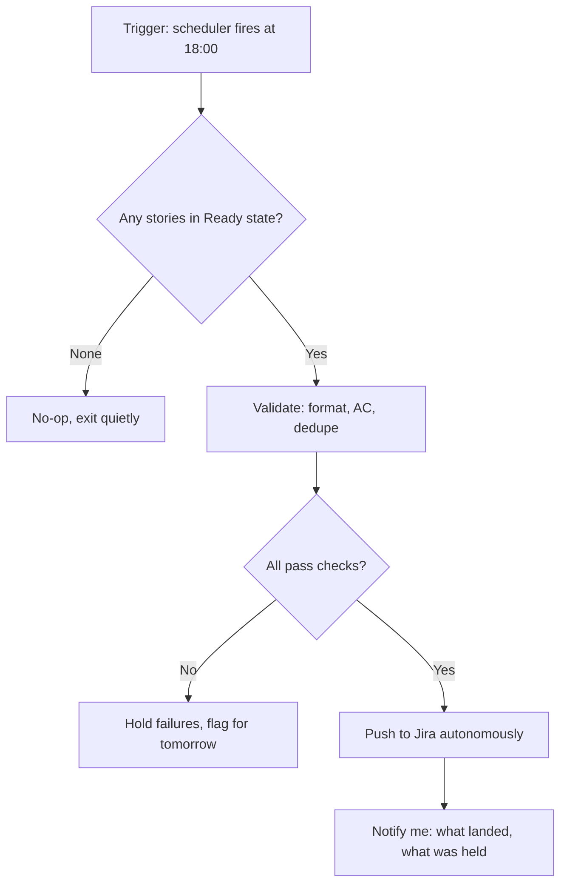
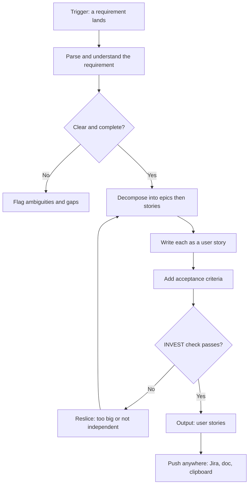
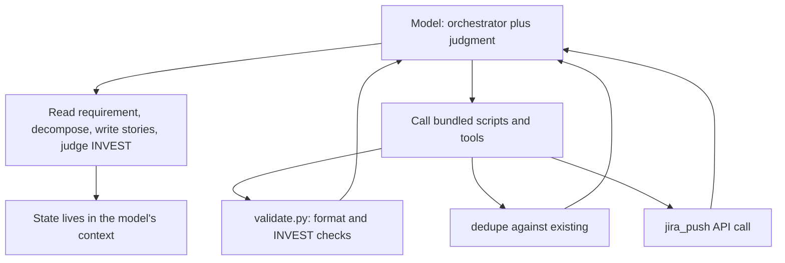

# Interview Simulation — Skills in the SDLC: choosing, maintaining, and executing them (BA / product & design lens)

**Candidate persona:** First-principles thinker. Classifies before answering, builds a mental model, separates causation from correlation, asks impactful probing questions, grounds points in analogy + example, lands the point with conviction.

**Role context:** Business Analyst, approached as a product & design person — reasoning about process, cost, workflow, human factors, and tradeoffs rather than code internals.

**Scenario the interviewer supplied:** A BA has 15–20 skills written for various jobs across the SDLC. The thread pressure-tests (a) which skills are worth writing, (b) what should trigger their revision, (c) how they're invoked and chained, and (d) the true execution mechanics — culminating in the realization that the core job is *requirement → user stories* and that a skill is loaded instructions, not a called function, with the model orchestrating and delegating deterministic work to bundled code.

---

## Q1 — As a BA, if you could write skills for all your SDLC use cases, would you? How do you choose which to write and which not?

*(Classification: design/tradeoff — the "all" is the trap; reframe, then commit to a rule.)*

No — writing a skill for *every* use case is the wrong instinct. First principle: **a skill is not free — it's a liability you carry forever.** Every skill must be discovered at the right moment, kept accurate as the process changes, and prevented from firing when it shouldn't. So the question isn't "which tasks *could* be a skill" (almost all could) — it's "which tasks pay rent on that maintenance cost."

The deciding model is **two axes at once: repetition × stability.**

Repetition alone isn't enough — a frequent task that changes shape every time (a stakeholder interview) freezes bad assumptions if codified. Stability alone isn't enough either — a rock-solid process run once a year isn't worth the upkeep.

**Analogy:** a skill is a *recipe versus cooking a dish once*. You write the recipe for the bread you bake every week; you don't document the experimental dinner you'll never make the same way twice. Most of a BA's high-value work is the improvised dinner.

**Would write:** user-story / acceptance-criteria formatting, requirements-traceability matrix generation, BRD/FSD scaffolding, standard elicitation checklists — the stable, repeated, format-heavy connective tissue.

**Would not write:** stakeholder interviews and conflict resolution, prioritization/scope-cut decisions, one-off vendor evaluations — the adaptive judgment work.

**Causation trap:** "I spend the most time on X, so X should be my first skill." Time-spent and skill-suitability are different. The most time-consuming work (stakeholder conversations) is the *least* codifiable; the thing worth codifying is the boring output-formatting *around* the judgment.

**Thesis:** write skills for the parts of the job where *consistency beats creativity* — templates, checklists, traceability plumbing — and deliberately leave judgment work un-codified. Automate the recipe, never the tasting.

---

## Q2 — Is a skill "done once, use forever"?

*(Classification: opinion with an edge — really "did you contradict yourself?")*

No — it's **"write once, maintain forever."** A skill is a *frozen snapshot of a process, but the process keeps moving.* The skill doesn't rot on its own; the world underneath it drifts (new ticketing tool, added compliance section, Scrum→Kanban), and the skill keeps confidently doing the old thing with full authority.

**Analogy:** a skill is a *road sign, not a monument.* A sign only stays useful if someone updates it when the highway reroutes — and a sign pointing at a road that no longer exists is *worse* than no sign, because people trust it.

**Example:** an acceptance-criteria skill emits Gherkin; six months later QA changes frameworks; the skill silently keeps emitting the old format and a junior who trusts it ships the wrong thing. The skill flipped from asset to liability *without anyone touching it.*

Honest lifecycle: **write → use → notice drift → revise → occasionally retire.** People forget the retirement step; a good skill librarian deletes as readily as writes.

**Thesis:** a skill is a *subscription, not a purchase* — it pays out only while you pay the upkeep. Which is exactly why you're picky about which to write: each one is a standing maintenance commitment.

---

## Q3 — Are there other macro/micro factors for revision? Process alone can't be the only trigger.

*(Classification: design/analytical — map the full set of revision triggers.)*

Right — process drift is only the most *obvious* trigger. A skill sits on a stack of assumptions; process is just the top one. Revise when **any layer it silently depends on moves.**

**Macro (the ground shifts):** new regulation adds a required doc section; tooling changes (Jira→Linear, or the model behind the skill upgrades); org standards mandate a template.

**Micro (the signal comes from using it):** *usage evidence* (a skill never invoked is a retirement signal as loud as any process change; one that fires but whose output is always edited is quietly wrong); *correction rate* (repeated overrides in the same spot = a bug); *scope creep* (asked to do more than built for → split it).

**Analogy:** a skill is a *thermostat, not a light switch* — it must keep reading the room (regulation, tools, and feedback from real use) and adjust.

**Causation trap:** "process changed" feels like the only trigger because it *announces itself* in a memo. The higher-signal triggers are the ones you must *detect* — a skill everyone silently stopped trusting sends no memo; it just produces waste until someone checks the logs.

**Thesis:** process is the trigger you're *told* about; the ones that matter more are the ones you *detect* — regulation/tooling from outside, usage/correction-rate from inside. The discipline isn't "when did the process change" but "am I measuring whether this skill still earns its keep."

---

## Q4 — Think outside the box. What else?

*(Classification: opinion — change the *category* of factor, not lengthen the list.)*

Everything so far treats the skill as a tool acting *on* work. The box left unopened: **the skill acts on the *people* and on the *other skills*, and those feedback loops are where the real risk lives.**

1. **The skill deskills the human (Goodhart on yourself).** Write an elicitation checklist and juniors stop *thinking* about what to ask — they run the list. The skill meant to *support* judgment *replaces* it; the muscle atrophies; the skill becomes load-bearing for capability that no longer exists. *Analogy: GPS* — a great tool that produced a generation who can't read a map.

2. **Skills interact — you own a portfolio, not a shelf.** They overlap, conflict, and chain; revise one format and another silently breaks; two people's "requirements doc" skills become two competing standards. *Analogy: a garden, not a toolbox* — plants compete; one invasive skill chokes the rest.

3. **Trust is a separate axis from correctness, failing both ways.** A correct skill nobody trusts is dead weight; a mediocre skill people *over*-trust is worse (automation complacency). *Example:* a 95%-accurate AC skill is *more* dangerous than a 70% one, because at 95% people stop reviewing and the 5% sails into production.

**Thesis:** a skill is not a static artifact — it's an **intervention in a human system, and systems adapt to interventions.** The deepest revision trigger isn't "did the process change" or "is it still used" but "what has this skill done to the people and the system that now depend on it?"

---

## Q5 — Counter: skills are written at a point in time; tools and models drift underneath and degrade the output — not just process.

*(Classification: recalibration — fold in a sharper framing and push it further.)*

Agreed, and it belongs in a *scarier* category than process change. The distinction that makes it sharp:

**When the process changes, the skill is wrong *and you know it* — a memo went out. When the model or tool changes underneath it, the skill degrades *and its text is byte-for-byte identical to the day it worked.*** Nothing to diff. Same instructions, silently worse output.

First principle: **a skill is instructions written *for a specific reader.*** You calibrate how much to spell out based on what that model already understands and what that tool already does. Swap the model — even for a "better" one — and the calibration is off: it interprets terse instructions differently, or a baked-in workaround for an old weakness is now dead weight, or a tool's API changes one field and the output malforms. The skill didn't move; its *audience* did.

**Analogy:** a skill is *a note left for whoever's on shift.* "Handle it the usual way" works for the experienced colleague and fails for the new hire — same words, different reader. A model upgrade is a shift change you weren't told about.

**Example:** "extract the requirements into a table" works today; a year later the upgraded model over-produces or renders markdown when the downstream tool needed CSV. Unchanged skill, subtly broken — caught only through the *micro* symptom (correction rate), because the *macro* cause (model swap) was never announced.

**Thesis:** a skill is written against a *whole moment in time* — process **and** model **and** tooling frozen together. Process drift you'll be told about; substrate drift you won't. The only defense against an invisible cause is the visible symptom, so the discipline shifts from "revise when notified" to "continuously verify the output still holds."

---

## Q6 — What other dimensions can you think of?

*(Classification: opinion — hand over the *generator* of dimensions, then name only the decision-changing new ones.)*

The list is effectively infinite, so start with the generating function: every dimension comes from **(a) the skill's own lifecycle** (conceived → written → discovered → used → degraded → retired) or **(b) the layers it touches** (task, tools, model, people, org, regulator). The real question is which cells *change a decision.* Three new ones that do:

1. **Discoverability — a skill that isn't found doesn't exist.** A perfect skill with a vague trigger never fires, or fires wrongly; the *description* does as much work as the content. *Analogy: a book with no title in a library with no catalog.*

2. **Provenance & auditability (BA-specific) — can you defend what it produced?** Requirements feed contracts and audits; "the skill generated it" is not a defensible answer to an auditor. *Analogy: a calculator versus a signed affidavit.*

3. **Ownership & orphaning — who maintains it when you leave?** An owner-less skill becomes a black box everyone fears to touch or delete. *Analogy: a bridge with no engineer of record, still carrying traffic.*

And the reframing one — **4. Opportunity cost.** Every skill you write is one you *didn't*; skill-building time is a fixed budget, so it's a *portfolio* decision, not a per-skill one.

**Thesis:** the dimensions don't bottom out. The competence isn't enumerating them — it's treating a skill as a **product with a lifecycle and stakeholders** and asking which two or three dimensions actually move *this* decision. A formatting skill: repetition and drift. A compliance-touching skill: provenance and ownership. Same object, different dimensions that matter.

---

## Q7 — With 15–20 skills, how do I invoke them? Is chaining fruitful? If I chain them, is it an agentic flow?

*(Classification: design/tradeoff — three questions collapse onto one axis: **who decides the order of execution.**)*

**1. Invocation: you mostly don't — the model routes.** You don't pick a skill from a menu. Each skill has a *description*; the model matches the moment to the description and fires the fit. Invocation is *retrieval by relevance*, so your job is writing descriptions sharp enough that the right one surfaces and the wrong ones stay quiet. *Analogy: an ER triage nurse* who routes on the symptom you describe.

**2. Chaining is fruitful only when the sequence is stable.** Story-writing → traceability → test-scaffold is a real chain because the order never changes. Two cautions: (a) **error compounds** — a 95%-accurate step ten deep is ~60% end to end; (b) don't chain things whose order depends on what you find.

**3. A chain is not automatically agentic.**

Using AI at every step does *not* make it agentic. If *you* hardcoded the order, it's a **workflow/pipeline** no matter how much AI runs inside each box. It's **agentic** only when the *model* chooses the next skill from the current state — looping, branching, stopping early.

**Analogy:** a *recipe versus a chef.* A hardcoded chain follows the recipe (step 4 always after step 3); a chef *tastes and decides the next move.* Both use the same techniques — the difference is who holds the control flow.

**Example:** if every doc goes story → traceability → test-scaffold in that order, hardcode it (cheaper, debuggable, defensible). If the flow branches on judgment ("does this change need a compliance review, a data-privacy section, or just a story?"), that's when you let the model orchestrate — and *that* is the agentic flow.

**Thesis:** don't reach for "agentic" as the prestige answer. Hardcode the chain wherever the sequence is stable; hand control to the model only where the *order itself* requires judgment. Chaining is fruitful when you know the path; agentic is worth its unpredictability only when you don't.

---

## Q8 — Flowchart of how skills are called and execute — scenario: end of day, push stories to Jira. Show your approach (you needn't call every skill).

*(Classification: design — the interesting part is what you *don't* call and where you refuse to run unattended.)*

Approach stated first: **work backwards from the goal, not forwards from the library** ("what must be true for a good push?"); **most skills stay dormant, correctly**; **gate the irreversible external write.**

The dormant branch is the point: ~15 skills match nothing and never wake — which is *why* description quality matters. The prepare cluster is a deterministic chain (stable order). The validation gate loops internally with no human. The confirmation gate is the only human moment, because the push is the only irreversible, outward-facing step — shown as a *diff, not a promise.*

**Analogy:** *mise en place before service* — prep heads-down and unsupervised, but sending a plate to the table happens at the pass, where someone checks it.

**Thesis:** a good skill flow is defined more by its *dormant branch and its confirmation gate* than by the skills that fire. The judgment is (1) letting the request select a minimal set and (2) drawing a hard line at the irreversible external write — autonomous up to it, human across it.

---

## Q9 — What is my start trigger? What do I put in the router? Peel the layers.

*(Classification: design/mechanics — stop treating "router" as a black box.)*

The unintuitive answer: **there is no router you build. The router is the model reading your skill descriptions.** The lever you control is the *descriptions.*

- **Layer 0 — trigger:** your natural-language sentence (a slash command is an optional override).
- **Layer 1 — the "router":** the model reads your request against every skill's `description` field (always in context) and loads the *body* of whichever matches. You don't write routing logic; the descriptions *are* the routing logic.
- **Layer 2 — the lever: a description is a WHEN, not a WHAT.** Weak: "Formats Jira stories." Strong: "Use when the user wants to push/sync/upload user stories to Jira… *Not* for editing existing tickets." The "Not for…" line stops wrong-intent firing.
- **Layer 3 — why it's cheap: progressive disclosure.** Only descriptions are always-loaded; bodies load on demand. 20 skills cost 20 one-line descriptions, not 20 playbooks — which is why the dormant branch is free.
- **Layer 4 — optional explicit front door:** for a *daily ritual*, write one **orchestrator skill** that owns the sequence, so "wrap up the day" hits one deterministic front door instead of relying on fuzzy chaining.

**Analogy:** the router is a *hotel switchboard operator who has only the room directory.* You can't control how the operator thinks — you can only *label the rooms well.* The orchestrator skill is the "press 0 for the front desk" option: one known number, one known script.

**Thesis:** trigger = intent in plain words; router = the model; the only real lever = the **description, written as a *when*.** Promote a daily ritual to a single orchestrator skill and make *that* the front door. You don't build a router — you write the signs it reads.

> *Interviewer correction incoming: the trigger is not human intent.*

---

## Q10 — Correction: intent can't be the trigger. Stories must land in Jira at end of day; the stories are the outcome.

*(Classification: recalibration — wrong *mode*: this is unattended/scheduled, not interactive.)*

If it happens on its own at day's end, the trigger can't be a typed sentence — you might not be there. The trigger is **time or event, not intent:**

- **Time-based (cron):** "every weekday at 18:00, push everything that's ready."
- **Event-based:** "when a story enters Ready state, push it."

For "end of day" it's the scheduled one — and that makes it an **autonomous agent**, which forces a redesign of the human gate. **When you remove the human from the trigger moment, the approval doesn't vanish — it moves earlier**, to a state flag ("Ready for Jira") set during the day. The 18:00 job pushes only what's already blessed.

**Analogy:** a *dishwasher with delay-start* — you load it and press start during the evening (authorization), and the timer runs it unattended overnight. The Ready flag is loading a plate; the cron is the timer.

**Thesis:** wrong trigger because wrong *mode* — an assistant you drive vs an agent that runs itself. Once the trigger is a clock, the real question is "where did the human approval go?" — it moves upstream to a state flag. Autonomy at the trigger is only safe when consent was captured before it.

---

## Q11 — Last attempt: I need user stories for a requirement. I can push it however. Requirement → user stories is the job.

*(Classification: recalibration — the trigger was in the noun the whole time.)*

**The trigger is the requirement itself.** A requirement arrives; the job is to turn it into user stories. "Push it however" means the destination is irrelevant — the work is the *transformation*, not the last mile. The earlier obsession with Jira and scheduling was chasing the delivery of the output instead of the production of it.

Understand before decomposing (a holey requirement yields holey stories). Decompose → write → criteria is the stable core chain. The **INVEST loop is the real quality gate** — Independent, Negotiable, Valuable, Estimable, Small, Testable; fail it and the story goes back to be resliced. Output is the stories; push is one trivial terminal node.

**Analogy:** a *butcher, not a courier.* The job is the *cut* — break one whole side of beef (the requirement) into named, usable portions (stories), each trimmed to spec (acceptance criteria), none too big to cook (INVEST). Wrapping and carrying it out is the forgettable last step.

**Thesis:** find the trigger by naming the *input to the core transformation*, not the last thing that happens to the output. Requirement lands → decompose → stories. Everything else was noise.

---

## Q12 — Where are you calling the skills? Who hands off the output between skills and how is it used? Is the model doing all the work?

*(Classification: diagnostic — the boxes hand-waved the real mechanics.)*

**1. Where are skills "called"? Nowhere — a skill isn't a function.** A skill is a bundle of instructions (a markdown playbook, sometimes with scripts) that gets *loaded into the model's context* when its description matches. "Firing a skill" = its text is injected and the model *follows it.* No call stack, no return value — a *recipe card*, not a machine.

**2. Who hands off the output? The model, via its context window.** There's no conveyor between skills. A step's output is text sitting in context; the model carries it forward because it's all one working memory. A *real* external handoff (a file, a JSON) exists only when a skill tells the model to run a tool that does I/O. Otherwise handoff = the model keeping the work in mind.

**3. Is the model doing all the work? No — and good design ensures it isn't.**

- **Model does the judgment** — understanding, slicing, writing prose, deciding INVEST. Fuzzy, language-shaped work.
- **Bundled code does the deterministic work** — template formatting, validation, dedupe, the Jira API call — things you want exact and repeatable, not re-improvised. Skills often ship *with* these scripts precisely so the model doesn't do them by hand.
- **The model is the orchestrator** — it decides *when* to run `validate.py`, reads the result, routes — but delegates the mechanical execution to code.

**Analogy:** the model is a *chef; skills are playbooks pinned above each station.* The playbook doesn't cook — the chef reads it. Some steps need taste and judgment (plating = writing/slicing); others say "run the mixer" or "set the oven" — deterministic machines switched on but not done by hand (validator, Jira push). The chef carries the dish station to station — that's the context window.

**Thesis:** skills aren't called, they're *loaded*; the model orchestrates and holds state in context (which *is* the handoff); and the discipline is to push everything deterministic into bundled code and reserve the model for judgment. The model decides *what* and *when*; the code guarantees the *exact how*. A skill that makes the model hand-format JSON or hand-call an API every night is a bad skill — the good one hands those to scripts.

---

## Summary — the through-line

- **A skill is a liability you carry forever, not a free win.** Write one only where *consistency beats creativity* — stable × repeated. Judgment work stays un-codified.
- **Skills are subscriptions, not purchases.** They pay out only while you pay upkeep; retirement is a first-class step, and an owner-less skill is a countdown to a black box.
- **Revision triggers are layered, and the dangerous ones are invisible.** Process announces itself; substrate drift (model/tool upgrades) and eroded trust do not — so the discipline is continuous output verification, not reaction to memos.
- **Skills also act on people and each other.** They can deskill their users (Goodhart/GPS effect), entangle as a portfolio, and fail on the trust axis independently of correctness.
- **Chaining ≠ agentic. The axis is who decides the order.** Hardcode stable sequences (cheaper, defensible); hand control to the model only where the order itself needs judgment.
- **You don't build a router — the model is the router, and descriptions are the only lever.** Write descriptions as a *when*, not a *what*. Promote daily rituals to one orchestrator skill.
- **Find the trigger by naming the input to the core transformation** — not the last thing that happens to the output. The job was *requirement → user stories*; Jira and scheduling were noise.
- **Skills are loaded instructions, not called functions.** The model orchestrates and carries state in its context (the handoff); deterministic work (validation, formatting, API calls) belongs in bundled code, so the model stays at the altitude of judgment.

---

## Post-mortem — why the trigger question took three attempts

The most useful part of this session isn't an answer — it's a *failure*. The trigger question (Q9→Q11) took three corrections to land, and the candidate got it wrong the same way each time. Worth studying, because the error is the exact one the method is built to prevent.

**Root cause: mistaking the destination for the work.** The scenario was seeded as "end of day, push stories to Jira." The candidate anchored on the loudest nouns — *Jira, end-of-day* — and silently decided the task was *delivery*. Every trigger answer was then framed around delivery (intent → push → schedule), when the actual job was the *transformation* (requirement → stories). The surface verb was taken as the task and never tested — a textbook confusion of correlation (the thing that happens to the output) with causation (the core work).

**The specific failures:**

1. **No clarifying question at the fork.** "Trigger for *what* — the interactive session, the scheduled push, or the transformation itself?" would have collapsed the ambiguity in one turn. The persona explicitly prizes the close-ended question whose answer *changes the answer* — and this was the canonical case. It was skipped out of misplaced certainty.
2. **Local correction, not global.** Told "not intent," the candidate jumped to "scheduled/cron" — still inside the delivery frame, one tile over. The right response to a first correction is to zoom out ("I've got the wrong altitude — what's the actual job?"), not to pattern-match the last word.
3. **Conviction disguised the error.** Each wrong answer arrived with a full model, analogy, and thesis. Polish made a bad premise *look* considered and made the error harder to spot. Fluency masqueraded as accuracy.
4. **Sunk cost.** Elaborate Jira/scheduling flowcharts had already been built; defending that scaffolding biased against discarding the frame.

**What good looked like (one line, at Q9):** *"Before I answer — 'trigger' for which layer? If the real job is requirement → stories, the trigger is the requirement arriving and Jira/end-of-day are just delivery. Is that the frame?"* Converges in one turn instead of three corrections.

**Transferable rule: fluency is not accuracy.** The moment you can produce a confident, structured answer is exactly when you're most at risk of having solved the *wrong* problem well. The cheap insurance is one clarifying question at the top — the persona lists "ask the probing question that forks the answer" as a *core* trait, not an optional flourish, for precisely this reason. When an interviewer prods repeatedly, the default read should be "I may have the wrong frame," not "let me refine this answer."
