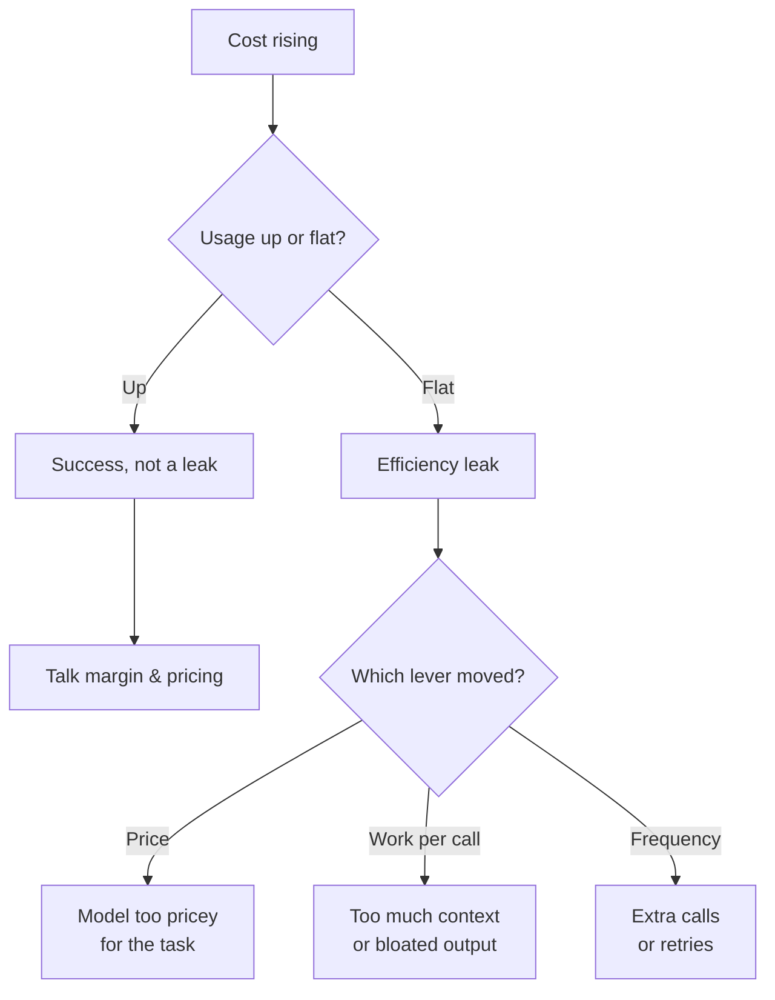
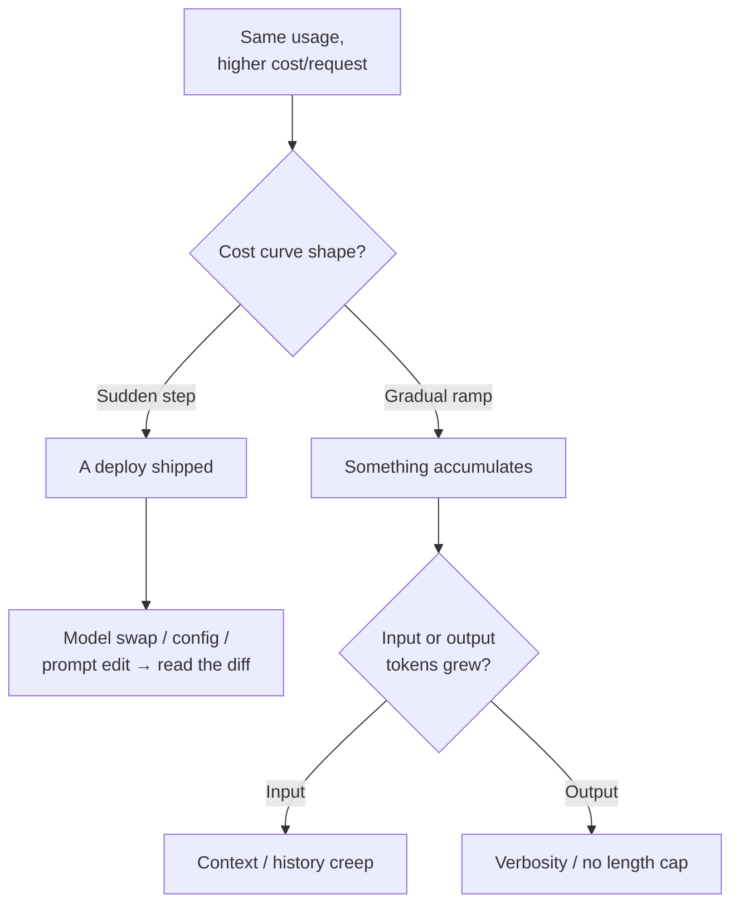
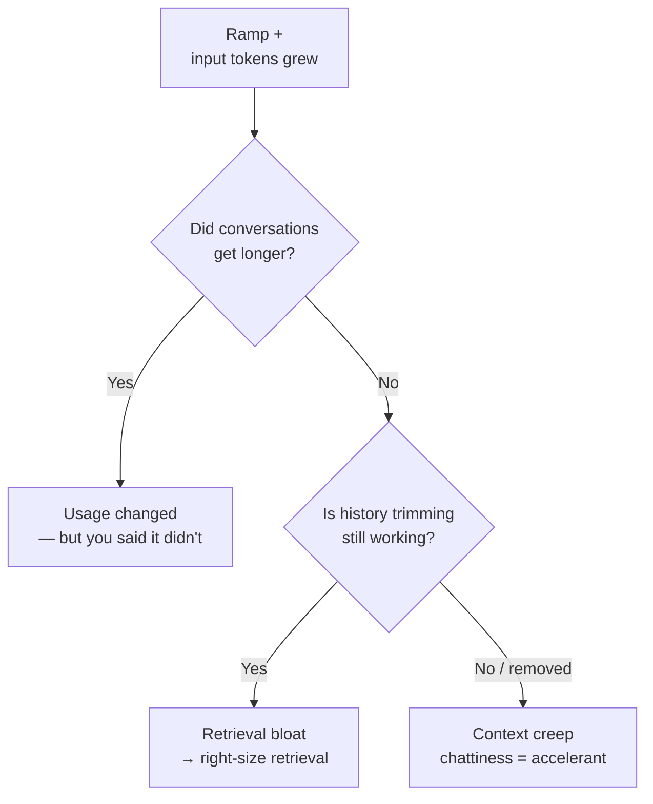

# Interview Simulation — AI-Native Forward Deployed Engineer (Product & Design)

**Candidate persona:** First-principles thinker. Builds a mental model before answering, separates causation from correlation, leads diagnostic questions with a structured elimination flow, asks sharp probing questions, grounds points in simple real-life analogies, and lands the point with impact.

**Role context:** AI-native forward deployed engineer — approached as a product & design person, not a developer. No deep dives into coding or architecture.

**Note on the diagrams:** each step carries *its own* mermaid, because the diagnosis recalibrates as every answer prunes the tree. The funnel narrows from Q1 → Q3. Labels are kept short and quoted so text doesn't clip on render.

---

## Q1 — Teams complain about running out of tokens and rising costs. What's your POV, and how do you keep it in check?

**Candidate:**

Before I give you an opinion, let me show you how I'd *find* the answer — because "costs are rising" is a symptom, and the fix is completely different depending on the cause. Here's the first cut of my elimination tree. Each node is a close-ended question, and each answer kills a branch:

The reason I draw it rather than list tips: **each question is cheap to answer and eliminates half the remaining space.** Guessing at fixes is expensive; ordered close-ended questions are nearly free.

**First principle:** tokens are a unit of work, and cost is `work × price × frequency`. So a rising bill is exactly one of three things:

1. **Price per unit** — the model is more expensive than the job needs.
2. **Work per call** — each call drags too much context, or the output is bloated.
3. **Frequency** — we call when we didn't need to, or repeatedly to fix earlier mistakes.

Most teams panic and reach for #1 ("switch to a cheaper model") when the real problem is #2 or #3. That's like a household with a shocking electricity bill switching providers, when the real issue is they left every light and the AC on all day — you renegotiated the rate but never touched the behavior driving the bill.

**Mental model — treat it like a utility bill: instrument before you optimize.** Cost must become *observable per feature and per user journey*, not one scary number on the invoice. Most teams have a single aggregate figure — a house with one meter and no idea whether it's the AC or the pool pump. You can't manage what you can't attribute.

**Probing question back:** *Is cost rising because usage is rising, or because cost-per-user is rising?* The first is success; the second is a leak — and the fixes are opposite.

Assuming a genuine leak, cheapest lever first: right-size the model to the task (triage desk, not ICU, for easy steps); cache repeated context so you stop paying to re-read the same prompt; shorten the agent loop, not just the prompt; retrieve less but better.

**POV, one line:** don't cut tokens, cut waste — and you can't cut waste you can't see, so instrument first, right-size second, redesign the workflow third.

**Probing question to sharpen:** is usage growing (a good problem) or the same usage quietly getting more expensive (a leak)?

---

## Q2 — It's the same usage, but now more expensive.

**Candidate:**

Good — that prunes the tree hard. "Same usage, higher cost" is nearly a contradiction: if users and requests didn't change but the bill did, then **something consumes more tokens per request than it used to.** The `usage-up` branch is dead; we're firmly in the leak. Here's the recalibrated tree — notice it's a different, narrower diagram, not the same one:

**Mental model:** `cost-per-request = input tokens + output tokens, at the model's price`. Only a few things move that without user behavior changing:

- **Context creep (the #1 culprit).** A change quietly grows what's sent every call — longer system prompt, more few-shot examples, more retrieved docs, or history that no longer gets trimmed. A slow leak under the sink: the house looks fine, the water bill keeps climbing.
- **Config or model change.** Upgraded default model, or a pricier reasoning mode turned on — "we switched to premium fuel and forgot."
- **Output bloat.** Longer responses; output tokens usually cost more than input, so it hits harder than expected.
- **Retry amplification.** Silent retries mean paying 2–3× for one logical request.

**The discipline:** I refuse to fix anything until I've pinned the cause, because each suspect has a *different* fix. The pivot question is the top of that tree — *ramp or step?* A **step** means something *shipped* on a date; a **ramp** means something *accumulates*. Same distinction as a slow leak versus someone leaving a tap running — the shape of the graph tells you which.

**Concrete plan:** plot cost-*per-request* over time (total cost hides the story); overlay the deploy log — the bend will line up with a change; split tokens into input vs. output to know which pipe leaks.

**POV:** "same usage, more expensive" is the *easiest* cost problem to solve, because the product didn't change — only the plumbing did. I'm not hunting for a clever optimization; I'm hunting for a diff.

**Probing question:** is that cost-per-request line a gradual ramp or a sudden step?

---

## Q3 — Does this have anything to do with how people work with AI tools? Are chatty conversations responsible?

**Candidate:**

Yes — but carefully, because "chatty conversations" is a *tempting* explanation, and tempting explanations are where I slow down. Let me recalibrate the tree one more level, now sitting inside the `input-grew` branch, and test chattiness explicitly:

**Where chattiness is genuinely true — mechanically:** each new turn re-sends the *entire* prior conversation, because the model has no memory of its own. So a chatty thread isn't linearly more expensive, it's roughly **quadratically** more expensive — turn 20 re-sends turns 1–19 plus the new message. It's like a meeting where, before anyone speaks, someone reads the *whole* transcript so far out loud from the top. By the end you spend most of the meeting re-reading the meeting.

**Where I push back — causation vs. correlation:** chattiness is only the culprit *if the shape matches it.* You told me usage is flat. For chattiness to explain a recent *increase*, either (1) people suddenly had **longer** conversations — but that's a usage change, and usage is flat; or (2) far more likely, **conversations were always this chatty and something stopped protecting you from it** — trimming/summarization broke or was removed. The user didn't change; the *plumbing* did. That's exactly the left-vs-right split at the bottom of the tree.

**The point I land:** never solve with human discipline what you can solve with product design. Asking users to be concise to save tokens is like a supermarket asking shoppers to please walk faster to reduce crowding — you're outsourcing your design problem to the customer and hoping they cooperate. Chattiness is a *given*; humans are conversational — that's the appeal of the interface. A well-designed AI product makes chattiness cheap through context management the user never thinks about.

**Honest answer:** chattiness is the *mechanism*, not the *cause* of the spike. People being chatty is a constant. If the bill changed while usage stayed flat, the thing that changed is a system that stopped taming chattiness — not users who suddenly got talkative. On a gradual ramp, I'd now bet specifically on **broken/removed context trimming**, with chattiness as the accelerant feeding it.

---

## Summary — the through-line

1. **Diagnose before you opine.** Lead with an elimination flow of ordered, close-ended questions; opinion is the *conclusion*, not a substitute.
2. **One tree per step.** The diagram recalibrates as each answer prunes the space — Q1 broad triage, Q2 narrowed to the leak, Q3 zoomed into the specific branch.
3. **Separate the happy problem from the leak.** Usage up = success (margin/pricing). Same usage, higher cost = a leak with a findable diff.
4. **Ramp vs. step is the pivot.** Ramp = accumulation/creep. Step = a deploy. Opposite fixes, so never guess.
5. **Chattiness is the mechanism, not the cause.** It's a constant; what changes is whether the system still tames it.
6. **Cost is a design problem before it's an engineering problem.** Solve it in the workflow, not by asking users to behave.
