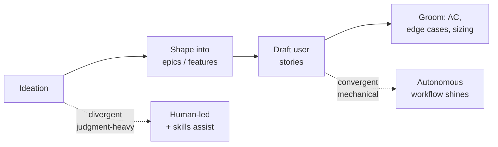
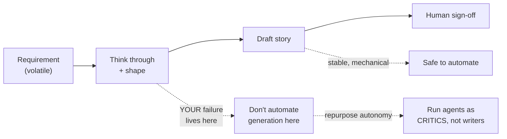
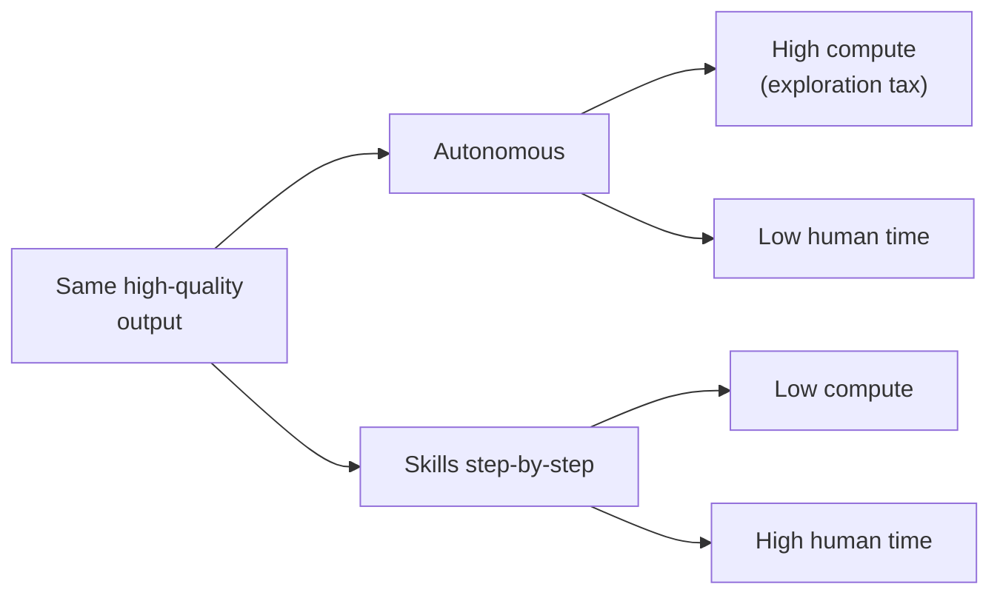
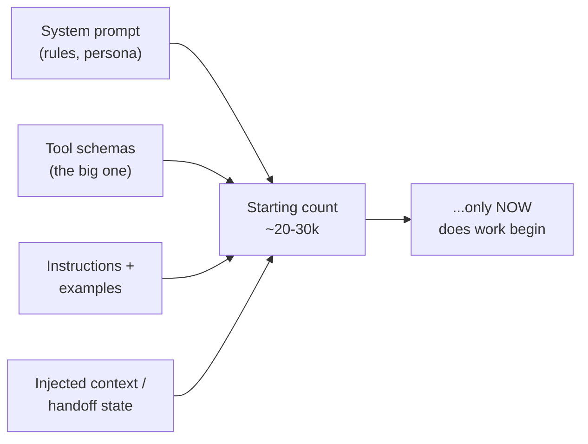
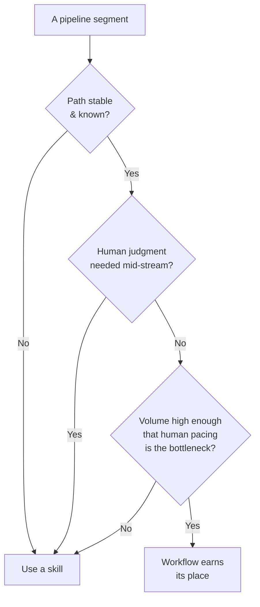

# Interview Simulation — Workflows/Agents vs. Skills (Ideation → Groomed User Stories)

**Candidate persona:** First-principles thinker. Classifies the question before answering, builds a mental model, separates causation from correlation, asks impactful probing questions, grounds points in simple real-life analogies, and lands the point with conviction.

**Role context:** AI-native forward deployed engineer — approached as a product & design person, not a developer. No deep dives into coding or architecture.

**Scenario the interviewer supplied across the session:** Requirements arrive and the team moves on quickly. Most failures come from stories being poorly written or poorly thought through. Requirements change and impact the work. Human sign-off is mandatory. Tokens are no longer cheap; workflows hit rate limits very fast versus skills.

**Note on diagrams:** each step carries its own short, quoted-label mermaid so text doesn't clip, and so the mental model can recalibrate as the scenario is revealed.

---

## Q1 — I have autonomous workflows/agents, and I have skills I invoke one by one. To go from ideation to groomed user stories, which methodology is better?

*(Classification: design / tradeoff → mental model + the deciding axis + a reasoned pick, not a survey.)*

"Which is better" is a false binary. Neither method is better in the abstract — they're better at *different kinds of work*, and "ideation → groomed stories" isn't one kind of work. It's a chain that *changes character* as you move along it. So the real question is: **where in this chain does judgment live, and where does mechanics live?** Match the tool to the segment.

**Governing first principle:** automation trades *control for scale*; step-by-step trades *scale for control*. Autonomy is a bet that the destination is known and the path is repeatable. That bet pays off for convergent, well-defined work and fails badly when the point of the task is to *discover* the destination.

- **Ideation** is divergent — value is judgment, taste, and unwritten context. Automating it is automating brainstorming: volume without conviction.
- **Drafting stories** from agreed features is templated and near-mechanical — where a workflow earns its keep.
- **Grooming** sits in the middle — structured enough to assist, judgemental enough that a human signs off.

**Analogy:** an autonomous workflow is a *bread machine* — perfect for reproducing a known loaf; useless for *inventing a new dish*. Skills one-by-one is *cooking with good knives* — hands-on, you taste and adjust as you go.

**Reasoned pick:** a hybrid, and the *seam* matters more than the choice — skills-in-the-loop through ideation and feature-shaping, hand off to autonomy for drafting, human reviews. Don't automate across the seam where judgment lives; don't hand-crank pure mechanics.

**Probing questions that would flip the answer:** Is ideation genuinely novel each time, or patterned? Where does quality break today — bad ideas surviving, or good ideas written up badly? Is a human signing off regardless?

---

## Q2 — From a project standpoint: requirements arrive and we move on. Most failures are stories poorly written / poorly thought through. Requirements change. Human sign-off matters.

These three facts don't pull in different directions — they *all point the same way*.

1. Failures come from poor *thinking* → the bottleneck is **judgment**, not throughput.
2. Requirements change → **high volatility / rework risk**.
3. Human sign-off is mandatory → the human is a **fixed gate**.

**Governing principle: automation amplifies whatever your process already is.** If the failure is unthought stories, pointing autonomy at story-*generation* just produces more unthought stories, faster, with more confidence — a factory with a quality problem installing a faster conveyor belt.

**Volatility compounds it:** an autonomous run is a *large batch* committed before a human looks; a requirement change throws it away. Step-by-step is a *small batch* — a change costs one story, not thirty.

**The human gate removes autonomy's main selling point:** you must sign off anyway, so full autonomy front-loads work the human then has to re-check — and reviewing a finished-but-wrong batch is harder than catching the wrong turn on step two.

**Pick for this reality:** skills step-by-step are the better **spine** — the volatility and the human gate both make step-by-step cheaper and safer here.

**The move I'd champion:** don't retire the agents — *invert* their job. You built them to *write*; repurpose them to *interrogate*. Before sign-off, run an agent adversarially against each story: what's ambiguous, what edge case is missing, what dependency isn't named, what breaks if the requirement flips? Now autonomy attacks your **actual failure** (thinking quality) instead of scaling your non-problem (drafting).

---

## Q3 — Assume quality is high, all else constant. Which of the two is more expensive, and why?

"Expensive" hides two currencies: **compute (tokens)** and **human time**.

**First principle: cost doesn't disappear, it moves.** Autonomy converts human time into compute; step-by-step converts compute into human time. So the question is really *which resource are you spending*.

**On pure token cost, autonomy is more expensive — the exploration tax.** An agent doesn't know the right path, so it explores, self-critiques, retries, and backtracks; much of that work is *discarded*. You pay full price for work you throw away — the price of not having a human to prune the tree. Multi-step loops also re-send accumulating context each step (superlinear, like a long chatty thread).

**Holding quality constant is exactly what makes autonomy look worst.** The human-in-the-loop method imports quality from an **unmetered source** — your judgment, free in tokens. The autonomous method has no free judgment; to hit the *same* quality it must *generate* it with extra reasoning. Pin quality high and the compute gap widens against autonomy.

**Analogy:** to reach the same destination, an explorer with GPS burns more fuel wandering and correcting than a **local who knows the way**. The local's knowledge is free fuel; autonomy pays fuel for what the human supplies as tacit knowledge.

**But total cost can flip:** human time is usually far more expensive than tokens. At low volume, autonomy can be cheaper *in total* (cheap tokens substituting for expensive hours). At high volume, the exploration tax compounds and reverses it. And with a mandatory human sign-off, autonomy makes you pay *twice* — exploration tokens *and* the unavoidable human hours.

---

## Q4 — Tokens are no longer cheap; we hit rate limits very fast with workflows vs. skills. Have you seen the same pattern?

Yes — and it's structural, not bad luck. But separate two fused things: **total spend** (your bill, tokens/month) and **rate limits** (throughput ceiling, tokens/minute). Workflows are worse on both, but rate limits are what bite "very very fast."

**Key move: rate limits are about velocity, not volume.** You can have budget left and still hit the ceiling, because the ceiling is tokens-*per-minute*, and autonomy maximizes exactly that:

1. **Parallel fan-out** — many agents drawing on the same rate budget simultaneously.
2. **Bursty loops** — plan → act → critique → retry as fast as the API answers, no gaps.

**The human is a free rate limiter.** Invoking skills one by one, *you* pace the calls — read, think, decide, fire. That latency spreads consumption across time and keeps you under the ceiling. Workflows remove that pacing by design, so they run flat into the wall.

**Analogy:** rate limit is *pipe diameter*, not the water bill. Skills sip through a straw; a workflow pushes a firehose through the same pipe. Same reason a revolving door handles a trickle fine but jams when a crowd rushes it — the crowd isn't more people over the day, it's more people *per second*.

**The compounding cruelty:** when a workflow throttles out *mid-run*, it dies **partway**, and a half-finished chain is usually worthless. You burned the tokens up to the failure and have nothing to ship. The exploration tax meets the rate ceiling — you pay, hit the wall, and collapse incomplete.

---

## Q5 — I understand the fan-out. But why do agents *start* at such high token counts — I've seen 20–30k burnt before any real work. Why?

That 20–30k is the tell: zero useful work done, a fortune already spent. It isn't work — it's the **loadout**, the cost of making the agent *ready* to work.

**Root first principle: the model is stateless — it remembers nothing between calls.** So every agent, every spawn, must be re-told everything from scratch before it can act. That re-establishment is the 20–30k.

- **Tool definitions are the silent giant** — every tool's full JSON schema (params, per-field descriptions) sits in context. One rich tool is 1–3k tokens; a toolbox of 15–20 is 20–30k *just describing the toolbox*, before a single tool is used.
- **System prompt** — rules, persona, format, guardrails — often thousands of tokens.
- **Instructions + few-shot examples** needed to hit quality.
- **Handoff/injected state** — later agents inherit accumulated plan and results, so they start even higher.

**Connect it to autonomy:** autonomy *means* the agent decides for itself, and to do that it must be front-loaded with everything it might need — all tools, all rules, all state. **You pay for autonomy in advance, in context, at spawn.** A skill decides nothing — it executes one bounded thing — so it needs almost no loadout. That's the definitional difference, not inefficiency.

**Analogy:** an agent is an employee with **total amnesia** who, before every task, re-reads the entire handbook, every tool manual, and the full project brief. A skill is a specialist handed one clearly-labeled job.

**Why fan-out is brutal, not additive:** every agent pays the entry fee *independently and in full*. Ten agents = 200–300k tokens in setup alone, in a burst, before anything is produced. That's why the rate ceiling gets hit before the work even starts.

**Practical lever:** stop re-paying the identical loadout — prompt-cache the shared system prompt and tool schemas so it's charged once, not once-per-agent, and give each agent only the tools it needs.

---

## Q6 — So, which one to use? What is your recommendation?

**Recommendation, committed: use skills, step-by-step, as the spine of ideation → groomed stories. Do not default to autonomous workflows.** I'm this decisive because *every* force we uncovered points the same way — that rarely happens, so hedging would be dishonest.

- **Failure is thinking quality** → autonomy scales the thing you don't need more of.
- **Requirements are volatile** → small batches beat big ones; step-by-step limits blast radius.
- **Human sign-off is mandatory** → autonomy's whole pitch (remove the human) is unavailable; you'd pay for it *and* the human.
- **Tokens scarce, rate limits bite** → workflows front-load 20–30k per agent, burst, fan out, and fail half-done.

Four independent forces, one direction. Follow them.

**But make autonomy *earn* its place instead of assuming it.** Reverse the default: skills are the default; a workflow must justify itself per segment against this gate —

Ideation and grooming fail the first question — the path isn't known, that's the point. Story-*drafting* from agreed features may pass all three; if you want autonomy anywhere, put it *only* there, bounded, with caching and capped concurrency. And keep the critic role: repoint agents from writers to interrogators before sign-off.

**Analogy:** you're inventing dishes for a client who keeps changing the order, and you taste every plate before it leaves the pass — a kitchen with good knives and a chef, not a vending machine. Buy the machine for the one thing it does well; never let it run the menu.

---

## Q7 — Then when *is* a good use case for workflows, if not this?

**Workflows are for scale problems, not judgment problems.** Use one when you have too *much* of a *known* thing to do — never when you have a *hard* thing to figure out.

Mental model — a 2×2 of **judgment/taste per item** vs **volume**. Workflows win in one corner only: **low-judgment, high-volume**. The story pipeline sits in the opposite corner: high-judgment, low-volume, changing under you. Same tool, wrong quadrant.

A workflow earns its keep when **all** hold — each the inverse of what killed it for the story case:

- **Path is stable and known** → little exploration, less token tax.
- **No human judgment mid-stream** → verify at the end, in bulk, or objectively.
- **Volume is high** → the fixed 20–30k loadout amortizes to near-nothing per unit.
- **Sub-tasks are independent** → fan-out becomes a feature, not just a cost.
- **Errors are tolerable or cheaply caught** → you can afford to trade per-step control for scale.

When those hold, every earlier "cost" flips into a benefit: the burst *is* the throughput; the absent pacing *is* the win; front-loaded autonomy is fine because the path won't move.

**Archetypes:**
- **Mass transformation/classification** — tag 10,000 tickets, extract structured data from a document pile, reformat a content library.
- **Broad research fan-out** — scan 200 competitor pages for pricing; monitor N sources and summarize changes (orchestrator-worker: discover once, fan out gathering).
- **Batch low-stakes templated content** — alt-text for an image library, hundreds of localizations, first-draft descriptions, with human sampling instead of per-item sign-off.
- **Unattended overnight jobs** — where the value *is* that no human waits; manage rate limits by scheduling, not pacing.

**Analogy:** a workflow is a **printing press** — unbeatable for printing a finished book a million times; worthless for *writing* it, and harmful while the manuscript still changes. Skills and a human write the book; the press mass-produces it once it's done.

**The rule I'd leave:** reach for a workflow the moment your constraint switches from *"is this good?"* to *"can we get through all of it in time?"* While the bottleneck is quality and judgment, stay with skills and a human. When it becomes sheer volume of a settled, repeatable task, let the press run.

---

## Summary — the through-line

1. **Classify first.** Design/tradeoff questions get a mental model + deciding axis + a committed pick, not a survey.
2. **Match the tool to the segment, not the whole job.** The chain changes character from ideation to drafting.
3. **Automation amplifies the existing process.** Never automate the step that's failing on judgment; reinforce it (agents as critics).
4. **Cost doesn't vanish, it moves** — between compute and human time; holding quality constant makes autonomy's compute cost worst.
5. **Rate limits are velocity, not volume.** Workflows are bursty and parallel; the human is a free rate limiter.
6. **Autonomy is front-loaded** — the 20–30k loadout is the price of a stateless agent being ready to decide for itself; fan-out multiplies it.
7. **Recommendation:** skills as the spine; make workflows *earn* their place via the gate; reserve them for low-judgment, high-volume, stable, parallel work — the printing-press jobs.
