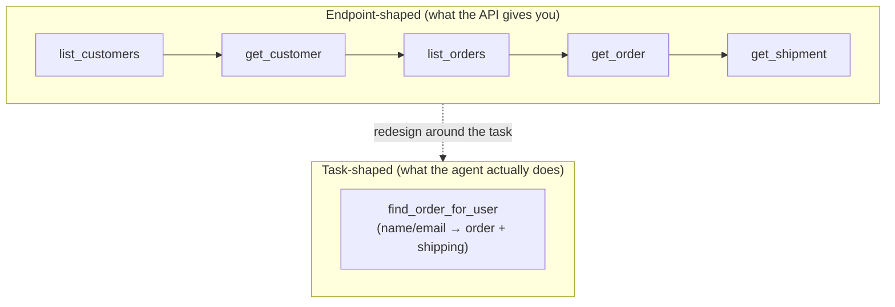

# Tool Design

## The problem it solves

[Tool calling](../agents/tool-calling.md) gives a model the *ability* to reach outside itself — emit a structured request, your code runs it, the result comes back. But that lesson answers "how does the mechanism work?" It does **not** answer the question that decides whether your agent is any good: **which tools should exist, and what exactly should each one look like?** That is tool design, and it is the single highest-leverage thing a product team controls. You cannot retrain the model, but you can completely change how well it performs by redesigning the tools you hand it — their names, their descriptions, the arguments they take, and the shape of what they return.

Here is the uncomfortable truth that makes this a real discipline and not an afterthought: **the model is the *user* of your tools, and it is a peculiar user.** It never reads your source code. It never asks you a clarifying question. It cannot see the database behind the tool or the comment you left in the function. Everything it knows about a tool — what it does, when to reach for it, what to pass it, what it got back — comes from four surfaces you author: the **name**, the **description**, the **input schema**, and the **return value**. Tool design is the craft of writing those four surfaces for a brilliant but context-starved reader who works alone and can't check with you. Get them right and a mediocre model looks capable; get them wrong and your best model flails, picks the wrong tool, invents arguments, or drowns in data it can't use.

> [!NOTE]
> **"Tool" here means what you expose to the model, not the underlying system.** A tool can wrap a REST API endpoint (API = application programming interface, a defined way for code to call another service; REST = a common style of web API where you call URLs to read/write data), a database query, a function, or a whole multi-step workflow. The key move in this lesson is that a tool is **not** the same as the API behind it — you *design* the tool as a deliberately shaped interface for the model, which often looks nothing like the raw API. Treating "wrap each endpoint as one tool" as the default is the most common tool-design mistake.

## The one analogy to remember

**The picture:** You're stocking a workshop for a gifted apprentice who will work alone, overnight, and can never phone you. The only things they can read are the **label on each tool** and a small **instruction card** taped to it; the only thing they can hand back to you is whatever comes out through a **result slot**. They never see how any tool is built. If a label is vague, they grab the wrong one. If you've crammed the bench with forty near-identical screwdrivers, they waste the night dithering over which. And if a tool spits a tangled heap of shavings into the slot, they can't tell the finished part from the scrap.

**The mapping:** the labels = your **tool names**; the instruction cards = your **descriptions** (what it does *and when to reach for it*); the set of tools you chose to put on the bench = your **tool selection and granularity**; the argument slots on each tool = its **input schema**; what comes back through the slot = the tool's **return value**.

**Why it holds:** it forces the one fact that reorganizes everything — **the apprentice knows only what you wrote on the surfaces.** There is no implementation to fall back on, no you to ask. So every design decision is really a writing-and-curation decision: label clearly, don't over-stock the bench, make the argument slots hard to misuse, and hand back a clean result, not a pile.

**Say it like this:** "The model is a reader, not a programmer. It chooses and uses a tool purely from the name, description, and schema I wrote, and it can only continue with what the tool hands back. Tool design is authoring those surfaces for a reader who can't ask questions."

*Where it breaks:* a real apprentice builds intuition over weeks and remembers last night's mistakes. The model starts almost cold each call, carrying only what's in its [context window](../foundations/context-windows.md) — so it can't learn its way around a badly designed bench the way a person eventually would. That raises the bar on the design, rather than lowering it.

## The four surfaces, and how to get each right

### 1. Naming and description — this is prompt engineering, not documentation

The model selects a tool by *reading*, so a tool's name and description are part of the prompt, judged by the same standard. [Tool calling](../agents/tool-calling.md) introduced this; tool design is where you operationalize it. Three rules carry most of the weight:

- **Say when to use it, not just what it does.** "Looks up order status" is a definition; "Use whenever the user asks where their order is or about a delivery date; takes an order ID" tells the model *when to fire*. The second form dramatically improves selection.
- **Disambiguate from neighbors.** If two tools are even slightly similar — `search_orders` and `get_order` — each description must say what makes it the right choice *versus the other*. Selection errors are very often two tools that read as interchangeable.
- **Name for the job, in the model's vocabulary.** `cancel_subscription` beats `svc_sub_mut_v2`. The model pattern-matches on natural language; an internal code name carries no signal.

### 2. Granularity — how many tools, and how big each one

This is the judgment call interviewers probe, because both extremes fail:

- **Too many, too fine-grained.** One tool per API endpoint means the model faces thirty tools, several near-identical, and must chain five of them to do one real task. Selection accuracy drops, the [loop](loop-engineering.md) lengthens, latency and token cost climb, and the chance of a wrong turn compounds at every step.
- **Too few, overloaded.** A single `manage_account` tool with a `mode` argument that does twelve different things is ambiguous to select and easy to misfill.

The resolution is the most important principle in tool design: **design tools around the *tasks the agent performs*, not around the API surface you happen to have.** If users always look up an order and then check its shipment, a single `get_order_with_shipping` tool may beat two separate calls — it collapses a two-step loop into one and removes a place to go wrong. Good tools often consolidate several underlying API calls into one task-shaped action. This is why "wrap each endpoint" is the classic mistake: your API was designed for programmers who compose calls in code; the model is a reader who does better with fewer, task-shaped tools.

### 3. Input schema — make the right call easy and the wrong call impossible

The schema (the arguments and their types — see [structured outputs](../reasoning-generation/structured-outputs.md) for how the model is made to emit schema-valid data) is where you prevent a whole class of failures *by construction*:

- **Constrain with enums, not free text.** If status can only be `shipped | pending | cancelled`, make it an enum. A free-text field invites the model to write `"in transit"` and miss.
- **Don't ask for arguments the model has to guess.** The worst schema demands a value the model has no way to know — an internal order ID when the user only gave their email. The model will *hallucinate* one (a [hallucination](../reasoning-generation/hallucination.md) wearing the costume of a valid argument) rather than admit it can't. The fix is design, not scolding: give it a lookup tool that turns an email into an order ID first, or accept the email directly.
- **Minimize required fields; use sensible defaults.** Every required argument is another thing the model can get wrong. If `limit` defaults to 20, don't force the model to supply it.
- **Describe each field too.** Per-argument descriptions ("date in YYYY-MM-DD") steer format and cut malformed calls.

### 4. Return value — hand back signal, not a data dump

The most overlooked surface. Whatever the tool returns is appended to the model's context and becomes the input it reasons over next, so two things matter at once: **usefulness** and **token economy**.

- **Return what the model needs to decide the next step, not everything the API returned.** A product-lookup tool that dumps a 4,000-token JSON (JavaScript Object Notation, a standard labeled-field text format) blob with internal IDs, pricing tiers, and audit fields buries the three facts the model needs and burns [context window](../foundations/context-windows.md) and [cost](../production-ops/cost-unit-economics.md) on noise. Project down to the relevant fields.
- **Never return unbounded volume.** "Return all matching rows" can be 10,000 rows. Paginate or cap, and tell the model there's more.
- **Errors are a steering opportunity, not a failure to hide.** When a call is wrong, return a *natural-language, actionable* message — `"No order found for that ID. Ask the user to confirm the order number, or use find_order_by_email."` — not a raw stack trace. The model reads the error and can correct its next call. A good error message is part of the tool's design.

## Why this is a product manager's (PM's) lever, not just an engineer's

Tool quality, not model choice, is frequently what separates an agent that works from one that doesn't — and it's the part you can change this week without touching the model. The loop is: ship tools → watch where the agent picks wrong, fills a bad argument, or gets a useless result → that's almost always a tool-design defect (vague description, endpoint-shaped granularity, an arg it had to guess, a bloated return), not a model limitation. You improve tools the way you improve a product: with [evals](../evaluation/evaluation-methods.md). Build a set of realistic tasks, run the agent, and measure tool-selection accuracy and argument correctness; treat a tool's description and schema as versioned surfaces you test and iterate, exactly like a prompt. And because tool definitions ride in the prompt on every request, keeping them lean also feeds straight into [prompt caching](../prompting/prompt-caching.md) and cost.

Tool design sits directly beneath the rest of this category: the [harness](harness-engineering.md) is what presents these tools and executes the calls, and the [loop](loop-engineering.md) is the model repeatedly choosing among them — both only work as well as the tools they operate on.

## Summary / Points to Remember

- **The model is the *user* of your tools, and a strange one:** it never reads your code or asks questions. All it knows comes from four authored surfaces — **name, description, input schema, return value.** Tool design is writing those four for a reader who can't check with you.
- **Name and description are prompt engineering.** Say *when* to use the tool, disambiguate it from similar tools, and name it in natural language. Weak tool selection is usually a description problem.
- **Granularity is the key judgment call.** Too many fine-grained tools → selection errors and long, costly loops; too few overloaded tools → ambiguity. **Design tools around the tasks the agent performs, not around your API endpoints** — good tools often consolidate several API calls into one task-shaped action. "Wrap each endpoint" is the classic mistake.
- **Design the input schema to prevent failures by construction:** constrain with enums, minimize required fields, give defaults, and **never require an argument the model has to guess** — or it will hallucinate one. Give it a lookup tool instead.
- **Return signal, not a dump.** Project down to the fields the model needs next, cap volume, and make **error messages natural-language and actionable** so the model can self-correct. The return value becomes the model's next input.
- **It's a PM lever:** tool quality often beats model choice, you can change it without retraining, and you improve it with **evals** that measure tool-selection and argument correctness — treating descriptions and schemas as versioned, tested surfaces.
- Tool design is the **foundation the [harness](harness-engineering.md) and [loop](loop-engineering.md) stand on**, and [MCP](../agents/mcp.md) is these same design principles standardized as a shareable protocol.

## Interview Questions That Stump People

**Q (clarify-back): "We gave our agent access to our REST API — one tool per endpoint, about 25 tools. It keeps picking the wrong one and chaining weird sequences. How would you fix it?"**

**Interviewer:** Twenty-five tools, one per endpoint, and the agent fumbles selection and sequencing. Where do you start?

**You (clarify back):** Quick check first — are those 25 tools mostly read operations, or are there writes in there too? And do the failing cases cluster around a few tasks users do repeatedly? That tells me whether this is pure selection confusion or also a safety concern.

**Interviewer:** Mostly reads, and yes — most failures are on the "find a customer's recent order and its shipping status" flow, which takes four or five of the tools chained.

**You:** Then this is a granularity problem, not a model problem. Twenty-five endpoint-shaped tools force the model to compose a multi-step plan out of primitives, and every hop is another chance to pick wrong or misfill an argument — which is exactly why one common flow fails. The fix is to stop mirroring the API and redesign the tools around the *tasks the agent actually performs*. I'd collapse that four-to-five-call flow into a single task-shaped tool — `find_recent_order_for_customer` that takes an email or name and returns the order with shipping already attached. That removes four decision points and four places to go wrong in one move. I'd do the same for the other repeated flows, keep the rare primitives only if something genuinely needs them, and sharpen each description to say *when* to use it versus its neighbors. Then I'd measure selection accuracy on a task eval set before and after. The principle: the API was designed for programmers composing calls in code; the model is a reader who does far better with fewer, task-shaped tools.

> [!TIP]
> **Why this works:** The weak answer reaches for a bigger model or more prompt tweaking. The strong answer identifies the real defect — endpoint-shaped granularity — and applies the central tool-design principle (design around tasks, consolidate API calls). Clarifying read-vs-write and which flows fail shows you diagnose before prescribing, and ending on an eval shows you treat tools as measurable surfaces.

---

**Q: "Our order-lookup tool takes an `order_id`, but users only ever give us their email. The model keeps passing order IDs that don't exist. Is the model broken?"**

**Interviewer:** The tool needs an order ID, the user never has one, and the model keeps inventing IDs. Model problem?

**You:** No — it's a schema-design problem, and the model is doing the predictable thing. You've required an argument the model has no way to know. Faced with a required field it can't fill, the model doesn't stop and say "I lack this"; it generates the most plausible-looking value, which is a hallucinated order ID that happens to pass the schema's type check. So the failure is built into the tool. The fix is design, not prompting. Two options: either change the tool to accept what the user actually has — let it take an email and resolve the order internally — or give the model a preceding lookup tool that turns an email into a real order ID, so the ID it passes downstream came from a tool result instead of its imagination. Generally: never require an argument the model would have to guess. If it can't be derived from the conversation or a prior tool result, it shouldn't be a required field the model fills.

> [!TIP]
> **Why this answer works:** It reframes a "bad model" complaint as a design defect and explains the mechanism — a required-but-unknowable argument forces a hallucinated value that passes type validation, so it's invisible until it fails downstream. Offering both fixes (accept the real input, or add a resolving tool) and the general rule shows this is a principle, not a one-off patch.

---

**Q: "Is there any harm in a tool just returning the full API response? More data is more context for the model, right?"**

**Interviewer:** Why not let the tool return everything the API gives back — isn't more information strictly better for the model?

**You:** It's usually worse, for two reasons. First, usefulness: whatever the tool returns gets appended to the context and becomes what the model reasons over next, so a 4,000-token blob full of internal IDs, audit fields, and pricing tiers *buries* the three facts the model actually needs. Signal gets lost in noise, and selection of the next step gets harder, not easier. Second, economics: that blob is input tokens on this call and every subsequent call in the loop that carries the history, so you're paying — in latency, in cost, and in context-window budget — for data the model never uses. Multiply that across a multi-step agent and it's significant. The right move is to treat the return value as a designed surface: project down to the fields relevant to the task, cap or paginate anything unbounded, and return it in a shape the model can act on. "More data" helps a human analyst who can skim; it hurts a model that has to carry everything forward and pay for it each turn.

> [!TIP]
> **Why this answer works:** It attacks the intuitive-but-wrong premise on both axes — reasoning quality *and* token economics — and ties the cost to the fact that tool results persist in the loop's growing context. Naming the return value as a deliberately designed surface (not just "whatever the function returns") is the senior signal.

---

**Q: "How do you actually know if your tools are well-designed? It feels subjective."**

**Interviewer:** Tool design sounds like taste. How do you make it measurable?

**You:** You make it an eval problem, the same way you'd de-subjectify a prompt. I'd build a set of realistic tasks that exercise the agent end to end, then instrument two things the tools directly control: **tool-selection accuracy** — did the model pick the right tool for each step — and **argument correctness** — were the arguments well-formed and right, or did it guess. Those two metrics localize the defect: low selection accuracy points at vague or overlapping descriptions and bad granularity; bad arguments point at schema problems, like a required field the model can't know. Then I treat each tool's description and schema as a versioned surface, change one, and re-run the eval to see the metric move — exactly like iterating a prompt against a test set. I'd also watch production traces for the tells: the model calling a tool and immediately correcting, or chaining five calls where one task-shaped tool would do. So it's not taste; it's "pick tasks, measure selection and argument quality, iterate the surfaces against the numbers."

> [!TIP]
> **Why this answer works:** It converts a fuzzy question into a concrete measurement loop and, crucially, names *which* metric implicates *which* surface — selection↔description/granularity, arguments↔schema. That diagnostic mapping, plus treating tool definitions as versioned and eval-gated like prompts, shows tool design as an engineering discipline rather than intuition. Links cleanly to [evaluation methods](../evaluation/evaluation-methods.md).
