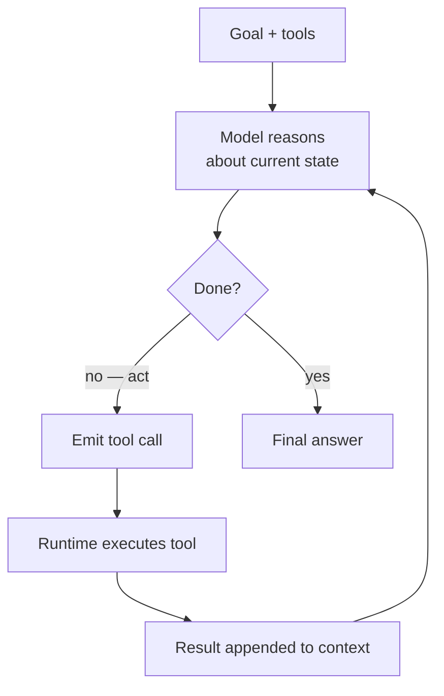
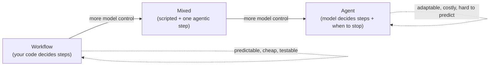

# Agentic Systems

## The problem it solves

[Tool calling](tool-calling.md) let the model make a call and use the result. But look at what a real task actually demands: "research this company and draft a personalized outreach email." That isn't one call — it's *search, read what came back, decide what to search next based on it, synthesize, draft, maybe notice a gap and go look again.* The number of steps and their order **aren't known in advance**, because each step depends on what the previous one returned. You could try to script it — a fixed pipeline of "search, then summarize, then draft" — but the moment the task branches in a way you didn't hardcode (the first search was useless, so now what?), a scripted flow is stuck. To script it fully you'd have to enumerate every possible branch, which for open-ended work is impossible.

An **agentic system** solves this by handing the control flow to the model itself. Instead of your code deciding the sequence of steps, the model runs in a **loop** — look at the situation, decide the next action, take it (a tool call), see the result, decide again — and it keeps going until it judges the goal met. The model stops merely *answering* and starts *driving*. That one shift — **the model, not your code, decides what happens next** — is the whole idea, and everything else in this category ([memory](agent-memory.md), [planning](planning-orchestration.md), [multi-agent](multi-agent.md)) is machinery bolted around it.

## The one analogy to remember

**The picture:** two ways to get work out of a new hire. You can hand them a **checklist** — a fixed standard operating procedure (SOP — the written "do step 1, then 2, then 3" a job comes with) — and they execute it exactly. Or you can hand a capable **intern a goal** — "find out why our biggest customer churned and draft a recovery plan" — plus access to the tools (the systems, the phone, the email), and let them figure out the steps themselves: they look somewhere, what they find sends them somewhere else, they decide the next move as they go.

**The mapping:** the goal you hand the intern = the agent's objective; the intern deciding each next move themselves = the **model controlling the loop**; the systems and access you give them = the agent's **tools**; the intern going down a rabbit hole or re-checking the same drawer forever = the agent **looping / running away**; the checklist worker = a **scripted workflow** (the thing an agent is *not*).

**Why it holds:** the defining difference between a workflow and an agent is *who decides the next step* — the checklist decides it in advance (you), the intern decides it at runtime (themselves). That is exactly **autonomy over control flow**, the single property that makes a system "agentic." The analogy also carries the central tradeoff honestly: handing over the goal buys adaptability to situations you didn't foresee, at the price of not being able to predict exactly what will happen.

**Say it like this:** "An agent is an LLM in a loop — you give it a goal and tools, and *it* decides the steps: act, see the result, decide the next move, until it's done. The line between a workflow and an agent is who's in charge of the sequence — your code, or the model."

*Where it breaks:* a real intern learns across the day, genuinely understands the goal, and has the common sense to notice when they're off track. An LLM agent has no memory unless you [build it in](agent-memory.md), can't reliably verify its own work, and will compound a wrong turn without noticing — so it's a more literal, more brittle "intern" than the picture flatters it to be.

## The mechanism: an LLM in a loop

Strip an agent to its core and it's astonishingly simple — a **large language model (LLM) running in a loop with tools and a goal**:

1. **Goal in.** The user's objective enters the context, along with the available [tools](tool-calling.md).
2. **Reason.** The model thinks about the current state — what's been done, what's left (this is where [chain-of-thought](../reasoning-generation/chain-of-thought.md) reasoning earns its keep, deciding the next move).
3. **Act.** The model either emits a **tool call** (an action) or decides it's finished and emits a final answer.
4. **Observe.** If it acted, your runtime executes the tool and appends the result to the context.
5. **Loop.** Back to step 2 with the new information — until the model finishes or a stop condition (a step limit, a budget, an error) halts it.

So an agent is not a new kind of model — it's **tool calling + a loop + the autonomy to choose and sequence the steps.** The model you're using is the same one; "agent" describes the *harness* around it and *who holds the steering wheel*.

## It's a spectrum, not a switch

The interview-grade insight is that "workflow vs. agent" is **not binary** — it's a continuum of how much control you cede to the model. At one end, a **workflow**: your code owns the steps and the model just fills in blanks (classify this, summarize that) at fixed points — predictable, cheap, testable. At the other, a **fully autonomous agent**: the model decides everything, including when to stop. Most real systems sit in between — a mostly-scripted flow with one step where the model gets to loop and decide.

The design rule a PM (product manager) should carry: **use the least autonomy that solves the problem.** Autonomy is not a goal — it's a cost you pay to handle tasks whose path you genuinely can't pre-script. If the task is well-defined and repeatable, a workflow beats an agent on reliability, cost, and debuggability. Reaching for a full agent by default is the most common — and most expensive — mistake.

## What a PM must know about the tradeoffs

- **Compounding error is the signature failure.** In a multi-step agent, mistakes multiply. If each step is 95% reliable, ten steps end-to-end are only ~60% reliable (0.95¹⁰); at 90% per step, ten steps is ~35%. A path that must go right at every link is fragile in a way a single call never is. This is *the* thing that separates agent reliability from model reliability.
- **Unpredictability and hard debugging.** Because the model chooses the path, two runs of the same task can differ, and a failure may not reproduce. You can't test an agent by enumerating cases the way you'd test a workflow.
- **Cost and latency multiply.** Every loop iteration is a model call, and the context grows with each appended result — so a ten-step agent is many model calls over an ever-longer prompt. (This is exactly why [prompt caching](../prompting/prompt-caching.md) and lean tool results matter for agents.)
- **Runaway behavior.** Agents can loop, get stuck re-trying, or pursue a wrong subgoal enthusiastically. You need hard guardrails: step/iteration caps, spending budgets, and — for any irreversible action — human approval, since the [security seam from tool calling](tool-calling.md) is now wider (more calls, chosen autonomously, some steerable by [prompt injection](../safety-trust/ai-security.md)).
- **When to actually use one.** Open-ended tasks where the path varies run-to-run and can't be enumerated, *and* where the value clears the unpredictability cost. Otherwise, script it.

## Summary / Points to Remember

- Tool calling handles one step; real tasks need **many steps whose sequence depends on earlier results and can't be pre-scripted.** An agentic system hands the **control flow to the model.**
- An agent is **an LLM in a loop with tools and a goal**: reason → act (tool call) → observe result → repeat, until it decides it's done. It's **tool calling + a loop + autonomy**, not a new kind of model.
- The defining property is **autonomy over control flow — the model, not your code, decides the next step and when to stop.** That's the line between a *workflow* (you script the steps) and an *agent*.
- It's a **spectrum**, not a switch. Design rule: **use the least autonomy that solves the problem** — a workflow beats an agent on reliability, cost, and testability whenever the path is knowable.
- Signature failure: **compounding error** — per-step reliability multiplies, so long chains get fragile fast (95%/step × 10 steps ≈ 60%). Plus **unpredictable paths**, **multiplied cost/latency**, and **runaway loops** needing step caps, budgets, and human approval for irreversible actions.
- The parts around the loop — [memory](agent-memory.md), [planning/orchestration](planning-orchestration.md), [multi-agent](multi-agent.md) — have their own lessons; the loop is the core.

## Interview Questions That Stump People

**Q (clarify-back): "Leadership wants to 'make our product agentic.' How would you approach it?"**

**Interviewer:** There's top-down pressure to add agents. Where do you start?

**You (clarify back):** Can I start from the task rather than the label — what specifically are we trying to let users accomplish, and does that task have a path we can't script in advance? Because "agentic" is a means, and whether it fits depends entirely on that.

**Interviewer:** Fair. The use case is: a user asks a question about their data and we answer it. Sometimes it needs a couple of lookups.

**You:** Then I'd push back gently on going fully agentic. That task sounds mostly scriptable — a known set of lookups feeding an answer — which means a workflow, maybe with one model-controlled step for the lookups, would be more reliable, cheaper, and far easier to test than a free-roaming agent. My rule is to use the *least* autonomy that solves the problem, because autonomy isn't a feature users want — it's a cost we pay only when the task's path genuinely can't be pre-planned. I'd reserve a real agent for the open-ended cases where the steps truly vary run-to-run. So my approach is: map the task's control flow first, script what's knowable, and hand the model the wheel only where we can't. "Make it agentic" as a goal usually means someone's optimizing for the label, not the outcome.

> [!TIP]
> **Why this works:** The prompt is a buzzword directive, and the trap is to enthusiastically build a maximally autonomous agent. The strong move is to reframe from "agentic" to "what task, and is its path scriptable?" — then apply *least-autonomy-that-works*. Recommending a workflow for a scriptable task signals you understand autonomy is a cost, not a prize, which is exactly the judgment that separates a PM who's shipped agents from one who's read about them.

---

**Q: "Our individual model calls are ~95% accurate, but the agent flakes out on real tasks. How is that possible?"**

**Interviewer:** Each step tests at 95%. Users still see the agent fail constantly on multi-step jobs. Explain.

**You:** Compounding error. Reliability multiplies across steps, it doesn't average. If every step in a chain is independently 95% reliable and a task takes ten steps that all have to go right, the end-to-end success rate is 0.95 to the tenth — about 60%. At 90% per step it's down near 35%. So a per-step number that looks great produces an agent that fails more often than it succeeds on long tasks, purely from length. That's why agent reliability is a different problem from model reliability, and why the fixes are structural, not just "use a better model": shorten the chains, add verification or checkpoints so an error gets caught instead of propagating, let steps retry, and keep a human in the loop at the high-stakes links. The instinct to blame the model's accuracy misses that the arithmetic of chaining is the real culprit.

> [!TIP]
> **Why this answer works:** It names the specific mechanism — multiplicative, not additive, reliability — and puts a number on it, which instantly demonstrates you understand why agents are fragile in a way single calls aren't. Pivoting to *structural* fixes (shorter chains, verification, checkpoints) rather than "better model" shows you know where the leverage actually is.

---

**Q: "What's the real difference between an agent and a workflow — isn't a workflow with tool calls already an agent?"**

**Interviewer:** My pipeline calls the model and calls tools in sequence. Is that an agent?

**You:** Not necessarily — the question isn't whether tools are involved, it's *who decides the sequence*. In your pipeline, your code decides the steps: call the model here, call this tool next, in an order you wrote. The model fills in blanks but doesn't choose the path. That's a workflow. It becomes agentic when you hand the model control over the control flow — when *it* decides which action to take next, and when to stop, based on what it's seen. The clean test: if I can draw the possible execution paths as a fixed flowchart you authored, it's a workflow; if the model generates the path at runtime and you couldn't have drawn it in advance, it's an agent. And it's a spectrum — most systems are a scripted flow with one step where the model gets to loop. So "workflow with tool calls" is usually still a workflow. The autonomy over sequencing is the dividing line.

> [!TIP]
> **Why this answer works:** It refuses the surface cue ("has tool calls → agent") and locates the real distinction — *control over the sequence*. The "could you have drawn the flowchart in advance?" test is a crisp, reusable discriminator, and acknowledging the spectrum shows you're not treating a nuanced continuum as a binary, which is the more sophisticated read.

---

**Q: "Beyond a step limit, what would you put in place before letting an agent take real actions in production?"**

**Interviewer:** You've capped iterations. What else stands between the agent and doing damage?

**You:** The core issue is that an agent takes *many* tool calls, chooses them itself, and some of them can be irreversible — so the tool-calling security problem gets wider. Beyond the step cap I'd do several things. First, split tools by blast radius: read-only actions can run freely, but anything irreversible or costly (spend money, send external messages, delete data) requires a human approval step or a confirmation gate. Second, scope permissions tightly so even a misguided agent can't act outside a safe range. Third, treat everything the agent reads — tool results, retrieved documents — as untrusted, because a prompt injection buried in that content can hijack the loop into calling tools maliciously. Fourth, budgets and observability: spend caps, and full traces of the agent's steps so I can actually debug a nondeterministic failure. The mental model is that autonomy amplifies both capability and blast radius, so the guardrails live in the execution layer, not in trusting the model to behave.

> [!TIP]
> **Why this answer works:** A step limit only stops runaway *length*; it does nothing about *damage per action*. The strong answer scales guardrails to blast radius (read-only vs. irreversible), carries forward the untrusted-input insight from tool calling, and adds observability for the nondeterminism problem — showing you understand that an agent widens the security seam and that safety belongs in the execution layer, not the model's judgment.
