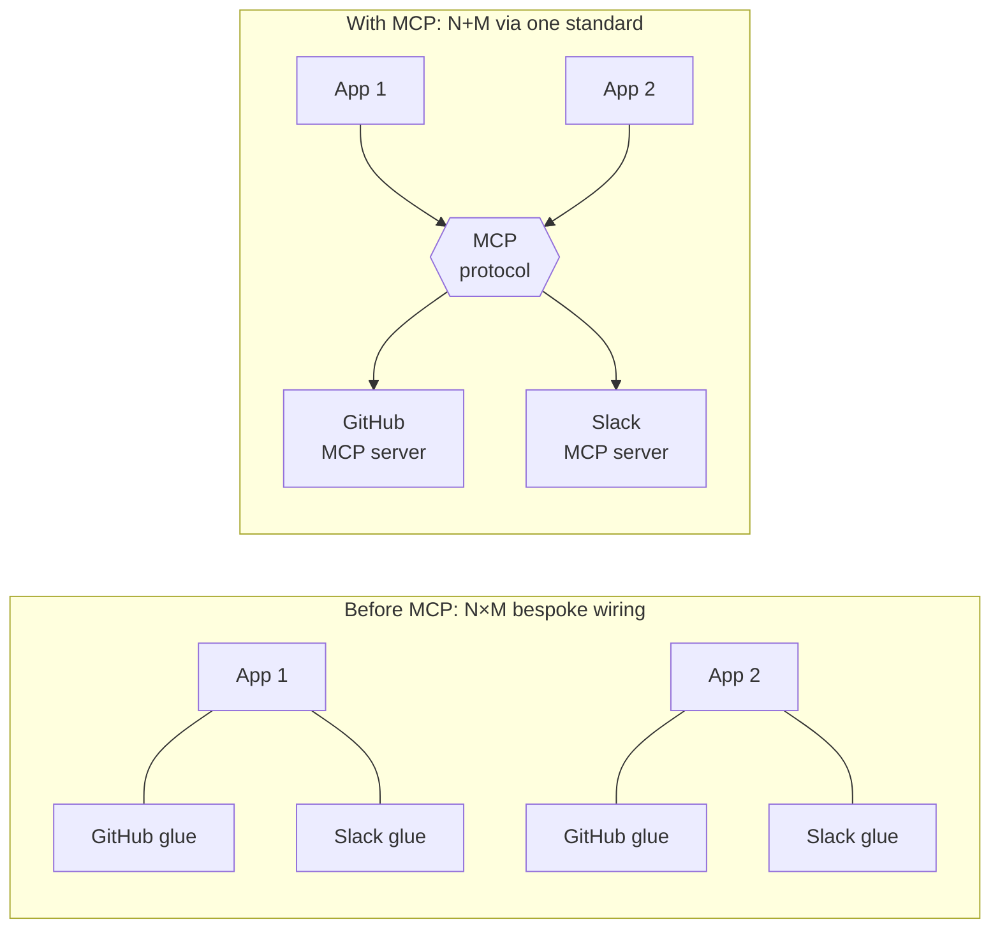
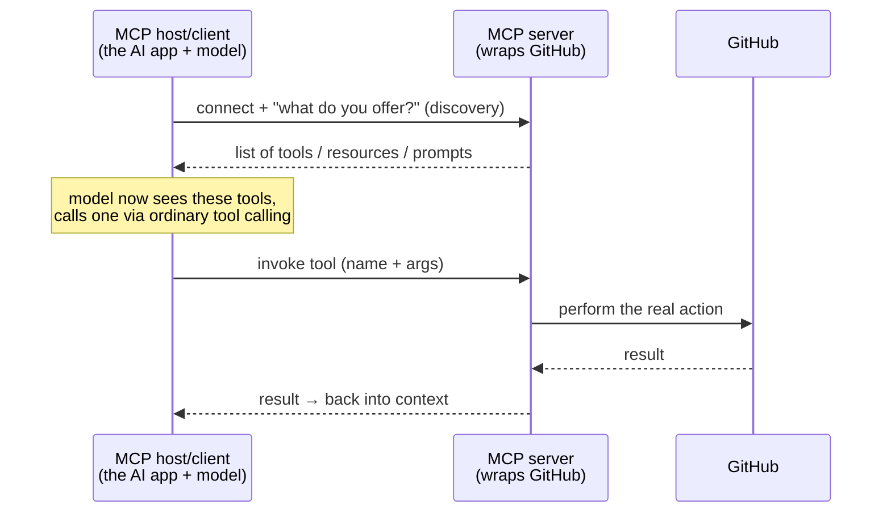

# MCP (Model Context Protocol)

## The problem it solves

[Tool calling](tool-calling.md) gave the model a superpower: it can request an external function and act on the world. But it left a mess behind, and the mess is about **integration, not capability**. Every tool you want the model to use, you wire up by hand — you write the tool's schema, its authentication, and the execution glue, and you write all of it *specifically* for your app and your framework. Want your assistant to reach GitHub, Slack, Google Drive, and your internal database? That's four bespoke integrations. Now the team next door wants the same four tools for *their* app — they build the same four again from scratch, because your glue was written for your stack. Multiply it out: **N AI applications × M tools = N×M** separate, redundant, hand-maintained integrations. There is no standard way for a tool provider — say GitHub — to describe its capabilities *once* and have any AI app consume them. Everyone reinvents the same connectors, and every connector rots independently.

**MCP (Model Context Protocol)** is an open standard — introduced by Anthropic in late 2024 — that fixes this by standardizing the interface between AI applications and external tools and data. A tool provider builds **one** MCP server that exposes its capabilities in a standard way; **any** MCP-compatible application can then connect to it and use those capabilities without custom wiring. That collapses the integration explosion from **N×M into N+M**: each app learns the protocol once, each tool provider implements it once, and they interoperate. The one-line frame interviewers love: **MCP is "USB-C for AI tools."**

> [!NOTE]
> **What MCP is *not*.** It is not a model, not a feature of the model, and not a product you buy. It is a *protocol* — a shared agreement for how an AI application and an external tool provider talk to each other. It sits *around* tool calling; it does not replace it. The model still emits a tool-call request exactly as in [tool calling](tool-calling.md); MCP standardizes how that tool got discovered and how the request is routed to whatever executes it.

## The one analogy to remember

**The picture:** the USB-C port on a laptop. Before a universal port, every peripheral came with its own proprietary plug — one cable for the printer, a different one for the drive, a barrel connector for power — and a laptop needed a specific socket for each. USB-C replaced that drawer full of incompatible cables with one standard port: any compliant device plugs into any compliant machine and just works.

**The mapping:** the laptop with its ports = the AI application (the "host"); the USB-C standard itself — the plug shape *plus* the protocol running over it = MCP; a peripheral that speaks USB-C (a drive, a monitor) = an **MCP server** wrapping some system like GitHub or your filesystem; what the peripheral offers once connected (storage, display) = the **tools and data** that server exposes.

**Why it holds:** the value lives in the *standard*, not in any single connector — and that is exactly MCP's mechanism. Before USB-C, N devices × M proprietary ports meant a tangle of one-off cables; one shared standard collapses that to "any peripheral works with any host." MCP does precisely this for AI-to-tool wiring: build the server once, and every MCP client can use it. The standardization *is* the point, in both the port and the protocol.

**Say it like this:** "MCP is USB-C for AI tools — an open standard so a tool provider builds one server and any AI app can plug into it, instead of every team hand-wiring every tool to every app. It standardizes how tools are discovered and called, not how smart the model is at using them."

*Where it breaks:* a USB-C cable is passive and safe — the worst it does is fail to charge. An MCP server is **active code with real access** to your systems, so connecting a third-party server is closer to *installing software* than plugging in a cable; the trust and security stakes are far higher than a port suggests. And USB-C is universal and mature, whereas MCP is young and not yet everywhere — a gap the tidy analogy hides.

## The architecture: host, server, and the protocol between

Three roles, and keeping them straight is most of the lesson.

- **The MCP host / client** is the AI application — Claude Desktop, an IDE (integrated development environment — the coding app a developer works in), or a custom [agent](agentic-systems.md). It contains the model and *initiates* connections out to servers. ("Host" is the app; "client" is the connector inside it that speaks to one server — you can treat them together as "the app side.")
- **An MCP server** is a small program that exposes the capabilities of one system — GitHub, a filesystem, a Postgres database, a ticketing tool — in the MCP standard. Whoever owns or wraps that system builds the server *once*.
- **The protocol** is the shared language between them: how the client asks "what do you offer?", how the server answers, and how a tool gets invoked and its result returned.

The flow that makes it click: when the app starts, its client **connects to a server and asks what it provides** — this **dynamic discovery** is the part hand-wired tool calling didn't have. The server replies with its available tools (and other capabilities, below). Those tools are now offered to the model, which — using ordinary tool calling — decides to call one; the request is routed over the protocol to the server, which executes it against the real system and returns the result.

## What a server can expose (kept at overview depth)

An MCP server can offer three kinds of things. You don't need the wire details, only the shape:

- **Tools** — functions the model can call. This is the [tool-calling](tool-calling.md) primitive, now *discovered dynamically* over the protocol instead of hardcoded into the app.
- **Resources** — data or content the server can hand over to load into the model's [context](../foundations/context-windows.md): files, records, documents.
- **Prompts** — reusable prompt templates the server provides, so a provider can ship a good "way to ask" alongside its tools.

The PM (product manager) relevant takeaway is not the taxonomy — it's that a provider packages *access* (what the model can do and see) in a standard envelope, so any client gets it uniformly.

## What a PM must know about the tradeoffs

- **Security is the headline, and it's bigger than tool calling's.** An MCP server executes code and usually holds real credentials and access — to your files, your repos, your data. Connecting to a *third-party* or untrusted server is effectively running someone else's software with your permissions. Worse, a malicious or compromised server, or poisoned data returned as a "resource," can carry a [prompt injection](../safety-trust/ai-security.md) that hijacks the agent into calling other tools destructively. This is the same untrusted-input seam from tool calling, now *widened* because you're inviting external servers into the loop. Vet servers like you'd vet a dependency, scope their permissions, and don't auto-connect to servers you don't trust.
- **It standardizes access, not judgment.** MCP makes tools easy to *reach*; it does nothing to make the model better at *choosing* the right one — that's still tool calling and good tool descriptions. A team hoping MCP will fix a model that picks the wrong tool is aiming at the wrong layer.
- **It's a young, evolving standard.** Adoption is growing fast but it isn't universal; not every app or model runtime supports it, and the spec is still moving. Betting on it is reasonable, but "MCP-compatible" today is not the guarantee "USB-C" is.
- **It adds a moving part.** Each server is a process to run, connect to, authenticate, and keep alive — real operational surface, not free.

## Summary / Points to Remember

- Tool calling gave the model the *ability* to use tools; MCP fixes the *integration mess* it left — hand-wiring every tool to every app is **N×M** redundant connectors.
- **MCP (Model Context Protocol)** is an open standard (Anthropic, late 2024) for how AI apps talk to external tools and data. Build a server once, any MCP client uses it: **N×M → N+M.** The frame is **"USB-C for AI tools."**
- It is a **protocol, not a model or product**, and it sits *around* tool calling — the model still emits tool-call requests exactly as before; MCP standardizes **discovery** and **routing**.
- Three roles: the **host/client** (the AI app, initiates connections), the **server** (wraps one system, built once), and the **protocol** between them. The new trick vs. hand-wired tools is **dynamic discovery** — the client asks a server what it offers at runtime.
- A server can expose **tools** (callable functions), **resources** (data for context), and **prompts** (templates).
- Tradeoffs a PM must name: **security is the big one** — a server is active code with real access, so connecting an untrusted one is like installing software, and poisoned resources can inject the agent; MCP **standardizes access, not the model's judgment**; it's a **young standard**; and it's **another moving part** to operate.

## Interview Questions That Stump People

**Q (clarify-back): "We already have tool calling working. Someone's pushing us to 'switch to MCP.' Is that an upgrade to how the model uses tools?"**

**Interviewer:** We've got function calling in production. The proposal is to move to MCP. Does that make the model better at using tools?

**You (clarify back):** Are we trying to make the model *choose or use* tools better, or are we trying to reduce the cost of *integrating and maintaining* all these tool connections across our apps? Because MCP targets the second, not the first.

**Interviewer:** Honestly it's the maintenance — we've got the same connectors rebuilt in three different apps.

**You:** Then MCP is the right move, and for exactly that reason. It won't change how the model decides which tool to call — that's still tool calling and how well we write the tool descriptions. What it changes is the plumbing: instead of three apps each hand-wiring the same connectors, whoever owns each system builds one MCP server, and all three apps connect to it through the standard. That's the N×M-to-N+M win, and it kills the duplicate-maintenance problem you described. If the complaint had been "the model keeps picking the wrong tool," I'd have told you MCP won't help — that's a description-and-selection problem, a different layer.

> [!TIP]
> **Why this works:** The question smuggles in a false premise — that MCP is a *capability* upgrade. The strong move is to separate the two layers: MCP standardizes *access and integration*, tool calling governs *use and judgment*. Clarifying which problem they actually have pins down whether MCP even applies, and naming what it explicitly does *not* fix shows you understand it's plumbing, not intelligence.

---

**Q: "What's the actual risk in connecting our agent to a third-party MCP server we found online?"**

**Interviewer:** There's a public MCP server that does exactly what we need. What's the danger in just plugging it in?

**You:** The danger is that you're not "plugging in a cable" — you're running someone else's code with your system's access. An MCP server executes on the tool side and typically holds real credentials and permissions, so a malicious or compromised server can act with whatever access you granted it. On top of that, anything the server sends back — a tool result, or a "resource" it loads into context — is untrusted content that can carry a prompt injection, steering our agent into calling *other* tools in harmful ways. So the risk model is closer to installing an untrusted dependency than connecting a peripheral. I'd treat a third-party server exactly like a third-party library: vet the source, scope its permissions to the minimum, prefer servers we or a trusted party control for anything sensitive, and never auto-connect. The convenience is real, but the trust boundary moved outward the moment we invited an external server into the loop.

> [!TIP]
> **Why this answer works:** It rejects the comfortable "USB-C" mental model at exactly the point the analogy breaks — a server is active code, not a passive cable. Naming both attack surfaces (the server's own access *and* injected content in its responses) and reaching for the "treat it like a dependency" framing shows you understand MCP widens the untrusted-input seam from tool calling, which is the security-literate answer.

---

**Q: "Why did this need a new standard at all? Couldn't every tool just expose a normal web API and be done?"**

**Interviewer:** APIs already exist everywhere. Why invent MCP instead of just calling regular APIs?

**You:** Because a raw API (application programming interface — a defined way for code to talk to a service) solves a different problem. APIs let *programs* talk to services, but each one is described differently and has to be adapted, per app, into something a model can discover and call. What was missing was a *uniform* way for an AI application to connect to any tool provider, ask "what do you offer?", and get back tools, data, and prompts in a shape the model side already understands — without bespoke glue each time. That's what a standard buys: not a new capability, but agreement. It's the same reason the web needed HTTP (HyperText Transfer Protocol, the one shared language browsers and servers use) rather than every site inventing its own transport — the value is that everyone speaks the same protocol, so any client works with any server. You *can* wrap a plain API yourself for one app; MCP means you don't have to, and everyone else's app benefits from the same server.

> [!TIP]
> **Why this answer works:** It resists the trap that "we already have APIs, so a standard is redundant." The insight is that the problem was never *ability to call a service* — it was the absence of a *uniform, discoverable* interface between AI apps and tools. Framing the standard as "agreement, not new capability," with the HTTP precedent, shows you understand why interoperability standards exist rather than dismissing MCP as reinvented plumbing.

---

**Q: "If MCP is just standardizing tool calling, what does it genuinely add that hand-writing tool schemas didn't already do?"**

**Interviewer:** We can already hand the model tool schemas ourselves. Concretely, what does MCP add?

**You:** Two things, and neither is a new model capability. First, **dynamic discovery**: with hand-written schemas, the tools are baked into your app at build time — to add a tool you edit and redeploy the app. With MCP, the client connects to a server and asks what it offers at runtime, so tools can be added or changed on the server side and the app picks them up without being rebuilt. Second, **decoupling and reuse**: the tool provider maintains the server once, and every MCP-compatible app can use it, so you're not the one writing and maintaining schema-and-glue for each tool in each app. Hand-written schemas work fine for a couple of fixed, private tools; MCP earns its keep when you have many tools, multiple apps, or tools owned by other teams or vendors. It's the difference between soldering a wire and adding a standard port.

> [!TIP]
> **Why this answer works:** The question is skeptical and specific, so a vague "it standardizes things" fails. Naming the two concrete gains — *runtime discovery* (vs. build-time hardcoding) and *build-once-reuse-everywhere decoupling* — and then honestly bounding when it's *not* worth it (a few fixed private tools) shows judgment, not advocacy. Interviewers reward knowing when a technique *doesn't* pay off as much as when it does.
