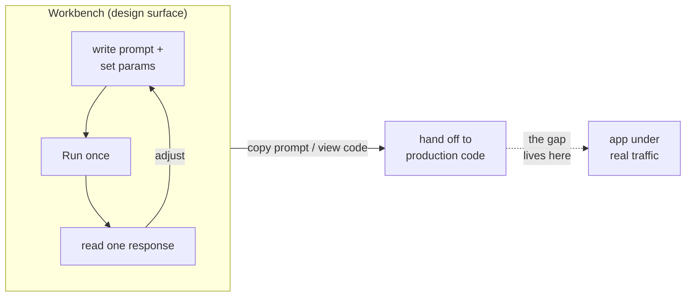
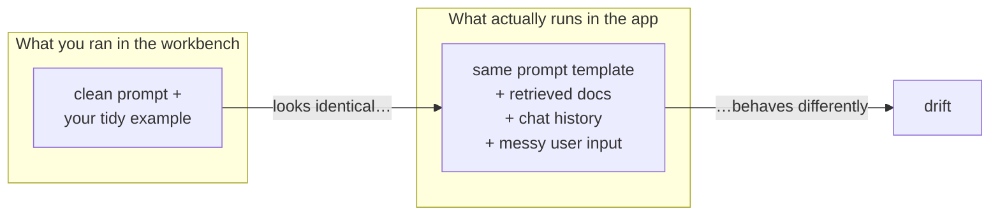

# Workbench / Playground

## The problem it solves

You have an idea for how the model should behave — a support agent that stays terse, a summarizer that always returns three bullets, a classifier that picks one of five labels. To find the prompt that produces that behavior you need to try a phrasing, see what comes back, adjust a word, try again, and again, and again. Prompting is not something you reason your way to on paper; it's a *feedback loop*, and the loop is only useful if each turn is fast.

Now imagine running that loop through code. Every experiment means editing a source file, wiring up an API (application programming interface — the way your code talks to the model) key, handling the response object, printing it, and re-running the script — a full minute of plumbing to test a one-word change to a prompt. The plumbing dwarfs the experiment. Worse, the person who most needs to iterate on the prompt — a product manager, a designer, a domain expert writing the support-agent persona — often can't write that code at all, so every idea has to be relayed through an engineer, and the loop slows from seconds to days.

A **workbench** (Anthropic's name) or **playground** (OpenAI's name) is the fix: a web page where you type a prompt into a box, click Run, and read the model's response — no code, no keys in a file, no deploy. Beside the prompt sit controls for the generation settings — the model, [temperature and the other sampling knobs](../03-reasoning-generation/16-sampling-decoding.md), max tokens, the system prompt — so you can change a setting and re-run in the same second. It collapses the iteration loop to its essence: type, run, read, adjust. That speed is the entire point, and — as we'll see — also the source of its most dangerous illusion.

## The one analogy to remember

**The picture:** a test kitchen. A chef developing a new dish doesn't cook it for the first time on a packed Friday night service. She works at a single station with everything in reach — taste a spoonful, add salt, taste again, adjust the heat — dialing the recipe in fast, in isolation, with no tickets stacking up and no diners waiting.

**The mapping:** the test kitchen = the workbench; developing the recipe = iterating on the prompt; the tasting spoon = clicking Run and reading one response; the burner and seasoning within reach = the temperature, model, and system-prompt controls beside the prompt box; the packed Friday-night service = your production application under real traffic.

**Why it holds:** the test kitchen is deliberately *not* the restaurant — its whole value is that it strips away everything except the cook and the dish so the recipe can be perfected quickly. That is exactly what a workbench is for and exactly its limit: a recipe that tastes perfect at the test station can still fall apart at Friday service, where the volume, the timing, the substitute ingredients, and the line cook following the card are all different. Nailing it in the test kitchen is necessary, but it is not proof the dish will land on the night.

**Say it like this:** "A playground is a test kitchen for prompts — the fastest place to perfect the recipe, but not where you find out whether it survives a real dinner rush."

*Where it breaks:* a chef tasting the spoonful gets direct, honest feedback about that exact dish; a workbench, run once, shows you *one* sample of a model that answers differently each time you ask, so a single good result can flatter a prompt that's actually shaky.

## What a workbench actually is — and what it is not

Strip it down and a workbench is three panes: a place to write the prompt (usually a system prompt plus a user message), a Run button, and a place the response appears — wrapped around a plain API call the page makes for you. Around that core sit conveniences: a dropdown to pick the model, sliders for the [generation parameters](../03-reasoning-generation/16-sampling-decoding.md), a token counter, a way to save or share a prompt, and often a "view code" button that emits the equivalent API snippet so an engineer can lift your working prompt straight into the app.

That last feature is the tell for what a workbench is *for*. It is a **design surface** — the place you *author and discover* a prompt — and its output is meant to be *handed off*. It is emphatically **not a testing surface**. Testing asks "does this hold up across the thousand inputs I'll actually see, and did my last change break anything?" A workbench answers a different, narrower question: "on this one input I just typed, does this one prompt, right now, produce something I like?" Those look similar in the moment and are worlds apart in what they guarantee.

The dotted edge in that diagram is the whole lesson. Everything to the left of the hand-off is fast, manual, and single-shot. Everything to the right is automated, high-volume, and unforgiving. A workbench makes the left side feel so productive that it's easy to forget the right side exists.

## The workbench-to-production gap

Here is the load-bearing idea, and the one an interviewer is really testing: **"it worked in the workbench" is a warning sign, not proof.** The behavior you perfected in the playground can silently drift when the same prompt runs in your application, and it drifts for reasons that are invisible from inside the workbench.

**The parameters differ.** The workbench has its own defaults — a model, a temperature, a max-token limit, sometimes a hidden default system prompt — and your production code has its own, set somewhere else by someone else. If the playground was running at temperature 0.7 and your app calls the model at 1.0, you are not running the prompt you tested; you're running a *more random* version of it. The prompt is identical and the behavior is not.

**The model version differs.** "Claude" or "GPT-4" in a dropdown is a moving target — providers ship updated snapshots, and the workbench often points at the newest by default while your code pins an older dated version (or vice versa). A prompt tuned against one snapshot can behave differently on another. If you don't control the version on both sides, you're comparing two different models.

**The surrounding context differs — and this is the big one.** In the workbench you type a clean, isolated prompt. In production that same prompt is a *template* that gets filled at runtime with retrieved documents, conversation history, tool outputs, and user text you never previewed — all of it competing for room in the [context window](../01-foundations/05-context-windows.md). The polished instruction you tested in a vacuum now sits buried under three pages of injected content, and real user inputs are messier, longer, and more adversarial than the tidy example you typed. You tested the recipe; production serves it with substitute ingredients you never tasted.

**And there's no safety net.** Even setting aside all three differences, the workbench is single-shot and manual. You ran the prompt on *one* input and eyeballed *one* response — from a model that samples a different answer each time it's called. There is no eval harness measuring quality across a representative set of inputs, and no regression coverage telling you that the tweak which fixed today's edge case didn't break the five cases you'd already gotten right. (Building that measurement is its own discipline — *evaluation* and *regression testing* — and it's what lives on the production side of the gap.) The workbench, by design, tells you nothing about either. That's not a flaw in the tool; it's simply outside its job.

So the mature framing of the whole tension is **design-speed versus production-fidelity.** The workbench optimizes ruthlessly for the first: it is the fastest possible place to *discover* a prompt. It gives up the second entirely: it tells you almost nothing about how that prompt will *behave at scale*. A team that treats a good workbench result as a green light to ship has mistaken a design tool for a test tool — which is why "it worked in the workbench" should make a senior person ask what's *different* between there and production, not relax.

## Where it fits in the workflow

None of this makes the workbench optional — it makes it the right tool for one stage and the wrong tool for the next. The healthy pattern is: **discover** the prompt in the workbench (fast, manual, exploratory), then **harden** it on the production side (pin the model version, fix the parameters to match, wrap it in a real prompt template, and put it behind an evaluation and regression suite before it ships). The workbench is where a prompt is born; it is never where a prompt earns the right to go live. Keeping those two stages distinct — and never letting a playground win stand in for a passing eval — is the judgment the surface is testing for.

For the actual *craft* of writing the prompt you iterate on here — structure, examples, instruction design — see [prompt engineering](../05-prompting/28-prompt-engineering.md); this lesson is about the *surface* you do that work on, not the techniques.

## Summary / Points to Remember

- A **workbench** (Anthropic) or **playground** (OpenAI) is a no-code web UI — a prompt box, a Run button, and controls for model, [temperature and sampling params](../03-reasoning-generation/16-sampling-decoding.md) — for iterating on prompts interactively. Its entire value is a *fast feedback loop*.
- It is a **design surface, not a testing surface.** It answers "does this one prompt like this one input right now?" — not "does this hold up across real traffic, and did my change break anything?"
- The senior line: **"it worked in the workbench" is a warning sign, not proof.** A perfected prompt drifts in production for reasons invisible in the playground.
- The gap has four sources: the **parameters** differ (temperature, max tokens, hidden system prompt), the **model version** differs (dropdown default vs. pinned snapshot), the **surrounding context** differs (clean prompt vs. a template stuffed with retrieved docs, history, and messy user input filling the [context window](../01-foundations/05-context-windows.md)), and there's **no eval or regression safety net** — you eyeballed one sample of a model that answers differently every call.
- Frame the whole tension as **design-speed vs. production-fidelity**: the workbench maximizes the first and gives up the second by design.
- The right workflow is **discover in the workbench, harden on the production side** — pin the version, match the params, wrap it in the real template, and gate it behind evaluation and regression testing before shipping.

## Interview Questions That Stump People

**Q: "Our prompt works great in the playground. Are we good to ship it?"**

**Interviewer:** The team tuned the prompt in the playground and it's producing exactly what we want. Any reason not to push it to production?

**You:** "Works great in the playground" is the phrase that makes me want to check three things before it ships, because that result can evaporate in production without the prompt changing at all. First, do the *parameters* match — is the app calling the model at the same temperature, max tokens, and system prompt the playground used? Those live in different places and drift apart easily. Second, is the *model version* pinned to the same snapshot on both sides, or is the playground pointed at the latest while our code pins an older one? Third, and biggest: in the playground we typed a clean prompt, but in production that prompt is a template that'll be filled with retrieved documents, chat history, and real user input — messier and longer than anything we tested. The playground also showed us one response to one input, with no eval across a real set and no regression check. So it's a great sign we've *designed* the right prompt; it's not evidence it'll *behave* in production. I'd want it behind an eval set before I call it shippable.

> [!TIP]
> **Why this answer works:** The question is engineered to elicit a confident "yes," and that's the trap — a playground result feels like proof and isn't. Naming the three concrete drift sources (params, version, context) plus the missing safety net shows you understand *why* the gap exists rather than just being cautious for its own sake. Reframing the playground result as "we designed the right prompt" — a real, earned win — rather than dismissing it signals you know the tool's actual job.

---

**Q (clarify-back): "The exact same prompt gives a different answer in our app than in the workbench. The prompt string is byte-identical. What's going on?"**

**Interviewer:** We copied the prompt verbatim. Same text, different behavior. Explain it.

**You (clarify back):** Two quick questions: are the generation parameters — temperature, max tokens, and any system prompt — identical on both sides, and are both pointed at the exact same model snapshot, not just "Claude" or "GPT-4" in a dropdown?

**Interviewer:** The workbench was on the default model at default temperature; the app pins an older dated version and sets temperature to 1.0.

**You:** That's the whole explanation, and the prompt being identical is a red herring. The prompt is only one of the inputs to a generation — the parameters and the model version are just as load-bearing. Your app is running a hotter temperature, so it samples more variable, more creative responses than the workbench's default did; and it's running a different model snapshot, which can respond differently to the very same words. So you're not actually running "the same thing in two places" — you're running the same *text* through two different *configurations*. Match the temperature, max tokens, and system prompt, and pin both sides to the identical model version, and the behavior will converge. And in production I'd also expect the runtime-injected context — retrieved docs, history — to widen the gap further, but the params and version alone account for what you're seeing.

> [!TIP]
> **Why this works:** The question dangles "the prompt is byte-identical" to bait you into hunting for something exotic. Clarifying the params and version first is the diagnostic that matters, and it signals you know a prompt is never the *only* input to a generation. Naming temperature and model snapshot as the culprits — and correctly calling the identical prompt string a red herring — shows the mental model that separates someone who's shipped this from someone who's only used the UI.

---

**Q: "If the workbench is so unreliable for knowing production behavior, why use it at all? Why not just iterate in code with our real setup?"**

**Interviewer:** Given all these gaps, wouldn't we be better off skipping the playground and testing in the actual code path from the start?

**You:** Because the two do different jobs, and using the wrong one for each is what slows a team down. The workbench isn't unreliable — it's just a *design* tool, and it's the best design tool there is: the iteration loop is seconds, and a non-engineer can drive it, so the person who actually owns the prompt's intent can discover the right phrasing directly instead of relaying every tweak through an engineer and a redeploy. Iterating in the code path from the first keystroke means paying full plumbing cost — edit, run, wait — on every trivial experiment, which is exactly the friction the workbench removes. The right split is: *discover* the prompt in the workbench where iteration is cheap, then *harden* it in code — pin the version, match the params, wrap it in the real template, and gate it behind an eval and regression suite. You want both surfaces; you just don't want to confuse the fast one for the trustworthy one.

> [!TIP]
> **Why this answer works:** The question tries to push you from "the workbench has limits" to "the workbench is useless" — an overcorrection. Holding the line that it's the *right tool for the design stage* — and pointing to the two things it uniquely buys, speed and non-engineer access — shows judgment rather than reflexive rigor. Ending on the explicit "discover here, harden there" workflow proves you can place the tool correctly instead of just criticizing it.

---

**Q: "You ran the prompt in the workbench five times and it was perfect every time. Isn't that enough to trust it?"**

**Interviewer:** We didn't just run it once — we tried it five times and it nailed it each time. That's a decent sample, no?

**You:** Five hand-typed runs feels like testing, but it isn't, for two reasons. First, five is not a representative sample of production traffic — it's five inputs *you* chose, and you'll have naturally picked reasonable ones. The inputs that break a prompt are the messy, adversarial, or out-of-distribution ones you didn't think to type. Second, even on those five you were eyeballing results by hand, with no defined pass criterion and no record — that's not a measurement you can repeat or compare against after your next edit. Real confidence comes from an eval set of dozens or hundreds of representative and adversarial inputs, scored against an explicit rubric, plus regression coverage so tomorrow's fix doesn't silently break today's wins. Five good manual runs is a promising smoke test; it's the start of trust, not the substance of it.

> [!TIP]
> **Why this answer works:** The trap is treating a slightly larger manual sample as if it closes the gap that one run left open — it doesn't, because the problem was never just sample size, it's *selection bias plus no measurement*. Distinguishing a hand-picked smoke test from an eval set scored on a rubric, and naming regression coverage as the thing that protects past wins, shows you understand testing as a discipline rather than "run it a few more times." That's the difference between a PM who ships reliable behavior and one who ships vibes.
