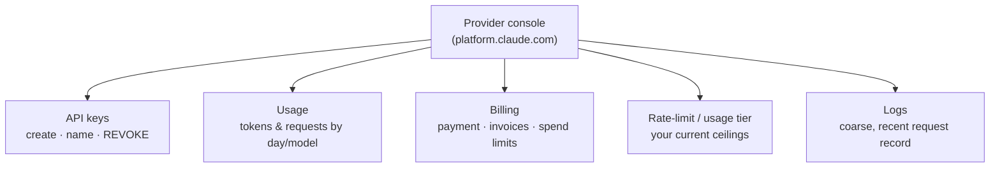
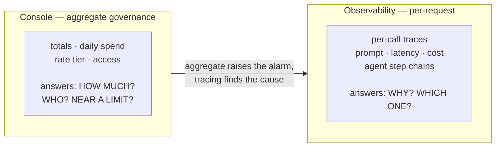

# Console / dashboard

## The problem it solves

You have an API (application programming interface — the defined way your code talks to a provider's models) key wired into your app, and things are running. Then the questions start arriving, and none of them are about the model's output. Finance wants to know why last month's bill doubled. A teammate accidentally committed a key to a public repo and you need to kill it *now* without redeploying anything. Someone on the team needs their own access, scoped so they can't rack up spend on the expensive model. You're getting throttled and want to know which usage tier you're on and how to move up. Legal wants to know whether your prompts are being retained.

None of that is a coding problem, and none of it lives in your codebase. It's the *operations* of running against a paid, rate-limited, credentialed service — and it needs a place that a non-engineer can open in a browser, that works without a deploy, and that shows the account as it stands *right now*. That place is the provider's **console** (also called the dashboard or admin area): the web app at a URL (Uniform Resource Locator — a web address) like `platform.claude.com` where you manage keys, watch usage and spend, set billing, control who on your team has access, and skim coarse logs. It is the human-facing control panel bolted onto the machine-facing API.

The senior framing, and the spine of this lesson: **the console is where cost governance and access control *start*, but it only shows *aggregate* health.** It is not production observability. It will tell you spend tripled; it will not tell you *why*.

## The one analogy to remember

**The picture:** the online account portal for your household electricity. It's where you find your account number, see this month's bill and a chart of daily kilowatt-hours, add your spouse as an authorized contact, and switch to a cheaper rate plan. What it does *not* show you is which specific appliance spiked your usage on Tuesday night — for that you'd need a per-circuit energy monitor wired into your panel.

**The mapping:** the account portal = the provider console; your account number and meter credentials = API keys; the monthly bill and daily-usage chart = the usage and billing dashboards; adding an authorized contact = inviting a team member and scoping their role; switching rate plans = your rate-limit / usage tier; the per-circuit monitor you'd have to install separately = a real observability / tracing layer.

**Why it holds:** the portal is built to answer *account-level* questions — identity, money, access, plan — and it aggregates consumption into totals and daily bars because that's what billing needs. It is architecturally the wrong tool for "which request did this," exactly as an electricity portal rolls every appliance into one meter reading. The rollup isn't a missing feature; it's what the surface *is*.

**Say it like this:** "The console is your utility account portal — bills, meter access, who's on the account, which plan you're on. It tells you the power bill jumped; it can't tell you which appliance did it."

*Where it breaks:* a utility portal is purely read-and-configure, whereas a console also *mints live credentials* — creating a key here immediately grants real spending power, so the security stakes are higher than a billing portal's.

## What actually lives in the console

Five things, and it's worth holding them as distinct jobs rather than one blurry "settings page."

- **API keys** — the credentials your code uses to authenticate. The console is where you create them, name them, and — the operationally critical part — **revoke** them. A leaked key is a live liability (anyone holding it can spend your money against your quota), and the console is the one place you can kill it instantly, no code change or deploy required. Good practice is one key per app or environment so you can revoke a compromised one without taking everything down.
- **Usage** — dashboards of consumption over time: tokens (the units of text the model reads and writes) and requests, usually broken down by model and by day. This is your first-look health check and your first-look cost signal.
- **Billing** — payment method, invoices, and often **spend limits** or budget alerts that cap or warn you before a runaway bill. This is the containment valve for the failure mode every AI product fears: a loop or a leak quietly burning money.
- **Rate-limit / usage tier** — where you see the ceilings on how fast you can call the API and, often, how you advance to higher ceilings (typically by history and spend). Rate limits get their own dev-surface lesson; here it's enough that the console is *where you check which tier you're on*.
- **Logs** — a coarse, recent record of requests: timestamps, which model, rough status, maybe token counts. Useful for "is anything getting through, and roughly what," useless for "trace this one agent run step by step."

## The governance job the console actually does well

Two of a PM's (product manager's) recurring operational anxieties are answered *first* right here, and it's worth being precise about why the console is the right surface for them.

**Access control.** As soon as more than one person touches the account, you need to answer "who can do what." The console is where you invite members, assign roles (an admin who can manage billing and keys versus a developer who can only use them), and — critically — **remove** someone cleanly when they leave. The failure mode this prevents is the shared root key pasted into a group chat: one credential everyone uses, that nobody can rotate without breaking everyone, and that walks out the door with the first person who leaves. Per-member access with scoped roles is the console feature that kills that anti-pattern. The *data* side of governance — what personal information your prompts may contain and how it's handled — is a separate discipline covered in [privacy and PII (personally identifiable information) handling](../08-safety-trust/43-privacy-pii.md); the console governs *access*, not *data content*.

**Cost containment.** Spend limits and budget alerts are the console's answer to the nightmare where a misconfigured agent loops overnight and you discover it on the invoice. Setting a hard cap or an alert threshold is a five-minute console task that turns an unbounded liability into a bounded one. This is real governance and it belongs to the console.

The point to internalize: for *starting* governance — establishing who has access and putting a ceiling on spend — the console is exactly the right tool, and reaching for anything fancier is over-engineering.

## Where the console stops: aggregate health is not observability

Here is the tension that separates a knowledgeable answer from a naive one. The console shows you **aggregate** health — totals, daily bars, rolled-up spend. That is genuinely useful for the questions aggregates can answer: *Is spend trending up? Are we near a limit? Is traffic flowing at all?* It is the wrong tool the moment the question becomes **per-request**.

Consider the two questions that sound similar but aren't:

- *"Our spend tripled overnight — is that expected?"* The console answers the first half: yes, spend tripled, here's the daily bar three times taller. It cannot answer *why*. Was it a traffic spike, a change that made every prompt longer, a retry storm, one runaway agent, or a pricing change? The console's rollup has thrown away exactly the per-request detail you'd need to attribute the increase.
- *"Why did this one agent loop twelve times before answering?"* The console has essentially nothing for you. A single agent run is a chain of many model calls with tool results flowing between them; understanding it means seeing each step, its inputs, its latency, and its decision. That's a *trace*, and the console doesn't produce traces.

Answering those requires **per-request observability** — an LLM (large language model) observability or tracing layer that records each individual call: its prompt, its response, its token counts, its latency, its cost, and, for agents, how the calls chain together into a run. That's a different surface entirely, usually a separate product or an instrumentation library you add to your app, and it connects to the broader discipline of cost and unit-economics analysis. The console's coarse logs are a shallow, recent, un-queryable shadow of what a tracing layer gives you.

The mature stance is not "the console is weak." It's that the console and a tracing layer are **complementary surfaces answering different questions** — the console raises the alarm (spend is up, we're near a limit), and observability finds the cause (this endpoint, this prompt change, this looping agent). Treating the console as your production monitoring is the mistake; it's your account control panel, and it was never built to be more.

## What a PM should take to a conversation

- The console is the **operations and governance surface**, not a developer feature and not a monitoring tool. Its jobs are credentials, cost, access, tier, and coarse logs.
- Its two strongest, do-them-first capabilities are **access control** (scoped per-member roles instead of a shared key) and **cost containment** (spend limits and budget alerts).
- Its structural limit is that it shows **aggregate** health only. The instant a question is *per-request* — *why* did cost move, *which* run misbehaved — you've outgrown the console and need real tracing.
- Key revocation is the one time-critical console action: a leaked key is live spending power, and the console kills it instantly with no deploy.

## Summary / Points to Remember

- The console (dashboard / admin area, e.g. `platform.claude.com`) is the provider's **web control panel for the account**: API keys, usage, billing, rate-limit tier, team access, and coarse logs — the human-facing counterpart to the machine-facing API.
- Frame it as the **operations and governance surface**. It's where cost governance and access control *start*.
- It does **access control** well (invite members, scope roles, remove leavers — killing the shared-key anti-pattern) and **cost containment** well (spend limits and budget alerts against the runaway-loop nightmare).
- **Revoking a leaked key** is its one time-critical job — a key is live spending power, and the console kills it instantly without a deploy.
- Its hard limit: it shows **aggregate** health (totals, daily spend, tier), not **per-request** detail. It tells you spend tripled; it can't tell you *why*, and it can't trace why one agent looped.
- Diagnosing *why* or *which one* needs **per-request observability / tracing** — a separate surface. Console and tracing are **complementary**: aggregate raises the alarm, tracing finds the cause. Treating the console as production monitoring is the classic mistake.

## Interview Questions That Stump People

**Q: "Our spend tripled overnight. Walk me through how you'd figure out why using the provider console."**

**Interviewer:** The bill spiked — where in the console do you go to find the cause?

**You:** I'd start in the console, but I'd be upfront that it can only get me the first half of the answer. The usage and billing dashboards will confirm *what* happened — spend tripled, and I can usually see whether it was more requests or more tokens per request, and which model. But the console rolls everything into aggregates, so it can't tell me *why*: it won't distinguish a legitimate traffic spike from a prompt change that made every call longer, a retry storm, or one runaway agent looping. To actually attribute the increase I need per-request data — a tracing or LLM-observability layer that recorded each call's prompt, tokens, and cost. So my honest answer is: the console tells me the alarm is real and roughly where to look; finding the cause means going to observability, and if we don't have that instrumented, that gap is the actual finding.

> [!TIP]
> **Why this answer works:** The trap is to confidently promise the console will reveal the cause — it won't, and claiming so exposes that you think a billing dashboard is a debugging tool. Naming the aggregate-vs-per-request boundary, using the console for what it's good at (confirming and narrowing the *what*), and then correctly reaching for tracing shows you understand these as two surfaces with two jobs. Flagging "we may not have observability instrumented" as itself a finding is the senior move.

---

**Q (clarify-back): "We want better monitoring for our AI product. Should we build dashboards on top of the provider console's data?"**

**Interviewer:** We need monitoring. The console has usage data — should we build our monitoring on that?

**You (clarify back):** What decisions do you need the monitoring to drive — are we watching account-level health like spend trends and staying under rate limits, or are we trying to debug behavior, like why specific requests are slow, expensive, or failing?

**Interviewer:** Mostly the second — we're getting weird slow responses and occasional bad agent runs and we can't tell what's going on.

**You:** Then the console's data is the wrong foundation, and building on it would waste the effort. The console exposes aggregates — totals and daily rollups — which are fine for "are we near a limit" or "is spend trending up," but they've already discarded the per-request detail you need to debug a slow response or a bad agent run. For that you want a tracing layer that captures each call's prompt, latency, token count, and how an agent's steps chain together. I'd instrument that at the application level rather than trying to reconstruct it from console rollups. If the ask had been account-health monitoring, I'd have said the console's data is a reasonable base — but for behavioral debugging it structurally can't give you what you need.

> [!TIP]
> **Why this works:** "Better monitoring" is ambiguous — account-health monitoring and per-request debugging are different problems with different data sources, and answering before you know which one traps you into recommending the wrong surface. Clarifying pins it down; once it's "debugging behavior," the answer follows directly from knowing the console only holds aggregates. Naming what the console *would* be fine for shows it's a judgment, not a reflex.

---

**Q: "A developer just pushed an API key to a public GitHub repo. What's the first thing you do, and why the console specifically?"**

**Interviewer:** Key's exposed in a public repo. First move?

**You:** Revoke that key in the console, immediately — before cleaning up the repo, before rotating anything else. The reason it's the console specifically is that a live key is live spending power against our quota: anyone scraping public repos can start burning our money and hitting our rate limits within minutes. The console is the one place I can kill the key instantly, with no code change and no deploy — revocation takes effect on the provider's side the moment I click it. Scrubbing the git history matters too, but it's second, because the key is already public and assume-compromised; the urgent action is making the credential worthless. Then I'd issue a fresh key, ideally scoped to just that app so this is a contained rotation, and this is exactly the argument for one key per app or environment rather than a shared root key.

> [!TIP]
> **Why this answer works:** The tempting wrong order is "clean up the repo first" — but the key is already exposed, so the priority is neutralizing it, and only the console does that instantly and deploy-free. Explaining *why* the console is the right surface (server-side revocation with immediate effect) rather than just naming the click shows you understand what a key actually is — a live credential, not a secret you can un-leak by deleting a file. The per-app-key point signals you've thought about blast radius.

---

**Q: "Isn't the console basically just a billing page? Why would a PM care about it beyond checking the invoice?"**

**Interviewer:** Seems like a glorified invoice screen. Why should a PM pay attention to it?

**You:** Because two of the things a PM is actually accountable for start there, not in the invoice. First, **access governance** — who on the team can use the account and at what scope. The console is where you replace a shared key that everyone pastes around with per-member roles you can grant and revoke, which is the difference between a controllable account and one where a departing employee walks off with live credentials. Second, **cost containment** — spend limits and budget alerts, which turn an unbounded risk (an agent looping overnight) into a bounded one. Neither of those is "checking the invoice"; they're governance controls a PM owns. The invoice is the passive read; the console's real value is the active controls around access and spend. Where I'd agree with the premise is that it's *not* where you do product observability — for that it genuinely is too shallow.

> [!TIP]
> **Why this answer works:** The question invites you to dismiss the console as trivial. Reframing it from a passive billing screen to an *active governance surface* — access control and cost containment, both PM responsibilities — shows you see the operational layer of an AI product, not just the model. Conceding the one thing it genuinely isn't good for (observability) keeps the answer honest and precise rather than over-selling.
