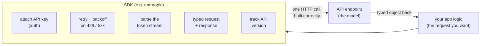

# SDK (Software Development Kit)

## The problem it solves

Underneath every model call is an ordinary web request. Your code has to build the request to the **API endpoint** (the provider's URL that runs the model), attach your secret **API key** so the request is authenticated and billed to your account, encode the message list and parameters as JSON (JavaScript Object Notation, the standard text format for structured data), send it over HTTP (HyperText Transfer Protocol, the request-and-response language of the web), and then decode whatever comes back. Done once, on a good day, that's a dozen lines and it works.

The trouble is that the good day is rare, and each piece of that plumbing is a place to get it subtly wrong. The provider throttles you with a `429` when you exceed your **rate limits**, and now you need retry-with-backoff logic that waits and re-sends instead of crashing. A server has a transient blip and returns a `500`, and you have to decide which failures are worth retrying and which aren't. You ask for the answer to stream back token-by-token, and now you're parsing a live event stream byte-by-byte, reassembling partial chunks into whole messages. The response comes back as untyped JSON, so every field access is a guess your editor can't check. And the API itself has versions — headers and payload shapes that shift as the provider ships features — so your hand-rolled request can quietly fall out of date. Multiply all of that across every language your company uses and every service that calls the model, and you are maintaining the same fragile, error-prone plumbing in a dozen places.

A **Software Development Kit (SDK)** is the official code library — the `anthropic` package for Python, `@anthropic-ai/sdk` for TypeScript, and equivalents in other languages — that wraps the raw API so you never hand-build that plumbing. You install it, hand it your key and your message, and call a function like "create a message"; the library constructs the HTTP request, authenticates it, retries the failures worth retrying, parses the stream, hands you a typed object back, and tracks the API version for you. It is not new capability — the model is identical either way — it is a **convenience and reliability layer** that removes whole classes of boilerplate bugs, written once by the provider and maintained for everyone.

## The one analogy to remember

**The picture:** driving a car with an **automatic transmission** instead of a manual stick shift. Same engine, same road, same destination — but you're not working the clutch, matching engine revs, and shifting through the gears yourself on every hill and every stop.

**The mapping:** the engine, the wheels, and where you're going = the raw API (the actual capability and your request); the gearbox mechanics — clutching, rev-matching, shifting up and down at the right moment = the HTTP plumbing (auth, retries, stream parsing, typing, version headers); the automatic transmission that does all that shifting smoothly for you = the **SDK**; you at the wheel deciding where to drive = your application logic and the request you actually want to make.

**Why it holds:** the gearbox work is real, relentless, and easy to botch — stall the car, grind the gears — which is exactly the character of the boilerplate the SDK removes: tedious, repetitive, and a rich source of subtle bugs. And the default framing transfers cleanly: an automatic is the right choice for almost every driver, while a manual gives a race driver edge-level control they occasionally need — just as the SDK is the right default and raw HTTP wins only in the narrow cases where you need control it doesn't expose.

**Say it like this:** "The SDK is the automatic transmission for talking to the model — same engine underneath, but it handles all the fiddly shifting so you just drive."

*Where it breaks:* an automatic and a manual are the same age, but an SDK can **lag** the raw API — a brand-new model feature may only be reachable by "going manual" (raw HTTP) until the library catches up. And your automatic is a specific make you now depend on: the SDK is a versioned dependency you have to pin, which a gearbox never makes you think about.

## What the SDK actually does for you

The value is the bundle of things it handles correctly so you don't re-implement them. Kept at the level a product manager needs to reason about, not code:

- **Authentication.** It attaches your **API key** to every request in the right header and never makes you assemble that by hand. (The key itself is a secret — a sibling dev-surface topic, [*API key*](05-api-key.md) — and the SDK is what carries it on the wire.)
- **Retries and backoff.** When the provider returns a throttling error (`429`, from hitting your **rate limits**) or a transient server error, the SDK re-sends the request with increasing delays instead of failing on the first stumble. Getting this right by hand — which errors to retry, how long to wait, when to give up — is its own art (the sibling [*rate limits / backoff*](06-rate-limits.md) topic), and the SDK ships a sane default.
- **Streaming parsing.** When you want the answer to appear live, the response arrives as a stream of small events; the SDK reassembles them into whole messages so you consume clean text, not raw wire fragments.
- **Request and response typing.** The SDK gives you typed objects for what you send and what you get back, so your editor and compiler catch a misspelled field or a wrong shape *before* the request is ever sent — turning a class of runtime bugs into compile-time ones. This is also what makes features like [structured outputs](../03-reasoning-generation/20-structured-outputs.md) ergonomic to work with.
- **API version tracking.** The API evolves; the SDK pins the version header it was built against and updates it as the library updates, so you're not chasing wire-format changes yourself. (This is version tracking of the *API*, distinct from the model version string you choose — the sibling [*model versioning*](07-model-id-versioning.md) topic.)

The honest one-liner: **the SDK is a productized layer of correctness over the raw HTTP call.** None of it is impossible to write yourself; all of it is easy to get subtly wrong, and the provider has already gotten it right.

## The tradeoff: SDK vs. raw HTTP

This is the part that separates someone who's read the docs from someone who's shipped. Because the SDK is "just a wrapper" over HTTP, it's tempting to skip it and call the endpoint directly with a generic HTTP library. The senior framing is a clean default with a short list of exceptions:

**Use the SDK unless you have a specific reason not to.** It removes whole classes of boilerplate bugs — mis-handled retries, half-parsed streams, wrong field names, stale version headers — that you would otherwise discover in production. For the overwhelming majority of applications in a supported language, hand-rolling HTTP is re-implementing, worse, something the provider maintains for free.

The reasons *not* to are real but narrow:

- **Your language has no official SDK.** If you're working in a language the provider doesn't ship a library for, raw HTTP (or a community library, with the trust caveats that implies) is your path.
- **You need edge-level control the SDK doesn't expose** — a custom transport, an unusual proxy or networking setup, a runtime where you can't add the dependency, or you're operating at the byte level for a reason.
- **The SDK lags a brand-new feature.** When the provider ships a capability the library hasn't wrapped yet, you may need to drop to raw HTTP for that one call until the SDK catches up. (In practice most SDKs also give you an escape hatch to pass through raw or extra parameters, so you rarely abandon the SDK entirely — you go "manual" for one call.)

Notice these are all "the SDK *can't* do what I need" cases, not "the SDK is overhead." The wrapper's cost is a dependency, not runtime weight — which leads to the concern people forget.

## Pinning the SDK version is its own reproducibility concern

The SDK is a dependency in your project like any other, and that cuts both ways. The upside is everything above. The catch is that an unpinned library can **change under you**: a new version can alter a default, change retry behavior, or shift a type, and your app's behavior moves without a line of your code changing. So you **version-pin the SDK** — record the exact version in your lockfile — exactly as you'd pin any dependency you care about being reproducible.

This is worth stating plainly because it's a second, separate pin from the one people usually think about. There are two things to hold still for reproducible behavior:

1. **The model version** — the exact model ID string you call (the sibling [*model versioning*](07-model-id-versioning.md) topic), which fixes *what* is answering.
2. **The SDK version** — the exact library version, which fixes *how* the request is built and the response handled.

Pinning only the model and letting the SDK float means the plumbing can shift beneath a "fixed" model. Neither pin alone gives you a reproducible client. This connects to the broader reliability story of a serious deployment — retries, fallbacks, and version discipline — that lives in [production architecture](../10-production-ops/48-production-architecture.md).

## Summary / Points to Remember

- Every model call is an HTTP request underneath; the **SDK (Software Development Kit)** is the official library (`anthropic` for Python, and siblings) that builds that request correctly so you don't hand-roll the plumbing. It's **convenience and reliability, not new capability** — the model is identical either way.
- What it handles: **auth** (attaches your API key), **retries/backoff** (on `429` rate limits and transient `5xx`), **streaming parsing** (reassembles the token stream), **request/response typing** (compile-time checks instead of runtime surprises), and **API version tracking**.
- The value is that it **removes whole classes of boilerplate bugs** — the plumbing is easy to get subtly wrong, and the provider has already gotten it right, once, for everyone.
- The senior framing is the **SDK-vs-raw-HTTP tradeoff: use the SDK unless you have a specific reason not to.** The exceptions are narrow — unsupported language, edge-level control the SDK doesn't expose, or a brand-new feature the SDK hasn't wrapped yet (where you drop to raw HTTP for that one call).
- The SDK's cost is a **dependency, not runtime overhead** — so **pin its version.** Reproducible behavior needs *two* pins: the **model version** (what answers) and the **SDK version** (how the call is built and parsed); pinning only one leaves the other free to shift under you.

## Interview Questions That Stump People

**Q (clarify-back): "Should we use the official SDK or just call the API directly over HTTP?"**

**Interviewer:** We're standing up a new service that talks to the model. SDK, or hit the endpoint ourselves?

**You (clarify back):** Two things decide it for me — what language is the service in, and is there any capability you need that the SDK doesn't expose yet, like a custom transport or a feature that shipped this week?

**Interviewer:** It's a standard Python service, nothing exotic, and we're using features that have been out for months.

**You:** Then use the SDK, and it's not close. In a supported language with no edge-case need, hand-rolling HTTP means re-implementing retries, backoff, stream parsing, and response typing — all things the `anthropic` library already does correctly and maintains for you. Every one of those is a class of bug you'd otherwise ship. I'd only reach for raw HTTP if you'd told me the language wasn't supported, or that you needed control the SDK doesn't give you. As it is, the SDK is the lower-risk, less-code choice.

> [!TIP]
> **Why this works:** "SDK or raw HTTP" sounds like a matter of taste, but it's decided by two variables — language support and whether you need something the SDK can't do. Clarifying those first signals you know the exceptions are narrow and specific, rather than reciting "always use the SDK" as dogma. Once "standard Python, no exotic need" is on the table, the recommendation is forced, and naming *what would have changed it* proves you understand the tradeoff instead of a rule.

---

**Q: "The SDK is just a thin wrapper around an HTTP call. Why take the dependency instead of using our normal HTTP client?"**

**Interviewer:** It's a few lines to POST some JSON. Why pull in a whole library for that?

**You:** Because the happy path is a few lines and everything else isn't. The wrapper isn't thin — it's carrying retry-with-backoff on throttling and transient errors, live parsing of the token stream into whole messages, typed request and response objects so a wrong field is caught before you send, and API-version tracking so your payload doesn't quietly go stale. "POST some JSON" is the 20% that's easy; the SDK is the 80% that's tedious and easy to get subtly wrong. If I skip it, I'm not saving work — I'm signing up to re-implement all of that myself, in every language and service, and to maintain it. The dependency is the cheaper side of that trade.

> [!TIP]
> **Why this answer works:** The trap is equating "wrapper" with "trivial." The strong move is to enumerate what the wrapper actually handles — retries, streaming, typing, versioning — so it's concrete that the boilerplate is where the bugs live, not the initial POST. Framing it as happy-path-vs-failure-modes shows you've operated this in production, where the transient `429` at 2am is the whole point of the library.

---

**Q: "A capability we need launched today and our installed SDK doesn't support it yet. Are we blocked until they ship an update?"**

**Interviewer:** The feature's live on the API, but our SDK version doesn't expose it. Do we just wait?

**You:** No, and this is exactly the case where the SDK's boundary shows. The feature is on the raw API the moment it launches; the SDK is a layer on top that catches up on its own release cadence, so there's a lag between the two. Two ways through it: upgrade the SDK if a version that supports the feature is already out, or, if not, drop to raw HTTP for that one call — and most SDKs even let you pass through extra or raw parameters, so you can often stay inside the library and just hand it the new field. Either way we're not blocked; we just don't get the typed, first-class ergonomics for that feature until the SDK wraps it.

> [!TIP]
> **Why this answer works:** It names the real dynamic — the SDK is downstream of the API and can lag it — without treating the lag as a wall. Knowing that raw HTTP is the fallback for exactly this situation, and that SDKs usually offer a pass-through escape hatch, is the "I've hit this" signal. The candidate who says "we have to wait for the vendor" reveals they think the SDK *is* the API rather than a layer over it.

---

**Q: "We pinned our model version, so our client behavior is reproducible now — agreed?"**

**Interviewer:** We locked the exact model ID. That makes our setup reproducible, right?

**You:** Pinning the model is necessary but it's only one of two pins. The model ID fixes *what* is answering; it does nothing about *how* the request is built and the response handled — and that's the SDK's job. If the SDK version is floating, an upgrade can change a default, tweak retry behavior, or shift a type, and your client's behavior moves even though the model didn't. So for reproducible plumbing I'd pin the SDK version in the lockfile too, alongside the model ID. Both pins, or neither really holds. I'd keep the scope honest, though: pinning both makes the *client* reproducible — the model's own output still isn't bit-for-bit deterministic, which is a separate matter.

> [!TIP]
> **Why this answer works:** The question baits you into accepting a half-answer. The sharp move is separating the two independent pins — model version (what answers) and SDK version (how you call and parse) — and pointing out that a floating dependency undermines a "fixed" model. Adding the caveat that even both pins don't make the model's output deterministic keeps you from overclaiming, which is exactly the precision an interviewer is listening for.

---

**Q: "Isn't adding the SDK just taking on supply-chain risk for convenience?"**

**Interviewer:** Every dependency is an attack surface and a maintenance burden. Why is this one worth it?

**You:** It's a fair frame — the SDK *is* a real dependency, so treat it like one: pin the version, watch for updates, and vet it like anything else in your lockfile. But weigh it honestly. The alternative isn't "no dependency," it's hand-maintained networking, retry, streaming, and parsing code that *you* now own the bugs in — that's its own risk and burden, just distributed into your codebase instead of a package. Against an official, provider-maintained library, the risk-adjusted call is almost always to take the SDK and manage it well. I'd reserve the "roll our own" reaction for the genuine exceptions — unsupported language or a hard constraint on adding dependencies.

> [!TIP]
> **Why this answer works:** It doesn't dismiss the concern — supply-chain risk is real — but it refuses the false comparison of "dependency vs. nothing." Naming the hidden cost of the alternative (you now own all that plumbing and its bugs) reframes it as risk *relocation*, not risk *elimination*. Ending on how you'd manage the dependency (pin, watch, vet) rather than whether to take it signals the mature engineering posture the question is probing for.
