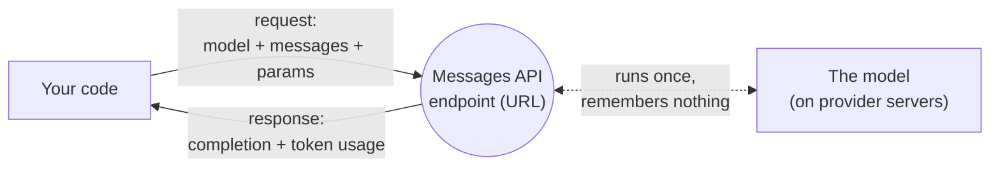
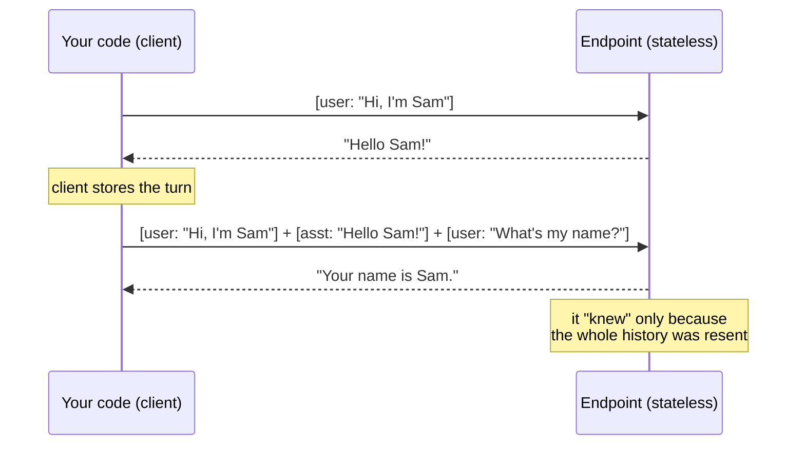

# API endpoint

## The problem it solves

You have a model that can write, reason, and answer — but it lives on someone else's servers, humming away in a data center you will never touch. Your product lives somewhere else entirely: a web app, a backend service, a mobile client. How does your code actually *reach* the model and get an answer back? You need a single, well-defined address you can send a request to and a defined shape for what comes back. That address is the **API endpoint** — API being **Application Programming Interface**, the defined way one piece of software talks to another.

Concretely, an endpoint is a **URL** (Uniform Resource Locator — a web address) that your code sends a request to over the internet. You package up what you want (which model, the messages so far, how long an answer, how random it can be), send it to the endpoint, and the provider sends back the model's completion. The Anthropic API's main one is the **Messages API endpoint**; you would call it at a path like `https://api.anthropic.com/v1/messages`. That single line is the entire seam between "your product" and "the model."

But the endpoint hides a fact that trips up nearly everyone and quietly shapes every cost, latency, and architecture decision downstream: **the endpoint is stateless.** The model on the other side remembers *nothing* about your last call. Each request is a blank-slate transaction. Grasping that one property is most of what a product manager (PM) needs to reason correctly about how these systems behave — and it is the spine of this entire lesson.

## The one analogy to remember

**The picture:** a **vending machine**. You walk up, put in your coins, press a code, and a snack drops. The machine has no memory of you — not that you were here yesterday, not that you bought a soda ten seconds ago. Every purchase is a complete, self-contained transaction: coins in, snack out. If you want two snacks, you pay twice, in full, each time.

**The mapping:** the machine = the API endpoint; the coin slot and buttons = the fixed request format (which model, your messages, your parameters); the snack that drops = the model's response; the machine forgetting you the instant the snack drops = **statelessness** — the server keeps no memory between calls.

**Why it holds:** a vending machine is designed to treat every transaction as independent so it can serve anyone in any order without tracking who's who — and that is *exactly* why the endpoint is built stateless: it lets the provider handle millions of unrelated requests on shared servers without holding a "session" open for each caller. The forgetting isn't a bug; it's the design that makes the thing scale.

**Say it like this:** "The endpoint is a vending machine — every call is paid in full and starts fresh; it never remembers your last one."

*Where it breaks:* a vending machine can't be handed the record of your past purchases, but an endpoint can — you *resend the whole history* every call, which is the trick that fakes a memory. Hold that thought; it's the crux.

## What actually crosses the wire: a request/response contract

An endpoint is a **contract**. Both sides agree on the shape of the request and the shape of the response, and nothing else is guaranteed. For a text model, the request carries a few standard parts:

- **`model`** — which model to run (a small fast one, a large capable one).
- **`messages`** — the conversation so far, as a list of turns (user said this, assistant said that, user said this).
- **parameters** — knobs like `max_tokens` (how long the answer may be) and `temperature` (how random/creative the sampling is).

The endpoint runs the model once over that input and returns a **completion** — the generated text, plus metadata like how many [tokens](../01-foundations/01-tokenization.md) went in and came out (which is what you're billed on). That's the whole transaction.

Two practical notes a PM should have straight. First, you authenticate every call with an **API key** (a secret credential that identifies and bills your account) — a separate dev-surface concern, but it rides along on every request to the endpoint. Second, most teams never hand-build these HTTP requests; they use an **SDK** (Software Development Kit — the provider's official library) that wraps the endpoint in convenient function calls. The SDK is a *convenience layer over the same endpoint*; it does not change the contract or the statelessness underneath.

## The spine: statelessness, and why "the model remembered me" is an illusion

Here is the property that everything hinges on. **Each call to the endpoint is fully independent.** The model produces its answer purely from the input in *that one request* and then forgets it entirely. There is no server-side "conversation" sitting on the provider's machines with your name on it.

So how does a chatbot appear to hold a coherent, multi-turn conversation? Because **your code resends the entire prior message history on every single call.** Turn one, you send one message. Turn two, you send the first user message, the model's first reply, *and* the new user message — all of it, again. Turn three, you send all four previous turns plus the new one. The "conversation" is an illusion reconstructed on the client side and re-shipped in full every time; the server is a vending machine that happens to be handed a growing transcript with each purchase.

This single fact is the root cause of a whole family of behaviors a PM otherwise has to memorize as disconnected trivia:

- **Why context grows and cost climbs every turn.** Because you resend the whole history each call, the input gets longer every turn, and you are billed on input [tokens](../01-foundations/01-tokenization.md) each time. A ten-turn chat re-sends and re-pays for turn one's content ten times. Cost per turn *rises* over a conversation even if each new user message is short.
- **Why [context windows](../01-foundations/05-context-windows.md) exist and eventually bite.** Since the entire history must fit into one request, there's a hard ceiling on how much can ride along — the context window. A long conversation eventually overflows it, and something must be dropped or summarized. (That ceiling and how to manage it is its own lesson — linked, not re-taught here.)
- **Why [prompt caching](../05-prompting/31-prompt-caching.md) is worth money.** If you're resending the same big prefix (a long system prompt, the same history) on every stateless call, the provider re-reads it from scratch each time — pure waste. Prompt caching exists precisely to let the provider reuse the work on that unchanging front. Statelessness is the disease; caching is the treatment. (Again — linked, not re-taught.)
- **Why "the model learned about me during our chat" is false.** It learned nothing and stored nothing. Any apparent memory is your client resending context, or a separate memory feature your *application* built on top — never the endpoint quietly retaining state.

The sharp framing for an interview: **the endpoint is stateless; the conversation is a fiction maintained by the client resending everything, and that resending is the origin of the cost curve, the context-window limit, and the entire value of caching.**

## Different capabilities are different endpoints

One more thing that surprises people: "the API" is not a single door. Different jobs are served by *different endpoints*, because they take different inputs and return different outputs — different contracts.

- The **Messages endpoint** takes messages and returns a text completion — the conversational workhorse.
- An **embeddings endpoint** takes text and returns [vectors](../01-foundations/02-embeddings.md) (lists of numbers representing meaning) — no chat, no completion, a different shape entirely, used for search and retrieval.
- A **batch endpoint** takes a large pile of requests and processes them asynchronously at a discount, returning results later rather than immediately — same model work, a different delivery contract tuned for volume over latency.

The PM takeaway is not the catalog — it's the mental model: **you pick the endpoint that matches the *shape of the job*, not just "the model."** Asking "which endpoint?" is really asking "what's the input/output contract I need, and what latency and price does it come with?"

## Summary / Points to Remember

- An **API endpoint** is the **URL your code calls to run the model** — the single seam between your product and the model on the provider's servers. Anthropic's main one is the **Messages API endpoint**.
- It's a **request/response contract**: you send `model` + `messages` + parameters (like `max_tokens`, `temperature`); you get back a **completion** plus token-usage metadata you're billed on.
- **The endpoint is stateless — this is the load-bearing fact.** Each call is fully independent; the model remembers nothing between calls. A "conversation" only continues because **your code resends the entire prior history every single time.**
- Statelessness is the *root cause* of the things PMs otherwise memorize separately: **cost climbing each turn** (you re-pay for resent history), **[context windows](../01-foundations/05-context-windows.md)** (everything must fit in one request), and the whole value of **[prompt caching](../05-prompting/31-prompt-caching.md)** (reuse the resent prefix instead of re-reading it).
- "The model remembered me" is an **illusion** produced by the client resending context (or an app-level memory feature), never by the server retaining state.
- **Different capabilities are different endpoints** — messages vs. embeddings vs. batch — because each is a different input/output contract. Pick the endpoint that matches the *shape of the job*.
- The endpoint is reached with an **API key** (auth) and usually through an **SDK** (a convenience wrapper) — but neither changes the stateless contract underneath.

## Interview Questions That Stump People

**Q: "Our chatbot clearly remembers what the user said three turns ago. So the model *is* keeping state between calls, right?"**

**Interviewer:** The assistant refers back to things from earlier in the chat. Isn't that the endpoint holding a session for us?

**You:** No — and the illusion is worth pulling apart because it drives real cost decisions. The endpoint is stateless: every call starts blank and the model forgets everything the instant it responds. The "memory" is entirely on our side — our code resends the full prior message history with every request, so the model reconstructs the context fresh each time from what we handed it. Nothing is retained on the provider's servers between calls. The practical consequence is that the memory isn't free: because we resend the whole transcript each turn, our input tokens grow every turn and we pay for the same early messages over and over. What *feels* like a stored session is actually us re-shipping the conversation, and that's exactly why cost climbs across a long chat.

> [!TIP]
> **Why this answer works:** The naive answer accepts the premise and misses that the entire cost model of chat falls out of statelessness. Correcting it — "the client resends everything; the server keeps nothing" — and immediately tying it to the rising token bill shows you understand *why* the system behaves the way it does, not just that it does. It signals you'd catch the "our chat costs balloon over long sessions" surprise before it hit the invoice.

---

**Q (clarify-back): "Costs are higher than we modeled for our chat feature. Where's the money going?"**

**Interviewer:** Per-message costs are running above our estimate. What's the likely culprit?

**You (clarify back):** Quick check: did we model cost per turn as roughly constant, and are we sending the full conversation history on each call — or trimming it?

**Interviewer:** We assumed a flat cost per message, and yes, we send the whole history so the model stays coherent.

**You:** That's the gap. The endpoint is stateless, so to stay coherent we resend the entire prior conversation on every turn — and we're billed on input tokens each time. So cost per turn isn't flat; it *grows* as the transcript lengthens, and by turn ten we're re-paying for turn one's tokens for the tenth time. Two levers: cap or summarize the history we resend so it doesn't grow unbounded, and turn on [prompt caching](../05-prompting/31-prompt-caching.md) so the stable resent prefix isn't re-read at full price every call. But the modeling fix comes first — cost should be modeled as rising with conversation length, not as a flat per-message number.

> [!TIP]
> **Why this works:** The question hides an assumption — flat per-message cost — that's wrong *because* of statelessness, so clarifying how history is handled surfaces the real bug instead of guessing. Naming resent history as the driver, then reaching for both trimming and caching, shows you can connect an architectural property to a line on the bill and to concrete fixes. That's the "I've operated this in production" signal.

---

**Q: "If the endpoint is stateless, why do we even need a context window? Just let the conversation be as long as it wants."**

**Interviewer:** Statelessness means each call is independent — so what's imposing a length limit?

**You:** They're two sides of the same coin. Because the endpoint is stateless, the *only* way the model sees the conversation is if we cram the whole thing into a single request. And a single request can't be infinitely large — the model can only attend over a bounded number of [tokens](../01-foundations/01-tokenization.md) at once, which is the [context window](../01-foundations/05-context-windows.md). So statelessness is exactly *why* the window matters: there's no server-side memory to offload to, so everything the model should "know" has to fit inside one call's input. When the conversation outgrows the window, we have to drop or summarize older turns. If the server kept state, we wouldn't be pushing the entire history through the front door every time — but it doesn't, so we are, and the window is the ceiling on that.

> [!TIP]
> **Why this answer works:** It resists treating statelessness and the context window as unrelated facts. The insight interviewers listen for is the causal link: no server memory → everything must ride in one request → a bounded request size (the window) becomes the hard limit. Deriving one property from the other, rather than reciting both, is what separates understanding from memorization.

---

**Q: "We need embeddings for search. Can we just call the Messages endpoint and get those out?"**

**Interviewer:** We're already integrated with the Messages endpoint. Can it also give us embeddings, or do we need something else?

**You:** Different job, different endpoint. The Messages endpoint's contract is messages-in, text-completion-out — it's built to converse. Embeddings are a different contract entirely: text-in, a [vector](../01-foundations/02-embeddings.md) of numbers out, with no chat semantics. So you call a dedicated embeddings endpoint, not Messages. The general rule is that endpoints are shaped by their input/output contract, not by "the model" — messages, embeddings, and batch are separate doors because they take and return different things and come with different latency and price profiles. Reusing the Messages integration won't produce embeddings; you'd wire up the embeddings endpoint alongside it.

> [!TIP]
> **Why this answer works:** The trap is thinking "the API" is one endpoint that does everything. Framing endpoints as *contracts matched to the shape of the job* — and naming that embeddings return vectors, not completions — shows you understand the surface area of a provider's API rather than assuming a single all-purpose call. It also sets up sensible follow-ups about latency and cost per endpoint.
