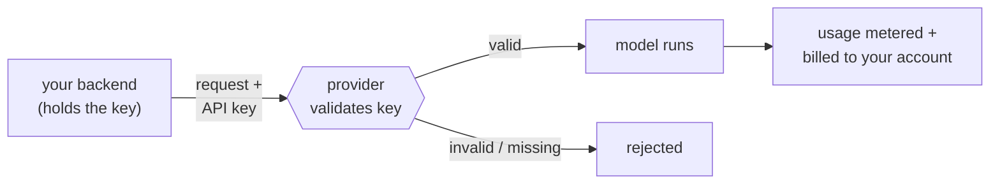
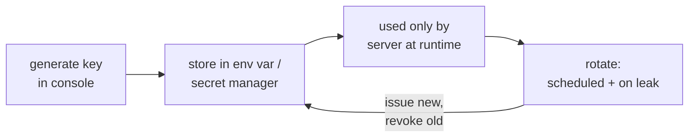
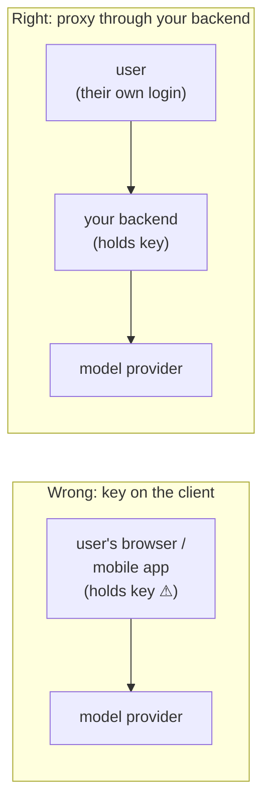

# API Key

## The problem it solves

A provider like Anthropic or OpenAI runs one giant service that thousands of different companies call over the same public internet. When a request lands asking the model to generate a response, the provider has to answer two questions before it does any work: **who is this**, and **whose bill does this go on**? There is no login screen in the middle of a server-to-server call — your backend isn't a human clicking a button, it's code firing an HTTPS (HyperText Transfer Protocol Secure) request at an endpoint. So the provider needs something the request can *carry with it* that proves the caller is a paying, authorized account and pins the resulting usage and cost to that account.

An **API (Application Programming Interface) key** is that something: a secret token — a long random string like `sk-ant-…` — that you include with every request. The provider checks it against its records, and if it's valid, the call is authenticated, the tokens consumed are metered, and the charge lands on the account the key belongs to. It's the credential that turns an anonymous packet arriving from anywhere into "a legitimate request from *this* customer, charge them for it." No key, or a bad one, and the request is rejected before the model ever runs.

The catch — and the entire reason this is a lesson and not a footnote — is contained in one word: **secret**. The key is a *bearer* credential. Whoever holds it can spend your money and reach your account's data. That single property drives everything a product person actually needs to reason about: where you store it, who can see it, and what happens the day it leaks.

## The one analogy to remember

**The picture:** a hotel key card. The front desk hands you a plastic card that opens your room and lets you charge the minibar and the spa to the room. The card doesn't carry your name or your photo — the door doesn't check who you are, only that the card is valid. Anyone holding that card *is* the guest as far as the hotel is concerned: they can open the room and run up the bill.

**The mapping:** the key card = the API key; the card being valid (not who's holding it) = the provider checking the token, not the person; opening the room = access to your account's data and history; charging the minibar to the room = usage billed to your account; the front desk deactivating a lost card and cutting a new one = rotating a leaked key.

**Why it holds:** a key card authenticates by *possession alone* — the lock verifies the card, never the bearer — which is exactly what makes an API key a "bearer" secret: the provider trusts whoever presents the token, so control of the key *is* control of the account. That's why a lost card, like a leaked key, is an emergency you fix by invalidating the old one, not by arguing about who took it.

**Say it like this:** "An API key is like a hotel key card that also charges the minibar to your room — whoever holds it can get in and spend your money, so you never leave it lying around and you deactivate it the moment it goes missing."

*Where it breaks:* a hotel card only works inside one hotel and expires at checkout; a raw API key typically works from anywhere on earth and doesn't expire on its own — which makes it *more* dangerous than the card, not less.

## Bearer secret: why the key *is* you

The defining property of an API key is that it is a **bearer token** — authentication by possession. The provider does not know or care whether the request came from your production server, your laptop, or an attacker in another country; it validates the token and, if the token is good, treats the caller as you. There is no second factor, no "are you sure," no identity behind the key beyond the account it maps to. Possession is the whole proof.

That collapses two things people often keep separate — *authentication* (who are you) and *authorization/attribution* (what may you do, and who pays) — into a single string. Hold the string, and you are authenticated as the account, authorized to spend against it, and every token you burn is attributed to its bill.

The practical upshot: **protecting the key is not a hygiene nicety, it's the entire security model.** There's no layer underneath it to save you. If the key escapes, the escapee is you.

## Blast radius: what a leaked key actually costs

The mistake is to think a leaked key means "someone runs up my bill." That's half of it. Because the key authenticates *and* grants account access, the blast radius has two faces, and a PM (product manager) should name both:

- **Runaway cost.** An attacker with your key can hammer the API at full tilt until they hit your spend limit or you notice — sometimes thousands of dollars before anyone reacts, especially over a weekend. This is the obvious, loud failure.
- **Data and account exposure.** Depending on the provider and the key's scope, the same key can read what your account can reach — request logs and history, files or datasets you've uploaded, fine-tuned models, organization settings. A key isn't just a spending token; it can be a window into whatever your account holds. This is the quiet, worse failure, because it's a data-exposure incident, not just a billing one — the same class of harm covered in [privacy and PII (Personally Identifiable Information)](../08-safety-trust/43-privacy-pii.md).

Naming both halves is the tell that you understand a key is a credential, not a coupon. "It's just some extra cost" underrates the incident; the leaked key can be an access breach.

## The lifecycle: store, scope, rotate

Everything a PM needs operationally lives in three verbs applied to the key over its life.

**Store it as a secret — never in client code or git.** The cardinal sin is putting the key somewhere it can be read by someone who isn't you. Two places it must never live: **client-side code** (a browser bundle, a mobile app binary — anything shipped to a user's device can be cracked open and the key read straight out of it) and **version control** (a key committed to git lives in the repo's history forever, and public-repo scanners find leaked keys within *minutes*). Where it *should* live: in an **environment variable** (a value injected into the running process, kept out of the source) for simple cases, or a dedicated **secret manager** (a vault service that stores secrets encrypted and hands them to your app at runtime) for anything serious. The principle is that the key exists only on the server, at runtime, and never in anything a human browses or an outsider can pull down.

**Scope it — one key per environment and service, least privilege.** Don't run your whole company off one god-key. Issue separate keys per environment (development, staging, production) and per service, and give each the minimum access it needs. The reason is *containment*: when a key leaks — and eventually one will — you want the damage bounded to that one service or environment, and you want to be able to kill *that* key without taking down everything else. A single shared key means a single leak is a total compromise and a rotation is a company-wide outage.

**Rotate it — on a schedule, and instantly on leak.** Rotation means retiring a key and issuing a fresh one. Do it periodically as hygiene (a key that's been around for years has had more chances to leak), and do it *immediately* the moment you suspect exposure — a key pasted into a support ticket, committed to a repo, printed in a log. Rotation is the "deactivate the lost card" move, and it's why per-service keys matter: narrow scope makes rotation a cheap, local action instead of a scary global one.

You generate and revoke keys in the provider's console (its web dashboard) — a sibling surface with its own concerns, as are the rate limits that cap how fast any one key can call.

## Why a key is not user login (the mistake that ships keys to browsers)

Here's the tradeoff that trips teams up. An API key is a *single shared secret for your whole application* — it identifies the *account*, not the individual person using your product. It says nothing about *which* of your end users made a given request. That's fine for what it's for. The failure is treating it as if it were per-user authentication and letting it reach the user's device.

The classic wound: a team building a mobile or web app puts the API key in the client so the app can call the model provider directly. Now the key is on every user's device, trivially extractable, and the moment anyone pulls it, they have your account's bearer secret. The right pattern is a **proxy through your own backend**: the user authenticates to *your* server with *their* login (which is real per-user identity), your server holds the API key and calls the provider on their behalf, and the key never leaves your infrastructure.

So the framing is: a bearer key gives you the *convenience* of one shared secret that just works from any server, but that same single-secret design is exactly why it must be *contained* — scoped, kept server-side, and never confused with the identity of the people using your product.

## Summary / Points to Remember

- An **API (Application Programming Interface) key** is a secret token sent with every request that authenticates the caller, authorizes spending, and attributes usage/billing to your account — no key, no call.
- It's a **bearer secret: whoever holds it *is* you** to the provider. Possession is the entire proof; there's no layer beneath it. Protecting the key *is* the security model.
- A leaked key has a **two-part blast radius**: runaway cost (the loud half) *and* access to your account's data and history (the quiet, often worse half). Call it a credential, not a coupon.
- **Lifecycle in three verbs.** *Store* it as a secret — env var or secret manager, never in client-side code or git (public scanners find committed keys in minutes). *Scope* it — one key per environment/service at least privilege, so a leak is contained. *Rotate* it — on a schedule and *immediately* on suspected leak.
- **A key is not per-user login.** It identifies the account, not the individual. Never ship it to a browser or mobile client; proxy calls through your backend, where users use their own auth and the key stays server-side.
- The core tension: the **convenience** of a single shared secret vs. the **containment** (scoping + rotation) that keeps one leak from becoming a total compromise.

## Interview Questions That Stump People

**Q: "Someone accidentally committed our API key to a public GitHub repo but deleted it in the next commit. Are we fine?"**

**Interviewer:** A dev pushed the key, then removed it a minute later with a follow-up commit. Crisis averted?

**You:** No — that key has to be rotated immediately, and I'd assume it's already compromised. Two reasons. First, git keeps history: the key still lives in the earlier commit, so "deleting it later" doesn't remove it from the repo — anyone can check out the old commit and read it. Second, public repos are continuously scanned by bots that harvest secrets within *minutes* of a push, so the window between commit and delete was almost certainly enough. Deleting the line addresses the symptom, not the exposure. The only real fix is to revoke that key in the console and issue a new one, then check usage logs for anything anomalous while it was live. Rewriting git history to purge it is good hygiene but secondary — rotation is what actually closes the door.

> [!TIP]
> **Why this answer works:** The trap is treating a key like normal text you can "undo" by deleting it. Naming *both* reasons — git history persists and scanners are near-instant — shows you understand a leaked bearer secret is exposed the moment it's public, and that possession, not presence in the latest commit, is what matters. Reaching for rotation as the fix (not history-rewriting) is the "I've handled this incident" signal.

---

**Q (clarify-back): "We're building a mobile app that uses the model. Where should the API key live?"**

**Interviewer:** The app talks to Claude. Where do we put the key?

**You (clarify back):** Does the app call the model provider *directly* from the device, or do we have a backend of our own in between?

**Interviewer:** Right now it's calling the provider directly from the app — simpler, fewer moving parts.

**You:** Then we have a real problem, and the fix is to add the backend. If the key is in the app, it's on every user's device, and a mobile binary can be decompiled — anyone can pull the key out and they've got our account's bearer secret, free rein on our bill and our data. The key can never live client-side. The right shape is a proxy: users log into *our* backend with their own credentials, our backend holds the API key in a secret manager and calls the provider on their behalf, and the key never leaves our servers. That also gives us per-user control the key alone can't — a key identifies our *account*, not which user made a request, so we need our own auth layer for that anyway. The "simpler" direct-call design is exactly the one that leaks the key.

> [!TIP]
> **Why this works:** The question hides the whole issue in "directly," so clarifying the call path is what surfaces it — answering blind would miss that the proposed design is the vulnerability. Once "directly from the device" is on the table, the answer follows: a bearer key on a client is extractable, so it must be proxied server-side. Noting that a key isn't per-user identity shows you understand what a key *is*, not just where to hide it.

---

**Q: "It's an internal tool, only our team uses it. Do we really need separate keys and rotation, or can one shared key be fine?"**

**Interviewer:** Small internal tool, trusted users. Is one key really a problem?

**You:** "Internal" lowers the odds of a leak; it doesn't change what happens when one occurs, so I'd still scope and rotate. The reason is blast radius. With one shared key, a single exposure — a laptop stolen, a key pasted into a shared doc or a log — compromises everything at once, and rotating it means every service and every teammate breaks simultaneously until they're all updated. With one key per person or per service, a leak is contained to that slice, and I can revoke just it without a company-wide outage. Rotation and scoping aren't about how much I trust the users; they're about making the *inevitable* mistake cheap to recover from. The cost of separate keys is basically zero, and the cost of one shared key is that my recovery plan is "take everything down." So no — I wouldn't run even an internal tool off a single god-key.

> [!TIP]
> **Why this answer works:** The trap is conflating trust with risk — "we trust each other, so one key is fine." The strong move separates likelihood from impact: scoping and rotation are impact controls, and impact doesn't care that the users are trusted. Framing it as "make the inevitable leak cheap to recover from" and naming the concrete pain of rotating a shared key (global outage) shows containment thinking, not rule-following.

---

**Q: "If a key leaks, isn't the worst case just an unexpected bill? We can cap spend and eat the cost."**

**Interviewer:** Set a spend limit and the damage is bounded, right? Worst case we lose a few hundred dollars.

**You:** Cost is only half of it, and usually the less serious half. A key authenticates *and* carries account access, so whoever has it can potentially reach what our account can reach — request logs and history, uploaded files or datasets, fine-tuned models, org settings. That makes a leak a data-exposure incident, not just a billing one, and a spend cap does nothing about that half. So capping spend is a good control for the cost blast radius, and I'd keep it, but I wouldn't let it lull us into treating a leak as "we lost some money." The moment a key is exposed I'm rotating it and reviewing what it could have touched, because the real question isn't "how much did they spend" — it's "what could they have read." Treating a key as a coupon instead of a credential is how a breach gets logged as an accounting footnote.

> [!TIP]
> **Why this answer works:** The question baits you into the cost-only mental model, which is the exact misconception that gets incidents under-triaged. Naming the *second* half of the blast radius — account and data access — and reframing the key as a credential rather than a spend token is what separates someone who's reasoned about the security model from someone who's only thought about the bill.

---

**Q: "Why not just use a username and password for the API, like everything else? Why a separate key at all?"**

**Interviewer:** We authenticate users with passwords everywhere. Why does the API need its own key instead?

**You:** Because the caller isn't a person — it's our server calling their server, with no human to type a password. An API key is built for that machine-to-machine case: a single credential the code can carry on every request, that we can scope narrowly and revoke independently without touching anyone's login. If we reused an account password there, we'd be embedding a human's master credential in code — one that usually unlocks *far* more than API access (billing, settings, the ability to change the password itself), can't be scoped down, and often can't be rotated without locking a person out. The key is deliberately a *narrower, disposable* credential: it does one job, you can hand out several, and you can burn any one of them the instant it leaks. That separation is the point — passwords are for humans logging in, keys are for code making calls.

> [!TIP]
> **Why this answer works:** It resists the "one auth mechanism for everything" instinct by naming *why* the machine case is different — no human in the loop — and then why a key is safer than reusing a password: scopable, multiple, independently revocable, and blast-radius-limited. Framing keys as deliberately narrow and disposable versus a password's broad, singular access shows you understand the design reason, not just the convention.
