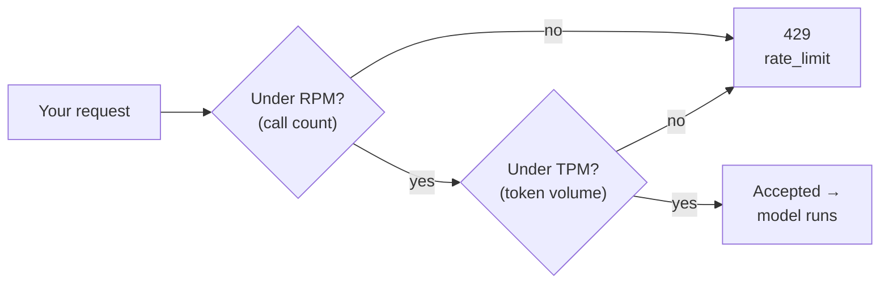
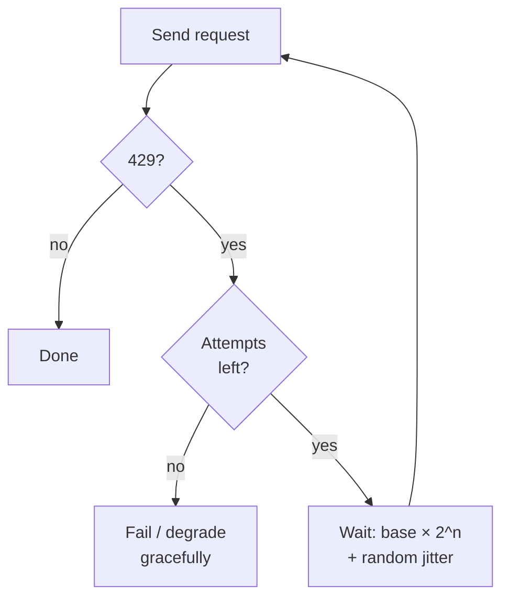

# Rate limits (TPM / RPM)

## The problem it solves

A hosted model API (application programming interface — the endpoint your code calls to reach the model) is not your private machine. It is a shared factory floor: thousands of customers are pushing prompts through the same pool of graphics processing units (GPUs — the chips that actually run the model) at the same moment. That pool is finite. If any one customer could fire an unbounded flood of requests, they would starve everyone else — and a single runaway loop or a viral spike would take the whole service down for every tenant on it.

So the provider draws a line around how much of that shared capacity each account may consume per unit of time. Those lines are **rate limits**. Cross one, and the provider does not silently queue you forever or quietly degrade — it *rejects* the excess request with an HTTP status code **429** (the standard "Too Many Requests" response), typically carrying a hint about when to try again. The request didn't fail because your prompt was wrong or the model broke; it failed because, for this slice of time, you asked for more than your share of a resource you don't own.

The reason this earns its own lesson — rather than being a footnote — is that rate limits are the single most common source of production incidents that have *nothing to do with model quality*. Your prompts are perfect, your outputs are great, and your app still falls over at 9 a.m. because everyone logged in at once and you blew past a ceiling you didn't know was binding. Understanding *which* ceiling binds, and how to respond without making it worse, is core operational literacy.

## The one analogy to remember

**The picture:** a busy loading dock at a warehouse shared by every tenant in the building. The dock enforces two separate rules, per minute: how many *trucks* it will wave through the gate, and how many total *kilograms* of cargo it will load. A convoy of empty vans hits the truck-count rule while barely any weight has moved; one truck packed to the roof hits the weight rule with a single vehicle. Either rule, on its own, can stop you at the gate while you're comfortably under the other.

**The mapping:** trucks through the gate = **RPM (requests per minute)**; total cargo weight = **TPM (tokens per minute)**, where a token is the chunk of text the model bills and processes ([tokenization](../01-foundations/01-tokenization.md)); the truck-count rule = your RPM ceiling; the weight rule = your TPM ceiling; the dock shared by every tenant = the provider's multi-tenant capacity; being turned away at the gate = a **429**; the gate reopening as the minute rolls forward = the limit resetting.

**Why it holds:** the provider is metering two genuinely *different* scarce things — the per-request overhead of accepting and scheduling a call, and the raw compute of chewing through tokens — so it caps them separately, and whichever you exhaust first is the one that stops you. That is exactly why the two ceilings are independent rather than one being a proxy for the other.

**Say it like this:** "The API caps both how many calls and how many words per minute you can push through — hit either ceiling and it makes you wait, even if you're nowhere near the other one."

*Where it breaks:* a real dock is bound by physics — it *cannot* overload. An API's ceilings are policy quotas the provider chose and can raise for you on request; they protect shared capacity but aren't laws of nature. And the reset isn't a clean top-of-the-minute bell — it's usually a rolling window, so capacity trickles back continuously rather than all at once.

## Two independent ceilings — and either can bind first

This is the insight that separates someone who has operated an LLM (large language model) app from someone who has only read the pricing page. There is not *one* rate limit. There are (at least) two, and they measure different things:

- **RPM (requests per minute)** counts *how many times you call the API*, regardless of size. One call is one request whether it carries ten tokens or ten thousand.
- **TPM (tokens per minute)** counts *how much text flows through*, summed across all your calls in the window — usually input plus output tokens together.

Because they are independent, **the one that binds first depends entirely on the shape of your workload**, not on how "busy" you feel.

Walk the two extremes and it clicks:

- **Few requests, huge prompts.** A document-summarization tool that sends one call per document, each stuffing 100,000 tokens of context in and drawing thousands out, can saturate its **TPM** ceiling with only a handful of calls per minute — while sitting at maybe 1% of its RPM. This is the workload behind the confused ticket every platform team has seen: *"I'm way under my request limit but I keep getting 429s."* They are watching the wrong gauge. The token gate closed while the request gate was wide open.
- **Many requests, tiny prompts.** A classification service that fires thousands of one-line calls a minute — "is this comment toxic, yes or no?" — can slam into its **RPM** ceiling while its total token throughput is trivial. Here the request gate closes first.

The practical consequence: **you cannot reason about headroom from a single number.** You have to know which ceiling your traffic pattern pushes against, because relieving the wrong one does nothing. Batching many tiny calls into fewer larger ones trades RPM pressure for TPM pressure — a fix if RPM was binding, a *worsening* if TPM already was. (Some providers layer a third ceiling, requests or tokens *per day*, and separately cap **concurrency** — how many requests may be in flight at once — but the TPM-vs-RPM split is the one interviewers probe.)

## What happens at the ceiling, and why the naive response makes it worse

When you cross a limit, the provider returns a **429**. Two things matter about it. First, it is *transient* — it says "not right now," not "never"; the same request will usually succeed moments later once the rolling window frees up. Second, it typically comes with timing metadata (a `Retry-After` header or reset hints) telling you roughly how long to wait. A 429 is therefore a *recoverable* condition, and treating it as a hard error — surfacing it straight to the user, or letting the request die — throws away a request that would have gone through with a short pause.

But the obvious recovery is a trap. The naive instinct is: *got a 429? Retry immediately, and keep retrying.* At any real scale this is actively dangerous, because of a failure mode called the **thundering herd**:

> [!NOTE]
> **Thundering herd** — when many clients (or many threads of one client) all hit a limit at the same instant and all retry at the same instant, their synchronized retries arrive together as a spike *larger* than the traffic that caused the original overload. Each retry storm triggers the next, and the system can't drain. You have, in effect, launched a denial-of-service (DoS) attack against your own provider — a *self-DoS*.

The fix is a two-part discipline: **exponential backoff with jitter.**

- **Exponential backoff** means each successive retry waits longer than the last — roughly doubling: wait ~1s, then ~2s, ~4s, ~8s, capped at some maximum, and give up after N attempts. Backing off geometrically gives the overloaded capacity time to actually recover instead of being hammered on a fixed short interval.
- **Jitter** means adding a *random* offset to each wait so retries don't re-synchronize. This is the part people forget, and it is the load-bearing part. Pure exponential backoff still fails if a thousand clients all failed at the same millisecond: they'll all wait exactly 1s, then all exactly 2s, and retry in perfect lockstep — the herd stampedes on a schedule. Jitter smears those retries across the interval so they arrive spread out, letting the system drain.

The framing to carry into a design review: **retrying is correct; retrying *naively* is how a small overload becomes an outage.** Backoff paces the recovery; jitter de-synchronizes it. You need both. (The general retries-and-backoff pattern shows up well beyond rate limits — any transient failure — and has its own treatment; here we only need its application to a 429.)

## The full response toolkit — beyond just retrying

Backoff is the reflex for a 429 that already happened. A team that only has backoff is treating the symptom. The stronger posture is to keep your demand shaped so you rarely hit the ceiling in the first place, and to have a plan for when you legitimately need more capacity than your tier allows:

- **Client-side queuing and concurrency caps.** Rather than letting your app fire requests as fast as it generates them and bouncing off 429s, put a queue in front and release requests at a rate you *know* stays under your ceilings — a token-bucket or leaky-bucket limiter, capping how many are in flight at once. This turns a jagged, spiky demand into a smooth stream. You pay in a little added latency for work that has to wait its turn; you gain predictability and far fewer rejected calls.
- **Spread the load.** If your traffic is bursty — a cron job that fires 10,000 requests at the top of the hour — smoothing it across the window (or staggering start times) can keep you under a ceiling that the burst would have blown, with no capacity increase at all. Much "we're over our limit" is really "we scheduled everything for the same second."
- **Request a tier increase.** Rate limits scale with your account tier and usage history; providers raise them on request for accounts with a track record. This is the right lever when your *sustained, legitimate* demand genuinely exceeds the default allocation — not a substitute for fixing a runaway retry loop that's manufacturing its own load.
- **Move non-real-time work off the synchronous path.** Work that doesn't need an answer *this second* — nightly report generation, bulk enrichment, back-catalog classification — is the worst possible use of your interactive TPM/RPM budget, because it competes with live user traffic for the same ceiling. Shifting it to a provider's asynchronous **batch API** (a submit-now, collect-later lane, usually cheaper and governed by separate, higher limits) takes that load off your real-time budget entirely. This overlaps with cost and unit economics and with inference optimization — relieving rate-limit pressure and cutting cost are often the same move.

## The tension a PM has to hold

Two framings make a PM (product manager) sound like they've owned this, not read about it.

The first is **throughput demand versus allocated capacity.** Your app wants to push as much through as its users generate; the provider has allocated you a fixed slice of a shared resource. Rate limits are where those two meet. Every mitigation above is really a choice about *where the mismatch gets absorbed* — in a client-side queue (added latency), in smarter scheduling (engineering effort), in a higher tier (cost), or in moving work to batch (giving up immediacy). There is no free removal of the ceiling; there is only choosing who waits and where.

The second is **reliability engineering versus hard failure.** The immature app treats a 429 as a crash — the user sees an error. The mature app treats it as an expected, recoverable signal and *degrades gracefully*: it retries with backoff behind a spinner, it queues, it serves a cached or simpler result, it tells the user "still working" rather than "failed." The rate limit is a fact of multi-tenant life; the product decision is whether your users ever feel it. A PM who frames rate limits as a *graceful-degradation design problem* rather than an *error to display* is the one who ships a service that stays up during a spike.

The related dev-surface lessons on the provider **SDK** (software development kit) and the **console** cover where these limits are configured and where retry logic often lives; this lesson is about the mechanic itself.

## Summary / Points to Remember

- **Rate limits exist to fairly share finite multi-tenant capacity.** A hosted API is a shared factory; the ceiling stops one customer (or one runaway loop) from starving everyone else. Cross it and you get a **429 ("Too Many Requests")** — a *transient, recoverable* rejection, not a broken prompt.
- **There are two independent ceilings: TPM (tokens per minute) and RPM (requests per minute), and either can bind first.** Which one binds depends on your workload's *shape*, not how busy you feel.
- **Few-but-huge requests hit TPM while far under RPM** (the classic "I'm under my request limit but still getting 429s"); **many-but-tiny requests hit RPM** while token volume is trivial. Relieving the wrong ceiling does nothing — batching trades RPM pressure for TPM pressure.
- **Retry with exponential backoff *and* jitter.** Naive immediate retries cause a **thundering herd** — synchronized retries spike larger than the original load, a self-inflicted denial-of-service. Backoff paces recovery; **jitter de-synchronizes it**, and it's the part people forget.
- **The toolkit is bigger than retrying:** client-side queuing / concurrency caps to smooth demand, spreading bursty load across the window, requesting a tier increase for genuine sustained need, and moving non-real-time work to the **batch API** to free your interactive budget.
- **Frame it two ways:** throughput demand vs. allocated capacity (every fix just chooses *where the mismatch is absorbed* — latency, effort, cost, or immediacy), and reliability engineering vs. hard failure (graceful degradation means users never feel the ceiling).

## Interview Questions That Stump People

**Q: "One of our customers is complaining they get rate-limited constantly, but they swear they're nowhere near their request limit. Are they lying, or is our dashboard wrong?"**

**Interviewer:** They're adamant they're under the request cap, yet they keep getting 429s. What's going on?

**You:** Neither — they're almost certainly looking at the wrong ceiling. There are two independent limits, RPM and TPM, and they can bind separately. If this customer sends a small number of very large requests — big context windows, long outputs — they can saturate their tokens-per-minute limit with only a handful of calls a minute while sitting far below their requests-per-minute cap. So both statements are true at once: they *are* under their request limit, and they *are* being throttled, because it's the token ceiling that's closing, not the request ceiling. I'd confirm by looking at their token throughput per minute, not their call count, and then either help them shrink per-call token usage or bump their TPM tier specifically.

> [!TIP]
> **Why this answer works:** The question is built to bait you into picking "user error" or "our bug." The strong move is recognizing that *both* claims are consistent once you separate the two ceilings — which immediately signals you understand rate limits aren't a single number. Naming the exact diagnostic (look at TPM, not RPM) is the "I've debugged this" tell.

---

**Q (clarify-back): "We're hitting rate limits during peak hours. Should we just batch our requests together to fix it?"**

**Interviewer:** Peak-hour 429s are hurting us. Someone suggested batching multiple items per API call. Good idea?

**You (clarify back):** It depends entirely on which ceiling we're hitting — do we know whether it's RPM or TPM that's binding at peak?

**Interviewer:** Looks like it's the requests-per-minute limit — we fire a huge number of small calls.

**You:** Then yes, batching helps, and for a specific reason: combining many small calls into fewer larger ones directly reduces our request count, which is exactly the ceiling that's binding. But I'd flag the flip side so we don't just move the problem — batching *raises* the tokens-per-minute we push per call, so if we over-batch we can trade an RPM problem for a TPM problem. So I'd batch up to the point where we're comfortably under both, and pair it with client-side queuing to smooth the peak rather than firing every batch the instant it's ready. If the binding limit had turned out to be TPM, batching would have done nothing or made it worse, and we'd want spreading load or a tier increase instead.

> [!TIP]
> **Why this works:** "Should we batch?" has no correct answer until you know which ceiling binds — answering immediately would expose you as someone applying a rule blindly. Clarifying pins down the one variable that decides it, and the answer shows you understand batching is a *trade* between the two limits, not a universal fix. Naming what you'd do in the *other* case proves the understanding is real.

---

**Q: "Your service gets a burst of 429s. Your retry logic kicks in and things get dramatically worse instead of better. Why?"**

**Interviewer:** We had retries in place, hit a wave of 429s, and the whole thing spiraled. How does adding retries make an overload worse?

**You:** That's a thundering herd, and it's the classic self-inflicted outage. When a burst of requests all get 429'd at roughly the same instant, and the retry logic sends them all back at the same fixed short interval, the retries arrive *synchronized* — as a spike that's as big as or bigger than the load that caused the original throttle. That spike gets throttled too, triggering another synchronized wave, and the system never gets a chance to drain. We've essentially DoS'd our own provider. The fix is exponential backoff *with jitter*: back off geometrically so capacity has time to recover, and — critically — add a random offset to each wait so the retries *don't* line up again. Backoff alone isn't enough; if everyone failed at the same millisecond, they'll all wait exactly one second and stampede together. Jitter is what breaks the synchronization.

> [!TIP]
> **Why this answer works:** Most candidates know "use backoff." The stumper is *why backoff alone still fails*, and the answer that separates you is naming jitter as the load-bearing piece and explaining the re-synchronization it prevents. Framing it as a self-DoS shows you understand retries are a double-edged tool, not a free safety net.

---

**Q: "We keep hitting our token limit. Isn't the only real fix to ask the provider to raise it?"**

**Interviewer:** We're constantly over our TPM. Surely the answer is just a bigger quota?

**You:** A tier increase is *one* lever, but reaching for it first is often the wrong instinct — it costs money and it doesn't fix demand that's badly shaped. I'd look at the traffic before the quota. First, is the load bursty? If we're firing everything at the top of the hour, spreading it across the window can keep us under the existing ceiling for free. Second, is real-time and non-real-time work competing for the same budget? Moving the batch-style work — nightly jobs, bulk processing — onto an asynchronous batch API takes it off our interactive TPM entirely and is usually cheaper too. Third, are we queuing client-side to smooth spikes, or just firing and bouncing off 429s? A tier increase is the right call when our *sustained, legitimate* demand genuinely exceeds the allocation after all that — but if we raise the quota to paper over a burst or a runaway retry loop, we're paying more to keep a problem we could have engineered away.

> [!TIP]
> **Why this answer works:** The question offers a lazy single-lever answer, and taking it would signal you think of capacity as something you buy rather than shape. Laying out the demand-side fixes first — spread load, offload to batch, queue — and *then* bounding when a tier increase is actually justified shows the throughput-vs-capacity judgment interviewers are listening for. It also naturally surfaces cost, which is where this decision really lives.
