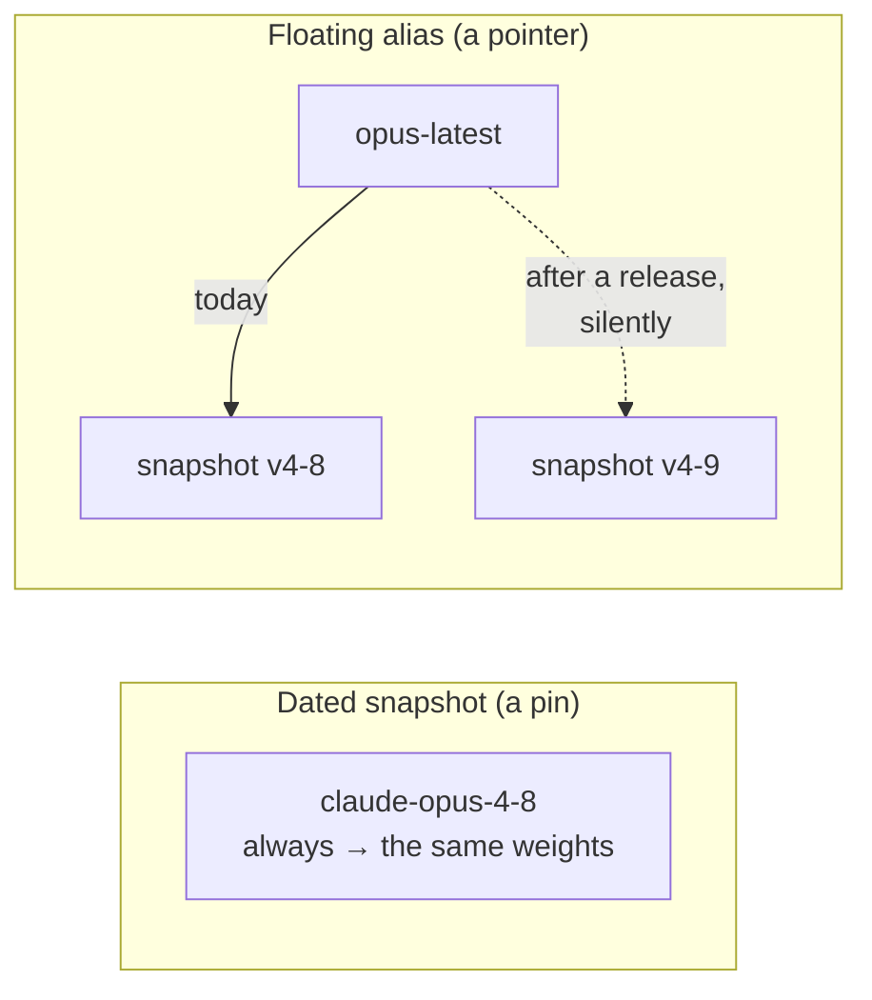
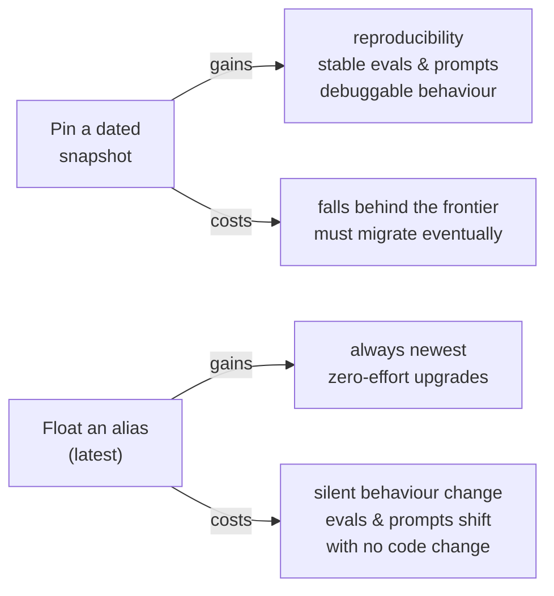
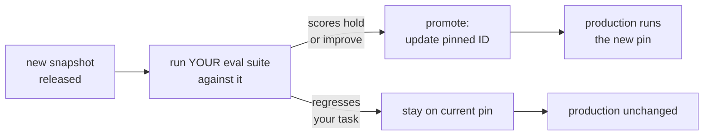

# Model ID / Snapshot / Version

## The problem it solves

You spend three weeks tuning a prompt until your assistant extracts invoice fields at 96% accuracy. The eval suite is green, the demo lands, you ship. A month later, with no deploy, no code change, and no config edit on your side, accuracy quietly slips to 88%. Nobody touched anything — yet the product got worse. What happened is that the model *underneath* your API (application programming interface — the defined way your code calls the provider's service) call changed. The provider released a newer, generally-better version, and because you asked for the model by a name that means "whatever's newest," you got silently upgraded onto it — and the newer model, better on average, happened to be worse on *your* narrow task with *your* carefully-shaped prompt.

The thing that prevents this is boring and load-bearing: the **model ID** — the exact string you put in the API call to name *which* model, at *which* version, you want to run. `claude-opus-4-8` is a model ID. It is not just an address; it is a **version pin**. Get the string right and behaviour is frozen — the same weights answer every call, so your prompts, your eval scores, and your users' experience stay stable. Get it wrong — reach for a convenient "latest"-style name — and you've handed the provider permission to change your product out from under you on their release schedule, not yours. The whole discipline of this lesson lives in that one choice of string.

## The one analogy to remember

**The picture:** cooking from a specific edition of a cookbook. You bake your signature cake from *The Joy of Baking, 2019 edition* — the exact page, the exact recipe — and it comes out the same every time. Then the publisher releases the 2024 edition and quietly rewrites that recipe (less sugar, a new method). If you'd been telling your kitchen "always grab the newest edition off the shelf," your cake would suddenly come out different — with nothing changed in your kitchen, your ingredients, or your technique.

**The mapping:** naming the exact edition ("2019 edition") = a dated model snapshot (`claude-opus-4-8`); "always the newest edition on the shelf" = a floating alias like `-latest`; keeping that one edition as your reference copy = the model ID hardcoded in your production config; the publisher revising the recipe in a new edition = a newer model behaving differently; the old edition going out of print = a snapshot being deprecated.

**Why it holds:** a model behind an API is a *revisable work*, and its exact behaviour depends on which revision you're reading from — just like a recipe. Naming the exact edition freezes the recipe so your results are reproducible; naming "whatever's newest" hands the publisher permission to change your outcome on *their* revision schedule, silently, because from your side the instruction ("newest edition") never changed — only what it points to did.

**Say it like this:** "Cook from a named edition, not 'whatever's newest' — pin the exact model version, or the provider quietly rewrites your recipe and your results change with nothing changed on your side."

*Where it breaks:* a printed cookbook on your shelf is yours forever once bought, but you never actually hold the model — even your "pinned" edition lives on the provider's shelf, so when they take an old edition out of print (deprecation) it's genuinely gone, in a way a book you own is not.

## Anatomy of the string: model, snapshot, alias

A model ID usually encodes three things at once, and interviewers like to hear you separate them:

- **The model family** — which model, roughly, in terms of size and capability tier (e.g. Opus vs. a smaller, faster sibling). This is the choice about *how capable and how expensive*.
- **The version / snapshot** — a specific frozen build of that family, typically tagged with a date or a version number. This is the *frozen artifact*: the exact weights that produce the exact behaviour.
- **The alias** — an optional convenience name that *points at* a snapshot and is allowed to move. A name like `-latest` resolves to whatever the provider currently considers newest in that family.

The distinction that carries the whole lesson is **snapshot vs. alias**:

A **dated snapshot** is a promise: this string will always resolve to the same underlying model. A **floating alias** is the opposite promise deliberately broken: it will *change* what it resolves to whenever the provider ships, and it will do so without telling your code, because from your code's point of view nothing changed — the string is identical, only its meaning moved.

## The core tension: reproducibility vs. staying current

Everything about how you use model IDs is a negotiation between two things you genuinely want and can't fully have at once.

**Reproducibility** is the ability to get the same behaviour tomorrow that you got today. It's what makes an eval score mean something — if the model can change under you, a 96% from last week doesn't tell you anything about this week. It's what makes a tuned prompt safe — prompts are famously brittle across model versions, and phrasing that a model was practically trained to love can land differently on the next one (that fragility has its own lesson: [prompt engineering](../prompting/prompt-engineering.md)). And it's what makes incidents debuggable — if behaviour drifts, you want to know it was *your* change, not a silent swap. A dated snapshot buys all of this.

**Staying current** is the pull the other way. Newer snapshots are usually genuinely better — smarter, cheaper, faster, fewer refusals, longer context. Pinning forever means freezing yourself onto an aging model while the frontier moves on, paying more for less, and eventually sitting on something the provider will retire out from under you. A floating alias buys automatic access to the newest and best — at the price of surrendering control over *when* the change lands.

You cannot have both "never changes" and "always the newest." The senior position is not to pick a side globally but to **separate the two roles**: pin in the place where stability is the whole point (production), and stay current in the place where change is the whole point (a controlled test before promotion).

## The senior move: pin in production, test the next snapshot behind your evals

The mature pattern treats a model upgrade exactly like a dependency bump, with the same discipline you'd apply to bumping any critical library.

1. **Pin an exact dated snapshot in production.** Your live traffic runs on a string like `claude-opus-4-8` that will never change meaning. Users and eval scores sit on stable ground.
2. **When a newer snapshot ships, don't touch production.** Instead, point your **evaluation suite** at the new snapshot and run it — the same prompts, the same test set, the same scoring you used to validate the current one.
3. **Compare, then decide.** If the new snapshot holds or improves your scores and doesn't regress the specific cases you care about, you *promote* it — change the pinned string deliberately, review it like any other change, and ship. If it regresses your task (which happens even when the model is better *on average*), you stay put and buy time.
4. **Roll back trivially if needed.** Because the change was a one-line string swap under version control, backing out is instant — revert to the previous snapshot ID.

The insight a PM (product manager) should be able to say out loud: **a floating alias isn't "staying current," it's "auto-promoting to production with no test gate."** It skips step 2 and step 3 entirely and lets the provider's release schedule decide when your product changes. Sometimes that's an acceptable risk (a low-stakes internal tool, a prototype). For anything where an eval score or a tuned prompt matters, it's shipping every upgrade straight to users untested — which is exactly the practice you'd never allow for a library dependency.

## Deprecation: the pin doesn't last forever

Pinning is not "set it and forget it," and pretending otherwise is a trap. Providers **deprecate** old snapshots — announce an end-of-life date, then eventually retire the model so the string stops working (or gets redirected). Older models cost money and hardware to keep serving, so no snapshot is supported indefinitely.

This means the pin is a *deferral*, not an escape. Reproducibility buys you the right to migrate **on your schedule instead of the provider's** — but you will migrate. The operational consequences a PM must plan for:

- **Track deprecation announcements.** A pinned snapshot with a retirement date is a scheduled forced migration; it belongs on the roadmap, not as a surprise outage.
- **Migration is a project, not a config flip.** Because prompts are tuned to a specific model's quirks, moving to a new snapshot can require re-tuning prompts and re-validating evals — budget for it.
- **Don't over-pin, either.** Freezing forever until the deprecation gun is at your head means one giant, risky jump across several model generations at once, under time pressure. Periodically promoting through your eval gate keeps each jump small and tested.

## Pinning is not determinism

A pin removes *one* source of variation — the model version — and it's tempting to oversell that as "now my outputs are reproducible." They are not. The same pinned snapshot, given the same prompt, can still return different text on repeated calls, because generation involves randomness in how the next token is chosen. That's a decoding property, not a versioning one, and it has its own lesson: [sampling and decoding](../reasoning-generation/sampling-decoding.md). Even pushing that lever to its deterministic setting (temperature 0 / greedy) is "much more consistent," not "byte-for-byte identical," because of floating-point and infrastructure effects the sampling lesson covers.

The precise thing to say: **pinning the model ID controls the *version* variable; it does not control the *sampling* variable.** For genuinely stable behaviour you need both — a pinned snapshot *and* deterministic decoding — and even then you promise "consistent," not "guaranteed identical." Conflating the two is a common and revealing mistake.

## Summary / Points to Remember

- The **model ID** is the exact string naming which model and version you call — and it's a **version pin**. `claude-opus-4-8` freezes behaviour; the string *is* the control.
- The load-bearing distinction is **dated snapshot vs. floating alias**. A snapshot always resolves to the same weights (reproducible). An alias like `-latest` silently moves to a newer model when the provider ships (current, but drifting).
- The core tension is **reproducibility vs. staying current**. You can't have "never changes" and "always newest" at once — so separate the roles instead of picking a global side.
- **The senior move:** pin an exact snapshot in production, and when a new one ships, run it against *your* eval suite first; promote only if it holds or improves your scores, and roll back with a one-line revert. Treat it like a dependency bump with lockfile discipline.
- The sharp framing: **a floating alias is auto-promoting to production with no test gate** — it hands your release timing to the provider and ships every upgrade to users untested.
- A pin is a **deferral, not an escape**: snapshots get **deprecated**, so a forced migration is always eventually coming — plan it, and don't let it become one giant risky jump.
- **Pinning is not determinism.** It removes the *version* variable only; the same snapshot still varies output because of [sampling](../reasoning-generation/sampling-decoding.md). Stable behaviour needs a pinned snapshot *and* deterministic decoding — and even then, "consistent," not "identical."

## Interview Questions That Stump People

**Q (clarify-back): "Our eval scores dropped about 10% overnight. There was no deploy and no code change. What's your first hypothesis?"**

**Interviewer:** Offline eval accuracy fell roughly 10% between two runs. Nobody deployed, nobody edited the prompt or the config. Where do you look first?

**You (clarify back):** One question before I guess: in the API call, are we naming the model with a dated snapshot like `claude-opus-4-8`, or a floating alias like `...-latest`?

**Interviewer:** It's the `-latest` alias.

**You:** Then my first hypothesis is that the alias moved. A `-latest`-style name points at whatever the provider currently considers newest, and it changes what it resolves to when they ship a new snapshot — with no change on our side, because the string in our code is byte-for-byte identical, only its meaning moved. So "no code change" is exactly consistent with the model underneath us changing. The newer model is probably better on average, but our prompt and eval set are tuned to the old one, so it regressed *our* specific task. I'd confirm by checking any response metadata that reports the actual resolved model version across the two eval runs — if the resolved snapshot differs, that's the cause. The fix is to pin the exact snapshot we validated on, and from now on test new snapshots behind the eval suite before promoting.

> [!TIP]
> **Why this works:** The phrase "no code change" is a deliberate misdirection that pushes candidates toward data drift, a flaky test, or randomness. Clarifying how the model is named is the single question that splits the whole space — if it's a floating alias, a silent version move is the leading explanation and everything fits. Naming that "identical string, moved meaning" mechanism, then proposing to confirm via the resolved-version metadata rather than just asserting it, is the difference between a guess and a diagnosis.

---

**Q: "If newer models are generally better, why would you ever pin to an old snapshot instead of just always using the latest?"**

**Interviewer:** The provider's newest model beats the old one on basically every public benchmark. So why not just point everything at `latest` and get the upgrades for free?

**You:** Because "better on average across everyone's tasks" is not the same as "better on *my* task with *my* prompt." Prompts are brittle and get tuned to a specific model's quirks, so a model that wins the benchmarks can still regress my narrow use case — and with a floating alias I'd find out from users or a dashboard dip, after it's already live. The deeper issue is that `latest` isn't really "staying current," it's auto-promoting every provider release straight to production with no test gate — the one thing I'd never allow for a library dependency. So I pin the exact snapshot I validated, and when a new one ships I run it against my eval suite first; if it holds or improves my scores I promote it deliberately, and if it regresses I stay put. I still get the upgrades — I just get to decide *when*, after I've confirmed they're actually upgrades for me.

> [!TIP]
> **Why this answer works:** The trap is accepting the benchmark framing and concluding "newer = strictly better, so always float." The strong move reframes the benefit of pinning as *control over timing*, not *rejecting progress* — you still upgrade, you just gate it. Naming the "auto-promote with no test gate" equivalence shows you see a floating alias as a release-management decision, not a convenience setting, which is the PM-level read.

---

**Q: "We pinned our snapshot, so our outputs are reproducible now, right?"**

**Interviewer:** We hardcoded the exact dated model ID. So we can rely on getting the same output for the same input every time now?

**You:** Pinning fixed one variable, not all of them. The model ID controls the *version* — same weights every call — so you've removed silent upgrades, which is real and valuable. But it doesn't control *sampling*: the model picks each token with some randomness, so the same pinned snapshot can still return different text run to run. That's a decoding setting, not a versioning one. To get closer to reproducible output you'd also pin the decoding to a deterministic setting — temperature 0, effectively greedy. And even then I'd promise "much more consistent," not "byte-for-byte identical," because floating-point and infrastructure effects can still cause small run-to-run differences on the provider's side. So the honest statement is: pinning the model gives you a stable *model*, not a stable *output* — you need the model pin and deterministic decoding together, and even then it's consistency, not a hard guarantee.

> [!TIP]
> **Why this answer works:** Many people collapse "pinned model" into "reproducible output" and stop there. Separating the two independent variables — version (fixed by the model ID) and sampling (fixed by decoding settings) — and then refusing to overpromise even on the combination is exactly the calibrated answer. Overpromising byte-for-byte reproducibility is a classic trap; naming the floating-point caveat signals you've actually watched this fail in production.

---

**Q: "What's the risk in just pinning our snapshot and leaving it there for the next three years?"**

**Interviewer:** Suppose stability is everything for us. Why not pin the snapshot and simply never touch it?

**You:** Because the pin is a deferral, not a permanent escape. Providers deprecate old snapshots — they announce an end-of-life and eventually retire the model, since keeping ancient versions running costs them hardware. So "never touch it" really means "wait until the provider forces me," and that's the worst time to migrate: you're now jumping several model generations in one go, under a deadline, re-tuning prompts and re-validating evals all at once, with a hard cutoff. The reproducibility a pin buys is the right to migrate *on my schedule instead of theirs* — the value is in using that right, not in pretending migration never comes. So even if stability is the priority, I'd still promote through the eval gate periodically to keep each jump small and tested, and I'd track deprecation dates as scheduled roadmap items rather than surprise outages.

> [!TIP]
> **Why this answer works:** The question tempts you to defend pinning as a permanent solution, which walks into the deprecation trap. The strong answer reframes a pin as *deferral with an expiry*, and turns the risk into a concrete operational failure mode — one giant forced migration under time pressure versus many small tested ones. Treating deprecation dates as roadmap items shows you plan for the lifecycle, not just the happy path.
