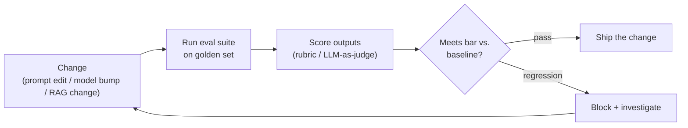
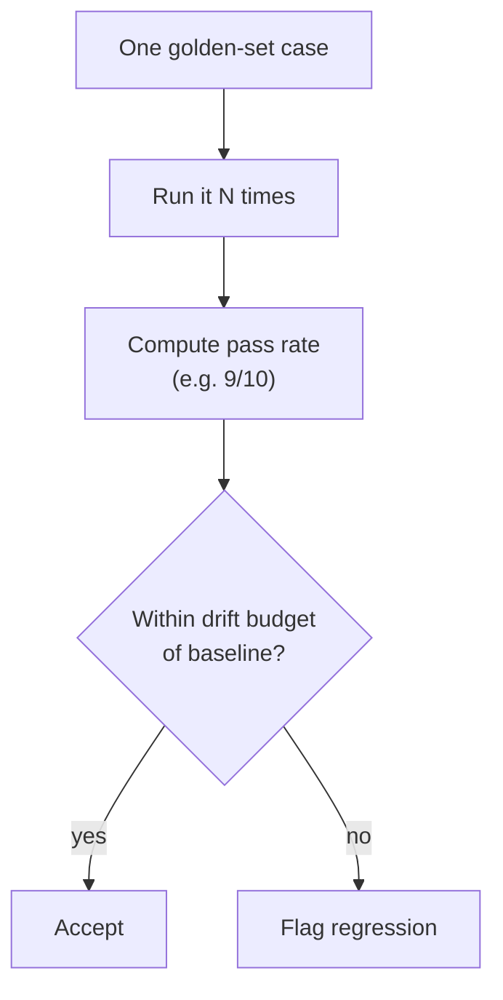

# Regression testing for prompts and models

## The problem it solves

You ship an LLM-powered feature. A user reports that it botches refund questions, so you tweak the prompt to handle that case. It works — the refund case is fixed. Three weeks later, complaints trickle in: the feature now mangles shipping questions, gets colder in tone, and started leaking internal jargon. Your one-line fix silently broke behaviors that used to work.

This is the defining pain of building on top of a large language model (LLM — the text-prediction model behind the feature). In normal software, if you break something, the compiler screams or a test goes red *immediately*. With an LLM, there is **no compiler error**. The output is still fluent, still confident, still plausible — it's just *worse*. Regressions are **silent**. They don't crash; they degrade. And they surface not as a red build but as a slow leak of quality complaints weeks later, by which point you've shipped three more changes and can't tell which one did it.

Worse, the ways an LLM feature breaks aren't limited to your own edits. Three forces move the output from underneath you:

- **You change the prompt** to fix one case and dent others.
- **You change the surrounding system** — swap the retrieval source in your [RAG (Retrieval-Augmented Generation)](../retrieval-knowledge/rag.md) setup, edit a tool the model calls, reorder examples — and the model's inputs shift, so its outputs shift.
- **The provider changes the model.** You didn't touch anything, but the vendor rolled the model version forward or deprecated the one you were using, and behavior drifts on its own.

Regression testing is the discipline that turns these silent, delayed, blame-everything failures into a loud, immediate, *pre-ship* signal: **did this change make my specific feature worse than it was yesterday?**

## The one analogy to remember

**The picture:** you replace one pipe under the kitchen sink. Before you call the job done, you don't just check that *this* pipe stopped dripping — you turn on every tap in the house, flush the toilets, and run the dishwasher, watching for a leak anywhere. One change, then a re-run of the whole known checklist, because plumbing is connected and fixing here can burst something there.

**The mapping:** the pipe you replaced = the prompt edit / model swap / RAG change; turning on *every* tap = re-running your whole saved set of test cases, not just the one you fixed; a new leak in the upstairs bathroom = a regression in a behavior you weren't even touching; the checklist of what to test growing after each surprise leak = your regression set gaining a new case every time a bug is found.

**Why it holds:** the reason you test the *whole house* and not just the pipe is that the system is interconnected and the failure shows up somewhere other than where you worked — which is exactly why an LLM change demands re-running the full suite rather than eyeballing the one case you meant to fix. A shared prompt and a shared model are shared plumbing.

**Say it like this:** "After I fix one pipe, I turn on every tap in the house to make sure I didn't cause a leak somewhere else — regression testing does that for an AI feature before we ship the change."

*Where it breaks:* a leak is binary and obvious; an LLM regression is a matter of *degree* on a fuzzy quality scale, so you can't just look for a puddle — you need a scoring method to decide whether "different" is actually "worse."

## Why this is harder than normal regression testing

Regression testing already exists in software: you keep a suite of tests and re-run them on every change to catch things you broke by accident. The instinct is to do the same for the LLM feature. The instinct is right; the *mechanism* can't carry over, and understanding why is the whole lesson.

Normal software is deterministic and closed-ended. Given the same input, a function returns the same output, and "correct" is a single known value. So a test is an equality check: `assert output == expected`. It's cheap, exact, and unambiguous.

An LLM breaks both of those assumptions:

- **Non-deterministic.** Ask the same question twice and you can get two differently-worded answers. `output == expected` fails on the *wording* even when the answer is perfect. Exact-match is useless.
- **Open-ended.** For "summarize this complaint," there is no single correct string — there are thousands of good summaries and thousands of bad ones. "Correct" is a fuzzy *region*, not a point.

So the assertion has to change shape. Instead of "does the output equal the expected string," you ask **"does the output clear a quality bar?"** — and you measure that with evaluation methods (scoring rubrics, an [LLM-as-judge](evaluation-methods.md), matching against reference answers) rather than string equality.

> [!NOTE]
> **LLM-as-judge** — using a second LLM to *score* an output against a rubric ("is this answer faithful to the source? rate 1–5"), instead of a human doing it. It's one of the scoring methods regression testing leans on. How to build and calibrate these scorers is its own topic — see [evaluation methods](evaluation-methods.md). Here, just hold onto the idea that "did it pass" is a graded judgment, not a string comparison.

This is the pivotal reframe: **regression testing for LLMs is regression testing where the assertion is an eval, not an equality.** Everything else follows from that.

## The discipline: prompts as code, evals as CI

If a prompt can silently break your product, then a prompt is not a config string you casually edit in a text box — it's **code**. And code gets the disciplines that keep code from breaking in production:

- **Version it.** The prompt lives in source control with a history, so you can see what changed and roll back. (The craft of *writing* the prompt is [prompt engineering](../prompting/prompt-engineering.md); here we only care that changes to it are tracked and tested.)
- **Test it on every change** against a saved set of cases, *before* it ships.

That saved set is your **golden set** (also called a regression set or eval set) — a curated collection of representative inputs paired with a way to judge each output. Building a good one — how to sample real cases, how to label them — is covered in [evaluation methods](evaluation-methods.md); regression testing is the *practice of re-running it on every change.*

The machinery that runs it automatically is **CI (Continuous Integration — the automated checks that fire on every code change before it merges)**. In ordinary software, CI runs your unit tests. For an LLM feature, CI runs your **eval suite**: the moment someone edits the prompt, bumps the model version, or changes the RAG source, the suite runs the golden set through the new configuration, scores the outputs, and **gates** the change — ship if it clears the bar, block if it regresses.

The payoff is the inversion of the opening story: the broken shipping-question behavior gets caught by the suite *before* it reaches a user, and you see it attached to the exact change that caused it — not three weeks and three deploys later.

This is different from watching the feature in production. Regression testing is **pre-ship and offline** — a gate you pass through before the change goes live, on a fixed set of cases. Watching live traffic for problems after release is [observability](../production-ops/observability.md), a separate discipline; the two are complementary — one stops known breakages before they ship, the other catches novel ones after. It's also not the same as a public [benchmark](benchmarks.md): a benchmark compares *models* against each other on a standard public dataset, while a regression test protects *your one specific application* across *your* changes, on *your* data.

## The techniques that make it work

**The regression set grows every time a bug is found.** This is the single most important habit, and it's borrowed straight from software: when a bug ships, you don't just fix it — you add a test that would have caught it, so it can never come back silently. Every quality complaint from production becomes a permanent new case in the golden set. Over time the set becomes a scar-tissue record of every way your feature has ever failed, and each fix is protected forever. A regression set that never grows is a regression set slowly going stale.

**Score each run and compare to a baseline.** A single score in isolation ("82% passed") tells you little. The signal is the *delta*: this run scored 82%, the last known-good run scored 89% — that's a 7-point regression, block it. The previous accepted run is your **baseline**, and every candidate change is judged against it, not against an absolute ideal.

**Budget for non-determinism — measure a pass rate, not a single run.** Because the model isn't deterministic, one run of one case isn't a verdict — a case can pass this time and fail next time on wording or a coin-flip reasoning step. So you run each case *N* times and look at the **pass rate** (e.g. "passes 9 of 10 runs"), and you set a threshold with an **allowed-drift budget** — a small band of acceptable movement — rather than demanding a perfect, identical result. Demanding 100% identical output would make the suite flag noise as failure and everyone would learn to ignore it. The art is setting the bar high enough to catch real regressions and loose enough to tolerate the model's natural jitter.

**Pin the model version, and re-run the suite before migrating.** This is the technique PMs underestimate most. A provider's model name like "the latest" or an unpinned alias can quietly point at a *new* model version, and providers periodically **deprecate** older versions and force you onto newer ones. Either way, behavior can drift with zero changes on your side — the scariest kind of silent regression, because there's no commit to blame. Two defenses: **pin** to a specific, unchanging model version so you control *when* you move; and when a migration is forced or desired, treat the new version exactly like any other change — run the full regression suite against it *before* switching, compare to the baseline on your pinned version, and only migrate if it clears the bar. This turns a terrifying forced upgrade into a routine, measured gate.

## Summary / Points to Remember

- LLM features break **silently**: no compiler error, the output stays fluent and just gets *worse*, and the damage surfaces as quality complaints weeks later instead of a red build. Regression testing makes that failure loud, immediate, and pre-ship.
- Three forces move your output: **your prompt edits, your surrounding-system changes (RAG/tools), and the provider's model-version updates.** A regression test guards against all three.
- It's harder than normal regression testing because outputs are **non-deterministic and open-ended**, so `output == expected` is useless — the assertion becomes **"does it clear a quality bar,"** measured with eval methods, not string equality.
- The discipline: **treat prompts as code** (version them) and **run an eval suite as CI** against a **golden/regression set** on every change, gating ship vs. block.
- Key habits: **grow the set with every bug found** (the failing case becomes a permanent test), **score against the previous baseline** (watch the delta, not the absolute), and **budget for non-determinism** — run N times, judge the pass rate against an allowed-drift band, not a single identical result.
- **Pin your model version** and re-run the full suite before migrating — a forced deprecation or an unpinned alias is the silent regression with no commit to blame.
- The one-line PM framing: **without regression testing every improvement is a gamble and every model migration is terrifying; with it, you can change confidently** because you catch the regression before users do.

## Interview Questions That Stump People

**Q: "Your unit-test instinct says `assert output == expected`. Why can't you just do that for an LLM feature and call it regression-tested?"**

**Interviewer:** You've got test cases with expected answers. Why not assert the output equals the expected string like any other test?

**You:** Because the model is non-deterministic and the task is open-ended, so equality is testing the wrong thing. The same input can produce differently-worded outputs that are all perfectly correct, and for something like a summary there are thousands of good answers, not one canonical string — so an exact-match test would fail on correct outputs and pass on nothing useful. The fix isn't a better string comparison; it's changing what the assertion *is*. Instead of "does it equal the expected value," I assert "does it clear a quality bar," scored by an eval method — a rubric, a reference-answer match, or an LLM-as-judge. So regression testing for LLMs is regression testing where the assertion is an eval, not an equality. Everything else — running N times, drift budgets — falls out of that one shift.

> [!TIP]
> **Why this answer works:** The trap is treating an LLM like deterministic code and reaching for exact-match, which quietly makes the whole suite worthless (it flags correct answers as failures). Naming *both* reasons — non-determinism *and* open-endedness — and then reframing the assertion from equality to a graded quality bar shows you understand the root cause, not just the symptom. It also sets up why you need pass rates and drift budgets, so a follow-up can't corner you.

---

**Q (clarify-back): "We want to move to the provider's newest model — it benchmarks better. How risky is the switch?"**

**Interviewer:** The new model scores higher on public benchmarks than the one we use. Should we just migrate?

**You (clarify back):** Do we have a regression suite on a golden set representative of our actual use case, and are we currently pinned to a specific version of the old model?

**Interviewer:** We have a decent eval set, and yes, we're pinned to a specific version.

**You:** Then the migration is low-risk *if we run the play*, and the benchmark score is close to irrelevant to the decision. A public benchmark tells you the new model is better *on average across generic tasks* — it says nothing about whether it's better on *our* prompts, *our* RAG content, *our* edge cases. Better-on-average routinely means worse-on-your-specific-thing. So I'd treat the new version exactly like any other change: run our full regression suite against it, N times per case, and compare the pass rate to the baseline from our pinned old version. Migrate only if it clears the bar on *our* cases. The fact that we're pinned is what makes this safe — we control when we move and we're comparing against a stable reference, instead of getting silently drifted onto the new behavior.

> [!TIP]
> **Why this works:** The question baits you into treating a benchmark win as a migration decision — it isn't; benchmarks compare models generically, regression tests protect your specific app. Clarifying whether a golden set and a version pin exist is the senior move because those two facts flip the answer from "terrifying gamble" to "routine gate." The strong answer explicitly separates "better on average" from "better on our data" — the exact confusion that gets teams burned by upgrades.

---

**Q: "We ship a prompt fix, our regression suite goes green, and two weeks later users report a new failure the suite didn't catch. Did regression testing fail us?"**

**Interviewer:** The gate passed but a real regression got through. So what was the point?

**You:** No — that's the system working as designed, and it tells you exactly what to do next. A regression suite can only protect against failure modes it *contains*. A brand-new failure the set never had a case for is, by definition, something the gate couldn't have known to check — that's not a gate failure, that's the limit of any finite test set, same as in normal software. The critical move is what happens now: that production failure becomes a permanent new case in the golden set, so it's caught forever after. That's the core habit — the regression set grows every time a bug is found. A set that never grows is going stale. The complement is that catching *novel* failures live isn't regression testing's job at all — that's observability on production traffic. Regression testing stops *known* breakages from recurring; observability surfaces *unknown* ones so you can convert them into new regression cases. They feed each other.

> [!TIP]
> **Why this answer works:** The trap is conceding that regression testing "failed," which misunderstands what a finite test set can promise. The strong answer reframes an escaped bug as *fuel* — the growth loop where every production failure becomes a permanent test — and then cleanly draws the boundary with observability, showing you know regression testing is pre-ship protection against known failures, not a magic net for everything.

---

**Q: "Set the pass threshold for our regression gate. Should it require 100% pass to ship?"**

**Interviewer:** What bar do you set — surely we want every case to pass before we ship?

**You:** No, and demanding 100% identical results would actually make the gate useless. Because the model is non-deterministic, the same case can pass one run and fail the next on wording or a coin-flip reasoning step — that's noise, not a regression. If I set the bar at "every case must pass, every time," the suite would flag that natural jitter as failure, block good changes constantly, and within a week the team would learn to ignore or override it — which is worse than having no gate. So instead I run each case N times and look at the pass rate, and I set a threshold with an allowed-drift budget — a small band of acceptable movement below the baseline. The bar has to be high enough to catch a real drop in quality and loose enough to absorb the model's inherent variance. The right number comes from measuring that variance on a stable configuration first, so I know what "just noise" looks like before I decide what counts as a real regression.

> [!TIP]
> **Why this works:** "Require 100%" sounds rigorous but betrays that you think the model is deterministic. The strong answer names the real risk of an over-strict gate — it flags noise, gets ignored, and becomes worse than nothing — and replaces the single-run pass/fail with a pass rate plus a drift budget calibrated against measured variance. That shows you've operated a real eval gate, not just read the definition.

---

**Q: "Nobody touched our code or prompts for a month, but the feature's quality visibly dropped. How is that even possible, and how would you have caught it?"**

**Interviewer:** Clean git history, no deploys, and yet it got worse. Explain.

**You:** The most likely culprit is the model moving underneath us. If we're calling an unpinned model name — something like an alias that points at "the current version" — the provider can roll that alias to a new version, or deprecate the one we were on and migrate us, and our behavior drifts with zero commits on our side. It's the scariest regression because there's no change of ours to blame and no build to go red. Two things would have caught it. First, *pin* to a specific immutable model version so nothing moves without our say-so — that alone prevents the surprise. Second, run the regression suite on a schedule, not only on our own changes, so even an externally-driven drift trips the gate. And when the provider does force a deprecation, I'd treat the forced new version like any other change: run the full suite against it and compare to the baseline before switching, instead of getting silently carried onto it.

> [!TIP]
> **Why this answer works:** Many candidates assume regressions only come from your own edits; naming the provider-side version drift shows you understand the full threat surface, including the failure mode with no commit to blame. Pairing the *prevention* (pin the version) with the *detection* (scheduled suite runs) proves you can both stop the surprise and catch it if it slips through — the difference between reciting "pin your models" and actually operating the system.
