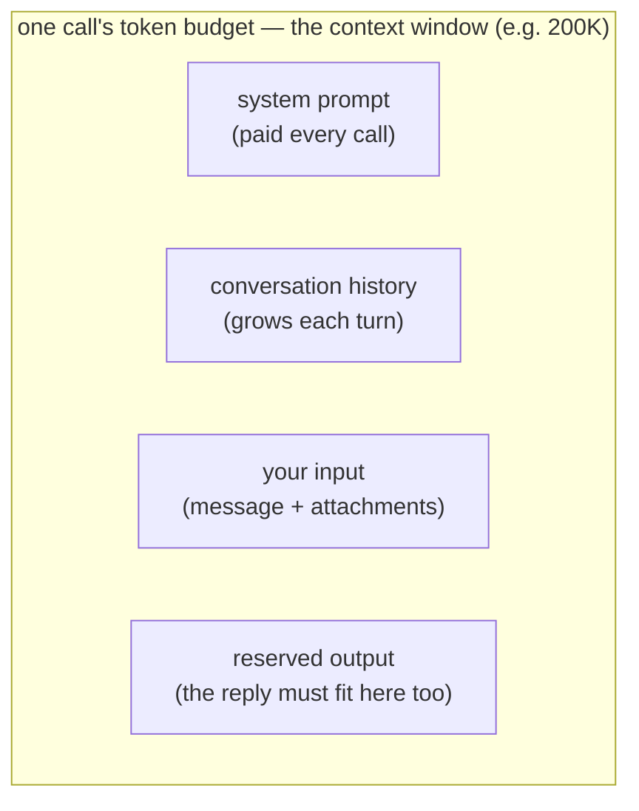

# Context windows

## The problem it solves

Ask a model a question, get an answer, then ask a follow-up that says "and what about the second one?" — and the model has no idea what "the second one" refers to unless *the earlier turn is sitting right in front of it*. A model doesn't remember your last message the way a person remembers a conversation. Each time it runs, it reads a block of text from scratch, produces a reply, and forgets everything. There is no notebook it keeps between calls.

So the practical question becomes: how much text can the model actually take in and reason over in a single go? That ceiling has a name — the **context window** — and almost every real limitation, cost surprise, and "why did it ignore my instructions?" bug in an LLM (Large Language Model) product traces back to how that window is being filled and how big it is.

> [!NOTE]
> **Token** — models don't read characters or whole words; they read *tokens*, which are word-fragments (roughly ¾ of a word each in English). The context window is measured in tokens, not words or characters, which is why its size is always quoted as a token count. Tokens have their own lesson — see [Tokenization](tokenization.md); here, just know the window is counted in them.

## The model thinks on a whiteboard that's wiped after every answer

Picture the model working on a single whiteboard. Before it can answer anything, everything it's allowed to use has to be written on that one board — and the board is a fixed size.

Watch a support chat fill it up. Pinned at the top, written first: the standing instructions the app always puts there ("You are Acme's support agent, be concise, here are the refund rules…") — the user never sees them, but they take up board space on every single question. Below that, the conversation so far — turn 1, turn 2, turn 3, each earlier question and its answer copied back on. Then the new message: "and what about the second one?" And finally, space has to be left blank at the bottom for the model to write its reply — if the board is nearly full, there's nowhere to answer and it gets cut off mid-sentence.

Now the part people miss: the instant the answer is written and handed over, the board is wiped clean. The model keeps *nothing*. The only reason the next turn seems to "remember" the chat is that the app copies the whole transcript back onto a fresh board before every question — the model isn't recalling anything, it's re-reading the board from scratch each time, and paying for every word on it, every time. And "the second one" only means something because turns 1–3 are physically sitting on the board right now; drop them to save space and the reference dissolves into nonsense.

One line to carry out of here: **the model thinks on a fixed-size whiteboard that's wiped after every answer — if something isn't written on the board for this call, the model has no idea it exists, and it's the app, not the model, that re-copies the conversation back each turn.** Where the picture leaks: a real whiteboard is read evenly everywhere, but a model reads the middle of a very full board *less* reliably than the top and bottom — the "lost in the middle" effect.

## What the context window actually is

The context window is the **maximum amount of text, measured in tokens, that the model can consider in a single call** — everything it reads plus everything it writes has to fit inside that one budget. If a model has a 200,000-token window, that number is the total capacity of one request, not a monthly allowance and not a per-message limit.

The sharp framing: whatever is on the board *is* the model's entire world for this call. It can reason brilliantly about anything written there and is completely blind to anything that isn't. Nothing you told it yesterday, nothing from three calls ago, nothing in your database is "known" to the model unless it is physically on the board *for this call*.

## What actually fills it

People picture the window as "the space for my question." It isn't. Four different things compete for the same fixed budget, and your input is usually the smallest of them:

1. **The system prompt** — the standing instructions the application puts in front of every request ("You are a support agent for Acme, be concise, never discuss competitors, here are our refund rules…"). The user never sees this, but it can be thousands of tokens, and it's paid on every single call.
2. **The conversation history** — every previous user turn and every previous model reply in this chat, re-sent in full. This is the one that grows. Turn 30 of a conversation is carrying turns 1 through 29 along with it.
3. **Your current input** — the new message, plus anything attached to it: the pasted document, the retrieved passages, the tool results.
4. **Reserved space for the output** — the reply has to fit in the window too. If you want a 4,000-token answer, 4,000 tokens of the budget must be left free for it. Ask for a long output near a full window and the model gets truncated mid-sentence.

The talking point: **input and output share one budget**. A "200K context window" is not 200K of input *plus* room to answer — the answer eats into the same 200K. Product bugs where the model stops abruptly are very often the output colliding with a window that the history and system prompt already nearly filled.

## The mental model that fixes most confusion: working memory, not long-term memory

This is the single idea worth over-learning. The context window is **working memory for one call** — like the handful of things you can hold in your head at this instant — not long-term memory that accumulates.

Between calls, the model retains nothing. The *feeling* of a continuous conversation is an illusion maintained by the application: it stores the transcript on its own and **re-sends the whole thing** on every turn. The model isn't remembering the conversation; it's re-reading it from the top, every time, at full cost.

Two consequences fall straight out of this, and both are common interview probes:

- **"The model forgot what I told it earlier."** In a long chat, the oldest turns get dropped to make room (or were summarized away by the app). They were never *stored* by the model — they simply stopped being re-sent. Nothing was forgotten; it was evicted from the window.
- **"Just tell it to remember X for later."** It can't. There is no "later" that carries state. Anything that must persist across calls has to be written down somewhere by your system and re-injected into the window when it's next needed — which is exactly the job of [Agent memory](../agents/agent-memory.md). Persistence across calls is an application feature, not a model feature; the model itself is stateless.

If you can say "the window is working memory for a single call, and continuity is the app re-sending the transcript, not the model remembering," you've demonstrated you understand the mechanism rather than the marketing.

## Failure mode 1: lost in the middle

A bigger window is not uniformly reliable across its whole length. A well-documented pattern is that models attend most reliably to information at the **beginning and the end** of a long context, and least reliably to material buried in the **middle** — the "lost in the middle" effect. Put the one clause that matters halfway through a 100-page dump and the model may sail right past it, even though it technically "read" it.

> [!NOTE]
> **Attention** — the mechanism a transformer uses to let each token weigh how much every other token matters to it. It's what lets the model use context at all, and it's also the source of the cost curve below. It has its own lesson — see [Attention](attention.md); here we only borrow two of its results.

The reported strength of this effect varies by model and has generally eased in newer, longer-context models, so treat it as a real risk to design around rather than a fixed law. The practical takeaway is durable regardless: **a token being inside the window does not guarantee it will be used.** Position matters. If something is critical, put it where the model looks hardest — near the top of the instructions or right next to the question — instead of trusting that "it's in there somewhere" is good enough.

## Failure mode 2: cost and latency rise steeply, not linearly

Doubling the tokens in the window does not merely double the cost and the wait. It's worse than that, and the reason is architectural: the attention step compares tokens against each other, so its work grows with the **square** of the length — the quadratic cost that [Attention](attention.md) derives in full. Twice the context is roughly four times the attention work.

You don't need the math to hold the shape of the curve: **a bigger window gets expensive and slow faster than you'd expect.** Two things follow for a product person:

- Stuffing the window "just in case" is not free insurance — you pay the tax on every token, on every call, whether or not any given token was relevant to the answer.
- The cost is paid *per call*, and history is re-sent per call, so a long-running conversation quietly gets more expensive with every turn as the transcript it drags along grows.

One real mitigation for the *latency* half of this problem is **KV (key/value) caching**: the model can cache the internal work it already did for the unchanged front of the prompt (the system prompt, the earlier turns) so it doesn't recompute it every call. It softens the "re-read from the top" penalty but doesn't remove the underlying cost of a large window, and it has its own lesson — [KV caching](../prompting/kv-caching.md).

## Failure mode 3: "just use a bigger window" vs. retrieval

When a model ships with a million-token window, the tempting conclusion is that the size problem is solved — just paste in the whole manual, the whole codebase, the whole knowledge base, every time. The two failure modes above are exactly why that's a trap: the middle of that giant dump is where the model attends least, and you're paying the quadratic tax on a vast amount of content that's irrelevant to any single question.

The alternative is **retrieval**: instead of sending everything, fetch only the few passages relevant to *this* question and put just those in the window. That's the job of [RAG (Retrieval-Augmented Generation)](../retrieval-knowledge/rag.md), and it's linked here because the *how* belongs to that lesson — what matters for context windows is knowing *when* to reach for it.

Here's a real decision framework — window versus retrieval:

- **Prefer a bigger window when:** the source is small enough to fit comfortably, it's fairly stable, and the task genuinely needs to reason across the *whole* thing at once (summarize this contract, find contradictions across these ten documents). Whole-corpus reasoning is where a big window earns its cost.
- **Prefer retrieval when:** the source is far larger than any window, or it changes often, or any single query only needs a small slice of it. A knowledge base that updates weekly should not be re-pasted in full on every call — you'd pay to re-read stale-until-changed content forever, and drown the answer's signal in irrelevant tokens.
- **The volatility test that decides most cases:** how often does the source change, and how much of it does one query actually need? Frequently-changing or query-a-small-slice → retrieval. Static and needed-whole → window. Many mature systems do both: retrieve the relevant slice, then use a generous window to reason over it plus the conversation.

The framing that sounds senior: **a bigger window raises the ceiling; it doesn't make context free.** The size of the window and the strategy for filling it are two different decisions, and "we have a huge window now" answers only the first.

## Summary / Points to Remember

- The context window is the model's **whole world for one call** — the max tokens (measured in [tokens](tokenization.md), not words) it can consider at once. If it isn't on the board for this call, the model is blind to it.
- It's **working memory, not long-term memory.** The model is stateless between calls; the *feeling* of a continuous chat is the application re-sending the whole transcript every turn, at full cost. Persistence across calls is an app feature — see [Agent memory](../agents/agent-memory.md).
- **Input and output share one budget.** A "200K window" is not 200K of input plus room to answer — the reply competes for the same tokens as the system prompt, the history, and your input.
- **Being in the window ≠ being used.** "Lost in the middle": models attend most reliably to the start and end of a long context. Put critical content where the model looks hardest. (Severity varies by model — design around it, don't treat it as a fixed law.)
- **A bigger window isn't free.** Cost and latency rise with the *square* of the length (the quadratic attention cost — see [Attention](attention.md)), and you pay it per call on every token, relevant or not.
- **Window vs. retrieval** is decided by volatility and slice-size: static and needed-whole → window; large, changing, or query-a-slice → [retrieval/RAG](../retrieval-knowledge/rag.md). A bigger window raises the ceiling; it doesn't make context free.

## Interview Questions That Stump People

**Q: "A model has a 200K-token context window. A user's chat has been going for hours and the model starts 'forgetting' things they said early on. The window isn't full. What's happening?"**

**Interviewer:** The window has plenty of room left, yet it's losing early details. Explain.
**You:** Two things could be in play, and neither is the model "forgetting." First, the model has no memory between calls at all — the only reason it knows anything about the earlier conversation is that the application re-sends the transcript each turn. If the app trims or summarizes old turns to control cost, that information simply stops being sent, so it's gone from the model's point of view even though the window has space. Second, even if everything is still being sent, "lost in the middle" means the model attends least reliably to material buried in the middle of a long context — so an early detail can be present but effectively skipped. The trap answer is "increase the window size"; that fixes neither, because the problem is what's being sent and where it sits, not raw capacity.

> [!TIP]
> **Why this answer works:** The question is engineered to bait "make the window bigger," and the detail "the window isn't full" is the tell that capacity isn't the issue. Naming the two real causes — the app trims what it re-sends, and lost-in-the-middle deprioritizes buried tokens — shows you understand that continuity is an application behavior and that being present in the window is not the same as being used. It also signals you debug by mechanism rather than reaching for the biggest knob.

---

**Q: "We doubled our context window. Why did our per-request cost more than double?"**

**Interviewer:** We went from a 50K to a 100K window and costs jumped more than 2×. We expected linear. Why?
**You:** Because context cost isn't linear — the attention mechanism compares tokens against each other, so its work grows roughly with the square of the length. Doubling the tokens roughly quadruples the attention work, which is where the super-linear jump comes from. The deeper point is that a bigger window doesn't just cost more when you fill it — it invites you to fill it, and you pay that quadratic tax on every token on every call, whether or not the token mattered to the answer. If cost is the concern, the lever isn't the window size, it's sending fewer tokens — retrieval instead of pasting everything.

> [!TIP]
> **Why this answer works:** "We expected linear" is the trap — most people assume cost tracks token count one-for-one. Attributing the super-linear jump to quadratic attention proves you know where the cost actually lives, and pivoting to "the fix is fewer tokens, not a smaller window" reframes it as a product lever (retrieval) instead of a mystery. A cost question answered with the architectural reason *plus* an actionable lever is what reads as senior.

---

**Q (clarify-back): "Would you use a bigger context window or retrieval for this?"**

**Interviewer:** We need the assistant to answer from our 400-page policy manual. Bigger context window, or retrieval?

**You (clarify back):** Before I pick — how often does that manual change, and does a typical question need the whole manual or just the relevant section?

**Interviewer:** It's updated most weeks, and any given question is about one specific policy.

**You:** Then retrieval. A frequently-changing source means re-pasting a huge static prompt on every call and paying the quadratic attention cost for content that's almost entirely irrelevant to the question at hand — and you'd be re-sending stale text until someone remembers to update it. Retrieval fetches just the few passages about the policy being asked, so it's cheaper, faster, less prone to "lost in the middle," and it stays current when the manual changes without re-loading everything. If instead the task were "find contradictions across the whole manual" and the manual were stable, I'd lean the other way — that's genuine whole-document reasoning, which is what a big window is for.

> [!TIP]
> **Why this works:** "Bigger window vs. retrieval" has no universal answer — it hinges on how volatile the source is and how much of it any one query needs, so answering instantly would expose you as someone reciting a rule. Asking pins both variables down and signals you've shipped this tradeoff before; once "changes weekly" and "one policy per question" are on the table, retrieval follows directly, and naming the opposite case (stable + whole-document reasoning → window) shows it's judgment, not dogma.

---

**Q: "Can't I just tell the model to remember my name for the rest of our session?"**

**Interviewer:** Why can't I just say "remember I'm called Sam" and have it stick?
**You:** Because the model is stateless between calls — there's no place inside it where "Sam" persists to the next request. It only appears to remember within a conversation because the application keeps re-sending the transcript, and "remember I'm Sam" is just more text in that transcript. The moment that line stops being re-sent — a new session, or old turns trimmed to save budget — it's gone. Real persistence across calls has to be built by the application: store the fact and re-inject it into the window when it's relevant. That's the whole reason agent memory is a separate engineering problem and not just a prompt instruction.

> [!TIP]
> **Why this answer works:** The instinct is to treat memory as an instruction you can just issue to the model. Explaining that the model is stateless — and that "remember I'm Sam" is merely more re-sent text that vanishes the moment it stops being sent — shows you understand why persistence is an engineering problem the application owns, not a capability you can ask the model for. It's the clean setup for why agent memory exists as its own system.

---

**Q: "If the newest models have million-token windows, isn't retrieval basically obsolete?"**

**Interviewer:** With windows this big, why not just paste everything in and skip retrieval entirely?
**You:** Two reasons it's the opposite of obsolete. First, cost and latency: attention is quadratic, so filling a million-token window is disproportionately expensive and slow, and you pay it on every call for tokens that were mostly irrelevant to the specific question. Second, quality: "lost in the middle" means the model attends least to the middle of a giant context, so burying the one relevant paragraph in a million tokens can make it *less* likely to be used, not more. A bigger window raises the ceiling on what's *possible* to fit — it doesn't make context free or make every token equally attended. Retrieval is still how you keep any single call cheap, fast, current, and focused. The mature pattern is both: retrieve the relevant slice, then use the big window to reason over that slice plus the conversation.

> [!TIP]
> **Why this answer works:** Big-window announcements make "retrieval is dead" sound obvious, so confidently arguing the opposite — with two independent reasons, cost (quadratic attention) and quality (lost-in-the-middle) — signals you aren't swayed by marketing. Landing on "both: retrieve, then reason over the slice" shows you hold the nuance instead of picking a side, which is exactly the judgment the question is probing for.
