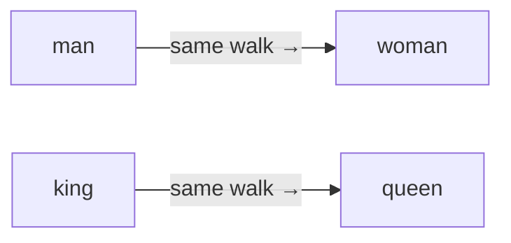
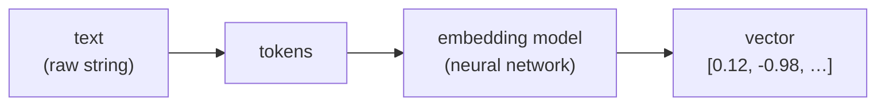

# Embeddings

## The problem it solves

A computer has no idea that "car" and "automobile" mean nearly the same thing, while "car" and "carpet" — despite sharing four letters — mean nothing alike. To a machine, words are just strings of characters. "Physician" and "doctor" look as unrelated as "physician" and "banana." That is a disaster if you want a computer to *search by meaning*, group similar documents, or recommend "more things like this." The old workaround was matching exact words: search for "heart attack" and you'd miss every document that said "myocardial infarction," because the letters don't line up. The machine could match spelling, but it was blind to meaning.

Embeddings are the fix. The idea is to turn each piece of content — a word, a sentence, a whole document, even an image — into a list of numbers positioned so that **things that mean similar things end up close together**, and things that mean different things end up far apart. Once meaning becomes a location in space, "similar" becomes something a computer can actually measure. This is the representation that makes semantic search, recommendation, clustering, and retrieval possible at all.

> [!NOTE]
> **Vector** — an ordered list of numbers (see the [ML vocabulary primer](../primers/ml-vocabulary.md)). An embedding *is* a vector: picture a 2-number vector as a point on a graph (an x and a y), then scale that up to hundreds or thousands of numbers — a point in a space with that many dimensions. We can't visualize 1,000 dimensions, but "how close are two points" works exactly the same no matter how many there are.

## Meaning becomes a place on a map

Give every word an address on a map, and lay the map out so that things meaning similar things sit in the same neighborhood. *Doctor* and *physician* land on the same block. *Nurse* is a few doors down — same medical district. *Banana* is clear across town in the groceries quarter, nowhere near any of them.

Watch what that buys you. To ask "is *physician* related to *doctor*?" you no longer compare their spellings — by spelling, *physician* is as far from *doctor* as it is from *banana*. You measure the walk between their addresses. Short walk, closely related; cross-town, unrelated. Relatedness has turned into distance — and distance is something a computer can actually measure.

The map encodes *relationships*, too, not just neighborhoods. The walk from *man* to *woman* — some fixed direction and distance, say three blocks north — turns out to be the same walk that takes you from *king* to *queen*:

Nobody drew a "gender street" onto the map. It's there because *man/woman* and *king/queen* get used in parallel ways in text, so the space arranged them in parallel — which is exactly why the famous "king − man + woman ≈ queen" lands you on *queen*.

One line to carry out of here: **embeddings put every piece of content at an address on a map of meaning, where synonyms are neighbors and you judge how related two things are by how far apart they sit.** Where the picture leaks: a real map is 2D, so you can point at a spot and read its cross-streets; an embedding map has hundreds of dimensions, so no single coordinate is readable on its own — only the walks *between* addresses carry meaning.

## A word is known by the company it keeps

The map doesn't come pre-drawn — so where do the addresses come from? From usage, by one rule: a model learns to place words that appear in similar contexts near each other. "Doctor" and "physician" show up around the same neighboring words — patient, hospital, prescribe — so a model trained to predict context pushes them to nearly the same address. Meaning is inferred from how words are used, never from a dictionary.

That same rule is why the *king → queen* walk from the analogy exists at all. Because the space is arranged by usage, consistent relationships become consistent directions: "man/woman" and "king/queen" are used analogously in text, so the space places them in parallel, and the step between one pair is the step between the other. The model was told nothing about gender or royalty — the structure *emerged* from usage alone. Which is also why the arithmetic reproduces bias for the identical reason: "doctor − man + woman ≈ nurse" is the same mechanism faithfully mirroring a correlation in the data.

One caution the map makes easy to forget: no single number in the vector is readable on its own — there's no "friendliness dimension" you could look up. The meaning lives in the *geometry* — the relative positions and directions among many points — not in any one coordinate.

The sharp framing to carry: **an embedding turns meaning into geometry, so that judging similarity becomes measuring distance.** That one sentence is the whole concept.

## Measuring "close"

Once everything is a point, "how similar are these two things?" becomes "how close are these two points?" The most common measure in practice is **cosine similarity** — it looks at the *angle* between two vectors rather than the raw distance between the points. Two vectors pointing in the same direction are treated as similar even if one is "longer" than the other.

> [!NOTE]
> **Cosine similarity** — a score, usually from −1 to 1, for how aligned two vectors are. 1 means they point the same way (very similar meaning), 0 means unrelated, −1 means opposite. It cares about *direction*, not magnitude, which is why a short query and a long document can still score as a strong match. You don't need the formula; you need the intuition — it's a "same-direction-ness" score.

The practical payoff: to find the documents most relevant to a question, you embed the question, then look for the stored document-embeddings closest to it. No keyword needs to match. Ask about "heart attack" and a document that only ever says "myocardial infarction" scores as a near neighbor, because both were placed in the same region of the space. Meaning matched, even though not a single word did.

That search-by-nearest-neighbor pattern is the engine under semantic search and retrieval, and it is what lets a language model answer from your private documents. But storing millions of embeddings and finding the nearest ones *fast* is its own engineering problem, and stitching retrieved passages into a model's prompt is another — both have their own lessons. Embeddings are the representation that makes those systems possible; see [Vector databases](../retrieval-knowledge/vector-databases.md) for how the vectors are stored and searched at scale, [Retrieval](../retrieval-knowledge/retrieval.md) for how the right ones are fetched, [Reranking](../retrieval-knowledge/reranking.md) for how results are re-ordered, and [RAG (Retrieval-Augmented Generation)](../retrieval-knowledge/rag.md) for the full pattern of feeding them to a model. This lesson owns only the representation itself.

## Who makes the numbers: the embedding model

Nothing about these coordinates is handed down from nature. They are produced by an **embedding model** — a neural network trained specifically to map content to points in a meaningful space (see the [ML vocabulary primer](../primers/ml-vocabulary.md) for neural network, weights, training, and inference). It's worth separating this from the more familiar chat model: an embedding model's job is not to generate text, it's to *place* text. You feed it a chunk of content and it returns the vector. Different models produce spaces of different sizes (how many numbers per vector) and different quality.

Two structural points a product person should hold:

- **Text usually becomes tokens before it's embedded.** The raw string is first chopped into the model's units, then those flow through the network to produce the final vector. How text gets chopped is its own topic — see [Tokenization](tokenization.md) — and the mechanism that lets a modern embedding model weigh how words relate before producing the vector is the same one behind language models generally, covered in [Attention](attention.md). Named here, not unpacked.
- **Different content types can share one space.** This is the quietly powerful part. A model can be trained so that an *image* of a dog and the *word* "dog" land near each other in the **same** space — a shared *multimodal* space, one embedding space that different content types are mapped into together so a picture and its caption sit as neighbors. That's what lets you search a photo library by typing a description, or find images similar to a sentence: text and pixels became comparable because they were embedded into the same coordinate system, compared as neighbors rather than matched by tags. The models that pull this off are covered under [Vision-language models](../multimodal/vision-language.md); the takeaway here is only that a single space can hold more than one kind of content.

## Where embeddings quietly fail

Embeddings feel like magic, which is exactly why their failure modes catch teams off guard. Three matter most.

**An embedding is only as good as the model that made it.** The vectors are not objective truth about meaning — they are one model's learned opinion. A weak or small embedding model produces a space where the neighborhoods are muddled: things that should be close aren't, and unrelated things drift together. Your entire semantic search is downstream of that one model's quality. If retrieval is returning junk, the embedding model is the first suspect, not the database.

**Domain mismatch is the silent killer.** A model trained on general web text builds a space tuned to *general* usage. Point it at specialized language and the geometry gets unreliable. In law, "consideration" is a technical term for what each party gives in a contract; in medicine, "discharge" and "positive" carry meanings a general model half-misses. A general-purpose embedder places these using their everyday senses, so legal or medical documents that a specialist would call near-identical can land far apart — and unrelated ones can land close. The fix is a domain-appropriate or [fine-tuned](../model-behavior-training/fine-tuning.md) embedding model, but the trap is assuming one general model embeds everything equally well. It doesn't.

**Embeddings encode the biases and correlations in their training data.** The space learns *whatever patterns exist in the data*, including the ones you'd rather it didn't. If the training text overwhelmingly associated "nurse" with women and "engineer" with men, those associations become directions in the space — the same mechanism that makes "king − man + woman ≈ queen" work will also reproduce "doctor − man + woman ≈ nurse." That's not a bug in the math; it's the math faithfully capturing a correlation in the data. In a product this can surface as skewed search results, unfair recommendations, or a resume-matcher that quietly ranks by proxy for gender or ethnicity. The embedding didn't invent the bias; it measured and preserved it.

The unifying idea across all three: **an embedding is a mirror of its training data, seen through its model's quality.** It reflects what it was shown — good coverage, bad coverage, and the prejudices baked in — with no notion of what *ought* to be true.

## Summary / Points to Remember

- An embedding turns meaning into geometry: content becomes a point in space, and **similarity becomes distance** — that single reframing is the whole concept, and it's what makes search-by-meaning possible.
- "king − man + woman ≈ queen" works because directions in the space encode *relationships*, and that structure **emerged** from training on how words are actually used — the model was never taught gender or royalty explicitly.
- Similarity is usually measured with **cosine similarity** — a "same-direction-ness" score — so a short query can match a long document by meaning even when no words overlap.
- Embeddings are the representation under semantic search, retrieval, and recommendations; the storing/fetching/feeding is handled by vector databases and RAG, which are separate concerns.
- A single **shared space** can hold multiple content types, so an image and the word describing it can be neighbors — that's what powers cross-modal search.
- Three failure modes to name in an interview: **quality** (only as good as the embedding model), **domain mismatch** (a general model embeds legal/medical text poorly), and **bias** (the space faithfully preserves the correlations, fair or not, in its training data).
- The framing that ties the failures together: **an embedding is a mirror of its training data through its model's quality** — it has no idea what ought to be true, only what it was shown.

## Interview Questions That Stump People

**Q: "Why does 'king − man + woman ≈ queen' actually work? Was the model taught that?"**

**Interviewer:** Everyone quotes the king/queen arithmetic. Explain why it works — was gender programmed in somehow?

**You:** No, nothing about gender or royalty was programmed. It falls out of how the space is built. The model learns to place words that appear in similar contexts near each other, and a side effect is that consistent *relationships* between words become consistent *directions* in the space. The shift from "man" to "woman" is roughly the same direction and distance as "king" to "queen," because those pairs are used analogously in text. So the arithmetic works because the geometry captured a real regularity in usage — it's emergent structure, not a hand-coded rule. The tell that someone gets it is that they mention it also reproduces bias for the exact same reason: "doctor − man + woman ≈ nurse" comes from the identical mechanism, faithfully mirroring a correlation in the data.

> [!TIP]
> **Why this answer works:** The trap is treating the demo as a party trick or, worse, implying gender was somehow encoded as a feature. Explaining it as *emergent structure from usage* — relationships becoming directions — shows you understand the training mechanism, not just the headline. The real power move is closing the loop to bias: naming that the *same* mechanism produces "doctor − man + woman ≈ nurse" signals you see embeddings as a faithful mirror of data, which is exactly the maturity an interviewer is probing for.

---

**Q: "Our semantic search returns irrelevant results. Walk me through where you'd look."**

**Interviewer:** We built semantic search over our docs and the results are bad. Where do you start?

**You:** My first suspect is the embedding model, not the database or the search code. If the model is weak or — more likely — it's a general-purpose model pointed at specialized content, the space itself is unreliable: things that should be neighbors aren't. So I'd check whether our content is domain-specific, like legal or medical or internal jargon, because a general embedder mishandles those meanings and the whole retrieval is downstream of that. I'd validate by hand-checking a few queries: are the returned items genuinely semantically close, or subtly off? If the space is bad, no amount of database tuning fixes it. Only after ruling the model out would I look at chunking, the distance metric, or the retrieval logic — but those live in their own parts of the stack; the representation quality comes first.

> [!TIP]
> **Why this answer works:** The reflex answer is to reach for the machinery you can tune — the database, the distance metric, chunk size — because those feel actionable. Naming the *embedding model* first shows you understand the dependency order: retrieval quality is downstream of representation quality, so a bad space can't be rescued by tuning the plumbing. Leading with "is this domain-specific content in a general model?" signals you've debugged this before and know domain mismatch is the usual culprit, not the search code.

---

**Q (clarify-back): "Should we use an off-the-shelf embedding model or train our own?"**

**Interviewer:** We're adding semantic search to our product. Off-the-shelf embedding model, or invest in our own?

**You (clarify back):** Before I answer — how specialized is the language in your content? Is it general business text, or a narrow domain like clinical notes, legal contracts, or heavy internal jargon?

**Interviewer:** It's clinical documentation — lots of medical terminology and abbreviations.

**You:** Then off-the-shelf is a real risk and I'd budget for a domain-appropriate or fine-tuned model. A general embedder was trained on everyday web text, so it places medical terms by their common-usage meaning and gets the neighborhoods wrong — documents a clinician would call near-identical can land far apart. If this had been general business text, I'd start with a strong off-the-shelf model and not spend the money, because for general language they're excellent and training your own rarely beats them. The deciding variable is domain distance from general text, not company size or ambition.

> [!TIP]
> **Why this works:** "Off-the-shelf vs. our own" has no universal answer — it hinges entirely on how far the content's language sits from the general text these models were trained on, so answering immediately would expose you as someone reciting a rule ("always use off-the-shelf" or "always customize"). Asking about domain specialization first pins down the one variable that actually decides it and signals you know the real risk is *domain mismatch*, not model prestige or company size. Once "clinical documentation" is on the table, the recommendation to budget for a domain-appropriate model follows directly — and flagging that you'd have answered the opposite way for general business text proves the clarification genuinely changed the call.

---

**Q: "Can you tell what any single number in an embedding means?"**

**Interviewer:** An embedding is a list of, say, 1,000 numbers. What does the 3rd number represent?

**You:** Almost certainly nothing interpretable on its own. That's the common misconception — that each dimension is a labeled feature like "formality" or "gender." In practice the meaning is distributed across the whole vector; individual numbers aren't human-readable axes. What's meaningful is the *geometry* — the relative positions and directions among many vectors — not any single coordinate. So the right mental model is that the space as a whole encodes meaning, and you interrogate it by comparing points, not by reading off one number.

> [!TIP]
> **Why this answer works:** The question is bait for the tidy-but-wrong belief that dimensions are labeled features you could read like a spreadsheet column. Saying the meaning is *distributed* and only the geometry is interpretable shows you understand what an embedding actually is — a position whose value comes from its relationships to other positions, not from any single axis. It also inoculates you against a whole class of bad product ideas that assume you can "inspect dimension 3 to get the sentiment," which is what an interviewer is checking you won't propose.

---

**Q: "If two documents get identical embeddings, does that mean they say the same thing?"**

**Interviewer:** Suppose two texts embed to nearly the same vector. Safe to treat them as saying the same thing?

**You:** Not safe — it means the model *judged* them as similar, which is only as trustworthy as the model. Two things can land close because they share surface patterns the model latched onto rather than genuine meaning, especially if they're in a domain the model handles poorly. And an embedding compresses a whole passage into one point, so nuance and specific facts can get flattened — two subtly contradictory statements can sit near each other. So I'd say "the model considers them semantically close," never "they mean the same thing." Treating embedding proximity as ground truth about meaning is exactly how teams get burned when the underlying model is weak or off-domain.

> [!TIP]
> **Why this answer works:** The question invites a confident "yes" — proximity *feels* like it should mean sameness. Refusing that and reframing it as "the model judged them close, which is only as trustworthy as the model" shows you treat an embedding as a model's opinion, not ground truth. Naming the two concrete ways it breaks — surface-pattern matches, and compression flattening nuance so contradictions sit close — proves you know the failure modes, and insisting on the careful phrasing ("considers them close," never "they mean the same") is the discipline that stops teams building on a false equivalence.
