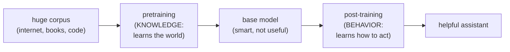

# Pretraining vs. Post-training

## The problem it solves

Here is a fact that surprises almost everyone the first time they hear it: the model that comes out of the most expensive, most compute-hungry stage of building an AI is *useless as an assistant*. Feed the raw output of that stage the prompt "What is the capital of France?" and it might reply "What is the capital of Germany? What is the capital of Italy?" — because it learned that a question like that is usually followed by *more questions like that*, in a quiz. It has read a large fraction of the internet and absorbed a staggering amount of the world's knowledge, and yet it will not answer you, will not refuse a harmful request, and has no idea it is supposed to be a chatbot.

So how do you get from that raw, knowledgeable-but-unhelpful thing to Claude or ChatGPT — something that follows instructions, stays on task, and declines to help you build a weapon? That gap is the whole story. Building a modern model happens in **two fundamentally different stages**, and confusing them is behind a huge number of wrong intuitions PMs have about what an AI can and can't do, what a fine-tune will and won't fix, and why two models of identical size can behave like completely different products.

> [!NOTE]
> **Model, weights, training, dataset, GPU** — this lesson leans on all of these. If any are fuzzy, the one-line versions live in the [ML vocabulary primer](../primers/ml-vocabulary.md). In short: a *model* is a giant pile of numbers (*weights*) that *training* adjusts by showing it examples from a *dataset*, and the whole thing runs on *GPUs*.

## A brilliant graduate, then a manners course

Picture someone who has read essentially the entire library — every book, article, and manual, all of it. They know a staggering amount. But sit them down and ask "What is the capital of France?" and they answer "What is the capital of Germany? What is the capital of Italy?" — not because they don't know it's Paris, but because they've read so many quizzes that a question like that reads, to them, as the *opening* of a list of more questions. They blurt, they pattern-match, they don't register that *you* asked *them* something and are waiting for an answer. That's the base model straight out of pretraining: all of the knowledge, none of the manners.

Now send that same person on a short customer-service course. It teaches them to listen to what was actually asked, answer *that*, stop when they're done, keep a civil tone, and decline the requests they shouldn't help with. Ask "What is the capital of France?" again and now they say "Paris." — and stop. Notice what the course did *not* do: it taught them no new facts. They knew Paris the whole time; what changed is that they now behave like someone you can actually work with. That's post-training.

The entire two-stage story lives in that one before-and-after. Reading the library put the *knowledge* in (pretraining, the slow expensive stage); the course shaped the *behavior* on top (post-training, comparatively quick and cheap), adding essentially no new knowledge. Which is why the punchline holds: you can send someone on every manners course in the world and it will never teach them a fact the library didn't contain.

One line to carry out of here: **pretraining is reading the whole library; post-training is the manners course on top — knowledge from the first, behavior from the second — and you can't fix missing knowledge with more manners.** Where the picture leaks: a real person keeps picking up facts on the job, but the model's knowledge is essentially frozen at pretraining — the manners course adds almost none.

## Stage one: pretraining — where the model learns the world

Pretraining is the stage that builds the raw intelligence. The recipe is almost comically simple to state: take an enormous pile of text — a large crawl of the public internet, books, code, and more — and train the model on a single game played trillions of times: **predict the next token.** Show it "The capital of France is ___" and nudge its weights toward "Paris." Do that across essentially all the text humanity has put online.

That game has a name — **next-token prediction** — and it works exactly as it sounds: the model is shown a stretch of text with the next piece hidden, guesses it, and has its weights nudged based on how wrong the guess was. (A *token* is roughly a word-piece; the exact unit gets its own lesson, [Tokenization](tokenization.md) — here it's enough to picture "the next bit of text.")

The thing to internalize is what this simple game *forces* the model to learn. To predict the next token well across the entire internet, it can't just memorize — it has to build an internal model of grammar, facts, reasoning patterns, code syntax, and how ideas connect. Getting good at "guess the next word" over a large enough corpus turns out to require getting good at *understanding*. That is the surprising engine underneath the whole field: a trivial objective, at enormous scale, produces general capability. (*Why* scale unlocks this is the transformer's story — see [Transformers](transformers.md).) One capability that emerges from this stage is worth flagging early: the model can pick up a task from a few examples shown in the prompt, with no further training — the phenomenon called **in-context learning**, covered in [Few-shot and in-context learning](../prompting/few-shot-icl.md).

Three consequences flow directly from pretraining, and every one is a talking point:

- **This is where the knowledge lives.** Everything the model "knows" — that Paris is France's capital, how Python loops work, what a sonnet is — was baked in here, from the training data. Post-training adds almost no new facts.
- **This is where the knowledge cutoff comes from.** The training data was collected up to some date. The model has never seen anything after it. That frozen boundary is the *knowledge cutoff*, and it exists because re-pretraining is too expensive to do continuously.
- **This is where the biases live too.** If the internet over-represents a viewpoint, under-represents a group, or repeats a falsehood, the model absorbs that. The dataset's blind spots become the model's blind spots.

The artifact that comes out of this stage is called a **base model** (or "foundation model"). It is a phenomenally powerful *text-completer* and nothing more. It has no notion of a "user" and an "assistant," no instinct to be helpful, and no safety behavior. Pretraining is also where essentially all the cost is — months of thousands of GPUs. This is the stage only a handful of companies in the world can afford to run.

## Stage two: post-training — where the model learns to behave

Post-training is everything done *after* pretraining to turn that raw base model into something a person can actually use. It is dramatically cheaper and faster than pretraining — think a small, curated dataset and a fraction of the compute — because it isn't teaching the model *new knowledge*. It is teaching the model *how to behave with the knowledge it already has*.

The sharp framing is this: **pretraining makes the model smart; post-training makes it useful.** Or, even tighter — **knowledge is baked in during pretraining; behavior is shaped in post-training.**

What does "behavior" mean concretely? Post-training is where the model learns to:

- **Follow instructions** rather than just continue text — to treat "Summarize this" as a command to obey, not a phrase to autocomplete.
- **Adopt the chat format** — to understand there's a "user" who speaks and an "assistant" (it) who responds in turn, instead of producing one undifferentiated stream of text.
- **Be helpful and harmless** — to give useful, on-topic answers and to refuse or deflect genuinely harmful requests.
- **Match a tone and style** — the "personality" that makes one company's assistant feel different from another's.

Post-training is not one technique; it is a **family** of them, applied in sequence. This lesson is the conceptual frame they all sit inside — the individual methods each have their own lesson, and the whole point of naming them here is to send you there:

- **[Instruction tuning](../model-behavior-training/instruction-tuning.md)** — teaching the model to follow instructions, typically the first post-training step.
- **[Fine-tuning](../model-behavior-training/fine-tuning.md)** — the general practice of further training a model on a targeted dataset to specialize its behavior.
- **[RLHF (Reinforcement Learning from Human Feedback)](../model-behavior-training/rlhf.md)** — shaping the model using human preferences about which of its answers are better.
- **[DPO (Direct Preference Optimization)](../model-behavior-training/dpo.md)** — a newer, simpler way to achieve a similar preference-shaping result.

Don't memorize how these work for this lesson. The one thing to carry is that they are all *post-training* — they adjust behavior, not knowledge. When an interviewer mentions RLHF or fine-tuning, you should be able to place it instantly: "that's a post-training technique." How each actually works is its own topic.

The artifact that comes out of this stage is the **instruct model** (or "chat model") — the thing you actually talk to. When a provider ships "Llama 3 8B" it usually ships *two* versions of the same 8-billion-parameter model: a **base** and an **instruct**. Same size, same pretraining, wildly different behavior. That pairing is the cleanest possible proof of the two-stage story: the difference between them is *entirely* post-training.

## The mistake this frame protects you from

The most valuable thing this two-stage picture gives a PM is a reliable answer to *"can we fix this with fine-tuning?"* — and the answer turns on which stage owns the problem.

If the issue is **behavior** — the model won't follow your format, adopts the wrong tone, doesn't refuse the right things, isn't specialized to your domain's style — that's post-training territory, and yes, fine-tuning is the lever.

But if the issue is **missing knowledge** — the model doesn't know your company's internal facts, or anything past its knowledge cutoff — post-training is largely the *wrong tool*, and this trips up a lot of teams. You can fine-tune a model on your documents and it will get better at *sounding* like your domain, but it will not reliably *learn and recall* new facts that way; it tends to absorb style far better than it absorbs facts, and it will confidently make things up in the gaps. Knowledge was a pretraining phenomenon, and short of the eye-watering cost of re-pretraining, the right way to inject fresh or private facts at answer-time is to *retrieve* them and put them in the prompt — see [RAG (Retrieval-Augmented Generation)](../retrieval-knowledge/rag.md).

This is a strong tendency, not an absolute law. Fine-tuning *can* nudge some facts in, and the boundary between "teaching style" and "teaching facts" is genuinely blurry at the edges. But as a decision heuristic — "knowledge gap → retrieval; behavior gap → fine-tune" — it is the right default and will steer you correctly far more often than not.

So the sayable takeaway: **you can't post-train your way out of a knowledge gap.** Behavior is malleable after the fact; knowledge, for the most part, is set in the concrete of pretraining.

## Summary / Points to Remember

- Modern models are built in **two stages**: **pretraining** (learn the world by predicting the next token over a massive corpus) then **post-training** (learn to behave like a helpful assistant).
- The tightest framing: **pretraining bakes in knowledge; post-training shapes behavior.** Pretraining makes the model *smart*; post-training makes it *useful*.
- The output of pretraining is a **base model** — a powerful text-completer that is *not* helpful, safe, or instruction-following. Post-training turns it into an **instruct/chat model**.
- **Knowledge cutoff and biases both come from pretraining** — they're properties of the training data, frozen at collection time.
- **A base model and an instruct model of the same size behave completely differently** — the only difference between them is post-training. That pairing is the proof of the two-stage story.
- **You can't fix a knowledge gap with post-training.** Behavior gap → fine-tune (a post-training technique); knowledge gap → retrieval (RAG). This is a strong heuristic, not an absolute.
- **[Fine-tuning](../model-behavior-training/fine-tuning.md), [RLHF](../model-behavior-training/rlhf.md), [DPO](../model-behavior-training/dpo.md), and [instruction tuning](../model-behavior-training/instruction-tuning.md) are all post-training techniques** — they all sit under this frame.

## Interview Questions That Stump People

**Q: "A base model and an instruct model of the same size have identical knowledge — so why do they behave so differently?"**

**Interviewer:** Take Llama 3 8B base and Llama 3 8B instruct. Same parameters, same pretraining. Why does one act like an assistant and the other doesn't?

**You:** Because knowledge and behavior come from two different stages. They share pretraining, so they genuinely do have the same underlying knowledge. But the instruct version went through post-training — instruction tuning, preference shaping — that taught it *how to behave*: follow instructions, use the chat format, be helpful and safe. The base model never learned any of that; it only ever learned to complete text. So the difference between them isn't intelligence, it's behavior, and behavior is precisely what post-training installs. That pairing is actually the cleanest demonstration that the two stages are separate.

> [!TIP]
> **Why this answer works:** The naive move is to reach for "the instruct model is smarter" or "it was trained more" — both wrong, and both signal you think of training as one undifferentiated process. Insisting the knowledge is *identical* and pinning the entire difference on post-training shows you hold the two stages apart cleanly. It also flips the question into evidence for your own frame: the base/instruct pair is the closest thing to a controlled experiment the field has, so naming it as proof makes you sound like you reason from the architecture, not from slogans.

---

**Q (clarify-back): "Our support bot keeps getting our product facts wrong. Should we fine-tune it on our docs?"**

**Interviewer:** Our assistant keeps stating wrong facts about our own product. The team wants to fine-tune it on our documentation. Good plan?

**You (clarify back):** Before I answer — is the problem that it doesn't *know* our facts, or that it knows them but presents them in the wrong *format or tone*?

**Interviewer:** It genuinely doesn't know them. These are internal product details that were never on the public internet.

**You:** Then fine-tuning is probably the wrong first move. That's a *knowledge* gap, and knowledge is overwhelmingly a pretraining phenomenon — fine-tuning is a post-training technique that's great at shaping behavior but unreliable at reliably teaching and recalling new facts. It'll pick up the *style* of your docs and still confidently make up specifics in the gaps. The right tool for injecting private, current facts at answer-time is retrieval — pull the relevant doc passages into the prompt so the model reads them each time. I'd reach for fine-tuning if the complaint had been about tone or format, because *that's* a behavior problem.

> [!TIP]
> **Why this works:** "Should we fine-tune?" has opposite answers depending on whether the gap is knowledge or behavior — and the two are easy to conflate from the symptom alone ("it's wrong"), so answering immediately risks endorsing the wrong fix with confidence. Asking which one first signals seniority: you've seen teams burn a fine-tuning budget on a knowledge problem. Once they confirm the facts were never in the data, the answer follows directly — that's a pretraining-shaped gap, so retrieval is the lever and fine-tuning would only teach the model to *sound* right while still inventing specifics.

---

**Q: "Why can't a model just tell you about something that happened last week?"**

**Interviewer:** Why does a model have a knowledge cutoff at all? Why not just keep it current?

**You:** Because knowledge is acquired during pretraining, and pretraining is the massively expensive stage — months on thousands of GPUs over a fixed snapshot of data collected up to some date. The model has literally never seen anything after that snapshot. Keeping it current would mean re-running that stage continuously, which is economically out of the question. The common misconception is that the cutoff is some deliberate setting you could just bump forward; it's actually a direct consequence of *when* the training data was frozen. And it's exactly why retrieval exists — to hand the model fresh information at answer-time instead of trying to re-train it into the weights.

> [!TIP]
> **Why this answer works:** The trap is treating the cutoff as a policy knob — "why don't they just update it?" — which mistakes an economic constraint for a product decision. Tying the cutoff to *when pretraining's data was frozen* and to the cost of re-pretraining shows you understand it's a consequence of how knowledge gets in, not a setting anyone chose. Ending on retrieval demonstrates you know the actual workaround the industry uses, which is what an interviewer probing this is usually driving toward.

---

**Q: "If pretraining teaches it everything, what's actually happening in post-training — is it learning new information?"**

**Interviewer:** People say post-training is where you "align" the model. Is it learning new facts in that step?

**You:** Almost none. Post-training is teaching *behavior*, not *content*. It's using a comparatively tiny, curated dataset to shape how the model uses knowledge it already has — to follow instructions, adopt the chat turn-taking format, be helpful, and refuse harmful requests. Think of pretraining as a brilliant but socially oblivious person who's read everything, and post-training as teaching them how to actually hold a helpful conversation. The knowledge was already there; what changed is what they *do* with it. That's why post-training is cheap relative to pretraining — you're adjusting behavior, not re-teaching the world.

> [!TIP]
> **Why this answer works:** "Align" is a loaded word that tempts people into implying the model is learning new information or values from scratch. Answering "almost no new facts — it's behavior, not content" keeps the knowledge/behavior line sharp under pressure, and the cost argument seals it: if post-training were teaching the world, it couldn't be a fraction of pretraining's compute. The socially-oblivious-genius analogy is a safe bring-along — it makes the point memorable without overclaiming, since it names *what changes* (conduct) rather than *what's known*.

---

**Q: "Where do a model's biases come from — training or the guardrails on top?"**

**Interviewer:** When a model produces a biased output, where did that bias actually originate?

**You:** The root is usually pretraining. The model absorbs the statistical patterns of its training data — so if the underlying corpus over-represents a viewpoint or repeats a stereotype, that gets baked into the weights. Post-training can *counteract* some of it by shaping the model away from certain outputs, and runtime guardrails can filter more, but those are corrections layered on top of a bias that originated in the data. The trap is thinking bias is purely a safety-layer problem you can bolt a filter onto; a lot of it lives deeper, in what the model learned during pretraining, which is why it's so much harder to fully remove than to merely suppress.

> [!TIP]
> **Why this answer works:** The question dangles an easy answer — "the guardrails" — because that's the visible layer everyone points at. Tracing bias back to pretraining data, and casting post-training and guardrails as corrections *layered on top*, shows you understand bias is a property of what was learned, not just what's filtered. The distinction between *suppressing* an output and *removing* the underlying bias is the senior nuance here, and it's exactly why "just add a filter" is the incomplete answer the interviewer is usually testing for.
