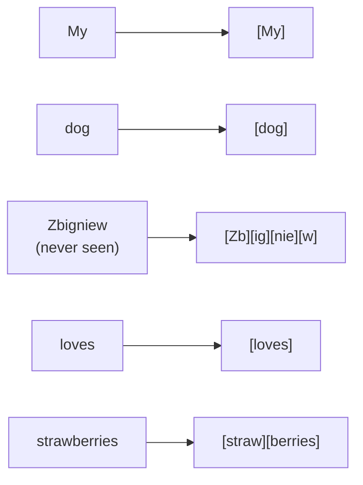
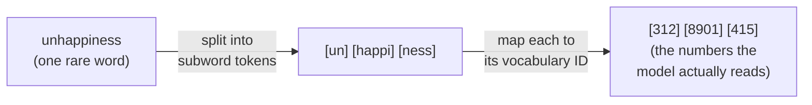

# Tokenization and tokens

## The problem it solves

A model made of numbers cannot read letters. Before any text reaches the network, it has to be turned into numbers — and the first real decision is *what size of chunk gets a number*. That sounds like plumbing, but the choice you make here quietly sets the price of every request, the ceiling on how much the model can read at once, and a whole family of "why did it get *that* wrong?" quirks.

Two obvious options both fail. Give every **whole word** its own number, and you need a dictionary of millions of entries — and the first time a user types a word you didn't dictionary (a typo, a new brand name, a rare medical term), the model has literally never seen it and has no number for it. Go the other way and give every **single character** a number, and your dictionary is tiny and nothing is ever unknown — but now the word "internationalization" is 20 separate pieces, sequences get enormously long, and the model has to relearn from scratch that those letters keep clumping into meaningful units.

Tokenization is the compromise that threads that needle, and the compromise is the whole point of this lesson. The list it works from is the model's **vocabulary** — the fixed set of all the distinct chunks a given model knows how to turn into numbers, decided once before training and then frozen. Each entry has an ID number, a typical modern vocabulary runs roughly 50,000 to 200,000 entries, and everything the model ever reads or writes is assembled out of that fixed set.

## The model reads the way you do

You don't spell out "the" or "because" — you take them in whole, at a glance. But hand you a surname you've never seen — *Zbigniew* — and you can't glance it; you break it into smaller pieces you *do* recognize and sound it out. Two modes, and which one you use depends only on how often you've met the word: whole-shape for the familiar, break-into-familiar-pieces for everything else.

A tokenizer does the identical thing. Watch it segment one sentence:

> My dog Zbigniew loves strawberries.

- **My · dog · loves** — common, so each is a single token, the way you read them in one glance.
- **Zbigniew** — rare, so it shatters into little pieces — the same move you made sounding it out.
- **strawberries** — not rare enough for its own token, not unknown either: it lands in the middle as `straw` + `berries`.

Nobody had to memorize *Zbigniew* to handle it, and the model needed no token for it either: both of you cover an unlimited space of words with a *bounded* set of familiar pieces, falling back to smaller ones whenever a word is unfamiliar. That is the entire trade tokenization exists to win — total coverage at a fixed vocabulary size — and *frequency* is what sorts a word into "known on sight" versus "sound it out." For you it's how often you've read it; for the tokenizer it's how often it appeared in the text the vocabulary was built from.

The same picture explains the model's most notorious quirk. When you read *strawberries* as `straw` + `berries`, you never actually looked at the letters — you caught the two chunks and moved on. Ask yourself how many r's it has without re-reading, and you'll hesitate. The model lives in that spot *permanently*: its smallest visible unit is the chunk, so the individual letters are buried inside tokens it can't easily inspect. "Strawberry has two r's" isn't a reasoning failure — it's the same shape-not-letters reading you just did, and no cleverer prompt reliably fixes a limit that comes from what the model can *see*.

The one line to carry out of here: **the model reads like you do — common words on sight, unfamiliar ones sounded out from smaller pieces — which is exactly why it can handle a word it's never seen, and why it can't reliably count the letters inside one.** The only place the analogy leaks: your reading chunks follow *pronunciation*, but token boundaries follow raw *frequency*, so they often cut mid-syllable — `un` + `happi` + `ness`, not tidy syllables.

## A token is a subword chunk, not a word

Here is the mental correction that matters: **a token is usually a piece of a word, not a whole word.** Common words like "the" or "dog" get their own single token because they show up constantly. Rarer words get split into the frequent fragments they're built from — "tokenization" might come apart as `token` + `ization`, and an unfamiliar surname might break down into three or four little pieces. As a rough rule of thumb for English, one token is about ¾ of a word, so 1,000 tokens is roughly 750 words — but treat that as a loose average, not a law.

The reason this beats both extremes is that it makes the "unknown word" problem disappear *without* exploding the dictionary. There is no word the model can't represent, because in the worst case it can always fall back to smaller and smaller fragments — right down to single characters and even individual bytes. So the vocabulary stays a manageable size, and yet nothing is ever truly out-of-vocabulary. That is the trade the whole scheme is built to win: **coverage of any possible text, at a fixed, affordable vocabulary size.**

> [!NOTE]
> **BPE (Byte-Pair Encoding)** — the most common recipe for *deciding* what the chunks should be. Conceptually: start with individual characters, then scan a huge pile of text and repeatedly merge whichever pair of adjacent pieces occurs most often, over and over, until you hit your target vocabulary size. Frequent sequences like "ing" or "the" get merged into single tokens; rare ones never do and stay in small pieces. You do not need the algorithm — just the intuition: **frequency in the training text decides what earns its own token.** Common gets short, rare gets chopped up.

Note the consequence buried in that last line: what counts as "frequent" depends entirely on *what text the vocabulary was built from* — and that is where the fairness and cost problems come from, below.

## The token is the fundamental unit of cost and of context

This is the single most important thing a product manager takes away, so say it plainly: **the token is the unit models are metered in.** Not words, not characters, not requests. Providers price per token (typically an input rate and a higher output rate), latency scales with how many tokens must be read and generated, and the model's memory limit is expressed as a token budget.

Two neighbouring concepts hang off this and each has its own lesson, so I'll only point at them:

- Once text is tokenized, each token is turned into a vector the model can compute on. That conversion is a separate topic — see [Embeddings](embeddings.md); here, just hold that **tokens are what get embedded.**
- The famous "how much can it read at once" limit is counted in tokens, not words or pages. The limit itself, and how to live within it, is [Context windows](context-windows.md).

The practical reflex to build: whenever someone quotes you a length as words, pages, or characters, silently re-ask it in tokens, because that's the number that appears on the bill and bumps against the limit. A "2,000-word" document isn't 2,000 units of anything the model charges for — it's roughly 2,600 tokens, and that's the figure that matters. For the pricing mechanics in full, see [Cost and unit economics](../production-ops/cost-unit-economics.md).

## Why the same meaning can cost wildly different amounts

If tokens were assigned to *meaning*, the same sentence would cost the same everywhere. They aren't — they're assigned to *frequent character sequences in the training text*, and that training text is overwhelmingly English. So the model's vocabulary spends its budget of "words that earn a single token" mostly on English. Everything else gets chopped into more, smaller pieces.

The result is a genuine, measurable **token tax** on non-English text. The exact same sentence in English might be, say, 10 tokens; in a language written in another script, or a less-represented one, the identical meaning can run to two, three, or more times as many tokens — because the model has to spell it out in little fragments rather than reach for whole-word tokens it never learned. Since you pay per token and the context limit is counted in tokens, users working in those languages pay more and hit the ceiling sooner *for the same content*. That is not a bug in one model; it falls straight out of building the vocabulary from mostly-English text.

This is a fairness issue, not just an accounting one. Because cost and the context limit are both measured in tokens, the token tax means the model is quietly more expensive and more limited for speakers of under-represented languages. A PM shipping a multilingual product should expect per-user costs and truncation behaviour to differ by language, and should measure token counts per locale rather than assuming a single price per message.

**Code has its own version of this.** Source code is dense with punctuation, indentation, and long identifiers, and whitespace and symbols often tokenize inefficiently — so a screenful of code can burn through far more tokens than a screenful of prose. This is why a coding assistant's context fills up faster than a chat assistant's, and why "it forgot the top of the file" happens sooner than people expect.

The sayable framing: **token count, not word count, is what you're billed for and limited by — and token count depends on the language and the content type, not just the meaning.**

## Why tokenization explains the "can't count letters / can't spell" quirks

One of the most reliably confusing model behaviours — miscounting the letters in a word, fumbling to reverse a string, insisting "strawberry" has two r's — traces directly back to tokenization, and being able to explain it is a strong signal you understand what the model actually sees.

The model never sees letters. It sees token IDs. If "strawberry" arrives as a couple of chunks like `straw` + `berry`, the individual letter "r" is not a unit the model has direct access to — it's buried *inside* tokens, below the smallest unit the model can see. Asking it to count the r's is asking it to report on something under its own perceptual grain. It can often get there by reasoning, but it's working against the representation, not with it. The same root cause explains why spelling a word backwards, counting characters, or doing character-level edits are unreliable: those are all letter-level operations on a model whose atoms are subword chunks.

The sharp framing for an interview: **these aren't reasoning failures, they're perceptual ones — the model is being asked about letters when its smallest visible unit is a multi-letter token.** That reframes a "the model is dumb" observation into "the model's input representation doesn't expose that level of detail," which is a very different and more accurate diagnosis.

## Summary / Points to Remember

- A **token is a subword chunk, not a word** — common words are one token, rare words are split into frequent fragments, and in the limit anything can fall back to characters. Rough English average: ~¾ of a word per token (~750 words per 1,000 tokens), but only an average.
- Subword tokenization exists to win one specific trade: **cover any possible text (no unknown words) at a fixed, affordable vocabulary size** — beating both whole-word (dictionary too big, unknowns break it) and single-character (sequences too long) extremes.
- **BPE builds the vocabulary by merging the most frequent character pairs** — so *frequency in the training text*, not meaning, decides what earns a single token.
- **The token is the unit of both cost and context** — you're billed per token and the context limit is counted in tokens, so always re-express words/pages/characters as tokens.
- **The token tax:** because vocabularies are built from mostly-English text, the same meaning costs more tokens in other languages and in code — a real cost and fairness issue, not an accounting rounding error. Measure token counts per locale.
- **Letter-counting and spelling quirks are perceptual, not reasoning, failures** — the model's smallest visible unit is a multi-letter token, so individual letters are buried inside tokens and hard to address directly.

## Interview Questions That Stump People

**Q: "Why don't models just tokenize on whole words? Wouldn't that be simpler and match how people think?"**

**Interviewer:** Splitting words into fragments seems needlessly complicated. Why not give every word its own token?

**You:** Because whole-word tokenization breaks on the first word you didn't anticipate. You'd need a dictionary of millions of entries to cover a language, and the moment a user types a typo, a new product name, or a rare technical term, the model has no token for it — it's genuinely out-of-vocabulary and unrepresentable. Subword tokenization fixes exactly that: common words still get a single token, but anything unfamiliar decomposes into smaller frequent pieces, down to characters if it has to. So you get full coverage of any possible text without an enormous vocabulary. The trap in the question is the word "simpler" — whole-word looks simpler but is actually more brittle; subword is the design that's robust to text you've never seen.

> [!TIP]
> **Why this answer works:** The question smuggles in an assumption — that "matches how people think" is the design goal — and the naive candidate agrees and fumbles for reasons subword is worth the trouble. The strong move is to reject the framing: name the concrete failure mode (out-of-vocabulary words) that whole-word tokenization can't survive, and show subword tokenization exists to *fix a specific brittleness*, not to be clever. Pointing at the loaded word "simpler" signals you can tell apparent simplicity from robustness — the kind of tradeoff reasoning that separates someone who's shipped the thing from someone who's read about it.

---

**Q (clarify-back): "We're getting quoted a per-message price. Is that a reliable way to budget our costs?"**

**Interviewer:** Our vendor conversation is heading toward a rough "cost per message." Good enough to plan around?

**You (clarify back):** It depends on the traffic — are your users mostly writing short English chat messages, or are we talking longer documents, other languages, or code?

**Interviewer:** It's a developer tool, so a lot of it is source code and stack traces, and we have big markets in non-English-speaking countries.

**You:** Then a flat per-message price will mislead you, and probably underbudget. Cost is metered per token, not per message, and both code and non-English text inflate token counts for the same amount of content — code because of punctuation and long identifiers, non-English because the vocabulary is built mostly from English so other languages get chopped into more pieces. So the same "one message" can cost noticeably more in your actual traffic mix than in an English-chat benchmark. I'd budget on measured tokens per request, broken down by language and by code-versus-prose, not on an average message price.

> [!TIP]
> **Why this works:** "Cost per message" has no single reliable answer — it holds only if the content is homogeneous, and falls apart the moment the traffic includes code or non-English text, which inflate tokens for the same visible content. Answering "sure, that's fine" would expose you as someone who thinks the unit of cost is the message; answering "no, never" would be equally wrong for an English-only chat product. Clarifying the traffic mix first pins down the one variable that decides it, signals you know the real meter is the token, and surfaces the token-tax risk before it becomes a budget overrun. Once "source code and non-English markets" is on the table, the per-token, per-locale answer follows directly.

---

**Q: "A user reports that our assistant says 'strawberry' has two r's. Is the model broken, or is this a prompt problem?"**

**Interviewer:** It confidently miscounts letters. What's going on — is it a bad model?

**You:** Neither, really — it's a consequence of tokenization, and it's expected. The model doesn't see letters; it sees tokens, which are multi-letter chunks. "strawberry" likely arrives as something like `straw` + `berry`, so the individual r's are buried inside tokens the model can't easily inspect at the character level. Asking it to count letters is asking about a level of detail below its smallest visible unit. So it's a perceptual limitation from the input representation, not a reasoning defect and not something a cleverer prompt reliably fixes. If character-level accuracy actually matters for the feature, I wouldn't lean on the model's raw output — I'd handle the counting or spelling in ordinary code around it.

> [!TIP]
> **Why this answer works:** The question offers two wrong choices — "broken model" or "prompt problem" — and expects you to pick one. Both point the finger at something fixable by swapping or coaxing the model, and both miss the real cause. Naming tokenization reframes the failure as *perceptual*, not reasoning: the model literally can't see the letters, so no better model tier and no cleverer prompt reliably solves it. That reframing is the signal — you're diagnosing at the level of the input representation, not the level of "the AI is dumb." Closing with "do the counting in code" shows you know when to route around the model instead of demanding it do something its representation can't support.

---

**Q: "If we translate our product into Japanese or Arabic, does anything change about our LLM cost model?"**

**Interviewer:** We're localizing. Same content, other languages. Cost stays roughly the same, right?

**You:** No — and this catches teams out. You pay per token, and the same meaning takes more tokens in most non-English languages because the tokenizer's vocabulary is built overwhelmingly from English text, so other languages and scripts get broken into more, smaller pieces. That "token tax" means higher per-user cost *and* users in those languages hitting the context limit sooner for the same content. So localization isn't cost-neutral. I'd measure actual token counts per locale and factor that into both pricing and the amount of content I try to fit in a single request, rather than assuming English economics carry over.

> [!TIP]
> **Why this answer works:** The interviewer plants the expected answer inside the question — "cost stays roughly the same, right?" — and the weak candidate nods along, because "same content" *sounds* like "same cost." The strong answer contradicts the premise and explains the mechanism: cost is metered in tokens, not meaning, and the vocabulary's English bias makes other scripts tokenize into more pieces. Connecting it to *both* levers it moves — per-user price and the context ceiling — shows you understand the token tax as a systems consequence, not a trivia fact, and "measure per locale" turns the insight into an action a PM would actually take.

---

**Q: "Our retrieval feature works fine in demos but truncates content in production for some customers. Where would you look first?"**

**Interviewer:** We built a feature that pulls in relevant documents and feeds them to the model — a RAG (Retrieval-Augmented Generation) setup, covered in [RAG](../retrieval-knowledge/rag.md). Same code, same documents, but some customers see cut-off answers. First hypothesis?

**You (clarify back):** Are the affected customers concentrated in a particular language, or working with a particular content type like code or heavily formatted data?

**Interviewer:** Now that you mention it — yes, it's mostly our non-English customers.

**You:** Then my first suspicion is token inflation against the context limit. The context window is measured in tokens, and non-English text tokenizes into more tokens for the same visible amount of content, so a chunk of retrieved material that comfortably fits for an English customer can overflow the budget for a non-English one — and gets truncated. It's not that their data is bigger by word count; it's bigger by token count. I'd instrument the actual token counts of the assembled prompt per request and compare across locales before touching anything else.

> [!TIP]
> **Why this works:** "Truncates for some customers" has many plausible causes — a data bug, a size limit, a flaky chunker — so committing to one immediately risks chasing the wrong one. The tell is *some* customers, not all: that pattern points at a variable that differs between them, and language or content type is the prime suspect for token inflation. Clarifying whether the affected customers cluster that way tests the tokenization hypothesis before you spend effort, and signals you understand the context window is a *token* budget — so anything that silently inflates tokens can overflow it even when the word-count looks identical. Once "mostly non-English" comes back, the token-inflation diagnosis and the "instrument tokens per locale" fix follow directly.
