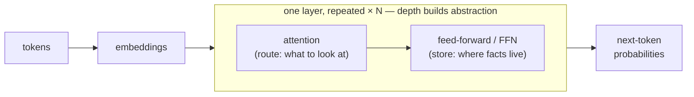

# Transformers

## The problem it solves

By now you have the ingredients. Text becomes [tokens](tokenization.md); tokens become [embeddings](embeddings.md); and [attention](attention.md) lets each token weigh how much every other token matters. But attention is a single operation, not a model. Run once, it can't read a prompt and produce paragraphs of fluent, knowledgeable text. Something has to assemble these pieces into a complete machine — and assemble them in a way that can be scaled up enough to become genuinely capable.

The **transformer** is that architecture. Introduced in the 2017 paper "Attention Is All You Need," it is the blueprint under every modern large language model (GPT, Claude, Gemini, Llama). Its achievement is twofold: it turns the raw attention operation into a full text-processing model, and it does so in a shape that runs efficiently on the hardware AI is trained on — which is what let these models grow from millions to hundreds of billions of parameters. That second part is the real reason the transformer, and not some earlier design, changed the field. To see why, it helps to know what it replaced.

> [!NOTE]
> **RNN / LSTM** — the pre-2017 architectures the transformer replaced; full definitions are in the [ML vocabulary primer](../primers/ml-vocabulary.md). The one property that matters here: an RNN reads **one word at a time** (word 100 waits for word 99), so it **can't be parallelized** — and its successor the LSTM never fixed that. The transformer's ability to process every word at once is exactly what did.

## A whole team reading the sentence at once

Hand the same unfinished sentence — "The capital of France is ___" — to a big room of readers, one posted on each word, all reading at the same instant rather than one after another. A round goes like this: each reader turns to whichever other words matter to theirs, takes in what they say, then adds what they personally know, and privately updates their understanding. Then they do it again — many rounds.

Watch one word. The reader trying to work out what comes after *is* consults *capital* and *France* — the words that matter — and barely glances at *the*. Having pulled those in, they reach into their own knowledge and supply the fact they hold: *France + capital → Paris*. Early rounds settle the easy things (this sentence is asking for a capital city; *France* is the country in play); later rounds compose those into the answer. After enough rounds the room converges on the next word to write: *Paris*.

That one scene carries the three things that make a transformer a transformer: the whole room reads **at once** (every word processed in parallel, not left to right); each reader **consults the relevant others** (that's attention); and each reader then **adds what it personally knows** (that's the feed-forward step — which is exactly why a model's *facts* live there, not in the consulting). One round is one **layer**, and stacking many rounds is what lets the surface readings of the early rounds build into real meaning by the top.

One line to carry out of here: **a transformer is a big team that reads the whole sentence at once and, round after round, each member checks the words that matter and adds what it knows — until the room settles on the next word.** Where the picture leaks: real readers understand what they read; the model is running statistics — extremely good next-word prediction, not comprehension.

## The anatomy: how the pieces become a model

A transformer is a tall **stack of identical layers**, and each layer does two jobs in sequence:

1. **Attention** — the mixing step: each token pulls in relevant information from the other tokens. Think of it as *routing* — deciding what to look at. (The mechanism is [Attention](attention.md); here we just use it.)
2. **Feed-forward network (FFN)** — a small network applied to each token on its own, *after* mixing. If attention is "look around," the FFN is "now think about what I've got." It holds the bulk of the model's parameters, and it is where learned facts actually live.

That division is a genuine talking point: **attention decides what to look at; the feed-forward layers are where the model knows things.** When a model recalls that Paris is the capital of France, that fact sits in feed-forward weights, not in attention. People who assume "attention *is* the model" have it backwards.

Now the part that's easy to miss — **why stack the layers at all?** One layer lets each token gather immediate context. But its output feeds the next layer, which gathers context over tokens that are *already* contextualized, and so on up the stack. Early layers resolve local, surface things (which noun this "it" refers to; whether this word is a verb here); later layers compose those into higher-level meaning (the sentence is sarcastic; this clause contradicts the last paragraph). Depth is how a transformer builds understanding in tiers — simple patterns near the bottom, abstract meaning near the top. More layers means more tiers of abstraction, and that is a big part of what "bigger models are more capable" actually cashes out to.

End to end: tokens come in and become embeddings; they flow up through the stack of attention + FFN layers; the top emits a probability distribution over the next token; one token is chosen, appended to the input, and the whole thing runs again. Generation is that loop, one token at a time.

One catch worth knowing: **positional encoding**. Because all tokens are processed at once rather than in order, the model has *no inherent sense of sequence* — "dog bites man" and "man bites dog" would look identical. So each token's position is stamped onto it before it enters the stack. (It's the answer to a favorite trick question.)

## Why parallelism — not "better memory" — was the real breakthrough

Here's the part most people miss, and it's the commercially important one. Because every token is processed **at the same time** rather than one after another, the math maps perfectly onto GPUs — chips that do thousands of calculations at once (see the [ML vocabulary primer](../primers/ml-vocabulary.md)). RNNs left those chips idle, waiting for the previous word; transformers keep them saturated.

That is why models could grow from millions to hundreds of billions of parameters. The architecture didn't merely understand language better — it *unlocked scale*, and scale is where the surprising abilities (reasoning, coding, translation nobody explicitly trained for) emerged.

So the sharp way to say why transformers were a breakthrough is **not** "attention is clever." It's a chain: **attention made the model parallelizable → parallelizable made it scalable → scale produced the intelligence.** Architecture → scale → capability. Say that sentence and you sound like you understand the field, not just the vocabulary.

## The three flavors, and why the industry picked one

- **Encoder-only** (e.g., BERT): reads a whole input to *understand* it — good for classification and search. Not built to generate text.
- **Decoder-only** (e.g., GPT, Claude): predicts the next token, left to right. This is what "LLM" almost always means today.
- **Encoder-decoder** (e.g., T5, the original translation models): one stack reads the input, a second writes the output.

The field converged on **decoder-only** for general-purpose LLMs because next-token prediction is a single, simple objective that scales cleanly — no separate encoder to train and serve — and chat and instruction-following layer neatly on top. Simplicity that scales beat architectural elegance.

## The cost consequence you can build intuition on

Attention has every token look at every other token, so its cost grows with the **square** of the length — double the input and the attention work roughly **quadruples**. This is the root of why long inputs are slow and expensive (not linearly, but painfully faster than linear), and it's the core economic argument for retrieval — fetching only the few relevant passages instead of paying the quadratic tax on everything. [Attention](attention.md) derives the "why"; [Context windows](context-windows.md) works through the limits. Here, just carry the shape of the curve.

## Summary / Points to Remember
- A transformer is the **architecture that assembles tokens, embeddings, and attention into a working model** — and, crucially, one that could be scaled to the sizes that made modern AI capable.
- The parallelism is the real breakthrough — say it as a chain: **architecture → scale → capability.** Processing every token at once fit GPUs, which enabled scale, which produced the intelligence.
- Each layer = **attention (routing — what to look at)** + **feed-forward (storage — where facts live).** Knowledge sits in the feed-forward weights.
- **Depth does real work:** stacked layers build understanding in tiers — surface patterns low, abstract meaning high. More layers, more abstraction.
- Transformers have **no built-in sense of word order**; positional encoding supplies it.
- Attention cost is **quadratic** in input length — the reason long inputs are costly and the economic case for retrieval.
- **Decoder-only** won for general LLMs because next-token prediction is one simple objective that scales.

## Interview Questions That Stump People

**Q: "Why were transformers a breakthrough?"**

**Interviewer:** In your own words — why were transformers such a big deal?
**You:** The trap answer is "because of attention." The real reason is what attention *enabled*: because every word is processed in parallel instead of one at a time, the architecture fit GPUs, which made it scalable, and scale is what produced the emergent capabilities. So I'd frame it as a chain — architecture to scale to capability — rather than pointing at one clever mechanism. Attention was necessary, but the parallelism it allowed is what changed the trajectory.

> [!TIP]
> **Why this answer works:** Almost everyone names the mechanism ("attention") and stops, which sounds like a repeated headline. Giving the *causal chain* — parallelism → scale → capability — shows you understand why the mechanism mattered commercially, not just that it exists, and it opens the door to talk about scaling laws and cost if they probe. You're demonstrating that you know the *consequence*, which is what a PM is actually paid to reason about.

---

**Q (clarify-back): "Our LLM feature is slow and expensive on long documents — architecturally, where's that cost coming from?"**

**Interviewer:** We've got a feature that summarizes long documents and it's slow and pricey. Where's the cost, architecturally?

**You (clarify back):** Is the pain on the *input* side — feeding in the long document — or the *output* side, generating a long response?

**Interviewer:** The inputs are huge; the summaries we want back are short.

**You:** Then it's the attention cost, and it's quadratic in input length — doubling the document roughly quadruples the attention work, so a very long input is disproportionately expensive and slow. The architectural fixes are to stop sending the whole thing: retrieve only the relevant sections, or pre-summarize in chunks. If the pain had been long *outputs*, it'd be a different story — that's a linear per-token generation cost, and you'd attack it by making responses shorter or streaming them.

> [!TIP]
> **Why this works:** "Where's the cost" has two completely different answers depending on whether the length is in the input or the output, so answering immediately risks solving the wrong half. Asking which one signals you know the transformer's cost isn't one uniform thing — long inputs hit quadratic attention, long outputs hit linear generation — instead of reciting a generic "LLMs are expensive." Once they say the inputs are huge, the quadratic-attention answer and its fixes (retrieve, chunk) follow directly.

---

**Q: "Where does an LLM's knowledge actually live?"**

**Interviewer:** When a model recalls a fact, where in the architecture is that stored?
**You:** Mostly in the feed-forward layers, not in attention. Attention routes information — it decides which words to pull context from — but the learned facts sit in the feed-forward weights, which hold the bulk of the parameters. It's a distinction that trips people up, because attention gets all the press, so they assume that's where the "knowing" happens.

> [!TIP]
> **Why this answer works:** The question is a trap baited with the word everyone associates with transformers — "attention." Correctly separating *routing* (attention) from *storage* (feed-forward) proves you understand the architecture rather than the buzzword, and it's the foundation for a harder follow-up you may want to invite: why fine-tuning changes behavior more reliably than it adds facts, since facts live in those dense feed-forward weights.

---

**Q: "A transformer processes all its words at once — so how does it know word order?"**

**Interviewer:** If there's no left-to-right reading, how does it tell "dog bites man" from "man bites dog"?
**You:** It doesn't, on its own — with pure attention, a sentence would be treated like a bag of words. Order is injected explicitly through positional encoding, which stamps each word with its position before it enters the stack. Being able to name that is usually the tell that someone has looked past the surface.

> [!TIP]
> **Why this answer works:** This one rewards a single specific term. Many candidates hand-wave ("the model just learns order"), which is wrong — parallel processing genuinely destroys order, and something has to put it back. Naming *positional encoding* and *why* it's needed (parallelism removes sequence) shows you understand the tradeoff the architecture made, not just its parts. Precision on a small mechanism is a strong credibility signal.

---

**Q: "Why did decoder-only models win over encoder-decoder for general LLMs?"**

**Interviewer:** The original transformer was encoder-decoder. Why is nearly every big LLM today decoder-only?
**You:** Because next-token prediction is one simple objective that scales beautifully — there's no separate encoder to train and serve, and instruction-following and chat layer on top cleanly. Encoder-decoder is elegant for translation-style tasks with a clear input-to-output mapping, but for a general model that just needs to continue text, the decoder-only setup is simpler and scales better. It's a case of the simpler design winning because it scaled, not because it was more sophisticated.

> [!TIP]
> **Why this answer works:** The question tempts you to list architectural differences. The strong answer reframes it as a *scaling* decision — the winner was chosen because one simple objective scales cheaply, not because it was more capable in principle. That "simplicity that scales beats elegance" lens is a recurring theme in AI systems, so demonstrating it here signals you think about why the industry converges, not just what the boxes are.
