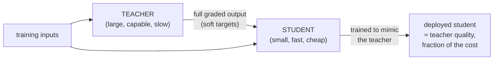
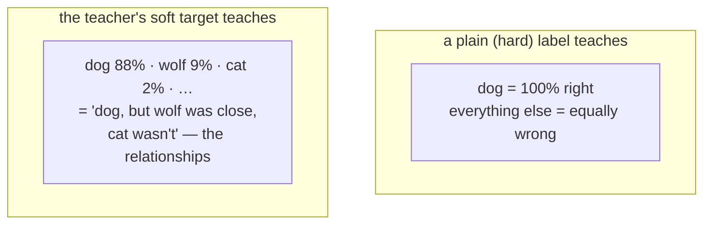

# Distillation (knowledge distillation)

## The problem it solves

You have a model that's genuinely good — it reasons well, handles edge cases, delights users. It's also large, which means every single request is slow and expensive to serve, and it won't fit on a phone, a browser, or a modest server at all. From [Transformers](../foundations/transformers.md) you know why: capability came from scale, and scale is exactly what makes a model costly to run on every inference. So you're stuck between two bad options. Serve the big model and eat the latency and the bill on every call. Or train a small model from scratch and watch it come out noticeably dumber, because a small model learning cold from raw data simply doesn't reach the same quality.

Distillation is the way out of that bind. Instead of throwing the small model at the raw training data alone, you let it **learn from the big model directly** — you use the big, capable model as a *teacher* and train a small *student* to imitate it. The student ends up far better than a small model trained the ordinary way, capturing much of the teacher's capability at a fraction of the size, cost, and latency. That is why a great many of the small, fast models shipped in production today are not trained in isolation at all — they are **distilled from a larger sibling.** The "mini," "flash," "lite," or "small" version of a model family is frequently a student of the flagship.

The catch, which the rest of this lesson keeps returning to: a student rarely *fully* matches its teacher — and where it falls short is precisely on the hardest cases. You are trading a slice of top-end quality for a large win in cost and speed.

## The one analogy to remember

**The picture:** A master sommelier training an apprentice. Handed a glass, the master doesn't just say "Cabernet." She says: "About seventy percent Cabernet — but there's enough Merlot character that I wouldn't rule it out, and it's definitely *not* a Pinot." The apprentice, hearing that graded judgment over thousands of glasses, ends up nearly as sharp as the master — and works for a fraction of the fee.

**The mapping:** the master = the large teacher model; the apprentice = the small student model; the master's confident one-word answer "Cabernet" = a plain, "hard" label; the *graded* judgment ("70% Cabernet, hint of Merlot, not Pinot") = the teacher's full answer distribution, the "soft" target; the apprentice ending up nearly as good but far cheaper to employ = the distilled student.

**Why it holds:** the load-bearing idea is that the master's *uncertainty across the near-misses* is real information — it tells the apprentice which wines resemble which, something a flat one-word label throws away. Distillation's whole trick is to train the student on that full graded distribution rather than on bare right answers, precisely because the graded version carries more signal. The analogy is faithful because it reproduces the actual mechanism, not just the vibe of mentorship.

**Say it like this:** "Distillation is a master teaching an apprentice not just the right answer, but how sure to be and what the close calls are — so the apprentice learns to think like the master at a fraction of the cost."

*Where it breaks:* a human apprentice can eventually surpass the master; a distilled student is *capped* by its teacher and rarely fully matches it, especially on the hardest glasses. Don't let the mentorship image suggest the student can outgrow the teacher.

## Teacher and student: what's actually happening

Strip it to the two roles. The **teacher** is the big, already-capable model — usually a flagship you (or your provider) already trained and trust. The **student** is a smaller model, with far fewer [parameters](../primers/ml-vocabulary.md) (the numbers inside a model that hold what it learned; fewer means cheaper and faster to run, but less raw capacity). Distillation is the training process that transfers as much of the teacher's behavior as possible into the student.

The naive way to make a small model is to train it directly on your dataset — feed it inputs and the correct answers, the "hard labels." Distillation adds a better source of supervision: instead of *only* the right answer, the student also gets to see **what the teacher thought** — the teacher's full output for each input. The student's goal shifts from "produce the correct answer" to "reproduce the teacher's judgment." That richer target is the entire reason distillation beats training the small model alone.

## Why the teacher's "soft" answer carries more signal than a plain label

This is the conceptual heart of the lesson, so it's worth slowing down on. When a model answers, it doesn't secretly hold one answer — it produces a **distribution**: a probability spread across all the possibilities. Ask a model to classify an animal photo and it might come out as 88% dog, 9% wolf, 2% cat, and a long tail of near-zero everything else. The single answer "dog" is just the top of that spread.

A plain training label says only "dog" — one right answer, everything else equally wrong. But the teacher's *full* distribution says something much richer: dog, yes, but *wolf was a real contender and cat basically wasn't.* That encodes the teacher's hard-won sense of **how the possibilities relate to each other** — which things are easily confused, which are miles apart. This extra information hiding in the teacher's confidence spread is sometimes called **dark knowledge**: knowledge that's invisible in the bare label but present in the graded judgment.

Training the student to match that whole spread — not just the winning answer — is what lets a small model punch above its weight. It's being taught not only *what* the answer is but *the shape of the teacher's reasoning around it*, which is far more than a raw dataset of right answers could ever convey. That's the sommelier's "70% Cabernet, hint of Merlot, not Pinot" made literal.

> [!NOTE]
> **Soft targets / soft labels** — the teacher's full probability distribution over possible outputs, used as the training signal, as opposed to a **hard label** (a single designated right answer). "Soft" because it's a graded spread of confidences rather than a hard yes/no. This is the classic mechanism from the original distillation work; you don't need the math, just the intuition that a spread of confidences teaches more than a lone right answer.

**One honest wrinkle for large generative models.** The clean "match the full distribution" picture is the textbook mechanism, and it's exactly right for classifiers. For today's large language models, distillation *often* takes a related but simpler form: you have the teacher generate lots of high-quality outputs — answers, explanations, worked reasoning — and train the student on that generated material. Both approaches share the same principle (learn from the teacher's rich output, not just bare labels), and real systems mix them. So when someone says "we distilled it," the precise recipe varies; what's constant is *a strong teacher supplying the training signal for a weaker student.* Don't assert one specific technique as if it's the only one.

## How this differs from quantization — the other way to shrink a model

These two get confused constantly, and keeping them straight is a quick credibility win. Both aim at the same goal — a cheaper, faster model — but they do fundamentally different things:

- **Distillation makes a *new, smaller* model.** The student has a different, smaller architecture; it's a separate model that learned to imitate the teacher. You end up with fewer parameters.
- **[Quantization](quantization.md) compresses the *same* model.** It keeps the model's structure and parameter count but stores each number at lower precision (roughly, fewer decimal places), so the same model takes less memory and runs faster.

The sharp one-liner: **distillation trains a smaller model; quantization shrinks the model you already have.** They're not rivals — you frequently do both, distilling to a smaller student and then quantizing that student. How quantization actually works, and its own tradeoffs, are its lesson — [Quantization](quantization.md); here just hold the contrast.

Both of these sit inside the broader toolkit of making models cheap to run in production; see [Inference optimization](../production-ops/inference-optimization.md) for how they fit alongside the serving-side tricks.

## The tradeoff and the failure mode: the student is capped, and the ceiling shows at the hard cases

Here is the framing to walk in with. **A distilled student rarely fully matches its teacher, and the gap concentrates in the hardest cases.** On the bulk of ordinary inputs the student keeps up beautifully — that's why distillation is worth doing. But on the rare, subtle, edge-of-competence inputs, the small model's limited capacity shows, and it's exactly those inputs where the teacher's advantage was largest. You bought a big cost-and-latency saving by giving up a slice of top-end quality, and that slice is not distributed evenly — it's bunched at the difficult end.

Two consequences a PM should carry:

- **The student is bounded by the teacher.** Distillation transfers capability; it doesn't create it. A student can't reliably exceed a teacher on the teacher's own strengths, because its entire target *is* the teacher. If the teacher is wrong or biased, the student inherits that too. (Contrast [fine-tuning](fine-tuning.md), which adapts a model's behavior using target examples — a different lever with a different purpose; distillation is about compressing capability into a smaller model, not specializing behavior.)
- **Your evaluation set can hide the gap.** If you measure the student on average-difficulty inputs, it'll look nearly as good as the teacher and you'll ship it happily — then real users hit the hard tail and complain. The failure is often invisible on a benign benchmark and only visible on the difficult slice, which is why distilled models must be evaluated *on the hard cases specifically*, not just on aggregate accuracy.

The sayable version: **distillation is a quality-for-cost trade, and you pay the quality on the hardest inputs — so the whole game is deciding whether that top-end slice matters for your product, and measuring where it actually hurts.**

## Where it shows up in your product decisions

The practical reason a PM cares: distillation is often *why a cheap model option even exists.* When a provider offers a small, fast, inexpensive model next to its flagship, that small model is frequently a distilled student of the big one — which is how it manages to be far cheaper yet still surprisingly capable. That reframes the "which model tier do I pick?" decision: the cheap tier isn't a crippled toy, it's a student that inherited a lot from the flagship but gave up the hard-case top end. Choosing it is choosing that trade knowingly.

And if you're building your own models rather than buying, distillation is the standard move for getting a serving-cost or on-device version of a capability you've already proven in a large model — you demonstrate it works big, then distill it small enough to ship.

## Summary / Points to Remember

- **Distillation trains a small "student" model to imitate a large "teacher" model**, capturing much of the teacher's capability at a fraction of the size, cost, and latency — the fix for "the good model is too slow and expensive to serve."
- The core insight: the student learns from the teacher's **full graded output (soft targets), not just the right answer.** That spread of confidences — "dog, but wolf was close" — carries relationship information ("dark knowledge") a bare label throws away, which is why a distilled small model beats one trained on raw labels alone.
- **Distillation vs. [quantization](quantization.md), said cleanly:** distillation makes a *new smaller* model; quantization *compresses the same* model. Not rivals — often done together.
- **The failure mode: the student is capped by the teacher and the gap shows up on the hardest cases.** Bulk inputs stay near-teacher quality; rare, subtle inputs expose the small model's limited capacity. It's a quality-for-cost trade, and you pay the quality at the difficult end.
- **Evaluate distilled models on the hard slice, not aggregate accuracy** — the gap is often invisible on an easy benchmark and only bites on the tail real users find.
- **Many production "mini/flash/lite" models are distilled siblings of a flagship** — so the cheap tier is a student that inherited a lot but gave up the top-end, not a separate toy model. Picking it is picking that trade on purpose.

## Interview Questions That Stump People

**Q (clarify-back): "Our flagship model is too expensive to serve at scale. Should we distill a smaller version to cut costs?"**

**Interviewer:** We're serving a big model and the inference bill is brutal. Should we distill it down to something cheaper?

**You (clarify back):** Maybe — but first, how much does top-end quality on your *hardest* requests matter to the product, and do you already have a strong version of that model to act as the teacher?

**Interviewer:** We have the big model already, and honestly most of our traffic is routine — but a small fraction of requests are genuinely hard and those are the ones customers judge us on.

**You:** Then distillation is promising but risky in exactly the wrong spot. A student would handle your routine bulk at a fraction of the cost — big win. But the quality you give up concentrates on the hard cases, and you just told me the hard cases are what customers judge you on. So I wouldn't distill blindly. I'd distill, then evaluate the student *specifically on that hard slice*, and quite possibly route: send routine traffic to the cheap student and reserve the expensive teacher for the requests that are actually difficult. That captures most of the savings without surrendering the quality where it counts. If your traffic had been uniformly easy, I'd distill everything without hesitation.

> [!TIP]
> **Why this works:** "Should we distill to cut cost?" has no universal answer — it hinges on whether the top-end quality you'd sacrifice actually matters, because distillation's quality loss is not spread evenly, it's bunched at the hard cases. Answering "yes, distill" immediately would expose you as someone who knows the cost benefit but not the failure mode. Clarifying where quality matters pins down the deciding variable and signals you know the gap lives at the difficult tail; once "the hard cases are what we're judged on" is on the table, the nuanced answer — distill plus route, and evaluate on the hard slice — follows directly.

---

**Q: "If you want a smaller model, why bother with a teacher at all? Why not just train the small model on the same data?"**

**Interviewer:** Distillation seems like a detour. You already have the training data — why not train the small model on it directly and skip the teacher?

**You:** Because the teacher gives the student a much richer signal than the raw data does. Raw data has hard labels — one right answer per example, everything else equally wrong. The teacher, for each input, produces a full distribution: not just "the answer is dog" but "dog, and wolf was a real contender, and cat basically wasn't." That spread encodes how the possibilities relate — what's easily confused, what's far apart — which is knowledge a bare label simply doesn't contain. A small model trained on hard labels alone has to rediscover all that from scratch with limited capacity, and it comes out worse. Training it to match the teacher's graded judgment is like giving it the teacher's intuition, not just an answer key — that's why the distilled version consistently beats the same small model trained directly.

> [!TIP]
> **Why this answer works:** The question sounds reasonable and traps people who think distillation is just "copy the teacher's answers" — if that were all it was, training on the data directly *would* be equivalent. The strong move is to name the specific thing the teacher adds that the data doesn't: the full confidence distribution, the relationships between options, the "dark knowledge." Explaining *why* that extra signal helps a capacity-limited small model shows you understand the mechanism, not just the recipe, which is exactly what this question is built to test.

---

**Q: "Isn't distillation the same as quantization? They both make the model cheaper to run."**

**Interviewer:** We keep hearing distillation and quantization used interchangeably for shrinking models. Same thing?

**You:** No — same goal, different mechanism, and it's worth being precise. Distillation produces a *new, smaller* model: a student with fewer parameters that was trained to imitate a large teacher. Quantization keeps the *same* model — same architecture, same parameter count — but stores each number at lower precision, so it takes less memory and runs faster. One trains a smaller thing; the other compresses the thing you already have. They're complementary, not competing: a common move is to distill down to a small student and then quantize *that* student for even more savings. Conflating them usually means someone's heard both words but hasn't run either.

> [!TIP]
> **Why this answer works:** These two are genuinely easy to confuse because they share an outcome, so a crisp mechanistic distinction — "new smaller model" vs. "compress the same model" — is a fast, high-signal credibility marker. Adding that they stack (distill then quantize) shows you understand them as tools in one toolkit rather than an either/or, which is how a practitioner actually thinks about the cost problem.

---

**Q: "Can a distilled student ever be better than its teacher?"**

**Interviewer:** We distilled a student and someone's now hoping it'll outperform the teacher it learned from. Realistic?

**You:** Not on the teacher's own strengths, no — and that's the honest ceiling to set expectations around. The student's entire training target *is* the teacher, so it inherits the teacher's capability *and* its mistakes and biases; it can't reliably conjure competence the teacher never had. It'll typically land somewhere below the teacher, with the gap concentrated on the hardest inputs where the teacher's edge was largest. There are narrow exceptions — a student focused on one domain can sometimes look sharper *there* than a sprawling generalist teacher, and a smaller model can be more consistent simply by being less erratic — but "the student beats the teacher across the board" isn't how to plan. The realistic frame is: near-teacher quality on the bulk of traffic, cheaper and faster, with a known shortfall on the hard tail.

> [!TIP]
> **Why this answer works:** The naive hope is that distillation is a free upgrade; the strong answer sets the ceiling honestly — the student is bounded by the teacher because the teacher *is* its target — while still acknowledging the genuine narrow exceptions rather than overclaiming a hard rule. Refusing to promise "better than the teacher" and explaining *why* (the target caps it) signals you understand what distillation transfers versus creates, and it manages a stakeholder's expectations before they ship on a false premise.

---

**Q: "Our distilled model matches the teacher on our eval set. We're safe to ship, right?"**

**Interviewer:** The student scores basically the same as the teacher on our benchmark. Good to go?

**You:** I'd want to know what's *in* that benchmark before I sign off, because distillation's quality loss doesn't spread evenly — it concentrates on the hardest cases. If your eval set is mostly average-difficulty inputs, the student will look nearly identical to the teacher there and still fall down on the difficult tail your benchmark under-represents. That's the classic way a distilled model passes review and then disappoints in production: the gap was real but invisible on a benign eval. So before shipping I'd build or carve out a hard-case slice — the subtle, edge-of-competence inputs — and compare student to teacher *specifically on that*. If it holds up there too, then I'm comfortable. Matching on aggregate accuracy alone isn't evidence of safety; it's often evidence the eval is too easy.

> [!TIP]
> **Why this answer works:** The question invites a confident "ship it," and taking the bait shows you don't know where distillation fails. The strong move is to interrogate the eval rather than trust the score — because the failure mode (loss concentrated at the hard tail) is precisely the thing an easy benchmark hides. Insisting on a hard-case evaluation demonstrates you understand *where* the student-teacher gap lives and turns that understanding into the concrete check a PM would actually run before release.
</content>
</invoke>
