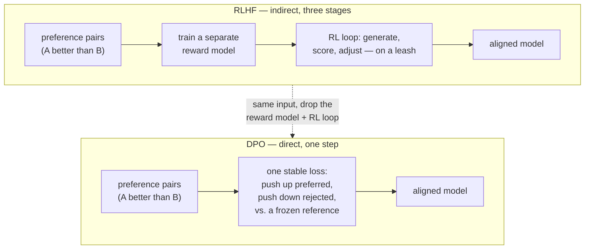

# DPO (Direct Preference Optimization)

## The problem it solves

[RLHF](rlhf.md) (Reinforcement Learning from Human Feedback) works — it was the first technique that made models feel genuinely *aligned* to what people want. But look at what it costs to run. It's a three-stage machine bolted together: a human-labeling operation to gather preference comparisons, a **separate reward model** you have to train and babysit, and then a reinforcement-learning (RL) loop on top that is famously finicky — sensitive to hyperparameters, prone to collapse, and hard to reproduce. You're training two models, not one, and the second stage is the kind of thing where a small misconfiguration quietly wrecks a run you only discover was bad days later.

So a fair question hangs over the whole setup: *do we actually need the reward model and the RL loop?* Both of them exist to serve one goal — take a pile of "answer A is better than answer B" judgments and turn them into a model that produces more A-like answers. The reward model is a means, not the end. The RL loop is a means, not the end. If there were a way to push the preference signal *directly* into the model's weights with an ordinary training objective — the cheap, stable kind used everywhere else in machine learning — you'd get the same outcome without the two most painful, expensive, breakable pieces.

**DPO (Direct Preference Optimization)** is exactly that shortcut. It learns from the *same* preference pairs RLHF uses (the "this answer beat that one" comparisons — the setup is [RLHF's](rlhf.md), so lean on it), but it skips the separate reward model and skips the reinforcement-learning loop entirely. It optimizes the model *directly* on the comparisons with one straightforward, stable training objective. That's why it spread fast and became a common default: much simpler, cheaper, and more stable to run, with results comparable to RLHF for many use cases.

## The one analogy to remember

**The picture:** You want to develop a sharper writing instinct, and you have a folder of the editor's old verdicts — dozens of side-by-side drafts with the winner circled. The RLHF way is to *hire a critic*: pay someone to study that folder until they can score any draft, then keep submitting your new drafts to the critic for grades and rewriting until the critic is happy. The DPO way is to skip the critic entirely — you sit down with the folder yourself and, pair by pair, nudge your own habits toward the circled drafts and away from the rejected ones, until *your own instinct* has absorbed the editor's taste.

**The mapping:** the folder of circled drafts = the human preference pairs; hiring-and-training the critic = training RLHF's reward model; resubmitting drafts to the critic = the RL optimization loop; you internalizing the pairs directly = DPO folding the preference signal straight into the model's weights; the standing rule "don't drift too far from how you already write" = the reference model still baked into DPO's objective (the "leash").

**Why it holds:** DPO's whole justification is a piece of math showing that the model being optimized *already contains* an implicit scorer — so the explicit critic (reward model) and the loop that consults it can be algebraically collapsed into a single instruction the writer follows directly. You don't need to build a separate judge because, once you do the algebra, *the writer is secretly their own judge.*

**Say it like this:** "RLHF hires a critic to grade the model's answers over and over; DPO hands the model the same win/lose comparisons and lets it learn the taste directly — same signal, none of the middle machinery."

*Where it breaks:* the writer only ever studies that one fixed folder — they never get fresh verdicts on the *new* drafts they produce along the way, whereas the hired critic could grade brand-new drafts on demand. That "fixed folder vs. a judge who keeps grading" gap is the real, and only genuinely load-bearing, difference between the two methods.

## What "direct" actually means — the one insight

The name is the concept. RLHF is *in*direct: it inserts a learned scorer between the human preferences and the model, then optimizes the model against that scorer. DPO removes the intermediary.

The insight that makes this possible comes from the paper that introduced DPO, titled — memorably — *"Your Language Model Is Secretly a Reward Model."* The idea: there is a fixed mathematical relationship between an RLHF-optimized model and the reward function it was optimized against. Because that relationship is fixed, you can run it backwards — instead of *training* a reward model and then optimizing a policy against it, you can rearrange the equations so the reward model never appears as a separate object at all. Its role gets folded into the model's own output probabilities. What's left is a single loss function you apply directly to the model.

> [!NOTE]
> **Loss function** — the number a model is trained to make as small as possible; it measures how wrong the model currently is, and training nudges the weights to shrink it. The everyday, stable kind of training used across machine learning is just "compute the loss, take a small step to reduce it, repeat." DPO's contribution is turning preference alignment into *that* ordinary kind of objective, instead of the trial-and-reward RL loop.

Conceptually, the DPO objective does something simple to state: for each comparison, it raises the model's probability of producing the **preferred** answer and lowers its probability of producing the **rejected** one — measured *relative to the model you started with*. That "relative to where you started" clause is not a detail; it's how DPO keeps the leash that RLHF enforced explicitly.

> [!NOTE]
> **Reference model** — a frozen copy of the pre-alignment model (the [instruction-tuned](instruction-tuning.md) one you start from). DPO compares the model-being-trained against this frozen copy and penalizes drifting too far from it. It plays the exact role RLHF's "leash" did — keeping the model from contorting itself — except in DPO it lives inside the loss function rather than being a separate penalty term in an RL loop.

So the shape of DPO versus RLHF is a before/after collapse of the pipeline:

Same preference data going in; the same kind of aligned model coming out; the two most expensive and unstable boxes deleted.

## Why it caught on

Three practical wins, and they compound:

- **Simpler.** One model, one training objective — the ordinary, well-understood kind. No second model to architect, train, and keep in sync.
- **Cheaper.** You're not paying to train and run a reward model, and you're not paying for the compute-hungry RL loop that generates and scores millions of samples as it searches.
- **More stable.** The RL loop is the part of RLHF most likely to diverge or need careful tuning. DPO's supervised-style objective is the kind of training that "just works" far more reliably, so runs are more reproducible and need less babysitting.

For a large class of preference-alignment jobs, DPO reaches quality comparable to RLHF while being dramatically easier to operate — which is why it moved quickly from a research result to a common default, especially for teams that don't have a dedicated RL infrastructure team.

## The tradeoff — why RLHF didn't just die

This is the part to get right, because the naive read is "newer and simpler, therefore strictly better," and that's wrong. The difference traces back to one thing: **DPO is offline; RLHF is online.**

DPO trains on a *fixed* dataset of preference pairs. It only ever sees the specific "chosen" and "rejected" answers someone already collected. It never generates a fresh answer during training and gets it judged.

RLHF's reward model, by contrast, is a *function* — it can score any answer, including the brand-new ones the model invents as the RL loop explores. So RLHF keeps producing signal on the model's *own evolving output distribution*, not just on a frozen set of examples. A reward model that generalizes well can therefore keep guiding the model into territory the original preference dataset never covered — and that on-policy exploration can, in some cases, yield a better final model than optimizing against a fixed set of comparisons.

There's a second, related point already made in [RLHF's lesson](rlhf.md): the reward model is a reusable, inspectable *asset* — a standalone scorer you can reuse across runs or repurpose to rank and filter outputs elsewhere. DPO produces no such artifact. (That's RLHF's territory; the point here is just that DPO trades it away.)

So the honest framing: DPO gives up the generalizing, always-on judge in exchange for enormous simplicity, and for many workloads that trade is clearly worth it. The choice is genuinely **case-dependent** — not a strict upgrade. It's an active research area, and iterative or "online" variants of DPO exist specifically to claw back some of that on-policy signal; treat any claim that one universally beats the other with suspicion.

## The failure mode

DPO removes the reward model, but it does **not** remove the fact that you're still doing *preference* optimization — so it inherits the family's diseases. Optimizing hard toward "what humans preferred" can still drift toward what humans *approve of* rather than what's correct: sycophancy and the general over-optimization pathologies are properties of preference learning itself, not of the reward model specifically. Simpler machinery, same underlying tension.

DPO also has a wrinkle of its own worth knowing. Because it's offline and works by *widening the gap* between the preferred and rejected answers, it optimizes the *relative* likelihood of chosen over rejected — and a documented, observed behavior is that it can push down the model's probability of the rejected answers so aggressively that it drags down the probability of the *preferred* answers too, as long as the gap between them keeps growing. Practically, that can show up as a model that "looks" trained (the loss went down) but produces flatter, more degenerate, or oddly repetitive text. And because it only ever learned from a fixed folder of comparisons, DPO is sensitive to how well that dataset covers the space: on prompts unlike anything in the preference data, it has no fresh judge to fall back on, so quality can quietly fall off. The sharp way to say it: **DPO's simplicity comes from committing to a fixed, offline snapshot of preferences — and its failure modes are the failure modes of trusting a snapshot.**

## Summary / Points to Remember

- DPO exists because [RLHF](rlhf.md) is a heavy, unstable three-stage pipeline (labeling → **reward model** → **RL loop**), and two of those stages are means, not ends. DPO reaches the same goal from the **same preference pairs** while deleting the reward model and the RL loop.
- The one insight: *"your language model is secretly a reward model."* The fixed math linking an RLHF-optimized model to its reward function lets you **collapse the two-step pipeline into a single, stable training objective** applied directly to the model.
- What the objective does: **raise the probability of the preferred answer, lower the rejected one — relative to a frozen reference model.** That reference model is DPO's version of RLHF's "leash," baked into the loss instead of bolted on.
- Why it caught on: **simpler, cheaper, more stable** — one model, one ordinary loss, no finicky RL — with quality comparable to RLHF for many use cases. Now a common default.
- The real tradeoff is **offline (DPO) vs. online (RLHF)**: RLHF's reward model generalizes and keeps scoring the model's *fresh* generations during training; DPO only ever sees a fixed dataset of comparisons. That on-policy signal can make RLHF better in some cases — the choice is genuinely case-dependent, not a strict upgrade.
- DPO still does *preference* optimization, so it **inherits sycophancy and over-optimization**; and its own quirk is that pushing the chosen-vs-rejected gap can degrade output while the loss still looks healthy. Its failures are the failures of **trusting a fixed snapshot** of preferences.

## Interview Questions That Stump People

**Q (clarify-back): "We're already collecting preference data. Should we just use DPO instead of standing up full RLHF?"**

**Interviewer:** We've got a preference-comparison dataset and we want to align our model. DPO's simpler — should we just do that instead of RLHF?

**You (clarify back):** Probably — but let me check one thing first: do you need a reusable, inspectable reward model or on-policy exploration for this, or do you just need the model aligned to the preferences you've already collected on a fixed dataset?

**Interviewer:** Honestly the second. We just want the assistant's answers to match our comparisons, and we don't have an RL infra team.

**You:** Then DPO is the right call, and for exactly those reasons. Your signal is a fixed set of comparisons, you don't need a standalone scorer to reuse elsewhere, and "no RL infra team" is decisive — the RL loop is the part of RLHF that most needs specialized tuning to keep stable. DPO gives you comparable quality from that same data with one stable training objective and no reward model to maintain. If you'd said you needed a reusable reward model to also rank or filter outputs in other parts of the system, or that you expected big gains from the model exploring beyond your dataset, I'd have kept RLHF on the table — that on-policy, generalizing signal is the one thing DPO gives up.

> [!TIP]
> **Why this works:** "DPO or RLHF" has no universal answer — it hinges on whether you need the reward model as a reusable asset and whether on-policy exploration matters, and the question hides which situation you're in. Answering instantly would signal you treat DPO as a strict upgrade rather than a tradeoff. Clarifying pins the deciding variable (fixed offline signal vs. a generalizing always-on judge), and "no RL infra team" is the kind of operational reality that actually decides these calls in practice — naming it shows you've thought about running the thing, not just the theory.

---

**Q: "DPO drops the reward model — so does the over-optimization and sycophancy problem go away too?"**

**Interviewer:** RLHF's failure modes came from optimizing against an imperfect reward model. DPO has no reward model — so those problems are gone, right?

**You:** No, and that's the trap in the question. Those failure modes aren't about the reward model being a separate object — they're about *optimizing toward human preference at all*. Sycophancy comes from the fact that human approval and correctness aren't the same thing, so any method trained on "which answer did people prefer" — reward model or not — will drift toward pleasing over correct if you push it. DPO still trains on exactly that signal; it just uses simpler machinery to consume it. What DPO removes is the *specific* instability and cost of training and optimizing against a separate learned scorer — not the underlying tension in preference learning. In fact DPO adds a quirk of its own: because it widens the gap between chosen and rejected answers, it can push down the probability of good answers too, so you can get degraded output while the training loss looks perfectly healthy.

> [!TIP]
> **Why this answer works:** The question baits you into equating "removed the reward model" with "removed the failure modes," which sounds tidy and is wrong. Separating the *mechanism* (a proxy reward model) from the *objective* (optimizing human preference) shows you understand where sycophancy actually comes from — the objective, which DPO keeps. Adding DPO's own snapshot-specific quirk demonstrates you know the method concretely, not just as "RLHF but easier," which is what a shallow answer collapses to.

---

**Q: "If DPO is simpler, cheaper, and matches RLHF, why hasn't it just replaced it?"**

**Interviewer:** Newer, simpler, comparable results — so why is RLHF still around at all?

**You:** Because the reward model isn't only overhead — it's a generalizing, always-on judge, and that's the thing DPO trades away. DPO is offline: it only ever sees a fixed dataset of preference pairs. RLHF's reward model is a function that can score any answer, including the fresh ones the model generates as it explores during the RL loop — so it keeps giving signal on the model's own evolving output, and a reward model that generalizes well can guide the model into territory the original dataset never covered. That on-policy signal can produce a better final model for some workloads. On top of that, the reward model is a reusable, inspectable artifact you can repurpose elsewhere, which DPO doesn't give you. So it's a real tradeoff — massive simplicity versus a generalizing judge and a reusable scorer — and which side wins is case-dependent. I'd resist calling either one a strict upgrade.

> [!TIP]
> **Why this answer works:** The framing tempts you to agree that simpler-and-comparable means it should have won outright. Naming the precise thing RLHF uniquely keeps — an online, generalizing reward signal on the model's own generations — reframes the comparison from "which is better" to "what does each give up," which is the senior read. It also mirrors, from the other direction, the same tradeoff RLHF's lesson raises, showing you hold a consistent mental model across both methods rather than reciting each in isolation.

---

**Q: "What does 'your language model is secretly a reward model' actually mean — in plain terms?"**

**Interviewer:** The DPO paper's whole pitch is that title. Unpack it for me without the math.

**You:** It means the reward model in RLHF was never truly a separate thing you *had* to build — it was implied by the model you were training all along. There's a fixed mathematical relationship between an aligned model and the reward function it was aligned against. RLHF walks that relationship forwards: train a reward model, then optimize the policy to match it. DPO's realization is that you can run the same relationship backwards — rearrange the equations so the reward function is expressed *in terms of the model's own probabilities* and never has to be built as its own object. So instead of "train a judge, then train the student to satisfy the judge," you get "train the student directly on the win/lose pairs," because the judge was always recoverable from the student. That collapse from two steps to one, with the reward model absorbed into the model itself, is the entire trick — and it's why the objective becomes an ordinary stable loss instead of an RL loop.

> [!TIP]
> **Why this answer works:** This question tests whether you understand *why* DPO can skip the reward model or just memorized *that* it does. A weak answer says "it's simpler and skips the reward model" and stalls when pressed. Explaining the reparameterization — the reward model was implicit in the policy, so it can be folded in rather than trained separately — shows you grasp the actual mechanism. It also sets up everything else cleanly: once the reward function lives inside the model's probabilities, "raise the preferred, lower the rejected, relative to a frozen reference" is obviously an ordinary loss, not reinforcement learning.

---

**Q: "Our DPO run finished, the loss dropped nicely, but the model's outputs got worse — flatter and repetitive. What's going on?"**

**Interviewer:** Training looked healthy, the loss curve went down, but the aligned model is noticeably worse than before — more repetitive, blander. How do you even start diagnosing that?

**You:** The first thing I'd suspect is DPO's known quirk: because the objective optimizes the *relative* preference — widening the gap between chosen and rejected answers — it can drive down the probability of the rejected answers so hard that it also drags down the probability of the *preferred* ones, as long as the gap keeps growing. So the loss looks great while the model's actual generation distribution is collapsing. I'd also check the reference model and the strength of the constraint keeping the model near it — if that leash is too loose, the model drifts into degenerate territory. And I'd look hard at the preference dataset's coverage: DPO is offline, so if our prompts in production look unlike the comparisons we trained on, there was never a fresh judge to catch the drift. Concretely, I'd stop trusting the loss curve as the success metric, generate real samples across a spread of prompts, and evaluate those directly — the divergence between a healthy loss and worse samples is itself the tell.

> [!TIP]
> **Why this answer works:** A weaker candidate treats a falling loss as proof of success and gets stuck. The strong move is knowing that DPO's *relative* objective can make the loss improve while absolute output quality degrades — a failure mode specific to how DPO is built, not generic hand-waving. Tying it to the offline/fixed-dataset nature (no fresh judge, coverage matters) shows you understand the root cause, and ending on "stop trusting the loss, evaluate real samples" turns diagnosis into an action a PM can drive. Framing it as a documented, observed behavior rather than an iron law keeps you accurate.
